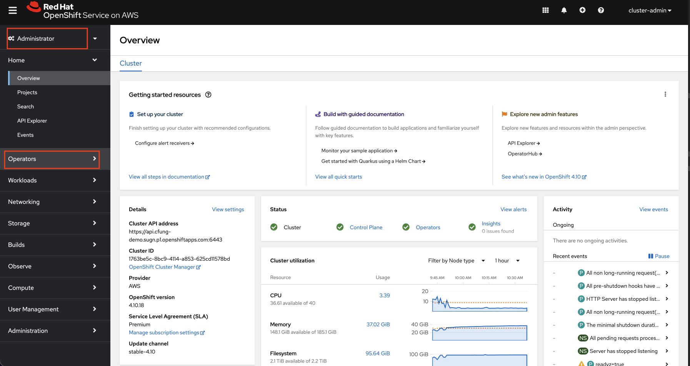

Red Hat OpenShift Dev Spaces (formally CodeReady Workspaces) is an Operator available for OpenShift that allows users to create dynamic IDEs for developing and publishing code. When using OpenShift Dev Spaces, users can test their code and have the service automatically create a route for users to see their code in real time. By default, this route will use the default Ingress Controller, but it is possible to configure Dev Spaces to use a custom domain instead.

## Prerequisites

* An OpenShift Cluster
* A configured custom domain, either via Custom Domain Operator (OSD/ROSA pre version 4.14) or Default Ingress (OSD/ROSA 4.14 onwards or ARO), with a CNAME forwarding your domain to the Load Balancer in front of your default ingress

## Installing OpenShift Dev Spaces

### Installing via the Console

1. Log into the Openshift cluster web console with cluster-admin credentials

1. On the left navigation pane under Administator perspective, select **Operators** --> **OperatorHub**

   

1. Search for and locate **OpenShift Dev Spaces**. Install the Operator by clicking the Install button

1. When installing, select the "YAML" tab option, and add the following under .spec.networking:

  ```yaml
  spec:
    networking:
      domain: $MY_CUSTOM_DOMAIN
  ```
  > Where $MY_CUSTOM_DOMAIN matches the domain name of the custom domain you have added to your cluster. I.E. If your custom domain for the cluster is `apps.mobb.ninja`, and you would like your applications to create hostnames such as `my-app.apps.mobb.ninja`, add `apps.mobb.ninja` here.

1. Application routes now created by OpenShift Dev Spaces will be created under your custom domain
