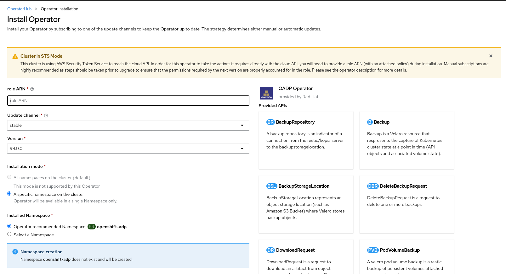

## Prerequisites

* [An STS enabled ROSA cluster](../../../rosa/sts)

## Getting Started

1. Create the following environment variables

   > Change the cluster name to match your ROSA cluster and ensure you're logged into the cluster as an Administrator. Ensure all fields are outputted correctly before moving on.

   ```bash
   export CLUSTER_NAME=my-cluster
   export ROSA_CLUSTER_ID=$(rosa describe cluster -c ${CLUSTER_NAME} --output json | jq -r .id)
   export REGION=$(rosa describe cluster -c ${CLUSTER_NAME} --output json | jq -r .region.id)
   export OIDC_ENDPOINT=$(oc get authentication.config.openshift.io cluster -o jsonpath='{.spec.serviceAccountIssuer}' | sed  's|^https://||')
   export AWS_ACCOUNT_ID=`aws sts get-caller-identity --query Account --output text`
   export CLUSTER_VERSION=`rosa describe cluster -c ${CLUSTER_NAME} -o json | jq -r .version.raw_id | cut -f -2 -d '.'`
   export ROLE_NAME="${CLUSTER_NAME}-openshift-oadp-aws-cloud-credentials"
   export AWS_PAGER=""
   export SCRATCH="/tmp/${CLUSTER_NAME}/oadp"
   mkdir -p ${SCRATCH}
   echo "Cluster ID: ${ROSA_CLUSTER_ID}, Region: ${REGION}, OIDC Endpoint: ${OIDC_ENDPOINT}, AWS Account ID: ${AWS_ACCOUNT_ID}"
   ```

## Prepare AWS Account

1. Create an IAM Policy to allow for S3 Access

   ```bash
   POLICY_ARN=$(aws iam list-policies --query "Policies[?PolicyName=='RosaOadpVer1'].{ARN:Arn}" --output text)
   if [[ -z "${POLICY_ARN}" ]]; then
   cat << EOF > ${SCRATCH}/policy.json
   {
   "Version": "2012-10-17",
   "Statement": [
     {
       "Effect": "Allow",
       "Action": [
         "s3:CreateBucket",
         "s3:DeleteBucket",
         "s3:PutBucketTagging",
         "s3:GetBucketTagging",
         "s3:PutEncryptionConfiguration",
         "s3:GetEncryptionConfiguration",
         "s3:PutLifecycleConfiguration",
         "s3:GetLifecycleConfiguration",
         "s3:GetBucketLocation",
         "s3:ListBucket",
         "s3:GetObject",
         "s3:PutObject",
         "s3:DeleteObject",
         "s3:ListBucketMultipartUploads",
         "s3:AbortMultipartUpload",
         "s3:ListMultipartUploadParts",
         "ec2:DescribeSnapshots",
         "ec2:DescribeVolumes",
         "ec2:DescribeVolumeAttribute",
         "ec2:DescribeVolumesModifications",
         "ec2:DescribeVolumeStatus",
         "ec2:CreateTags",
         "ec2:CreateVolume",
         "ec2:CreateSnapshot",
         "ec2:DeleteSnapshot"
       ],
       "Resource": "*"
     }
    ]}
   EOF
   POLICY_ARN=$(aws iam create-policy --policy-name "RosaOadpVer1" \
   --policy-document file:///${SCRATCH}/policy.json --query Policy.Arn \
   --tags Key=rosa_openshift_version,Value=${CLUSTER_VERSION} Key=rosa_role_prefix,Value=ManagedOpenShift Key=operator_namespace,Value=openshift-oadp Key=operator_name,Value=openshift-oadp \
   --output text)
   fi
   echo ${POLICY_ARN}
   ```

1. Create an IAM Role trust policy for the cluster

   ```bash
   cat <<EOF > ${SCRATCH}/trust-policy.json
   {
      "Version": "2012-10-17",
      "Statement": [{
        "Effect": "Allow",
        "Principal": {
          "Federated": "arn:aws:iam::${AWS_ACCOUNT_ID}:oidc-provider/${OIDC_ENDPOINT}"
        },
        "Action": "sts:AssumeRoleWithWebIdentity",
        "Condition": {
          "StringEquals": {
             "${OIDC_ENDPOINT}:sub": [
               "system:serviceaccount:openshift-adp:openshift-adp-controller-manager",
               "system:serviceaccount:openshift-adp:velero"]
          }
        }
      }]
   }
   EOF
   ROLE_ARN=$(aws iam create-role --role-name \
     "${ROLE_NAME}" \
      --assume-role-policy-document file://${SCRATCH}/trust-policy.json \
      --tags Key=rosa_cluster_id,Value=${ROSA_CLUSTER_ID} Key=rosa_openshift_version,Value=${CLUSTER_VERSION} Key=rosa_role_prefix,Value=ManagedOpenShift Key=operator_namespace,Value=openshift-adp Key=operator_name,Value=openshift-oadp \
      --query Role.Arn --output text)

   echo ${ROLE_ARN}
   ```

1. Attach the IAM Policy to the IAM Role

   ```bash
   aws iam attach-role-policy --role-name "${ROLE_NAME}" \
     --policy-arn ${POLICY_ARN}
   ```

## Deploy OADP on cluster

1. Create a namespace for OADP

   ```bash
   oc create namespace openshift-adp
   ```

1. Create a credentials secret

   ```bash
   cat <<EOF > ${SCRATCH}/credentials
   [default]
   role_arn = ${ROLE_ARN}
   web_identity_token_file = /var/run/secrets/openshift/serviceaccount/token
   EOF
   oc -n openshift-adp create secret generic cloud-credentials \
     --from-file=${SCRATCH}/credentials
   ```
> **NOTE:** If your OCP version is 4.14+, a new standardized STS workflow via OLM (Operator Lifecycle Manager)
and CCO (Cloud Credentials Operator) is supported by OADP Operator. In this workflow you do not need to create the above
secret, you just need to supply the role ARN during the operator installtion via OLM UI (Refer the screenshot below).
The above secret gets created automatically via CCO.


1. Deploy OADP Operator

> **NOTE:** there is currently an issue with 1.1 of the operator with backups 
that have a `PartiallyFailed` status.  This does not seem to affect the backup 
and restore process, but it should be noted as there are issues with it.

   ```bash
   cat << EOF | oc create -f -
   apiVersion: operators.coreos.com/v1
   kind: OperatorGroup
   metadata:
     generateName: openshift-adp-
     namespace: openshift-adp
     name: oadp
   spec:
     targetNamespaces:
     - openshift-adp
   ---
   apiVersion: operators.coreos.com/v1alpha1
   kind: Subscription
   metadata:
     name: redhat-oadp-operator
     namespace: openshift-adp
   spec:
     channel: stable-1.2
     installPlanApproval: Automatic
     name: redhat-oadp-operator
     source: redhat-operators
     sourceNamespace: openshift-marketplace
   EOF
   ```

1. Wait for the operator to be ready

   ```bash
   watch oc -n openshift-adp get pods
   ```

   ```
   NAME                                                READY   STATUS    RESTARTS   AGE
   openshift-adp-controller-manager-546684844f-qqjhn   1/1     Running   0          22s
   ```

1. Create Cloud Storage

   ```bash
   cat << EOF | oc create -f -
   apiVersion: oadp.openshift.io/v1alpha1
   kind: CloudStorage
   metadata:
     name: ${CLUSTER_NAME}-oadp
     namespace: openshift-adp
   spec:
     creationSecret:
       key: credentials
       name: cloud-credentials
     enableSharedConfig: true
     name: ${CLUSTER_NAME}-oadp
     provider: aws
     region: $REGION
   EOF
   ```

1. Check your application's storage default storage class

   ```
   oc get pvc -n <namespace>
   NAME     STATUS   VOLUME                                     CAPACITY   ACCESS MODES   STORAGECLASS   AGE
   applog   Bound    pvc-351791ae-b6ab-4e8b-88a4-30f73caf5ef8   1Gi        RWO            gp3-csi        4d19h
   mysql    Bound    pvc-16b8e009-a20a-4379-accc-bc81fedd0621   1Gi        RWO            gp3-csi        4d19h
   ```

   ```
   oc get storageclass
   NAME                PROVISIONER             RECLAIMPOLICY   VOLUMEBINDINGMODE      ALLOWVOLUMEEXPANSION   AGE
   gp2                 kubernetes.io/aws-ebs   Delete          WaitForFirstConsumer   true                   4d21h
   gp2-csi             ebs.csi.aws.com         Delete          WaitForFirstConsumer   true                   4d21h
   gp3                 ebs.csi.aws.com         Delete          WaitForFirstConsumer   true                   4d21h
   gp3-csi (default)   ebs.csi.aws.com         Delete          WaitForFirstConsumer   true                   4d21h
   ```

Using either gp3-csi, gp2-csi, gp3 or gp2 will work. If the application(s)
that are being backed up are all using PV's with CSI, we recommend including
the CSI plugin in the OADP DPA configuration.

1. Deploy a Data Protection Application - CSI only

   ```bash
   cat << EOF | oc create -f -
   apiVersion: oadp.openshift.io/v1alpha1
   kind: DataProtectionApplication
   metadata:
     name: ${CLUSTER_NAME}-dpa
     namespace: openshift-adp
   spec:
     features:
       dataMover:
         enable: false
     backupLocations:
     - bucket:
         cloudStorageRef:
           name: ${CLUSTER_NAME}-oadp
         credential:
           key: credentials
           name: cloud-credentials
         default: true
         config:
           region: ${REGION}
     configuration:
       velero:
         defaultPlugins:
         - openshift
         - aws
         - csi
       restic:
         enable: false
   EOF
   ```
2. Deploy a Data Protection Application - CSI or non-CSI volumes

   ```bash
   cat << EOF | oc create -f -
   apiVersion: oadp.openshift.io/v1alpha1
   kind: DataProtectionApplication
   metadata:
     name: ${CLUSTER_NAME}-dpa
     namespace: openshift-adp
   spec:
     features:
       dataMover:
         enable: false
     backupLocations:
     - bucket:
         cloudStorageRef:
           name: ${CLUSTER_NAME}-oadp
         credential:
           key: credentials
           name: cloud-credentials
         default: true
         config:
           region: ${REGION}
     configuration:
       velero:
         defaultPlugins:
         - openshift
         - aws
       restic:
         enable: false
     snapshotLocations:
       - velero:
           config:
             credentialsFile: /tmp/credentials/openshift-adp/cloud-credentials-credentials
             enableSharedConfig: 'true'
             profile: default
             region: ${REGION}
           provider: aws
   EOF
   ```

**Note** 
* The Restic feature ( restic.enable=false ) is disabled and not supported in Rosa STS environments.
* The DataMover feature ( dataMover.enable=false ) is disabled and not supported in Rosa STS environments.

## Perform a backup

**Note** the following sample hello-world application has no attached PV's.
Either DPA configuration will work.

1. Create a workload to backup

   ```bash
   oc create namespace hello-world
   oc new-app -n hello-world --image=docker.io/openshift/hello-openshift
   ```

1. Expose the route

   ```
   oc expose service/hello-openshift -n hello-world
   ```

1. Check the application is working.

   ```
   curl `oc get route/hello-openshift -n hello-world -o jsonpath='{.spec.host}'`
   ```
   ```
   Hello OpenShift!
   ```

1. Backup workload

   ```bash
   cat << EOF | oc create -f -
   apiVersion: velero.io/v1
   kind: Backup
   metadata:
     name: hello-world
     namespace: openshift-adp
   spec:
     includedNamespaces:
     - hello-world
     storageLocation: ${CLUSTER_NAME}-dpa-1
     ttl: 720h0m0s
   EOF
   ```

1. Wait until backup is done

   ```bash
   watch "oc -n openshift-adp get backup hello-world -o json | jq .status"
   ```

   ```json
   {
     "completionTimestamp": "2022-09-07T22:20:44Z",
     "expiration": "2022-10-07T22:20:22Z",
     "formatVersion": "1.1.0",
     "phase": "Completed",
     "progress": {
       "itemsBackedUp": 58,
       "totalItems": 58
     },
     "startTimestamp": "2022-09-07T22:20:22Z",
     "version": 1
   }
   ```

1. Delete the demo workload

   ```bash
   oc delete ns hello-world
   ```

1. Restore from the backup

   ```bash
   cat << EOF | oc create -f -
   apiVersion: velero.io/v1
   kind: Restore
   metadata:
     name: hello-world
     namespace: openshift-adp
   spec:
     backupName: hello-world
   EOF
   ```

1. Wait for the Restore to finish

   ```bash
   watch "oc -n openshift-adp get restore hello-world -o json | jq .status"
   ```

   ```
   {
     "completionTimestamp": "2022-09-07T22:25:47Z",
     "phase": "Completed",
     "progress": {
       "itemsRestored": 38,
       "totalItems": 38
     },
     "startTimestamp": "2022-09-07T22:25:28Z",
     "warnings": 9
   }
   ```

1. Check the workload is restored

   ```bash
   oc -n hello-world get pods
   ```

   ```
   NAME                              READY   STATUS    RESTARTS   AGE
   hello-openshift-9f885f7c6-kdjpj   1/1     Running   0          90s
   ```

   ```
   curl `oc get route/hello-openshift -n hello-world -o jsonpath='{.spec.host}'`
   ```
   ```
   Hello OpenShift!
   ```

1. For troubleshooting tips please refer to the OADP team's [troubleshooting documentation](https://github.com/openshift/oadp-operator/blob/master/docs/TROUBLESHOOTING.md)

1. Additional sample applications can be found in the OADP team's [sample applications directory](https://github.com/openshift/oadp-operator/tree/master/tests/e2e/sample-applications)


## Cleanup

1. Delete the workload

   ```bash
   oc delete ns hello-world
   ```

1. Delete the Data Protection Application

   ```bash
   oc -n openshift-adp delete dpa ${CLUSTER_NAME}-dpa
   ```

1. Delete the Cloud Storage

   ```bash
   oc -n openshift-adp delete cloudstorage ${CLUSTER_NAME}-oadp
   ```

> **WARNING:** if this command hangs, you may need to delete the finalizer:

  ```bash
  oc -n openshift-adp patch cloudstorage ${CLUSTER_NAME}-oadp -p '{"metadata":{"finalizers":null}}' --type=merge
  ```

1. Remove the operator if it is no longer required:

  ```bash
  oc -n openshift-adp delete subscription oadp-operator
  ```

1. Remove the namespace for the operator:

  ```bash
  oc delete ns openshift-adp
  ```

1. Remove the backup and restore resources from the cluster if they are no longer required:

  ```bash
  oc delete backup hello-world
  oc delete restore hello-world
  ```

  To delete the backup/restore and remote objects in s3

  ```bash
  velero backup delete hello-world
  velero restore delete hello-world
  ```

1. Remove the Custom Resource Definitions from the cluster if you no longer wish to have them:

  ```bash
  for CRD in `oc get crds | grep velero | awk '{print $1}'`; do oc delete crd $CRD; done
  for CRD in `oc get crds | grep -i oadp | awk '{print $1}'`; do oc delete crd $CRD; done
  ```

1. Delete the AWS S3 Bucket

   ```bash
   aws s3 rm s3://${CLUSTER_NAME}-oadp --recursive
   aws s3api delete-bucket --bucket ${CLUSTER_NAME}-oadp
   ```

1. Detach the Policy from the role

   ```bash
   aws iam detach-role-policy --role-name "${ROLE_NAME}" \
     --policy-arn "${POLICY_ARN}"
   ```

1. Delete the role

   ```bash
   aws iam delete-role --role-name "${ROLE_NAME}"
   ```
