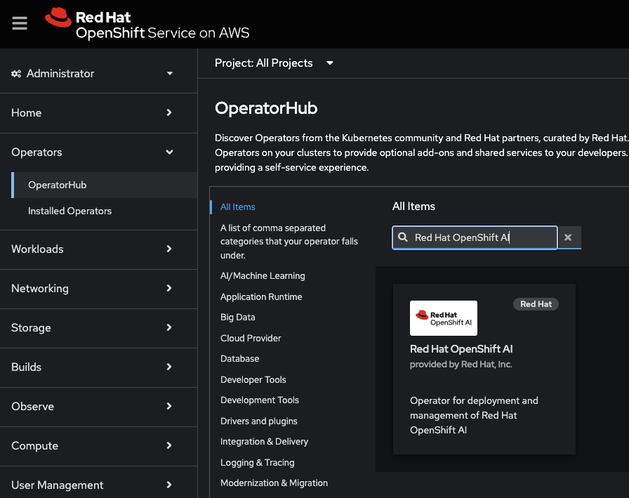
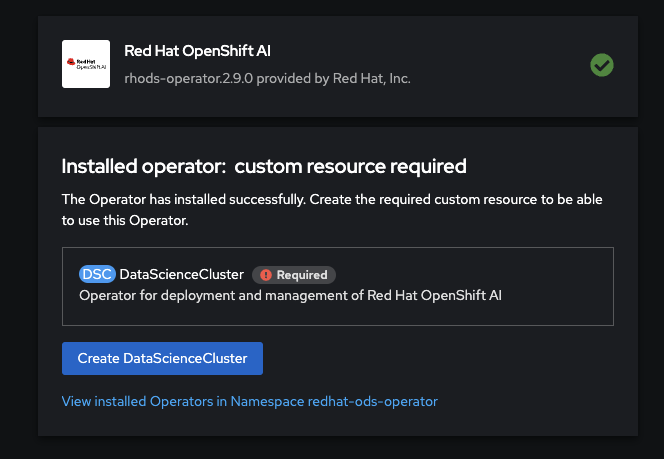
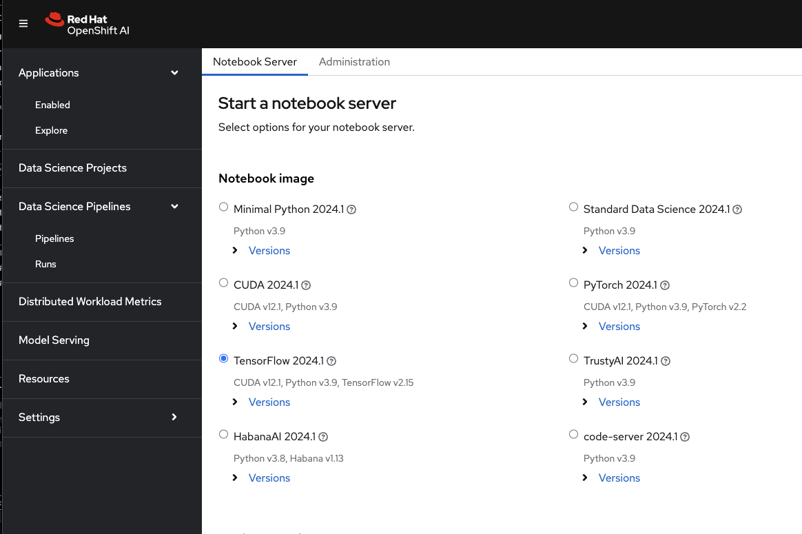
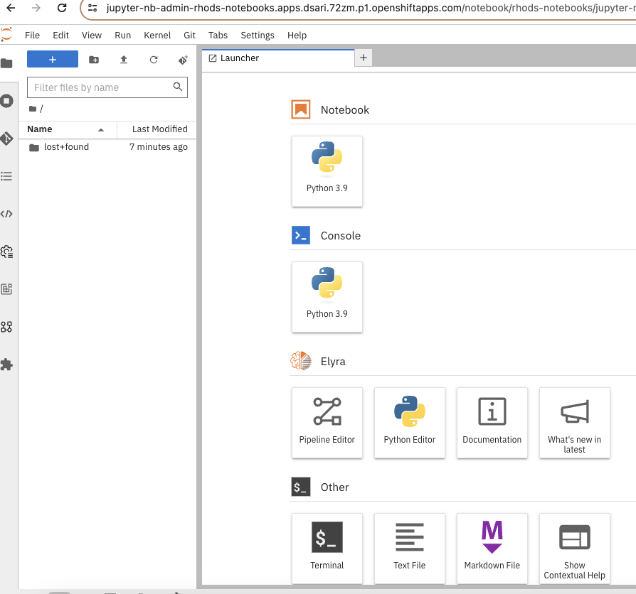
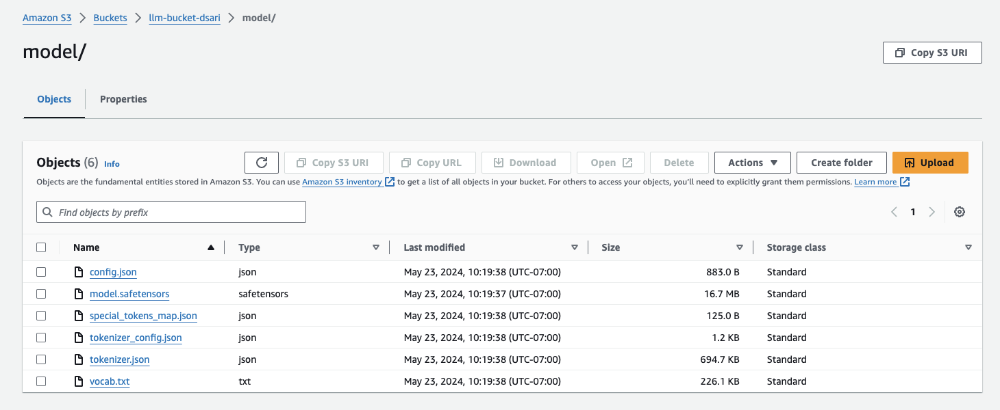

## 1. Introduction
[Large Language Models (LLMs)](https://en.wikipedia.org/wiki/Large_language_model) are a specific type of generative AI focused on processing and generating human language. They can understand, generate, and manipulate human language in response to various tasks and prompts.

This guide is a simple example on how to run and deploy LLMs on a [Red Hat OpenShift Services on AWS (ROSA)](https://www.redhat.com/en/technologies/cloud-computing/openshift/aws) cluster, which is our managed service OpenShift platform on AWS, using [Red Hat OpenShift AI (RHOAI)](https://www.redhat.com/en/technologies/cloud-computing/openshift/openshift-ai), which is formerly called Red Hat OpenShift Data Science (RHODS) and is our OpenShift platform for managing the entire lifecycle of AI/ML projects. And we will utilize [Amazon S3](https://aws.amazon.com/s3/) bucket to store the model output. In essence, here we will first install RHOAI operator and Jupyter notebook, create the S3 bucket, and then run the model.  

*Please note that the UI may change from time to time so what you see in the snippets below might change as well.*

## 2. Prerequisites
* [ROSA cluster](/experts/rosa/sts/) 
    - In this case I'm using a single-AZ ROSA 4.15.10 cluster with m5.4xlarge node with auto-scaling enabled up to 10 nodes. The cluster has 64 vCPUs with ~278Gi memory. 
    - Note that ROSA and RHOAI also support [GPU](https://cloud.redhat.com/experts/rosa/gpu/), however, for the sake of simplicity, I'll only be using CPU for compute in this guide.
    - Please be sure that you have cluster admin access of the cluster.
* oc cli


## 3. Installing RHOAI and Jupyter notebook
From your cluster console, go to **OperatorHub** under **Operators** from the left tab, and put **Red Hat OpenShift AI** into the search query and install the operator. The most recent version of the operator in the time of writing is 2.9.0, and here I choose the default option for the installation, and thus the operator will be installed in the `redhat-ods-operator` namespace which will be created automatically upon installation.


<br />

Afterward, create `DataScienceCluster`(DSC) instance. I also choose the default option for the installation, and thus the name of the DSC instance is called `default-dsc`. 


<br />

This is how it looks like once the instance is created:


<br />

Next, go to your cluster console and click the 9-boxes icon on the upper right side (next to the bell/notification icon), and select **Red Hat OpenShift AI** to launch it on the next tab. 


<br />

Once launched, go to the server page and on the left tab, look under **Applications** and select **Enabled**. And then launch **Jupyter** to see the notebook options available to install. In this case, I choose **TensorFlow 2024.1** and I leave the size of container to **small** which is the default. And finally, click **Start server** button at the bottom. Note that if the server failed to start, then you might want to scale up your worker nodes.

  
<br />

The server installation will take several minutes. Once installed, you'll see the main page of your Jupyter notebook like below and select a Python 3.9 notebook to start the next section.

  
<br />

This below is how the notebook looks like on the new tab:

  

## 4. Creating and granting access to S3 bucket
There are actually several ways to go about granting S3 access to the pods running in your ROSA cluster, e.g. setting the credentials as environment variables in the notebook, using pod identity/IRSA (IAM Roles for Service Accounts) to authenticate the pods to S3, and installing AWS CLI in the cluster, among others. [Using pod identity/IRSA](https://docs.openshift.com/rosa/authentication/assuming-an-aws-iam-role-for-a-service-account.html#how-service-accounts-assume-aws-iam-roles-in-user-defined-projects_assuming-an-aws-iam-role-for-a-service-account) is the better option here since you don't need to manage the credentials yourself, however, for the sake of simplicity, in this guide, I'll install the CLI in the cluster instead and then using `aws configure` to provide the credentials. That said, be sure that you have your AWS access key and secret access key handy. You could [create new keys](https://aws.amazon.com/blogs/security/how-to-find-update-access-keys-password-mfa-aws-management-console/) in the IAM section from the AWS console if you lost yours.  

Now login to your cluster and go to the namespace where your notebook is located.
```
oc project rhods-notebooks
```
And run the following and make sure that your pods are running.
``` 
oc get pods
```
Once you have the name of the pod (in may case it is called `jupyter-nb-admin-0`), exec into it:
```
oc exec -it jupyter-nb-admin-0 -- /bin/bash
```
Next, let's install the AWS CLI in that pod:
```
curl "https://awscli.amazonaws.com/awscli-exe-linux-x86_64.zip" -o "awscliv2.zip"
unzip awscliv2.zip
./aws/install -i ~/.local/aws-cli -b ~/.local/bin
```
Then modify your PATH environment:
```
export PATH=~/.local/bin:$PATH
```
And finally, verify the version to make sure that it is correctly installed:
```
aws --version
```

Once it is correctly installed, be sure that you have your AWS Access Key ID and AWS Secret Access Key ready, and run the following command:
```
aws configure
```
You would want to selct the region where your cluster is located. You could verify the configuration by running simple command such as listing the S3 buckets like below:
```
aws s3 ls
```

Once the credentials matter is sorted, let's create an S3 bucket in your AWS account. Again, there are many ways to go about this. The easiest would be to go to your AWS console and create the bucket in your region from there and leave all the settings to default. Alternatively, you can run this command to create a bucket (in my case I named it `llm-bucket-dsari` and my cluster region is `us-west-2`):
```
aws s3 mb s3://llm-bucket-dsari --region us-west-2
```


## 5. Training LLM model
Now that you have the notebook installed, AWS CLI and credentials configured, and an S3 bucket created, let's run your model on the notebook. In this guide, we will use Hugging Face Transformers library to fine-tune a pre-trained model, i.e. `prajjwal1/bert-tiny`, on a small subset of the `AG News` dataset for text classification. [Hugging Face](https://huggingface.co/) (also referred to as 🤗) is an open-source library providing a wide range pre-trained models and tools for [natural language processing](https://en.wikipedia.org/wiki/Natural_language_processing) tasks. [AG News](https://huggingface.co/datasets/ag_news) is a dataset consisting of news articles from various sources and it is commonly used for text classification tasks. [prajwall1/bert-tiny](https://huggingface.co/prajjwal1/bert-tiny) is a very small version of the [BERT](https://en.wikipedia.org/wiki/BERT_(language_model)) model, which is a transformer-based model pre-trained on a large corpus of text data. 

The code for the notebook and the explanation of each on the commented lines (and please change the bucket name to your own bucket name):
```
# install the necessary libraries
!pip install transformers datasets torch evaluate accelerate boto3

# import the necessary functions and APIs
import numpy as np
import evaluate
import boto3
import os
from datasets import load_dataset
from transformers import AutoTokenizer, AutoModelForSequenceClassification, TrainingArguments, Trainer

# disable tokenizers parallelism warning
os.environ["TOKENIZERS_PARALLELISM"] = "false"

# load a portion of the AG News dataset (500 examples)
dataset = load_dataset("ag_news")
small_dataset = dataset["train"].shuffle(seed=42).select(range(500))  

# load the model (prajjwal1/bert-tiny), tokenizer, and pre-trained model
model_name = "prajjwal1/bert-tiny"
tokenizer = AutoTokenizer.from_pretrained(model_name)
model = AutoModelForSequenceClassification.from_pretrained(model_name, num_labels=4)

# define the function to tokenize text examples using the loaded tokenizer
def tokenize_function(examples):
    return tokenizer(examples["text"], padding="max_length", truncation=True)

# apply the tokenize_function to the small_dataset using map function
tokenized_datasets = small_dataset.map(tokenize_function, batched=True)

# specify the training arguments, i.e. output directory, evaluation strategy, learning rate, batch size, number of epochs, weight decay, and load the best model at the end
training_args = TrainingArguments(
    output_dir="./results",
    eval_strategy="epoch",
    save_strategy="epoch",
    learning_rate=2e-5,
    per_device_train_batch_size=8,  
    per_device_eval_batch_size=8,
    num_train_epochs=3,  
    weight_decay=0.01,
    load_best_model_at_end=True,
)

# load the accuracy metric from the evaluate library
metric = evaluate.load("accuracy")

# compute evaluate metrics by taking the eval predictions (logits and labels) and calculate the accuracy using the loaded metric
def compute_metrics(eval_pred):
    logits, labels = eval_pred
    predictions = np.argmax(logits, axis=-1)
    return metric.compute(predictions=predictions, references=labels)

# set up the training process by taking the model, training arguments, train and eval datasets, tokenizer and the compute_metrics function
trainer = Trainer(
    model=model,
    args=training_args,
    train_dataset=tokenized_datasets,
    eval_dataset=tokenized_datasets,  
    tokenizer=tokenizer,
    compute_metrics=compute_metrics,
)

# start the training process using the configured trainer
trainer.train()

# save the model and tokenizer into model folder
model_save_dir = "./model"
tokenizer.save_pretrained(model_save_dir)
model.save_pretrained(model_save_dir)

# upload the saved model to s3 bucket
s3_client = boto3.client('s3')
bucket_name = 'llm-bucket-dsari' # please change this with your own bucket name
model_save_path = 'model/'

for file_name in os.listdir(model_save_dir):
    s3_client.upload_file(
        os.path.join(model_save_dir, file_name),
        bucket_name,
        model_save_path + file_name
    )
```

In summary, the code loads the dataset, tokenizes the text examples, sets up the training arguments, defines the evaluation metrics, and trains the model using the `Trainer` class. Finally, it saves the trained model and tokenizer locally and then upload and save them to the S3 bucket. 

After you run it, you should see an output similar to the following (note that this may vary): 


<br />

Here the results suggest that the model is learning and improving over the epochs based on the increasing accuracy and decreasing losses. However, the final accuracy of only 45.8% is low indicating that the model's performance is suboptimal. This is understandable because the model is trained on a very small subset of the dataset, i.e. 500 examples, and we're also using a very small version of BERT model, i.e. `prajjwal1/bert-tiny`. That said, you might want to try larger dataset and larger model in your experiment if you like. In addition, you could also fine-tune the hyperparameters to make it more optimal for the training process (FYI, I have a bonus section on this one at the end if you're interested in doing it).

Some error notes that you might see:
- *Unable to register cuDNN/cuFFT/cuBLAS factory...*: These errors are informational and generally harmless. They indicate that multiple components are trying to initialize the same CUDA libraries, but it shouldn't affect the training process.
- *This TensorFlow binary is optimized to use available CPU instructions...*: This is a warning from TensorFlow indicating that your CPU may not support certain instructions (AVX2, AVX512F, FMA), and since we're not using a GPU, this warning is expected.
- *TF-TRT Warning: Could not find TensorRT*: TensorRT is NVIDIA's library for optimizing deep learning models. This warning just means it's not available, which is fine since we're not using it.
- *Some weights of BertForSequenceClassification were not initialized...*: This is a standard message when you're fine-tuning a model. It indicates that some parts of the model will be trained from scratch to adapt to your specific task, i.e. text classification on AG News.
    
Last but not least, do not forget to save your notebook. On your left tab, you would see the `model` folder where the results, i.e. the model and tokenizer, were saved. You can also see `results` folder where inside it you'll see `runs` folder for every runs you make. In addition, if you go to the S3 bucket in the console, you will see the output stored in the `model` folder:



## 6. Future research
This is a very simple guide aimed to get you started with RHOAI on ROSA. As mentioned previously, you could improve the accuracy by increasing the dataset size and running a more robust model, and we can leverage GPU to support that. Another idea is to extend the workload to AWS SageMaker and/or AWS Lambda. In addition, RHOAI itself has a section where you can run the code as pipeline which I haven't had a chance to venture at this time. All of these would be great topic for future blogs.
<br />
<br />

#### Bonus section: Performing hyperparameter tuning 
**This is an optional section so feel free to skip it.**

There are many ways to go about performing [hyperparameter tuning](https://en.wikipedia.org/wiki/Hyperparameter_optimization) for your model to improve the model accuracy. Here I'll be using [optuna](https://optuna.readthedocs.io/en/stable/), which is a popular library to optimize hyperparameter. It essentially allows you to define the search space for each hyperparameter and automatically finds the best combination based on the specified objective. 

This is the code example that you can run on the notebook:
```
!pip install transformers datasets torch evaluate accelerate boto3 optuna

import numpy as np
import evaluate
import optuna
import boto3
import os
from datasets import load_dataset
from transformers import AutoTokenizer, AutoModelForSequenceClassification, TrainingArguments, Trainer

os.environ["TOKENIZERS_PARALLELISM"] = "false"

dataset = load_dataset("ag_news")
small_dataset = dataset["train"].shuffle(seed=42).select(range(500)) 

model_name = "prajjwal1/bert-tiny"
tokenizer = AutoTokenizer.from_pretrained(model_name)
model = AutoModelForSequenceClassification.from_pretrained(model_name, num_labels=4)

def tokenize_function(examples):
    return tokenizer(examples["text"], padding="max_length", truncation=True)

tokenized_datasets = small_dataset.map(tokenize_function, batched=True)

def compute_metrics(eval_pred):
    metric = evaluate.load("accuracy")
    logits, labels = eval_pred
    predictions = np.argmax(logits, axis=-1)
    return metric.compute(predictions=predictions, references=labels)

# define the objectives, i.e. the hyperparameters to tune, the training arguments, train the model, and evaluate them
def objective(trial):
    learning_rate = trial.suggest_loguniform("learning_rate", 1e-5, 5e-5)
    per_device_train_batch_size = trial.suggest_categorical("per_device_train_batch_size", [4, 8, 16])
    num_train_epochs = trial.suggest_int("num_train_epochs", 2, 4)
    
    training_args = TrainingArguments(
        output_dir="./results",
        eval_strategy="epoch",
        save_strategy="epoch",
        learning_rate=learning_rate,
        per_device_train_batch_size=per_device_train_batch_size,
        num_train_epochs=num_train_epochs,
        weight_decay=0.01,
        load_best_model_at_end=True,
    )

    metric = evaluate.load("accuracy")

    def compute_metrics(eval_pred):
        logits, labels = eval_pred
        predictions = np.argmax(logits, axis=-1)
        return metric.compute(predictions=predictions, references=labels)

    trainer = Trainer(
        model=model,
        args=training_args,
        train_dataset=tokenized_datasets,
        eval_dataset=tokenized_datasets,  
        tokenizer=tokenizer,
        compute_metrics=compute_metrics,
    )
    
    trainer.train()
    
    eval_metrics = trainer.evaluate()
    return eval_metrics["eval_accuracy"]

# run hyperparameter search
study = optuna.create_study(direction="maximize")
study.optimize(objective, n_trials=9)

# find the best parameter and accuracy
best_params = study.best_params
best_accuracy = study.best_value

print("Best hyperparameters:", best_params)
print("Best accuracy:", best_accuracy)

# train the model with the best hyperparameters
best_model = AutoModelForSequenceClassification.from_pretrained(model_name, num_labels=4)
trainer = Trainer(
    model=best_model,
    args=TrainingArguments(
        output_dir="./results",
        eval_strategy="epoch",
        save_strategy="epoch",
        learning_rate=best_params["learning_rate"],
        per_device_train_batch_size=best_params["per_device_train_batch_size"],
        num_train_epochs=best_params["num_train_epochs"],
        weight_decay=0.01,
        load_best_model_at_end=True,
    ),
    train_dataset=tokenized_datasets,
    eval_dataset=tokenized_datasets,
    tokenizer=tokenizer,
    compute_metrics=compute_metrics,
)
trainer.train()

model_save_dir = "./model"
tokenizer.save_pretrained(model_save_dir)
best_model.save_pretrained(model_save_dir)

s3_client = boto3.client('s3')
bucket_name = 'llm-bucket-dsari' # please change this to your bucket name
model_save_path = 'model/'

for file_name in os.listdir(model_save_dir):
    s3_client.upload_file(
        os.path.join(model_save_dir, file_name),
        bucket_name,
        model_save_path + file_name
    )
```
Here we are using the same dataset and the same model, however, the main difference between this code and the one before is that here we define an `objective` function that takes an `optuna` trial as input and we create `Trainer` instance with the tuned hyperparameters and train the model. Then, we create an `optuna` study and optimize the `objective` function and lastly, we retrieve the best hyperparameter and its accuracy. Note that the code could run for a bit longer than before as it keeps running trials and the final results may vary, but in my case, the final epoch reach 94.6% accuracy.


<br />

Note that this is just an example of hyperparameter tuning and there are many other methods that you can try such as [grid and random search](https://www.kaggle.com/code/willkoehrsen/intro-to-model-tuning-grid-and-random-search),[Bayesian optimization](https://towardsdatascience.com/a-conceptual-explanation-of-bayesian-model-based-hyperparameter-optimization-for-machine-learning-b8172278050f), and so forth. And the good thing is that many ML frameworks and libraries already have built-in utilities for hyperparameter tuning which makes it easier to apply in practice. 
