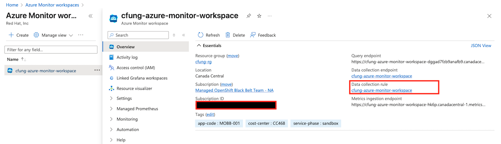
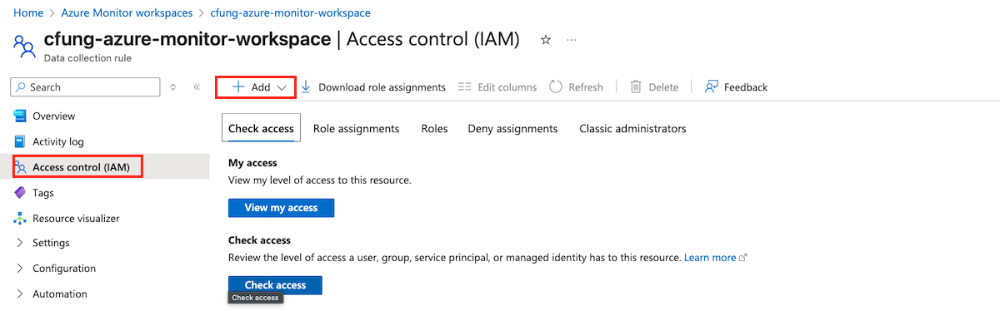
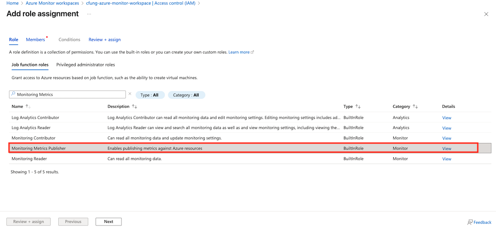
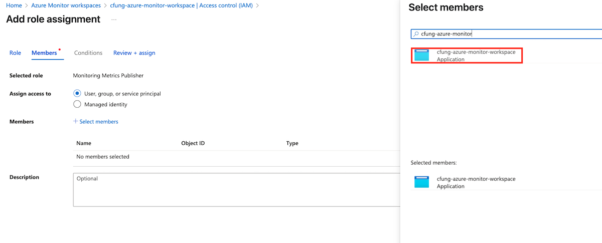
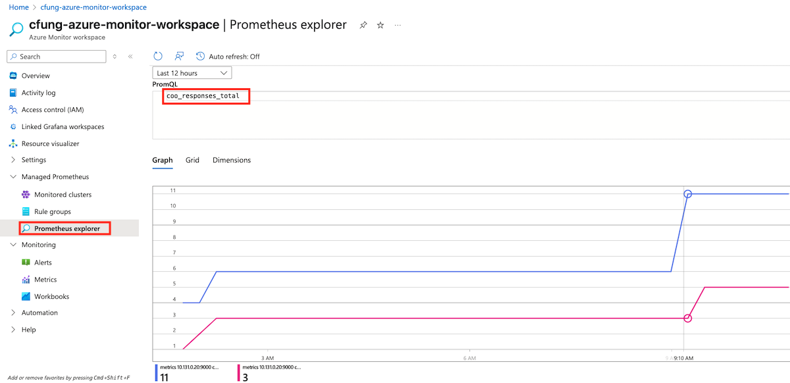
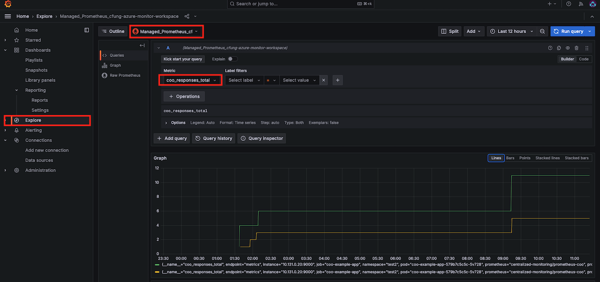

The Cluster Observability Operator (COO) is an optional OpenShift Container Platform Operator that enables administrators to create standalone monitoring stacks that are independently configurable for use by different services and users.

Deploying COO helps you address monitoring requirements that are hard to achieve using the default monitoring stack. COO is ideal for users who need high customizability, scalability, and long-term data retention, especially in complex, multi-tenant enterprise environments. 

This guide will walk users through an example of how to use the COO to set up a highly available Prometheus instance that persists metrics, and enables remote writes of metrics to an Azure Monitor Prometheus

## Prerequisites

1. You have access to the cluster as a cluster-admin
1. Follow the OpenShift documentation for [Installing the Cluster Observability operator](https://docs.redhat.com/en/documentation/openshift_container_platform/4.14/html/cluster_observability_operator/installing-cluster-observability-operators#installing-the-cluster-observability-operator-in-the-web-console-_installing_the_cluster_observability_operator)

## Set up Azure Monitor Workspace/Grafana

### Create Azure Monitor Workspace

> Note: In this tutorial, all of the Azure resources will be created in the same resource group as the cluster

1. Follow the Microsoft documentation to [Create an Azure Monitor Workspace](https://learn.microsoft.com/en-us/azure/azure-monitor/essentials/azure-monitor-workspace-manage?tabs=azure-portal#create-an-azure-monitor-workspace)
 
### Create and Link Azure Managed Grafana

1. Follow the Microsoft documentation to [Create an Azure Managed Grafana Workspace](https://learn.microsoft.com/en-us/azure/managed-grafana/quickstart-managed-grafana-portal#create-an-azure-managed-grafana-workspace)
1. Proceed to link the Grafana instance to your Azure Monitor workspace following the Microsoft documentation [Link a grafana workspace](https://learn.microsoft.com/en-us/azure/azure-monitor/essentials/azure-monitor-workspace-manage?tabs=azure-portal#link-a-grafana-workspace)

### Create a Service Principal for use with Azure Monitor Workspace 

```bash
SERVICE_PRINCIPAL_CLIENT_SECRET="$(az ad sp create-for-rbac --name cfung-azure-monitor-workspace --query 'password' -otsv)"

SERVICE_PRINCIPAL_CLIENT_ID="$(az ad sp list --display-name cfung-azure-monitor-workspace --query '[0].appId' -otsv)"
```

### Give the Service Principal permisssions to publish metrics to your Azure Monitor Workspace

1. Go to the Azure portal. On the resource menu for your Azure Monitor workspace, select **Overview**. For **Data collection rule**, select the link.

   

1. On the resource menu for the data collection rule, select **Access control (IAM)**.  Select **+ Add**, and then select **Add role assignment**

   

1. Select the **Monitoring Metrics Publisher** role, and then select **Next**
 
   

1. Select **User, group, or service principal**, and then choose **+select members**. Select the Service principal name that you created in the previous step, and then choose Select.
    
    

1. To complete the role assignment, select **Review + assign**.
 
## Configuring the Cluster Observability Operator to monitor services

1. Create a project for COO monitoring resources

   ```bash
   oc new-project centralized-monitoring
   ```

1. Create a secret for COO prometheus to use to ship metrics to Azure Monitor prometheus

   ```bash
   oc create secret generic azuremonitor-secret \
   -n centralized-monitoring \
   --from-literal clientid=${SERVICE_PRINCIPAL_CLIENT_ID} \
   --from-literal clientsecret=${SERVICE_PRINCIPAL_CLIENT_SECRET}
   ```

1. Create 2 additonal projects and label them. These will be used to deploy 2 sample applications

   ```bash
   oc new-project test1
   oc new-project test2
   oc label namespace test1 monitored=enabled
   oc label namespace test2 monitored=enabled
   ```

### Deploy Sample app and ServiceMonitor in namespace test1

1. Deploy a sample application in project test1

    ```bash
    cat <<EOF | oc apply -f -
    apiVersion: apps/v1
    kind: Deployment
    metadata:
      labels:
        app: prometheus-coo-example-app
      name: prometheus-coo-example-app
      namespace: test1
    spec:
      replicas: 1
      selector:
        matchLabels:
          app: prometheus-coo-example-app
      template:
        metadata:
          labels:
            app: prometheus-coo-example-app
        spec:
          containers:
          - image: ghcr.io/rhobs/prometheus-example-app:0.4.2
            name: prometheus-coo-example-app
   
    ---
    apiVersion: v1
    kind: Service
    metadata:
      labels:
        app: prometheus-coo-example-app
      name: prometheus-coo-example-app
      namespace: test1
    spec:
      ports:
      - port: 8080
        protocol: TCP
        targetPort: 8080
        name: web
      selector:
        app: prometheus-coo-example-app
      type: ClusterIP
    EOF
    ```

1. Verify that the pod is running 

   ```bash
   oc -n test1 get pod
   ```

1. Create a ServiceMonitor object to specify how the service created above is to be monitored

    ```bash
    cat <<EOF | oc apply -f -
    apiVersion: monitoring.rhobs/v1
    kind: ServiceMonitor
    metadata:
      name: prometheus-coo-example-monitor
      labels:
        monitoredby: prometheus-coo
      namespace: test1
    spec:
      endpoints:
      - port: web
        scheme: http
        interval: 30s
      selector:
        matchLabels:
          app: prometheus-coo-example-app
    EOF
    ```

### Deploy Sample app and ServiceMonitor in namespace test2

1. Deploy sample app using CRD below 

    ```bash
    cat <<EOF | oc apply -f -
    apiVersion: apps/v1
    kind: Deployment
    metadata:
      name: coo-example-app
      namespace: test2
    spec:
      replicas: 1
      selector:
        matchLabels:
          app: coo-example-app
      template:
        metadata:
          labels:
            app: coo-example-app
        spec:
          containers:
          - name: httpserver
            image: registry.access.redhat.com/ubi9/python-311:1
            command:
            - bash
            - -c
            - |2-
              pip install prometheus_client && python - <<EOF
              from http.server import BaseHTTPRequestHandler, HTTPServer
              from prometheus_client import start_http_server, Counter
              class HTTPRequestHandler(BaseHTTPRequestHandler):
                def do_GET(self):
                  if self.path == '/':
                    self.send_response(200)
                    self.end_headers()
                    self.wfile.write(b'<html>Hello!</html>\n')
                    respCtr.labels(response='200').inc()
                  else:
                    self.send_error(404)
                    respCtr.labels(response='404').inc()
              start_http_server(9000)
              respCtr = Counter('coo_responses','Responses',["response"])
              HTTPServer(("", 8080), HTTPRequestHandler).serve_forever()
              EOF
   
    ---
    kind: Service
    apiVersion: v1
    metadata:
      name: coo-example-app
      namespace: test2
      labels:
        app: coo-example-app
    spec:
      ports:
      - name: http
        port: 8080
      - name: metrics
        port: 9000
      selector:
        app: coo-example-app
    EOF
    ```

1. Verify that the pod is running 

    ```bash
    oc -n test2 get pod
    ```

1. Create a ServiceMonitor object to specify how the service created above is to be monitored

    ```bash
    cat <<EOF | oc apply -f -
    apiVersion: monitoring.rhobs/v1
    kind: ServiceMonitor
    metadata:
      name: coo-example-app
      labels:
        monitoredby: prometheus-coo
      namespace: test2
    spec:
      endpoints:
      - port: metrics
        interval: 30s
      selector:
        matchLabels:
          app: coo-example-app
    EOF
    ```

### Create a Cluster Observability Operator MonitoringStack 

1. Use the CRD below to create the COO MonitoringStack(the equivalent of a Prometheus stack) in the centralized-monitoring project. The MonitoringStack will be used to monitor the applications created above. The configuration creates a single Prometheus replica, retains metrics for 5 days, adds persistent storage to the Prometheus instance, and enables the remote writing of metrics to your Azure Monitor workspace. 

    Replace **{{INGESTION-URL}}** value below with the **Metrics ingestion endpoint** from the Overview page for the Azure Monitor workspace. 

    ```bash
    TENANT_ID=$(az account get-access-token --query tenant --output tsv)
    cat <<EOF | oc apply -f -
    apiVersion: monitoring.rhobs/v1alpha1
    kind: MonitoringStack
    metadata:
      name: prometheus-coo
      namespace: centralized-monitoring
      labels:
        coo: prometheus-coo
    spec:
      logLevel: debug
      retention: 5d
      namespaceSelector:
        matchLabels:
          monitored: enabled
      resourceSelector:
        matchLabels:
          monitoredby: prometheus-coo
      prometheusConfig:
        persistentVolumeClaim:
          accessModes:
            - ReadWriteOnce
          resources:
            requests:
              storage: 10Gi
          storageClassName: managed-csi
          volumeMode: Filesystem
        remoteWrite:
          - url: "{{INGESTION-URL}}"
            oauth2:
              clientId:
                secret:
                  name: azuremonitor-secret
                  key: clientid
              clientSecret:
                name: azuremonitor-secret
                key: clientsecret
              tokenUrl: "https://login.microsoftonline.com/$TENANT_ID/oauth2/v2.0/token"
              scopes:
                - "https://monitor.azure.com/.default"
        replicas: 1 #For higher availability, set 2 replicas
        scrapeInterval: 30s
    EOF
    ```

1. Confirm your Prometheus instance is running successfully by running the following command:

    ```bash
    oc get pods -n centralized-monitoring
    ```
  
    Example output

    ```
      NAME                            READY   STATUS    RESTARTS   AGE
      alertmanager-prometheus-coo-0   2/2     Running   0          2m42s
      alertmanager-prometheus-coo-1   2/2     Running   0          2m42s
      prometheus-prometheus-coo-0     3/3     Running   0          2m43s  
    ``` 
    
    >Note that 2 alertmanager instances are also created, which you can configure to set up custom alerting. We will not be covering that in this guide. 

To disable alertmanager, set the following in the `spec:` section of the COO MonitoringStack CRD

```
spec:
  alertmanagerConfig:
    disabled: true
```

## Validating the Monitoring Stack

### Generate Metrics

1. Expose your applications by creating routes
   
    ```bash
    oc expose svc prometheus-coo-example-app -n test1
    oc expose svc coo-example-app -n test2
    ```

1. Access the routes from your browser or terminal to generate metrics

    Run the command below to get the route url
    
    ```bash
    oc get route prometheus-coo-example-app -n test1
    oc get route coo-example-app -n test2
    ```
    
   Use the `HOST/PORT` output to access the applications and generate metrics

1. Execute a query on the Prometheus pod to return the total HTTP request metric

    ```bash
    oc -n centralized-monitoring exec -c prometheus prometheus-prometheus-coo-0 -- curl -s 'http://localhost:9090/api/v1/query?query=http_requests_total'
    ```
    
    Example output

    ```
        {
        "status": "success",
        "data": {
        "resultType": "vector",
        "result": [
        {
            "metric": {
            "__name__": "http_requests_total",
            "code": "200",
            "endpoint": "web",
            "instance": "10.131.0.18:8080",
            "job": "prometheus-coo-example-app",
            "method": "get",
            "namespace": "test1",
            "pod": "prometheus-coo-example-app-6d57b4d844-255cr",
            "service": "prometheus-coo-example-app"
            },
            "value": [
            1744876084.1,
            "7"
            ]
        },
        {
            "metric": {
            "__name__": "http_requests_total",
            "code": "404",
            "endpoint": "web",
            "instance": "10.131.0.18:8080",
            "job": "prometheus-coo-example-app",
            "method": "get",
            "namespace": "test1",
            "pod": "prometheus-coo-example-app-6d57b4d844-255cr",
            "service": "prometheus-coo-example-app"
            },
            "value": [
            1744876084.1,
            "0"
            ]
        }
        ]
    }
    ```

### View Metrics in Azure Monitor 

1. Navigate to your Azure Monitor Worskspace and run the following PromQL  query in the Prometheus explorer
    
    ```bash
    coo_responses_total
    ```

   Example output 

    

### View Metrics in Grafana 

1. In the Azure portal, navigate to your Azure Grafana workspace. In the Overview tab's Essentials section, select the Endpoint URL to access your Grafana instance. Single sign-on via Microsoft Entra ID has been configured for you automatically

1. Go to the Explore tab to begin viewing metrics in grafana
 
   
