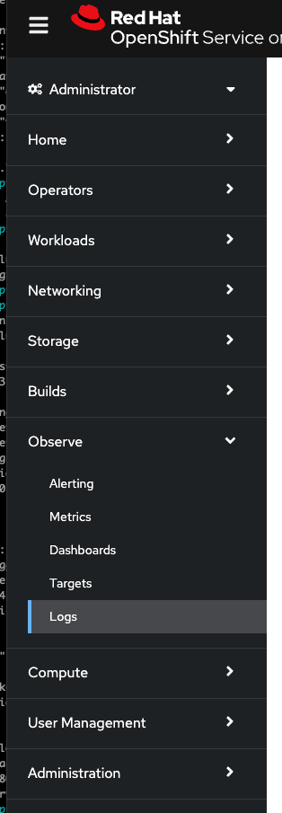

A guide to shipping logs and metrics on OpenShift using the new LokiStack setup

## Prerequisites

1. OpenShift CLI (oc)
1. Rights to install operators on the cluster
1. Access to create S3 buckets (AWS/ROSA), Blob Storage Container (Azure), Storage Bucket (GCP)

## For ROSA

Create environment variables to use later in this process by running the following commands:

```bash
$ export REGION=$(oc get infrastructure cluster -o=jsonpath="{.status.platformStatus.aws.region}")
$ export OIDC_ENDPOINT=$(oc get authentication.config.openshift.io cluster \
   -o jsonpath='{.spec.serviceAccountIssuer}' | sed  's|^https://||')
$ export AWS_ACCOUNT_ID=$(aws sts get-caller-identity --query Account --output text)
$ export AWS_PAGER=""
$ export CLUSTER_NAME=$(oc get infrastructure cluster -o=jsonpath="{.status.apiServerURL}" | awk -F '.' '{print $2}')
$ export LOKISTACK_BUCKET_NAME=${CLUSTER_NAME}-lokistack-storage
```

1. Create the relevant AWS resources for LokiStack

  1. Create a bucket for the LokiStack Operator to consume

```bash
aws s3 mb --region ${REGION} s3://${LOKISTACK_BUCKET_NAME}
```


1. Create a policy document for the LockStack Operator to consume

```bash

cat << EOF > policy.json
{
    "Version": "2012-10-17",
    "Statement": [
        {
            "Sid": "LokiStorage",
            "Effect": "Allow",
            "Action": [
                "s3:ListBucket",
                "s3:PutObject",
                "s3:GetObject",
                "s3:DeleteObject"
            ],
            "Resource": [
                "arn:aws:s3:::${LOKISTACK_BUCKET_NAME}",
                "arn:aws:s3:::${LOKISTACK_BUCKET_NAME}/*"
            ]
        }
    ]
}
EOF
```

1. Create the IAM Access Policy by running the following command:

```bash
POLICY_ARN=$(aws --region "$REGION" --query Policy.Arn \
--output text iam create-policy \
--policy-name "${CLUSTER_NAME}-lokistack-access-policy" \
--policy-document file://policy.json)

$ echo $POLICY_ARN
```

### If you are using OpenShift 4.14 or higher on AWS (ROSA)

1. Create an IAM Role trust policy document by running the following command:

```bash
cat <<EOF > trust-policy.json
{
   "Version": "2012-10-17",
   "Statement": [
   {
   "Effect": "Allow",
   "Condition": {
     "StringEquals" : {
       "${OIDC_ENDPOINT}:sub": ["system:serviceaccount:openshift-logging:loki"]
      }
    },
    "Principal": {
       "Federated": "arn:aws:iam::${AWS_ACCOUNT_ID}:oidc-provider/${OIDC_ENDPOINT}"
    },
    "Action": "sts:AssumeRoleWithWebIdentity"
    }
    ]
}
EOF
```

1. Create an IAM Role to link the trust policy to the IAM Access Policy by running the following command:

```bash
ROLE_ARN=$(aws iam create-role --role-name "${CLUSTER_NAME}-lokistack-access-role" \
--assume-role-policy-document file://trust-policy.json \
--query Role.Arn --output text)
echo $ROLE_ARN
```

Save this role_arn for installation of the lokistack operator later.

### If you are using OpenShift 4.13 or lower on AWS (ROSA), or are using a Non-STS cluster

1. Create an IAM user that will allow your LokiStack to access the bucket using the following command:

```bash
aws iam create-user --user-name "${CLUSTER_NAME}-lokistack-access-user"
```

1. Attach your policy to your new user using the following command:

```bash
aws iam attach-user-policy --user-name "${CLUSTER_NAME}-lokistack-access-user" --policy-arn ${POLICY_ARN}
```

1. Create an AWS Access key and Secret key for your IAM user using the following command:

```bash
AWS_KEYS=$(aws iam create-access-key --user-name "${CLUSTER_NAME}-lokistack-access-user"
```

You are ready to proceed to the next step

## Install the OpenShift Cluster Logging Operator

1. Create a namespace for the OpenShift Logging Operator

    ```bash
    oc create -f - <<EOF
    apiVersion: v1
    kind: Namespace
    metadata:
      name: openshift-logging
      annotations:
        openshift.io/node-selector: ""
      labels:
        openshift.io/cluster-monitoring: "true"
    EOF
    ```

1. Install the Loki Operator by creating the following objects, specifying the Role ARN we generated above:


```bash
oc create -f - <<EOF
apiVersion: operators.coreos.com/v1alpha1
kind: Subscription
metadata:
  name: loki-operator
  namespace: openshift-operators-redhat
spec:
  channel: "stable-5.9"
  name: loki-operator
  source: redhat-operators
  sourceNamespace: openshift-marketplace
  startingCSV: loki-operator.v5.9.3
  config:
    env:
    - name: ROLEARN
      value: ${ROLE_ARN}
EOF
```

    1. Verify Operator Installation

        ```bash
        oc get csv -n openshift-operators-redhat
        ```

        > Example Output
        ```
 oc get csv -n openshift-operators-redhat
NAME                     DISPLAY                     VERSION   REPLACES                 PHASE
loki-operator.v5.9.3     Loki Operator               5.9.3     loki-operator.v5.9.2     Succeeded
        ```

### If you are using OpenShift 4.14 or higher on AWS (ROSA)
1. Create a secret for the LokiStack Operator to consume by running the following command:

```bash
oc -n openshift-logging create secret generic "logging-loki-aws" \
--from-literal=bucketnames="${LOKISTACK_BUCKET_NAME}" \
--from-literal=region="${REGION}" \
--from-literal=audience="openshift" \
--from-literal=role_arn="${ROLE_ARN}"
```

1. Create a LokiStack installation by creating the following object:

```bash
oc create -f - <<EOF
apiVersion: loki.grafana.com/v1
kind: LokiStack
metadata:
  name: logging-loki 
  namespace: openshift-logging
spec:
  size: 1x.extra-small 
  storage:
    schemas:
      - effectiveDate: '2023-10-15'
        version: v13
    secret:
      name: logging-loki-aws 
      type: s3 
      credentialMode: token
  storageClassName: gp3-csi
  tenants:
    mode: openshift-logging
EOF
```

### If you are using OpenShift 4.13 or lower on AWS (ROSA), or are using a Non-STS cluster

1. Extract the AWS Access Key and Secret key from your variable created above using the following command:

```bash
AWS_ACCESS_KEY_ID=$(echo $AWS_KEYS | jq -r '.AccessKey.AccessKeyId')
AWS_SECRET_ACCESS_KEY=$(echo $AWS_KEYS | jq -r '.AccessKey.SecretAccessKey')
```

1. Create a secret for the LokiStack Operator to consume by running the following command:

```bash
oc -n openshift-logging create secret generic "logging-loki-aws" \
--from-literal=bucketnames="${LOKISTACK_BUCKET_NAME}" \
--from-literal=region="${REGION}" \
--from-literal=access_key_id="${AWS_ACCESS_KEY_ID}" \
--from-literal=access_key_secret="${AWS_SECRET_ACCESS_KEY}"
```

1. Create a LokiStack installation by creating the following object:

```bash
oc create -f - <<EOF
apiVersion: loki.grafana.com/v1
kind: LokiStack
metadata:
  name: logging-loki 
  namespace: openshift-logging
spec:
  size: 1x.extra-small 
  storage:
    schemas:
      - effectiveDate: '2023-10-15'
        version: v13
    secret:
      name: logging-loki-aws 
      type: s3 
      credentialMode: static
  storageClassName: gp3-csi
  tenants:
    mode: openshift-logging
EOF
```

1. Confirm your LokiStack is running successfully by running the following command:

```bash
oc get pods -n openshift-logging
```

> Note: If you see pods in Pending state, confirm that you have sufficient resources in the cluster to run a LokiStack. If you are running a small cluster, try adding one or two m5.4xlarge machines to your cluster like so: `rosa create machinepool -c ${CLUSTER_NAME} --name=lokistack-mp --replicas=2 --instance-type=m5.4xlarge`

  Overview of lokistack sizing can be found here: https://docs.openshift.com/rosa/observability/logging/log_storage/installing-log-storage.html#loki-deployment-sizing_installing-log-storage

1. Install the Red Hat OpenShift Logging Operator by creating the following objects:

    1. The Cluster Logging OperatorGroup

        ```bash
        oc create -f - <<EOF
        apiVersion: operators.coreos.com/v1
        kind: OperatorGroup
        metadata:
          name: cluster-logging
          namespace: openshift-logging
        spec:
          targetNamespaces:
          - openshift-logging
        EOF
        ```

    1. Subscription Object to subscribe a Namespace to the Red Hat OpenShift Logging Operator

        ```bash
        oc create -f - <<EOF
        apiVersion: operators.coreos.com/v1alpha1
        kind: Subscription
        metadata:
          name: cluster-logging
          namespace: openshift-logging
        spec:
          channel: "stable"
          name: cluster-logging
          source: redhat-operators
          sourceNamespace: openshift-marketplace
        EOF
        ```

    1. Verify the Operator installation, the `PHASE` should be `Succeeded`

    ```bash
    oc get csv -n openshift-logging
    ```

    > Example Output
    ```
NAME                     DISPLAY                     VERSION   REPLACES                 PHASE
cluster-logging.v5.9.3   Red Hat OpenShift Logging   5.9.3     cluster-logging.v5.9.2   Succeeded
loki-operator.v5.9.3     Loki Operator               5.9.3     loki-operator.v5.9.2     Succeeded
    ```

## 

1. Create an OpenShift Logging instance, specifying the logStore:

    ```bash
    oc create -f - <<EOF
    apiVersion: "logging.openshift.io/v1"
    kind: "ClusterLogging"
    metadata:
      name: "instance"
      namespace: "openshift-logging"
    spec:
      managementState: "Managed"
      logStore:
        type: "lokistack"
        lokistack:
          name: logging-loki
    EOF
    ```

  1. Here, we have configured the ClusterLogging Operator to use the existing LokiStack we have created in the cluster as it's LogStorage. If you are using ElasticSearch as your LogStore, this would point at ElasticSearch (now deprecated)

1. Edit your OpenShift Logging instance, adding the visualisation section to show logs in the console:

    ```bash
    oc replace -f - <<EOF
    apiVersion: "logging.openshift.io/v1"
    kind: "ClusterLogging"
    metadata:
      name: "instance"
      namespace: "openshift-logging"
    spec:
      managementState: "Managed"
      logStore:
        type: "lokistack"
        lokistack:
          name: logging-loki
      visualization:
        type: "ocp-console"
        ocpConsole: {}
    EOF
    ```

  1. Ensure the Console Plugin is enabled by running the following command:

  ```bash
  oc get consoles.operator.openshift.io cluster -o yaml |grep logging-view-plugin  \
|| oc patch consoles.operator.openshift.io cluster  --type=merge \
--patch '{ "spec": { "plugins": ["logging-view-plugin"]}}'
  ```

  Example output:

  ```bash
  clusterlogging.logging.openshift.io/instance patched
  ```

  1. Here, we have added the console-view-plugin to allow us to view logs in the OpenShift console. You can check that the pod has been created using the following command:

  ```bash
  oc get pods -n openshift-logging | grep logging-view-plugin
  ```

  Example output:

  ```bash
  logging-view-plugin-bd5978d6d-9sc5v            1/1     Running   0          8m41s
  ```  

  1. Confirm you can see the Logging section of the console under the Observe tab:

  

1. Edit your OpenShift Logging instance, adding the collection section to create vector collection pods:

    ```bash
    oc replace -f - <<EOF
    apiVersion: "logging.openshift.io/v1"
    kind: "ClusterLogging"
    metadata:
      name: "instance"
      namespace: "openshift-logging"
    spec:
      managementState: "Managed"
      logStore:
        type: "lokistack"
        lokistack:
          name: logging-loki
      visualization:
        type: "ocp-console"
        ocpConsole: {}
      collection:
        type: "vector"
        vector: {}
    EOF
    ```

  1. Confirm you can see collector pods starting up using the following command. There should be one per node.

  ```bash
  oc get pods -n openshift-logging | grep collector
  ```

  Example output:
  
  ```
  collector-49qnt                                1/1     Running   0          11m
  collector-gvd5x                                1/1     Running   0          11m
  collector-qfqxs                                1/1     Running   0          11m
  collector-r7scm                                1/1     Running   0          11m
  collector-zlzpf                                1/1     Running   0          11m
  ```

1. At this point OpenShift logging is installed and configured and is ready to receive logs.

## Install the ClusterLogForwarder Custom Resource

Separately from the ClusterLogging storage system, the OpenShift Cluster Logging Operator provides the ClusterLogForwarder which allows you to describe which log types are sent where. We will now configure this to collect logs from our cluster and forward them to our log store

1. Create a basic ClusterLogForwarder using the following command:

```bash
oc create -f - <<EOF
apiVersion: "logging.openshift.io/v1"
kind: ClusterLogForwarder
metadata:
  name: "instance"
  namespace: "openshift-logging"
spec:
  pipelines:
  - name: infrastructure-logs
    inputRefs:
      - infrastructure
    outputRefs:
      - default
EOF
```

This example selects all infrastructure logs and forwards them to "default", which is a reference to our LokiStack Logging Store. If we go to the Console and browse to Observer -> Logs, then change the dropdown from "application" to "infrastructure" we can now see logs:

!(infra logs example)[./infra-logs-example.png]

1. Adjust your ClusterLogForwarder to pick up Application logs from a specific namespace by running the following command:

```bash
oc replace -f - <<EOF
apiVersion: "logging.openshift.io/v1"
kind: ClusterLogForwarder
metadata:
  name: "instance"
  namespace: "openshift-logging"
spec:
  inputs:
  - name: openshift-dns-logs
    application:
      namespaces:
      - openshift-dns
  pipelines:
  - name: infrastructure-logs
    inputRefs:
      - infrastructure
    outputRefs:
      - default
  - name: application-logs
    inputRefs:
      - openshift-dns-logs
    outputRefs:
      - default
EOF
```

This example has created a new input, specifying the openshift-dns namespace, and forwarded it to our LogStore. If you refresh your Logging tag and select "application" in the drop down you will now see your logs.

For more examples or configuration options please see the documentation here: https://docs.openshift.com/rosa/observability/logging/log_collection_forwarding/configuring-log-forwarding.html

## Cleanup

1. Remove the ClusterLogForwarder Instance:

```bash
oc -n openshift-logging delete clusterlogforwarder --all
```

1. Remove the ClusterLogging Instance:

```bash
oc -n openshift-logging delete clusterlogging --all
```

1. Remove the LokiStack Instance:

```bash
oc -n openshift-logging delete lokistack --all
```

1. Remove the Cluster Logging Operator:

```bash
oc -n openshift-logging delete subscription cluster-logging
oc -n openshift-logging delete csv cluster-logging.v5.9.3
```

1. Remove the LokiStack Operator:

```bash
oc -n openshift-logging delete csv loki-operator.v5.9.3
```

1. Cleanup the openshift-logging namespace

```bash
oc delete namespace openshift-logging
```

1. Cleanup your AWS Bucket

```bash
aws s3 rb s3://$LOKISTACK_BUCKET_NAME
```

1. Cleanup your AWS Policy

```bash
aws iam delete-policy --policy-arn ${POLICY_ARN}
```

### If you are using OpenShift 4.14 or higher on AWS (ROSA)

1. Cleanup your AWS Role

```bash
aws iam delete-role --role-name ${CLUSTER_NAME}-lokistack-access-role
```

### If you are using OpenShift 4.13 or lower on AWS (ROSA), or are using a Non-STS cluster

1. Cleanup your AWS user

```bash
aws iam delete-user --user-name "${CLUSTER_NAME}-lokistack-access-user"
```
