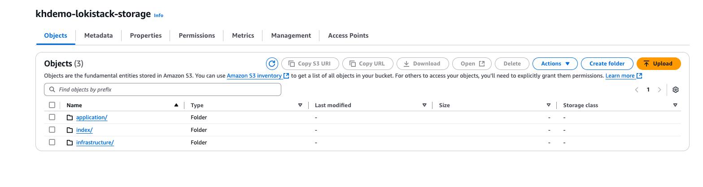
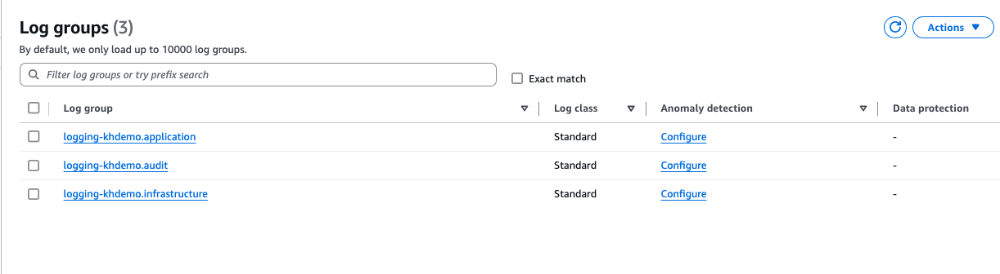
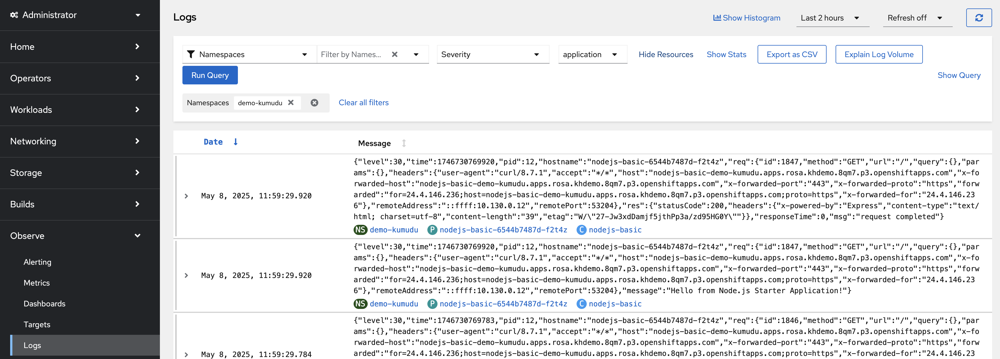

ROSA HCP clusters are now only support openshift Logging 6.x and above. This guide aims to provide a step-by-step guide for implementing logging 6.x on ROSA HCP, setup log store with Loki /w S3 and/or log forwarding to AWS CloudWatch.

For ROSA Classic refer to the [LokiStack on ROSA](/experts/o11y/openshift-logging-lokistack/) article.

## Components of the Logging Subsystem

The OpenShift logging subsystem is designed to collect, store, and visualize logs from various sources within the cluster, including node system logs, application container logs, and infrastructure logs. 
The OpenShift logging subsystem comprises several key components that work together to achieve log aggregation and management. The collector, residing on each node in the OpenShift cluster, is responsible for gathering logs. The primary implementation for the collector has historically been FluentD. However, a newer alternative, Vector, is increasingly being adopted for its performance and features. The collector gathers system logs from journald and container logs from /var/log/containers/*.log. Additionally, it can be configured to collect audit logs from /var/log/audit/audit.log. The collector is deployed and managed as a DaemonSet, ensuring that a collector pod runs on every node within the OpenShift cluster. The aggregated logs are then stored in a log store. The default log store for OpenShift Logging has traditionally been Elasticsearch. However, Loki is now offered as a performant alternative, particularly in ROSA HCP environments now defaults to Loki Operator. The ROSA HCP cluster log visualization component is provided using Cluster Observability Operator's (COO) Logging UI Plugin.

Refer to [openshift logging official documentation]( https://docs.redhat.com/en/documentation/openshift_container_platform/4.18/html/logging/index and 6.x quick guide : https://docs.redhat.com/en/documentation/openshift_container_platform/4.18/html/logging/logging-6-2#quick-start_6-2_logging-6x-6.2) for more details.

For ROSA HCP with logging 6 now required following operators 
1. Loki Operator (log store)
1. Red Hat OpenShift Logging Operator 
2. Cluster Observability Operator (log visualizing)

## Prerequisites

1. ROSA HCP Cluster with cluster-admin permissions
1. OpenShift CLI (oc)
1. Access AWS resources i.e IAM, S3 and Cloudwatch

## Create environment variables 

1. Create environment variables :

  ```bash
  export REGION=$(oc get infrastructure cluster -o=jsonpath="{.status.platformStatus.aws.region}")
  export OIDC_ENDPOINT=$(oc get authentication.config.openshift.io cluster \
      -o jsonpath='{.spec.serviceAccountIssuer}' | sed  's|^https://||')
  export AWS_ACCOUNT_ID=$(aws sts get-caller-identity --query Account --output text)
  export AWS_PAGER=""
  export CLUSTER_NAME=$(oc get infrastructure cluster -o=jsonpath="{.status.apiServerURL}" | awk -F '.' '{print $2}')
  export LOKISTACK_BUCKET_NAME=${CLUSTER_NAME}-lokistack-storage
  export LOGGROUP_PREFIX=logging-${CLUSTER_NAME}
  echo REGION:$REGION OIDC_ENDPOINT:$OIDC_ENDPOINT AWS_ACCOUNT_ID:$AWS_ACCOUNT_ID CLUSTER_NAME:$CLUSTER_NAME LOKISTACK_BUCKET_NAME:$LOKISTACK_BUCKET_NAME LOGGROUP_PREFIX: $LOGGROUP_PREFIX
  ```
## Install the Loki Operator

1. Create a S3 bucket for the LokiStack Operator

    ```bash
    aws s3 mb --region ${REGION} s3://${LOKISTACK_BUCKET_NAME}
    ```

1. Create a S3 IAM policy document for Loki operator

```bash   
cat << EOF > s3_policy.json
{
    "Version": "2012-10-17",
    "Statement": [
        {
            "Sid": "LokiStorage",
            "Effect": "Allow",
            "Action": [
                "s3:ListBucket",
                "s3:PutObject",
                "s3:GetObject",
                "s3:DeleteObject"
            ],
            "Resource": [
                "arn:aws:s3:::${LOKISTACK_BUCKET_NAME}",
                "arn:aws:s3:::${LOKISTACK_BUCKET_NAME}/*"
            ]
        }
    ]
}
EOF
```

1. Create the S3 IAM Policy for Loki stack access

```bash
POLICY_ARN_S3=$(aws --region "$REGION" --query Policy.Arn \
--output text iam create-policy \
--policy-name "${CLUSTER_NAME}-lokistack-access-policy" \
--policy-document file://s3_policy.json)

echo $POLICY_ARN_S3
```

1. Create an IAM Role trust policy document

```bash
cat <<EOF > s3-trust-policy.json
{
   "Version": "2012-10-17",
   "Statement": [
   {
   "Effect": "Allow",
   "Condition": {
     "StringEquals" : {
       "${OIDC_ENDPOINT}:sub": [
                        "system:serviceaccount:openshift-logging:logging-collector",
                        "system:serviceaccount:openshift-logging:logging-loki"
                    ]
      }
    },
    "Principal": {
     "Federated": "arn:aws:iam::${AWS_ACCOUNT_ID}:oidc-provider/${OIDC_ENDPOINT}"
    },
    "Action": "sts:AssumeRoleWithWebIdentity"
    }
    ]
}
EOF
```
> Note: logging-collector -  Name of the openshift service account used by log collector


1. Create an IAM Role and link the trust policy

    ```bash
    ROLE_ARN_S3=$(aws iam create-role --role-name "${CLUSTER_NAME}-lokistack-access-role" \
    --assume-role-policy-document file://s3-trust-policy.json \
    --query Role.Arn --output text)
    echo $ROLE_ARN_S3
    ```
> Note: Save this role_arn for installation of the lokistack operator later.

1. Attach S3 IAM Policy for Loki stack access to the above role 
```bash
  aws iam attach-role-policy \
  --role-name "${CLUSTER_NAME}-lokistack-access-role" \
  --policy-arn $POLICY_ARN_S3
```

1. Openshift project for Loki operator 
> Note: ROSA HCP cluster has built in openshift-operators-redhat project. Make sure it has  "openshift.io/cluster-monitoring: "true"" label. If not add label using following command 
  ```bash
  oc label namespace openshift-operators-redhat openshift.io/cluster-monitoring="true"
  ```
  If openshift-operators-redhat project does not exists create it. 

  ```bash
  oc create -f - <<EOF
  apiVersion: v1
  kind: Namespace
  metadata:
    name: openshift-operators-redhat
    labels:
      openshift.io/cluster-monitoring: "true"
  EOF
  ```
1. Create an OperatorGroup object

```bash
oc create -f - <<EOF
apiVersion: operators.coreos.com/v1
kind: OperatorGroup
metadata:
  name: loki-operator
  namespace: openshift-operators-redhat 
spec:
  upgradeStrategy: Default
EOF
```

1. Create a Subscription object for Loki Operator

```bash
oc create -f - <<EOF
apiVersion: operators.coreos.com/v1alpha1
kind: Subscription
metadata:
  name: loki-operator
  namespace: openshift-operators-redhat 
spec:
  channel: stable-6.2 
  installPlanApproval: Automatic 
  name: loki-operator
  source: redhat-operators 
  sourceNamespace: openshift-marketplace
EOF
```
>Note: Make sure to validate current stable channel version. e.g: 6.2

1. Verify Operator Installation

  ```bash
  oc get csv -n openshift-operators-redhat
  ``` 
  
  Example Output 

  ```
  NAME                     DISPLAY                     VERSION   REPLACES                 PHASE
  loki-operator.v6.2.2     Loki Operator               6.2.2     loki-operator.v6.2.1     Succeeded
  ```

1. Create a namespace object for deploy the LokiStack:

> Note: ROSA HCP cluster has built in openshift-logging project. Make sure it has  "openshift.io/cluster-monitoring: "true"" label. If not add label using following command 

  ```bash
  oc label namespace openshift-logging openshift.io/cluster-monitoring="true"
  ```
  If openshift-operators-redhat project does not exists create it. 

  ```bash
  oc create -f - <<EOF
  apiVersion: v1
  kind: Namespace
  metadata:
    name: openshift-logging
    labels:
      openshift.io/cluster-monitoring: "true"
  EOF
  ```

1. Create a secret with the above Role for Loki stack to access S3 bucket. 

  ```bash
  oc -n openshift-logging create secret generic "logging-loki-aws" \
  --from-literal=bucketnames="${LOKISTACK_BUCKET_NAME}" \
  --from-literal=region="${REGION}" \
  --from-literal=audience="openshift" \
  --from-literal=role_arn="${ROLE_ARN_S3}" \
  --from-literal=endpoint="https://s3.${REGION}.amazonaws.com"
  ```
> Note: Make sure endpoint has correct S3 region for your environment

1. Create a LokiStack CR

```bash
oc create -f - <<EOF
apiVersion: loki.grafana.com/v1
kind: LokiStack
metadata:
  name: logging-loki 
  namespace: openshift-logging
spec:
  size: 1x.extra-small 
  storage:
    schemas:
      - effectiveDate: '2023-10-15'
        version: v13
    secret:
      name: logging-loki-aws 
      type: s3 
      credentialMode: token
  storageClassName: gp3-csi
  tenants:
    mode: openshift-logging
EOF
```

> Note: Specify the deployment size. Supported size options for production instances of Loki are 1x.extra-small, 1x.small, or 1x.medium. Additionally, 1x.pico is supported starting with logging 6.1. [Loki deployment sizing](https://docs.redhat.com/en/documentation/openshift_container_platform/4.18/html/logging/logging-6-2#log6x-loki-sizing_log6x-loki-6.2)

1. Verify LokiStack Installation

  ```bash
  oc get pods -n openshift-logging
  ```

  Note: If you see pods in Pending state, confirm that you have sufficient resources in the cluster to run a LokiStack. You could set your ROSa machime pool to auto scale or create new machine pool with following command
  ```bash
  rosa create machinepool -c ${CLUSTER_NAME} --name=lokistack-mp --replicas=2 --instance-type=m5.4xlarge 
  ```

## Install the OpenShift Cluster Logging Operator

1. Create an OperatorGroup object
```bash
oc create -f - <<EOF
apiVersion: operators.coreos.com/v1
kind: OperatorGroup
metadata:
  name: cluster-logging
  namespace: openshift-logging 
spec:
  upgradeStrategy: Default
EOF
```
1. Create a Subscription object for Red Hat OpenShift Logging Operator
```bash
oc create -f - <<EOF
apiVersion: operators.coreos.com/v1alpha1
kind: Subscription
metadata:
  name: cluster-logging
  namespace: openshift-logging 
spec:
  channel: stable-6.2
  installPlanApproval: Automatic 
  name: cluster-logging
  source: redhat-operators 
  sourceNamespace: openshift-marketplace
EOF
```
>Note: Make sure to select latest stable channel e.g: 6.2

1. Verify the Operator installation, the `PHASE` should be `Succeeded`
    ```bash
    oc get csv -n openshift-logging
    ```
    Example Output
    ```
    NAME                     DISPLAY                     VERSION   REPLACES                 PHASE
    cluster-logging.v6.2.2   Red Hat OpenShift Logging   6.2.2     cluster-logging.v6.2.1   Succeeded
    loki-operator.v6.2.2     Loki Operator               6.2.2     loki-operator.v6.2.1     Succeeded
    ```

1. Create a service account to be used by the log collector:

  ```bash
  oc create sa logging-collector -n openshift-logging
  ```
> Note: SA name should match service account name used in above s3 access trust policy. i.e: logging-collector

1. Grant necessary permissions to the service account so it's able to collect and forward logs. In this example, the collector is provided permissions to collect logs from infrastructure, audit and application logs.

  ```bash
  oc adm policy add-cluster-role-to-user logging-collector-logs-writer -z logging-collector -n openshift-logging
  oc adm policy add-cluster-role-to-user collect-application-logs -z logging-collector -n openshift-logging
  oc adm policy add-cluster-role-to-user collect-infrastructure-logs -z logging-collector -n openshift-logging
  oc adm policy add-cluster-role-to-user collect-audit-logs -z logging-collector -n openshift-logging
  ```

1. Create a ClusterLogForwarder CR to store logs in S3

```bash
oc create -f - <<EOF
apiVersion: observability.openshift.io/v1
kind: ClusterLogForwarder
metadata:
  name: instance
  namespace: openshift-logging 
spec:
  serviceAccount:
    name: logging-collector 
  outputs:
  - name: lokistack-out
    type: lokiStack 
    lokiStack:
      target: 
        name: logging-loki
        namespace: openshift-logging
      authentication:
        token:
          from: serviceAccount
    tls:
      ca:
        key: service-ca.crt
        configMapName: openshift-service-ca.crt
  pipelines:
  - name: infra-app-logs
    inputRefs: 
    - application
    - infrastructure
    - audit
    outputRefs:
    - lokistack-out
EOF 
```
1. Confirm you can see collector pods called "instance" starting up using the following command. There should be one per node.
    ```bash
    oc get pods -n openshift-logging | grep instance
    ```
    Example output:

    ```
    instance-6tk4f                                1/1     Running             0          8s
    instance-dl2wt                                1/1     Running             0          9s
    instance-ggfb9                                1/1     Running             0          8s
    instance-qhtnj                                1/1     Running             0          8s
    instance-zpnr5                                1/1     Running             0          9s
    ```

1. Verify your S3 bucket



## Configuring log forwarding to cloudwatch

The ClusterLogForwarder (CLF) allows users to configure forwarding of logs to various destinations (i.e AWS cloudwatch) apart from ClusterLogging storage system (i.e: Loki stack) 

### Prerequisites
1.  Created a serviceAccount in the same namespace as the ClusterLogForwarder CR (we'll use same SA as Loki stack i.e logging-collector)
1.  Assigned the collect-audit-logs, collect-application-logs and collect-infrastructure-logs cluster roles to the serviceAccount.

1. Create a CW IAM policy document for CLF

```bash
cat << EOF > cw-policy.json
{
"Version": "2012-10-17",
"Statement": [
   {
         "Effect": "Allow",
         "Action": [
            "logs:CreateLogGroup",
            "logs:CreateLogStream",
            "logs:DescribeLogGroups",
            "logs:DescribeLogStreams",
            "logs:PutLogEvents",
            "logs:PutRetentionPolicy"
         ],
         "Resource": "arn:aws:logs:${REGION}:${AWS_ACCOUNT_ID}:log-group:${LOGGROUP_PREFIX}*"
   }
]
}
EOF
```

1. Create the CW IAM Policy for CLF's access
  ```bash
    POLICY_ARN_CW=$(aws --region "$REGION" --query Policy.Arn \
    --output text iam create-policy \
    --policy-name "${CLUSTER_NAME}-CLF-CW-policy" \
    --policy-document file://cw-policy.json)

    echo $POLICY_ARN_CW
  ```
  

1.  Create an IAM Role trust policy document
```bash
cat <<EOF > ./trust-cw-policy.json
{
   "Version": "2012-10-17",
   "Statement": [{
     "Effect": "Allow",
     "Principal": {
       "Federated": "arn:aws:iam::${AWS_ACCOUNT_ID}:oidc-provider/${OIDC_ENDPOINT}"
     },
     "Action": "sts:AssumeRoleWithWebIdentity",
     "Condition": {
       "StringEquals": {
         "${OIDC_ENDPOINT}:sub": "system:serviceaccount:openshift-logging:logging-collector"
       }
     }
   }]
}
EOF
```

>Note: logging-collector -  Name of the openshift service account used by log collector

1. Create an IAM Role and link the trust policy

  ```bash
  ROLE_ARN_CW=$(aws iam create-role --role-name "${CLUSTER_NAME}-ROSACloudWatch" \
     --assume-role-policy-document file://trust-cw-policy.json \
     --query Role.Arn --output text)
  echo ${ROLE_ARN_CW}
  ```
> Note: Save this role_arn for installation of the cluster log forwarder (CLF) later.

1. Attach CW IAM Policy to the above role 
  ```bash
  aws iam attach-role-policy \
  --role-name "${CLUSTER_NAME}-ROSACloudWatch" \
  --policy-arn $POLICY_ARN_CW
  ```

1. Create a secret with above Role for CLF to access CW

  ```bash
  oc -n openshift-logging create secret generic "cw-secret" \
  --from-literal=role_arn="${ROLE_ARN_CW}" 
  ```

1. Create a ClusterLogForwarder CR to forward logs to AWS cloudwatch

```bash
oc create -f - <<EOF
apiVersion: "observability.openshift.io/v1"
kind: ClusterLogForwarder
metadata:
  name: cloudwatch
  namespace: openshift-logging
spec:
  managementState: Managed
  outputs:
  - name: cloudwatch
    type: cloudwatch
    cloudwatch:
      authentication:
        iamRole:
          roleARN:
            key: role_arn
            secretName: cw-secret
          token:
            from: serviceAccount
        type: iamRole
      groupName: logging-${CLUSTER_NAME}.{.log_type||"none-typed-logs"}
      region: us-west-2
      tuning:
        compression: zstd
        delivery: atMostOnce
        maxRetryDuration: 30
        maxWrite: 10M
        minRetryDuration: 5
  pipelines:
  - name: cloudwatch
    inputRefs:
    - application
    - infrastructure
    - audit
    outputRefs:
    - cloudwatch
  serviceAccount:
    name: logging-collector
EOF
```
>Note: Make sure to format group name and set correct AWS region

This example selects all application, infrastructure and audit logs and forwards them cloudwatch. Refer to [openshift logging documentation](https://docs.redhat.com/en/documentation/openshift_container_platform/4.18/html/logging/logging-6-2#log6x-clf-6-2) for more configuration options like log formating,filtering..etc.

1. Verify CW log groups


## Log visualization in openshift console
Visualization for logging is provided by deploying the Logging UI Plugin of the Cluster Observability Operator(COO). Follow detail instructions for [Installing the Cluster Observability operator](https://docs.redhat.com/en/documentation/openshift_container_platform/4.18/html-single/cluster_observability_operator/index#installing-the-cluster-observability-operator-in-the-web-console-_installing_the_cluster_observability_operator)

1. Openshift project for COO
```bash
oc create ns  openshift-cluster-observability-operator
```

1.  Create an OperatorGroup object for COO
```bash
oc create -f - <<EOF
apiVersion: operators.coreos.com/v1
kind: OperatorGroup
metadata:
  name: openshift-cluster-observability-operator
  namespace: openshift-cluster-observability-operator 
spec:
  upgradeStrategy: Default
EOF
```
1.  Create a Subscription object for COO
```bash
oc create -f - <<EOF
apiVersion: operators.coreos.com/v1alpha1
kind: Subscription
metadata:
  name: cluster-observability-operator
  namespace: openshift-cluster-observability-operator 
spec:
  channel: stable 
  installPlanApproval: Automatic 
  name: cluster-observability-operator
  source: redhat-operators 
  sourceNamespace: openshift-marketplace
EOF
```

1.  Verify COO Installation
```bash
oc get csv -n openshift-cluster-observability-operator
```

1.  Create a COO Logging UI plugin CR
```bash
oc create -f - <<EOF
apiVersion: observability.openshift.io/v1alpha1
kind: UIPlugin
metadata:
  name: logging
spec:
  type: Logging
  logging:
    lokiStack:
      name: logging-loki
    logsLimit: 50
    timeout: 30s
EOF
```
>Note: Make sure to provide correct lokiStack name configured above (i.e:logging-loki )

1. Verify Logging UI plugin
Wait until you see openshift web console refresh request. Once console is refesh, expand Observe in the left hand side of the openshift console and go to log tab. 




## Cleanup

1. Remove COOC UIPlugin
    ```bash
    oc delete UIPlugin logging -n openshift-cluster-observability-operator
    ```
1. Remove Cluster Observability Operator
    ```bash
    oc delete subscription cluster-observability-operator -n openshift-cluster-observability-operator
    oc delete csv cluster-observability-operator.v1.1.1 -n openshift-cluster-observability-operator 
    ```
1. Remove the ClusterLogForwarder Instance:

    ```bash
    oc -n openshift-logging delete clusterlogforwarder --all
    ```

1. Remove the LokiStack Instance:

    ```bash
    oc -n openshift-logging delete lokistack --all
    ```

1. Remove the Cluster Logging Operator:

    ```bash
    oc -n openshift-logging delete subscription cluster-logging
    oc -n openshift-logging delete csv cluster-logging.v6.2.2
    ```

1. Remove the LokiStack Operator:

    ```bash
    oc -n openshift-operators-redhat delete subscription loki-operator
    oc -n openshift-operators-redhat delete csv loki-operator.v6.2.2
    ```


1. Cleanup your AWS Bucket

    ```bash
    aws s3 rm s3://$LOKISTACK_BUCKET_NAME --recursive
    ```

1. Cleanup your AWS Policies and roles

    ```bash
    aws iam detach-role-policy --role-name "${CLUSTER_NAME}-lokistack-access-role" --policy-arn ${POLICY_ARN_S3}
    aws iam delete-role --role-name "${CLUSTER_NAME}-lokistack-access-role"
    aws iam delete-policy --policy-arn ${POLICY_ARN_S3}

    aws iam detach-role-policy --role-name "${CLUSTER_NAME}-ROSACloudWatch" --policy-arn ${POLICY_ARN_CW}
    aws iam delete-role --role-name "${CLUSTER_NAME}-ROSACloudWatch"
    aws iam delete-policy --policy-arn ${POLICY_ARN_CW}
    ```