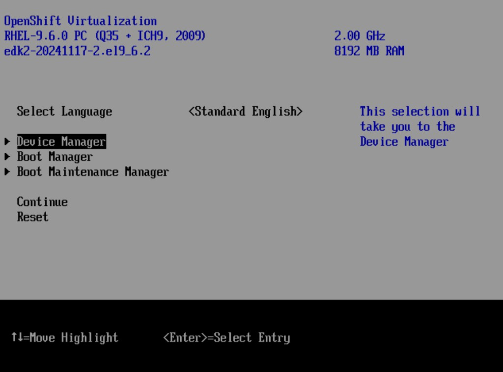
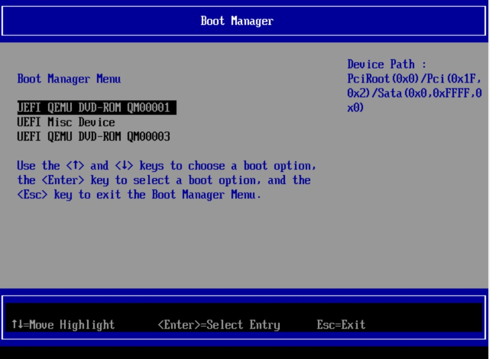
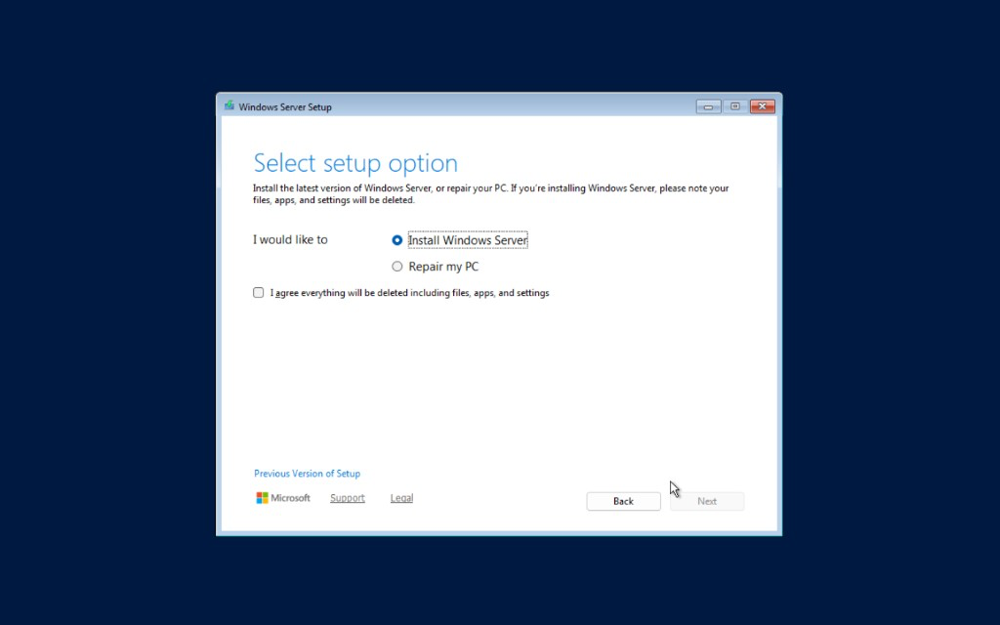
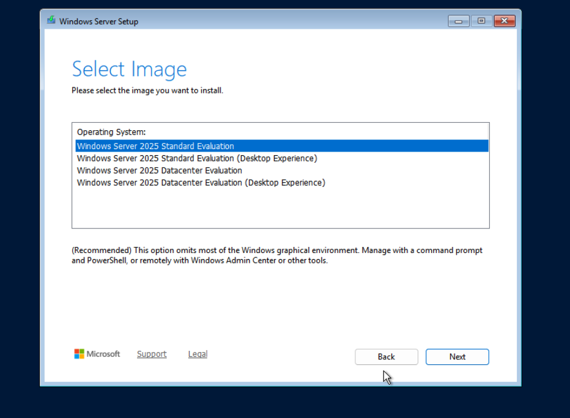
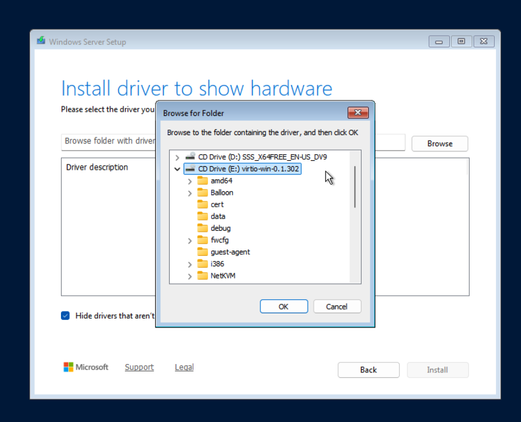
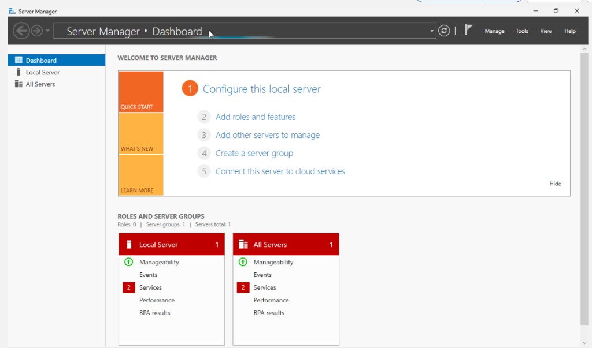
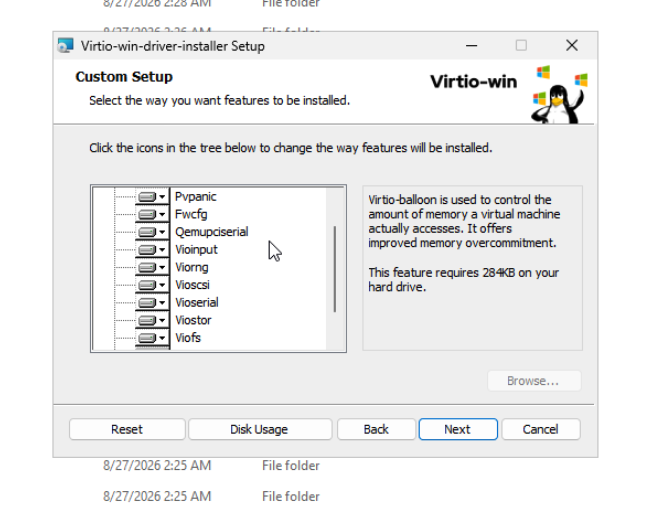
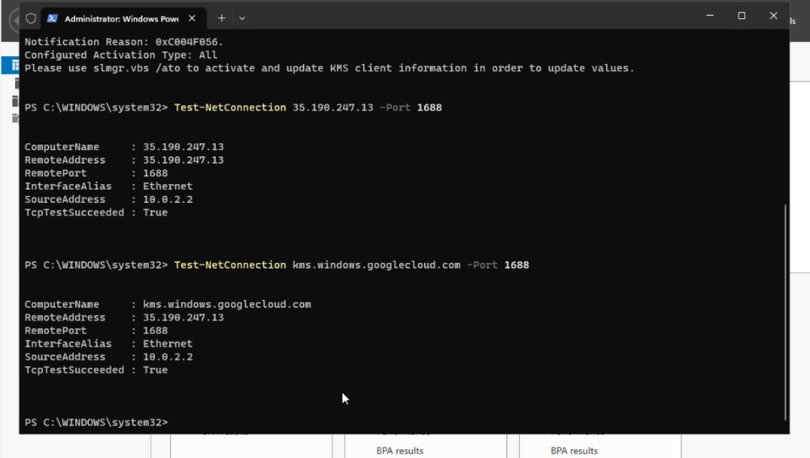
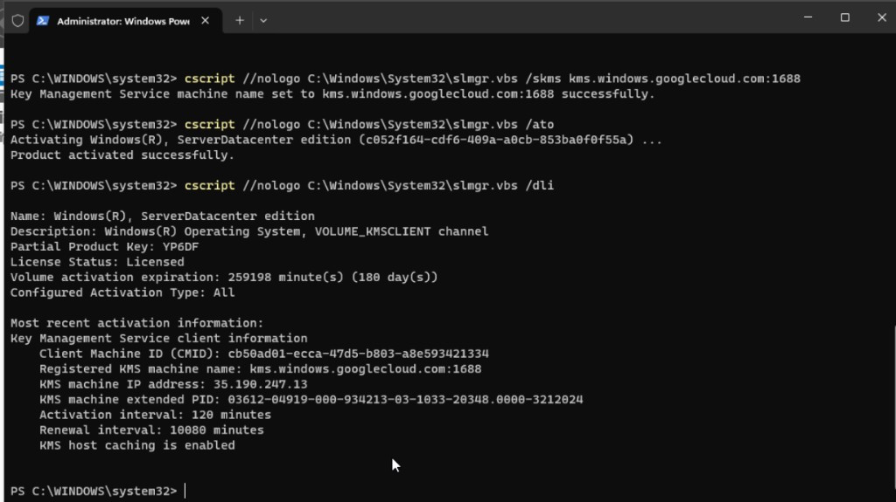

Activate a Windows guest with **Google PAYG** on OSD CCS + C3 metal: Datacenter golden image, tag metal host, then KMS / `slmgr`.

## Prerequisites

* An OpenShift Dedicated CCS cluster on Google Cloud with **Workload Identity Federation (WIF)**. Follow the [OpenShift Dedicated Quickstart](/experts/osd/quickstart/) (WIF config + `ocm create cluster`), or the product docs for [creating an OSD GCP cluster with WIF](https://docs.openshift.com/dedicated/osd_getting_started/osd-getting-started.html).
* OpenShift Virtualization installed on that cluster
* A C3 metal worker (`hyperdisk-balanced`) and a Hyperdisk StorageClass
* CLIs: `oc`, `virtctl`, and `gcloud`

## Step 0: Environment

```bash
export CLUSTER_NAME=<cluster-name>
export GCP_PROJECT=<project-id>
export GCP_REGION=<region>
export GCP_ZONE=<zone>
export WORKER_SUBNET=${CLUSTER_NAME}-worker-subnet

export WINDOWS_PROJECT=windows-vms
export WINDOWS_VM_NAME=win-demo
export WIN_BOOTSOURCE_DV=win2k25
export WIN_DS_NAMESPACE=default
export HYPERDISK_SC=hyperdisk-virt-sc

export WIN_PAYG_LICENSE_URL="https://www.googleapis.com/compute/v1/projects/windows-cloud/global/licenses/windows-server-2025-dc"
export WIN_ISO_PATH="$HOME/Downloads/windows-server-2025-datacenter.iso"
export VIRTIO_ISO_PATH="$HOME/Downloads/virtio-win.iso"

gcloud config set project "$GCP_PROJECT"
```

**Expected output:**

```text
Updated property [core/project].
```

Log into the OSD cluster as a user with **cluster-admin** (CCS) privileges before using `oc`. See [Accessing your cluster](https://docs.openshift.com/dedicated/osd_getting_started/osd-getting-started.html#osd-accessing-your-cluster_osd-getting-started) and [managing admin roles](https://docs.openshift.com/dedicated/authentication_and_authorization/osd-admin-roles.html).

1. Open the cluster in [OpenShift Cluster Manager](https://console.redhat.com/openshift), then **Open console**.
2. In the OpenShift web console, open your user menu → **Copy login command** → **Display Token**, then run the printed `oc login` command locally (or paste your token and API URL):

```bash
oc login --token=<token> --server=https://api.<cluster>.<region>.openshiftapps.com:6443
oc whoami
oc whoami -c
```

**Expected output:**

```text
# oc whoami
<your-admin-user>

# oc whoami -c
<your-kubeconfig-context>
```

Confirm you are on the intended cluster context before continuing.

```bash
gcloud compute instances list --project="$GCP_PROJECT" \
  --filter="machineType:c3-standard-192-metal OR machineType:c3-highcpu-192-metal"
export NODE=<metal-worker-gce-name>
```

**Expected output:**

```text
NAME                              ZONE           MACHINE_TYPE           ...  STATUS
<cluster>-…-worker-virt-a-xxxxx   <zone>         c3-standard-192-metal  ...  RUNNING
```

## Step 1: Tag the metal host (day-2)

```bash
oc get vmi -A -o wide | grep "$NODE" || true
for ns in windows-vms default linux-vms; do
  oc get vm -n "$ns" -o jsonpath='{range .items[*]}{.metadata.name}{"\n"}{end}' 2>/dev/null | while read -r vm; do
    [[ -n "$vm" ]] || continue
    virtctl stop "$vm" -n "$ns" 2>/dev/null || true
  done
done
until ! oc get vmi -A -o wide 2>/dev/null | grep -q "$NODE"; do sleep 5; done

oc adm cordon "$NODE"
oc adm drain "$NODE" \
  --ignore-daemonsets --delete-emptydir-data --force --grace-period=60

gcloud compute instances stop "$NODE" \
  --zone="$GCP_ZONE" --project="$GCP_PROJECT"

gcloud compute disks update "$NODE" \
  --zone="$GCP_ZONE" --project="$GCP_PROJECT" \
  --append-licenses="$WIN_PAYG_LICENSE_URL"

gcloud compute instances start "$NODE" \
  --zone="$GCP_ZONE" --project="$GCP_PROJECT"

oc adm uncordon "$NODE"
```

```bash
gcloud compute instances describe "$NODE" \
  --zone="$GCP_ZONE" --project="$GCP_PROJECT" \
  --format='yaml(disks[].boot,disks[].licenses,disks[].type)'
```

**Expected output:**

```yaml
disks:
- boot: true
  licenses:
  - https://www.googleapis.com/compute/v1/projects/redhat-marketplace-public/global/licenses/...
  - https://www.googleapis.com/compute/v1/projects/windows-cloud/global/licenses/windows-server-2025-dc
  type: PERSISTENT
```

## Step 2: Private Google Access and KMS reachability

```bash
gcloud compute networks subnets describe "$WORKER_SUBNET" \
  --region="$GCP_REGION" --project="$GCP_PROJECT" \
  --format='value(privateIpGoogleAccess)'
```

**Expected output:**

```text
True
```

If `False`:

```bash
gcloud compute networks subnets update "$WORKER_SUBNET" \
  --region="$GCP_REGION" --project="$GCP_PROJECT" \
  --enable-private-ip-google-access
```

**Expected output:**

```text
Updated [...].
```

### Route KMS via default internet gateway (not Cloud NAT)

OSD worker Cloud NAT can make TCP :1688 succeed while `slmgr /ato` returns `0xC004F074`. Add a host route so `35.190.247.13/32` uses the default internet gateway (with PGA) so Google associates the request with the licensed metal instance:

```bash
export NETWORK=$(gcloud compute instances describe "$NODE" \
  --zone="$GCP_ZONE" --project="$GCP_PROJECT" \
  --format='value(networkInterfaces[0].network)' | awk -F/ '{print $NF}')
echo "NETWORK=$NETWORK"

gcloud compute routes create windows-kms-activation \
  --project="$GCP_PROJECT" \
  --network="$NETWORK" \
  --destination-range=35.190.247.13/32 \
  --next-hop-gateway=default-internet-gateway \
  --priority=100 \
  --description="Windows KMS via DIG not Cloud NAT"
```

**Expected output:**

```text
NETWORK=<vpc-name>
Created [.../windows-kms-activation].
NAME                    NETWORK     DEST_RANGE        NEXT_HOP                  PRIORITY
windows-kms-activation  <vpc-name>  35.190.247.13/32  default-internet-gateway  100
```

```bash
gcloud compute routers list --project="$GCP_PROJECT" --regions="$GCP_REGION"
export NAT_ROUTER=<nat-router-name>
gcloud compute routers nats list --router="$NAT_ROUTER" \
  --region="$GCP_REGION" --project="$GCP_PROJECT" \
  --format='yaml(name,sourceSubnetworkIpRangesToNat)'
```

**Expected output:** at least one NAT whose source ranges cover the worker subnet (or all subnetworks).

```bash
oc debug node/"$NODE" -- chroot /host bash -c \
  'nc -zv -w 5 kms.windows.googlecloud.com 1688 || nc -zv -w 5 35.190.247.13 1688'
```

**Expected output:**

```text
Ncat: Connected to 35.190.247.13:1688.
```

## Step 3: Datacenter golden image

### 3.1 Download ISOs

1. [Windows Server 2025 Eval](https://www.microsoft.com/en-us/evalcenter/evaluate-windows-server-2025) → **Datacenter (Desktop Experience)** → `$WIN_ISO_PATH`
2. VirtIO: [stable virtio-win.iso](https://fedorapeople.org/groups/virt/virtio-win/direct-downloads/stable-virtio/virtio-win.iso) → `$VIRTIO_ISO_PATH`

```bash
ls -lh "$WIN_ISO_PATH" "$VIRTIO_ISO_PATH"
```

**Expected output:**

```text
-rw-r--r--  ...  ~5-7G  ...  windows-server-2025-datacenter.iso
-rw-r--r--  ...  ~600M  ...  virtio-win.iso
```

### 3.2 Default StorageClass

```bash
oc patch storageclass "$HYPERDISK_SC" --type merge -p \
  '{"metadata":{"annotations":{"storageclass.kubernetes.io/is-default-class":"true"}}}'
oc get storageclass "$HYPERDISK_SC" \
  -o jsonpath='{.metadata.annotations.storageclass\.kubernetes\.io/is-default-class}{"\n"}'
```

**Expected output:**

```text
true
```

### 3.3 Upload ISOs

```bash
virtctl image-upload dv "${WIN_BOOTSOURCE_DV}-iso" \
  --namespace=default \
  --size=10Gi \
  --image-path="$WIN_ISO_PATH" \
  --storage-class="$HYPERDISK_SC" \
  --access-mode=ReadWriteOnce \
  --force-bind \
  --insecure

virtctl image-upload dv virtio-win-iso \
  --namespace=default \
  --size=1Gi \
  --image-path="$VIRTIO_ISO_PATH" \
  --storage-class="$HYPERDISK_SC" \
  --access-mode=ReadWriteOnce \
  --force-bind \
  --insecure

oc get dv,pvc "${WIN_BOOTSOURCE_DV}-iso" virtio-win-iso -n default
```

**Expected output:**

```text
NAME                      PHASE       PROGRESS   AGE
datavolume/.../win2k25-iso     Succeeded   N/A        ...
datavolume/.../virtio-win-iso  Succeeded   N/A        ...

NAME                             STATUS   VOLUME   CAPACITY   ...
persistentvolumeclaim/win2k25-iso     Bound    ...
persistentvolumeclaim/virtio-win-iso  Bound    ...
```

### 3.4 Create installer VM

```bash
oc apply -f - <<EOF
apiVersion: kubevirt.io/v1
kind: VirtualMachine
metadata:
  name: windows-manual-install
  namespace: default
spec:
  runStrategy: Always
  dataVolumeTemplates:
    - metadata:
        name: windows-manual-install-root
        annotations:
          cdi.kubevirt.io/storage.bind.immediate.requested: "true"
      spec:
        source:
          blank: {}
        storage:
          storageClassName: ${HYPERDISK_SC}
          accessModes: ["ReadWriteOnce"]
          resources:
            requests:
              storage: 60Gi
  template:
    metadata:
      labels:
        kubevirt.io/domain: windows-manual-install
    spec:
      evictionStrategy: None
      nodeSelector:
        kubernetes.io/hostname: ${NODE}
      domain:
        cpu:
          cores: 4
          sockets: 1
          threads: 1
        memory:
          guest: 8Gi
        firmware:
          bootloader:
            efi:
              secureBoot: true
        features:
          smm:
            enabled: true
          acpi: {}
          apic: {}
          hyperv:
            relaxed: {}
            vapic: {}
            spinlocks:
              spinlocks: 8191
        devices:
          disks:
            - name: rootdisk
              disk:
                bus: virtio
              bootOrder: 2
            - name: winiso
              cdrom:
                bus: sata
              bootOrder: 1
            - name: virtioiso
              cdrom:
                bus: sata
          interfaces:
            - name: default
              masquerade: {}
              model: e1000e
      networks:
        - name: default
          pod: {}
      volumes:
        - name: rootdisk
          dataVolume:
            name: windows-manual-install-root
        - name: winiso
          persistentVolumeClaim:
            claimName: ${WIN_BOOTSOURCE_DV}-iso
        - name: virtioiso
          persistentVolumeClaim:
            claimName: virtio-win-iso
EOF

oc get vmi windows-manual-install -n default -o wide
```

**Expected output:**

```text
virtualmachine.kubevirt.io/windows-manual-install created

NAME                     AGE   PHASE     IP           NODENAME                              READY
windows-manual-install   ...   Running   10.x.x.x     <metal-worker-name>                   True
```

### 3.5 Install Windows

Console: Virtualization → `windows-manual-install` → **Console**
(or `virtctl vnc --proxy-only windows-manual-install -n default` → TigerVNC `127.0.0.1:<port from JSON>`)

#### 3.5.1 Boot from the Windows ISO (UEFI)

If the console shows the **EDK2 / OpenShift Virtualization** firmware menu (not Windows Setup yet):



1. Select **Boot Manager** → Enter
2. Choose a **UEFI QEMU DVD-ROM** entry (there are usually two: Windows ISO and VirtIO ISO):



3. Try **`UEFI QEMU DVD-ROM QM00001`** first. If Windows Setup does not start, Esc and try **`QM00003`**.
4. Skip **UEFI Misc Device** (that is the blank disk).

**Expected:** Windows Server Setup appears.

#### 3.5.2 Select setup option



1. Select **Install Windows Server**
2. Check **I agree everything will be deleted including files, apps, and settings**
3. **Next** (stays disabled until the checkbox is checked)

#### 3.5.3 Select Datacenter Desktop Experience



Select:

**Windows Server 2025 Datacenter Evaluation (Desktop Experience)**

Do **not** select Standard, and do **not** select Datacenter without "(Desktop Experience)" (Server Core).

#### 3.5.4 Load VirtIO disk driver

When Setup reports no disks:

1. **Load driver** → **Browse**
2. Open **CD Drive (`E:`) `virtio-win-…`** (not the Windows ISO on `D:`)
3. Scroll to **`viostor` → `2k25` → `amd64`** (use `2k22\amd64` if `2k25` is missing)
4. Select the Red Hat VirtIO SCSI controller → **Install**



**Expected:** the blank disk appears; continue installation onto that disk.

#### 3.5.5 Guest tools and Sysprep

After first login you should see **Server Manager** (Desktop Experience):



1. From VirtIO ISO (`E:`), run **`virtio-win-gt-x64.msi`**. On Custom Setup, leave defaults (all features on local disk) → **Next**:



2. Install QEMU guest agent from `E:\guest-agent\` if not included by the MSI; reboot if prompted.
3. Sysprep + shutdown:

```powershell
C:\Windows\System32\Sysprep\sysprep.exe /generalize /oobe /shutdown
```

```bash
oc get vmi windows-manual-install -n default
oc get vm windows-manual-install -n default
```

**Expected output:**

```text
Error from server (NotFound): virtualmachineinstances.kubevirt.io "windows-manual-install" not found

NAME                     AGE   STATUS    READY
windows-manual-install   ...   Stopped   False
```

### 3.6 Publish golden DataSource

```bash
oc patch vm windows-manual-install -n default --type merge \
  -p '{"spec":{"runStrategy":"Halted"}}'
oc delete vmi windows-manual-install -n default --ignore-not-found

oc apply -f - <<EOF
apiVersion: cdi.kubevirt.io/v1beta1
kind: DataVolume
metadata:
  name: ${WIN_BOOTSOURCE_DV}
  namespace: default
  annotations:
    cdi.kubevirt.io/storage.bind.immediate.requested: "true"
spec:
  source:
    pvc:
      namespace: default
      name: windows-manual-install-root
  storage:
    storageClassName: ${HYPERDISK_SC}
    resources:
      requests:
        storage: 60Gi
---
apiVersion: cdi.kubevirt.io/v1beta1
kind: DataSource
metadata:
  name: ${WIN_BOOTSOURCE_DV}
  namespace: default
spec:
  source:
    pvc:
      name: ${WIN_BOOTSOURCE_DV}
      namespace: default
EOF

export WIN_DS_NAMESPACE=default
oc get dv "$WIN_BOOTSOURCE_DV" -n default
oc get datasource "$WIN_BOOTSOURCE_DV" -n default \
  -o jsonpath='Ready={.status.conditions[?(@.type=="Ready")].status}{"\n"}'
```

**Expected output:**

```text
NAME      PHASE       PROGRESS   AGE
win2k25   Succeeded   100.0%     ...

Ready=True
```

Optional cleanup:

```bash
oc delete vm windows-manual-install -n default --ignore-not-found
oc delete dv "${WIN_BOOTSOURCE_DV}-iso" virtio-win-iso -n default --ignore-not-found
```

## Step 4: Create guest on tagged metal

```bash
oc new-project "$WINDOWS_PROJECT" 2>/dev/null || oc project "$WINDOWS_PROJECT"

oc apply -f - <<EOF
apiVersion: rbac.authorization.k8s.io/v1
kind: RoleBinding
metadata:
  name: allow-clone-from-default
  namespace: default
subjects:
  - kind: ServiceAccount
    name: default
    namespace: ${WINDOWS_PROJECT}
roleRef:
  apiGroup: rbac.authorization.k8s.io
  kind: ClusterRole
  name: cdi.kubevirt.io:clone-sourcer
EOF

oc delete vm "$WINDOWS_VM_NAME" -n "$WINDOWS_PROJECT" --ignore-not-found
oc delete dv "${WINDOWS_VM_NAME}-rootdisk" -n "$WINDOWS_PROJECT" --ignore-not-found
oc delete pvc "${WINDOWS_VM_NAME}-rootdisk" -n "$WINDOWS_PROJECT" --ignore-not-found

oc apply -f - <<EOF
apiVersion: kubevirt.io/v1
kind: VirtualMachine
metadata:
  name: ${WINDOWS_VM_NAME}
  namespace: ${WINDOWS_PROJECT}
spec:
  runStrategy: Always
  dataVolumeTemplates:
    - metadata:
        name: ${WINDOWS_VM_NAME}-rootdisk
        annotations:
          cdi.kubevirt.io/storage.bind.immediate.requested: "true"
      spec:
        sourceRef:
          kind: DataSource
          name: ${WIN_BOOTSOURCE_DV}
          namespace: ${WIN_DS_NAMESPACE}
        storage:
          storageClassName: ${HYPERDISK_SC}
          resources:
            requests:
              storage: 60Gi
  template:
    metadata:
      labels:
        kubevirt.io/domain: ${WINDOWS_VM_NAME}
    spec:
      evictionStrategy: None
      nodeSelector:
        kubernetes.io/hostname: ${NODE}
      domain:
        cpu:
          cores: 2
          sockets: 1
          threads: 1
        memory:
          guest: 8Gi
        firmware:
          bootloader:
            efi:
              secureBoot: true
        features:
          smm:
            enabled: true
          acpi: {}
          apic: {}
          hyperv:
            relaxed: {}
            vapic: {}
            spinlocks:
              spinlocks: 8191
        devices:
          disks:
            - name: rootdisk
              disk:
                bus: virtio
              bootOrder: 1
          interfaces:
            - name: default
              masquerade: {}
              model: e1000e
      networks:
        - name: default
          pod: {}
      volumes:
        - name: rootdisk
          dataVolume:
            name: ${WINDOWS_VM_NAME}-rootdisk
EOF

oc get vmi "$WINDOWS_VM_NAME" -n "$WINDOWS_PROJECT" -o wide
oc get vmi "$WINDOWS_VM_NAME" -n "$WINDOWS_PROJECT" \
  -o jsonpath='{.spec.domain.devices.interfaces}{"\n"}'

HOST_IP=$(gcloud compute instances describe "$NODE" \
  --zone="$GCP_ZONE" --project="$GCP_PROJECT" \
  --format='value(networkInterfaces[0].networkIP)')
echo "metal primary NIC: $HOST_IP"
```

**Expected output:**

```text
NAME       AGE   PHASE     IP         NODENAME                 READY
win-demo   ...   Running   10.x.x.x   <metal-worker-name>      True

[{"name":"default","masquerade":{},"model":"e1000e"}]

metal primary NIC: 10.x.x.x
```

(`NODENAME` must equal `$NODE`.)

## Step 5: Activate Windows (guest)

Open console → Administrator PowerShell.

```powershell
DISM /online /Get-CurrentEdition
```

**Expected output:**

```text
Current Edition : ServerDatacenter
```

(or `ServerDatacenterEval` before convert)

```powershell
Test-NetConnection kms.windows.googlecloud.com -Port 1688
```

**Expected output** (`TcpTestSucceeded : True`):



If edition is `ServerDatacenterEval`:

```powershell
DISM /online /Set-Edition:ServerDatacenter /ProductKey:D764K-2NDRG-47T6Q-P8T8W-YP6DF /AcceptEula
Restart-Computer
```

**Expected output:**

```text
The operation completed successfully.
```

Then (Datacenter GVLK from [Microsoft KMS client keys](https://learn.microsoft.com/en-us/windows-server/get-started/kms-client-activation-keys)):

```powershell
cscript //nologo C:\Windows\System32\slmgr.vbs /ipk D764K-2NDRG-47T6Q-P8T8W-YP6DF
cscript //nologo C:\Windows\System32\slmgr.vbs /skms kms.windows.googlecloud.com:1688
cscript //nologo C:\Windows\System32\slmgr.vbs /ato
cscript //nologo C:\Windows\System32\slmgr.vbs /dli
```

**Expected output:** Product activated successfully; **License Status: Licensed**:



```text
Installed product key ... successfully.
Key Management Service machine name set to kms.windows.googlecloud.com:1688 successfully.
Product activated successfully.

Name: Windows(R), ServerDatacenter edition
Description: Windows(R) Operating System, VOLUME_KMSCLIENT channel
Partial Product Key: YP6DF
License Status: Licensed
Registered KMS machine name: kms.windows.googlecloud.com:1688
KMS machine IP address: 35.190.247.13
```

(180-day volume expiration is normal for KMS; the guest renews against Google KMS while the metal host stays tagged.)

## Final check

| Step | Expected |
|------|----------|
| 1 Host licenses | `windows-server-2025-dc` + RHCOS |
| 2 PGA | `True` |
| 2 KMS :1688 | Connected / `TcpTestSucceeded : True` |
| 3 Golden DataSource | `Ready=True` |
| 4 Guest VMI | `Running` on tagged `$NODE`, `masquerade` |
| 5 `/dli` | **License Status: Licensed** |

## Cleanup

### Guest and golden-image resources

Stop and delete the Windows guest, then optional ISO / golden DataSource leftovers:

```bash
virtctl stop "$WINDOWS_VM_NAME" -n "$WINDOWS_PROJECT" 2>/dev/null || true
oc delete vm "$WINDOWS_VM_NAME" -n "$WINDOWS_PROJECT" --ignore-not-found
oc delete dv "${WINDOWS_VM_NAME}-rootdisk" -n "$WINDOWS_PROJECT" --ignore-not-found
oc delete pvc "${WINDOWS_VM_NAME}-rootdisk" -n "$WINDOWS_PROJECT" --ignore-not-found

oc delete vm windows-manual-install -n default --ignore-not-found
oc delete dv "$WIN_BOOTSOURCE_DV" "${WIN_BOOTSOURCE_DV}-iso" virtio-win-iso -n default --ignore-not-found
oc delete datasource "$WIN_BOOTSOURCE_DV" -n default --ignore-not-found
oc delete rolebinding allow-clone-from-default -n default --ignore-not-found
```

Optional: remove the KMS host route if you no longer need it:

```bash
gcloud compute routes delete windows-kms-activation \
  --project="$GCP_PROJECT" --quiet
```

### Metal host PAYG off-ramp

The Windows PAYG license stays on the **boot disk** until that disk is destroyed. You typically cannot strip `windows-server-2025-dc` with `gcloud compute disks update --remove-licenses`, and OSD customers cannot `oc delete machine` (SRE admission webhook). Plan the host off-ramp deliberately:

| Path | Notes |
|------|-------|
| Start the instance again (`gcloud compute instances start`) | Keeps the tagged disk; keep paying |
| `gcloud compute instances delete` if `disks[].autoDelete=true` | Destroys the boot disk; Machine controller should create a new untagged worker. Confirm the **new** disk has only the RH marketplace license. Orphaned tagged disks still bill. |

Do not leave the instance stopped with no plan: either start it (keep the tag and keep paying) or delete/replace it (stop PAYG billing).
