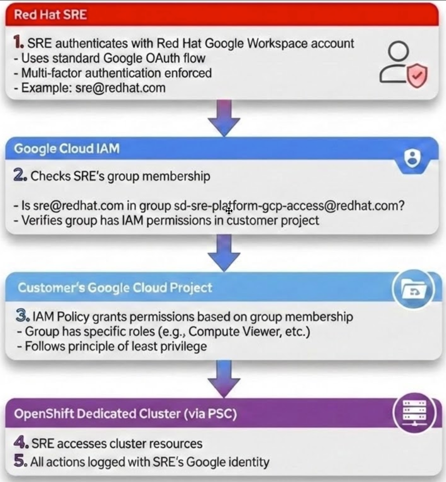
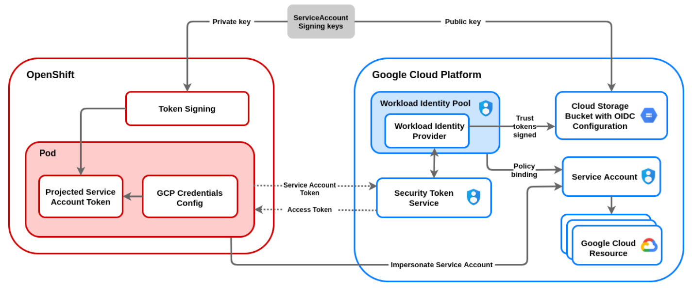
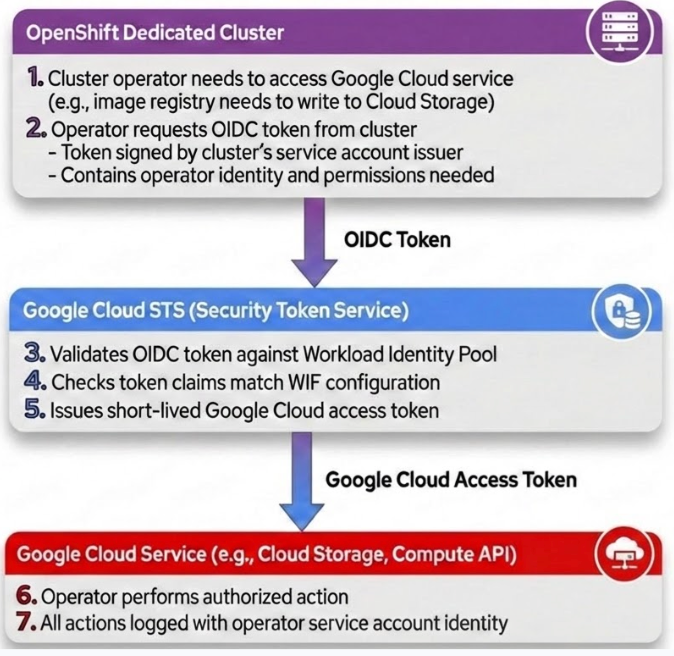
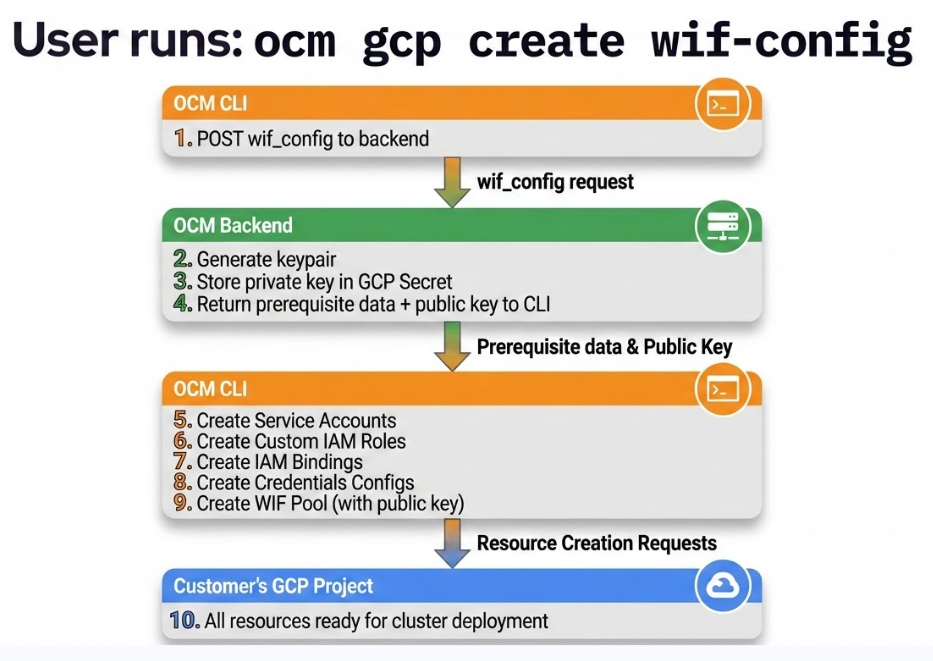
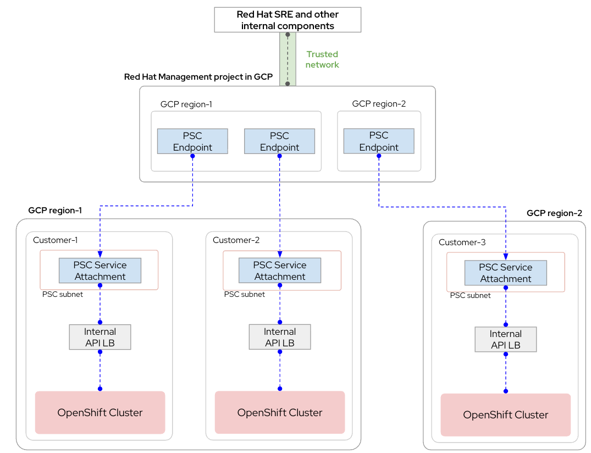
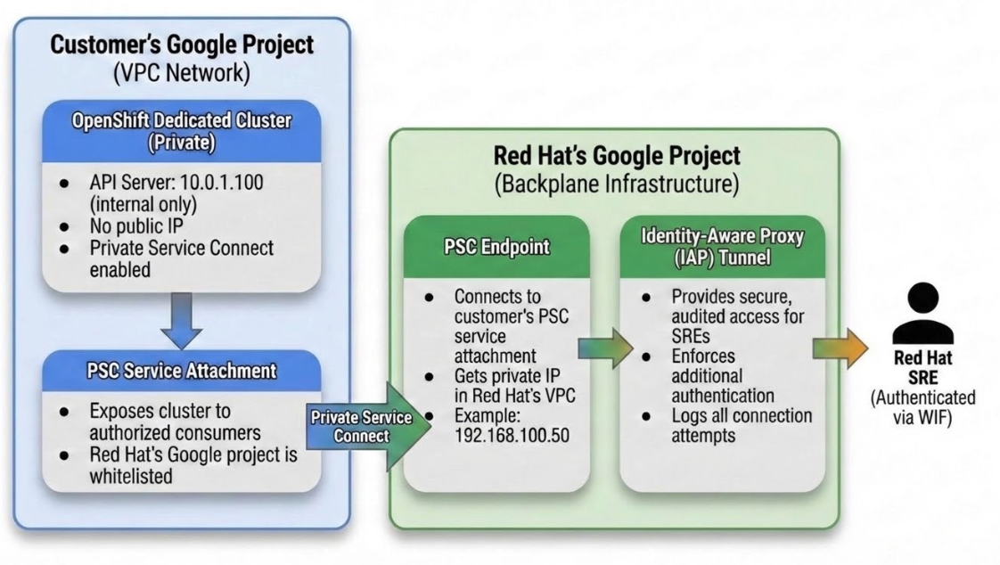
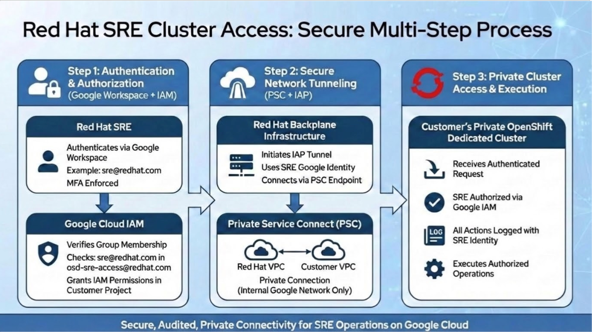

This document outlines how Red Hat Site Reliability Engineers (SREs) establish secure, private connectivity to customer OpenShift Dedicated (OSD) clusters on Google Cloud.

## Overview

Starting with OpenShift Dedicated version 4.17 on Google Cloud Platform, Red Hat has fundamentally changed how Site Reliability Engineers (SREs) access customer clusters and how cluster components authenticate to Google Cloud services. The legacy approach of using long-lived JSON service account credentials has been replaced with three key technologies:

1. **SRE Access via Google Cloud Group Membership**: Red Hat SREs authenticate using their Red Hat Google Workspace accounts and are granted access through Google Cloud IAM group membership. No service account keys are used for SRE access.

2. **Workload Identity Federation (WIF) for Cluster Components**: Cluster operators and automated management tools use WIF to authenticate to Google Cloud services without static service account keys. WIF enables cluster components (like the image registry or ingress controller) to obtain short-lived credentials.

3. **Private Service Connect (PSC) for Network Connectivity**: Provides secure, private networking between Red Hat's infrastructure and customer clusters. PSC allows Red Hat to reach the cluster's internal API load balancer via a private endpoint, eliminating the need for public interfaces.

This modernized architecture significantly improves security posture, eliminates credential management overhead, and provides auditable access to customer environments.

---

## The Legacy Method (Pre-4.17): JSON Service Account Keys

### How It Worked

Prior to OpenShift Dedicated 4.17, Red Hat SREs connected to customer OpenShift clusters using a traditional approach:

1. **Long-Lived Service Account Keys**
   - Google Cloud service accounts were created with JSON key files
   - These keys contained permanent credentials with no expiration<br><br>

2. **Direct Network Access**
   - SREs connected directly to the cluster's API server
   - Required either public exposure or complex VPN/bastion configurations
   - Network paths were often less auditable and harder to secure<br><br>

3. **Credential Lifecycle Challenges**
   - JSON keys needed manual rotation
   - Revocation required deleting and regenerating keys<br><br>

### Why This Architecture Evolved
- **Security Risk**: Long-lived credentials provided a persistent target for attackers; if a JSON key was leaked, it offered indefinite access until detected.<br><br>

- **Compliance Requirements**: Many enterprise security standards now mandate "keyless" or "token-based" authentication and forbid the use of long-lived static secrets.<br><br>

- **Network Perimeter**: Organizations increasingly move toward "Private by Default" architectures, making public management endpoints an unacceptable security risk.<br><br>

- **Operational Risk**: Manual key rotation was error-prone and increased the likelihood of accidental service disruptions during credential updates.<br><br>

---

## The New Method Part 1: SRE Access via Group Membership

### How SRE Access Works

Red Hat SREs access customer OpenShift Dedicated clusters using **Google Cloud IAM group membership** rather than service account keys or tokens. This approach leverages Google Cloud’s native identity and access management.

### Authentication Flow for SREs



### Key Components

1. **Google Workspace Identity**
   - SREs use their Red Hat Google Workspace accounts (@redhat.com)
   - Standard Google OAuth authentication with MFA
   - No service account keys or static credentials<br><br>

2. **Google Cloud Groups**
   - SREs are members of specific Google Cloud groups
   - Example: `osd-sre-access@redhat.com`
   - Group membership managed centrally by Red Hat IT<br><br>

3. **IAM Policy Bindings**
   - Customer’s Google Cloud project has IAM policies that grant permissions to Red Hat groups
   - Bindings created during cluster installation
   - Permissions are scoped to minimum required access<br><br>

4. **Audit Logging**
   - All SRE actions logged with their individual Google identity
   - Full Cloud Audit Logs trail
   - Customer can see exactly who accessed what and when<br><br>

### Benefits of Group-Based Access

- ✅ **No Credential Management**: No service account keys to create, rotate, or revoke
- ✅ **Individual Attribution**: Every action tied to a specific SRE’s identity
- ✅ **Centralized Control**: Group membership managed in one place by Red Hat IT
- ✅ **Automatic Revocation**: Removing SRE from group immediately revokes access
- ✅ **MFA Enforcement**: Google Workspace MFA policies apply to all SRE access
- ✅ **Native Google Integration**: Uses standard Google Cloud IAM, no custom auth systems

---

## The New Method Part 2: Workload Identity Federation (WIF) for Cluster Components and Automation Tools

### What is Workload Identity Federation?

Workload Identity Federation (WIF) allows **cluster operators and automated tools** running inside OpenShift Dedicated to authenticate to Google Cloud services **without the use of static service account keys**.

Instead of relying on stored JSON files, WIF establishes a secure trust relationship between the cluster’s identity provider and Google Cloud. This allows cluster components to exchange short-lived OIDC (OpenID Connect) tokens for temporary Google Cloud access tokens.

### Who Uses WIF?

WIF is used by **day-1 cluster operators** that need to interact with Google Cloud APIs:
- **Cluster Operators**: Components like the image registry, ingress controller, and storage CSI drivers that require GCP API access
- **Automated Tools**: Red Hat’s management automation and monitoring systems that interact with Google Cloud services
- **NOT used by SREs**: SREs use group membership (see Part 1)

{}
Not all day-2 operators that require WIF support have WIF-enablement implemented yet. If you deploy additional operators that need to authenticate to Google Cloud services, verify whether they support Workload Identity Federation before installation.
{}

{}
If you are configuring GCP Organization Policy Constraints that are supported with OSD (e.g., `constraints/iam.allowedPolicyMemberDomains`), certain GCP project IDs must be whitelisted that are required for WIF. Failing to whitelist these project IDs will prevent Workload Identity Federation from functioning correctly.
{}

### High-Level Architecture

The following diagram illustrates how Workload Identity Federation enables keyless authentication for cluster components:



In this architecture:
- Cluster operators running inside OpenShift Dedicated request OIDC tokens from the cluster’s service account issuer<br><br>
- These tokens are exchanged with Google Cloud’s Security Token Service (STS) for short-lived Google Cloud access tokens<br><br>
- The Workload Identity Pool configuration defines the trust relationship between the cluster and Google Cloud<br><br>
- Each cluster component is mapped to a specific Google Cloud service account with least-privilege permissions<br><br>

### How WIF Works



### Key Components

1. **OIDC Provider Configuration**
   - Cluster configures an OIDC issuer URL in the customer’s Google Cloud project
   - Google Cloud trusts tokens signed by this issuer
   - Configuration includes allowed service accounts and attribute mappings<br><br>

2. **Workload Identity Pool**
   - A Google Cloud resource that groups external identities from the cluster
   - Defines which OIDC issuers are trusted
   - Maps OIDC tokens to Google Cloud service accounts<br><br>

3. **Service Account Binding**
   - Cluster operator identities are mapped to specific Google Cloud service accounts
   - These service accounts have minimal, component-specific permissions
   - Follows principle of least privilege<br><br>

### WIF Configuration in OpenShift Dedicated

During cluster creation, OpenShift Dedicated automatically:

- Pre-creates necessary Google Cloud service accounts for cluster operators
- Configures Workload Identity Pool with the cluster’s OIDC issuer
- Sets up IAM bindings that map cluster operator identities to Google Cloud service accounts
- Establishes attribute conditions for least-privilege access

### WIF Setup Process: Behind the Scenes

This section describes how WIF is configured for cluster operators and automated tools during cluster creation.

#### Keypair Generation and Storage

The setup of a Workload Identity Pool requires an encryption keypair for signing OIDC tokens from cluster components. This keypair management is critical for security:

**How the Keypair Works:**
- **Private Key**: Stored in the OpenShift Dedicated cluster, used to sign short-lived identity tokens for cluster operators<br><br>
- **Public Key**: Given to the customer to create the OIDC provider in their Google Cloud project, used to verify token signatures from the cluster<br><br>

**Storage Strategy:**

Unlike the original design that intended to store the keypair in the OCM database, Red Hat adopted a more secure approach:

1. **Keypair Generation**: When a user creates a WIF configuration, the OCM backend generates the public/private keypair<br><br>
2. **Private Key Storage**: The private key is stored as a **Google Secret** in Red Hat's own dedicated Google project<br><br>
3. **Cluster Deployment**: During cluster creation, OCM retrieves the secret from Red Hat's Google project and places it in the Hive namespace to be passed into the OpenShift Dedicated cluster<br><br>

**Why This Approach?**

- ✅ **Minimizes Sensitive Data in OCM Database**: Aligns with Red Hat's policy to avoid storing secrets in databases
- ✅ **No Customer Cost**: The secret is stored in Red Hat's project, not the customer's
- ✅ **Simplified User Experience**: Users don't need to manage keypair generation or grant Red Hat access to their secrets
- ✅ **Follows Proven Patterns**: Mirrors the successful ROSA STS implementation on AWS

#### High-Level Backend Process

When a user runs `ocm gcp create wif-config`, the following automated workflow occurs:

**Step 1: Create WIF Config Object**

The OCM CLI makes a POST call to the OCM backend to create a `wif_config` object. This object defines all prerequisite resources needed in the customer's Google Cloud project:

- Service Account names (unique per wif_config)
- IAM Roles to attach to those Service Accounts
- Permissions bound to those Roles (if not using predefined Google Cloud roles)
- The public key for the Workload Identity Pool
- Required Google Cloud  Service APIs to enable

**Step 2: Receive Prerequisite Data**

The OCM backend returns the prerequisite data in the POST response. This includes:

```json
{
  "service_accounts": {
    "deployment_service_accounts": [...],
    "operator_service_accounts": [...]
  },
  "custom_iam_roles": [...],
  "iam_bindings": [...],
  "public_key": "-----BEGIN PUBLIC KEY-----...",
  "required_apis": [
    "iam.googleapis.com",
    "cloudresourcemanager.googleapis.com",
    ...
  ]
}
```

**Step 3: CLI Creates Resources in Customer's Google Project**

Using the prerequisite data, the OCM CLI automatically provisions the following resources in the customer's Google Cloud project:

1. **Service Accounts**
   - **Deployment Service Accounts**: Used by OCM to deploy and manage the cluster
   - **Operator Service Accounts**: Used by cluster operators (e.g., image registry, ingress controller)<br><br>

2. **Custom IAM Roles**
   - Roles with specific permissions tailored for each service account
   - Follows principle of least privilege<br><br>

3. **IAM Policy Bindings**
   - Binds service accounts to their respective roles
   - Establishes which identities can impersonate which service accounts<br><br>

4. **Credentials Configs for Service Accounts**
   - Provides OCM with **impersonation access** to the Deployment Service Account
   - Allows cluster creation without long-lived credentials<br><br>

5. **Workload Identity Federation Pool**
   - Configured with the public key returned from OCM backend
   - Provides cluster operators with **federated access** to Operator Service Accounts
   - Maps OIDC tokens from the cluster to Google Cloud service accounts<br><br>

**Step 4: Verification**

The OCM CLI ensures that all resources in the customer's Google Cloud account match the expectations defined in the `wif_config` object. This validation step prevents configuration drift and ensures the cluster will have the permissions it needs.

**Visual Flow:**



### Benefits of WIF for Cluster Components

- ✅ **No Long-Lived Credentials**: Tokens expire automatically (typically 1 hour)
- ✅ **Automatic Rotation**: Fresh tokens are issued for each access request by cluster operators
- ✅ **Improved Auditability**: Every token request and usage is logged with the specific operator identity
- ✅ **Reduced Attack Surface**: No JSON keys to steal or misuse
- ✅ **Compliance-Friendly**: Meets requirements for keyless authentication
- ✅ **Secure by Default**: Cluster operators never have access to long-lived credentials

---

## The New Method Part 3: Private Service Connect (PSC)

### What is Private Service Connect?

Private Service Connect is a Google Cloud networking feature that allows private connectivity to managed services and Google APIs over the internal backbone, bypassing the public internet for enhanced security and simplified management.

### Why PSC for SRE Access?

Many customers deploy OpenShift Dedicated with **Private endpoints** enabled, meaning:
- The cluster API server has no public endpoint
- The default Ingress Controller is configured as private, making all applications accessible only via private networking
- Only private IP addresses are accessible

PSC enables Red Hat SREs to securely access these private clusters by creating a **private tunnel** from Red Hat's infrastructure directly to the customer's private cluster.

### High-Level Architecture

The following diagram illustrates how Private Service Connect enables secure, private connectivity to OpenShift Dedicated clusters:



In this architecture:
- Red Hat's infrastructure connects to customer clusters via PSC endpoints, avoiding the public internet entirely
- PSC Service Attachments in the customer's VPC expose the cluster's API server to authorized consumers (Red Hat)
- Identity-Aware Proxy (IAP) provides an additional authentication layer for SRE connections
- All traffic flows over Google's private network backbone, never traversing the public internet
- The customer's VPC remains isolated with no VPC peering or IPSec VPN required

### How PSC Works for OpenShift Dedicated-Google



### PSC Components

1. **Service Attachment (Customer Side)**
   - Created in the customer's Google project
   - Exposes the cluster's private API endpoint
   - Configured to accept connections only from Red Hat's project
   - Can set connection limits and access controls<br><br>

2. **PSC Endpoint (Red Hat Side)**
   - Created in Red Hat's backplane infrastructure
   - Connects to the customer's service attachment
   - Receives a private IP address in Red Hat's VPC
   - Acts as the gateway for SRE access<br><br>

3. **Identity-Aware Proxy (IAP)**
   - Additional security layer on top of PSC
   - Requires SRE to authenticate before accessing the tunnel
   - Provides detailed audit logs of who connected when
   - Supports time-based access policies<br><br>

### Network Flow with PSC

1. SRE authenticates to Red Hat's backplane system
2. SRE requests access to specific customer cluster
3. Backplane establishes IAP tunnel through PSC endpoint
4. Traffic flows privately from Red Hat VPC → PSC endpoint → Service attachment → Customer's cluster
5. All traffic stays within Google's private network (never touches internet)

### Benefits of PSC

- ✅ **True Private Access**: No public internet exposure
- ✅ **No VPC Peering**: Customer's VPC remains isolated
- ✅ **No IP Conflicts**: Each connection gets its own endpoint
- ✅ **Scalable**: Can support many clusters without complex routing
- ✅ **Auditable**: Every connection logged through IAP
- ✅ **Fast Setup**: No firewall rules or VPN configuration needed

---

## Combined Architecture: Group Membership + PSC for SRE Access

### The Complete SRE Access Flow



### Security Improvements

| Aspect | Old Method (JSON Keys) | New Method (WIF + PSC) |
|--------|------------------------|------------------------|
| **Credentials** | Long-lived JSON keys | Short-lived OIDC tokens |
| **Expiration** | Manual rotation required | Auto-expires (1 hour) |
| **Network** | Public or VPN required | Private connection only |
| **Auditability** | Limited key usage logs | Full IAP + Google audit trail |
| **Revocation** | Manual key deletion | Automatic on token expiry |
| **Attack Surface** | Stored keys can be stolen | No persistent credentials |
| **Compliance** | Requires custom controls | Built-in controls |

---

## Key Takeaways

1. **SREs Use Group Membership**: Red Hat SREs access clusters using Google Workspace accounts and Google Cloud IAM group membership, not service account keys or WIF tokens<br><br>
2. **WIF for Cluster Components**: Workload Identity Federation is used by cluster operators and automated tools, not SREs<br><br>
3. **No More JSON Keys**: Both SRE access (via groups) and cluster component access (via WIF) eliminate the need for long-lived service account credentials<br><br>
4. **Private by Default**: PSC ensures all connections never traverse the public internet<br><br>
5. **Enhanced Auditing**: Every authentication and connection is logged with individual identity (SRE identity or component identity)<br><br>
6. **Better Compliance**: Aligns with zero-trust security principles and regulatory requirements<br><br>
7. **Operational Efficiency**: Reduced credential management overhead for Red Hat and customers<br><br>

---

