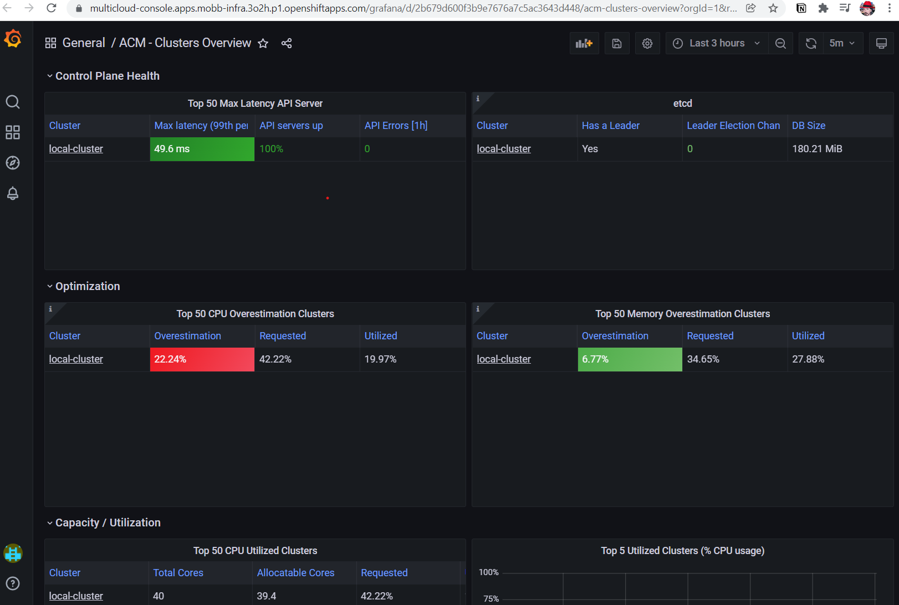

## Deploying RHACM Observability on ROSA
This document provides a complete guide to deploying ACM Observability on a ROSA cluster with Thanos-based metrics storage using AWS S3

- **Thanos-based metrics storage** using AWS S3 for persistent, long-term metrics retention
- **Grafana dashboards** for multi-cluster observability and visualization
- **Persistent metrics** retention across managed clusters

## Prerequisites

**Required:**
- An existing ROSA cluster (Classic or HCP)
- Advanced Cluster Management (ACM) 2.10+ installed and operational
- AWS CLI configured with appropriate permissions
- `oc` CLI authenticated to your ROSA cluster

### Verify Prerequisites

Before proceeding, validate your environment meets all requirements:

```bash
# 1. Verify ROSA cluster access

oc login https://api.cluster_name.t6k4.i1.organization.org:6443 \
> --username cluster-admin \
> --password mypa55w0rd
Login successful.
You have access to 77 projects, the list has been suppressed. You can list all projects with ' projects'

# 2. Verify ACM is installed (CRITICAL - must show "Running" status)
oc get multiclusterhub -n open-cluster-management

# 3. Verify ACM operators are running
oc get csv -n open-cluster-management | grep advanced-cluster-management

# 4. Verify AWS CLI is configured
aws sts get-caller-identity
```

**If ACM is not installed:** You must install ACM first. Follow the [ACM Installation Guide](https://access.redhat.com/documentation/en-us/red_hat_advanced_cluster_management_for_kubernetes/2.11/html/install/index) before proceeding.

## Architecture Overview

ACM Observability uses Thanos to collect, store, and query metrics from all managed clusters:
- Metrics are collected from managed clusters via the observability addon
- Thanos components (Query, Store, Compact) process and store metrics
- S3 provides durable, long-term storage for historical metrics
- Grafana provides visualization and dashboards

## Step 1: Environment Setup

Set environment variables for the deployment:

```bash
export CLUSTER_NAME=my-cluster
export S3_BUCKET=$CLUSTER_NAME-acm-observability
export REGION=us-east-2
export NAMESPACE=open-cluster-management-observability
export SCRATCH_DIR=/tmp/scratch
export AWS_ACCOUNT_ID=$(aws sts get-caller-identity --query Account --output text)
export AWS_PAGER=""

# Create scratch directory for temporary files
rm -rf $SCRATCH_DIR
mkdir -p $SCRATCH_DIR
```

### Validate Environment Variables

Verify all required variables are set:

```bash
echo "Cluster Name: $CLUSTER_NAME"
echo "S3 Bucket: $S3_BUCKET"
echo "AWS Region: $REGION"
echo "Namespace: $NAMESPACE"
echo "AWS Account ID: $AWS_ACCOUNT_ID"
```
## Step 2: Prepare AWS Infrastructure

### Create S3 Bucket

```bash
aws s3 mb s3://$S3_BUCKET
```

**Verify:**
```bash
aws s3 ls s3://$S3_BUCKET
```

### Create IAM Policy for S3 Access

```bash
cat <<EOF > $SCRATCH_DIR/s3-policy.json
{
    "Version": "2012-10-17",
    "Statement": [
        {
            "Sid": "Statement",
            "Effect": "Allow",
            "Action": [
                "s3:ListBucket",
                "s3:GetObject",
                "s3:DeleteObject",
                "s3:PutObject",
                "s3:PutObjectAcl",
                "s3:CreateBucket",
                "s3:DeleteBucket"
            ],
            "Resource": [
                "arn:aws:s3:::$S3_BUCKET/*",
                "arn:aws:s3:::$S3_BUCKET"
            ]
        }
    ]
}
EOF
```

**Apply the Policy:**

```bash
S3_POLICY=$(aws iam create-policy --policy-name $CLUSTER_NAME-acm-obs \
  --policy-document file://$SCRATCH_DIR/s3-policy.json \
  --query 'Policy.Arn' --output text)
echo "Created policy: $S3_POLICY"
```

**Verify:**
```bash
aws iam get-policy --policy-arn $S3_POLICY
```

### Create IAM User

```bash
aws iam create-user --user-name $CLUSTER_NAME-acm-obs \
  --query User.Arn --output text
```

**Verify:**
```bash
aws iam get-user --user-name $CLUSTER_NAME-acm-obs
```

### Attach Policy to User

```bash
aws iam attach-user-policy --user-name $CLUSTER_NAME-acm-obs \
  --policy-arn ${S3_POLICY}
```

**Verify:**
```bash
aws iam list-attached-user-policies --user-name $CLUSTER_NAME-acm-obs
```

### Generate Access Keys

```bash
read -r ACCESS_KEY_ID ACCESS_KEY < <(aws iam create-access-key \
  --user-name $CLUSTER_NAME-acm-obs \
  --query 'AccessKey.[AccessKeyId,SecretAccessKey]' --output text)

echo "Access Key ID: $ACCESS_KEY_ID"
echo "Secret Key: [HIDDEN]"
```

## Step 3: Configure ACM Observability on OpenShift

### Create Observability Namespace

```bash
oc new-project $NAMESPACE
```

### Create Pull Secret

The observability components need a pull secret to download container images:

```bash
DOCKER_CONFIG_JSON=$(oc extract secret/multiclusterhub-operator-pull-secret -n open-cluster-management --to=- 2>/dev/null) || \
  DOCKER_CONFIG_JSON=$(oc extract secret/pull-secret -n openshift-config --to=-)

oc create secret generic multiclusterhub-operator-pull-secret \
  -n $NAMESPACE \
  --from-literal=.dockerconfigjson="$DOCKER_CONFIG_JSON" \
  --type=kubernetes.io/dockerconfigjson
```

**Verify:**
```bash
oc get secret multiclusterhub-operator-pull-secret -n $NAMESPACE
```

### Create Thanos Object Storage Secret

This secret contains S3 credentials for Thanos to store metrics:

```bash
cat << EOF | oc apply -f -
apiVersion: v1
kind: Secret
metadata:
  name: thanos-object-storage
  namespace: $NAMESPACE
type: Opaque
stringData:
  thanos.yaml: |
    type: s3
    config:
      bucket: $S3_BUCKET
      endpoint: s3.$REGION.amazonaws.com
      signature_version2: false
      access_key: $ACCESS_KEY_ID
      secret_key: $ACCESS_KEY
EOF
```

**Verify:**
```bash
oc get secret thanos-object-storage -n $NAMESPACE
```

**Validate secret content:**
```bash
oc get secret thanos-object-storage -n $NAMESPACE -o jsonpath='{.data.thanos\.yaml}' | base64 -d
```

## Step 4: Deploy MultiClusterObservability

Create the MultiClusterObservability custom resource to enable observability:

```bash
cat << EOF | oc apply -f -
apiVersion: observability.open-cluster-management.io/v1beta2
kind: MultiClusterObservability
metadata:
  name: observability
spec:
  observabilityAddonSpec: {}
  storageConfig:
    metricObjectStorage:
      name: thanos-object-storage
      key: thanos.yaml
EOF
```

**Expected Output:** Resource created (status may show "Pending" initially)
```bash
oc get multiclusterobservability observability -n $NAMESPACE
```

## Step 5: Verify Deployment

### Monitor Deployment Progress
After the immediate creation of MultiClusterObservability, pods will start within 2 to 5 minutes, reach a running state within 5 to 10 minutes, and display the first metrics in 10 to 15 minutes.

```bash
# Watch MultiClusterObservability status
oc get multiclusterobservability observability -w

# In another terminal, watch pods being created
oc get pods -n $NAMESPACE -w
```

### Check All Pods Are Running

```bash
oc get pods -n $NAMESPACE
```

**Expected Output:**
```
NAME                                                  READY   STATUS
observability-thanos-query-...                        3/3     Running
observability-thanos-query-frontend-...               1/1     Running
observability-thanos-receive-default-...              1/1     Running
observability-thanos-store-shard-0-...                1/1     Running
observability-rbac-query-proxy-...                    2/2     Running
observability-observatorium-api-...                   1/1     Running
observability-grafana-...                             2/2     Running
```

### Verify S3 Bucket Has Data

After 10-15 minutes, metrics should start appearing in S3:

```bash
aws s3 ls s3://$S3_BUCKET/ --recursive | head -10
```

### Get Grafana Route

```bash
GRAFANA_URL=$(oc get route grafana -n $NAMESPACE -o jsonpath='{.spec.host}' 2>/dev/null)
```

### Test Grafana Access

```bash
curl -k -I https://$GRAFANA_URL
```

## Step 6: Access ACM Observability Dashboards

1. **Via ACM Console:**
   - Log into the OpenShift console
   - Navigate to **ACM** > **Overview**
   - Click on **Grafana** link in the Observability section

2. **Direct Access:**
   - Visit the Grafana URL from the previous step
   - Log in with your OpenShift credentials

3. **Available Dashboards:**
   - **ACM - Clusters Overview**: Health and status of all managed clusters
   - **ACM - Resource Optimization**: Resource usage and capacity planning
   - **ACM - Applications**: Application deployment metrics



## Cleanup / Uninstall

To remove ACM Observability:

```bash
# Delete MultiClusterObservability resource
oc delete multiclusterobservability observability

# Wait for all resources to be cleaned up
oc wait --for=delete pods --all -n $NAMESPACE --timeout=300s

# Delete namespace
oc delete namespace $NAMESPACE

# Delete AWS resources (CAUTION: This deletes the S3 bucket and all metrics)
aws s3 rb s3://$S3_BUCKET --force
aws iam detach-user-policy --user-name $CLUSTER_NAME-acm-obs --policy-arn $S3_POLICY
aws iam delete-access-key --user-name $CLUSTER_NAME-acm-obs --access-key-id $ACCESS_KEY_ID
aws iam delete-user --user-name $CLUSTER_NAME-acm-obs
aws iam delete-policy --policy-arn $S3_POLICY
```

## Additional Resources

- **ACM Installation Guide:** [Installing ACM on OpenShift](https://access.redhat.com/documentation/en-us/red_hat_advanced_cluster_management_for_kubernetes/2.11/html/install/index)
- **ACM Observability Documentation:** [Red Hat ACM 2.11 Observability](https://access.redhat.com/documentation/en-us/red_hat_advanced_cluster_management_for_kubernetes/2.11/html/observability/index)
- **Thanos Documentation:** [Thanos S3 Configuration](https://thanos.io/tip/thanos/storage.md/#s3)
- **ROSA Documentation:** [Red Hat OpenShift Service on AWS](https://docs.openshift.com/rosa/welcome/index.html)
