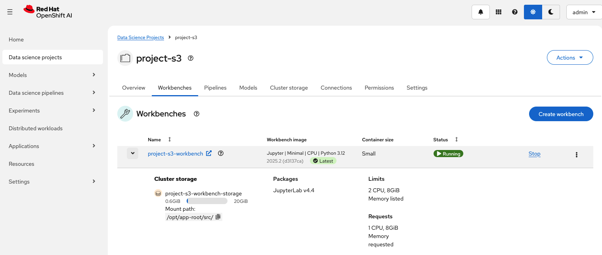
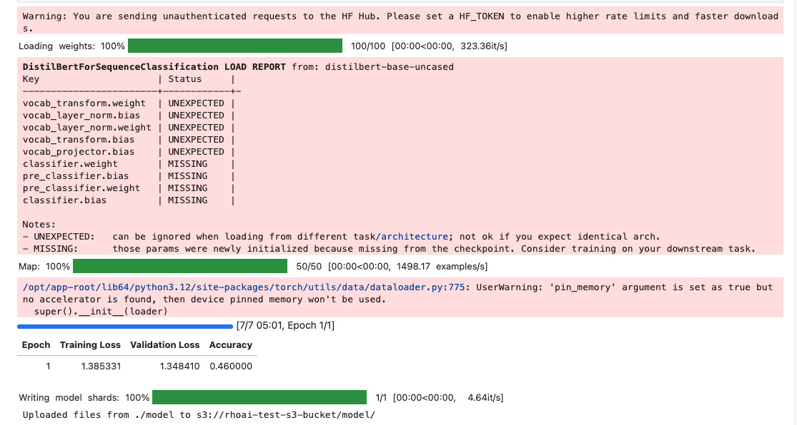
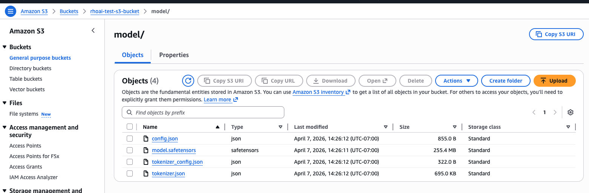

Red Hat OpenShift AI has evolved significantly in recent releases. In this walkthrough, we install OpenShift AI on ROSA, disable unnecessary KServe-related dependencies for a notebook-only workflow, create an Amazon S3 connection, launch a workbench, train a lightweight text classification model, and upload the resulting model artifacts to Amazon S3.

Note that this article does not cover model serving. Starting with Red Hat OpenShift AI 2.25, the [KServe Serverless deployment mode is deprecated](https://docs.redhat.com/en/documentation/red_hat_openshift_ai_self-managed/2.25/html/release_notes/support-removals_relnotes#deprecated_kserve_serverless_deployment_mode). KServe RawDeployment remains available and uses fewer dependencies.

## 0. Prerequisites

Before you start, make sure you have:

- a working ROSA cluster
- cluster-admin access
- a default dynamic storage class
- enough worker capacity for OpenShift AI
- an S3 bucket and credentials

If your existing worker nodes are too small or already heavily used, create a dedicated machine pool for OpenShift AI before continuing.

Verify that your cluster has healthy worker nodes and a default storage class:

```bash
oc get nodes -o wide
oc get sc
```

## 1. Install the Red Hat OpenShift AI Operator

From the OpenShift web console:

1. Go to **Ecosystem** -> **Software Catalog** (this is formerly known as OperatorHub)
2. Search for **Red Hat OpenShift AI**
3. Install the operator

At this point, the default OpenShift AI installation can leave the `DataScienceCluster` in a `Not Ready` state because `KServe` is enabled by default and expects additional serving-related dependencies, even though this walkthrough only uses workbenches and Amazon S3.

## 2. Disable KServe-related blockers for this walkthrough

This guide does not use model serving, so remove the unnecessary serving dependencies after installing OpenShift AI.

Patch the DSCI to remove Service Mesh:

```bash
oc patch dsci default-dsci -n redhat-ods-operator --type=merge -p '
spec:
  serviceMesh:
    managementState: Removed
'
```

Patch the DSC to remove KServe:

```bash
oc patch datasciencecluster default-dsc -n redhat-ods-applications --type=merge -p '
spec:
  components:
    kserve:
      managementState: Removed
'
```

Verify that the cluster becomes ready:

```bash
oc get datasciencecluster default-dsc -n redhat-ods-applications -o jsonpath='{.status.phase}{"\n"}'
```

You want the output to become:

```text
Ready
```

## 3. Create the Amazon S3 bucket

Create an S3 bucket in the AWS console or by using the AWS CLI. If you already have an S3 bucket and credentials available, you can skip this step and use your existing bucket instead.

For this walkthrough, I used `rhoai-test-s3-bucket` in `ca-central-1`, the same AWS region as the ROSA cluster. Using the same region keeps the example simple and avoids unnecessary cross-region configuration. 

The regional Amazon S3 endpoint for `ca-central-1` is:

```text
https://s3.ca-central-1.amazonaws.com
```


## 4. Create a data science project

After OpenShift AI is installed and the `DataScienceCluster` is ready, open the **OpenShift AI dashboard**.

1. Click **Data science projects**
2. Click **Create project**
3. Enter a project name, for example `project-s3`
4. Optionally add a description
5. Click **Create**

## 5. Create a workbench and add the S3 connection

Inside the project you just created:

1. Open the **Workbenches** tab
2. Click **Create workbench**
3. Enter a workbench name
4. Select a Jupyter image
5. Choose a modest size for this CPU-only validation
6. In the **Connections** section, click **Create connection**
7. Choose **S3 compatible object storage - v1**
8. Enter the connection details (see below after workbench snippet)
9. Click **Create** to create the connection
10. Click **Create workbench**
11. Wait for the workbench to become **Running**
12. Click the workbench name to launch it in a new tab

<br />


<br />

For AWS S3 in `ca-central-1`, the values used in this walkthrough were:

* **Connection name:** `rhoai-test-s3-connection`
* **Endpoint:** `https://s3.ca-central-1.amazonaws.com`
* **Region:** `ca-central-1`
* **Bucket:** `rhoai-test-s3-bucket`

You will also need the AWS **access key** and **secret key** for the bucket.


## 6. Install the Python packages

Open a notebook cell in the workbench and run:

```python
!pip install -U transformers tokenizers datasets torch evaluate accelerate boto3 protobuf sentencepiece tiktoken ipywidgets scikit-learn
```

After the installation completes, restart the kernel before continuing.

## 7. Train a lightweight model and upload the artifacts to S3

In this walkthrough, we use `distilbert-base-uncased`, which is a safe and  mainstream choice for a lightweight demo. This example also keeps the dataset intentionally small and uses one epoch so the walkthrough finishes in a reasonable time on CPU.

Run the following on the next cell.

```python
# import the necessary functions and APIs
import os
import numpy as np
import evaluate
import boto3
from datasets import load_dataset
from transformers import AutoTokenizer, AutoModelForSequenceClassification, TrainingArguments, Trainer

# disable tokenizers parallelism warning
os.environ["TOKENIZERS_PARALLELISM"] = "false"

# load a small portion of the AG News dataset
dataset = load_dataset("ag_news")
small_dataset = dataset["train"].shuffle(seed=42).select(range(50))

# load the model, tokenizer, and pre-trained model
model_name = "distilbert-base-uncased"
tokenizer = AutoTokenizer.from_pretrained(model_name)
model = AutoModelForSequenceClassification.from_pretrained(model_name, num_labels=4)

# tokenize the dataset
def tokenize_function(examples):
    return tokenizer(examples["text"], padding="max_length", truncation=True)

tokenized_datasets = small_dataset.map(tokenize_function, batched=True)

# load the accuracy metric
metric = evaluate.load("accuracy")

# compute evaluation metrics
def compute_metrics(eval_pred):
    logits, labels = eval_pred
    predictions = np.argmax(logits, axis=-1)
    return metric.compute(predictions=predictions, references=labels)

# training configuration
training_args = TrainingArguments(
    output_dir="./results",
    eval_strategy="epoch",
    save_strategy="no",
    learning_rate=2e-5,
    per_device_train_batch_size=8,
    per_device_eval_batch_size=8,
    num_train_epochs=1,
    weight_decay=0.01,
    report_to="none",
    logging_steps=5,
)

# trainer
trainer = Trainer(
    model=model,
    args=training_args,
    train_dataset=tokenized_datasets,
    eval_dataset=tokenized_datasets,
    processing_class=tokenizer,
    compute_metrics=compute_metrics,
)

# train
trainer.train()

# save locally
model_save_dir = "./model"
os.makedirs(model_save_dir, exist_ok=True)
tokenizer.save_pretrained(model_save_dir)
model.save_pretrained(model_save_dir)

# upload to S3
s3_client = boto3.client("s3")
bucket_name = "rhoai-test-s3-bucket"
model_save_path = "model/"

for file_name in os.listdir(model_save_dir):
    s3_client.upload_file(
        os.path.join(model_save_dir, file_name),
        bucket_name,
        model_save_path + file_name
    )

print(f"Uploaded files from {model_save_dir} to s3://{bucket_name}/{model_save_path}")
```

If training feels slow, feel free to reduce the dataset further:

```python
small_dataset = dataset["train"].shuffle(seed=42).select(range(20))
```

## 8. Understanding the notebook output

Note that you may see similar output to below snippet.

<br />


<br />

Some of the notebook output is expected and does not indicate a failure.

The Hugging Face warning simply means the model is being downloaded without an authentication token. The `UNEXPECTED` and `MISSING` entries in the DistilBERT load report are also expected when loading a base pretrained model for a sequence classification task. 

The tokenization progress confirms that the dataset was processed successfully, and the `pin_memory` warning only indicates that the workbench is using CPU rather than GPU.

A line such as `[7/7 05:01, Epoch 1/1]` shows that all training steps completed and that the model finished 1 epoch, or 1 full pass through the dataset.

The metrics table reports the training loss, validation loss, and accuracy for this validation run. Because this walkthrough intentionally uses a very small dataset and a single epoch, the goal is to validate the workflow rather than optimize model quality.

Finally, output such as `Uploaded files from ./model to s3://rhoai-test-s3-bucket/model/` confirms that the model artifacts were saved locally and uploaded successfully to Amazon S3.

To verify that, open the S3 bucket in the AWS console and confirm that the `model/` prefix contains artifacts such as:

* `config.json`
* `model.safetensors`
* `tokenizer_config.json`
* `tokenizer.json`


<br />




That confirms the end-to-end workflow from OpenShift AI workbench to Amazon S3.
