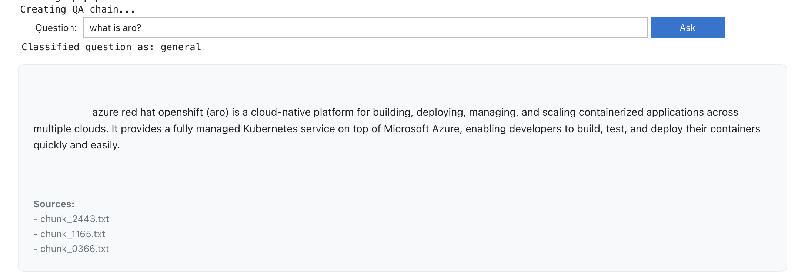
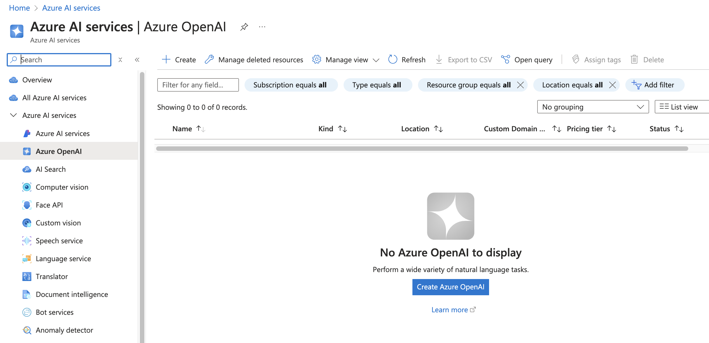
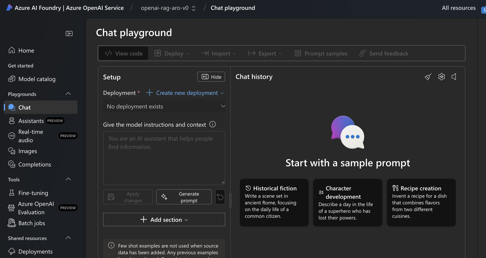
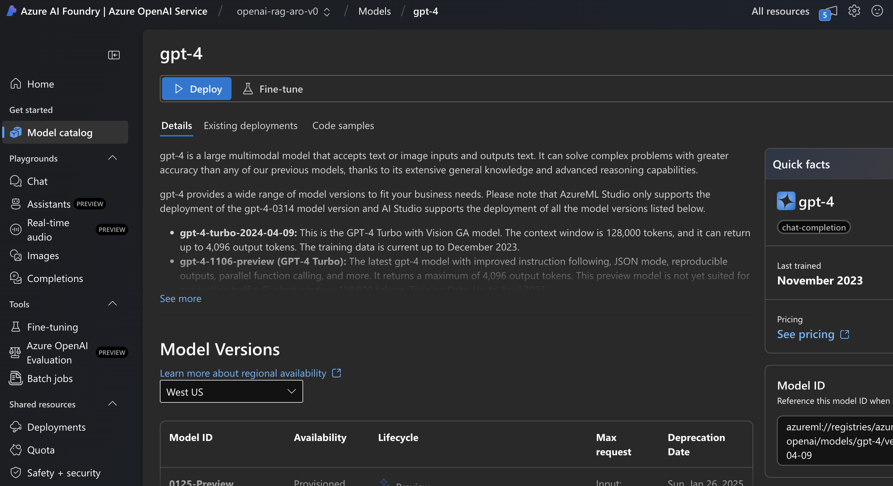

## 1. Introduction
[Retrieval-Augmented Generation](https://en.wikipedia.org/wiki/Retrieval-augmented_generation) (RAG) is a technique to enhance Large Language Models (LLMs) to retrieve relevant information from a knowledge base before generating responses, rather than relying solely on their training. [LangChain](https://github.com/langchain-ai/langchain) is a framework for developing applications powered by language models. It provides tools and APIs that make it easier to create complex applications using LLMs, such as using RAG technique to enable the chatbot to answer questions based on the provided document.

This tutorial is a simple guide on how to create RAG chatbot that can provide sufficient response when asked about ARO based on [official ARO documentation](https://learn.microsoft.com/pdf?url=https%3A%2F%2Flearn.microsoft.com%2Fen-us%2Fazure%2Fopenshift%2Ftoc.json), which consists of 421 PDF pages at the time of writing. We will be using [Red Hat OpenShift AI](https://www.redhat.com/en/technologies/cloud-computing/openshift/openshift-ai) (RHOAI), formerly called Red Hat OpenShift Data Science (RHODS), which is an OpenShift platform for AI/ML projects management, and we will be running this on an [Azure Red Hat OpenShift](https://azure.microsoft.com/en-us/products/openshift) (ARO) cluster, which is our managed service OpenShift platform on Azure. 

Here we will create a chatbot using [TinyLlama](https://arxiv.org/abs/2401.02385) model and we will use several key components from LangChain for document loading (`PyPDFLoader`), text splitting (`RecursiveCharacterTextSpliter`), vector store (`FAISS`), retrieval chain (`RetrievalQA`), and prompt templates (`PromptTemplate`), to help build our chatbot. And at the end of this tutorial, there will be an optional section to create another RAG system using [GPT-4](https://en.wikipedia.org/wiki/GPT-4) model via [Azure OpenAI Service](https://azure.microsoft.com/en-us/products/ai-services/openai-service), and from there we will compare the responses from both systems.

*Disclaimer: When interacting with chatbots and AI language models, please be aware that while these systems include content filters and safety features, they are not infallible. It is your responsibility to use these tools appropriately and ensure your interactions are suitable. Neither the author of this tutorial nor the service providers can be held responsible for any unexpected or inappropriate responses. By proceeding, you acknowledge that AI responses can be unpredictable and may occasionally contain inaccuracies or deviate from the expected behavior. It is important to review and verify any critical information or advice received from these systems before acting upon it. In addition, please note that user interfaces may change over time as the products evolve. Some screenshots and instructions may not exactly match what you see.*


## 2. Prerequisites

1. An ARO cluster (>= version 4.15)   
- You can deploy it [manually](https://cloud.redhat.com/experts/quickstart-aro/) or using [Terraform](https://cloud.redhat.com/experts/aro/terraform-install/).   
- I tested this using ARO version 4.15.27 with `Standard_D16s_v3` instance size for both the control plane and the worker nodes.


2. RHOAI operator  
- You can install it using console per [Section 3 in this tutorial](https://cloud.redhat.com/experts/rhoai/rosa-s3) or using CLI per [Section 3 in this tutorial](https://cloud.redhat.com/experts/rhoai/rosa-gpu/).   
- I tested this tutorial using RHOAI version 2.13.1.


## 3. Creating the RAG Chatbot

Once we have the RHOAI operator installed and the `DataScienceCluster` instance created, please proceed to RHOAI dashboard and launch a Jupyter notebook instance. In this case, I'm using **TensorFlow 2024.1** image with **Medium** container size for the notebook. 

Next, we will be installing the required packages and importing the necessary libraries for the RAG system, and then we are going to do the following: 

* Step 1 -- PDF Processing and Chunking  
Here we will download the ARO documentation and break it into smaller "chunks" of text. [Chunking](https://en.wikipedia.org/wiki/Retrieval-augmented_generation#Chunking) is a technique where large documents are split into smaller, manageable pieces, and it is a crucial process since language models have token limits and they work better with smaller, focused pieces of text.
    <br />

* Step 2 -- Vector Store Creation   
[FAISS](https://github.com/facebookresearch/faiss) (Facebook AI Similarity Search) is a library that efficiently stores and searches for text embeddings, which are numerical representations of text that capture semantic meaning. Here we convert each text chunk into embeddings using [MiniLM](https://huggingface.co/sentence-transformers/all-MiniLM-L6-v2) model and these embeddings are later stored in FAISS, which allows for quick similarity searches when answering questions.
<br />

* Step 3 -- Language Model Setup\
Here we set up TinyLlama as primary language model and GPT-2 as fallback. [TinyLlama](https://huggingface.co/TinyLlama/TinyLlama-1.1B-Chat-v1.0) is an open-source small language model that is specifically trained for chat/instruction-following and can handle context and generate coherent responses while being lightweight. It is smaller but efficient language model. [GPT-2](https://huggingface.co/openai-community/gpt2) serving as the fallback model is an older but reliable model by OpenAI that runs on CPU. 

* Step 4 -- Question Classification  
Next, we will implement prompt chaining by first categorizing the questions into certain types, i.e. benefits, technical, etc. using regex patterns. And based on the type, a specific template is then chosen. The relevant documents are then retrieved, and both the context and the question are combined into a prompt which was then processed by the LLM. 

* Step 5 -- Response Formatting   
Here we are going to format the response with proper HTML styling and error handling. 

* Step 6 -- User Interface (UI) Creation   
In this step, we will create an interactive UI interface using `IPython` widgets for question input and response display.

* Step 7 -- Sytem Initialization   
Lastly, we will initialize the complete RAG system by combining all components (vector store, language model, and question-answering chain) and launch the interface. 


On Jupyter notebook, copy this code below into one cell:
```bash
"""
Step 0: Installing required packages and importing necessary libraries
"""
!pip install --upgrade pip

!pip uninstall -y torch torchvision torchaudio keras tensorflow tensorflow-cpu tensorflow-io tensorflow-estimator sentence-transformers transformers tokenizers langchain langchain-community langchain-huggingface ipywidgets pydantic codeflare-sdk accelerate
# You can skip this if this is your first run

!pip install torch torchvision torchaudio --index-url https://download.pytorch.org/whl/cpu

!pip install tf-keras tensorflow

!pip install -q wget \
    accelerate \
    pypdf \
    langchain \
    langchain_community \
    langchain-huggingface \
    faiss-cpu \
    transformers \
    sentence-transformers \
    ipywidgets

import ipywidgets as widgets
from IPython.display import display, HTML, clear_output
from transformers import AutoTokenizer, AutoModelForCausalLM, pipeline
from langchain_huggingface import HuggingFacePipeline
from langchain_community.vectorstores import FAISS
from langchain.chains import RetrievalQA
from langchain.prompts import PromptTemplate
import torch
import os
import wget
from typing import List, Any, Dict, Tuple
import re
from langchain_community.document_loaders import PyPDFLoader
from langchain.text_splitter import RecursiveCharacterTextSplitter
from langchain_huggingface import HuggingFaceEmbeddings


"""
Step 1: Downloading and processing the ARO documentation PDF
"""
def download_pdf(pdf_url: str = "https://learn.microsoft.com/pdf?url=https%3A%2F%2Flearn.microsoft.com%2Fen-us%2Fazure%2Fopenshift%2Ftoc.json") -> str:
    pdf_path = "aro_docs.pdf"
    
    if not os.path.exists(pdf_path):
        print(f"Downloading PDF from {pdf_url}...")
        wget.download(pdf_url, pdf_path)
        print("\nDownload complete!")
    else:
        print("PDF file already exists.")
    
    return pdf_path

def process_pdf(pdf_path: str) -> List[Any]:
    loader = PyPDFLoader(pdf_path)
    documents = loader.load()
    
    print(f"Loaded {len(documents)} pages from PDF")
    
    text_splitter = RecursiveCharacterTextSplitter(
        chunk_size=200,
        chunk_overlap=50,
        length_function=len,
        separators=['\n\n', '\n', '. ', '! ', '? ', ', ', ' ', ''],
        is_separator_regex=False
    )
    
    chunks = text_splitter.split_documents(documents)
    return chunks


"""
Step 2: Creating and loading vector store from preprocessed chunks
"""
def create_vectorstore_from_chunks(chunk_dir: str, embedding_model: str = "sentence-transformers/all-MiniLM-L6-v2") -> FAISS:
    from langchain_core.documents import Document
    
    embeddings = HuggingFaceEmbeddings(
        model_name=embedding_model,
        model_kwargs={'device': 'cpu'},
        encode_kwargs={'normalize_embeddings': True}
    )
    
    documents = []
    for chunk_file in sorted(os.listdir(chunk_dir)):
        with open(os.path.join(chunk_dir, chunk_file), "r", encoding="utf-8") as file:
            content = file.read()
            doc = Document(
                page_content=content,
                metadata={"source": chunk_file}
            )
            documents.append(doc)
    
    vectorstore = FAISS.from_documents(documents, embeddings)
    print("Vector store created successfully.")
    return vectorstore

def load_or_create_vectorstore(chunk_dir: str, index_path: str) -> FAISS:
    embeddings = HuggingFaceEmbeddings()
    if os.path.exists(index_path):
        print("Loading precomputed vector store...")
        return FAISS.load_local(index_path, embeddings)
    else:
        print("Vector store not found. Creating a new one...")
        return create_vectorstore_from_chunks(chunk_dir)


"""
Step 3: Setting up the primary language model and the fallback
"""
def setup_model() -> HuggingFacePipeline:
    try:
        model_name = "TinyLlama/TinyLlama-1.1B-Chat-v1.0"
        
        print('Loading tokenizer...')
        tokenizer = AutoTokenizer.from_pretrained(model_name)
        tokenizer.pad_token = tokenizer.eos_token
        
        print('Loading model...')
        model = AutoModelForCausalLM.from_pretrained(
            model_name,
            device_map="cpu",
            torch_dtype=torch.float32,
            low_cpu_mem_usage=True
        )
        
        print('Setting up pipeline...')
        pipe = pipeline(
            'text-generation',
            model=model,
            tokenizer=tokenizer,
            max_new_tokens=512,
            temperature=0.3,
            top_p=0.95,
            repetition_penalty=1.15,
            do_sample=True,
            pad_token_id=tokenizer.eos_token_id,
            eos_token_id=tokenizer.eos_token_id,
            return_full_text=False
        )
        
        return HuggingFacePipeline(pipeline=pipe)
    except Exception as e:
        print(f"Primary model setup failed: {str(e)}")
        return setup_fallback_model()

def setup_fallback_model() -> HuggingFacePipeline:
    try:
        print("\nUsing fallback model: GPT-2")
        model_name = "gpt2"
        
        tokenizer = AutoTokenizer.from_pretrained(model_name)
        tokenizer.pad_token = tokenizer.eos_token
        
        model = AutoModelForCausalLM.from_pretrained(
            model_name,
            device_map="cpu",
            torch_dtype=torch.float32
        )
        
        pipe = pipeline(
            'text-generation',
            model=model,
            tokenizer=tokenizer,
            max_new_tokens=512,
            temperature=0.3,
            top_p=0.95,
            repetition_penalty=1.15,
            do_sample=True,
            pad_token_id=tokenizer.eos_token_id,
            eos_token_id=tokenizer.eos_token_id,
            return_full_text=False
        )
        
        return HuggingFacePipeline(pipeline=pipe)
    except Exception as e:
        print(f"Fallback model setup failed: {str(e)}")
        raise

"""
Step 4: Handling different types of questions
"""
def get_prompt_template(question_type: str) -> str:
    base_template = """Answer the following question about Azure Red Hat OpenShift (ARO) using only the information from the context provided. If the information isn't in the context, say "I don't have enough information in the provided documentation to answer this question completely."

Context:
{context}

Question: {question}

Answer:"""
    
    templates = {
        'general': base_template,
        'benefits': base_template + "\nFocus on advantages and business value.",
        'technical': base_template + "\nFocus on technical details and implementation.",
        'architecture': base_template + "\nFocus on system components and structure.",
        'features': base_template + "\nFocus on capabilities and functionalities.",
        'comparison': base_template + "\nFocus on comparing specific elements."
    }
    
    return templates.get(question_type, templates['general'])

def classify_question(question: str) -> str:
    question_lower = question.lower()
    
    patterns = {
        'benefits': r'benefits|advantages|why|value|worth|good|better|best|reason',
        'architecture': r'architect|structure|component|design|built|work|infrastructure|diagram|layout',
        'features': r'feature|capability|able|can|function|do|offers',
        'technical': r'how|implementation|setup|install|configure|deploy|troubleshoot|debug',
        'comparison': r'compare|versus|vs|difference|better|than',
    }
    
    for q_type, pattern in patterns.items():
        if re.search(pattern, question_lower):
            print(f"Classified question as: {q_type}")
            return q_type
    
    print("Classified question as: general")
    return 'general'


"""
Step 5: Formatting the RAG response
"""
def format_response(result: Dict[str, Any]) -> str:
    """Format the response with improved source document handling"""
    try:
        response_text = result.get('result', 'No response text available')
        sources = []
        
       
        source_docs = result.get('source_documents', [])
        for doc in source_docs:
            
            if hasattr(doc, 'metadata'):
                source = doc.metadata.get('source', 'Unknown source')
                sources.append(f"- {source}")
           
            elif isinstance(doc, dict):
                source = doc.get('metadata', {}).get('source', 'Unknown source')
                sources.append(f"- {source}")

        html_response = f"""
        <div class="response-container">
            <div class="answer-content" style="font-family: system-ui, -apple-system, sans-serif; line-height: 1.6;">
                <div style="white-space: pre-wrap; margin: 10px 0;">
                    {response_text}
                </div>
            </div>
            <div class="sources-container" style="margin-top: 20px; padding-top: 15px; border-top: 1px solid #e9ecef;">
                <strong>Sources:</strong><br>
                {('<br>'.join(sources) if sources else 'No sources available')}
            </div>
        </div>
        """
        return html_response
    except Exception as e:
        return f"""
        <div class="response-container">
            <div class="error-content" style="color: #dc3545;">
                Error formatting response: {str(e)}
            </div>
        </div>
        """


"""
Step 6: Creating the user interface
"""
def create_rag_interface(qa_chain):
    style_html = """
    <style>
        .rag-container {
            max-width: 800px;
            margin: 20px auto;
            font-family: system-ui, -apple-system, sans-serif;
        }
        .response-container {
            background-color: #f8f9fa;
            border: 1px solid #e9ecef;
            border-radius: 8px;
            padding: 20px;
            margin-top: 15px;
            line-height: 1.6;
        }
        .answer-content {
            font-size: 14px;
        }
        .answer-content pre {
            background-color: #f1f3f5;
            padding: 10px;
            border-radius: 4px;
            overflow-x: auto;
        }
        .answer-content code {
            background-color: #f1f3f5;
            padding: 2px 4px;
            border-radius: 4px;
        }
        .sources-container {
            margin-top: 20px;
            padding-top: 15px;
            border-top: 1px solid #e9ecef;
            font-size: 0.9em;
            color: #6c757d;
        }
        ol, ul {
            padding-left: 20px;
            margin: 10px 0;
        }
        li {
            margin: 5px 0;
        }
    </style>
    """
    
    query_input = widgets.Text(
        placeholder='Ask a question about ARO...',
        description='Question:',
        layout=widgets.Layout(width='80%')
    )
    
    submit_button = widgets.Button(
        description='Ask',
        button_style='primary',
        layout=widgets.Layout(width='100px')
    )
    
    output_area = widgets.Output()
    
    def preprocess_question(question: str) -> str:
        question = question.strip()
        question = ' '.join(question.split())       
        if not question.endswith('?'):
            question += '?'
        return question
    
    def on_submit_click(b):
        with output_area:
            clear_output()
            
            if not query_input.value.strip():
                display(HTML(
                    '<div style="color: #dc3545; padding: 10px; border: 1px solid #dc3545; border-radius: 4px; margin: 10px 0;">'
                    'Please enter a question.</div>'
                ))
                return
            
            try:
                processed_question = preprocess_question(query_input.value)
                
                response = qa_chain({"query": processed_question})
                display(HTML(format_response(response)))
                
            except Exception as e:
                display(HTML(
                    f'<div style="color: #dc3545; padding: 10px; border: 1px solid #dc3545; '
                    f'border-radius: 4px; margin: 10px 0;">Error: {str(e)}</div>'
                ))
    
    submit_button.on_click(on_submit_click)
    
    display(HTML(style_html))
    display(widgets.HBox([query_input, submit_button]))
    display(output_area)

"""
Step 7: Initializing the RAG system
"""
def initialize_rag_system():
    try:
        print("Starting RAG system initialization...")
        
        chunk_dir = "chunks"
        if not os.path.exists(chunk_dir):
            print("Creating chunks directory...")
            os.makedirs(chunk_dir)

            print("Downloading and processing PDF...")
            pdf_url = "https://learn.microsoft.com/pdf?url=https%3A%2F%2Flearn.microsoft.com%2Fen-us%2Fazure%2Fopenshift%2Ftoc.json"
            pdf_path = download_pdf(pdf_url)
            
            chunks = process_pdf(pdf_path)
            print(f"Created {len(chunks)} document chunks")

            print("Saving chunks to files...")
            for i, chunk in enumerate(chunks):
                chunk_file = os.path.join(chunk_dir, f"chunk_{i:04d}.txt")
                with open(chunk_file, "w", encoding="utf-8") as f:
                    f.write(chunk.page_content)
        
        print("Loading vector store...")
        vectorstore = load_or_create_vectorstore("chunks", "vectorstore_index")
        
        print("Setting up language model...")
        llm = setup_model()
        
        print("Creating QA chain...")
        def get_chain_for_question(question: str) -> RetrievalQA:
            question_type = classify_question(question)
            prompt_template = get_prompt_template(question_type)
            
            PROMPT = PromptTemplate(
                template=prompt_template,
                input_variables=['context', 'question']
            )
            
            retriever = vectorstore.as_retriever(
                search_type='similarity',
                search_kwargs={'k': 3}
            )
            
            qa_chain = RetrievalQA.from_chain_type(
                llm=llm,
                chain_type='stuff',
                retriever=retriever,
                chain_type_kwargs={
                    'prompt': PROMPT,
                    'verbose': False
                },
                return_source_documents=True
            )
            
            return qa_chain
        
        def qa_chain(query_dict: Dict[str, str]) -> Dict[str, Any]:
            chain = get_chain_for_question(query_dict['query'])
            return chain.invoke(query_dict) 
        
        return qa_chain
    
    except Exception as e:
        print(f"Error initializing RAG system: {str(e)}")
        raise

def start_rag_system():
    try:
        print("\nInitializing RAG system...")
        qa_chain = initialize_rag_system()
        create_rag_interface(qa_chain)
    except Exception as e:
        print(f"Error starting RAG system: {str(e)}")
        raise


"""
Note: The first run will download necessary models and create the vector store, 
which may take some time. Subsequent runs will be faster as they use the cached data.
"""


if __name__ == "__main__":
    start_rag_system()

```

Run the cell and once completed, you can now run your ARO-related questions and see how well the model responds. Please note that it might take a few minutes before it responds.

 This is what I got when I typed in a question of "what is aro?" (please note that the outcomes may vary):


<br />

On your first run, you might be getting CUDA/TensorFlow warnings as the system detects some CUDA (NVIDIA GPU) related components that are already registered. However, the code explicitly uses CPU (`device_map="cpu"`), so these warnings will not affect the functionality. 


## 4. Future research

Note that this is a simple tutorial on creating RAG chatbot that is using a generic model yet able to provide answers based on particular documentation, which in this case is ARO product documentation. We are using LangChain APIs in the code and if you're interested in reading more about them, kindly take a look at LangChain's official documentation [here](https://python.langchain.com/docs/tutorials/chatbot/) and also this fantastic blog [here](https://medium.com/@onkarmishra/using-langchain-for-question-answering-on-own-data-3af0a82789ed).

Lastly, there are many ways to go about improving this RAG system. You could, for example, use a more robust or reliable model to improve accuracy, such as GPT-4, GPT-3.5, etc. Additionally, you could also integrate the Q&A chat with Slack or other chat platforms to make it more accessible to your end users. 


#### Bonus section: Comparing responses with Azure OpenAI's GPT-4 model
**This is an optional section so feel free to skip it.**

As mentioned previously, one way to improve the accuracy of the response is to use a more reliable or advanced model. For instance, we can leverage Azure OpenAI services that allows us to utilize OpenAI's high-end models. That said, in this section, we will try to create a system comparison that allows you to compare the responses from the TinyLlama-based model with those from an advanced model such as OpenAI's GPT-4 model.

To enable this system comparison, we need to first create Azure OpenAI service. You can do so by going to the Azure portal and search for "Azure OpenAI", and once you click the icon/links, you will be redirected to the **Azure AI services** page like the one shown below. Next, click the **Create Azure OpenAI** button on the center of the page, which will lead you to another page where you can create and customize your Azure OpenAI instance.  


<br />

On the **Create Azure OpenAI** page (not displayed here), please select the same resource group where your ARO cluster resides and the same region as the resource group. Then name your instance and select the pricing tier that suits your need. In my case, I named it `openai-rag-aro-v0` and I chose `Standard S0` for the pricing tier. On the next page, I leave the network selection to default which allows internet access to the resource. Then, click the **Submit** button once you reviewed the configuration. Once your deployment is complete, click **Go to resource** button.

And then on the next page as shown below, click **Explore Azure AI Foundry portal** button (or you can also click the **Go to Azure AI Foundry portal** links tab on the upper left).


<br />


And once you're redirected to the **Azure OpenAI Foundry portal** page as shown below, click **Model catalog** tab from the sidebar navigation on the left side.


<br />

And once you get into the **Model catalog** page as shown below, click on **gpt-4** chat completion from the model catalog. 


<br />

You will then be redirected to **gpt-4** model deployment page where you can name your model deployment and select the deployment type that meets your need (not displayed). In my case, I leave the name to the default which is `gpt-4` and I select **Global Standard** as the deployment type. And lastly, select **Deploy** button to start the deployment.


<br />

Once the model is deployed, you will have details on your deployment's info and its endpoint's target URI and keys (not displayed). We will use the latter two so please keep them handy. 

Next, we will install necessary packages and import required libraries and then we will create an enhanced RAG system with the following steps in summary:

* Step 1 -- Azure OpenAI Integration   
Here we are creating a chatbot system using Azure OpenAI service and in this case we are using `gpt-4` deployment that we created just now.  

* Step 2 -- Comparison System Creation   
Next, we will create a comparison system that allows us to get responses from both chatbot systems. 

* Step 3 -- Response Formatting   
Here we will format responses from both systems for display using HTML styles.

* Step 4 -- UI Creation   
And then, we will create the side-by-side comparison UI using `ipywidgets`.

* Step 5 -- System Initialization   
And lastly, we will initialize and launch the complete comparison system.
  
Now, let's copy this code into the next cell on your Jupyter notebook, and please replace the deployment's endpoint URI and keys in the `azure_openai_config` with those from your Azure OpenAI deployment:

```bash
"""
Step 0: Installing required packages and importing necessary libraries
"""

!pip install -q openai azure-identity

import os
from typing import List, Any, Dict, Tuple
import ipywidgets as widgets
from IPython.display import display, HTML, clear_output

from openai import AzureOpenAI
from azure.core.credentials import AzureKeyCredential


"""
Step 1: Integrating Azure OpenAI services
"""
class AzureOpenAIIntegration:
    def __init__(self, azure_endpoint: str, azure_api_key: str, deployment_name: str):
        self.client = AzureOpenAI(
            azure_endpoint=azure_endpoint,
            api_key=azure_api_key,
            api_version="2024-02-15-preview"
        )
        self.deployment_name = deployment_name

    def get_completion(self, query: str, context: str) -> Dict[str, Any]:
        try:
            messages = [
                {"role": "system", "content": "You are an expert on Azure Red Hat OpenShift (ARO). Answer questions using only the provided context."},
                {"role": "user", "content": f"Context:\n{context}\n\nQuestion: {query}"}
            ]
            
            response = self.client.chat.completions.create(
                model=self.deployment_name,
                messages=messages,
                temperature=0.3,
                max_tokens=500,
                top_p=0.95
            )
            
            return {
                "result": response.choices[0].message.content,
                "source_documents": [{"metadata": {"source": "Azure OpenAI"}}]
            }
        except Exception as e:
            print(f"Error in Azure OpenAI completion: {str(e)}")
            return {
                "result": f"Error getting Azure OpenAI response: {str(e)}",
                "source_documents": []
            }


"""
Step 2: Integrating both RAG systems and coordinating responses
"""
class IntegratedRAGSystem:
    def __init__(self, original_qa_chain, azure_openai_config: Dict[str, str]):
        self.original_chain = original_qa_chain
        print("Initializing Azure OpenAI component...")
        self.azure_openai = AzureOpenAIIntegration(
            azure_endpoint=azure_openai_config['endpoint'],
            azure_api_key=azure_openai_config['api_key'],
            deployment_name=azure_openai_config['deployment_name']
        )

    def get_responses(self, question: str) -> Tuple[Dict[str, Any], Dict[str, Any]]:
        try:
            original_response = self.original_chain({"query": question})
            
            context = "\n".join([doc.page_content for doc in original_response['source_documents']])
            
            azure_response = self.azure_openai.get_completion(question, context)
            
            return original_response, azure_response
            
        except Exception as e:
            print(f"Error getting responses: {str(e)}")
            error_response = {
                "result": f"Error: {str(e)}",
                "source_documents": []
            }
            return original_response, error_response


"""
Step 3: Formatting and displaying responses from both systems
"""
def format_response(result: Dict[str, Any]) -> str:
    try:
        response_text = result.get('result', 'No response text available')
        sources = []
        
        source_docs = result.get('source_documents', [])
        for doc in source_docs:
            if hasattr(doc, 'metadata'):
                source = doc.metadata.get('source', 'Unknown source')
                sources.append(f"- {source}")
            elif isinstance(doc, dict):
                source = doc.get('metadata', {}).get('source', 'Unknown source')
                sources.append(f"- {source}")

        html_response = f"""
        <div class="response-container">
            <div class="answer-content" style="font-family: system-ui, -apple-system, sans-serif; line-height: 1.6;">
                <div style="white-space: pre-wrap; margin: 10px 0;">
                    {response_text}
                </div>
            </div>
            <div class="sources-container" style="margin-top: 20px; padding-top: 15px; border-top: 1px solid #e9ecef;">
                <strong>Sources:</strong><br>
                {('<br>'.join(sources) if sources else 'No sources available')}
            </div>
        </div>
        """
        return html_response
    except Exception as e:
        return f"""
        <div class="response-container">
            <div class="error-content" style="color: #dc3545;">
                Error formatting response: {str(e)}
            </div>
        </div>
        """


"""
Step 4: Creating the comparison interface
"""
def create_comparison_interface(integrated_system):
    style = """
    <style>
        .comparison-container {
            display: grid;
            grid-template-columns: 1fr 1fr;
            gap: 20px;
            margin: 20px 0;
        }
        .system-response {
            padding: 15px;
            border: 1px solid #e9ecef;
            border-radius: 8px;
            background-color: #f8f9fa;
        }
        .system-title {
            font-weight: bold;
            margin-bottom: 10px;
            padding-bottom: 10px;
            border-bottom: 1px solid #e9ecef;
            color: #2c5282;
        }
        .loading-indicator {
            text-align: center;
            padding: 20px;
            color: #6c757d;
        }
        .error-message {
            color: #dc3545;
            padding: 10px;
            border: 1px solid #dc3545;
            border-radius: 4px;
            margin: 10px 0;
        }
    </style>
    """
    
    query_input = widgets.Text(
        placeholder='Ask a question about ARO...',
        description='Question:',
        layout=widgets.Layout(width='80%')
    )
    
    submit_button = widgets.Button(
        description='Compare Responses',
        button_style='primary',
        layout=widgets.Layout(width='150px')
    )
    
    output_area = widgets.Output()
    
    def format_comparative_response(original_response, azure_response):
        """Format side-by-side comparison of responses"""
        return f"""
        <div class="comparison-container">
            <div class="system-response">
                <div class="system-title">Original RAG System</div>
                <div class="response-content">
                    {format_response(original_response)}
                </div>
            </div>
            <div class="system-response">
                <div class="system-title">Azure OpenAI-Enhanced System</div>
                <div class="response-content">
                    {format_response(azure_response)}
                </div>
            </div>
        </div>
        """
    
    def on_submit_click(b):
        with output_area:
            clear_output()
            
            if not query_input.value.strip():
                display(HTML(
                    '<div class="error-message">Please enter a question.</div>'
                ))
                return
            
            try:
                display(HTML('<div class="loading-indicator">Getting responses from both systems...</div>'))
                original_response, azure_response = integrated_system.get_responses(query_input.value)
                clear_output()
                display(HTML(format_comparative_response(original_response, azure_response)))
                
            except Exception as e:
                clear_output()
                display(HTML(
                    f'<div class="error-message">Error: {str(e)}</div>'
                ))
    
    submit_button.on_click(on_submit_click)
    
    display(HTML(style))
    display(widgets.HBox([query_input, submit_button]))
    display(output_area)


"""
Step 5: Initializing and starting the comparison system
"""
def initialize_comparison_system(azure_openai_config: Dict[str, str]):
    try:
        print("Initializing original RAG system...")
        original_qa_chain = initialize_rag_system()
        
        print("\nInitializing Azure OpenAI-enhanced system...")
        integrated_system = IntegratedRAGSystem(original_qa_chain, azure_openai_config)
        
        print("\nCreating comparison interface...")
        create_comparison_interface(integrated_system)
        
    except Exception as e:
        print(f"Error initializing comparison system: {str(e)}")
        raise

def start_comparison_system(azure_openai_config):
    try:
        print("Starting comparison system...")
        initialize_comparison_system(azure_openai_config)
    except Exception as e:
        print(f"Error starting comparison system: {str(e)}")
        raise

azure_openai_config = {
    'endpoint': 'INSERT-YOUR-DEPLOYMENT-ENDPOINT-HERE',
    'api_key': 'INSERT-YOUR-DEPLOYMENT-API-KEY-HERE',
    'deployment_name': 'gpt-4'  
}

start_comparison_system(azure_openai_config)

```

Finally, run the cell and once completed, you can now start putting in your questions and it will then provide the responses from both systems. 

This is what I've gotten when I put in the same question as before, i.e. "what is aro?" (please note that the outcomes may vary):


<br />
