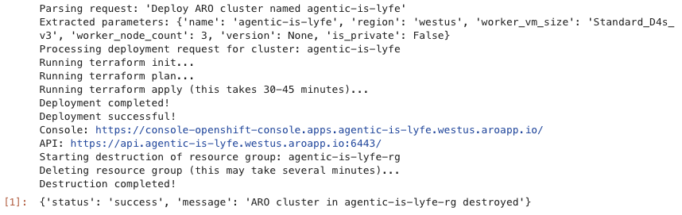

## 1. Introduction

Agentic AI can be defined as systems that are capable of interpreting natural language instructions, in this case users' prompts, making decisions based on those prompts, and then autonomously executing tasks on behalf of users. In this guide, we will create one that is intelligent enough that not only that it can understand/parse users' prompts, but it can also take action upon it by deploying (and destroying) [Azure Red Hat OpenShift (ARO)](https://www.redhat.com/en/technologies/cloud-computing/openshift/azure) cluster using Terraform. 

[Terraform](https://www.terraform.io/) is an automation tool, sometimes referred to as an Infrastructure as Code (IaC) tool, that allows us to provision infrastructure using declarative configuration files. The agentic AI in this guide will provision those clusters based on our MOBB Terraform repository for [ARO](https://github.com/rh-mobb/terraform-aro). Here it runs on [Red Hat OpenShift AI (RHOAI)](https://www.redhat.com/en/products/ai/openshift-ai), which is our platform for managing AI/ML projects lifecycle, running on a [Red Hat OpenShift Service on AWS (ROSA)](https://www.redhat.com/en/technologies/cloud-computing/openshift/aws) cluster. In addition, we will be using Anthropic's Claude Sonnet 3 model via [Amazon Bedrock](https://aws.amazon.com/bedrock/).

In short, the objective of this guide to introduce you to what I'd like to call **Prompt-based Infrastructure** or perhaps, **Text-to-Terraform**. That said, the agentic AI we are creating will be able to deploy (and destroy) ARO cluster based on users' prompts such as whether it is private/public, which region, what types of worker nodes, number of worker nodes, which cluster version, and so forth. I will specify the prompts' parameters in the relevant sections and highlight the differences between the default parameters in this guide and in the Terraform repository.

Note that since real deployment could be costly, I set up simulator test with `mock` toggle that you can set to `True` for mock results and `False` for real cluster deployment. 

As usual, before we move forward, kindly note on the disclaimers below.

*Disclaimers: Note that this guide references Terraform repositories that are actively maintained by MOBB team and may change over time. Always check the repository documentation for the latest syntax, variables, and best practices before deployment. In addition, when using this agentic AI, please be aware that while the system is designed to interpret natural language instructions and autonomously execute infrastructure configurations, it is not infallible. The agentic AI may occasionally misinterpret requirements or generate suboptimal configurations. It is your responsibility to review all generated Terraform configurations before applying them to your cloud environment. Neither the author of this implementation nor the service providers can be held responsible for any unexpected infrastructure deployments, service disruptions, or cloud usage charges resulting from configurations executed by the agentic AI. Lastly, please note that user interfaces may change over time as the products evolve. Some screenshots and instructions may not exactly match what you see.*

## 2. Prerequisites

1. **A [classic](https://cloud.redhat.com/experts/rosa/terraform/classic/) or [HCP](https://cloud.redhat.com/experts/rosa/terraform/hcp/) ROSA cluster**   
- I tested this on an HCP ROSA 4.18.14 with `m5.8xlarge` instance size for the worker nodes. 

2. **Amazon Bedrock**
 - You could use any model of your choice via Amazon Bedrock, but in this guide, we'll use Anthropic Claude 3 Sonnet, so if you have not already, please proceed to your AWS Console and be sure that you enable the model (or the model of your choice) and that your account has the right permissions for Amazon Bedrock. 

3. **RHOAI operator**  
- You can install it using console per [Section 3 in this tutorial](https://cloud.redhat.com/experts/rhoai/rosa-s3) or using CLI per [Section 3 in this tutorial](https://cloud.redhat.com/experts/rhoai/rosa-gpu/). 
- Once you have the operator installed, be sure to install `DataScienceCluster` instance, wait for a few minute for the changes to take effect, and then launch the RHOAI dashboard for next step.  
- I tested this tutorial using RHOAI version 2.19.0. 

## 3. Setup 

First, we will create the setup file and to do so, you would need your Azure credentials such as your Azure Client ID, Azure Client Secret, Azure Tenant ID, and Azure Subscription ID. 

You can retrieve these credentials via Azure Portal or via `az cli`, the latter being the easier one. To do so via cli, first run:

```bash
az account show
```

From the output, use the **id** value as your **Azure Subscription ID**, and **tenantId** as your **Azure Tenant ID**. 

As for the other credentials, you can either use the existing Service Principal or create a new one. For the latter, run the following (give it a proper name and replace the subscription ID):

```bash
az ad sp create-for-rbac --name "YOUR-NEW-SP-NAME" --role contributor --scopes /subscriptions/YOUR-SUBSCRIPTION-ID
```

From the output, take the **appId** as your **Azure Client ID** and the **password** as your **Azure Secret ID**. Keep all these credentials handy for the this step. 

The setup here essentially is an environment bootstrapping module that handles dependency installation (Terraform, Azure CLI, boto3), configures Azure service principal credentials, validates AWS IAM permissions for Bedrock access, and ensures the execution environment is properly initialized.

On the RHOAI dashboard, launch a Jupyter notebook instance. In this example, we will be using **TensorFlow 2025.1** image with **Medium** container size for the notebook. This might take a few minutes to provision. 

And once the notebook is ready, go to the `File` tab on the upper left and choose **New**, and select **Python File**. Copy the lines below, save and rename the file as **setup_aro_bedrock.py**. Replace the env vars with your Azure credentials.
 

```bash
import os
import sys
from pathlib import Path
import subprocess
import boto3

def setup_environment():
    os.environ.update({
        'AZURE_CLIENT_ID': 'YOUR-AZURE-CLIENT-ID',
        'AZURE_CLIENT_SECRET': 'YOUR-AZURE-CLIENT-SECRET',
        'AZURE_TENANT_ID': 'YOUR-AZURE-TENANT-ID',
        'AZURE_SUBSCRIPTION_ID': 'YOUR-AZURE-SUBSCRIPTION-ID'
    })
    
    terraform_installed = install_terraform()
    az_installed = install_azure_cli()
    bedrock_ok = verify_bedrock_access()
    boto3_installed = install_boto3()
    
    return {
        "terraform_installed": terraform_installed,
        "az_cli_installed": az_installed,
        "boto3_installed": boto3_installed,
        "bedrock_access_ok": bedrock_ok
    }

def install_terraform():
    local_bin = Path.home() / '.local' / 'bin'
    local_bin.mkdir(parents=True, exist_ok=True)
    os.environ['PATH'] = f"{local_bin}:{os.environ['PATH']}"

    try:
        subprocess.run(["terraform", "--version"], capture_output=True, text=True)
        return True
    except FileNotFoundError:
        try:
            subprocess.run(["wget", "-q", "https://releases.hashicorp.com/terraform/1.7.4/terraform_1.7.4_linux_amd64.zip"], check=True)
            subprocess.run(["unzip", "-o", "terraform_1.7.4_linux_amd64.zip", "-d", str(local_bin)], check=True)
            subprocess.run(["chmod", "+x", f"{local_bin}/terraform"], check=True)
            subprocess.run(["rm", "terraform_1.7.4_linux_amd64.zip"], check=True)
            return True
        except:
            return False

def install_azure_cli():
    try:
        subprocess.run(["az", "--version"], capture_output=True, text=True)
        return True
    except FileNotFoundError:
        try:
            subprocess.run([sys.executable, "-m", "pip", "install", "--quiet", "azure-cli"], check=True)
            return True
        except:
            return False

def install_boto3():
    try:
        import boto3
        return True
    except ImportError:
        try:
            subprocess.run([sys.executable, "-m", "pip", "install", "--quiet", "boto3"], check=True)
            return True
        except:
            return False

def verify_bedrock_access():
    try:
        if not (os.environ.get('AWS_ACCESS_KEY_ID') or 
                os.environ.get('AWS_PROFILE') or 
                os.environ.get('AWS_CONTAINER_CREDENTIALS_RELATIVE_URI')):
            return False
        
        bedrock = boto3.client('bedrock', region_name='us-west-2')
        
        try:
            bedrock.list_foundation_models()
            return True
        except:
            return False
    except:
        return False

if __name__ == "__main__":
    setup_environment()
```


## 4. Bedrock parser 

Next, let's create the parser which acts as the Natural Language Processing interface using AWS Bedrock's foundation model, in this case Claude 3 Sonnet model, to extract structured parameters from unstructured text. That way, the agent will understand our prompts intelligently and converts it into technical parameters the system can use.

Here we also set up the default parameters if not specified in the user prompts such as cluster name, region, worker node size, worker node count, version, and private/public. Note that some of these default parameters are slightly different from the Terraform repository. For example, the default region here is `westus` and the default cluster name is `agentic-aro`, so feel free to adjust these parameters accordingly. Also note that it will spin up the latest version if users do not specify it in the prompt. 

Create new Python file called **parser_bedrock.py** and copy the below code and save it. 

```bash
import os
import json
import boto3
import re
from typing import Dict, Any

class BedrockAIParser:
    def __init__(self, model_id="anthropic.claude-3-sonnet-20240229-v1:0", region="us-west-2", debug=False):
        self.model_id = model_id
        self.region = region
        self.debug = debug
        
        self.bedrock = boto3.client(
            service_name='bedrock-runtime',
            region_name=region,
            aws_access_key_id=os.environ.get('AWS_ACCESS_KEY_ID'),
            aws_secret_access_key=os.environ.get('AWS_SECRET_ACCESS_KEY'),
            aws_session_token=os.environ.get('AWS_SESSION_TOKEN')
        )
    
    def is_available(self) -> bool:
        try:
            bedrock_client = boto3.client(
                service_name='bedrock',
                region_name=self.region,
                aws_access_key_id=os.environ.get('AWS_ACCESS_KEY_ID'),
                aws_secret_access_key=os.environ.get('AWS_SECRET_ACCESS_KEY'),
                aws_session_token=os.environ.get('AWS_SESSION_TOKEN')
            )
            bedrock_client.list_foundation_models()
            return True
        except:
            return False
    
    def extract_parameters(self, request: str, param_schema: Dict[str, Any]) -> Dict[str, Any]:
        if not self.is_available():
            return {}
        
        schema_text = "\n".join([
            f"- {param}: {details.get('description', '')} (default: {details.get('default', 'None')})"
            for param, details in param_schema.items()
        ])
        
        instruction = """
Important specific rules for ARO parameters:
1. If request mentions "private", set "is_private" to true
2. Default "name" should be "agentic-aro" unless specified
3. Default region is "westus" unless specified
4. Default VM size is "Standard_D4s_v3" unless specified
5. Minimum worker_node_count is 3
"""
        
        prompt = f"""
You are an AI assistant helping to extract parameters from a deployment request for an Azure Red Hat OpenShift (ARO) cluster.

REQUEST: "{request}"

Extract the following parameters:
{schema_text}

{instruction}

Format your response as a valid JSON object with the parameter names as keys.
ONLY include the extracted parameters in your response, nothing else - no explanation, no comments.
Return ONLY valid JSON.

If a parameter is not explicitly mentioned in the request, use the default value provided.

RESPONSE (JSON only):
"""
        
        try:
            if "claude" in self.model_id:
                body = {
                    "anthropic_version": "bedrock-2023-05-31",
                    "max_tokens": 1000,
                    "temperature": 0.1,
                    "messages": [{"role": "user", "content": prompt}]
                }
            elif "llama" in self.model_id:
                body = {
                    "prompt": prompt,
                    "temperature": 0.1,
                    "max_gen_len": 1000
                }
            else:
                body = {
                    "inputText": prompt,
                    "textGenerationConfig": {
                        "temperature": 0.1,
                        "maxTokenCount": 1000
                    }
                }
            
            response = self.bedrock.invoke_model(
                modelId=self.model_id,
                contentType="application/json",
                accept="application/json",
                body=json.dumps(body)
            )
            
            response_body = json.loads(response['body'].read())
            
            if "claude" in self.model_id:
                content = response_body.get('content', [{}])[0].get('text', '{}')
            elif "llama" in self.model_id:
                content = response_body.get('generation', '{}')
            else:
                content = response_body.get('results', [{}])[0].get('outputText', '{}')
            
            json_match = re.search(r'\{[^}]+\}', content, re.DOTALL)
            if json_match:
                params = json.loads(json_match.group())
            else:
                params = json.loads(content)
            
            self._apply_defaults(params, param_schema)
            return params
        except:
            return {}
    
    def _apply_defaults(self, params, param_schema):
        for param, details in param_schema.items():
            if param not in params or params[param] is None:
                params[param] = details.get("default")
    
    def extract_aro_parameters(self, request: str) -> Dict[str, Any]:
        param_schema = {
            "name": {"type": "string", "default": "agentic-aro", "description": "Cluster name"},
            "region": {"type": "string", "default": "westus", "description": "Azure region"},
            "worker_vm_size": {"type": "string", "default": "Standard_D4s_v3", "description": "VM size for workers"},
            "worker_node_count": {"type": "integer", "default": 3, "description": "Number of worker nodes"},
            "version": {"type": "string", "default": None, "description": "ARO version"},
            "is_private": {"type": "boolean", "default": False, "description": "Private cluster"}
        }
        
        params = self.extract_parameters(request, param_schema)
        
        if params.get("worker_node_count", 0) < 3:
            params["worker_node_count"] = 3
        
        return params
    
    def extract_deletion_parameters(self, request: str) -> Dict[str, Any]:
        param_schema = {
            "name": {"type": "string", "default": None, "description": "Cluster name to delete"}
        }
        
        schema_text = "- name: Cluster name to delete (default: None)"
        
        prompt = f"""
You are an AI assistant helping to extract parameters from a deletion request for an ARO cluster.

REQUEST: "{request}"

Extract the following parameters:
{schema_text}

The "name" should be the specific name of the ARO cluster to be deleted (e.g., "my-cluster", "test-deployment").
If no name is specified, use "agentic-aro" as default.

Format your response as a valid JSON object.
ONLY include the extracted parameters in your response, nothing else.

RESPONSE (JSON only):
"""
        
        try:
            if "claude" in self.model_id:
                body = {
                    "anthropic_version": "bedrock-2023-05-31",
                    "max_tokens": 500,
                    "temperature": 0.1,
                    "messages": [{"role": "user", "content": prompt}]
                }
            elif "llama" in self.model_id:
                body = {
                    "prompt": prompt,
                    "temperature": 0.1,
                    "max_gen_len": 500
                }
            else:
                body = {
                    "inputText": prompt,
                    "textGenerationConfig": {
                        "temperature": 0.1,
                        "maxTokenCount": 500
                    }
                }
            
            response = self.bedrock.invoke_model(
                modelId=self.model_id,
                contentType="application/json",
                accept="application/json",
                body=json.dumps(body)
            )
            
            response_body = json.loads(response['body'].read())
            
            if "claude" in self.model_id:
                content = response_body.get('content', [{}])[0].get('text', '{}')
            elif "llama" in self.model_id:
                content = response_body.get('generation', '{}')
            else:
                content = response_body.get('results', [{}])[0].get('outputText', '{}')
            
            json_match = re.search(r'\{[^}]+\}', content, re.DOTALL)
            if json_match:
                params = json.loads(json_match.group())
            else:
                params = json.loads(content)
            
            if not params.get("name"):
                params["name"] = "agentic-aro"
            
            return params
        except:
            return {"name": "agentic-aro"}
```


## 5. Deployment agent

Now, we will create the ARO deployment agent which essentially is the wrapper that dynamically generates Terraform configurations for ARO deployment. It also manages the complete lifecycle including state management, the Azure authentication, and resource provisioning.

Copy the lines below and save it as **aro.py**.

```bash
import os
import tempfile
import json
import subprocess
from pathlib import Path

class ARODeploymentAgent:
    def __init__(self, debug=False):
        self.debug = debug
        self.work_dir = Path(tempfile.mkdtemp())
        
        required_env_vars = ["AZURE_SUBSCRIPTION_ID", "AZURE_TENANT_ID", "AZURE_CLIENT_ID", "AZURE_CLIENT_SECRET"]
        missing_vars = [var for var in required_env_vars if not os.getenv(var)]
        if missing_vars:
            raise ValueError(f"Missing required environment variables: {', '.join(missing_vars)}")
        
        self._login_to_azure()        
        self._create_terraform_files()

    def _run_command(self, command, cwd=None):
        try:
            result = subprocess.run(
                command,
                shell=True,
                text=True,
                capture_output=True,
                cwd=cwd or self.work_dir,
                env=os.environ.copy()
            )
            return result.returncode == 0, result.stdout if result.returncode == 0 else result.stderr
        except Exception as e:
            return False, str(e)
    
    def _login_to_azure(self):
        cmd = f"az login --service-principal --username \"{os.getenv('AZURE_CLIENT_ID')}\" --password \"{os.getenv('AZURE_CLIENT_SECRET')}\" --tenant \"{os.getenv('AZURE_TENANT_ID')}\""
        self._run_command(cmd)
    
    def _create_terraform_files(self):
        variables_tf = '''variable "cluster_name" {
  type        = string
  description = "ARO cluster name"
}
variable "location" {
  type        = string
  description = "Azure region"
}
variable "aro_version" {
  type        = string
  description = "ARO version"
}
variable "worker_node_count" {
  type        = number
  default     = 3
  description = "Number of worker nodes"
}
variable "worker_vm_size" {
  type        = string
  default     = "Standard_D4s_v3"
  description = "VM size for worker nodes"
}
variable "subscription_id" {
  type        = string
  description = "Azure Subscription ID"
}
variable "api_server_profile" {
  type        = string
  default     = "Public"
  description = "API Server visibility (Public or Private)"
}
variable "ingress_profile" {
  type        = string
  default     = "Public"
  description = "Ingress visibility (Public or Private)"
}'''
        
        main_tf = f'''locals {{
  resource_group_name = "${{var.cluster_name}}-rg"
}}
resource "azurerm_resource_group" "aro" {{
  name     = local.resource_group_name
  location = var.location
}}
resource "azurerm_virtual_network" "aro" {{
  name                = "${{var.cluster_name}}-vnet"
  location            = azurerm_resource_group.aro.location
  resource_group_name = azurerm_resource_group.aro.name
  address_space       = ["10.0.0.0/16"]
}}
resource "azurerm_subnet" "master_subnet" {{
  name                 = "master-subnet"
  resource_group_name  = azurerm_resource_group.aro.name
  virtual_network_name = azurerm_virtual_network.aro.name
  address_prefixes     = ["10.0.0.0/23"]
  service_endpoints    = ["Microsoft.ContainerRegistry"]
  private_endpoint_network_policies_enabled = false
  private_link_service_network_policies_enabled = false
}}
resource "azurerm_subnet" "worker_subnet" {{
  name                 = "worker-subnet"
  resource_group_name  = azurerm_resource_group.aro.name
  virtual_network_name = azurerm_virtual_network.aro.name
  address_prefixes     = ["10.0.2.0/23"]
  service_endpoints    = ["Microsoft.ContainerRegistry"]
  private_endpoint_network_policies_enabled = false
  private_link_service_network_policies_enabled = false
}}
resource "azurerm_redhat_openshift_cluster" "aro" {{
  name                = var.cluster_name
  location            = azurerm_resource_group.aro.location
  resource_group_name = azurerm_resource_group.aro.name
  cluster_profile {{
    domain                     = var.cluster_name
    version                    = var.aro_version
    managed_resource_group_name = "${{azurerm_resource_group.aro.name}}-managed"
  }}
  network_profile {{
    pod_cidr     = "10.128.0.0/14"
    service_cidr = "172.30.0.0/16"
  }}
  main_profile {{
    vm_size   = "Standard_D8s_v3"
    subnet_id = azurerm_subnet.master_subnet.id
  }}
  worker_profile {{
    subnet_id    = azurerm_subnet.worker_subnet.id
    disk_size_gb = 128
    node_count   = var.worker_node_count
    vm_size      = var.worker_vm_size
  }}
  service_principal {{
    client_id     = "{os.getenv("AZURE_CLIENT_ID")}"
    client_secret = "{os.getenv("AZURE_CLIENT_SECRET")}"
  }}
  api_server_profile {{
    visibility = var.api_server_profile
  }}
  ingress_profile {{
    visibility = var.ingress_profile
  }}
}}
output "console_url" {{
  value = azurerm_redhat_openshift_cluster.aro.console_url
}}
output "api_url" {{
  value = azurerm_redhat_openshift_cluster.aro.api_server_profile[0].url
}}'''
        
        provider_tf = f'''terraform {{
  required_providers {{
    azurerm = {{
      source  = "hashicorp/azurerm"
      version = "~>3.0"
    }}
  }}
}}
provider "azurerm" {{
  features {{}}
  subscription_id = var.subscription_id
  tenant_id       = "{os.getenv("AZURE_TENANT_ID")}"
  client_id       = "{os.getenv("AZURE_CLIENT_ID")}"
  client_secret   = "{os.getenv("AZURE_CLIENT_SECRET")}"
}}'''
        
        (self.work_dir / "variables.tf").write_text(variables_tf)
        (self.work_dir / "main.tf").write_text(main_tf)
        (self.work_dir / "provider.tf").write_text(provider_tf)
            
    def create_terraform_vars(self, params):
        cluster_name = params.get("name", "agentic-aro")
        region = params.get("region", "westus")
        worker_vm_size = params.get("worker_vm_size", "Standard_D4s_v3")
        worker_node_count = params.get("worker_node_count", 3)
        aro_version = params.get("version") or self.get_latest_aro_version(region)
        is_private = params.get("is_private", False)
        
        tfvars_content = f'''subscription_id = "{os.getenv('AZURE_SUBSCRIPTION_ID')}"
cluster_name = "{cluster_name}"
location = "{region}"
aro_version = "{aro_version}"
worker_node_count = {worker_node_count}
worker_vm_size = "{worker_vm_size}"
api_server_profile = "{'Private' if is_private else 'Public'}"
ingress_profile = "{'Private' if is_private else 'Public'}"'''
        
        (self.work_dir / "terraform.tfvars").write_text(tfvars_content)
        return str(self.work_dir)
                    
    def get_latest_aro_version(self, region="westus"):
        cmd = f"az aro get-versions -l {region} --output tsv"
        success, output = self._run_command(cmd)
        
        if success and output.strip():
            versions = [v.strip() for v in output.strip().split('\n') if v.strip()]
            if versions:
                stable_versions = [v for v in versions if not any(x in v for x in ['-tech-preview', '-dev', 'nightly'])]
                if stable_versions:
                    stable_versions.sort(reverse=True)
                    return stable_versions[0]
        
        return "4.16.30"

    def deploy_cluster(self, params):
        print(f"Processing deployment request for cluster: {params.get('name', 'agentic-aro')}")
        
        rg_name = f"{params.get('name', 'agentic-aro')}-rg"
        cmd = f"az group exists --name {rg_name} --output tsv"
        success, output = self._run_command(cmd)
        
        if success and output.strip().lower() == 'true':
            return {"status": "error", "message": f"Resource group {rg_name} already exists"}
        
        try:
            work_dir = self.create_terraform_vars(params)

            print("Running terraform init...")
            success, output = self._run_command("terraform init", cwd=work_dir)
            if not success:
                return {"status": "error", "message": f"Terraform init failed: {output}"}

            print("Running terraform plan...")
            success, output = self._run_command("terraform plan -out=aro.plan", cwd=work_dir)
            if not success:
                return {"status": "error", "message": f"Terraform plan failed: {output}"}

            print("Running terraform apply (this takes 30-45 minutes)...")
            success, output = self._run_command("terraform apply -auto-approve aro.plan", cwd=work_dir)
            if not success:
                return {"status": "error", "message": f"Terraform apply failed: {output}"}
            
            print("Deployment completed!")
            
            for command in [
                ("terraform init", "init"),
                ("terraform plan -out=aro.plan", "plan"),
                ("terraform apply -auto-approve aro.plan", "apply")
            ]:
                success, output = self._run_command(command[0], cwd=work_dir)
                if not success:
                    return {"status": "error", "message": f"Terraform {command[1]} failed: {output}"}
            
            success, output = self._run_command("terraform output -json", cwd=work_dir)
            if success:
                try:
                    outputs = json.loads(output)
                    console_url = outputs.get("console_url", {}).get("value")
                    api_url = outputs.get("api_url", {}).get("value")
                    
                    cluster_name = params.get("name", "agentic-aro")
                    cmd = f"az aro list-credentials --resource-group {rg_name} --name {cluster_name} --output json"
                    success, creds_output = self._run_command(cmd)
                    
                    if success:
                        credentials = json.loads(creds_output)
                        username = credentials.get("kubeadminUsername")
                        password = credentials.get("kubeadminPassword")
                        
                        return {
                            "status": "success",
                            "message": f"Successfully deployed ARO cluster {cluster_name}!",
                            "console_url": console_url,
                            "api_url": api_url,
                            "resource_group": rg_name,
                            "username": username,
                            "password": password
                        }
                    else:
                        return {
                            "status": "success",
                            "message": f"ARO cluster deployed",
                            "console_url": console_url,
                            "api_url": api_url,
                            "resource_group": rg_name
                        }
                except:
                    return {"status": "success", "message": "ARO cluster deployed"}
            
            return {"status": "success", "message": "ARO cluster deployed successfully!"}
            
        except Exception as e:
            return {"status": "error", "message": f"Deployment failed: {str(e)}"}
            

    def destroy_cluster(self, resource_group):
        print(f"Starting destruction of resource group: {resource_group}")
        
        try:
            cmd = f"az group exists --name {resource_group} --output tsv"
            success, output = self._run_command(cmd)
            
            if not success or output.strip().lower() != 'true':
                return {"status": "error", "message": f"Resource group {resource_group} not found"}
            
            print("Deleting resource group (this may take several minutes)...")
            cmd = f"az group delete --name {resource_group} --yes"
            success, output = self._run_command(cmd)
            
            if success:
                print("Destruction completed!")
                return {"status": "success", "message": f"ARO cluster in {resource_group} destroyed"}
            else:
                return {"status": "error", "message": f"Failed to destroy: {output}"}
        except Exception as e:
            return {"status": "error", "message": f"Error: {str(e)}"}
```

## 6. Simulator

Next, we will be creating the orchestrator or the **brain** of the agent. This simulator is a high-level orchestration layer implementing a state machine for deployment/deletion operations and it handles whether we ask it for either mock or real deployment (and destruction).

Copy the lines below and save it as **aro_bedrock_simulator.py**.

```bash
import os
import json
import time
import tempfile
from pathlib import Path

class AROBedrockSimulator:
    def __init__(self, debug=False, mock=False, bedrock_model="anthropic.claude-3-sonnet-20240229-v1:0", aws_region="us-west-2"):
        self.debug = debug
        self.mock = mock
        self.bedrock_model = bedrock_model
        self.aws_region = aws_region
        self.bedrock_parser = None
        self.setup_status = None
        self.cluster_temp_dirs = {}
        
    def setup(self):
        from setup_aro_bedrock import setup_environment
        self.setup_status = setup_environment()
        
        from parser_bedrock import BedrockAIParser
        self.bedrock_parser = BedrockAIParser(
            model_id=self.bedrock_model,
            region=self.aws_region,
            debug=self.debug
        )
        return self.setup_status
    
    def process_request(self, request):
        if any(word in request.lower() for word in ["delete", "destroy", "remove", "tear down"]):
            return self._handle_deletion(request)
        else:
            return self._handle_deployment(request)
    
    def _handle_deployment(self, request):
        print(f"Parsing request: '{request}'")
        params = self.bedrock_parser.extract_aro_parameters(request)
        
        if not params:
            return {"status": "error", "message": "Failed to extract parameters"}
        
        print(f"Extracted parameters: {params}")
        return self._deploy_aro_cluster(params)
    
    def _handle_deletion(self, request):
        params = self.bedrock_parser.extract_deletion_parameters(request)
        if not params or not params.get("name"):
            return {"status": "error", "message": "Failed to extract cluster name"}
        return self._destroy_aro_cluster(params.get("name"))
    
    def _deploy_aro_cluster(self, params):
        cluster_name = params.get('name', 'agentic-aro')
        
        if self.mock:
            return self._mock_aro_deployment(params)
        
        from aro import ARODeploymentAgent
        
        try:
            aro_deployer = ARODeploymentAgent(debug=self.debug)
            result = aro_deployer.deploy_cluster(params)
            
            if result.get("status") == "success" and hasattr(aro_deployer, "work_dir"):
                self.cluster_temp_dirs[cluster_name] = str(aro_deployer.work_dir)
            
            return result
        except Exception as e:
            return {"status": "error", "message": f"Error deploying ARO cluster: {str(e)}"}
    
    def _destroy_aro_cluster(self, cluster_name):
        resource_group = f"{cluster_name}-rg"
        
        if self.mock:
            return self._mock_aro_destroy(cluster_name)
        
        from aro import ARODeploymentAgent
        
        try:
            aro_deployer = ARODeploymentAgent(debug=self.debug)
            
            if cluster_name in self.cluster_temp_dirs:
                aro_deployer.work_dir = Path(self.cluster_temp_dirs[cluster_name])
            
            result = aro_deployer.destroy_cluster(resource_group)
            
            if result.get("status") == "success" and cluster_name in self.cluster_temp_dirs:
                del self.cluster_temp_dirs[cluster_name]
            
            return result
        except Exception as e:
            return {"status": "error", "message": f"Error destroying ARO cluster: {str(e)}"}
    
    def _mock_aro_deployment(self, params):
        cluster_name = params.get('name', 'agentic-aro')
        region = params.get('region', 'westus')
        rg_name = f"{cluster_name}-rg"
        
        time.sleep(6)
        
        console_url = f"https://console-openshift-console.apps.{cluster_name}.{region}.aroapp.io"
        api_url = f"https://api.{cluster_name}.{region}.aroapp.io:6443"
        
        return {
            "status": "success",
            "message": f"[MOCK] Successfully deployed ARO cluster {cluster_name}",
            "console_url": console_url,
            "api_url": api_url,
            "resource_group": rg_name,
            "username": "kubeadmin",
            "password": "Mock-Pass-123!"
        }
    
    def _mock_aro_destroy(self, cluster_name):
        resource_group = f"{cluster_name}-rg"
        time.sleep(3)
        return {
            "status": "success",
            "message": f"[MOCK] ARO cluster {cluster_name} destroyed"
        }
```

## 7. Notebook integration

Finally, let's create the notebook where we will run our prompts. Note that here you would need your AWS credentials such as AWS Access Key ID and AWS Secret Access Key to enable Amazon Bedrock.

On your notebook console, go to the **File** tab on the upper left and choose **New**, and select **Notebook**. Copy the lines below into one cell and save it as **aro_notebook.ipynb**. Replace the credentials placeholder with your AWS credentials. 

```bash
!pip install --upgrade pip
!pip install --upgrade jupyter-server websocket-client

import os
import boto3
from aro_bedrock_simulator import AROBedrockSimulator

os.environ['AWS_ACCESS_KEY_ID'] = 'YOUR-AWS-ACCESS-KEY-ID'
os.environ['AWS_SECRET_ACCESS_KEY'] = 'YOUR-AWS-SECRET-ACCESS-KEY'
os.environ['AWS_DEFAULT_REGION'] = 'us-west-2'

simulator = AROBedrockSimulator(
    mock=True,  # set to False for real deployment
    bedrock_model="anthropic.claude-3-5-sonnet-20241022-v2:0",
    aws_region="us-west-2",
    debug=True
)

simulator.setup()

# adjust your query/prompt here
result = simulator.process_request("Deploy ARO cluster named agentic-is-lyfe")

if result.get('status') == 'success':
    print("Deployment successful!")
    if result.get('console_url'): print(f"Console: {result['console_url']}")
    if result.get('api_url'): print(f"API: {result['api_url']}")

# comment the line below if you want to keep the cluster running
simulator.process_request("Delete the ARO cluster named agentic-is-lyfe")
```

Here the mock toggle above is currently set to `True` so if you run this notebook, it will only show you how it looks like if it runs like below. 

<br />


<br />

And if you set it to `False` for real deployment, it will look like the following.

<br />


<br />


Note that every notebook runs will keep track Terraform state in its own folder/directory, so if you want to create another cluster at the same time, simply duplicate the notebook and run the new one.


## 8. Future research

There are many things that we can improve for this guide and/or for future guide. Since we're doing a simple demonstration here, we're hardcoding the credentials on the notebook, which does not actually follow security's best practice, so it would be great to use [IRSA](https://docs.redhat.com/en/documentation/red_hat_openshift_service_on_aws/4/html/authentication_and_authorization/assuming-an-aws-iam-role-for-a-service-account#how-service-accounts-assume-aws-iam-roles-in-user-defined-projects_assuming-an-aws-iam-role-for-a-service-account) instead. It would also be nice if we can spin up (and destroy) not only ARO cluster, but also ROSA cluster. And on that note, it would also be interesting to create similar agent in an ARO cluster using Azure OpenAI's model. And then for production use case, ideally you would want to integrate this with Slack or Microsoft Teams or something similar to make it more user-friendly and more accessible to non-technical users. 