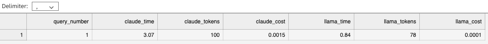

## 1. Introduction

As the LLM's usage increases in the enterprise, not many realize that every LLM API call has two hidden costs: time and money. So while data scientists might argue about data accuracy, infrastructure engineers on the other hand, would need to know if that 2-second response time will scale, and if those $0.015 per thousand tokens cost will blow their quarterly budget, among others.

In this guide, we will build a simple cost and performance dashboard for [Amazon Bedrock](https://aws.amazon.com/bedrock/) models using [Red Hat OpenShift AI (RHOAI)](https://www.redhat.com/en/products/ai/openshift-ai), which is our platform for managing AI/ML projects lifecycle, running on a [Red Hat OpenShift Service on AWS (ROSA)](https://www.redhat.com/en/technologies/cloud-computing/openshift/aws) cluster. 

Here we will evaluate Claude 3.5 Sonnet v2 and Llama 3.3 70B, and we are focusing on three critical metrics for production LLM deployment: response latency, token usage, and operational cost. By running identical prompts through both models simultaneously, not only that we get to compare their responses, but we also get to see the metrics of their performance, i.e. response time (and average response time), token usage, and total session cost. In addition, we can also export the output into csv file for further analysis. The main objective here is to gather empirical performance data to inform model selection decisions based on your use case requirements. 

*Disclaimers: Note that this guide references Amazon Bedrock pricing and model specifications that are subject to change. AWS regularly updates model versions, pricing tiers, and API rate limits. Always verify current pricing on the Amazon Bedrock console and check the latest API documentation before relying on cost calculations for budgeting decisions. In addition, the token estimation algorithm used in this tool provides approximations only—actual token counts can vary by 20-30% depending on content type, language, and model-specific tokenization methods. Performance metrics such as response times are influenced by factors including network latency, regional endpoint proximity, concurrent API load, and service availability. It is your responsibility to validate all cost estimates and performance benchmarks against your actual AWS billing statements and production requirements. Neither the author of this implementation nor the service providers can be held responsible for budget overruns, unexpected charges, or decisions made based on the estimated metrics provided by this tool. The cost calculations shown are for demonstration purposes and should not be used as the sole basis for financial planning or infrastructure decisions. Lastly, please note that user interfaces, model offerings, and notebook environments may change over time as Red Hat OpenShift AI and Amazon Bedrock evolve. Some screenshots, code snippets, and model identifiers may not exactly match current versions.*

## 2. Prerequisites

1. **A [classic](https://cloud.redhat.com/experts/rosa/terraform/classic/) or [HCP](https://cloud.redhat.com/experts/rosa/terraform/hcp/) ROSA cluster**   
- I tested this on an HCP ROSA 4.18.14 with `m5.8xlarge` instance size for the worker nodes. 

2. **Amazon Bedrock**
 - You could use any model of your choice via Amazon Bedrock, but in this guide, we'll use Anthropic Claude 3 Sonnet and Meta Llama 3 70B, so if you have not already, please proceed to your AWS Console and be sure that you enable the models (or the models of your choice) in your region and that your account has the right permissions for Amazon Bedrock. 

3. **RHOAI operator**  
- You can install it using console per [Section 3 in this tutorial](https://cloud.redhat.com/experts/rhoai/rosa-s3) or using CLI per [Section 3 in this tutorial](https://cloud.redhat.com/experts/rhoai/rosa-gpu/). 
- Once you have the operator installed, be sure to install `DataScienceCluster` instance, wait for a few minute for the changes to take effect, and then launch the RHOAI dashboard for next step.  
- I tested this tutorial using RHOAI version 2.19.0. 

## 3. Assumption and calculation 

#### 3.1. Tokens and timing

Here we will be making several key assumptions. For starter, the token estimation uses a simplified heuristic of 1.3 [tokens](https://platform.openai.com/docs/concepts/tokens) per word (based on the average English word-to-token ratio), which provides reasonable approximations without requiring model-specific tokenizers. Both models are configured with conservative parameters (temperature=0.1, top_p=0.9) to ensure consistent and deterministic outputs for the comparison. 

The timing measurements capture end-to-end response latency, including network round-trip time (from your ROSA cluster) to Amazon Bedrock, model inference, and response parsing, and thus here what you're seeing is the user-experienced latency rather than isolated model performance. That said, the location of your ROSA cluster and that of the Bedrock's models might affect the output. In addition, we have a simple prompting strategy to improve the response quality and reasoning clarity. 

Note that all of these values and parameters can be adjusted or tweaked to meet your specific requirements.

#### 3.2. Cost calculator

The cost calculator implements a token-based pricing model that is similar to [Amazon Bedrock's billing structure](https://aws.amazon.com/bedrock/pricing/), with separate rates for input and output tokens. For Claude 3.5 Sonnet v2, pricing is set at $0.003 per 1K input tokens and $0.015 per 1K output tokens, while Llama 3.3 70B uses a symmetric pricing model at $0.00072 per 1K tokens for both input and output. Note that we're using the pricing per June 2025 at the time of the writing, and pricing may change so please adjust these values accordingly. In essence, the calculator estimates token counts for both the input prompt and generated response, then applies the model-specific pricing tiers to compute total cost per request. 

#### 3.3 Performance metrics visualization

The metrics tracking system tracks the history of all model interactions during a session, storing response time, token usage, and cost data for each query. This data then feeds into a multi-panel matplotlib dashboard that visualizes four key insights, e.g. response time trends across queries (line plots), average response time comparison (bar charts), token usage patterns over time, and cumulative session costs. 


## 4. Dashboard code and output

Now that we understand the assumption and the calculation done for this guide, let's proceed to create the dashboard in your Jupyter notebook. Before we proceed, please be sure that you have your AWS credentials handy such as AWS Access Key ID and AWS Secret Access Key to enable Amazon Bedrock.

Next, on the RHOAI dashboard, launch a Jupyter notebook instance. In this example, we will be using **TensorFlow 2025.1** image with **Medium** container size for the notebook. This might take a few minutes to provision. 

Copy the code below in one cell and replace the placeholder env vars with your AWS credentials. Then run it.  


```bash
!pip install boto3 ipywidgets matplotlib pandas

import boto3
import json
import os
import time
import pandas as pd
import matplotlib.pyplot as plt
from IPython.display import display, HTML, clear_output
import ipywidgets as widgets
from datetime import datetime
from collections import defaultdict

os.environ['AWS_ACCESS_KEY_ID'] = 'YOUR-AWS-ACCESS-KEY-ID'
os.environ['AWS_SECRET_ACCESS_KEY'] = 'YOUR-AWS-SECRET-ACCESS-KEY'
os.environ['AWS_DEFAULT_REGION'] = 'us-west-2'

bedrock_runtime = boto3.client('bedrock-runtime', region_name='us-west-2')
CLAUDE_MODEL = "anthropic.claude-3-5-sonnet-20241022-v2:0"
LLAMA_MODEL = "us.meta.llama3-3-70b-instruct-v1:0"
PRICING = {
    CLAUDE_MODEL: {"input": 0.003, "output": 0.015},
    LLAMA_MODEL: {"input": 0.00072, "output": 0.00072}
}
metrics_history = defaultdict(list)

def estimate_tokens(text):
    return len(text.split()) * 1.3

def calculate_cost(model, input_text, output_text):
    input_tokens = estimate_tokens(input_text)
    output_tokens = estimate_tokens(output_text)
    input_cost = (input_tokens / 1000) * PRICING[model]["input"]
    output_cost = (output_tokens / 1000) * PRICING[model]["output"]
    return {"input_tokens": int(input_tokens), "output_tokens": int(output_tokens), "total_cost": round(input_cost + output_cost, 4)}

def call_claude_model(prompt):
    start_time = time.time()
    enhanced_prompt = f"You are a helpful and accurate assistant. Think step by step and provide clear reasoning.\n\n{prompt}"
    body = json.dumps({
        "anthropic_version": "bedrock-2023-05-31",
        "max_tokens": 1000,
        "temperature": 0.1,
        "top_p": 0.9,
        "top_k": 250,
        "messages": [{"role": "user", "content": enhanced_prompt}]
    })
    response = bedrock_runtime.invoke_model(modelId=CLAUDE_MODEL, contentType='application/json', accept='application/json', body=body)
    response_body = json.loads(response['body'].read())
    response_text = response_body['content'][0]['text']
    elapsed_time = round(time.time() - start_time, 2)
    cost_info = calculate_cost(CLAUDE_MODEL, prompt, response_text)
    metrics_history['claude'].append({'time': elapsed_time, 'tokens': cost_info['output_tokens'], 'cost': cost_info['total_cost']})
    return response_text, elapsed_time, cost_info

def call_llama_model(prompt):
    start_time = time.time()
    enhanced_prompt = f"You are a helpful and accurate assistant. Think step by step and provide clear reasoning.\n\n{prompt}"
    formatted_prompt = f"<|begin_of_text|><|start_header_id|>system<|end_header_id|>\nYou are a helpful and accurate assistant. Think step by step and provide clear reasoning.<|eot_id|><|start_header_id|>user<|end_header_id|>\n{enhanced_prompt}<|eot_id|><|start_header_id|>assistant<|end_header_id|>\n"
    body = json.dumps({"prompt": formatted_prompt, "max_gen_len": 1000, "temperature": 0.1, "top_p": 0.9})
    response = bedrock_runtime.invoke_model(modelId=LLAMA_MODEL, contentType='application/json', accept='application/json', body=body)
    response_body = json.loads(response['body'].read())
    response_text = response_body['generation']
    elapsed_time = round(time.time() - start_time, 2)
    cost_info = calculate_cost(LLAMA_MODEL, prompt, response_text)
    metrics_history['llama'].append({'time': elapsed_time, 'tokens': cost_info['output_tokens'], 'cost': cost_info['total_cost']})
    return response_text, elapsed_time, cost_info

def create_comparison_display(question, claude_data, llama_data):
    claude_response, claude_time, claude_cost = claude_data
    llama_response, llama_time, llama_cost = llama_data
    time_diff = abs(claude_time - llama_time)
    faster_model = "Claude 3.5" if claude_time < llama_time else "Llama 3.3"
    cost_diff = abs(claude_cost['total_cost'] - llama_cost['total_cost'])
    cheaper_model = "Claude 3.5" if claude_cost['total_cost'] < llama_cost['total_cost'] else "Llama 3.3"
    return f"""
    <div style="margin: 20px 0;">
        <h3>Question: {question}</h3>
        <div style="background-color: #f0f4f8; padding: 15px; border-radius: 8px; margin: 15px 0;">
            <h4>Performance Summary</h4>
            <p><strong>{faster_model}</strong> responded <strong>{time_diff:.2f}s faster</strong> | <strong>{cheaper_model}</strong> was <strong>${cost_diff:.4f} cheaper</strong></p>
            <div style="display: grid; grid-template-columns: repeat(4, 1fr); gap: 10px;">
                <div>Claude Time: {claude_time}s</div>
                <div>Claude Cost: ${claude_cost['total_cost']}</div>
                <div>Llama Time: {llama_time}s</div>
                <div>Llama Cost: ${llama_cost['total_cost']}</div>
            </div>
        </div>
        <div style="display: grid; grid-template-columns: 1fr 1fr; gap: 20px;">
            <div><h4>Claude 3.5 Sonnet v2</h4><p>{claude_response}</p></div>
            <div><h4>Llama 3.3 70B</h4><p>{llama_response}</p></div>
        </div>
    </div>
    """

def show_metrics_dashboard():
    if not metrics_history['claude'] and not metrics_history['llama']:
        return HTML("<p>No metrics available yet. Run some comparisons first!</p>")
    fig, ((ax1, ax2), (ax3, ax4)) = plt.subplots(2, 2, figsize=(14, 10))
    fig.suptitle('Session Performance Metrics', fontsize=16)
    if metrics_history['claude']:
        claude_times = [m['time'] for m in metrics_history['claude']]
        ax1.plot(claude_times, 'o-', label='Claude 3.5', color='#D97706')
    if metrics_history['llama']:
        llama_times = [m['time'] for m in metrics_history['llama']]
        ax1.plot(llama_times, 'o-', label='Llama 3.3', color='#7C3AED')
    ax1.set_title('Response Time')
    ax1.set_xlabel('Query #')
    ax1.set_ylabel('Time (seconds)')
    ax1.legend()
    avg_times = []
    labels = []
    if metrics_history['claude']:
        avg_times.append(sum(m['time'] for m in metrics_history['claude']) / len(metrics_history['claude']))
        labels.append('Claude 3.5')
    if metrics_history['llama']:
        avg_times.append(sum(m['time'] for m in metrics_history['llama']) / len(metrics_history['llama']))
        labels.append('Llama 3.3')
    if avg_times:
        ax2.bar(labels, avg_times, color=['#D97706', '#7C3AED'][:len(labels)])
        ax2.set_title('Average Response Time')
        ax2.set_ylabel('Time (seconds)')
    if metrics_history['claude']:
        claude_tokens = [m['tokens'] for m in metrics_history['claude']]
        ax3.plot(claude_tokens, 'o-', label='Claude 3.5', color='#D97706')
    if metrics_history['llama']:
        llama_tokens = [m['tokens'] for m in metrics_history['llama']]
        ax3.plot(llama_tokens, 'o-', label='Llama 3.3', color='#7C3AED')
    ax3.set_title('Token Usage')
    ax3.set_xlabel('Query #')
    ax3.set_ylabel('Output Tokens')
    ax3.legend()
    total_costs = []
    if metrics_history['claude']:
        total_costs.append(sum(m['cost'] for m in metrics_history['claude']))
    if metrics_history['llama']:
        total_costs.append(sum(m['cost'] for m in metrics_history['llama']))
    if total_costs:
        ax4.bar(labels, total_costs, color=['#D97706', '#7C3AED'][:len(labels)])
        ax4.set_title('Total Session Cost')
        ax4.set_ylabel('Cost ($)')
    plt.tight_layout()
    plt.show()
    total_queries = max(len(metrics_history['claude']), len(metrics_history['llama']))
    total_cost = sum(total_costs) if total_costs else 0
    return HTML(f"<div><h4>Session Summary</h4><p>Total Queries: {total_queries}</p><p>Total Cost: ${total_cost:.4f}</p></div>")

def export_comparison_history():
    if not metrics_history['claude'] and not metrics_history['llama']:
        return "No data to export"
    data = []
    max_len = max(len(metrics_history['claude']), len(metrics_history['llama']))
    for i in range(max_len):
        row = {'query_number': i + 1}
        if i < len(metrics_history['claude']):
            claude_metric = metrics_history['claude'][i]
            row.update({'claude_time': claude_metric['time'], 'claude_tokens': claude_metric['tokens'], 'claude_cost': claude_metric['cost']})
        if i < len(metrics_history['llama']):
            llama_metric = metrics_history['llama'][i]
            row.update({'llama_time': llama_metric['time'], 'llama_tokens': llama_metric['tokens'], 'llama_cost': llama_metric['cost']})
        data.append(row)
    df = pd.DataFrame(data)
    filename = f"llm_comparison_{datetime.now().strftime('%Y%m%d_%H%M%S')}.csv"
    df.to_csv(filename, index=False)
    return f"Exported to {filename}"

question_input = widgets.Textarea(placeholder='Enter your question here...', description='Question:', layout=widgets.Layout(width='100%', height='80px'))
submit_button = widgets.Button(description='Compare Models', button_style='primary', icon='rocket')
metrics_button = widgets.Button(description='Show Metrics', button_style='info', icon='bar-chart')
export_button = widgets.Button(description='Export Data', button_style='success', icon='download')
output_area = widgets.Output()

sample_questions = widgets.Dropdown(options=[
    'Select a sample question...',
    'What is OpenShift and how does it compare to Kubernetes?',
    'What is Red Hat OpenShift Service on AWS (ROSA)?',
    'What is Azure Red Hat OpenShift (ARO)?',
    'What is the difference between Red Hat OpenShift AI and Amazon Bedrock?'
], description='Samples:', layout=widgets.Layout(width='100%'))

def on_sample_change(change):
    if change['new'] != 'Select a sample question...':
        question_input.value = change['new']

sample_questions.observe(on_sample_change, names='value')

def on_submit_clicked(b):
    with output_area:
        clear_output()
        if not question_input.value.strip():
            display(HTML("<p style='color: red;'>Please enter a question!</p>"))
            return
        display(HTML("<p><i>Getting responses...</i></p>"))
        question = question_input.value.strip()
        claude_data = call_claude_model(question)
        llama_data = call_llama_model(question)
        clear_output()
        display(HTML(create_comparison_display(question, (claude_data[0].replace('\n', '<br>'), claude_data[1], claude_data[2]), (llama_data[0].replace('\n', '<br>'), llama_data[1], llama_data[2]))))

def on_metrics_clicked(b):
    with output_area:
        clear_output()
        display(show_metrics_dashboard())

def on_export_clicked(b):
    with output_area:
        result = export_comparison_history()
        display(HTML(f"<p>{result}</p>"))

submit_button.on_click(on_submit_clicked)
metrics_button.on_click(on_metrics_clicked)
export_button.on_click(on_export_clicked)

display(HTML("<h1>LLM Cost & Performance Dashboard</h1><p>Compare Claude 3.5 Sonnet v2 vs Llama 3.3 70B</p>"))
display(sample_questions)
display(question_input)
display(widgets.HBox([submit_button, metrics_button, export_button]))
display(output_area)
```

On the query section, either select one of the sample questions or write a new one. So say for example, this below is my question:

<br />

<br />

And then hit the blue **Compare Models** button, and you'll get something like below (note that results may vary):

<br />


<br />

Next, click the turqoise **Show Metrics** button, and you'll get the metrics like below (note that results may vary):

<br />

<br />

And finally, hit the green **Export Data** button to export this into csv file like the one below (note that results may vary):

<br />

<br />


## 5. Future research

There are many things you can improve from this guide. First of all, instead of using hardcoded AWS credentials, you might want to use something else safer such as [IRSA](https://docs.redhat.com/en/documentation/red_hat_openshift_service_on_aws/4/html/authentication_and_authorization/assuming-an-aws-iam-role-for-a-service-account#how-service-accounts-assume-aws-iam-roles-in-user-defined-projects_assuming-an-aws-iam-role-for-a-service-account) for example. You could also create some sort of panel widget on top of the notebook to make it easier for users to choose AWS region, different model versions, and adjust the temperature/max_tokens parameters without modifying the code, so it becomes more accessible to non-technical users. In addition, you could also create some sort of saving and loading functionality to preserve comparision history on notebook restarts so users can resume from previous analysis sessions if needed.  

