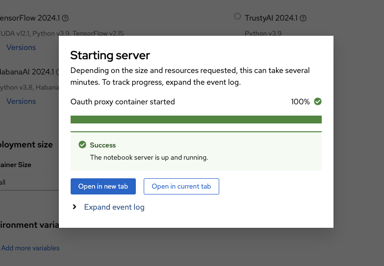

## Introduction
[Large Language Models (LLMs)](https://en.wikipedia.org/wiki/Large_language_model) are a specific type of generative AI focused on processing and generating human language. They can understand, generate, and manipulate human language in response to various tasks and prompts.

This guide is a simple example on how to run and deploy LLMs on a [Red Hat OpenShift Services on AWS (ROSA)](https://www.redhat.com/en/technologies/cloud-computing/openshift/aws) cluster, which is our managed service OpenShift platform on AWS, using [Red Hat OpenShift AI (RHOAI)](https://www.redhat.com/en/technologies/cloud-computing/openshift/openshift-ai), which is formerly called Red Hat OpenShift Data Science (RHODS) and is our OpenShift platform for managing the entire lifecycle of AI/ML projects.

*Please note that the UI may change from time to time so what you see in the snippets below might change as well.*

## Prerequisites

### Tools

* [AWS CLI](https://aws.amazon.com/cli/)
* [OpenShift CLI](https://docs.openshift.com/container-platform/4.14/cli_reference/openshift_cli/getting-started-cli.html)
* [ROSA CLI](https://docs.openshift.com/rosa/rosa_install_access_delete_clusters/rosa_getting_started_iam/rosa-installing-rosa.html)

### Environment

1. You will need a ROSA cluster, if you don't have one, you can follow the [ROSA guide](/experts/rosa/terraform/hcp) to create a ROSA cluster.

2. You will need a GPU enabled machine pool in your ROSA cluster. If you don't have one, you can follow the [Adding GPUs to a ROSA cluster](/experts/rosa/gpu) guide to add GPUs to your cluster.

## Install OpenShift Service Mesh Operator

1. Deploy the Operator

    ```bash
    cat << EOF | oc apply -f -
    apiVersion: operators.coreos.com/v1alpha1
    kind: Subscription
    metadata:
      name: servicemeshoperator
      namespace: openshift-operators
    spec:
      channel: stable
      installPlanApproval: Automatic
      name: servicemeshoperator
      source: redhat-operators
      sourceNamespace: openshift-marketplace
    EOF
    ```

## Installing RHOAI and Jupyter notebook

1. Create a project for the RHOAI operator:

    ```bash
    oc new-project redhat-ods-operator
    ```

1. Deploy the OpenShift AI Operator:

    ```yaml
    cat << EOF | oc apply -f -
    apiVersion: operators.coreos.com/v1
    kind: OperatorGroup
    metadata:
      name: redhat-ods-operator
      namespace: redhat-ods-operator
    spec:
      upgradeStrategy: Default
    ---
    apiVersion: operators.coreos.com/v1alpha1
    kind: Subscription
    metadata:
      name: rhods-operator
      namespace: redhat-ods-operator
    spec:
      channel: fast
      installPlanApproval: Automatic
      name: rhods-operator
      source: redhat-operators
      sourceNamespace: openshift-marketplace
    EOF
    ```


1. Wait until the operator is installed

    ```bash
    oc wait --for=jsonpath='{.status.replicas}'=1 deployment \
      -n redhat-ods-operator rhods-operator
    ```

1. Create a DataScience Cluster

    ```bash
    cat << EOF | oc apply -f -
    apiVersion: datasciencecluster.opendatahub.io/v1
    kind: DataScienceCluster
    metadata:
      name: default-dsc
    spec:
      components:
        codeflare:
          managementState: Managed
        kserve:
          managementState: Managed
          serving:
            ingressGateway:
              certificate:
                type: SelfSigned
            managementState: Managed
            name: knative-serving
        trustyai: {}
        ray:
          managementState: Managed
        kueue:
          managementState: Managed
        workbenches:
          managementState: Managed
        dashboard:
          managementState: Managed
        modelmeshserving:
          managementState: Managed
        datasciencepipelines:
          managementState: Managed
    EOF
    ```

    1. Wait for the DataScienceCluster to be ready

    ```bash
    oc wait --for=jsonpath='{.status.phase}'=Ready datasciencecluster \
      default-dsc
    ```

## Accessing the Jupyter notebook

1. Log into the OpenShift AI console using your web browser and the output of this command

    ```bash
    oc -n redhat-ods-applications get route rhods-dashboard -o jsonpath='{.spec.host}'
    ```

Once logged in, go to the server page and on the left tab, look under **Applications** and select **Enabled**. And then launch **Jupyter** to see the notebook options available to install. In this case, I choose **TensorFlow 2024.1** and I leave the size of container to **small** which is the default. And finally, click **Start server** button at the bottom. Note that if the server failed to start, then you might want to scale up your worker nodes.


<br />

The server installation will take several minutes. Once installed, you'll see the main page of your Jupyter notebook like below and select a Python 3.9 notebook to start the next section.


<br />

This below is how the notebook looks like on the new tab:


## Training LLM model
Now that you have the notebook installed, AWS CLI and credentials configured, and an S3 bucket created, let's run your model on the notebook. In this guide, we will use Hugging Face Transformers library to fine-tune a pre-trained model, i.e. `prajjwal1/bert-tiny`, on a small subset of the `AG News` dataset for text classification. [Hugging Face](https://huggingface.co/) (also referred to as 🤗) is an open-source library providing a wide range pre-trained models and tools for [natural language processing](https://en.wikipedia.org/wiki/Natural_language_processing) tasks. [AG News](https://huggingface.co/datasets/ag_news) is a dataset consisting of news articles from various sources and it is commonly used for text classification tasks. [prajwall1/bert-tiny](https://huggingface.co/prajjwal1/bert-tiny) is a very small version of the [BERT](https://en.wikipedia.org/wiki/BERT_(language_model)) model, which is a transformer-based model pre-trained on a large corpus of text data.

1. Paste in the code for the notebook (You can break it up into sections, or just paste the whole thing in).

```python
# install the necessary libraries
!pip install transformers datasets torch evaluate accelerate boto3

# import the necessary functions and APIs
import numpy as np
import evaluate
import boto3
import os
from datasets import load_dataset
from transformers import AutoTokenizer, AutoModelForSequenceClassification, TrainingArguments, Trainer

# disable tokenizers parallelism warning
os.environ["TOKENIZERS_PARALLELISM"] = "false"

# load a portion of the AG News dataset (500 examples)
dataset = load_dataset("ag_news")
small_dataset = dataset["train"].shuffle(seed=42).select(range(500))

# load the model (prajjwal1/bert-tiny), tokenizer, and pre-trained model
model_name = "prajjwal1/bert-tiny"
tokenizer = AutoTokenizer.from_pretrained(model_name)
model = AutoModelForSequenceClassification.from_pretrained(model_name, num_labels=4)

# define the function to tokenize text examples using the loaded tokenizer
def tokenize_function(examples):
    return tokenizer(examples["text"], padding="max_length", truncation=True)

# apply the tokenize_function to the small_dataset using map function
tokenized_datasets = small_dataset.map(tokenize_function, batched=True)

# specify the training arguments, i.e. output directory, evaluation strategy, learning rate, batch size, number of epochs, weight decay, and load the best model at the end
training_args = TrainingArguments(
    output_dir="./results",
    eval_strategy="epoch",
    save_strategy="epoch",
    learning_rate=2e-5,
    per_device_train_batch_size=8,
    per_device_eval_batch_size=8,
    num_train_epochs=3,
    weight_decay=0.01,
    load_best_model_at_end=True,
)

# load the accuracy metric from the evaluate library
metric = evaluate.load("accuracy")

# compute evaluate metrics by taking the eval predictions (logits and labels) and calculate the accuracy using the loaded metric
def compute_metrics(eval_pred):
    logits, labels = eval_pred
    predictions = np.argmax(logits, axis=-1)
    return metric.compute(predictions=predictions, references=labels)

# set up the training process by taking the model, training arguments, train and eval datasets, tokenizer and the compute_metrics function
trainer = Trainer(
    model=model,
    args=training_args,
    train_dataset=tokenized_datasets,
    eval_dataset=tokenized_datasets,
    tokenizer=tokenizer,
    compute_metrics=compute_metrics,
)

# start the training process using the configured trainer
trainer.train()

# save the model and tokenizer into model folder
model_save_dir = "./model"
tokenizer.save_pretrained(model_save_dir)
model.save_pretrained(model_save_dir)

```

In summary, the code loads the dataset, tokenizes the text examples, sets up the training arguments, defines the evaluation metrics, and trains the model using the `Trainer` class.


After you run it, you should see an output similar to the following (note that this may vary):


<br />

Here the results suggest that the model is learning and improving over the epochs based on the increasing accuracy and decreasing losses. However, the final accuracy of only 45.8% is low indicating that the model's performance is suboptimal. This is understandable because the model is trained on a very small subset of the dataset, i.e. 500 examples, and we're also using a very small version of BERT model, i.e. `prajjwal1/bert-tiny`. That said, you might want to try larger dataset and larger model in your experiment if you like. In addition, you could also fine-tune the hyperparameters to make it more optimal for the training process (FYI, I have a bonus section on this one at the end if you're interested in doing it).

Some error notes that you might see:
- *Unable to register cuDNN/cuFFT/cuBLAS factory...*: These errors are informational and generally harmless. They indicate that multiple components are trying to initialize the same CUDA libraries, but it shouldn't affect the training process.
- *This TensorFlow binary is optimized to use available CPU instructions...*: This is a warning from TensorFlow indicating that your CPU may not support certain instructions (AVX2, AVX512F, FMA), and since we're not using a GPU, this warning is expected.
- *TF-TRT Warning: Could not find TensorRT*: TensorRT is NVIDIA's library for optimizing deep learning models. This warning just means it's not available, which is fine since we're not using it.
- *Some weights of BertForSequenceClassification were not initialized...*: This is a standard message when you're fine-tuning a model. It indicates that some parts of the model will be trained from scratch to adapt to your specific task, i.e. text classification on AG News.

Last but not least, do not forget to save your notebook. On your left tab, you would see the `model` folder where the results, i.e. the model and tokenizer, were saved. You can also see `results` folder where inside it you'll see `runs` folder for every runs you make.

## 6. Future research
This is a very simple guide aimed to get you started with RHOAI on ROSA. As mentioned previously, you could improve the accuracy by increasing the dataset size and running a more robust model, and we can leverage GPU to support that. Another idea is to extend the workload to AWS SageMaker and/or AWS Lambda. In addition, RHOAI itself has a section where you can run the code as pipeline which I haven't had a chance to venture at this time. All of these would be great topic for future blogs.
<br />
<br />

#### Bonus section: Performing hyperparameter tuning
**This is an optional section so feel free to skip it.**

There are many ways to go about performing [hyperparameter tuning](https://en.wikipedia.org/wiki/Hyperparameter_optimization) for your model to improve the model accuracy. Here I'll be using [optuna](https://optuna.readthedocs.io/en/stable/), which is a popular library to optimize hyperparameter. It essentially allows you to define the search space for each hyperparameter and automatically finds the best combination based on the specified objective.

This is the code example that you can run on the notebook:

```python
!pip install transformers datasets torch evaluate accelerate boto3 optuna

import numpy as np
import evaluate
import optuna
import boto3
import os
from datasets import load_dataset
from transformers import AutoTokenizer, AutoModelForSequenceClassification, TrainingArguments, Trainer

os.environ["TOKENIZERS_PARALLELISM"] = "false"

dataset = load_dataset("ag_news")
small_dataset = dataset["train"].shuffle(seed=42).select(range(500))

model_name = "prajjwal1/bert-tiny"
tokenizer = AutoTokenizer.from_pretrained(model_name)
model = AutoModelForSequenceClassification.from_pretrained(model_name, num_labels=4)

def tokenize_function(examples):
    return tokenizer(examples["text"], padding="max_length", truncation=True)

tokenized_datasets = small_dataset.map(tokenize_function, batched=True)

def compute_metrics(eval_pred):
    metric = evaluate.load("accuracy")
    logits, labels = eval_pred
    predictions = np.argmax(logits, axis=-1)
    return metric.compute(predictions=predictions, references=labels)

# define the objectives, i.e. the hyperparameters to tune, the training arguments, train the model, and evaluate them
def objective(trial):
    learning_rate = trial.suggest_loguniform("learning_rate", 1e-5, 5e-5)
    per_device_train_batch_size = trial.suggest_categorical("per_device_train_batch_size", [4, 8, 16])
    num_train_epochs = trial.suggest_int("num_train_epochs", 2, 4)

    training_args = TrainingArguments(
        output_dir="./results",
        eval_strategy="epoch",
        save_strategy="epoch",
        learning_rate=learning_rate,
        per_device_train_batch_size=per_device_train_batch_size,
        num_train_epochs=num_train_epochs,
        weight_decay=0.01,
        load_best_model_at_end=True,
    )

    metric = evaluate.load("accuracy")

    def compute_metrics(eval_pred):
        logits, labels = eval_pred
        predictions = np.argmax(logits, axis=-1)
        return metric.compute(predictions=predictions, references=labels)

    trainer = Trainer(
        model=model,
        args=training_args,
        train_dataset=tokenized_datasets,
        eval_dataset=tokenized_datasets,
        tokenizer=tokenizer,
        compute_metrics=compute_metrics,
    )

    trainer.train()

    eval_metrics = trainer.evaluate()
    return eval_metrics["eval_accuracy"]

# run hyperparameter search
study = optuna.create_study(direction="maximize")
study.optimize(objective, n_trials=9)

# find the best parameter and accuracy
best_params = study.best_params
best_accuracy = study.best_value

print("Best hyperparameters:", best_params)
print("Best accuracy:", best_accuracy)

# train the model with the best hyperparameters
best_model = AutoModelForSequenceClassification.from_pretrained(model_name, num_labels=4)
trainer = Trainer(
    model=best_model,
    args=TrainingArguments(
        output_dir="./results",
        eval_strategy="epoch",
        save_strategy="epoch",
        learning_rate=best_params["learning_rate"],
        per_device_train_batch_size=best_params["per_device_train_batch_size"],
        num_train_epochs=best_params["num_train_epochs"],
        weight_decay=0.01,
        load_best_model_at_end=True,
    ),
    train_dataset=tokenized_datasets,
    eval_dataset=tokenized_datasets,
    tokenizer=tokenizer,
    compute_metrics=compute_metrics,
)
trainer.train()

model_save_dir = "./model"
tokenizer.save_pretrained(model_save_dir)
best_model.save_pretrained(model_save_dir)

```

Here we are using the same dataset and the same model, however, the main difference between this code and the one before is that here we define an `objective` function that takes an `optuna` trial as input and we create `Trainer` instance with the tuned hyperparameters and train the model. Then, we create an `optuna` study and optimize the `objective` function and lastly, we retrieve the best hyperparameter and its accuracy. Note that the code could run for a bit longer than before as it keeps running trials and the final results may vary, but in my case, the final epoch reach 94.6% accuracy.


<br />

Note that this is just an example of hyperparameter tuning and there are many other methods that you can try such as [grid and random search](https://www.kaggle.com/code/willkoehrsen/intro-to-model-tuning-grid-and-random-search),[Bayesian optimization](https://towardsdatascience.com/a-conceptual-explanation-of-bayesian-model-based-hyperparameter-optimization-for-machine-learning-b8172278050f), and so forth. And the good thing is that many ML frameworks and libraries already have built-in utilities for hyperparameter tuning which makes it easier to apply in practice.
