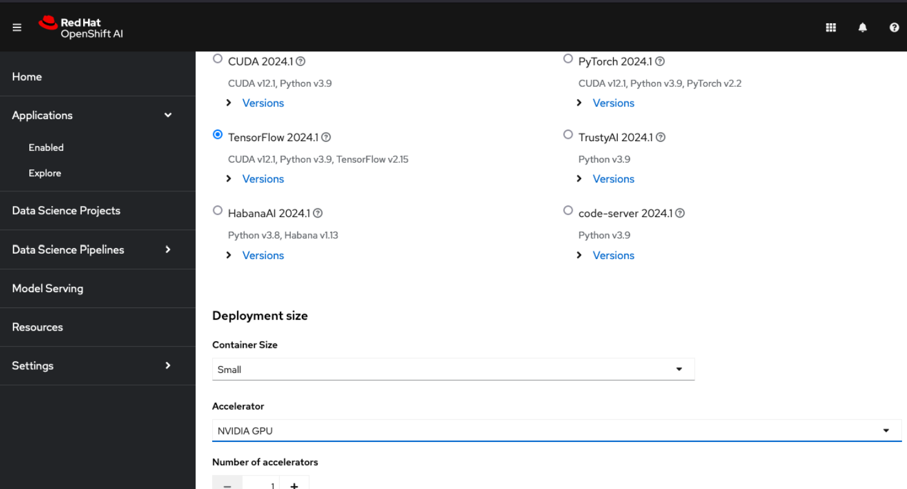
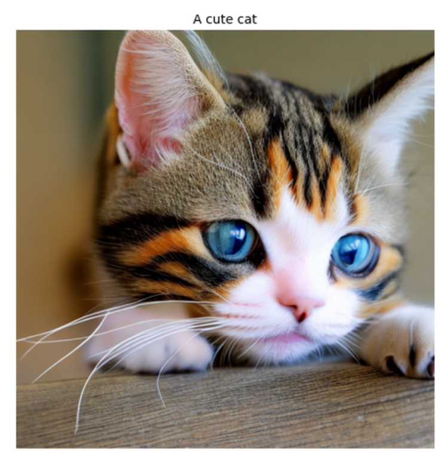
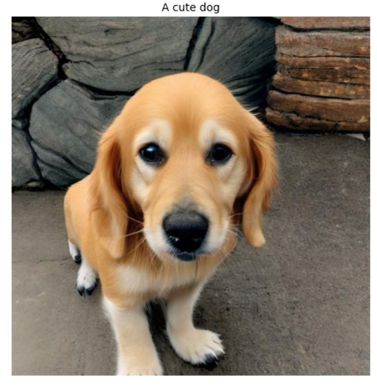
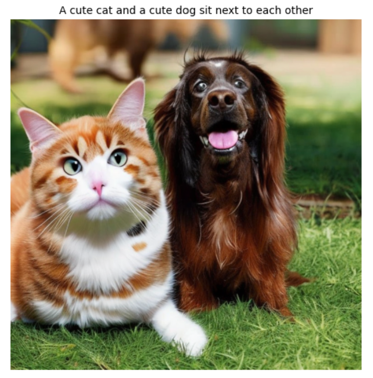
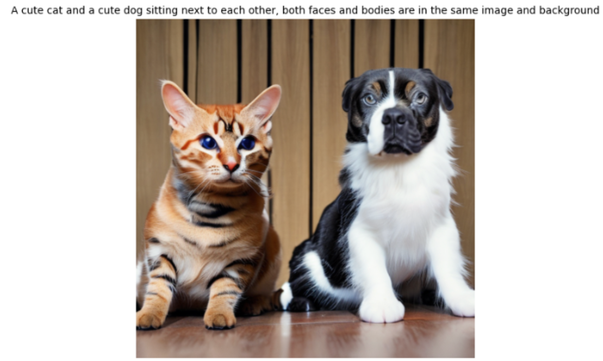

## Introduction

[Stable Diffusion](https://en.wikipedia.org/wiki/Stable_Diffusion) is an AI model to generate images from text description. It uses a diffusion process to iteratively denoise random Gaussian noise into coherent images. This is a simple tutorial to create images using Stable Diffusion model using [Red Hat OpenShift AI (RHOAI)](https://www.redhat.com/en/technologies/cloud-computing/openshift/openshift-ai), formerly called Red Hat OpenShift Data Science (RHODS), which is our OpenShift platform for AI/ML projects lifecycle management, running on a [Red Hat OpenShift Services on AWS (ROSA)](https://www.redhat.com/en/technologies/cloud-computing/openshift/aws) cluster, which is our managed service OpenShift platform on AWS, with NVIDIA GPU enabled. 

Note that this guide requires a ROSA cluster with GPU enabled. The first half in this tutorial is installing service mesh operator, followed by installing RHOAI operator and creating DataScienceCluster instance. And the second half, we'll be running Stable Diffusion model to create cat and dog images on RHOAI's Jupyter notebook. In addition, the RHOAI operator version used in this tutorial is version 2.10.0 and please note that as RHOAI undergoes ongoing development and refinement, certain features may evolve or change over time.

*Disclaimer: When using Stable Diffusion or other open-source image generation models, please be aware that while these tools include certain content filters and safety features, these are not foolproof. Therefore, it is your responsibility to use this tool in a safe manner, ensure the prompts you input are appropriate, and verify that the generated images are suitable for your intended audience. Neither the author of this tutorial nor the infrastructure providers can be held responsible for any inappropriate or unwanted results you may generate. By proceeding with this tutorial, you acknowledge that you understand the potential risks and agree to use the tool responsibly. Remember that the output of AI image generation models can sometimes be unpredictable and thus it is important to review all the generated images before sharing or using them in any context.*


## Prerequisites

### Tools

* [OpenShift CLI](https://docs.openshift.com/container-platform/4.14/cli_reference/openshift_cli/getting-started-cli.html)
* [ROSA CLI](https://docs.openshift.com/rosa/rosa_install_access_delete_clusters/rosa_getting_started_iam/rosa-installing-rosa.html)

### Environment

1. You will need a ROSA cluster (classic or HCP), if you don't have one, you can follow the [ROSA guide](/experts/rosa/terraform/hcp) to create an HCP ROSA cluster.
  - I ran this tutorial on an HCP ROSA 4.16.3 cluster with `m5.xlarge` node with 28 vCPUs and ~108Gi memory.
  - Please be sure that you have cluster admin access to the cluster.


2. You will need a GPU enabled machine pool in your ROSA cluster. If you don't have one, you can follow the [Adding GPUs to a ROSA cluster](/experts/rosa/gpu) guide to add GPUs to your cluster. 
  - I also ran this tutorial using `g5.4xlarge` node with autoscaling enabled up to 4 nodes.  


## Installing RHOAI Operator

### Install OpenShift Service Mesh Operator

1. Deploy the Operator

    ```bash
    cat << EOF | oc apply -f -
    apiVersion: operators.coreos.com/v1alpha1
    kind: Subscription
    metadata:
      name: servicemeshoperator
      namespace: openshift-operators
    spec:
      channel: stable
      installPlanApproval: Automatic
      name: servicemeshoperator
      source: redhat-operators
      sourceNamespace: openshift-marketplace
    EOF
    ```

### Installing RHOAI and Jupyter notebook

1. Create a project for the RHOAI operator:

    ```bash
    oc new-project redhat-ods-operator
    ```

1. Deploy the OpenShift AI Operator:

    ```yaml
    cat << EOF | oc apply -f -
    apiVersion: operators.coreos.com/v1
    kind: OperatorGroup
    metadata:
      name: redhat-ods-operator
      namespace: redhat-ods-operator
    spec:
      upgradeStrategy: Default
    ---
    apiVersion: operators.coreos.com/v1alpha1
    kind: Subscription
    metadata:
      name: rhods-operator
      namespace: redhat-ods-operator
    spec:
      channel: fast
      installPlanApproval: Automatic
      name: rhods-operator
      source: redhat-operators
      sourceNamespace: openshift-marketplace
    EOF
    ```


1. Wait until the operator is installed

    ```bash
    oc wait --for=jsonpath='{.status.replicas}'=1 deployment \
      -n redhat-ods-operator rhods-operator
    ```

1. Create a DataScienceCluster

    ```bash
    cat << EOF | oc apply -f -
    apiVersion: datasciencecluster.opendatahub.io/v1
    kind: DataScienceCluster
    metadata:
      name: default-dsc
    spec:
      components:
        codeflare:
          managementState: Managed
        kserve:
          managementState: Managed
          serving:
            ingressGateway:
              certificate:
                type: SelfSigned
            managementState: Managed
            name: knative-serving
        trustyai: {}
        ray:
          managementState: Managed
        kueue:
          managementState: Managed
        workbenches:
          managementState: Managed
        dashboard:
          managementState: Managed
        modelmeshserving:
          managementState: Managed
        datasciencepipelines:
          managementState: Managed
    EOF
    ```

    1. Wait for the DataScienceCluster to be ready

    ```bash
    oc wait --for=jsonpath='{.status.phase}'=Ready datasciencecluster \
      default-dsc
    ```


### Accessing the Jupyter notebook

1. Log into the OpenShift AI console using your web browser and the output of this command

    ```bash
    oc -n redhat-ods-applications get route rhods-dashboard -o jsonpath='{.spec.host}'
    ```

Once logged in, go to the server page and on the left tab, look under **Applications** and select **Enabled**. And then launch **Jupyter** to see the notebook options available to install. In this case, I choose **TensorFlow 2024.1** and I leave the size of container to **small** which is the default. And finally, click **Start server** button at the bottom. Note that if the server failed to start, then you might want to scale up your worker nodes.


<br />

The server installation will take several minutes. Once installed, you'll see the main page of your Jupyter notebook like below and select a Python 3.9 notebook to start the next section.


<br />

This below is how the notebook looks like on the new tab:


<br />


## Deploying Stable Diffusion model

In this tutorial, we'll use the [Stable Diffusion 2.1](https://huggingface.co/stabilityai/stable-diffusion-2-1) model from Stability AI to generate images based on text prompts. We'll generate three images based on prompts about cats and dogs, using 50 inference steps and a guidance scale of 7.5. These images are then displayed vertically using matplotlib, with each image titled by its corresponding prompt. 

And now that we have the environment ready, let's go to the console and go to the RHOAI dashboard links (select it from the 9-box icon on the upper right side of the console). And then once you're at the RHOAI dashboard console, from the navigator pane on the left hand side, select **Applications**, and click **Enabled**, which will then lead you to launch a Jupyter notebook.

Click **Launch application** and then select **TensorFlow 2024.1** notebook. You can leave the container size to **Small**. And then select **NVIDIA GPU** as the accelerator from the dropdown option. 


<br />

Click the **Start** server button and wait until the notebook is ready, and click **Open in new tab**. And once you're routed to the Jupyter notebook, click **Python 3.9** notebook button on top, and run the following script in a single cell.

```python
# install the necessary dependencies and libraries
!pip install --upgrade diffusers transformers torch accelerate matplotlib datasets torchvision

import torch
from diffusers import StableDiffusionPipeline
from datasets import load_dataset
import random
from torchvision import transforms
from PIL import Image
import matplotlib.pyplot as plt
import gc

# clean up memory and reset CUDA cache
def cleanup_memory():
    gc.collect()
    torch.cuda.empty_cache()
    if torch.cuda.is_available():
        torch.cuda.reset_peak_memory_stats()

# load the Stable Diffusion model
def load_model(model_id):
    pipeline = StableDiffusionPipeline.from_pretrained(model_id, torch_dtype=torch.float16)
    pipeline = pipeline.to("cuda" if torch.cuda.is_available() else "cpu")
    return pipeline

# generate the images
def generate_images(pipeline, prompts, num_images_per_prompt=1, num_inference_steps=50, guidance_scale=7.5):
    images = []
    for prompt in prompts:
        batch = pipeline(
            prompt, 
            num_images_per_prompt=num_images_per_prompt, 
            num_inference_steps=num_inference_steps,
            guidance_scale=guidance_scale,
            output_type="pil"
        )
        images.extend(batch.images)
        cleanup_memory()
    return images

# display the images
def display_images(images, prompts):
    rows = len(images)
    fig, axs = plt.subplots(rows, 1, figsize=(15, 5*rows))
    
    if rows == 1:
        axs = [axs]  
    
    for img, ax, prompt in zip(images, axs, prompts):
        ax.imshow(img)
        ax.set_title(prompt, fontsize=10)
        ax.axis('off')
    
    plt.tight_layout()
    plt.show()

# execute the script
if __name__ == "__main__":
    try:        
        pipeline = load_model('stabilityai/stable-diffusion-2-1')
                
        prompts = [
            "A cute cat",
            "A cute dog",
            "A cute cat and a cute dog sit next to each other"
        ]
        num_images_per_prompt = 1
        
        generated_images = generate_images(pipeline, prompts, num_images_per_prompt, num_inference_steps=50, guidance_scale=7.5)
        display_images(generated_images, prompts)
        
    except Exception as e:
        print(f"An error occurred: {str(e)}")
    finally:
        cleanup_memory()
```

Here are some pictures that I've gotten from my run (note that the pictures may vary every run):



<br />



<br />



<br />


Note that these prompts, e.g. “A cute cat”, “A cute dog”, and “A cute cat and a cute dog sit next to each other”, are just examples, and you can modify your prompts to your liking by modifying the prompts in the main function. 

If you experience hung kernel or something similar, please restart/refresh RHOAI dashboard and relaunch the notebook. Alternatively, if you were using an HCP cluster, you might also want to add more nodes into the machine pool.

Please note that you may also have seen following warning messages which are informational and generally harmless:
- *The cache for model files in Transformers v4.22.0 has been updated...*: This is just an informational message that can be safely ignored once the cache migration is complete.
- *Unable to register cuDNN/cuFFT/cuBLAS factory...*: These messages indicate that these CUDA libraries are being initialized multiple times.
- *This TensorFlow binary is optimized to use available CPU instructions...*: This is also just an informational message that TensorFlow installation is working but could potentially be optimized further. 
- *TF-TRT Warning: Could not find TensorRT*: This warning indicates that TensorRT is not available, which might affect performance but not functionality.


## Future research
Note that this is a simple tutorial intended to guide you through the necessary environment setup once you have a ROSA cluster spun up and followed by a simple deployment of generating images using the Stable Diffusion model. If you happen to get unsatisfactory results, i.e. inaccurate images, there are many ways you can go about improving them, such as by adjusting the parameters and using more specific prompts.

In one of my runs, I noticed that the model generated an inaccurate image of a cat and a dog (for the third prompt) as follows.


<br />

So here I adjusted the `num_inference_steps` from 50 to 75, `guidance_scale` from 7.5 to 8.5, and modified the last prompt into “A cute cat and a cute dog sitting next to each other, both faces and bodies are in the same image and background”. And thus, I got the following image as a result (note that results may vary).



<br />

Increasing `num_inference_steps` will allow the model more iterations to refine the image, adjusting `guidance_scale` can lead to images that are more closely matching the prompt, and using more detailed prompts can help guide the model better. 

However, please note that even with these optimizations, generating images with multiple specific elements can be tricky due to the inherent nature of generative models. You might still need to run the code multiple times to get the desired results.

Note that there are many other ways to improve the accuracy that I’m not going to delve further in this blog, such as using [negative prompts](https://medium.com/stablediffusion/100-negative-prompts-everyone-are-using-c71d0ba33980) to exclude what you don’t want to see in the image, fine-tuning the model, using another [model](https://huggingface.co/models?other=stable-diffusion), increasing the batch size, etc. These are all potential topics for future research. 


