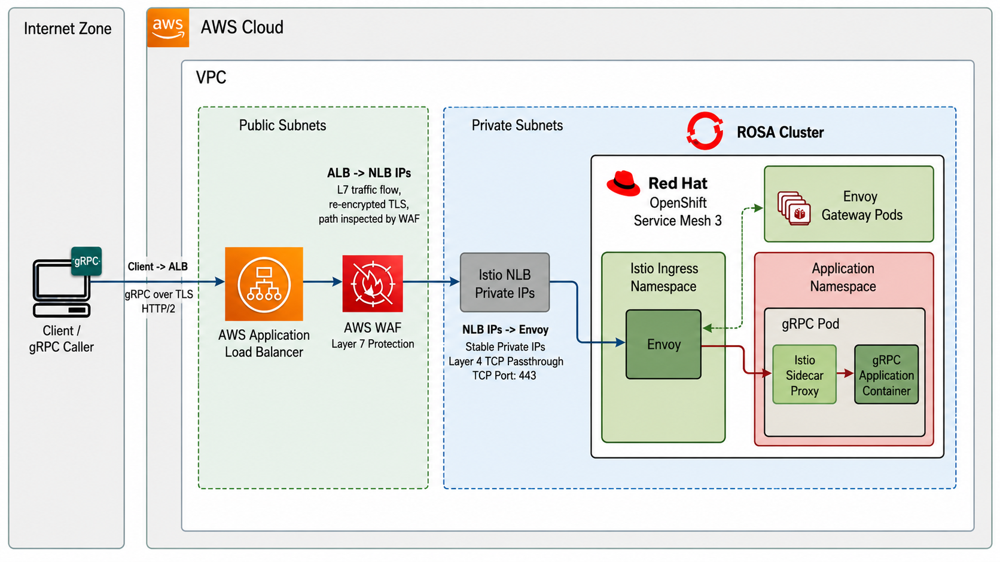

Organizations deploying gRPC applications on Red Hat OpenShift Service on AWS (ROSA) Hosted Control Plane (HCP) often need to meet security requirements that mandate AWS Web Application Firewall (WAF) protection. However, combining gRPC support with WAF presents a unique challenge: WAF can only be attached to Application Load Balancers (ALB), and configuring ALB to properly handle gRPC traffic requires a specific architectural approach.

This guide demonstrates how to successfully deploy gRPC applications on ROSA HCP with full WAF support using AWS Application Load Balancer with native gRPC protocol support and Red Hat OpenShift Service Mesh (Istio). This architecture works in both AWS Commercial Cloud and AWS GovCloud regions.

## Why This Architecture

This architecture is the optimal solution for gRPC on ROSA when WAF is required because it provides:

**Native gRPC Support**: AWS ALB has supported gRPC natively since 2020, but only when configured with the correct target group protocol version and targeting method.

**WAF Integration**: ALB supports AWS WAF attachment, providing Layer 7 security for gRPC traffic.

**Healthy Target Status**: Unlike workarounds that leave targets in an unhealthy state, this approach maintains fully healthy targets, ensuring proper AWS monitoring and alerting.

**AWS GovCloud and Commercial Cloud Compatible**: This architecture works in both AWS GovCloud regions (where CloudFront is not available) and AWS Commercial Cloud regions, making it a universal solution for organizations operating in either environment.

**Production Ready**: All components are supported enterprise solutions - AWS ALB, Red Hat OpenShift Service Mesh, and ROSA.

**End-to-End HTTP/2**: The architecture preserves HTTP/2 protocol characteristics required by gRPC, including trailers, bidirectional streaming, and proper content-type handling.

## Architecture Overview



**Key Components:**

1. **AWS Application Load Balancer**: Terminates client TLS, handles gRPC protocol, can attach WAF
2. **Istio Service Mesh**: Provides Envoy-based ingress with native HTTP/2 and gRPC support
3. **Network Load Balancer**: Created by Istio ingress gateway service, provides stable IP addresses for ALB targeting
4. **gRPC Application**: Your containerized gRPC service running on ROSA

**Critical Configuration**: The ALB target group uses **IP target type** pointing to the NLB's IP addresses with **ProtocolVersion: GRPC**. This combination enables AWS's native gRPC support.

## Prerequisites

* A ROSA HCP cluster in AWS Commercial Cloud or AWS GovCloud
* AWS CLI configured with appropriate credentials
* `oc` CLI tool
* `rosa` CLI tool
* Cluster admin access
* A registered domain with Route 53 hosted zone
* AWS Certificate Manager certificate for your domain

**Note**: This guide uses standard AWS regions in examples. For AWS GovCloud deployments, substitute the appropriate GovCloud region (e.g., `us-gov-west-1` or `us-gov-east-1`) and ensure your ACM certificates are imported into the GovCloud region.

Set environment variables:

```bash
export ROSA_CLUSTER_NAME=<your cluster name>
export REGION=$(rosa describe cluster -c $ROSA_CLUSTER_NAME -o json | jq -r .region.id)
export SUBNET_ID=$(rosa list machinepools -c $ROSA_CLUSTER_NAME -o json | jq -r '.[0].subnet')
export VPC_ID=$(aws ec2 describe-subnets --subnet-ids $SUBNET_ID --query 'Subnets[0].VpcId' --output text)
export DOMAIN=<your domain>  # e.g., example.com
export GRPC_HOSTNAME=grpc.$DOMAIN
```

## Install Red Hat OpenShift Service Mesh

Red Hat OpenShift Service Mesh 3 provides the Envoy proxy layer needed for proper gRPC handling. Service Mesh 3 uses the `sailoperator.io` API (based on upstream Istio) and provides a simpler installation experience compared to Service Mesh 2.

1. Install the Red Hat OpenShift Service Mesh 3 Operator

   ```bash
   cat <<EOF | oc apply -f -
   apiVersion: operators.coreos.com/v1alpha1
   kind: Subscription
   metadata:
     name: servicemeshoperator3
     namespace: openshift-operators
   spec:
     channel: stable
     installPlanApproval: Automatic
     name: servicemeshoperator3
     source: redhat-operators
     sourceNamespace: openshift-marketplace
   EOF
   ```

1. Wait for the Service Mesh operator to be ready

   ```bash
   echo "Waiting for Service Mesh 3 operator installation..."
   oc wait --for=jsonpath='{.status.phase}'=Succeeded csv -l operators.coreos.com/servicemeshoperator3.openshift-operators -n openshift-operators --timeout=300s
   oc wait --for=condition=Available deployment/servicemesh-operator3 -n openshift-operators --timeout=300s
   ```

1. Create the Service Mesh namespaces

   ```bash
   oc new-project istio-system
   oc new-project istio-cni
   ```

1. Deploy IstioCNI (required for sidecar injection)

   ```bash
   cat <<EOF | oc apply -f -
   apiVersion: sailoperator.io/v1
   kind: IstioCNI
   metadata:
     name: default
   spec:
     version: v1.28-latest
     namespace: istio-cni
   EOF
   ```

1. Wait for IstioCNI to be ready

   ```bash
   oc wait --for=condition=Ready istiocni/default --timeout=300s
   ```

1. Deploy the Istio control plane

   ```bash
   cat <<EOF | oc apply -f -
   apiVersion: sailoperator.io/v1
   kind: Istio
   metadata:
     name: default
   spec:
     namespace: istio-system
     version: v1.28-latest
   EOF
   ```

1. Wait for the control plane to be ready

   ```bash
   # Wait for Istio control plane (istiod) to be ready
   oc wait --for=condition=Available deployment/istiod -n istio-system --timeout=900s
   ```
   
   If the pod is pending due to resource constraints, you may need to scale up your cluster or reduce resource requests.

1. Deploy the ingress gateway

   Service Mesh 3 doesn't automatically create an ingress gateway. Deploy one manually:

   ```bash
   cat <<EOF | oc apply -f -
   apiVersion: v1
   kind: ServiceAccount
   metadata:
     name: istio-ingressgateway
     namespace: istio-system
   ---
   apiVersion: apps/v1
   kind: Deployment
   metadata:
     name: istio-ingressgateway
     namespace: istio-system
   spec:
     replicas: 2
     selector:
       matchLabels:
         app: istio-ingressgateway
         istio: ingressgateway
     template:
       metadata:
         labels:
           app: istio-ingressgateway
           istio: ingressgateway
           sidecar.istio.io/inject: "true"
         annotations:
           inject.istio.io/templates: gateway
       spec:
         serviceAccountName: istio-ingressgateway
         containers:
         - name: istio-proxy
           image: auto
   ---
   apiVersion: v1
   kind: Service
   metadata:
     name: istio-ingressgateway
     namespace: istio-system
     annotations:
       service.beta.kubernetes.io/aws-load-balancer-type: nlb
       service.beta.kubernetes.io/aws-load-balancer-internal: "true"
   spec:
     type: LoadBalancer
     selector:
       app: istio-ingressgateway
       istio: ingressgateway
     ports:
     - name: status-port
       port: 15021
       protocol: TCP
       targetPort: 15021
     - name: http2
       port: 80
       protocol: TCP
       targetPort: 8080
     - name: https
       port: 443
       protocol: TCP
       targetPort: 8443
   EOF
   ```

1. Wait for the ingress gateway to be ready

   ```bash
   oc wait --for=condition=Available deployment/istio-ingressgateway -n istio-system --timeout=300s
   ```

1. Get the Istio ingress gateway NLB IP addresses

   ```bash
   # Wait for LoadBalancer to provision
   echo "Waiting for NLB to provision..."
   until oc get svc istio-ingressgateway -n istio-system -o jsonpath='{.status.loadBalancer.ingress[0].hostname}' | grep -q elb; do
     echo "Still waiting for NLB..."
     sleep 10
   done
   
   NLB_DNS=$(oc get svc istio-ingressgateway -n istio-system -o jsonpath='{.status.loadBalancer.ingress[0].hostname}')
   echo "Istio NLB DNS: $NLB_DNS"
   
   # Wait for DNS to propagate and return IPs (can take 30-60 seconds)
   echo "Waiting for NLB DNS to resolve..."
   until NLB_IPS=$(dig +short $NLB_DNS | grep -E '^[0-9]+\.[0-9]+\.[0-9]+\.[0-9]+$') && [ -n "$NLB_IPS" ]; do
     echo "DNS not resolved yet, waiting..."
     sleep 10
   done
   
   echo "Istio NLB IPs:"
   echo "$NLB_IPS"
   ```

   Save these IP addresses - you'll need them for the ALB target group configuration.

## Deploy a Sample gRPC Application

1. Create a namespace for your application

   ```bash
   oc new-project grpc-demo
   ```

1. Enable automatic sidecar injection for the namespace

   ```bash
   oc label namespace grpc-demo istio-injection=enabled
   ```

1. Deploy the gRPC health checking server

   This example uses the Kubernetes e2e test image that implements the gRPC health checking protocol:

   ```bash
   cat <<EOF | oc apply -f -
   apiVersion: apps/v1
   kind: Deployment
   metadata:
     name: grpc-server
     namespace: grpc-demo
   spec:
     replicas: 2
     selector:
       matchLabels:
         app: grpc-server
     template:
       metadata:
         labels:
           app: grpc-server
         annotations:
           sidecar.istio.io/inject: "true"
       spec:
         containers:
         - name: grpc-server
           image: registry.k8s.io/e2e-test-images/agnhost:2.40
           args:
           - grpc-health-checking
           ports:
           - containerPort: 5000
             name: grpc
   ---
   apiVersion: v1
   kind: Service
   metadata:
     name: grpc-server
     namespace: grpc-demo
   spec:
     type: ClusterIP
     selector:
       app: grpc-server
     ports:
     - name: grpc
       port: 5000
       targetPort: 5000
       protocol: TCP
   EOF
   ```

1. Verify the pods are running with Istio sidecars

   ```bash
   oc get pods -n grpc-demo
   ```

   You should see `2/2` in the READY column, indicating both the application container and Istio sidecar are running.

## Configure Istio Gateway and VirtualService

1. Create a TLS certificate for the Istio Gateway

   For production, import your actual certificate. For testing, create a self-signed certificate:

   ```bash
   openssl req -x509 -newkey rsa:2048 -keyout /tmp/tls.key -out /tmp/tls.crt -days 365 -nodes -subj "/CN=*.$DOMAIN"
   
   oc create secret tls istio-ingressgateway-certs --cert=/tmp/tls.crt --key=/tmp/tls.key -n istio-system
   ```

1. Create the Istio Gateway

   ```bash
   cat <<EOF | oc apply -f -
   apiVersion: networking.istio.io/v1beta1
   kind: Gateway
   metadata:
     name: grpc-gateway
     namespace: grpc-demo
   spec:
     selector:
       istio: ingressgateway
     servers:
     - port:
         number: 443
         name: https-grpc
         protocol: HTTPS
       hosts:
       - "*"
       tls:
         mode: SIMPLE
         credentialName: istio-ingressgateway-certs
   EOF
   ```

   **Note**: Use `HTTPS` protocol, not `GRPC`. Istio's validation rejects `GRPC` protocol with TLS settings. The ALB handles gRPC protocol negotiation, and Envoy processes it as HTTP/2.

1. Create VirtualServices for health checks and application traffic

   ```bash
   cat <<EOF | oc apply -f -
   apiVersion: networking.istio.io/v1beta1
   kind: VirtualService
   metadata:
     name: grpc-health-check
     namespace: grpc-demo
   spec:
     hosts:
     - "*"
     gateways:
     - grpc-gateway
     http:
     - match:
       - uri:
           exact: /grpc.health.v1.Health/Check
       route:
       - destination:
           host: grpc-server.grpc-demo.svc.cluster.local
           port:
             number: 5000
   ---
   apiVersion: networking.istio.io/v1beta1
   kind: VirtualService
   metadata:
     name: grpc-app
     namespace: grpc-demo
   spec:
     hosts:
     - "$GRPC_HOSTNAME"
     gateways:
     - grpc-gateway
     http:
     - match:
       - uri:
           prefix: /
       route:
       - destination:
           host: grpc-server.grpc-demo.svc.cluster.local
           port:
             number: 5000
   EOF
   ```

## Configure AWS Application Load Balancer

This is the critical step where we configure ALB with native gRPC support.

1. Get or create an ACM certificate for your domain

   ```bash
   # List existing certificates
   aws acm list-certificates --region $REGION
   
   # Or request a new one
   CERT_ARN=$(aws acm request-certificate \
     --domain-name "*.$DOMAIN" \
     --validation-method DNS \
     --region $REGION \
     --query CertificateArn \
     --output text)
   ```

   If you requested a new certificate, complete DNS validation in the ACM console.

1. Create a security group for the ALB

   ```bash
   ALB_SG=$(aws ec2 create-security-group \
     --group-name grpc-alb-sg \
     --description "Security group for gRPC ALB" \
     --vpc-id $VPC_ID \
     --region $REGION \
     --query 'GroupId' \
     --output text)
   
   # Allow HTTPS from anywhere
   aws ec2 authorize-security-group-ingress \
     --group-id $ALB_SG \
     --protocol tcp \
     --port 443 \
     --cidr 0.0.0.0/0 \
     --region $REGION
   ```

1. Create the Application Load Balancer

   ```bash
   # Get public subnet IDs (ensure at least 2 subnets in different AZs)
   PUBLIC_SUBNETS=$(aws ec2 describe-subnets \
     --filters "Name=vpc-id,Values=$VPC_ID" "Name=tag:Name,Values=*public*" \
     --query 'Subnets[*].SubnetId' \
     --output text \
     --region $REGION)
   
   # Convert space-separated list to comma-separated for --subnets parameter
   PUBLIC_SUBNET_IDS=$(echo $PUBLIC_SUBNETS | tr ' ' ',')
   
   ALB_ARN=$(aws elbv2 create-load-balancer \
     --name grpc-alb \
     --subnets $(echo $PUBLIC_SUBNETS) \
     --security-groups $ALB_SG \
     --scheme internet-facing \
     --type application \
     --ip-address-type ipv4 \
     --region $REGION \
     --query 'LoadBalancers[0].LoadBalancerArn' \
     --output text)
   
   echo "ALB ARN: $ALB_ARN"
   
   # Get ALB DNS name
   ALB_DNS=$(aws elbv2 describe-load-balancers \
     --load-balancer-arns $ALB_ARN \
     --query 'LoadBalancers[0].DNSName' \
     --output text)
   
   echo "ALB DNS: $ALB_DNS"
   ```

1. Create the gRPC target group with IP targets

   **This is the key configuration**: Use `--target-type ip` and `--protocol-version GRPC`:

   ```bash
   TG_ARN=$(aws elbv2 create-target-group \
     --name grpc-tg \
     --protocol HTTPS \
     --port 443 \
     --protocol-version GRPC \
     --target-type ip \
     --vpc-id $VPC_ID \
     --health-check-protocol HTTPS \
     --health-check-port traffic-port \
     --health-check-path /grpc.health.v1.Health/Check \
     --matcher GrpcCode=0-12 \
     --region $REGION \
     --query 'TargetGroups[0].TargetGroupArn' \
     --output text)
   
   echo "Target Group ARN: $TG_ARN"
   ```

   **Why this works**: Using IP target type allows AWS to accept `GRPC` as the protocol version. If you use `--target-type alb` or target an NLB by ARN, AWS forces HTTP2 protocol, which causes protocol mismatch errors.

1. Register the Istio NLB IP addresses as targets

   ```bash
   # Convert the NLB IPs to target format and register them
   for ip in $NLB_IPS; do
     aws elbv2 register-targets \
       --target-group-arn $TG_ARN \
       --targets Id=$ip,Port=443 \
       --region $REGION
     echo "Registered target: $ip:443"
   done
   ```

1. Create HTTPS listener on the ALB

   ```bash
   LISTENER_ARN=$(aws elbv2 create-listener \
     --load-balancer-arn $ALB_ARN \
     --protocol HTTPS \
     --port 443 \
     --certificates CertificateArn=$CERT_ARN \
     --default-actions Type=forward,TargetGroupArn=$TG_ARN \
     --region $REGION \
     --query 'Listeners[0].ListenerArn' \
     --output text)
   
   echo "Listener ARN: $LISTENER_ARN"
   ```

1. Wait for targets to become healthy

   ```bash
   echo "Waiting for targets to become healthy..."
   while true; do
     HEALTHY_COUNT=$(aws elbv2 describe-target-health \
       --target-group-arn $TG_ARN \
       --query 'TargetHealthDescriptions[?TargetHealth.State==`healthy`] | length(@)' \
       --output text)
     
     echo "$(date +%H:%M:%S) - Healthy targets: $HEALTHY_COUNT / 3"
     
     if [ "$HEALTHY_COUNT" -ge "2" ]; then
       echo "✓ Targets are healthy"
       break
     fi
     sleep 10
   done
   ```

   You should see all three targets become healthy. If they remain unhealthy, check:
   - Istio Gateway has the TLS certificate secret configured
   - VirtualService routes exist for the health check path
   - Security groups allow traffic between ALB and NLB IPs

## Configure DNS

Create a DNS record pointing to your ALB:

```bash
HOSTED_ZONE_ID=$(aws route53 list-hosted-zones-by-name \
  --dns-name $DOMAIN \
  --query "HostedZones[0].Id" \
  --output text | cut -d'/' -f3)

cat <<EOF > /tmp/dns-record.json
{
  "Changes": [
    {
      "Action": "UPSERT",
      "ResourceRecordSet": {
        "Name": "$GRPC_HOSTNAME",
        "Type": "CNAME",
        "TTL": 300,
        "ResourceRecords": [
          {
            "Value": "$ALB_DNS"
          }
        ]
      }
    }
  ]
}
EOF

aws route53 change-resource-record-sets \
  --hosted-zone-id $HOSTED_ZONE_ID \
  --change-batch file:///tmp/dns-record.json
```

Wait for DNS propagation:

```bash
sleep 30
nslookup $GRPC_HOSTNAME
```

## Test gRPC Connectivity

1. Create the gRPC health check proto definition

   ```bash
   cat <<'EOF' > /tmp/health.proto
   syntax = "proto3";
   
   package grpc.health.v1;
   
   message HealthCheckRequest {
     string service = 1;
   }
   
   message HealthCheckResponse {
     enum ServingStatus {
       UNKNOWN = 0;
       SERVING = 1;
       NOT_SERVING = 2;
       SERVICE_UNKNOWN = 3;
     }
     ServingStatus status = 1;
   }
   
   service Health {
     rpc Check(HealthCheckRequest) returns (HealthCheckResponse);
     rpc Watch(HealthCheckRequest) returns (stream HealthCheckResponse);
   }
   EOF
   ```

1. Test with grpcurl

   ```bash
   grpcurl -v -insecure \
     -import-path /tmp \
     -proto health.proto \
     -d '{}' \
     $GRPC_HOSTNAME:443 \
     grpc.health.v1.Health/Check
   ```

   Expected output:
   ```
   Response contents:
   {
     "status": "SERVING"
   }
   
   Response trailers received:
   (empty)
   Sent 1 request and received 1 response
   ```

1. Test with curl (HTTP/2)

   ```bash
   curl -k --http2 -v -X POST \
     -H "content-type: application/grpc" \
     https://$GRPC_HOSTNAME:443/grpc.health.v1.Health/Check \
     2>&1 | grep -E "< HTTP|< grpc-status|< content-type"
   ```

   Expected output:
   ```
   < HTTP/2 200
   < content-type: application/grpc
   < grpc-status: 0
   ```

## Add AWS WAF (Optional)

Now that gRPC is working, you can add WAF protection:

1. Create a WAF Web ACL

   ```bash
   WAF_ARN=$(aws wafv2 create-web-acl \
     --name grpc-waf \
     --scope REGIONAL \
     --region $REGION \
     --default-action Allow={} \
     --rules '[
       {
         "Name": "RateLimitRule",
         "Priority": 1,
         "Statement": {
           "RateBasedStatement": {
             "Limit": 2000,
             "AggregateKeyType": "IP"
           }
         },
         "Action": {
           "Block": {}
         },
         "VisibilityConfig": {
           "SampledRequestsEnabled": true,
           "CloudWatchMetricsEnabled": true,
           "MetricName": "RateLimitRule"
         }
       }
     ]' \
     --visibility-config SampledRequestsEnabled=true,CloudWatchMetricsEnabled=true,MetricName=grpcWAF \
     --query 'Summary.ARN' \
     --output text)
   ```

1. Associate WAF with ALB

   ```bash
   aws wafv2 associate-web-acl \
     --web-acl-arn $WAF_ARN \
     --resource-arn $ALB_ARN \
     --region $REGION
   ```

1. Verify WAF is attached

   ```bash
   aws wafv2 get-web-acl-for-resource \
     --resource-arn $ALB_ARN \
     --region $REGION
   ```

1. Test that gRPC still works with WAF enabled

   ```bash
   grpcurl -v -insecure \
     -import-path /tmp \
     -proto health.proto \
     -d '{}' \
     $GRPC_HOSTNAME:443 \
     grpc.health.v1.Health/Check
   ```

## Verification Checklist

Confirm your deployment is working correctly:

- [ ] ALB target group shows all targets healthy
- [ ] `grpcurl` successfully calls gRPC health check
- [ ] Response includes `content-type: application/grpc` header
- [ ] Response includes `grpc-status: 0` (OK)
- [ ] WAF is associated with ALB (if configured)
- [ ] Application logs show successful gRPC requests

## Architecture Deep Dive

### Why IP Targets Enable gRPC Protocol

When you create an ALB target group, the combination of target type and protocol version determines what AWS allows:

| Target Type | Allowed Protocol Versions |
|-------------|--------------------------|
| instance    | HTTP1, HTTP2             |
| ip          | HTTP1, HTTP2, **GRPC**   |
| alb         | HTTP1, HTTP2             |
| lambda      | (not applicable)         |

By using `--target-type ip`, we unlock the ability to set `--protocol-version GRPC`, which tells ALB to:
- Preserve gRPC-specific headers (`content-type: application/grpc`)
- Handle HTTP/2 trailers correctly
- Support bidirectional streaming
- Properly route health checks as gRPC calls

### Traffic Flow

1. **Client → ALB**:
   - TLS connection (certificate from ACM)
   - ALPN negotiates HTTP/2
   - Client sends gRPC request

2. **ALB → Istio NLB IPs**:
   - ALB terminates client TLS
   - ALB re-encrypts with target TLS
   - Forwards to registered IP targets (10.40.x.x:443)
   - Preserves gRPC protocol characteristics

3. **NLB → Envoy**:
   - NLB operates at Layer 4 (TCP passthrough)
   - Forwards encrypted traffic to Envoy pods

4. **Envoy → Application**:
   - Envoy terminates TLS (using istio-ingressgateway-certs)
   - Istio Gateway and VirtualService route the request
   - Forwards to application as plaintext gRPC

### Health Check Flow

ALB health checks follow the same path:
1. ALB sends: `HTTPS GET /grpc.health.v1.Health/Check` to NLB IPs
2. Envoy receives and routes via VirtualService
3. Application responds with gRPC status code
4. ALB checks if `grpc-status` matches GrpcCode matcher (0-12)
5. Target marked healthy if response is in range

## Troubleshooting

### Targets remain unhealthy

**Check target group configuration:**
```bash
aws elbv2 describe-target-groups --target-group-arns $TG_ARN \
  --query 'TargetGroups[0].{ProtocolVersion:ProtocolVersion,HealthCheck:HealthCheckPath,Matcher:Matcher}'
```

Ensure:
- `ProtocolVersion: GRPC`
- `HealthCheckPath: /grpc.health.v1.Health/Check`
- `Matcher: {GrpcCode: "0-12"}`

**Check Istio configuration:**
```bash
# Verify Gateway has TLS certificate
oc get secret istio-ingressgateway-certs -n istio-system

# Verify VirtualService routes health check
oc get virtualservice -n grpc-demo -o yaml | grep -A 5 "grpc.health.v1.Health"
```

**Check connectivity:**
```bash
# Test direct connection to NLB IP
curl -k --http2 -v https://10.40.x.x:443/grpc.health.v1.Health/Check
```

### gRPC calls timeout

**Verify DNS resolution:**
```bash
nslookup $GRPC_HOSTNAME
```

**Check ALB security group allows traffic:**
```bash
aws ec2 describe-security-groups --group-ids $ALB_SG \
  --query 'SecurityGroups[0].IpPermissions[?ToPort==`443`]'
```

**Check Envoy logs:**
```bash
oc logs -n istio-system -l istio=ingressgateway --tail=50
```

### HTTP 464 errors

This indicates protocol mismatch. Verify:
- Target group `ProtocolVersion` is set to `GRPC` (not HTTP2)
- Target type is `ip` (not `alb`)
- Istio Gateway protocol is `HTTPS` (not `GRPC`)

### WAF blocking legitimate traffic

Check WAF logs:
```bash
aws wafv2 get-sampled-requests \
  --web-acl-arn $WAF_ARN \
  --rule-metric-name RateLimitRule \
  --scope REGIONAL \
  --time-window StartTime=$(date -u -d '5 minutes ago' +%s),EndTime=$(date -u +%s) \
  --max-items 100
```

Adjust WAF rules as needed for your traffic patterns.

## Cleanup

To remove all resources created in this guide:

1. Disassociate WAF (if configured)

   ```bash
   aws wafv2 disassociate-web-acl --resource-arn $ALB_ARN --region $REGION
   aws wafv2 delete-web-acl --id $(echo $WAF_ARN | cut -d'/' -f4) --name grpc-waf --scope REGIONAL --lock-token $(aws wafv2 get-web-acl --id $(echo $WAF_ARN | cut -d'/' -f4) --name grpc-waf --scope REGIONAL --query 'LockToken' --output text)
   ```

1. Delete ALB and target group

   ```bash
   aws elbv2 delete-listener --listener-arn $LISTENER_ARN
   aws elbv2 delete-load-balancer --load-balancer-arn $ALB_ARN
   
   # Wait for ALB deletion
   sleep 30
   
   aws elbv2 delete-target-group --target-group-arn $TG_ARN
   ```

1. Delete security group

   ```bash
   aws ec2 delete-security-group --group-id $ALB_SG
   ```

1. Delete DNS record

   ```bash
   cat <<EOF > /tmp/dns-delete.json
   {
     "Changes": [
       {
         "Action": "DELETE",
         "ResourceRecordSet": {
           "Name": "$GRPC_HOSTNAME",
           "Type": "CNAME",
           "TTL": 300,
           "ResourceRecords": [
             {
               "Value": "$ALB_DNS"
             }
           ]
         }
       }
     ]
   }
   EOF
   
   aws route53 change-resource-record-sets \
     --hosted-zone-id $HOSTED_ZONE_ID \
     --change-batch file:///tmp/dns-delete.json
   ```

1. Delete OpenShift resources

   ```bash
   oc delete namespace grpc-demo
   oc delete istio default
   oc delete istiocni default
   oc delete namespace istio-system
   oc delete namespace istio-cni
   ```

1. Uninstall Service Mesh 3 Operator (optional)

   ```bash
   oc delete subscription servicemeshoperator3 -n openshift-operators
   ```

## Summary

This architecture provides a production-ready solution for deploying gRPC applications on ROSA HCP with full WAF protection in both AWS Commercial Cloud and AWS GovCloud environments. By using AWS ALB's native gRPC support (via IP target type and GRPC protocol version) combined with Istio Service Mesh's Envoy ingress, you get:

- ✅ Full gRPC protocol support (HTTP/2, trailers, bidirectional streaming)
- ✅ AWS WAF integration for Layer 7 security
- ✅ Healthy target status for proper monitoring
- ✅ AWS GovCloud and Commercial Cloud compatibility
- ✅ Enterprise support for all components

The key insight is that ALB's gRPC support requires IP-based targeting rather than NLB-to-NLB architecture, and Envoy provides the HTTP/2-aware ingress layer that traditional HAProxy-based routes cannot deliver. This universal approach works across all AWS environments, making it ideal for organizations operating in regulated industries that require GovCloud while also maintaining commercial cloud deployments.

**Note**: While this guide is specific to ROSA HCP, the architecture also works on ROSA Classic with identical Service Mesh 3 configuration.
