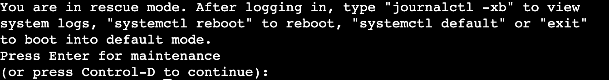

## Background

> **WARNING**: this procedure should only be initiated by a member of the Black Belt team or someone 
incredibly familiar with ROSA as a whole.  **THIS IS NOT COMMON!!!**

This guide shows how to access ROSA instances in the situation that a break glass scenario is required 
in the account where ROSA is deployed.  This procedure should only be performed under unusual circumstances 
like a failed provision in order to collect logs.  This may be necessary if the control plane 
fails and SRE is unable to connect or do much to assist with troubleshooting.


## Locate the Nodes

In order to locate the nodes, you can login to your AWS account and navigate to the EC2 service.  In 
the search bar, you can search for the name of your cluster:


## Connect to the Node in Serial Console

From the above list, you will need to connect to the node which you wish to reset the password for.  This should be 
performed for each node that needs to be connected to (e.g. each control plane node).  Once you've selected your node, 
hit the **Connect** button and navigate to **EC2 serial console**.


You should see a terminal (you may have to hit enter to get the prompt to show up):


## Reboot the Node

Back in the EC2 web console, select **Reboot Instance** and then quickly navigate back to the serial console from the
above step:


You will see the node go through a reboot sequence:


## Boot into single user mode

> **WARNING** the boot menu pops up VERY quickly so you will need to babysit the serial console a bit 
otherwise you will have to repeat the above steps to get back to this point.

Once the menu pops up, you will need to quickly hit the `e` key to edit the boot options.  On the 
line starting with `linux`, you will need to add `single` as an option:


Hit `CTRL+X` to continue the boot process.  Once prompted to boot or continue, hit the `Enter` key:




## Change your password

Change your password like you would on a normal Linux system to a password that you know:

```
passwd root
Changing password for user root.
New password: 
Retype new password: 
passwd: all authentication tokens updated successfully.
```


## Reboot and login

Finally, reboot the host and you can login normally as the `root` user
with the password you set in the previous step:

```
ip-10-10-0-216 login: root
Password: 
Red Hat Enterprise Linux CoreOS 412.86.202309190812-0
  Part of OpenShift 4.12, RHCOS is a Kubernetes native operating system
  managed by the Machine Config Operator (`clusteroperator/machine-config`).

WARNING: Direct SSH access to machines is not recommended; instead,
make configuration changes via `machineconfig` objects:
  https://docs.openshift.com/container-platform/4.12/architecture/architecture-rhcos.html

---
[root@ip-10-10-0-216 ~]# 
```

> **NOTE**: if SSH login is required, you may have to adjust the settings in 
`/etc/ssh/sshd…/40-rhcos-defaults.conf` and `sshd_config` to allow password 
authentication, otherwise you should be able to push logs by whichever means you 
prefer.

## Logs

Some helpful log locations:

- `/var/log/pods` - location of the container logs running on the logged in node
