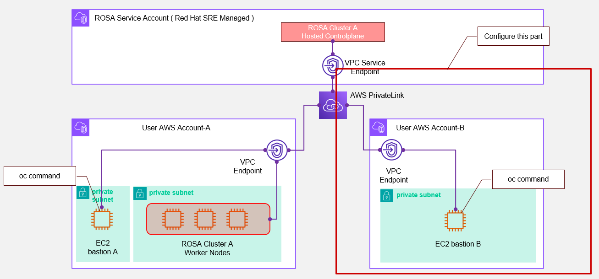
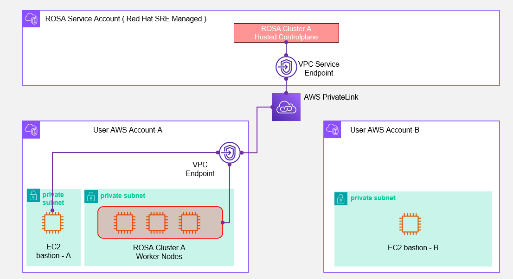
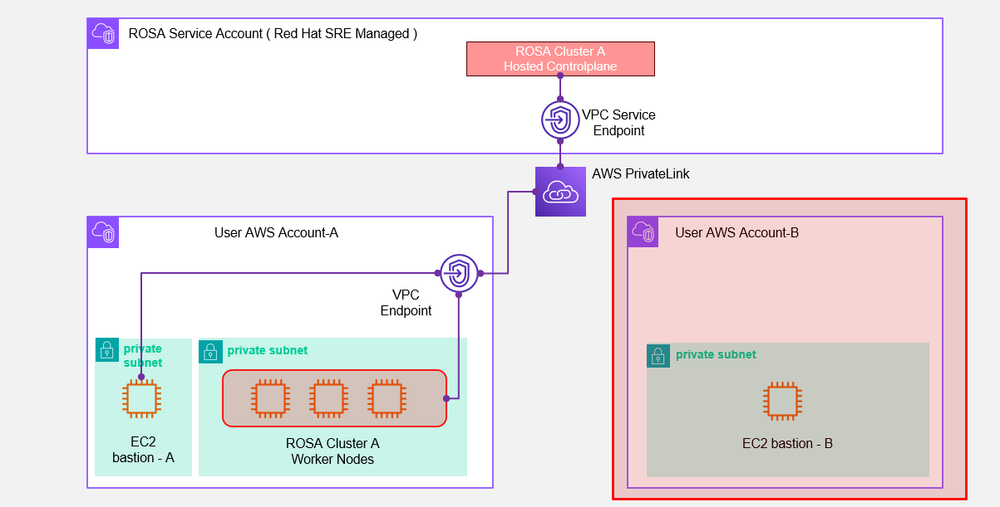
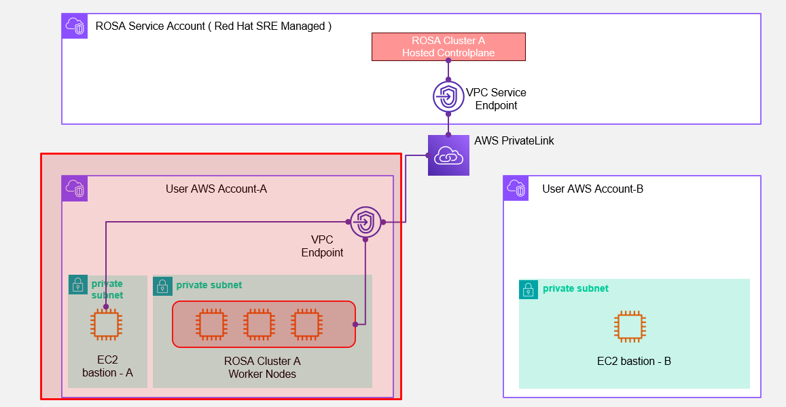
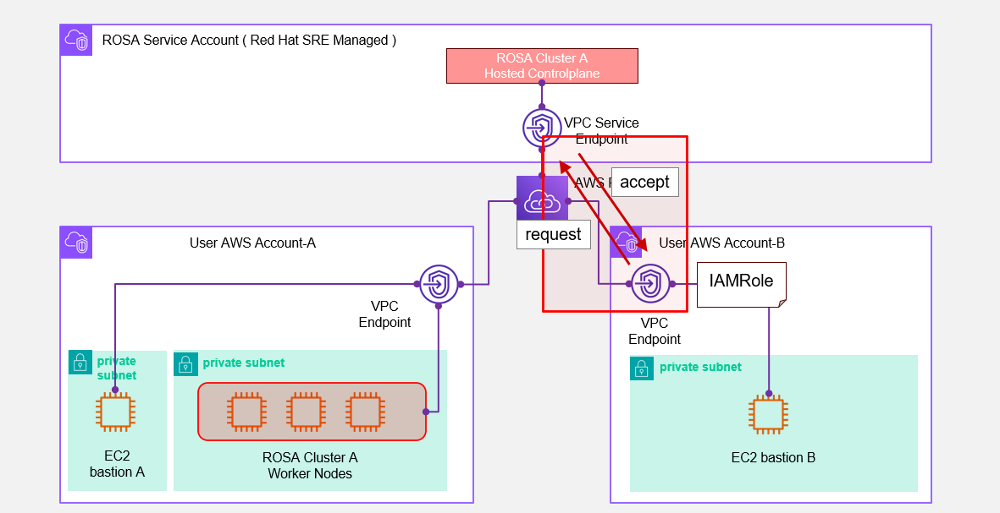
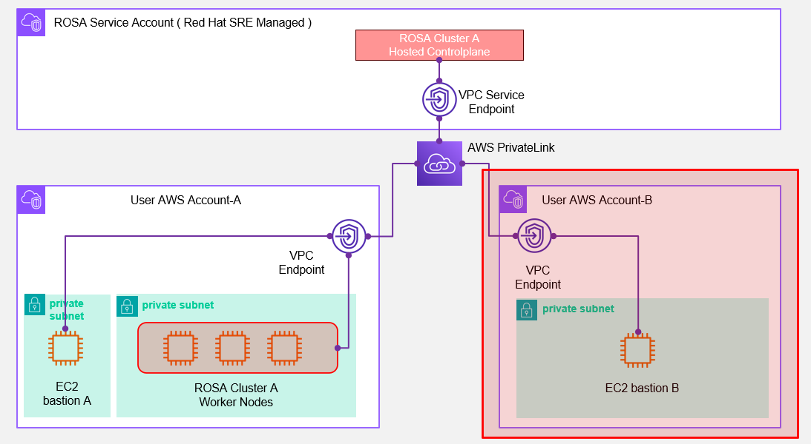

## Introduction                         

You can create a ROSA HCP cluster in one AWS account and configure it so that you can run oc commands from a different AWS account. Although this setup is documented, detailed steps for AWS-side configuration are not provided. Here, I walk through the actual AWS setup.


Note: AWS environments vary, so consider this as one possible setup.


## Prerequisites

Assume ROSA is already deployed in AWS Account-A, and the following AWS resources are available.


## Setup on AWS Account‑B

This section covers steps in AWS Account-B 



#### Prepare necessary tools on  Bastion-B 

1. On the EC2 bastion instance (bastion-B), install the required tools

```bash
curl -LO https://mirror.openshift.com/pub/openshift-v4/clients/rosa/latest/rosa-linux.tar.gz
tar -zxf rosa-linux.tar.gz 
sudo mv ./rosa /usr/local/bin/
rosa download oc
tar -xzf openshift-client-linux.tar.gz 
sudo mv ./oc /usr/local/bin
sudo mv ./kubectl /usr/local/bin
```


1. Verify installation

```bash
oc version
```
(Note: cluster connection is not yet possible.)

1. Create IAM Policy

Create vpce-policy.json

```bash
cat > vpce-policy.json <<EOF
  "Version": "2012-10-17",
  "Statement": [
    {
      "Sid": "VisualEditor0",
      "Effect": "Allow",
      "Action": [
        "vpce:*",
        "ec2:CreateVpcEndpointServiceConfiguration",
        "ec2:CreateVpcEndpoint",
        "ec2:CreateVpcEndpointConnectionNotification"
      ],
      "Resource": "*"
    }
  ]
}
EOF
```

1. Apply it

```bash
IAM_POLICY_ARN=$(aws iam create-policy \
  --policy-name ROSAHcpVPCEndpointPolicy \
  --policy-document file://vpce-policy.json \
  --query 'Policy.Arn' \
  --output text)
```

#### Create IAM Role

1. Get your current IAM user ARN

```bash
IAMUSER_ARN=$(aws sts get-caller-identity \
  --query "Arn" \
  --output text)
```

1. Create trust relationship file (trust-policy.json)

```bash
cat > trust-policy.json <<EOF
{
  "Version": "2012-10-17",
  "Statement": [
    {
      "Effect": "Allow",
      "Principal": {
        "AWS": "$IAMUSER_ARN"
      },
      "Action": "sts:AssumeRole"
    }
  ]
}
EOF
```

1. Create the role

```bash
IAM_ROLE_ARN=$(aws iam create-role \
  --role-name ROSAHcpVPCEndpointRole \
  --assume-role-policy-document file://trust-policy.json \
  --query 'Role.Arn' \
  --output text)
echo $IAM_ROLE_ARN  # e.g. arn:aws:iam::822827512345:role/ROSAHcpVPCEndpointRole
```

1. Attach the policy

```
aws iam attach-role-policy \
  --role-name ROSAHcpVPCEndpointRole \
  --policy-arn $IAM_POLICY_ARN
```

#### Configure AWS CLI to Assume the IAM Role

1. Add a new profile in `~/.aws/config` to assume the role

```
[default]
region = <AWS Region>

[profile myprofile]
role_arn = <IAM_ROLE_ARN>
source_profile = default
region = <AWS Region>

```


## Setup on AWS Account‑A

Switch to Account-A, where the ROSA cluster resides


   

#### Register the IAM Role with ROSA

1. Run On Bastion-A (or any rosa-enabled host)

```bash
CLUSTER_NAME=$(rosa list clusters -o json | jq -r '.[0].name')
IAM_ROLE_ARN=<role ARN from Account-B>
rosa edit cluster -c $CLUSTER_NAME --additional-allowed-principals $IAM_ROLE_ARN
rosa describe cluster -c $CLUSTER_NAME | grep "Additional Principals:"
```

1. Get VPC Endpoint Service Name

```bash
aws ec2 describe-vpc-endpoints \
  --query "VpcEndpoints[*].[VpcEndpointId, ServiceName]" \
  --output table
```
Note the service name for the Hosted Control Plane endpoint, e.g., com.amazonaws.vpce.ap-northeast-1.vpce-svc-....


1. Fetch API URL for ROSA Cluster

```bash
rosa describe cluster -c $CLUSTER_NAME -o json | jq -r '.api.url'
```
Expect something like:` https://api.rosahcp.<id>.openshiftapps.com:443`


## Back to AWS Account‑B
Continue in Account-B 

   

#### Create VPC Endpoint

1. Set variables

```bash
SERVICE_NAME=<from Account-A>
INSTANCE_ID=<bastion-B EC2 ID>
SUBNET_ID=$(aws ec2 describe-instances …)
SUBNET_CIDR=$(aws ec2 describe-subnets …)
VPC_ID=$(…)
```

1. Verify

```bash
echo "VPC_ID=$VPC_ID, SERVICE_NAME=$SERVICE_NAME, SUBNET_ID=$SUBNET_ID, SUBNET_CIDR=$SUBNET_CIDR"
```

1. Create security group

```bash
SEC_GROUP_ID=$(aws ec2 create-security-group \
  --group-name MyVPCEndpointSG \
  --description "Security Group for VPC Endpoint" \
  --vpc-id $VPC_ID \
  --tag-specifications 'ResourceType=security-group,Tags=[{Key=Name,Value=MyVPCEndpointSG}]' \
  --query 'GroupId' \
  --output text)
```

1. Allow inbound from subnet

```bash
aws ec2 authorize-security-group-ingress \
  --group-id $SEC_GROUP_ID \
  --protocol tcp \
  --port 443 \
  --cidr $SUBNET_CIDR
```

1. Create the interface endpoint, using the `myprofile` role:

```bash
ENDPOINT_ID=$(aws ec2 create-vpc-endpoint \
  --vpc-id $VPC_ID \
  --service-name $SERVICE_NAME \
  --vpc-endpoint-type Interface \
  --subnet-ids $SUBNET_ID \
  --security-group-ids $SEC_GROUP_ID \
  --query 'VpcEndpoint.VpcEndpointId' \
  --output text \
  --profile myprofile)
```


If no error, the endpoint is created.


#### Configure Private DNS Zone in Route 53

1. Fetch the endpoint DNS name

```bash
ENDPOINT_DNS=$(aws ec2 describe-vpc-endpoints \
  --vpc-endpoint-ids $ENDPOINT_ID \
  --query 'VpcEndpoints[0].DnsEntries[0].DnsName' \
  --output text)
```

1. Extract domain from API URL

```bash
API_URL=<ROSA API URL>
DOMAIN=$(echo $API_URL | cut -d '/' -f3 | sed 's/^api\.//;s/:.*//')
```

1. Set the region

```bash
REGION=<AWS Region>
```

1. Check

```bash
echo "DOMAIN=$DOMAIN, REGION=$REGION, VPC_ID=$VPC_ID"
```

1. Create Route 53 private hosted zone

```bash
HOSTED_ZONE_ID=$(aws route53 create-hosted-zone \
  --name $DOMAIN \
  --vpc VPCRegion=$REGION,VPCId=$VPC_ID \
  --caller-reference $(date +%s) \
  --hosted-zone-config PrivateZone=true \
  --query 'HostedZone.Id' \
  --output text | cut -d'/' -f3)
```

1. Create DNS records

```bash
cat > record.json <<EOF
{
  "Changes": [
    {
      "Action": "CREATE",
      "ResourceRecordSet": {
        "Name": "api.$DOMAIN",
        "Type": "CNAME",
        "TTL": 300,
        "ResourceRecords": [ { "Value": "$ENDPOINT_DNS" } ]
      }
    },
    {
      "Action": "CREATE",
      "ResourceRecordSet": {
        "Name": "oauth.$DOMAIN",
        "Type": "CNAME",
        "TTL": 300,
        "ResourceRecords": [ { "Value": "$ENDPOINT_DNS" } ]
      }
    }
  ]
}
EOF

aws route53 change-resource-record-sets \
  --hosted-zone-id $HOSTED_ZONE_ID \
  --change-batch file://record.json
```
This ensures DNS resolution of `api.<DOMAIN>` and `oauth.<DOMAIN>` points to the VPC endpoint and routes traffic to the Hosted Control Plane.


## Verify Connection
Test access from bastion-B

```
oc login $API_URL --username cluster-admin --password <password>
```

## Summary
You have now

* Set up tools on bastion-B in Account-B.
* Created IAM role/policy allowing Account-B to call AWS on ROSA’s behalf.
* Registered that role with the ROSA cluster in Account-A.
* Created an interface VPC endpoint and private DNS in Account-B.
* Verified oc access from Account-B into ROSA.


