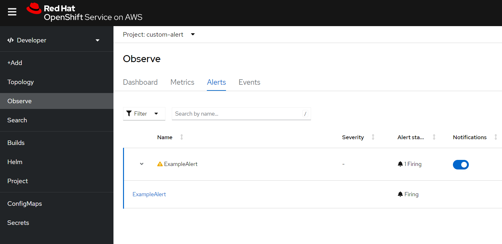
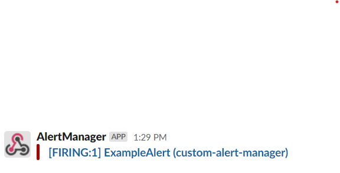
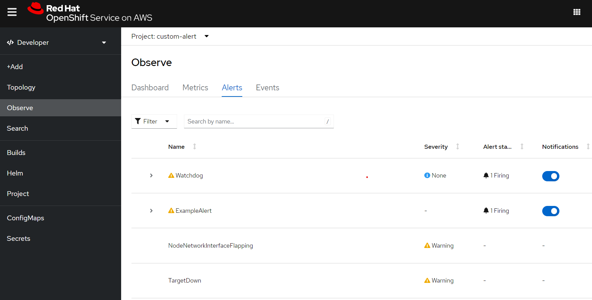

Starting with OpenShift 4.11 it is possible to [manage alerting rules for user-defined projects](https://docs.openshift.com/container-platform/4.11/monitoring/managing-alerts.html#managing-alerting-rules-for-user-defined-projects_managing-alerts). Similarly, in ROSA clusters the OpenShift Administrator can enable a second AlertManager instance in the user workload monitoring namespace which can be used to create such alerts.

> Note: Currently this is **not a managed** feature of ROSA. Such an implementation may get overwritten if the User Workload Monitoring functionality is toggled off and on using the OpenShift Cluster Manager (OCM). We

## Prerequisites

* [AWS CLI](https://docs.aws.amazon.com/cli/latest/userguide/cli-chap-install.html)
* A Red Hat OpenShift for AWS (ROSA) cluster 4.11.0 or higher

## Create Environment Variables

## Configure User Workload Monitoring to include AlertManager

1. Edit the user workload config to include AlertManager

    > Note: If you have other modifications to this config, you will need to hand edit the resource rather than brute forcing it like below.

    ```bash
    cat << EOF | oc apply -f -
    apiVersion: v1
    kind: ConfigMap
    metadata:
      name: user-workload-monitoring-config
      namespace: openshift-user-workload-monitoring
    data:
      config.yaml: |
        alertmanager:
          enabled: true
          enableAlertmanagerConfig: true
    EOF
    ```

1. Verify that a new Alert Manager instance is defined

   ```bash
   oc -n openshift-user-workload-monitoring get alertmanager
   ```

   ```output
   NAME            VERSION   REPLICAS   AGE
   user-workload   0.24.0    2          2m
   ```

1. If you want non-admin users to be able to define alerts in their own namespaces you can run the following.

   ```bash
   oc -n <namespace> adm policy add-role-to-user alert-routing-edit <user>
   ```

1. Create a Slack webhook integration in your Slack workspace. Create environment variables for it.

    ```bash
    SLACK_API_URL=https://hooks.slack.com/services/XXX/XXX/XXX
    SLACK_CHANNEL='#paultest'
    ```

1. Update the Alert Manager Configuration file

   > This will create a basic AlertManager configuration to send alerts to your slack channel. If you have an existing configuration you'll need to edit it, not brute force paste like shown.

   ```bash
   cat << EOF | oc apply -f -
   apiVersion: v1
   kind: Secret
   metadata:
     name: alertmanager-user-workload
     namespace: openshift-user-workload-monitoring
   stringData:
     alertmanager.yaml: |
       global:
         slack_api_url: "${SLACK_API_URL}"
       route:
         receiver: Default
         group_by: [alertname]
       receivers:
         - name: Default
           slack_configs:
             - channel: ${SLACK_CHANNEL}
               send_resolved: true
   EOF
   ```

## Create an Example Alert

1. Create a Namespace for your custom alert

   ```bash
   oc create namespace custom-alert
   ```

1. Verify it works by creating a Prometheus Rule that will fire off an alert

   ```bash
   cat << EOF | oc apply -f -
   apiVersion: monitoring.coreos.com/v1
   kind: PrometheusRule
   metadata:
     name: prometheus-example-rules
     namespace: custom-alert
   spec:
     groups:
     - name: example.rules
       rules:
       - alert: ExampleAlert
         expr: vector(1)
   EOF
   ```

1. Log into your OpenShift Console and switch to the Developer view. Select the **Observe** item from the menu on the left and then click **Alerts**.  Make your your **Project** is set to **custom-alert**

    

1. Check the Alert was sent to Slack

    

## What about Cluster Alerts ?

By default, cluster alerts are only sent to Red Hat SRE and you cannot modify the cluster alert receivers. However you can make a copy of any of the alerts that you wish to see in your own alerting namespace which will then get picked up by the user workload alert-manager.

1. Allow [cross-project alerting](https://docs.redhat.com/en/documentation/red_hat_openshift_service_on_aws/4/html/monitoring/managing-alerts#creating-cross-project-alerting-rules-for-user-defined-projects_managing-alerts-as-an-administrator) for your project (i.e custom-alert) by adding namespacesWithoutLabelEnforcement to the user-workload-monitoring-config ConfigMap above.
    ```bash
    cat << EOF | oc apply -f -
    apiVersion: v1
    kind: ConfigMap
    metadata:
      name: user-workload-monitoring-config
      namespace: openshift-user-workload-monitoring
    data:
      config.yaml: |
        namespacesWithoutLabelEnforcement: [ custom-alert ]
        alertmanager:
          enabled: true
          enableAlertmanagerConfig: true
    EOF
    ```

1. Download prometheus rules from the openshift-monitoring namespace into a file

    ```bash
    oc -n openshift-monitoring get prometheusrules -o json > prom.json
    ```
1. Search and replaced "namespace": "openshift-monitoring", with your namespace i.e "namespace": "custom-alert"

    ```bash
    sed -i '' 's/"namespace": "openshift-monitoring"/"namespace": "custom-alert"/g' prom.json
    ```
1. Add prometheus rules to your project

    ```bash
    oc apply -f prom.json
    ```    
1. Check the Alerts in the **custom-alert** Project in the OpenShift Console, and you'll now see the **Watchdog** and other cluster alerts.

    

1. You should also have received an alert for the **Watchdog** alert in your Slack channel.

    

