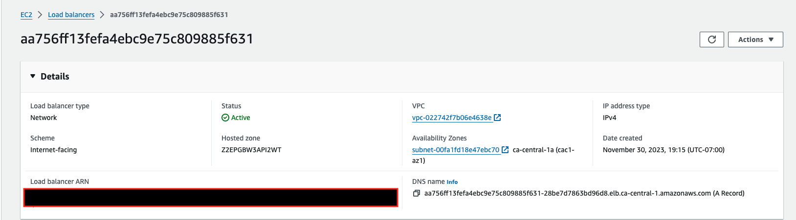
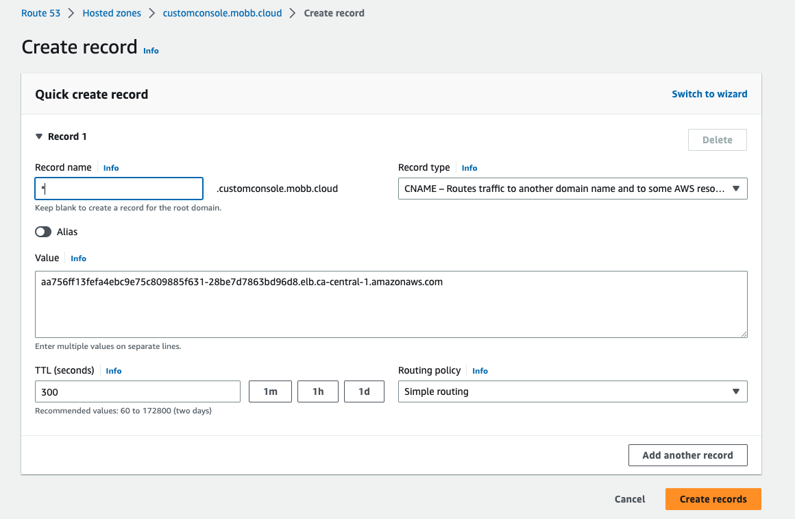
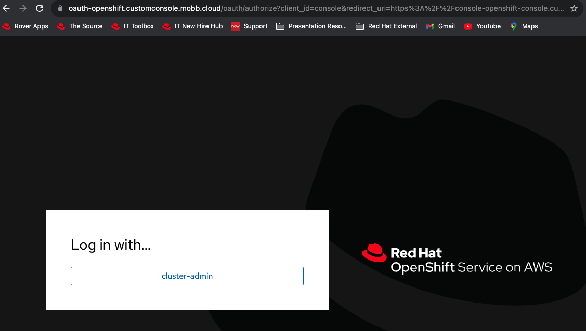
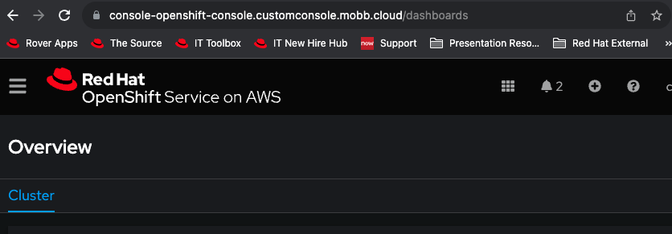

Starting with ROSA 4.14.X, it is possible to modify the hostname and TLS certificate of component Routes post-install. These are the `OAuth`, `Console`, and `Downloads` routes. For example, the default ROSA console uses the built-in domain `https://console-openshift-console.apps.<cluster_name>.<random>.p1.openshiftapps.com`. You can now specify a custom domain, for example `test.example.com`, and the ROSA console will be available at a URL such as `https://console-openshift-console.test.example.com`. This guide will walk you through how to customize the console url for a ROSA Classic cluster (not tested on ROSA HCP yet).

> **WARN:** there is currently a limitation in modifying the default ingress which does not allow the default router to be 
> modified.  It is being worked, but if you need this, please pay careful attention to steps labeled **WORKAROUND**.  They 
> will later be removed once the full implementation is in place.

## Prerequisites

* A Red Hat OpenShift for AWS (ROSA) cluster 4.14.0 or higher
* Cluster admin privileges (required to be able to modify cluster ingress)
* Route53 Hosted Zone
* A custom domain
* A wildcard certificate 
* `rosa` cli
* `oc` cli

## Deploy 

### Set up Environment

1. Set your email and domain
    
     ```bash
     export EMAIL=<YOUR-EMAIL>
     export DOMAIN=<YOUR-DOMAIN>
     ```

1. Set remaining environment variables 
   
     ```bash
     export SCRATCH_DIR=/tmp/scratch
     mkdir -p $SCRATCH_DIR
     ```

### Custom Domain

1. Create TLS Key Pair for custom domain using certbot
 
    > Skip this step if you already have a key pair

   ```bash
   certbot certonly --manual \
     --preferred-challenges=dns \
     --email $EMAIL \
     --server https://acme-v02.api.letsencrypt.org/directory \
     --agree-tos \
     --config-dir "$SCRATCH_DIR/config" \
     --work-dir "$SCRATCH_DIR/work" \
     --logs-dir "$SCRATCH_DIR/logs" \
     -d "*.$DOMAIN"
   ```

1. Create a TLS secret for your custom domain in the openshift-config namespace

**WORKAROUND**: use `openshift-ingress` as the namespace instead as this will be used by the secondary ingress controller 
we create, as we are unable to modify the default.

     ```bash
     CERTS=/tmp/scratch/config/live/$DOMAIN
     oc create secret tls acme-tls --cert=$CERTS/fullchain. pem --key=$CERTS/privkey.pem -n openshift-config
     ```

### Individual Component Route Certificates

**WORKAROUND** this is required because we will use `rosa edit ingress` for each individual component route and those certs 
including the wildcard cannot be re-used.

1. Create TLS Key Pair for individual component routes

     > Skip this step if you already have key pairs for the individual component routes

     ```bash
     for CERT in oauth downloads console; do
       mkdir -p $SCRATCH_DIR/$CERT
       certbot certonly --manual \
         --preferred-challenges=dns \
         --email $EMAIL \
         --server https://acme-v02.api.letsencrypt.org/directory \
         --agree-tos \
         --config-dir "$SCRATCH_DIR/$CERT/config" \
         --work-dir "$SCRATCH_DIR/$CERT/work" \
         --logs-dir "$SCRATCH_DIR/$CERT/logs" \
         -d "$CERT.$DOMAIN"
     done
     ```

2. Create TLS secrets for your custom domain in the openshift-config namespace

     ```bash
     for CERT in oauth downloads console; do
       CERTS=/tmp/scratch/$CERT/config/live/$DOMAIN
       oc create secret tls $CERT-cert --cert=$CERTS/fullchain. pem --key=$CERTS/privkey.pem -n openshift-config
     done
     ```


### Create wildcard DNS record and point to DNS entry of Ingress controller

1. Retrieve the cluster's default ingress id
     ```bash
     rosa list ingress -c <cluster_name>
     ```
     > Take note of the default ingress ID.  

1. Enable wildcard policy on the default ingress
     
    > Skip this step if you already have wildcard policy enabled on your cluster

     ```bash
     rosa edit ingress -c <cluster_name> <default-ingress_id> --wildcard-policy WildcardsAllowed
     ```

2. **WORKAROUND** Create a secondary ingress controller that serves traffic for your custom domain, to include your component routes:

     ```bash
     envsubst <<EOF | oc create -f -
     apiVersion: operator.openshift.io/v1
     kind: IngressController
     metadata:
       name: custom
       namespace: openshift-ingress-operator
     spec:
       clientTLS:
         clientCA:
           name: ""
         clientCertificatePolicy: ""
       defaultCertificate:
         name: acme-tls
       domain: $DOMAIN
       endpointPublishingStrategy:
         loadBalancer:
           dnsManagementPolicy: Managed
           providerParameters:
             aws:
               type: NLB
             type: AWS
           scope: External
         type: LoadBalancerService
       httpCompression: {}
       httpEmptyRequestsPolicy: Respond
       httpErrorCodePages:
         name: ""
       namespaceSelector:
         matchExpressions: []
       replicas: 2
       routeAdmission:
         namespaceOwnership: Strict
         wildcardPolicy: WildcardsAllowed
       routeSelector:
         matchExpressions: []
       tuningOptions:
         reloadInterval: 0s
     EOF
     ```

3. Retrieve the ROSA default ingress load balancer DNS name (can use the AWS console or run the command below).

> **NOTE:** if using the above workaround, use the name of the custom ingress controller in the below command (demonstrated
> as 'custom' above) instead of the default to pull that DNS record instead for the purposes of directing traffic at the 
> custom ingress controller.
     
     ```bash
     oc get services -n openshift-ingress | grep default
     ```
   or 

   

1. Add a wildcard DNS record in your custom domain Route53 Hosted Zone to CNAME to the router-default 

> **NOTE:** if using the above workaround, use the DNS hostname of the custom ingress controller in the below image (demonstrated
> as 'custom' above) to point traffic at the custom ingress load balancer.

   

1. **WORKAROUND** Create a secondary ingress controller that serves traffic for your custom domain, to include your component routes.  It should be noted that the `tlsSecretRef` refers to the component certs created as secrets:

     ```bash
     rosa edit ingress -c <cluster-id> <default-ingress-id> \
       --component-routes="oauth: hostname=oauth.$DOMAIN;tlsSecretRef=oauth-cert,\
       downloads: hostname=downloads.$DOMAIN;tlsSecretRef=downloads-cert,\
       console: hostname=console.$DOMAIN;tlsSecretRef=console-cert"
     ```

> **NOTE:** skip this step if you are using the workaround.  This is the part that is being actively worked and should eventually be fixed

1. Edit the ingress controller to use custom route and certificate

     ```bash
     rosa edit ingress -c <cluster-id> <default-ingress-id> --cluster-routes-hostname <$DOMAIN> --cluster-routes-tls-secret-ref <tls-secret-created-for-custom-domain>
     ```


   **Important Note**: All routes created on the default ingress will be accessible on .$DOMAIN url


### Test
1. Retrieve ROSA console URL
   
     ```bash
     oc whoami --show-console
     ```

1. Navigate to your console domain in the browser to access the login page. If logged into the console already, logout before logging back in again. 
 
   > The Oauth componentRoute is also accessible on the custom domain

   

1. Login to the console 

    
   
   
