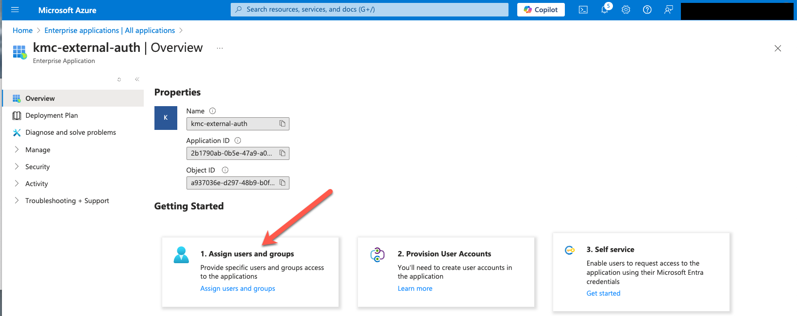

You can set up Red Hat OpenShift Service on AWS (ROSA) with hosted control planes (HCP) to use an external OpenID Connect (OIDC) identity provider for authentication instead of the built-in OpenShift OAuth server. While the built-in OAuth server supports various identity providers, its capabilities are limited. By integrating external OIDC identity providers directly with ROSA with HCP, you can enable machine-to-machine workflows, like CLI access, and gain features unavailable with the built-in OAuth server.


This document will guide you through setting up Microsoft Entra ID as an external authentication identity provider.

{}
You must configure your ROSA cluster with external authentication enabled at cluster creation. Previously deployed clusters cannot be upgraded or transitioned to enable external authentication.
{}

## Prerequisites
* [A ROSA with HCP cluster with external authentication enabled](https://docs.openshift.com/rosa/rosa_hcp/rosa-hcp-sts-creating-a-cluster-ext-auth.html)
* [AWS CLI](https://docs.aws.amazon.com/cli/latest/userguide/install-cliv2.html)
* [OpenShift Command Line Interface (CLI)](https://mirror.openshift.com/pub/openshift-v4/clients/ocp/)
* [jq](https://stedolan.github.io/jq/download/)

## Deploy a ROSA HCP cluster with External Authentication
To create a new ROSA HCP cluster with external authentication enabled, ensure that you add the `--external-auth-providers-enabled` flag to your `rosa create cluster` command. An example command is included below:

```bash
rosa create cluster --cluster-name=<cluster_name> --sts --mode=auto \
    --hosted-cp --operator-roles-prefix <operator-role-prefix> \
    --oidc-config-id <ID-of-OIDC-configuration> \
    --external-auth-providers-enabled \
    --subnet-ids=<public-subnet-id>,<private-subnet-id>
```

Once the ROSA HCP cluster has been created successfully, confirm support for External Authentication has been enabled by executing the following command:

```bash
rosa describe cluster -c ${ROSA_CLUSTER_NAME} -o json | jq -r '.external_auth_config.enabled'
```

A response of “true” from the preceding command indicates that external authentication provider support is enabled.

## Adding an External Authentication Provider

Once a ROSA cluster has been created, the next step is to add an External Authentication Provider which will configure the cluster to accept the provider generated OIDC tokens.  

### Required settings to create an external authentication provider

| <b>Flag    | Description<b>  | 
| :--------- | :---------------------------|
| `--cluster` | Name of the ROSA cluster | 
| `--name` | Name to associate with the External Authentication Provider
| `--issuer-url` | URL of the External Authentication Provider |  
| `--issuer-audiences` | Comma separated list of OIDC token audience values | 
| `--claim-mapping-username-claim` | Claim within the OIDC token containing the username | 
| `--claim-mapping-groups-claim` | Claim within the OIDC token containing group membership | 
| `--console-client-id` | OAuth Client ID to associate with the OpenShift Web Console | 
| `--console-client-secret` | OAuth Client Secret to associate with the OpenShift Web Console. This option is not required, however is recommended |  

Retrieve the OpenShift Authentication call back URL.  Save the output of this value, you will need it later.

```bash
echo $(rosa describe cluster --cluster $ROSA_CLUSTER_NAME -o json | jq -r '.console.url')/auth/callback
```

Example output:

```
https://console-openshift-console.apps.rosa.domain-prefix.ab12.p3.openshiftapps.com/auth/callback
```

### Configure Microsoft Entra ID

#### 1. Register a new application in Microsoft Entra ID
Create a Microsoft Entra ID app registration. To do so, login to the Azure portal, and navigate to the [App registrations blade](https://portal.azure.com/#blade/Microsoft_AAD_RegisteredApps/ApplicationsListBlade), then click on "New registration" to create a new application.


Provide a name for the application, for example `<cluster-name>-auth`. Select "Web" from the Redirect URI dropdown and fill in the Redirect URI using the value of the OAuth callback URL you retrieved in the previous step. Once you fill in the necessary information, click "Register" to create the application.


Then, click on the "Certificates & secrets" sub-blade and select "New client secret". Fill in the details request and make note of the generated client secret value, as you'll use it in a later step. You won't be able to retrieve it again.


Then, click on the "Overview" sub-blade and make note of the "Application (client) ID" and "Directory (tenant) ID". You'll need those values in a later step as well.


#### 2. Configure optional claims

In order to provide OpenShift with enough information to identify the user, we will configure Microsoft Entra ID to provide an `email` optional claim when a user logs in. For more information on optional claims, see [the Microsoft documentation](https://learn.microsoft.com/en-us/entra/identity-platform/optional-claims).

Click on the "Token configuration" sub-blade and select the "Add optional claim" button.


Select ID then check the `email` claim and click the "Add" button to configure them for your Microsoft Entra ID application.


When prompted, follow the prompt to enable the necessary Microsoft Graph permissions.


In order to allow effective management of permissions in OpenShift, we will configure Microsoft Entra ID to provide a `groups` claim when a user logs in. To do so, add a groups claim, make sure to select the "Groups assigned to the application" option.


Currently customers using Microsoft Entra ID for external authentication must set `--claim-mapping-username-claim` to `email` and `--claim-mapping-groups-claim` to `groups`.


From the above example, these are variables we will use next.

| <b>Flag    | Description<b>  | 
| :--------- | :---------------------------|
| `--cluster` | cluster-name | 
| `--name` | Application name from Step 1 in "Register a new application in Microsoft Entra ID"
| `--issuer-url` | https://login.microsoftonline.com/<tenant-id>/v2.0 |  
| `--issuer-audiences` | Application ID from Step 1 in "Register a new application in Microsoft Entra ID" | 
| `--claim-mapping-username-claim` | email | 
| `--claim-mapping-groups-claim` | groups | 
| `--console-client-id` | Application ID from Step 1 in "Register a new application in Microsoft Entra ID" | 
| `--console-client-secret` | Client Secret Value ID from Step 1 in "Register a new application in Microsoft Entra ID" |

### Prepare Environment Variables

```bash
IDP_NAME=<entra-application-name>
CLIENT_ID=<entra-application-id>
CLIENT_SECRET=<entra-client_secret_value>
TENANT_ID=<entra-tenant_id>
ROSA_CLUSTER_NAME=<cluster-name>
API_URL=$(rosa describe cluster --cluster ${ROSA_CLUSTER_NAME} -o json | jq -r '.api.url')
```
### Create an external authentication provider in ROSA 

```bash
rosa create external-auth-provider --cluster=${ROSA_CLUSTER_NAME} --name=${IDP_NAME} --issuer-url=https://login.microsoftonline.com/${TENANT_ID}/v2.0 --issuer-audiences=${CLIENT_ID} --claim-mapping-username-claim=email --claim-mapping-groups-claim=groups  --console-client-id=${CLIENT_ID} --console-client-secret=${CLIENT_SECRET}
```
Once the External Authentication Provider has been created, it will take several minutes for the provider to become active on the ROSA cluster.

### Verify the external authentication configuration
To verify your external authentication provider, run the following command:

```bash
rosa describe external-auth-provider -c ${ROSA_CLUSTER_NAME} --name ${IDP_NAME}
```
### Creating a break glass credential to access the ROSA cluster

One of the key differences between a cluster which has external authentication enabled and a cluster that doesn't is that there is no internal OAuth server to act as a separate identity provider. This means that there cannot be a standalone or pre-created cluster-admin account.  Instead, a temporary kubeconfig with cluster-admin privileges, which we refer to as a break glass credential, can be generated and used to access the ROSA cluster. Credentials are only valid for a maximum of 24 hours and are intended only to provide temporary elevated permissions into the cluster.

By using break glass credentials, cluster administrators can securely set up and manage role-based access control (RBAC) for their ROSA with HCP clusters, ensuring proper authentication and authorization mechanisms are in place before regular users access the cluster. During initial setup, Break glass credentials are crucial for applying the ClusterRoleBinding that maps external identity provider groups to cluster roles

Create a new break glass credential by executing the following command:

```bash
rosa create break-glass-credential -c ${ROSA_CLUSTER_NAME} --username=breakglass
```

Your output will look something like this:

```bash
I: Successfully created a break glass credential for cluster 'cluster-name'.
I: To retrieve only the kubeconfig for this credential use: 'rosa describe break-glass-credential abcdefg123456789 -c cluster-name --kubeconfig'
```

Save the kubeconfig file that will allow you to log into the cluster with the breakglass credentials just created.

```bash
rosa describe break-glass-credential <BREAK_GLASS_CREDENTIAL_ID> -c ${ROSA_CLUSTER_NAME} --kubeconfig > rosa-cluster.kubeconfig
```
Validate that rosa-cluster.kubeconfig is populated. Your file should look like this:

```
apiVersion: v1
clusters:
- cluster:
    server: ${API_URL}
  name: cluster
contexts:
- context:
    cluster: cluster
    namespace: default
    user: 555555555555555
  name: admin
current-context: admin
kind: Config
preferences: {}
users:
- name: 555555555555555
  user:
    client-certificate-data: 
    yyyyyyyyyyyyyyyyyyyyyy
    client-key-data: 
    XXXXXXXXXXXXXXXXXXXXXX
```

Set the `KUBECONFIG` environment variable to the location of the `rosa-cluster.kubeconfig` file which will enable the OpenShift CLI to authenticate against the ROSA cluster with the contents of the file.. 

```bash
export KUBECONFIG=$(pwd)/rosa-cluster.kubeconfig
```

Confirm you can access the cluster by running the following command:

```bash
oc get co
```

Your output should look like this:

```bash
NAME                                       VERSION   AVAILABLE   PROGRESSING   DEGRADED   SINCE   MESSAGE
console                                    4.15.43   True        False         False      7m3s
csi-snapshot-controller                    4.15.43   True        False         False      117m
dns                                        4.15.43   True        False         False      109m
image-registry                             4.15.43   True        False         False      109m
ingress                                    4.15.43   True        False         False      109m
insights                                   4.15.43   True        False         False      110m
kube-apiserver                             4.15.43   True        False         False      117m
kube-controller-manager                    4.15.43   True        False         False      117m
kube-scheduler                             4.15.43   True        False         False      117m
kube-storage-version-migrator              4.15.43   True        False         False      110m
monitoring                                 4.15.43   True        False         False      108m
network                                    4.15.43   True        False         False      117m
node-tuning                                4.15.43   True        False         False      111m
openshift-apiserver                        4.15.43   True        False         False      117m
openshift-controller-manager               4.15.43   True        False         False      117m
openshift-samples                          4.15.43   True        False         False      109m
operator-lifecycle-manager                 4.15.43   True        False         False      117m
operator-lifecycle-manager-catalog         4.15.43   True        False         False      117m
operator-lifecycle-manager-packageserver   4.15.43   True        False         False      117m
service-ca                                 4.15.43   True        False         False      110m
storage                                    4.15.43   True        False         False      111m
```

### Grant cluster-admin permissions to individual groups
By default, OpenShift does not grant permissions to take any action inside of your cluster when a user first logs in. ROSA includes a significant number of preconfigured roles, including the `cluster-admin` role that grants full access and control over the cluster. The cluster does not automatically create `RoleBindings` and `ClusterRoleBindings` for the groups that are included in your access token; you are responsible for creating those bindings by using your own processes.

In this example, we will grant a group access to the `cluster-admin` role by creating a ClusterRoleBinding to the group ID.

To retrieve the Azure Entra Group ID, search for Entra Group ID and copy the Object ID.


Set the group ID you retrieved above as an environment variable by running the following command:

```bash
GROUP_ID=<value from above>
```

In the Azure Portal, search for Enterprise Applications and then the external auth application you previously created.


Click on Assign users and groups


Click on Add user/group


Select the group you want to add to openshift


Next, we will create a `ClusterRoleBinding` that grants the members of the above group the ability to use the `cluster-admin` `ClusterRole`.

```bash
oc apply -f - <<EOF
apiVersion: rbac.authorization.k8s.io/v1
kind: ClusterRoleBinding
metadata:
  name: rosa-admins
roleRef:
  apiGroup: rbac.authorization.k8s.io
  kind: ClusterRole
  name: cluster-admin
subjects:
- apiGroup: rbac.authorization.k8s.io
  kind: Group
  name: $GROUP_ID
EOF
```

### Validate External Authentication

#### Validate using the OpenShift Web Console

To validate you can log into the OpenShift console with Microsoft Entra ID, first retrieve the OpenShift Console URL by running the following command:

```bash
rosa describe cluster -c ${ROSA_CLUSTER_NAME} -o json | jq -r '.console.url'
```

Open this URL and your external authentication provider should open.

### Validate access to the cluster's API
Here we will be leveraging a client-go Credential Plugin to automate the interaction between the OpenShift CLI and the External Authentication Provider including the management of OIDC tokens.

More information related to Kubernetes plugins can be found [here](https://kubernetes.io/docs/tasks/extend-kubectl/kubectl-plugins/).

Once the plugin has been configured and is available, create a KUBECONFIG file here with EntraID details for example create **rosa-auth.kubeconfig** file with following information

```bash
apiVersion: v1
clusters:
- cluster:
    server: ${API_URL}
  name: cluster
contexts:
- context:
    cluster: cluster
    namespace: default
    user: oidc
  name: admin
current-context: admin
kind: Config
preferences: {}
users:
- name: oidc
  user:
    exec:
      apiVersion: client.authentication.k8s.io/v1
      args:
      - oidc-login
      - get-token
      - --oidc-issuer-url=https://login.microsoftonline.com/${TENANT_ID}/v2.0
      - --oidc-client-id=${CLIENT_ID}
      - --oidc-client-secret=${CLIENT_SECRET}
      - --oidc-extra-scope=email
      - --oidc-extra-scope=openid
      command: kubectl
      env: null
      interactiveMode: Never
```
Set the KUBECONFIG environment variable to the location of the rosa-cluster.kubeconfig file which will enable the OpenShift CLI to authenticate against the ROSA cluster with the contents of the file.

To confirm that the identity details from the OIDC token is being used by the OpenShift CLI:

```bash
export KUBECONFIG=$(pwd)/rosa-auth.kubeconfig
```

Confirm access to cluster with elevated priviledges

```bash
oc get nodes
```
example output:

```bash
NAME                         STATUS   ROLES    AGE     VERSION
ip-10-0-0-170.ec2.internal   Ready    worker   3h29m   v1.30.7
ip-10-0-1-171.ec2.internal   Ready    worker   3h30m   v1.30.7
ip-10-0-2-161.ec2.internal   Ready    worker   3h29m   v1.30.7
```
To verify logged in as user of group run

```bash
oc auth whoami
```
### Validate access to the cluster's API using device-code authentication 

Note: Using device-code authentication is when you are authenticating from somewhere that doesn't have a web browser. The --token-cache-storage=disk parameter is used when a client machine lacks keyring. 

Click on the "Authentication" on your Entra ID and Enable Public flows in Advanced section of the page


Create a **rosa-auth-headless.kubeconfig** file containing Entra ID authentication details and cluster API.

```bash
apiVersion: v1
clusters:
- cluster:
    server: ${API_URL}
  name: cluster
contexts:
- context:
    cluster: cluster
    namespace: default
    user: oidc
  name: admin
current-context: admin
kind: Config
preferences: {}
users:
- name: oidc
  user:
    exec:
      apiVersion: client.authentication.k8s.io/v1
      args:
      - oidc-login
      - get-token
      - --oidc-issuer-url=https://login.microsoftonline.com/${TENANT_ID}/v2.0
      - --oidc-client-id=${CLIENT_ID}
      - --oidc-client-secret=${CLIENT_SECRET}
      - --oidc-extra-scope=email
      - --oidc-extra-scope=openid
      - --grant-type=device-code
      - --skip-open-browser
      - --token-cache-storage=disk
      command: kubectl
      env: null
      interactiveMode: Never
```
Set the `KUBECONFIG` environment variable to the location of the `rosa-cluster.kubeconfig` file which will enable the OpenShift CLI to authenticate against the ROSA cluster with the contents of the file.

To confirm that the identity details from the OIDC token is being used by the OpenShift CLI:

```bash
export KUBECONFIG=$(pwd)/rosa-auth-headless.kubeconfig
```

Confirm access to cluster

```bash
oc get nodes
```
example output:

```bash
Please enter the following code when asked in your browser: XXXXXXX
Please visit the following URL in your browser: https://microsoft.com/devicelogin

ATTRIBUTE   VALUE
Username    xxxxxx@redhat.com
Groups      [000000000000000000 system:authenticated]
NAME                         STATUS   ROLES    AGE     VERSION
ip-10-0-0-170.ec2.internal   Ready    worker   3h29m   v1.30.7
ip-10-0-1-171.ec2.internal   Ready    worker   3h30m   v1.30.7
ip-10-0-2-161.ec2.internal   Ready    worker   3h29m   v1.30.7
```
To verify logged in as user of group run

```bash
oc auth whoami
```
```bash
Please enter the following code when asked in your browser: XXXXXX
Please visit the following URL in your browser: https://microsoft.com/devicelogin
ATTRIBUTE   VALUE
Username    XXXXXXX@redhat.com
Groups      [0000000000000000 system:authenticated]
```

### Revoke break glass credential
Revoking break-glass credentials in OpenShift is crucial for security and compliance. These credentials are typically highly privileged, providing full administrative access to the cluster. Upon setting up external authentication with cluster administrator credentials, the break-glass credential should be revoked. Refer to [documentation](https://docs.openshift.com/rosa/rosa_hcp/rosa-hcp-sts-creating-a-cluster-ext-auth.html?utm_source=chatgpt.com#rosa-hcp-sts-revoking-a-break-glass-cred-cli_rosa-hcp-sts-creating-a-cluster-ext-auth) on revoking break-glass credential 
