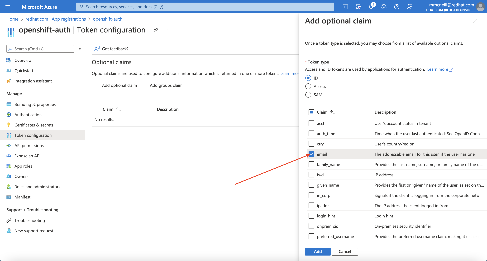
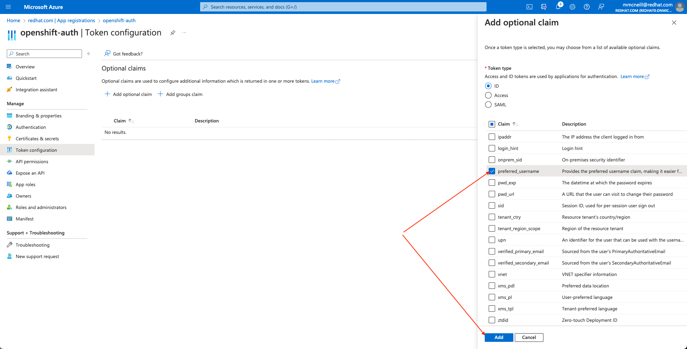

You can set up Red Hat OpenShift Service on AWS (ROSA) with hosted control planes (HCP) to use an external OpenID Connect (OIDC) identity provider for authentication instead of the built-in OpenShift OAuth server. While the built-in OAuth server supports various identity providers, its capabilities are limited. By integrating external OIDC identity providers directly with ROSA with HCP, you can enable machine-to-machine workflows, like CLI access, and gain features unavailable with the built-in OAuth server.


This document will guide you through setting up an external authentication identity provider.

**Important Note**: You must create your rosa cluster with external authentication enabled.  You cannot convert an existing ROSA cluster to one using external authentication.

## Prerequisites
* ROSA HCP Cluster with external authentication enabled
* [AWS CLI](https://docs.aws.amazon.com/cli/latest/userguide/install-cliv2.html)
* [Openshift CLI](https://mirror.openshift.com/pub/openshift-v4/clients/ocp/)

## Deploy a ROSA HCP cluster with External Authentication
A new ROSA HCP cluster must be created to enable the integration of an external authentication provider. Previously deployed clusters cannot be upgraded or transitioned to support the external authentication provider capability. The --external-auth-providers-enabled flag of the rosa create cluster command is used to enable this feature.

```bash
rosa create cluster --hosted-cp --subnet-ids=$SUBNET_IDS \
   --oidc-config-id=$OIDC_ID --cluster-name=<cluster_name> \
   --operator-roles-prefix=$OPERATOR_ROLES_PREFIX \
   --external-auth-providers-enabled
```

Once the ROSA HCP cluster has been created successfully, confirm support for External Authentication has been enabled by executing the following command:

```bash
rosa describe cluster -c <CLUSTER_NAME> -o json | jq -r '.external_auth_config.enabled'
```

A response of “true” from the preceding command indicates that external authentication provider support is enabled.

## Adding an External Authentication Provider

Once a ROSA cluster has been created, the next step is to add an External Authentication Provider which will configure the cluster to accept the provider generated OIDC tokens.  

### Required settings to create an external authentication provider

| <b>Flag    | Description<b>  | 
| :--------- | :---------------------------|
| --cluster | Name of the ROSA cluster | 
| --name | Name to associate with the External Authentication Provider
| --issuer-url | URL of the External Authentication Provider |  
| --issuer-audiences | Comma separated list of OIDC token audience values | 
| --claim-mapping-username-claim | Claim within the OIDC token containing the username | 
| --claim-mapping-groups-claim | Claim within the OIDC token containing group membership | 
| --console-client-id | OAuth Client ID to associate with the OpenShift Web Console | 
| --console-client-secret | OAuth Client Secret to associate with the OpenShift Web Console. This option is not required, however is recommended |  

Retrieve the OpenShift Authentication call back URL.  Save the output of this value, you will need it later.

```bash
echo $(rosa describe cluster -c $ROSA_CLUSTER_NAME -o json | jq -r '.console.url')/auth/callback
```

Example output:

```
https://console-openshift-console.apps.rosa.kmc-external.ya62.p3.openshiftapps.com/auth/callback
```

### Microsoft Entra Example

#### 1. Register a new application in Azure Entra ID
You need to create the Azure AD application itself. To do so, login to the Azure portal, and navigate to [App registrations blade](https://portal.azure.com/#blade/Microsoft_AAD_RegisteredApps/ApplicationsListBlade), then click on "New registration" to create a new application.


Provide a name for the application, for example `<cluster-name>-auth`. Select "Web" from the Redirect URI dropdown and fill in the Redirect URI using the value of the OAuth callback URL you retrieved in the previous step. Once you fill in the necessary information, click "Register" to create the application.


Then, click on the "Certificates & secrets" sub-blade and select "New client secret". Fill in the details request and make note of the generated client secret value, as you'll use it in a later step. You won't be able to retrieve it again.


Then, click on the "Overview" sub-blade and make note of the "Application (client) ID" and "Directory (tenant) ID". You'll need those values in a later step as well.


#### 2. Configure optional claims

In order to provide OpenShift with enough information about the user to create their account, we will configure Azure AD to provide two optional claims, specifically "email" and "preferred_username" when a user logs in. For more information on optional claims in Azure AD, see [the Microsoft documentation](https://docs.microsoft.com/en-us/azure/active-directory/develop/active-directory-optional-claims).

Click on the "Token configuration" sub-blade and select the "Add optional claim" button.


Select ID then check the "email" and "preferred_username" claims and click the "Add" button to configure them for your Azure AD application.





When prompted, follow the prompt to enable the necessary Microsoft Graph permissions.


Add group claims, make sure to select groups assigned to the application.


At the time of this writing, the --claim-mapping-username-claim must be 'email' and the --claim-mapping-groups-claim will be 'groups'.


From the above example, these are variables we will use next.

| <b>Flag    | Description<b>  | 
| :--------- | :---------------------------|
| --cluster | kmc-external | 
| --name | kmc-external-auth
| --issuer-url | https://login.microsoftonline.com/tenant_id_xxxxxx/v2.0 |  
| --issuer-audiences | Application ID from Step 1 in Register a new application in Azure Entra ID | 
| --claim-mapping-username-claim | email | 
| --claim-mapping-groups-claim | groups | 
| --console-client-id | Application ID from Step 1 in Register a new application in Azure Entra ID | 
| --console-client-secret | Value from Step 1 in Register a new application in Azure AD |  

### Create the ROSA External Auth Provider

```bash
rosa create external-auth-provider --cluster=<cluster_name> --name=<idp_name>     --issuer-url='https://login.microsoftonline.com/tenant_id_xxxxxx/v2.0' --issuer-audiences='<oidc_id>' --claim-mapping-username-claim=email --claim-mapping-groups-claim=groups   
--console-client-id='<clientid_xxxx>' --console-client-secret='clientsecretvalue_xxxx'
```

### Creating a Break Glass Credential to Access the ROSA Cluster

One of the key differences between a standard ROSA cluster and a cluster with External Authentication Provider support enabled is that there is no administrator account. Instead, a temporary (break glass) credential, in the form of a kubeconfig file, with cluster-admin privileges can be generated and used to access the ROSA cluster. Credentials are only valid for a maximum of 24 hours with the purpose of enabling tasks to be completed in order to prepare or rectify a cluster for normal operation when integrated with an External Authentication Provider.

Create a new break glass credential by executing the following command:
. 

```bash
rosa create break-glass-credential -c <CLUSTER_NAME> --username=breakglass
```

example output:

```bash
I: Successfully created a break glass credential for cluster 'kmc-external'.
I: To retrieve only the kubeconfig for this credential use: 'rosa describe break-glass-credential 2ggnt7sj65ip1fm8vhs0b5tg2slas4iq -c kmc-external --kubeconfig'
```

Save the kubeconfig file that will allow you to log into the cluster with the breakglass credentials just created.

```bash
rosa describe break-glass-credential <BREAK_GLASS_CREDENTIAL_ID> -c <ROSA_CLUSTER_NAME> --kubeconfig > rosa-cluster.kubeconfig
```

Set the KUBECONFIG environment variable to the location of the rosa-cluster.kubeconfig file which will enable the OpenShift Command Line Interface to authenticate against the ROSA cluster with the contents of the file.. 

export KUBECONFIG=$(pwd)/rosa-cluster.kubeconfig

Confirm access with elevated privileges to the ROSA cluster by executing the following command:

```bash
oc get co
```

example output:

```
Confirm access with elevated privileges to the ROSA cluster by executing the following command:

```bash
NAME                                       VERSION   AVAILABLE   PROGRESSING   DEGRADED   SINCE   MESSAGE
console                                    4.15.43   True        False         False      7m3s
csi-snapshot-controller                    4.15.43   True        False         False      117m
dns                                        4.15.43   True        False         False      109m
image-registry                             4.15.43   True        False         False      109m
ingress                                    4.15.43   True        False         False      109m
insights                                   4.15.43   True        False         False      110m
kube-apiserver                             4.15.43   True        False         False      117m
kube-controller-manager                    4.15.43   True        False         False      117m
kube-scheduler                             4.15.43   True        False         False      117m
kube-storage-version-migrator              4.15.43   True        False         False      110m
monitoring                                 4.15.43   True        False         False      108m
network                                    4.15.43   True        False         False      117m
node-tuning                                4.15.43   True        False         False      111m
openshift-apiserver                        4.15.43   True        False         False      117m
openshift-controller-manager               4.15.43   True        False         False      117m
openshift-samples                          4.15.43   True        False         False      109m
operator-lifecycle-manager                 4.15.43   True        False         False      117m
operator-lifecycle-manager-catalog         4.15.43   True        False         False      117m
operator-lifecycle-manager-packageserver   4.15.43   True        False         False      117m
service-ca                                 4.15.43   True        False         False      110m
storage                                    4.15.43   True        False         False      111m
```

### Assign OpenShift RBAC Policies
Once an External Authentication Provider has been added to the ROSA cluster and access has been enabled and confirmed by creating a break glass credential, the next task is to assign OpenShift RBAC policies so that identities that are registered within the External Authentication Provider. The policies which can be applied vary based on the desired configuration of the ROSA cluster. However, since the break glass credential is designed to be temporary and long term access should reside using credentials associated with the External Authentication Provider, the policies that should be created should enable productivity for cluster administrators and users.

A common policy in this use case is the creation of a policy to enable cluster-admin level access for one or more entities registered within the External Authorization Provider. When leveraging the RHBK reference implementation, create a ClusterRoleBinding resource to the cluster-admin ClusterRole to members of the rosa-admins group. Once the policy has been created, the rosa-admin user will be granted elevated privileges in the ROSA cluster.

#### Azure Entra Group ID Example
To retrieve the Azure Entra Group ID, search for Entra Group ID and copy the Object ID.


Set the group id to an environment variable

```bash
GROUP_ID=<value from above>
```

### Assign the Azure Entegra Group to the Auth Application
In the Azure Portal, search for Enterprise Applications and then the external auth application you previously created.


Click on Assign users and groups


Click on Add user/group


Select the group you want to add to openshift


#### Create a Cluster Role Binding for Admins

Next, we will assign the above group as admins to the cluster.

```bash
oc apply -f - <<EOF
apiVersion: rbac.authorization.k8s.io/v1
kind: ClusterRoleBinding
metadata:
  name: rosa-admins
roleRef:
  apiGroup: rbac.authorization.k8s.io
  kind: ClusterRole
  name: cluster-admin
subjects:
- apiGroup: rbac.authorization.k8s.io
  kind: Group
  name: $GROUP_ID
EOF
```


