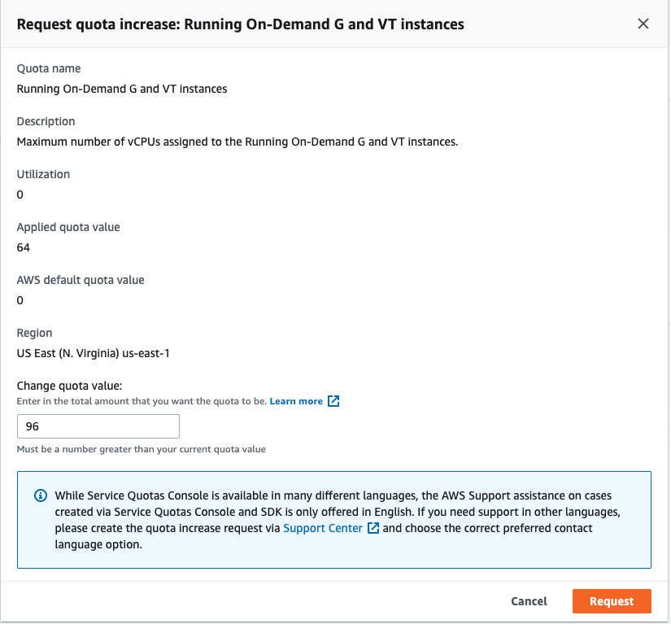

ROSA guide to running Nvidia GPU workloads.

## Prerequisites

* ROSA Cluster (4.14+)
* rosa cli #logged-in
* oc cli #logged-in-cluster-admin
* jq

If you need to install a ROSA cluster, please read our [ROSA Quickstart Guide](/experts/quickstart-rosa.md), or better yet [Use Terraform to create an HCP Cluster](/experts/terraform/hcp).

Enter the `oc login` command, username, and password from the output of the previous command:

Example login:
```bash
oc login https://api.cluster_name.t6k4.i1.organization.org:6443 \
> --username cluster-admin \
> --password mypa55w0rd
Login successful.
You have access to 77 projects, the list has been suppressed. You can list all projects with ' projects'
```

Linux:

```bash
sudo dnf install jq
```

MacOS
```bash
brew install jq
```

### Helm Prerequisites

> If you do not want to use Helm you can follow the steps in the [Manual](./manual) section.

1. Add the MOBB chart repository to your Helm

    ```bash
    helm repo add mobb https://rh-mobb.github.io/helm-charts/
    ```

1. Update your repositories

    ```bash
    helm repo update
    ```

## GPU Quota

1. View the list of supported GPU instance types in ROSA

    ```bash
    rosa list instance-types | grep accelerated
    ```

1. Select a GPU instance type

   > The guide uses *g5.xlarge* as an example. Please be mindful of the GPU cost of the type you choose.

    ```bash
    export GPU_INSTANCE_TYPE='g5.xlarge'
    ```

1. Login to AWS

    Login to [AWS Console](https://console.aws.amazon.com/console/home), type "quotas" in search by, click on "Service Quotas" -> "AWS services" -> "Amazon Elastic Compute Cloud (Amazon EC2). Search for "Running On-Demand [instance-family] instances" (e.g. Running On-Demand G and VT instances).

    > Please remember that when you request quota that AWS is per core.  As an example, to request a single *g5.xlarge*, you will need to request quota in groups of 4; to request a single *g5.8xlarge*, you will need to request quota in groups of 32.

1. Verify quota and request increase if necessary

    

## GPU Machine Pool

1. Set environment variables

    ```bash
    export CLUSTER_NAME=<YOUR-CLUSTER>
    export MACHINE_POOL_NAME=nvidia-gpu-pool
    export MACHINE_POOL_REPLICA_COUNT=1
    ```

1. Create GPU machine pool

    ```bash
    rosa create machinepool --cluster=$CLUSTER_NAME \
      --name=$MACHINE_POOL_NAME \
      --replicas=$MACHINE_POOL_REPLICA_COUNT \
      --instance-type=$GPU_INSTANCE_TYPE \
      --taints "nvidia.com/gpu=present:NoSchedule"
    ```

1. Verify GPU machine pool

    > It may take 10-15 minutes to provision a new GPU machine. If this step fails, please login to the [AWS Console](https://console.aws.amazon.com/console/home) and ensure you didn't run across availability issues. You can go to EC2 and search for instances by cluster name to see the instance state.

    ```bash
    echo "waiting for machine pool to be ready"
    while true; do
      response=$(rosa describe machinepool -c "${CLUSTER_NAME}" \
          "${MACHINE_POOL_NAME}" -o json | jq .status.current_replicas)
      if [[ "${response}" != "0" ]]; then
        break
      fi
      echo -n .
      sleep 1
    done
    rosa describe machinepool -c "${CLUSTER_NAME}" "${MACHINE_POOL_NAME}"
    ```

1. Double check that the cluster shows the node as ready

    ```bash
    oc get nodes -l "node.kubernetes.io/instance-type=$GPU_INSTANCE_TYPE"
    ```

    ```
    NAME                                        STATUS   ROLES    AGE     VERSION
    ip-10-10-4-167.us-east-2.compute.internal   Ready    worker   4m28s   v1.28.9+2f7b992
    ```

## Install and Configure Nvidia GPU

This section configures the Node Feature Discovery Operator (to allow OpenShift to discover the GPU nodes) and the Nvidia GPU Operator.

1. Create namespaces

    ```bash
    oc create namespace openshift-nfd
    oc create namespace nvidia-gpu-operator
    ```

1. Use the `mobb/operatorhub` chart to deploy the needed operators

    ```bash
    helm upgrade -n nvidia-gpu-operator nvidia-gpu-operator \
      mobb/operatorhub --install \
      --values https://raw.githubusercontent.com/rh-mobb/helm-charts/main/charts/nvidia-gpu/files/operatorhub.yaml
    ```

1. Wait until the two operators are running

    > Note: If you see an error like `Error from server (NotFound): deployments.apps "nfd-controller-manager" not found`, wait a few minutes and try again.

    ```bash
    oc wait --for=jsonpath='{.status.replicas}'=1 deployment \
      nfd-controller-manager -n openshift-nfd --timeout=600s
    ```

    ```bash
    oc wait --for=jsonpath='{.status.replicas}'=1 deployment \
      gpu-operator -n nvidia-gpu-operator --timeout=600s
    ```

1. Install the Nvidia GPU Operator chart

    ```bash
    helm upgrade --install -n nvidia-gpu-operator nvidia-gpu \
      mobb/nvidia-gpu --disable-openapi-validation
    ```

1. Wait until NFD instances are ready

    ```bash
    oc wait --for=jsonpath='{.status.replicas}'=1 deployment \
      nfd-master -n openshift-nfd --timeout=600s
    ```

    ```bash
    oc wait --for=jsonpath='{.status.numberReady}'=$(oc get nodes --no-headers | wc -l) \
      daemonset nfd-worker -n openshift-nfd --timeout=600s
    ```

1. Wait until Cluster Policy is ready

    > Note: This step may take a few minutes to complete.

    ```bash
    oc wait --for=jsonpath='{.status.state}'=ready clusterpolicy \
      gpu-cluster-policy -n nvidia-gpu-operator --timeout=600s
    ```

## Validate GPU

1. Verify NFD can see your GPU(s)

    ```bash
    oc describe node -l node.kubernetes.io/instance-type=$GPU_INSTANCE_TYPE \
      | egrep 'Roles|pci-10de' | grep -v master
    ```

    You should see output like:

    ```bash
    Roles:              worker
                        feature.node.kubernetes.io/pci-10de.present=true
    ```

1. Verify GPU Operator added node label to your GPU nodes

    ```bash
    oc get node -l nvidia.com/gpu.present
    ```

1. [Optional] Test GPU access using Nvidia SMI

    ```bash
    for i in $(oc -n nvidia-gpu-operator get pod -lopenshift.driver-toolkit=true --no-headers |awk '{print $1}'); do echo $i; oc exec -n nvidia-gpu-operator -it $i -- nvidia-smi ; echo -e '\n' ;  done
    ```

    You should see output that shows the GPUs available on the host such as this example screenshot. (Varies depending on GPU worker type)

    

2. Create Pod to run a GPU workload

    ```yaml
    cat <<EOF | oc create -f -
    apiVersion: v1
    kind: Pod
    metadata:
      name: cuda-vector-add
      namespace: nvidia-gpu-operator
    spec:
      restartPolicy: OnFailure
      containers:
        - name: cuda-vector-add
          image: "nvidia/samples:vectoradd-cuda11.2.1"
          resources:
            limits:
              nvidia.com/gpu: 1
          nodeSelector:
            nvidia.com/gpu.present: true
      tolerations:
      - key: "nvidia.com/gpu"
        operator: "Equal"
        value: "present"
        effect: "NoSchedule"
    EOF
    ```

3. View logs

   ```bash
   oc logs cuda-vector-add --tail=-1 -n nvidia-gpu-operator
   ```

   >Please note, if you get an error "Error from server (BadRequest): container "cuda-vector-add" in pod "cuda-vector-add" is waiting to start: ContainerCreating" try running "oc delete pod cuda-vector-add" and then re-run the create statement above. We've seen issues where if this step is ran before all of the operator consolidation is done it may just sit there.

   You should see Output like the following (mary vary depending on GPU):

   ```bash
   [Vector addition of 5000 elements]
   Copy input data from the host memory to the CUDA device
   CUDA kernel launch with 196 blocks of 256 threads
   Copy output data from the CUDA device to the host memory
   Test PASSED
   Done
   ```

4. If successful, the pod can be deleted

   ```bash
   oc delete pod cuda-vector-add -n nvidia-gpu-operator
   ```
