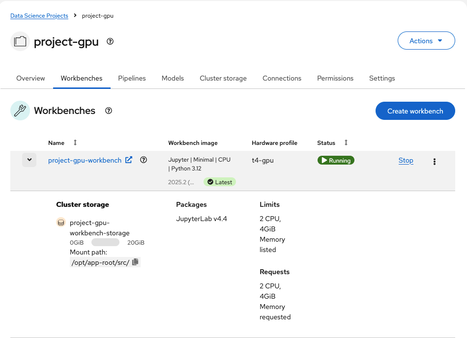
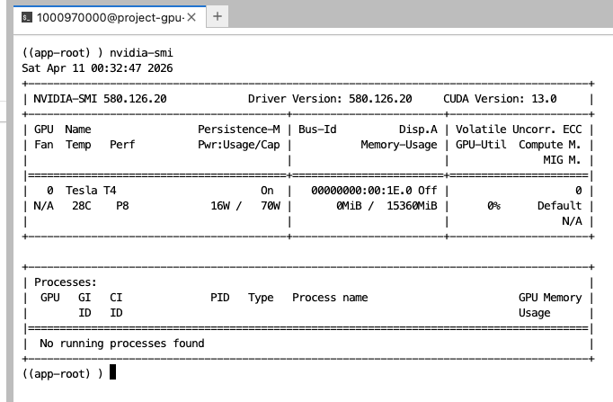

This guide shows how to add NVIDIA GPU capacity to an existing Red Hat OpenShift Service on AWS (ROSA) cluster and validate it for use with Red Hat OpenShift AI.

The flow in this guide covers:

* creating a GPU machine pool on ROSA
* installing Node Feature Discovery (NFD)
* installing the NVIDIA GPU Operator 
* creating a `ClusterPolicy`
* verifying that the GPU is exposed to the cluster
* enabling OpenShift AI hardware profiles
* creating a GPU-backed hardware profile and validating a GPU-enabled workbench

This guide was validated on ROSA 4.20 with OpenShift AI 2025.2 using an NVIDIA Tesla T4 GPU on an AWS `g4dn.xlarge` instance.


## 0. Prerequisites

Before you begin, make sure you have:

* an existing ROSA cluster with `cluster-admin` access
* the `rosa` CLI configured for your cluster
* the `oc` CLI configured and logged in
* sufficient AWS quota and capacity for a GPU instance type in your target Region and Availability Zone
* Red Hat OpenShift AI already installed if you want to validate GPU-backed workbenches from the dashboard. You can follow Step 1-2 from [this article](/experts/redhat/rhoai/rosa-s3/) to install RHOAI operator.

During validation, a 2-worker `m5.xlarge` machine pool did not provide enough schedulable capacity for this walkthrough. Some OpenShift AI components could not be scheduled, and the OpenShift AI dashboard remained in a `Not Ready` state. Use at least 3 worker nodes, enable autoscaling, or create a dedicated machine pool for OpenShift AI if the existing workers are already heavily used.

This walkthrough was validated on an existing ROSA cluster in `ca-central-1` using a `g4dn.xlarge` GPU machine pool.


## 1. Create a GPU machine pool

Start by creating a dedicated GPU machine pool instead of modifying existing worker pools. This keeps GPU workloads isolated and makes scheduling easier to reason about down the road.

```bash
export CLUSTER=<your-cluster-name>
export GPU_MP_NAME=gpu
export GPU_INSTANCE_TYPE=g4dn.xlarge

rosa create machinepool \
  --cluster=$CLUSTER \
  --name=$GPU_MP_NAME \
  --replicas=1 \
  --instance-type=$GPU_INSTANCE_TYPE \
  --labels=node-role.kubernetes.io/gpu=,nvidia.com/gpu.present=true \
  --taints=nvidia.com/gpu=true:NoSchedule
```

The GPU machine pool can take several minutes to provision. Wait until the new node joins the cluster and the machine pool shows `1/1`.

```bash
rosa list machinepools -c $CLUSTER
oc get nodes
oc get nodes -l node-role.kubernetes.io/gpu=
```

At this stage, the GPU node existed but did not yet advertise `nvidia.com/gpu`, because the GPU software stack had not yet been installed.


## 2. Install the Node Feature Discovery Operator

Install the Node Feature Discovery (NFD) Operator. NFD is used to discover hardware capabilities and label nodes appropriately.  


In this guide, the operators are installed with the CLI for repeatability and easy copy/paste. You can also install the same operators from Software Catalog (formerly known as OperatorHub) in the OpenShift web console if you prefer clicking through a UI.


```bash
cat <<'EOF' | oc apply -f -
apiVersion: v1
kind: Namespace
metadata:
  name: openshift-nfd
---
apiVersion: operators.coreos.com/v1
kind: OperatorGroup
metadata:
  name: openshift-nfd
  namespace: openshift-nfd
spec:
  targetNamespaces:
  - openshift-nfd
---
apiVersion: operators.coreos.com/v1alpha1
kind: Subscription
metadata:
  name: nfd
  namespace: openshift-nfd
spec:
  channel: stable
  installPlanApproval: Automatic
  name: nfd
  source: redhat-operators
  sourceNamespace: openshift-marketplace
EOF
```

Wait for the operator to install:

```bash
oc get csv -n openshift-nfd -w
```

Create the `NodeFeatureDiscovery` instance:

```bash
cat <<'EOF' | oc apply -f -
apiVersion: nfd.openshift.io/v1
kind: NodeFeatureDiscovery
metadata:
  name: nfd-instance
  namespace: openshift-nfd
spec: {}
EOF
```

Verify the pods:

```bash
oc get nodefeaturediscovery -n openshift-nfd
oc get pods -n openshift-nfd
```

At this point, all NFD components should be in `Running` state.


## 3. Install the NVIDIA GPU Operator

After NFD is installed, install the NVIDIA GPU Operator.


In this guide, the operators are installed with the CLI for repeatability and easy copy/paste. You can also install the same operators from Software Catalog (formerly known as OperatorHub) in the OpenShift web console if you prefer a UI-based workflow.


### Option A: Install the certified operator from Software Catalog

```bash
cat <<'EOF' | oc apply -f -
apiVersion: v1
kind: Namespace
metadata:
  name: nvidia-gpu-operator
---
apiVersion: operators.coreos.com/v1
kind: OperatorGroup
metadata:
  name: nvidia-gpu-operator
  namespace: nvidia-gpu-operator
spec:
  targetNamespaces:
  - nvidia-gpu-operator
---
apiVersion: operators.coreos.com/v1alpha1
kind: Subscription
metadata:
  name: gpu-operator-certified
  namespace: nvidia-gpu-operator
spec:
  channel: stable
  installPlanApproval: Automatic
  name: gpu-operator-certified
  source: certified-operators
  sourceNamespace: openshift-marketplace
EOF
```

Wait for the CSV:

```bash
oc get csv -n nvidia-gpu-operator -w
```

In this validation, the installed CSV was `gpu-operator-certified.v26.3.0`.

### Option B: Install the NVIDIA GPU Operator with Helm

As an alternative, you can install the NVIDIA GPU Operator directly from NVIDIA’s maintained Helm chart.

Because Node Feature Discovery is already installed separately on OpenShift, disable the chart-managed NFD deployment during the Helm install.

```bash
helm repo add nvidia https://helm.ngc.nvidia.com/nvidia
helm repo update

helm install --wait --generate-name \
  -n nvidia-gpu-operator --create-namespace \
  nvidia/gpu-operator \
  --version=v26.3.0 \
  --set nfd.enabled=false
```

In this validation, the installed chart version was `v26.3.0`.


To see newer chart versions, run `helm search repo nvidia/gpu-operator --versions` before installing.



## 4. Create the ClusterPolicy

If you installed the NVIDIA GPU Operator with Helm, you can skip this step because the chart already creates the `ClusterPolicy`.


```bash
CSV=$(oc get csv -n nvidia-gpu-operator -o jsonpath='{range .items[*]}{.metadata.name}{"\n"}{end}' | grep '^gpu-operator-certified' | head -n1)

oc get csv -n nvidia-gpu-operator "$CSV" \
  -o jsonpath='{.metadata.annotations.alm-examples}' \
| jq -r '.[] | select(.kind=="ClusterPolicy")' > gpu-cluster-policy.json

oc apply -f gpu-cluster-policy.json
```

Verify readiness:

```bash
oc get clusterpolicy
oc describe clusterpolicy gpu-cluster-policy
oc get pods -n nvidia-gpu-operator
```

The `gpu-cluster-policy` should reach `State: ready`.

Note that it may take 15-20 minutes for the ClusterPolicy to become ready while the NVIDIA driver components are deployed and initialized on the GPU node.


## 5. Verify GPU capacity on the node

Once the `ClusterPolicy` ready, verify that the GPU node exposes allocatable GPU resources.

```bash
oc get nodes -o json | jq '.items[] | {name: .metadata.name, gpu: .status.allocatable["nvidia.com/gpu"]}'
```

An example of expected output:

```json
{
  "name": "ip-10-0-1-224.ca-central-1.compute.internal",
  "gpu": "1"
}
```

The GPU node reported `nvidia.com/gpu: "1"` which means that the NVIDIA stack was working at the cluster level.


## 6. Validate the GPU with a simple pod

Before moving to OpenShift AI, validate the GPU with a simple test pod.

```bash
cat <<'EOF' | oc apply -f -
apiVersion: v1
kind: Pod
metadata:
  name: nvidia-smi
spec:
  restartPolicy: Never
  tolerations:
  - key: nvidia.com/gpu
    operator: Equal
    value: "true"
    effect: NoSchedule
  containers:
  - name: nvidia-smi
    image: nvcr.io/nvidia/cuda:12.5.0-base-ubi9
    command: ["/bin/bash","-lc","nvidia-smi && sleep 5"]
    resources:
      limits:
        nvidia.com/gpu: 1
EOF
```

Watch it and inspect the logs:

```bash
oc get pod nvidia-smi -w
oc logs nvidia-smi
```

The `nvidia-smi` output should show the GPU used (in this example Tesla T4) and confirm that the driver and CUDA stack were functioning correctly.


## 7. Enable OpenShift AI hardware profiles

To expose the newer hardware-profile workflow in the OpenShift AI dashboard, you need to enable hardware profiles in the `OdhDashboardConfig` custom resource. 

This enables **Settings -> Hardware profiles** in the dashboard:

```bash
oc patch odhdashboardconfig odh-dashboard-config \
  -n redhat-ods-applications \
  --type merge \
  -p '{
    "spec": {
      "dashboardConfig": {
        "disableHardwareProfiles": false
      }
    }
  }'
```

Verify that the change took effect:

```bash
oc get odhdashboardconfig odh-dashboard-config \
  -n redhat-ods-applications -o yaml | grep -En 'disableHardwareProfiles|disableAcceleratorProfiles'
```

Wait for a few minutes and refresh the dashboard page. The dashboard should now display  **Hardware profiles** under **Settings**. 


## 8. Create a GPU hardware profile in OpenShift AI

Click **Create hardware profile**.

These are the hardware profile settings validated in this guide: 

- **Name:** `t4-gpu`

- **Visibility:** Visible everywhere

- **Additional resource:**
  - Resource name: `nvidia-gpu`
  - Resource identifier: `nvidia.com/gpu`
  - Resource type: `Other`
  - Default: `1`
  - Minimum allowed: `1`
  - Maximum allowed: `1`

- **Node selector:**
  - Key: `nvidia.com/gpu.present`
  - Value: `true`

- **Toleration:**
  - Key: `nvidia.com/gpu`
  - Operator: `Equal`
  - Value: `true`
  - Effect: `NoSchedule`

Once created, the hardware profile should look like this:


<br />


## 9. Create and validate a GPU-backed workbench

After you create the GPU hardware profile, create a data science project and then a workbench using the hardware profile you just created.

Wait until the status is `Running` per snippet below:


<br />

To verify where the workbench landed and what resources it requested, inspect the pod:

```bash
oc get pods -n project-gpu -o wide

oc get pod -n project-gpu project-gpu-workbench-0 -o yaml | grep -En "nvidia.com/gpu|nodeSelector|tolerations"
```

At this stage, the workbench pod should:

* run on the GPU node
* request `nvidia.com/gpu: "1"`
* use `nodeSelector: nvidia.com/gpu.present: "true"`
* include a toleration for `nvidia.com/gpu=true:NoSchedule`

Finally, click the workbench, launch a terminal, and confirm that the GPU is available:

```bash
nvidia-smi
```


<br />

As seen from the above output, `nvidia-smi` inside the workbench showed an NVIDIA Tesla T4, confirming that the workbench had end-to-end GPU access through OpenShift AI.


## 10. Cleanup

If you no longer need the GPU test resources, remove them after validation.

Delete the standalone validation pod:

```bash
oc delete pod nvidia-smi --ignore-not-found
```

Delete the OpenShift AI workbench from the dashboard, or remove the workbench pod and project resources from the CLI as needed:

```bash
oc get pods -n project-gpu
```

If you created a dedicated OpenShift AI project only for this test, you can remove it:

```bash
oc delete project project-gpu
```

Delete the `ClusterPolicy`:

```bash
oc delete clusterpolicy gpu-cluster-policy
```

Delete the GPU Operator resources:

```bash
oc delete subscription gpu-operator-certified -n nvidia-gpu-operator
oc delete operatorgroup nvidia-gpu-operator -n nvidia-gpu-operator
oc delete namespace nvidia-gpu-operator
```

Delete the NFD resources:

```bash
oc delete nodefeaturediscovery nfd-instance -n openshift-nfd
oc delete subscription nfd -n openshift-nfd
oc delete operatorgroup openshift-nfd -n openshift-nfd
oc delete namespace openshift-nfd
```

If you no longer need GPU worker capacity on the cluster, delete the GPU machine pool:

```bash
rosa delete machinepool --cluster=$CLUSTER --machinepool=gpu
```

Verify that the GPU node has been removed:

```bash
rosa list machinepools -c $CLUSTER
oc get nodes
```

If you enabled hardware profiles only for this validation and do not want to leave them exposed in the dashboard, you can revert the dashboard setting:

```bash
oc patch odhdashboardconfig odh-dashboard-config \
  -n redhat-ods-applications \
  --type merge \
  -p '{
    "spec": {
      "dashboardConfig": {
        "disableHardwareProfiles": true
      }
    }
  }'
```

If you created a dedicated GPU hardware profile in the OpenShift AI dashboard, remove it from **Settings -> Hardware profiles** when it is no longer needed.
