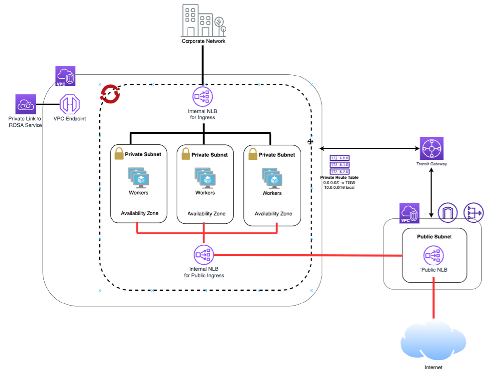

## Overview

Red Hat strongly recommends creating a private ROSA cluster with no inbound Internet connectivity, isolating both the cluster API and hosted applications from external access. This configuration is a key part of a multi-layered security strategy to protect clusters and workloads from external threats.

However, some applications may require Internet access to support external users or partners. Even with a private cluster, you can securely expose these applications through various methods. For example, a TCP-based application like Kafka may need connectivity to allow partners on the Internet to send or receive data. This document provides guidance on one specific method to securely expose a TCP-based application while maintaining the security of a private cluster.

This approach ensures that the application remains accessible as needed while keeping your cluster’s core components safely isolated.

This guide describes how to setup the following:
* a Private ROSA Cluster
* a 2nd ingress controller ( AWS Network Load Balancer ) used for application(s) you want to expose to the Internet
* a custom domain configured for the 2nd ingress controller
* a 2nd 'Public' VPC peered with the ROSA VPC
* a 'public' network load balancer in the 'public' VPC

> This is just one layer in securely exposing an application. Additional measures, such as a firewall, web application firewall (WAF), and other security controls, should also be considered to strengthen the overall security posture.



## Pre-requisites

1. You will need a A Private ROSA Cluster (see [Deploying ROSA HCP with Terraform](/experts/rosa/terraform/hcp/) if you need help creating one).  Make sure to select the private option in Terraform.

1. Set environment variables.  In the example we re-use the variables from the Terraform guide

    For reference only, this is the expected [output](./rosa-private-nlb-terraform-output.md) from the Terraform guide.

    ```bash
    export ROSA_CLUSTER_NAME=$TF_VAR_cluster_name
    export ROSA_VPC_ID=$(terraform output -raw vpc_id) 
    export ROSA_PRIVATE_R_TABLE_IDS=$(terraform output private_route_table_ids | sed -e '1d' -e '$d' | cut -d'"' -f2)
    export ROSA_PRIVATE_SUBNET_IDS=$(terraform output private_subnet_ids | sed -e '1d' -e '$d' | cut -d'"' -f2)
    export ROSA_PUBLIC_SUBNET_IDS=$(terraform output public_subnet_ids | sed -e '1d' -e '$d' | cut -d'"' -f2)
    export REGION=$(rosa describe cluster -c $ROSA_CLUSTER_NAME  -o json | jq -r .region.id)
    export ROSA_VPC_CIDR=$(aws ec2 describe-vpcs --vpc-ids $ROSA_VPC_ID | jq -r '.Vpcs[].CidrBlock')
    export JUMP_HOST_SUBNET=$(echo $ROSA_PUBLIC_SUBNET_IDS | head -n 1)
    ```

1. Set additional environment variables for a custom domain and additional ingress controller.

    > note: this tutorial will use AWS Route53, if you have a different DNS follow the same steps in creating DNS records in your DNS environment.

    ```bash
    export INGRESS_NAME=public-ingress #name of the new ingress controller
    export CERT_NAME="lab-domain-com-tls-cert" 
    export SCOPE="Internal" 
    export HOSTED_ZONE=ABCDEFGHEXAMPLE #(Optional - Route 53 Hosted Zone ID )
    export HOSTED_ZONE_REGION=us-east-2 #(Optional - Route 53 Hosted Zone Region )
    export DOMAIN=lab.domain.com   #Custom Domain for public apps 
    ```


## Create a public VPC or set your VPC Environment variables

If you already have a secondary public VPC you'd like to use, please set the following environment variables for that VPC.

```bash
export VPC_ID= #VPC ID
export PUBLIC_SUBNET= #Public Subnet ID
```
If you'd like a guided walkthrough to create the secondary public VPC, follow [these instructions](./rosa-private-nlb-vpc.md). This guide will also set all the required environment variables needed.


## (Optional) Launch an Jump Host EC2 instance in Public NLB VPC
This guide requires connectivity to the cluster, because we are using a private cluster you will need to ensure your workstation is connected to the AWS VPC which hosts the ROSA cluster.   If you already have this connectivity through a VPN, Direct Link or other method you can skip this part.  

If you do need to establish connectivity to the cluster [these instructions](./rosa-private-nlb-jumphost.md) will guide you through creating a jump host on the public subnet of the ROSA cluster.


## Create a second ingress controller for public applications
To limit the blast radius, a second private ingress controller will be set up within the cluster, connected to by an additional public network load balancer.

### (Optional) create certificates for your domain.

> Note: Make sure if update your DNS with a text record as prompted.  You can also use nslookup to make sure the record is set. 

```bash
    nslookup -q=TXT _acme-challenge.kevin.mobb.cloud
```

#### Create certficates

```bash
certbot certonly --manual \
  --preferred-challenges=dns \
  --email "kevcolli@redhat.com" \
  --server https://acme-v02.api.letsencrypt.org/directory \
  --agree-tos \
  --config-dir "./config" \
  --work-dir "./work" \
  --logs-dir "./logs" \
  -d "*.${DOMAIN}"
``` 

### Add Domain certificates to OpenShift
> Note: the following uses the certificate generation output from certbot.  If you already have certificates, substitute the key and certificate location.

> if using the jump host, you will need to copy the key and certificate to the jump host and run the oc command there

log into the Openshift cluster, if you need the ROSA API url you can find it with this command

```bash
rosa describe cluster -c kmc-private -o json | jq -r '.api.url'
```


```bash
oc create secret tls $CERT_NAME --key=config/live/${DOMAIN}/privkey.pem --cert=config/live/${DOMAIN}/fullchain.pem -n openshift-ingress
```
### Add Domain certificates to AWS ACM

When we create a listener for the public load balancer, we will add a certificate to the listener.  Adding a certificate to an AWS Network Load Balancer listener enables encrypted, authenticated connections, enhancing security and compliance by protecting data in transit.

```bash
    export CERT_ARN=$(aws acm import-certificate --certificate fileb://config/live/${DOMAIN}/cert.pem --private-key fileb://config/live/${DOMAIN}/privkey.pem --certificate-chain fileb://config/live/${DOMAIN}/fullchain.pem --region us-east-1 | jq -r '.CertificateArn' )
    echo $CERT_ARN 
```

### Create an additional IngressController

A fundamental aspect of this architecture is the creation of a second Ingress Controller to manage routing for applications exposed to the Internet. This Ingress Controller is configured as a private AWS Network Load Balancer. The decision to keep it private serves two primary purposes: first, it prevents direct access to the cluster and applications from the Internet; second, by directing traffic through a public ingress VPC initially, you can centralize Internet access control for your environment and implement your organizational security standards, including inspection, WAF, firewalls, and other security technologies.

> if using a jump box run this command there

```bash
envsubst  <<EOF | oc apply -f -
apiVersion: operator.openshift.io/v1
kind: IngressController
metadata:
  annotations:
    ingress.operator.openshift.io/auto-delete-load-balancer: "true"
  finalizers:
  - ingresscontroller.operator.openshift.io/finalizer-ingresscontroller
  generation: 2
  labels:
    hypershift.openshift.io/managed: "true"
  name: $INGRESS_NAME
  namespace: openshift-ingress-operator
spec:
  clientTLS:
    clientCA:
      name: ""
    clientCertificatePolicy: ""
  defaultCertificate:
    name: $CERT_NAME
  domain: $DOMAIN
  endpointPublishingStrategy:
    loadBalancer:
      dnsManagementPolicy: Unmanaged
      providerParameters:
        aws:
          networkLoadBalancer: {}
          type: NLB
        type: AWS
      scope: $SCOPE
    type: LoadBalancerService
  httpCompression: {}
  httpEmptyRequestsPolicy: Respond
  httpErrorCodePages:
    name: ""
  replicas: 2
  tuningOptions:
    reloadInterval: 0s
  unsupportedConfigOverrides: null
EOF
```

Get the newly created Network Load Balancer hostname and IP addresses

> if using a jump host of 'oc' command run this command there.  
```bash
NLB_HOSTNAME=$(oc get service -n openshift-ingress router-${INGRESS_NAME} -o jsonpath='{.status.loadBalancer.ingress[0].hostname}')
echo $NLB_HOSTNAME
```

Copy the output of the above command to a new environment variable on your workstation

Example:
```bash
export NLB_HOST_NAME=a0df2223a72244f78806ff46230e2dd6-516fc9d40188cfa3.elb.us-east-1.amazonaws.com
```

Wait a few minutes for the load balancer to be provisioned and run these commands.  If they don't return with IP addresses, just wait a while and run then again.

```bash
export NLB_IP_1=$(nslookup $NLB_HOSTNAME | grep Address | sed -n 2p | cut -d ' ' -f 2)

echo $NLB_IP_1

export NLB_IP_2=$(nslookup $NLB_HOSTNAME | grep Address | sed -n 3p | cut -d ' ' -f 2)

echo $NLB_IP_2
```

## Update DNS records

As described, this tutorial uses AWS Route53 to handle DNS records.  If you use a different DNS system use the following as a reference.


## Create and configure the public NLB

Start by creating a target group

```bash
export TARGET_GROUP_ARN=$(aws elbv2 create-target-group --name ${INGRESS_NAME}-tg \
--protocol TCP \
--port 443 \
--vpc-id $VPC_ID \
--target-type ip \
--health-check-protocol TCP \
--health-check-port "traffic-port" \
--health-check-enabled \
--health-check-interval-seconds 30 \
--health-check-timeout-seconds 10 \
--healthy-threshold-count 5 \
--unhealthy-threshold-count 2 | jq -r '.TargetGroups[0].TargetGroupArn')
echo $TARGET_GROUP_ARN
```

Register the targets for the AWS Network Load Balancer that was created when we added the second IngressController

```bash
aws elbv2 register-targets --target-group-arn $TARGET_GROUP_ARN --targets Id=$NLB_IP_1,Port=443,AvailabilityZone=all Id=$NLB_IP_2,Port=443,AvailabilityZone=all
```

Create a security group for the public load balancer
Create an additional Security Group for the jumphost

```bash
TAG_SG="nlb-${NLB_NAME}-sg"

aws ec2 create-security-group --group-name $TAG_SG --description $TAG_SG --vpc-id ${VPC_ID} --tag-specifications "ResourceType=security-group,Tags=[{Key=Name,Value=$TAG_SG}]"
```

Grab the Security Group Id generated in the previous step

```bash
NLB_SG_ID=$(aws ec2 describe-security-groups --filters "Name=tag:Name,Values=$TAG_SG" | jq -r '.SecurityGroups[0].GroupId')

echo $NLB_SG_ID
```

Create the public load balancer

```bash
export PUBLIC_NLB_ARN=$(aws elbv2 create-load-balancer --name ${INGRESS_NAME}-nlb \
--subnets $PUBLIC_SUBNET \
--security-groups ${NLB_SG_ID} \
--scheme internet-facing \
--type network \
--ip-address-type ipv4 | jq -r '.LoadBalancers[0].LoadBalancerArn')
echo $PUBLIC_NLB_ARN
```

Authorize TCP 443 access to the load balancer

```bash
aws ec2 authorize-security-group-ingress --group-id "${NLB_SG_ID}" --protocol tcp --port 443 --cidr 0.0.0.0/0
```

Create a listener for the load balancer using the target group we just created

```bash
export LISTENER_ARN=$(aws elbv2 create-listener \
    --load-balancer-arn ${PUBLIC_NLB_ARN} \
    --protocol TCP \
    --port 443 \
    --default-actions Type=forward,TargetGroupArn=$TARGET_GROUP_ARN | jq -r '.Listeners[0].ListenerArn')
echo $LISTENER_ARN
```

#Add certificates we imported into ACM to the listener

#```bash
aws elbv2 add-listener-certificates --listener-arn $LISTENER_ARN \
--certificates CertificateArn=$CERT_ARN
#```

Get the DNS Hostname of the public load balancer

```bash
PUBLIC_NLB_HOSTNAME=$(aws elbv2 describe-load-balancers --load-balancer-arns $PUBLIC_NLB_ARN | jq -r '.LoadBalancers[0].DNSName')
echo $PUBLIC_NLB_HOSTNAME
```

Get the NLB environment variables

```bash
export PUBLIC_NLB_HOSTED_ZONE=$(aws elbv2 describe-load-balancers --load-balancer-arns $PUBLIC_NLB_ARN | jq -r ".LoadBalancers[0].CanonicalHostedZoneId")

echo $PUBLIC_NLB_HOSTED_ZONE
```

Create an alias record json statement.

```bash
cat <<EOF > add_alias_record.json
{
    "Comment":"Adding an alias record for the NLB in Route 53",
    "Changes":[{
     "Action": "CREATE",
     "ResourceRecordSet":{
 	      "Name": "*.$DOMAIN",
 		    "Type":"A",
       "AliasTarget": {
         "HostedZoneId": "$PUBLIC_NLB_HOSTED_ZONE",
         "DNSName": "$PUBLIC_NLB_HOSTNAME",
        "EvaluateTargetHealth": false
 		    }
     }
  }
 ]
}
EOF
```

Update Route53 with the new record

```bash
aws route53 change-resource-record-sets --hosted-zone-id $HOSTED_ZONE --region $HOSTED_ZONE_REGION --change-batch file://add_alias_record.json
```

## Test an application.

1. Create a test applciation in a new namespace.

   ```bash
   oc new-project testapp
   oc new-app --docker-image=docker.io/openshift/hello-openshift -n testapp
   ```

2. Expose the test application Service.

   Let's create a Route to expose the application from outside the cluster, and annotate the Route to give it a new Certificate.

   ```bash
   oc create route edge --service=hello-openshift testroute --hostname hello.$DOMAIN -n testapp
   ```

3. Access the application Route.

   Open your browser to hello.$DOMAIN and you will see a secured web page that displays Hello OpenShift.

  


