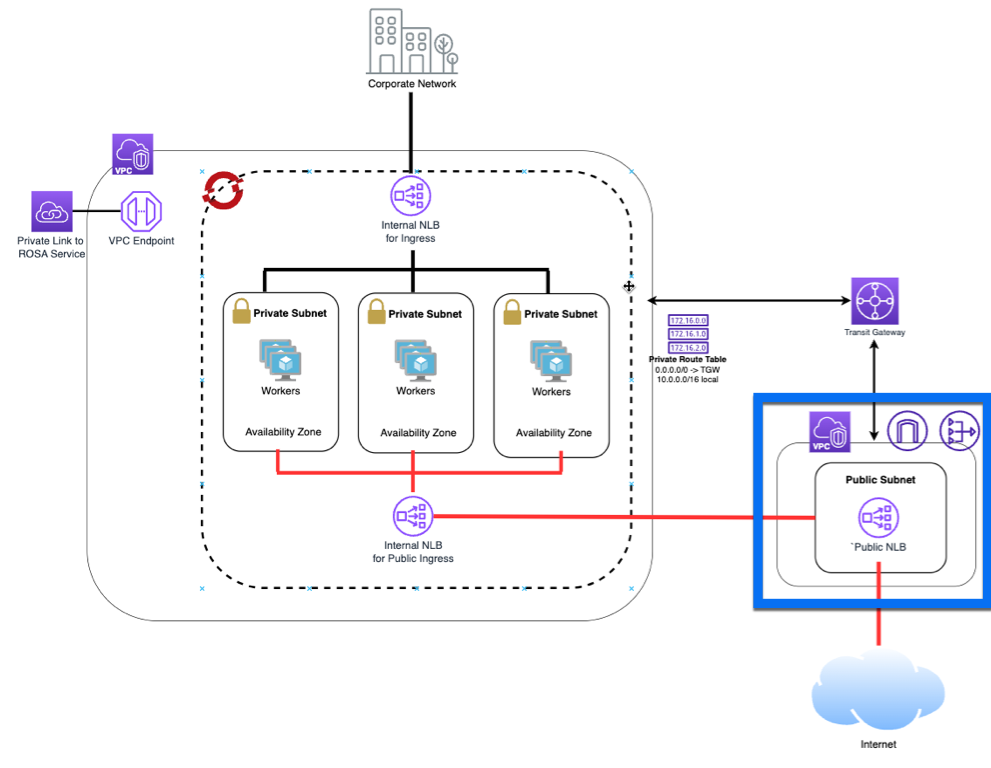

## Continuation of [Securely exposing an application on a private ROSA cluser with an AWS Network Load Balancer](/experts/rosa/hcp-private-nlb/)

These instructions go through setting up an additional VPC as part of the overall blog.  If you already have a VPC that you would like to use, you can skip these instructions.

Looking at the overall architecture, this section will setup everything in the blue box.


## Create a public VPC
The VPC we will be creating will have a VPC with a private subnet, a public subnet where the Network Load Balancer will sit, an Internet Gateway and a Nat Gateway.

### Set Environment Variables

```bash
export NLB_VPC_NAME=nlb-vpc
export NLB_VPC_CIDR=10.5.0.0/16
export NLB_VPC_PUBLIC_SUBNET_CIDR=10.5.128.0/17
export NLB_VPC_PRIVATE_SUBNET_CIDR=10.5.0.0/17
```

This section also expects the *ROSA_VPC_ID*, *ROSA_VPC_CIDR*, *ROSA_PRIVATE_R_TABLE_IDS*, and *ROSA_PRIVATE_SUBNET_IDS* environment variables to be set which is done in the parent blog.

### Create a VPC

```bash
export VPC_ID=`aws ec2 create-vpc --cidr-block $NLB_VPC_CIDR | jq -r .Vpc.VpcId`

aws ec2 create-tags --resources $VPC_ID \
  --tags Key=Name,Value=${NLB_VPC_NAME} | jq .

aws ec2 modify-vpc-attribute --vpc-id $VPC_ID --enable-dns-hostnames | jq .
```

Create a Public Subnet for the cluster to NAT egress traffic out of

```bash 
PUBLIC_SUBNET=`aws ec2 create-subnet --vpc-id $VPC_ID --cidr-block $NLB_VPC_PUBLIC_SUBNET_CIDR | jq -r .Subnet.SubnetId`

aws ec2 create-tags --resources $PUBLIC_SUBNET \
  --tags Key=Name,Value=${NLB_VPC_NAME}-public | jq .
```

Create a Private Subnet for a jump host

```bash
PRIVATE_SUBNET=`aws ec2 create-subnet --vpc-id $VPC_ID --cidr-block $NLB_VPC_PRIVATE_SUBNET_CIDR | jq -r .Subnet.SubnetId`

aws ec2 create-tags --resources $PRIVATE_SUBNET \
  --tags Key=Name,Value=${NLB_VPC_NAME}-private | jq .
```

Create an Internet Gateway for NAT egress traffic

```bash
I_GW=`aws ec2 create-internet-gateway | jq -r .InternetGateway.InternetGatewayId`
aws ec2 attach-internet-gateway --vpc-id $VPC_ID --internet-gateway-id $I_GW | jq .

aws ec2 create-tags --resources $I_GW \
  --tags Key=Name,Value=${NLB_VPC_NAME} | jq .
```

Create a Route Table for NAT egress traffic

```bash
R_TABLE=`aws ec2 create-route-table --vpc-id $VPC_ID | jq -r .RouteTable.RouteTableId`

aws ec2 create-route --route-table-id $R_TABLE --destination-cidr-block 0.0.0.0/0 --gateway-id $I_GW | jq .

aws ec2 describe-route-tables --route-table-id $R_TABLE | jq .

aws ec2 associate-route-table --subnet-id $PUBLIC_SUBNET --route-table-id $R_TABLE | jq .

aws ec2 create-tags --resources $R_TABLE \
  --tags Key=Name,Value=${NLB_VPC_NAME} | jq .
```

Create a NAT Gateway for the Private network

```bash
EIP=`aws ec2 allocate-address --domain vpc | jq -r .AllocationId`

NAT_GW=`aws ec2 create-nat-gateway --subnet-id $PUBLIC_SUBNET \
  --allocation-id $EIP | jq -r .NatGateway.NatGatewayId`

aws ec2 create-tags --resources $EIP --resources $NAT_GW \
  --tags Key=Name,Value=${NLB_VPC_NAME} | jq .
```

Create a Route Table for the Private subnet to the NAT

```bash
R_TABLE_NAT=`aws ec2 create-route-table --vpc-id $VPC_ID | jq -r .RouteTable.RouteTableId`

aws ec2 create-route --route-table-id $R_TABLE_NAT --destination-cidr-block 0.0.0.0/0 --gateway-id $NAT_GW | jq .

aws ec2 associate-route-table --subnet-id $PRIVATE_SUBNET --route-table-id $R_TABLE_NAT | jq .

aws ec2 create-tags --resources $R_TABLE_NAT $EIP \
  --tags Key=Name,Value=${NLB_VPC_NAME}-private | jq .
```


### Peer the ROSA VPC with the NLB VPC

> note: this tutotial will use a classic peering connection, a transit gateway can also be used.

```bash
PEER_VPC_ID=$(aws ec2 create-vpc-peering-connection --vpc-id $VPC_ID --peer-vpc-id $ROSA_VPC_ID --query VpcPeeringConnection.VpcPeeringConnectionId --output text)

aws ec2 accept-vpc-peering-connection --vpc-peering-connection-id $PEER_VPC_ID

aws ec2 create-tags --resources $PEER_VPC_ID --tags 'Key=Name,Value=peer-VPC'
```

#### Adding the private VPC CIDR block to our public VPC route table as destination

```bash
aws ec2 create-route --route-table-id $R_TABLE --destination-cidr-block ${ROSA_VPC_CIDR} --vpc-peering-connection-id $PEER_VPC_ID
aws ec2 associate-route-table --route-table-id ${R_TABLE} --subnet-id ${PRIVATE_SUBNET};


for i in 1 2 3; do
SUBNET=$(echo ${ROSA_PRIVATE_SUBNET_IDS} | sed -n ${i}p);
ROUTE_TABLE=$(echo ${ROSA_PRIVATE_R_TABLE_IDS} | sed -n ${i}p);
aws ec2 create-route --route-table-id ${ROUTE_TABLE} --destination-cidr-block ${NLB_VPC_CIDR} --vpc-peering-connection-id $PEER_VPC_ID;
aws ec2 associate-route-table --route-table-id ${ROUTE_TABLE} --subnet-id ${SUBNET};
done

```
