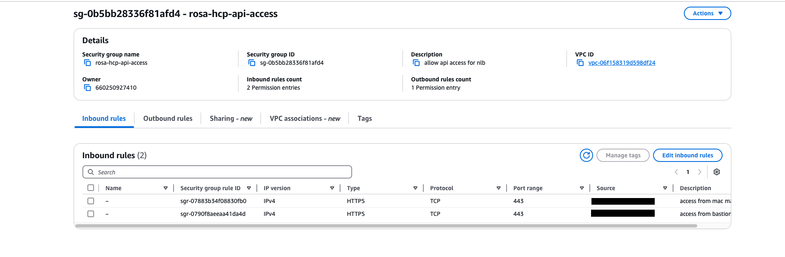
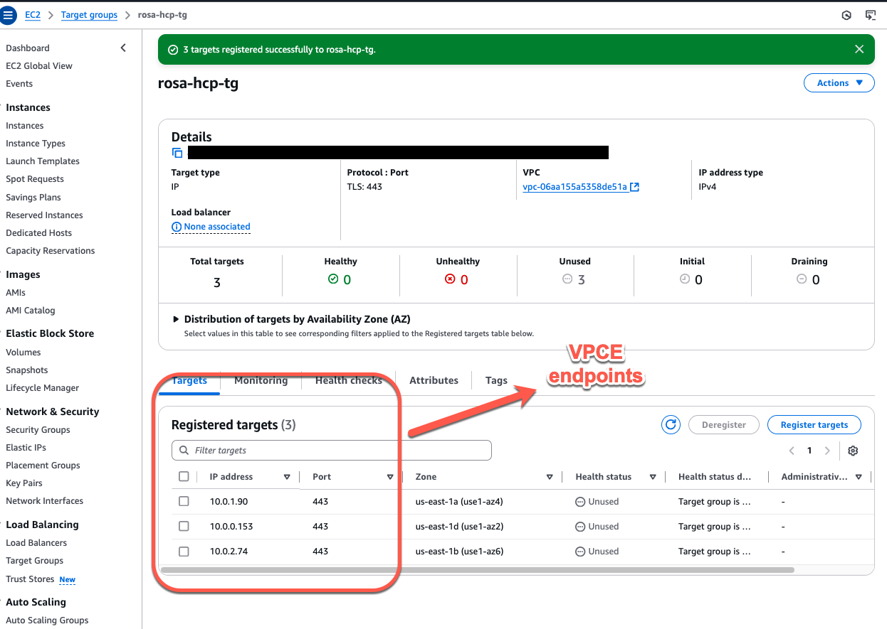
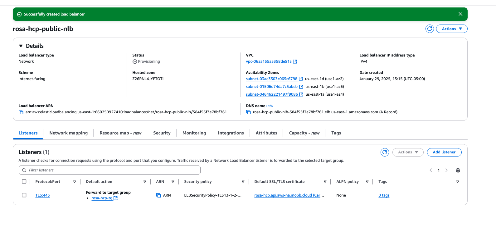

## Overview

This document provides guidance on using a public AWS Network Load Balancer (NLB) to connect to a private ROSA (Red Hat OpenShift on AWS) Hosted Control Plane(HCP) cluster.  When the cluster itself is private and does not have direct public IP access, the NLB allows secure, reliable routing of traffic from public sources to the private cluster by exposing a stable endpoint while maintaining network isolation. It helps ensure that the private cluster can still handle external traffic, such as from APIs or services, without exposing sensitive internal infrastructure directly to the internet.

## Pre-requisites

1. You will need a A Private ROSA HCP Cluster (see [Deploying ROSA HCP documentation](https://docs.aws.amazon.com/rosa/latest/userguide/getting-started-hcp.html)).  

2. In this example we will use Entra ID as external authentication for ROSA HCP cluster (see [Configuring Microsoft Entra ID as an external authentication provider](https://cloud.redhat.com/experts/rosa/entra-external-auth))


3. (Optional) Launch an Jump Host EC2 instance in Public NLB VPC
This guide requires connectivity to the cluster, because we are using a private cluster you will need to ensure your workstation is connected to the AWS VPC which hosts the ROSA cluster.   If you already have this connectivity through a VPN, Direct Link or other method you can skip this part. If you do need to establish connectivity to the cluster [these instructions](https://cloud.redhat.com/experts/rosa/hcp-private-nlb/rosa-private-nlb-jumphost/) will guide you through creating a jump host and connectto the ROSA HCP cluster.

## Create security group, target group and network load balancer in AWS subscription

Once ROSA HCP cluster is installed with external authentication as Entra ID we need to set additional security group to grant access outside the VPC, create target group and NLB.

#### AWS security groups for NLB

##### Create a Security Group:
 - Navigate to the **Security Groups** section in the AWS console  click **Create security group**.
 - **Name tag**: Give your security group a name. Select the VPC that your Network Load Balancer is in.**Click Create**.
 - **Modify Inbound Rules** Select the newly created security group from the list. Go to the **Inbound rules** tab and click **Edit inbound rules**. Add a new inbound rule with the following settings:
- **Type**: Choose the appropriate protocol for your NLB (e.g., HTTP, HTTPS, or TCP, depending on the service you're exposing).
- **Protocol**: Choose the protocol for your NLB (TCP is commonly used for NLBs).
- **Port Range**: Specify the port your NLB is listening on (e.g., 80 for HTTP, 443 for HTTPS).
- **Source**: 
  - Choose **My IP** to allow access from your current IP address.
  - Alternatively, specify a custom IP range in CIDR format (e.g., `192.x.x.x/24` for a specific subnet).

example output of AWS console :



#### Create target group with VPC Endpoints as targets

Define the target group with list of VPC endpoints IP that an NLB can reach to based on configured rules and health checks; allowing for load balancing across multiple instances within a group.

Here’s a step-by-step guide for creating a target group in AWS for your network load balancer:

##### 1. **Create a Target Group**:
   - Navigate to the **Target Groups** section in the AWS console and click **Create target group**.
   - **Target type**: Select **IP addresses** if you're using IP-based routing (common for VPCEs or EC2 instances in private subnets).
   - **Protocol**: Choose **TLS** if you're securing communication.
   - **Port**: Set the **Port** to **443**, which is the standard port for secure HTTPS/TLS traffic.
   - **VPC**: Choose the **VPC** where your targets for ROSA HCP VPCEs are located.

##### 2. **Configure Health Checks**:
   - **Health check protocol**: Set to **TCP** to check if the backend targets are healthy and accepting connections.
   - **Health check port**: Set to **443**, matching the port your targets will use for traffic.
   - **Health check path**: Leave this field empty or set it to a specific path (e.g., `/health`) if you want to perform HTTP/HTTPS health checks.
   - Optionally adjust other health check settings (e.g., threshold, interval) based on your needs.

##### 3. **Add Targets**:
   - **IP addresses**: Enter the **IP addresses** of the targets that should be included in this target group. You might enter the IPs of VPCEs that you want the load balancer to route traffic to private HCP cluster.
   - Click **Include in pending below** to add these targets to the group.

##### 4. **Create the Target Group**:
   - After verifying all your settings, click **Create target group** to finish setting up your target group.

Once created, you can associate this target group with your NLB listener to route traffic to ROSA HCP cluster.

example output of AWS console :



#### Create and configure the public NLB

Here’s a step-by-step guide for creating a Network Load Balancer (NLB) and configuring it with your domain:

##### 1. **Create the NLB:**
   - **Scheme**: Choose **Internet-facing**. This allows your NLB to be accessible from the internet.
   - **VPC**: Select the **VPC**. This can be 
   - **Security Groups**: Select a **security group** that permits access to your API from your IP address. This should be set up to allow inbound traffic on the port you’ll be using (usually port 443 for secure communication).

##### 2. **Configure Listeners and Routing:**
   - **Protocol**: Set the **Protocol** to **TLS**, as you are securing communication.
   - **Port**: Set the **Port** to **443**, the standard port for HTTPS traffic.
   - **Target Group**: Choose the **target group** you created previously. This will route the incoming traffic to the appropriate targets.

##### 3. **Secure Listener Settings** (Optional but recommended for HTTPS):
   - **Certificate (from ACM)**: 
     - Select or **create a new certificate** using AWS ACM (AWS Certificate Manager).
     - This certificate should be for the **domain name** you plan to use for your externally facing API. For example, if your API will be accessible at `api.example.com`, ensure the certificate matches that domain.

   - Leave other settings at their **default values** unless specific changes are needed.

##### 4. **Create the Load Balancer**: 
   - After all the settings are configured, click **Create load balancer** to finalize the setup of your Network Load Balancer.

##### 5. **Update Route 53**:
   - **Create a Record**: In **Amazon Route 53**, create a new DNS **record** pointing to the NLB's **DNS name**.
     - The record should match the  **domain name** for which the ACM certificate was issued (e.g., `api.example.com`).
     - Use the **Alias** record type to point to the NLB. AWS provides the DNS name of your NLB, which you can directly map to the record.

This setup will ensure that traffic is routed securely from the internet to your API, leveraging the NLB to distribute traffic to your backend resources.

example output of AWS console :



#### Validate connection to NLB

Validate that you can access the NLB from your machine using **nlb domain name**. For example `nlb-domain-name=https://api.example.com`


```bash
curl https://api.example.com/version
```

example output:

```bash
[ec2-user@ipaddress ~]$ curl -v https://api.example.com/version
{
  "major": "1",
  "minor": "28",
  "gitVersion": "v1.28.15+ff493be",
  "gitCommit": "4cf5291f1e18d974b97cae658aa9b2654bd9ea29",
  "gitTreeState": "clean",
  "buildDate": "2024-11-23T03:11:13Z",
  "goVersion": "go1.20.12 X:strictfipsruntime",
  "compiler": "gc",
  "platform": "linux/amd64"
}
```

#### Validate connection to ROSA HCP cluster's API

```bash
export nlb-domain-name=https://api.example.com
```

create a KUBECONFIG file here with EntraID details for [ROSA HCP cluster with external auth enabled](https://cloud.redhat.com/experts/rosa/entra-external-auth).

example create **rosa-auth.kubeconfig** file with following information

```bash
apiVersion: v1
clusters:
- cluster:
    server: ${nlb-domain-name}:443
  name: cluster
contexts:
- context:
    cluster: cluster
    namespace: default
    user: oidc
  name: admin
current-context: admin
kind: Config
preferences: {}
users:
- name: oidc
  user:
    exec:
      apiVersion: client.authentication.k8s.io/v1
      args:
      - oidc-login
      - get-token
      - --oidc-issuer-url=https://login.microsoftonline.com/${TENANT_ID}/v2.0
      - --oidc-client-id=${CLIENT_ID}
      - --oidc-client-secret=${CLIENT_SECRET}
      - --oidc-extra-scope=email
      - --oidc-extra-scope=openid
      command: kubectl
      env: null
      interactiveMode: Never
```

Set the `KUBECONFIG` environment variable to the location of the `rosa-cluster.kubeconfig` file. This will configure the OpenShift CLI to authenticate against the ROSA cluster with the OIDC client.


```bash
export KUBECONFIG=$(pwd)/rosa-auth.kubeconfig
```

Confirm your access to the cluster by running the following command:

```bash
oc get nodes
```
example output:

```bash
NAME                         STATUS   ROLES    AGE     VERSION
ip-10-0-0-170.ec2.internal   Ready    worker   3h29m   v1.30.7
ip-10-0-1-171.ec2.internal   Ready    worker   3h30m   v1.30.7
ip-10-0-2-161.ec2.internal   Ready    worker   3h29m   v1.30.7
```
To verify you are logged in as user of the group, run the following command:

```bash
oc auth whoami
```
example output:
```bash
ATTRIBUTE   VALUE
Username    XXXXXXX@redhat.com
Groups      [0000000000000000 system:authenticated]
```
