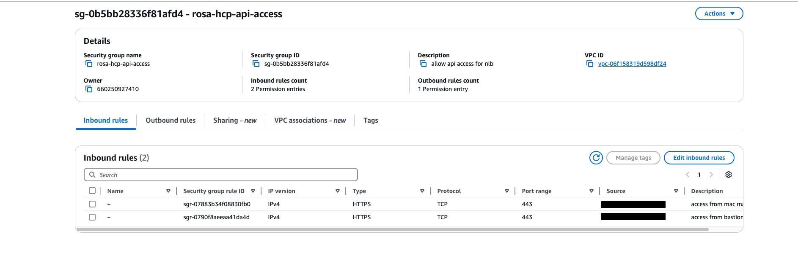
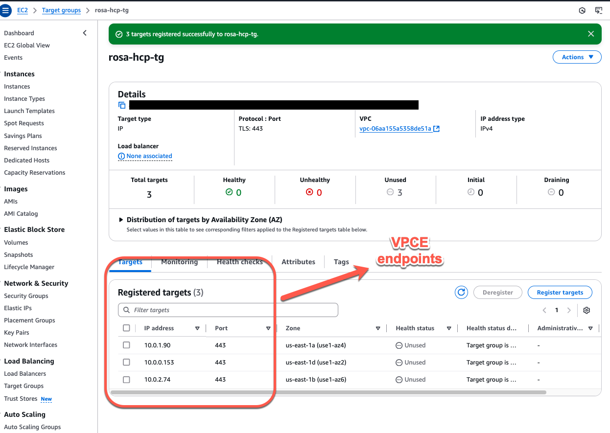
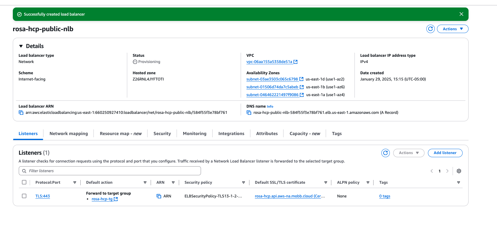

## Overview

This guide describes how to use an **internet-facing** AWS Network Load Balancer (NLB) to reach the **Kubernetes API** of a **private** Red Hat OpenShift Service on AWS (ROSA) Hosted Control Plane (HCP) cluster. The NLB terminates TLS on a custom domain and forwards traffic to the private IP addresses of the cluster API VPC endpoint network interfaces.

This pattern is different from [Securely exposing an application on a private ROSA cluster with a Network Load Balancer](/experts/rosa/hcp-private-nlb/), which adds a second ingress controller for **application** traffic in a peered public VPC. This guide targets **cluster API** access only.

The end-to-end traffic flow is:

```bash
Client (Internet)
  → DNS (api.example.com)
  → Internet-facing NLB (TLS:443, ACM certificate for api.example.com)
  → Target group (IP addresses, TLS:443)
  → Private IPs of ROSA HCP VPC endpoint ENIs
  → Cluster Kubernetes API
```

{}
Publishing the cluster API on an internet-facing load balancer increases exposure and is not the default ROSA HCP design. Restrict source IPs on the NLB security group, use TLS with a valid certificate, monitor access, and prefer private connectivity (VPN, Direct Connect, or AWS Client VPN) when possible. See [Configuring ROSA with HCP Private Cluster API Access](/experts/rosa/hcp-private-api-access/) for PrivateLink security group patterns.
{}

## Pre-requisites

1. A private ROSA HCP cluster (4.20+) with external authentication enabled (see the [Deploying ROSA HCP documentation](https://docs.aws.amazon.com/rosa/latest/userguide/getting-started-hcp.html) and [Configuring Microsoft Entra ID as an external authentication provider](/experts/rosa/entra-external-auth/)).

1. [AWS CLI](https://docs.aws.amazon.com/cli/latest/userguide/install-cliv2.html), [OpenShift CLI (`oc`)](https://mirror.openshift.com/pub/openshift-v4/clients/ocp/), [jq](https://stedolan.github.io/jq/download/), and the [`oidc-login`](https://github.com/int128/kubelogin) plugin for `oc`.

1. Microsoft Entra ID application credentials used in the Entra ID guide (`TENANT_ID`, `CLIENT_ID`, `CLIENT_SECRET`).

1. (Optional) A jump host or other VPC connectivity if you need to reach private resources while building the environment. See [Launch a jump host](/experts/rosa/hcp-private-nlb/rosa-private-nlb-jumphost/) if required.

1. A public domain you control (for example `example.com`) with a Route 53 public hosted zone in the same AWS account.

## Identify the cluster API VPC endpoint

Before creating the target group, collect the VPC endpoint ID, VPC ID, endpoint security group, and the **private IP addresses** that the NLB target group must use.

1. Set your cluster name:

   ```bash
   export CLUSTER_NAME=<cluster_name>
   ```

1. Resolve the cluster API VPC endpoint and VPC:

   ```bash
   read -r VPCE_ID VPC_ID <<< $(aws ec2 describe-vpc-endpoints \
     --filters "Name=tag:api.openshift.com/id,Values=$(rosa describe cluster -c ${CLUSTER_NAME} -o yaml | grep '^id: ' | cut -d' ' -f2)" \
     --query 'VpcEndpoints[].[VpcEndpointId,VpcId]' --output text)
   echo "VPCE_ID=${VPCE_ID} VPC_ID=${VPC_ID}"
   ```

1. List the VPC endpoint network interface IP addresses for the target group:

   ```bash
   VPCE_IPS=$(aws ec2 describe-network-interfaces \
     --filters "Name=vpc-endpoint-id,Values=${VPCE_ID}" \
     --query 'NetworkInterfaces[].PrivateIpAddress' \
     --output text)
   echo "Register these IPs in the target group: ${VPCE_IPS}"
   ```

1. Note the security group currently attached to the VPC endpoint:

   ```bash
   VPCE_SG_ID=$(aws ec2 describe-vpc-endpoints \
     --vpc-endpoint-ids ${VPCE_ID} \
     --query 'VpcEndpoints[0].Groups[0].GroupId' \
     --output text)
   echo "VPCE_SG_ID=${VPCE_SG_ID}"
   ```

Keep `VPCE_IPS` available for the target group step below.

## Create a security group, target group, and network load balancer

Once the ROSA HCP cluster is installed with external authentication using Entra ID, create an NLB security group, allow the NLB to reach the API VPC endpoint, create the target group, and create the NLB.

### Create a security group for the NLB

Navigate to the **Security Groups** section in the AWS console and click **Create security group**.

- **Name tag**: Choose a descriptive name (for example `rosa-hcp-api-nlb-sg`).
- **VPC**: Select the VPC where the NLB and VPC endpoint targets are located (`${VPC_ID}`).
- **Inbound rules**: Add a rule for **TCP** port **443** from trusted sources only (for example **My IP** or a specific CIDR). Avoid `0.0.0.0/0` unless your security review requires it.
- Click **Create security group** and note the security group ID as `NLB_SG_ID`.

Example output from the AWS console:



Or create the NLB security group with the AWS CLI:

```bash
export NLB_SG_ID=$(aws ec2 create-security-group \
  --description "Internet-facing NLB for ${CLUSTER_NAME} API" \
  --group-name "${CLUSTER_NAME}-api-nlb-sg" \
  --vpc-id ${VPC_ID} \
  --output text)
aws ec2 authorize-security-group-ingress \
  --group-id ${NLB_SG_ID} \
  --protocol tcp \
  --port 443 \
  --cidr <your-trusted-cidr>
```

### Allow the NLB to reach the API VPC endpoint

The API VPC endpoint security group must allow inbound **TCP 443** from the NLB security group. If you created a dedicated security group for broader API access, you can attach it to the VPC endpoint as described in [Configuring ROSA with HCP Private Cluster API Access](/experts/rosa/hcp-private-api-access/).

```bash
aws ec2 authorize-security-group-ingress \
  --group-id ${VPCE_SG_ID} \
  --protocol tcp \
  --port 443 \
  --source-group ${NLB_SG_ID}
```

If ingress from the NLB security group is already allowed, AWS returns an error you can ignore.

### Create a target group with VPC endpoint IPs as targets

Define the target group with the private IP addresses of the API VPC endpoint ENIs (`${VPCE_IPS}`).

1. Create a target group:
   - Navigate to the **Target Groups** section in the AWS console and click **Create target group**.
   - **Target type**: Select **IP addresses**.
   - **Protocol**: Choose **TLS**.
   - **Port**: Set the **Port** to **443**.
   - **VPC**: Choose the **VPC** where the ROSA HCP API VPC endpoint is located (`${VPC_ID}`).

1. Configure health checks:
   - **Health check protocol**: **TCP**
   - **Health check port**: **443**
   - **Health check path**: Leave empty for TCP health checks.

1. Add targets:
   - **IP addresses**: Enter each address from `${VPCE_IPS}` (one per Availability Zone ENI).
   - Click **Include as pending below** for each address.

1. Click **Create target group**.

Example output from the AWS console:



### Create and configure the public NLB

1. Create the NLB:
   - **Scheme**: Choose **Internet-facing**.
   - **VPC**: Select the **VPC** where your ROSA HCP cluster and VPC endpoint targets are located (`${VPC_ID}`).
   - **Subnets**: Select **public subnets** in at least two Availability Zones.
   - **Security groups**: Select **${NLB_SG_ID}** (or the NLB security group you created in the console).

1. Configure listeners and routing:
   - **Protocol**: **TLS**
   - **Port**: **443**
   - **Target group**: Choose the target group you created earlier.

1. Secure listener settings:
   - **Certificate (from AWS Certificate Manager (ACM))**: Select or create a certificate for your API domain (for example `api.example.com`).

1. Click **Create load balancer**.

1. Update Route 53:
   - Create an **Alias** record for your API domain (for example `api.example.com`) that points to the NLB DNS name.

Example output from the AWS console:



## Validate the connection to the NLB

Validate that you can access the NLB from your machine using the API domain name:

```bash
export API_URL=https://api.example.com
curl "${API_URL}/version"
```

Example output (values vary by cluster version):

```text
{
  "major": "1",
  "minor": "30",
  "gitVersion": "v1.30.7",
  "gitCommit": "...",
  "gitTreeState": "clean",
  "buildDate": "...",
  "goVersion": "...",
  "compiler": "gc",
  "platform": "linux/amd64"
}
```

## Validate connection to the ROSA HCP cluster API

If you have not already done so, set `API_URL` to the NLB endpoint (for example `https://api.example.com`).

Create a kubeconfig file with Entra ID details for a [ROSA HCP cluster with external auth enabled](/experts/rosa/entra-external-auth/). For example, create **rosa-auth.kubeconfig** with the following information:

```bash
kube_config="
apiVersion: v1
clusters:
- cluster:
    server: ${API_URL}
  name: cluster
contexts:
- context:
    cluster: cluster
    namespace: default
    user: oidc
  name: admin
current-context: admin
kind: Config
preferences: {}
users:
- name: oidc
  user:
    exec:
      apiVersion: client.authentication.k8s.io/v1
      args:
      - oidc-login
      - get-token
      - --oidc-issuer-url=https://login.microsoftonline.com/${TENANT_ID}/v2.0
      - --oidc-client-id=${CLIENT_ID}
      - --oidc-client-secret=${CLIENT_SECRET}
      - --oidc-extra-scope=email
      - --oidc-extra-scope=openid
      command: oc
      env: null
      interactiveMode: Never
"
echo "${kube_config}" > rosa-auth.kubeconfig
```

Set the `KUBECONFIG` environment variable to the location of the `rosa-auth.kubeconfig` file:

```bash
export KUBECONFIG=$(pwd)/rosa-auth.kubeconfig
```

Confirm your access to the cluster:

```bash
oc get nodes
```

Example output:

```text
NAME                         STATUS   ROLES    AGE     VERSION
ip-10-0-0-170.ec2.internal   Ready    worker   3h29m   v1.30.7
ip-10-0-1-171.ec2.internal   Ready    worker   3h30m   v1.30.7
ip-10-0-2-161.ec2.internal   Ready    worker   3h29m   v1.30.7
```

To verify you are logged in as an Entra ID user, run:

```bash
oc auth whoami
```

Example output:

```text
ATTRIBUTE   VALUE
Username    XXXXXXX@redhat.com
Groups      [0000000000000000 system:authenticated]
```

## Related guides

- [Securely exposing an application on a private ROSA cluster with a Network Load Balancer](/experts/rosa/hcp-private-nlb/) (application ingress pattern)
- [Configuring ROSA with HCP Private Cluster API Access](/experts/rosa/hcp-private-api-access/) (VPC endpoint security groups)
- [Configuring Microsoft Entra ID as an external authentication provider](/experts/rosa/entra-external-auth/)
