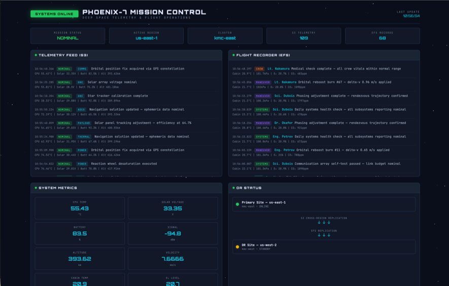
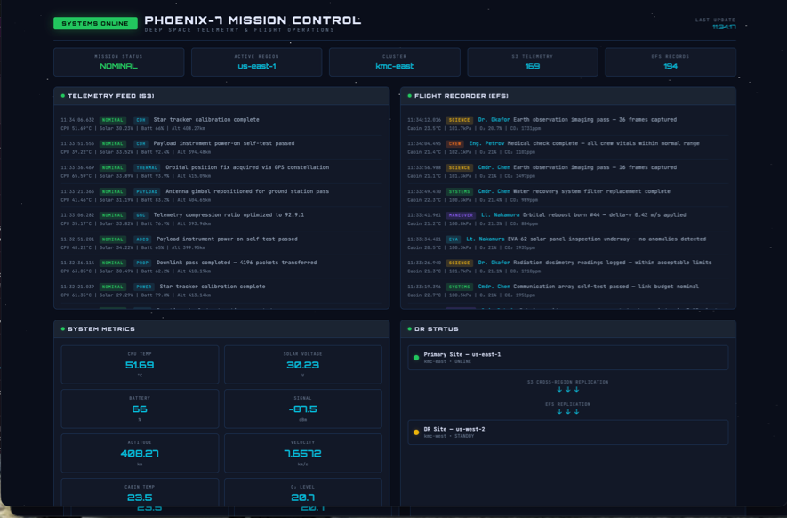
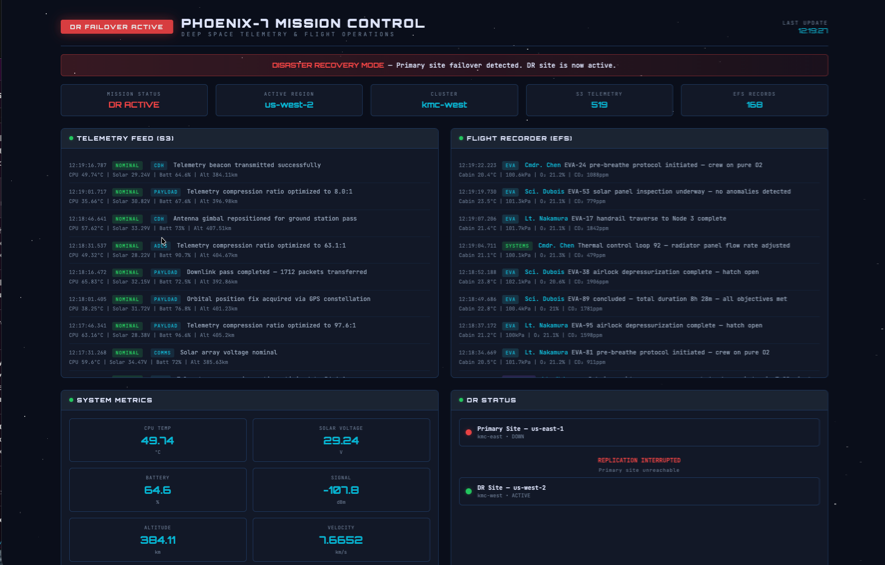

This guide shows a disaster recovery pattern for applications running on two existing ROSA HCP clusters. It uses OADP to back up and restore Kubernetes resources, S3 Cross-Region Replication for object data, and EFS replication for persistent file data.

Our validated workflow supports two key disaster recovery (DR) scenarios, giving you the flexibility to balance readiness and cost:

* **Hot-to-Warm Recovery:** Both the primary and DR clusters run simultaneously. However, to keep things lightweight, the applications aren't actually deployed on the DR cluster until a failover is triggered.
* **Hot-to-Cold Recovery:** Designed to maximize cost savings, this approach scales the DR cluster down to zero active worker nodes when not in use.

This article keeps the recovery decisions visible. Helper scripts are used only for repetitive setup tasks such as IAM, OADP installation, and recording EFS PVC mappings.

## Prerequisites

Before starting this guide, complete the [Create ROSA HCP Disaster Recovery Infrastructure](/experts/rosa/rosa-dr-infra/) guide. That guide sets up:

- EFS CSI Driver on both clusters
- S3 Cross-Region Replication for application data and backup buckets
- EFS replication from the primary to the DR Region

You need the environment variables from that guide still set in your shell. If you are starting a new shell session, re-run the environment variable steps from the [DR infrastructure guide](/experts/rosa/rosa-dr-infra/).

The helper scripts are in the [rosa-dr-scripts](https://github.com/rh-mobb/rosa-dr-scripts) repository. If you followed the [DR infrastructure guide](/experts/rosa/rosa-dr-infra/), you already have it cloned. Run the commands from the `rosa-dr-scripts` directory:

```bash
cd rosa-dr-scripts
```

## Architecture

The OADP DR pattern adds to the shared DR infrastructure:

- OADP installed on both clusters
- An example workload that writes object data to S3 and file data to EFS

During recovery, OADP restores the Kubernetes objects. EFS file data is not restored dynamically by OADP. Instead, the DR cluster reconstructs one EFS access point for each recorded PVC path, then uses static PersistentVolumes with `volumeHandle: <dr-efs-id>::<dr-access-point-id>`. This preserves the original replicated EFS paths and the access point POSIX identity needed for writes.

## 1. Configure OADP

Install the OADP operator on both clusters using IRSA, then create the DataProtectionApplication on each.

### Install the OADP Operator

**Log in to the primary cluster**, then install OADP:

```bash
eval "$(./scripts/configure-oadp.sh \
  --cluster "$PRIMARY_CLUSTER_NAME")"
```

**Log in to the DR cluster**, then install OADP:

```bash
eval "$(./scripts/configure-oadp.sh \
  --cluster "$DR_CLUSTER_NAME")"
```

The script creates the IAM policy, IAM role with OIDC trust, the `cloud-credentials` secret, and installs the OADP operator subscription. It does not create the DataProtectionApplication.

### Create the DataProtectionApplication

The DataProtectionApplication (DPA) tells OADP where to store backups. Each cluster gets its own DPA pointing to its regional OADP bucket. The `cloud-credentials` secret created by the install script provides the IAM role that Velero uses to read and write backup data in S3.

**Log in to the primary cluster**, then create the DPA:

```bash
cat <<EOF | oc apply -f -
apiVersion: oadp.openshift.io/v1alpha1
kind: DataProtectionApplication
metadata:
  name: dr-demo-dpa
  namespace: openshift-adp
spec:
  configuration:
    velero:
      defaultPlugins:
        - aws
        - openshift
        - csi
    nodeAgent:
      enable: false
      uploaderType: kopia
  backupLocations:
    - velero:
        provider: aws
        default: true
        objectStorage:
          bucket: ${OADP_BUCKET_PRIMARY}
          prefix: velero
        config:
          region: ${PRIMARY_REGION}
        credential:
          name: cloud-credentials
          key: cloud
EOF
```

**Log in to the DR cluster**, then create the DPA:

```bash
cat <<EOF | oc apply -f -
apiVersion: oadp.openshift.io/v1alpha1
kind: DataProtectionApplication
metadata:
  name: dr-demo-dpa
  namespace: openshift-adp
spec:
  configuration:
    velero:
      defaultPlugins:
        - aws
        - openshift
        - csi
    nodeAgent:
      enable: false
      uploaderType: kopia
  backupLocations:
    - velero:
        provider: aws
        default: true
        objectStorage:
          bucket: ${OADP_BUCKET_DR}
          prefix: velero
        config:
          region: ${DR_REGION}
        credential:
          name: cloud-credentials
          key: cloud
EOF
```

Verify the BackupStorageLocation on each cluster:

```bash
oc get backupstoragelocation -n openshift-adp
```

The phase must be `Available`.

## 2. Deploy the Example Workload

[Phoenix Mission Control](https://github.com/rh-mobb/phoenix-mission-control) is a space-themed demo application that exercises the recovery cases this guide cares about:

- S3 object writes
- Shared EFS file data
- StatefulSet replicas with ordinal PVCs
- A web dashboard accessible via an OpenShift route

Deploy the workload on the primary cluster:

**Log in to the primary cluster**, then deploy:

```bash
./scripts/deploy-phoenix.sh
```

The script clones the Helm chart, installs the application with your cluster's S3, EFS, and IRSA values, and waits for all workloads to be ready.

For your own application, use an equivalent workload that has both S3 and EFS data and at least one StatefulSet.

Verify the workload:

```bash
oc get pods,pvc,sts -n dr-demo
```

Get the application route and confirm it is accessible:

```bash
export PRIMARY_APP_ROUTE=$(oc get route mission-control -n dr-demo \
  -o jsonpath='{.spec.host}')

echo "PRIMARY_APP_ROUTE: https://$PRIMARY_APP_ROUTE"
```

Open the URL in a browser and confirm the Mission Control dashboard loads. Verify that telemetry data is being recorded and the S3 connection is healthy before proceeding.

Create visible test data:

```bash
export VALIDATION_ID=dr-$(date +%Y%m%d%H%M%S)

oc exec -n dr-demo sts/flight-recorder -- \
  sh -c "echo efs-$VALIDATION_ID > /data/flight-recorder/validation-$VALIDATION_ID.txt"

printf '%s\n' "s3-$VALIDATION_ID" | aws s3 cp - \
  "s3://$APP_BUCKET_PRIMARY/validation/$VALIDATION_ID.txt" \
  --region "$PRIMARY_REGION"

echo "VALIDATION_ID=$VALIDATION_ID"
```

## 3. Record EFS PVC Mappings Before Failure

OADP backs up Kubernetes resources but does not restore EFS-backed PersistentVolumes dynamically. During recovery, the DR cluster needs to recreate static PVs that point to the correct replicated EFS paths and access point identities. This step captures that metadata from the primary cluster. Run it before a disaster — the primary cluster API may not be available when you need it.

**Log in to the primary cluster**, then record the mapping:

```bash
./scripts/record-efs-mapping.sh \
  --cluster "$PRIMARY_CLUSTER_NAME" \
  --namespace dr-demo \
  --output efs-pvc-map.csv

cat efs-pvc-map.csv
```

The mapping file records:

- PVC name
- PV name
- Source EFS access point ID
- EFS root path
- Access point POSIX UID and GID
- Root directory owner UID, owner GID, and permissions
- StatefulSet ordinal, if the PVC name ends in an ordinal
- Requested storage
- Access modes

Example:

```csv
namespace,pvc,pv,source_access_point_id,efs_path,posix_uid,posix_gid,root_owner_uid,root_owner_gid,root_permissions,statefulset_ordinal,requested_storage,access_modes
dr-demo,shared-flight-data,pvc-d7b69237,fsap-abc123,/dynamic_provisioning/pvc-d7b69237,1000,1000,1000,1000,755,,5Gi,ReadWriteMany
dr-demo,flight-data-flight-recorder-0,pvc-483625aa,fsap-def456,/dynamic_provisioning/pvc-483625aa,1001,1001,1001,1001,755,0,5Gi,ReadWriteMany
dr-demo,flight-data-flight-recorder-1,pvc-16a379dd,fsap-ghi789,/dynamic_provisioning/pvc-16a379dd,1002,1002,1002,1002,755,1,5Gi,ReadWriteMany
```

This mapping is critical for EFS recovery.

When the EFS CSI driver dynamically provisions a restored PVC, it creates a new access point with a new root path. The replicated data remains under the original primary root path. If the DR restore creates new dynamic access points, the application can mount empty directories even though the data exists on the DR EFS file system.

The DR static PV must also use an access point, not only a direct file-system path mount. A direct path mount such as `${DR_EFS}:${EFS_PATH}` can read replicated files, but it bypasses the original access point POSIX identity and can fail on new writes with `Permission denied`. The mapping therefore records enough source access point metadata to recreate a DR-side access point for each original PVC path.

StatefulSets require extra attention. A StatefulSet volume claim template creates separate PVCs for each ordinal, such as:

- `flight-data-flight-recorder-0`
- `flight-data-flight-recorder-1`

Each ordinal PVC can have a different original EFS path. Record every PVC separately and update the mapping whenever PVCs are recreated.

Store the mapping file with your DR runbook. Do not assume the primary cluster API will be available during a disaster.

## 4. Configure DNS Failover

Set up automatic DNS failover so that when the primary cluster becomes unavailable, traffic is routed to the DR cluster. The steps below use Route 53 health checks and failover routing. If you use a different DNS provider, configure the equivalent failover records and health checks with that provider.

### Get the router hostnames

**Log in to the primary cluster:**

```bash
export PRIMARY_ROUTER=$(oc get -n dr-demo route mission-control \
  -o jsonpath='{.status.ingress[0].routerCanonicalHostname}')

echo "PRIMARY_ROUTER: $PRIMARY_ROUTER"
```

**Log in to the DR cluster:**

```bash
export DR_ROUTER=$(oc get -n openshift-ingress-operator ingresscontroller/default \
  -o jsonpath='{.status.domain}' | sed 's/^apps\./router-default.apps./')

echo "DR_ROUTER: $DR_ROUTER"
```

### Create a Route 53 health check

```bash
export HEALTH_CHECK_ID=$(aws route53 create-health-check \
  --caller-reference "dr-demo-$(date +%s)" \
  --health-check-config \
    Type=HTTPS,FullyQualifiedDomainName=${PRIMARY_APP_ROUTE},Port=443,ResourcePath=/healthz,RequestInterval=10,FailureThreshold=3 \
  --query 'HealthCheck.Id' --output text)

echo "HEALTH_CHECK_ID: $HEALTH_CHECK_ID"
```

### Create failover DNS records

Set your hosted zone ID and custom domain:

```bash
export HOSTED_ZONE_ID=<your-hosted-zone-id>
export DR_DOMAIN=mission-control.example.com
```

Create the PRIMARY failover CNAME record:

```bash
aws route53 change-resource-record-sets \
  --hosted-zone-id $HOSTED_ZONE_ID \
  --change-batch '{
    "Changes": [{
      "Action": "CREATE",
      "ResourceRecordSet": {
        "Name": "'$DR_DOMAIN'",
        "Type": "CNAME",
        "SetIdentifier": "primary",
        "Failover": "PRIMARY",
        "TTL": 60,
        "ResourceRecords": [{"Value": "'$PRIMARY_ROUTER'"}],
        "HealthCheckId": "'$HEALTH_CHECK_ID'"
      }
    }]
  }'
```

Create the SECONDARY failover CNAME record:

```bash
aws route53 change-resource-record-sets \
  --hosted-zone-id $HOSTED_ZONE_ID \
  --change-batch '{
    "Changes": [{
      "Action": "CREATE",
      "ResourceRecordSet": {
        "Name": "'$DR_DOMAIN'",
        "Type": "CNAME",
        "SetIdentifier": "secondary",
        "Failover": "SECONDARY",
        "TTL": 60,
        "ResourceRecords": [{"Value": "'$DR_ROUTER'"}]
      }
    }]
  }'
```

### Create a TLS certificate for the custom domain

Use Let's Encrypt with the `certbot-dns-route53` plugin. Certbot uses your AWS credentials to create a temporary TXT record in Route 53 for domain validation.

**Important:** Replace `your-email@example.com` with your actual email address. Certbot will fail if you do not provide a valid email.

```bash
certbot certonly \
  --dns-route53 \
  -d $DR_DOMAIN \
  --non-interactive \
  --agree-tos \
  --email your-email@example.com \
  --config-dir /tmp/certbot/config \
  --work-dir /tmp/certbot/work \
  --logs-dir /tmp/certbot/logs
```

Set the certificate paths:

```bash
export CERT_DIR=/tmp/certbot/config/live/$DR_DOMAIN

echo "Certificate: $CERT_DIR/fullchain.pem"
echo "Private key: $CERT_DIR/privkey.pem"
```

### Add the custom domain route

**Log in to the primary cluster:**

```bash
oc create route edge dr-demo-custom \
  --service=mission-control \
  --port=8080 \
  --hostname=$DR_DOMAIN \
  --cert=$CERT_DIR/fullchain.pem \
  --key=$CERT_DIR/privkey.pem \
  -n dr-demo
```

Verify the custom domain resolves to the primary cluster by opening `https://$DR_DOMAIN` in a browser. The OADP backup in the next step captures this route, and the restore recreates it on the DR cluster during failover.



## 5. Create an OADP Backup

**Log in to the primary cluster**, then create the backup:

```bash
export BACKUP_NAME="dr-demo-$(date +%Y%m%d-%H%M)"
echo "BACKUP_NAME=$BACKUP_NAME"

cat <<EOF | oc apply -f -
apiVersion: velero.io/v1
kind: Backup
metadata:
  name: ${BACKUP_NAME}
  namespace: openshift-adp
spec:
  includedNamespaces:
    - dr-demo
  excludedResources:
    - pods
    - replicasets.apps
    - persistentvolumes
    - persistentvolumeclaims
  storageLocation: dr-demo-dpa-1
  defaultVolumesToFsBackup: false
  snapshotVolumes: false
EOF
```

The backup intentionally excludes PVs and PVCs. EFS data is protected by EFS replication, and the DR cluster recreates the EFS claims from the mapping file recorded before the disaster.

Wait for the backup to complete and verify it replicates to the DR bucket:

```bash
./scripts/create-dr-backup.sh
```

The script waits for the backup phase to reach `Completed`, lists the backup objects in the primary OADP bucket, and waits for the exact backup prefix to appear in the DR OADP bucket through S3 CRR.

For validation-only testing, the script has an optional `--sync-to-dr-for-validation` flag that copies the exact Velero backup prefix from the primary OADP bucket to the DR OADP bucket. Do not use that flag as the normal recovery path because it bypasses the OADP-bucket CRR behavior this guide is validating.

## 6. DR Scenario 1: Hot-to-Warm Failover

Both clusters have running worker nodes, but the application is deployed only on the primary cluster. This is the fastest failover scenario.

### Failover (Primary to DR)

Simulate a primary site failure by stopping the primary worker instances:

```bash
for MP in $(rosa list machinepools -c $PRIMARY_CLUSTER_NAME -o json | jq -r '.[].id'); do
  rosa edit machinepool $MP --cluster $PRIMARY_CLUSTER_NAME --autorepair=false
done

WORKER_IDS=($(aws ec2 describe-instances \
  --region $PRIMARY_REGION \
  --filters "Name=tag:Name,Values=*${PRIMARY_CLUSTER_NAME}*worker*" \
            "Name=instance-state-name,Values=running" \
  --query 'Reservations[*].Instances[*].InstanceId' \
  --output text))

aws ec2 stop-instances \
  --instance-ids "${WORKER_IDS[@]}" \
  --region $PRIMARY_REGION
```

EFS replicas are read-only while replication is active. Promote the DR EFS file system to read-write by deleting the replication configuration:

```bash
aws efs delete-replication-configuration \
  --source-file-system-id "$PRIMARY_EFS" \
  --region "$PRIMARY_REGION"
```

**Log in to the DR cluster**, then recreate the EFS volumes from the mapping file:

```bash
export EFS_MAPPING_FILE=efs-pvc-map.csv
./scripts/recover-efs-volumes.sh
```

The helper creates one DR EFS access point, one static PV, and one matching PVC for every EFS-backed claim in the mapping file. It waits until every recreated claim is `Bound` before returning.

Restore the application namespace. PVs and PVCs are excluded because the EFS-backed storage objects were already recreated from the mapping file:

```bash
export RESTORE_NAME="dr-restore-$(date +%Y%m%d-%H%M)"
echo "RESTORE_NAME=$RESTORE_NAME"

cat <<EOF | oc apply -f -
apiVersion: velero.io/v1
kind: Restore
metadata:
  name: ${RESTORE_NAME}
  namespace: openshift-adp
spec:
  backupName: ${BACKUP_NAME}
  includedNamespaces:
    - dr-demo
  excludedResources:
    - pods
    - replicasets.apps
    - persistentvolumes
    - persistentvolumeclaims
  restorePVs: false
  existingResourcePolicy: update
EOF
```

Wait for the restore to complete:

```bash
watch "oc get restore $RESTORE_NAME -n openshift-adp \
  -o jsonpath='{.status.phase}' && echo"
```

Wait until the output shows `Completed`.

The restored workload contains primary-region values. Update the service account IAM annotations and environment variables for the DR cluster:

```bash
oc annotate sa/s3-writer sa/dashboard -n dr-demo \
  eks.amazonaws.com/role-arn="$APP_S3_ROLE_ARN_DR" \
  --overwrite

oc set env deployment/telemetry-transmitter deployment/mission-control -n dr-demo \
  S3_BUCKET="$APP_BUCKET_DR" \
  AWS_REGION="$DR_REGION" \
  CLUSTER_NAME="$DR_CLUSTER_NAME" \
  AWS_ROLE_ARN="$APP_S3_ROLE_ARN_DR"
```

Run the recovery validator:

```bash
./scripts/validate-dr-recovery.sh
```

Once the primary workers are down, the Route 53 health check fails and DNS automatically routes traffic to the DR cluster. Open the Mission Control dashboard at your custom domain URL to confirm the failover:


### Failback to the Primary Cluster


**Do not fail traffic back to the primary cluster until data written in the DR region has been reconciled.**

During failover, the DR EFS file system and DR S3 bucket become independent writable data stores. Writes made in the DR region are not automatically copied back to the primary region.

For this demonstration, if no DR-side data needs to be preserved, you can restart the primary workers and re-establish primary-to-DR replication as shown below.

For production workloads, first synchronize or otherwise reconcile DR-side EFS and S3 data with the primary environment, validate the recovered data, and only then return application traffic to the primary region.


In the hot-to-warm scenario, the primary cluster's application was never deleted — only the worker nodes were stopped. To fail back, restart the primary workers:

```bash
WORKER_IDS=($(aws ec2 describe-instances \
  --region $PRIMARY_REGION \
  --filters "Name=tag:Name,Values=*${PRIMARY_CLUSTER_NAME}*worker*" \
            "Name=instance-state-name,Values=stopped" \
  --query 'Reservations[*].Instances[*].InstanceId' \
  --output text))

aws ec2 start-instances \
  --instance-ids "${WORKER_IDS[@]}" \
  --region $PRIMARY_REGION
```

**Log in to the primary cluster** and wait for all nodes to be ready:

```bash
oc wait nodes --all --for=condition=Ready --timeout=600s
oc get nodes
```

Once the workers are running, the application pods resume automatically. Route 53 returns traffic to the primary cluster when the health check reports it as healthy.


**Data written during failover does not automatically sync back to the primary.** This applies to both storage layers:

- **EFS:** The primary resumes using its original EFS, which does not contain writes made to the DR EFS during failover. Re-establishing replication (primary to DR) below overwrites the DR EFS with the primary's data. In a production environment, copy or merge DR EFS data back to the primary before this step.
- **S3:** S3 Cross-Region Replication is one-directional (primary to DR). Objects written to the DR bucket during failover are not replicated back to the primary bucket. To preserve DR-written data, set up reverse replication or manually sync with `aws s3 sync` before re-establishing normal replication.


Re-establish EFS replication from primary to DR so it is in place for future failovers:

```bash
aws efs update-file-system-protection \
  --file-system-id $DR_EFS \
  --region $DR_REGION \
  --replication-overwrite-protection DISABLED

aws efs create-replication-configuration \
  --region $PRIMARY_REGION \
  --source-file-system-id $PRIMARY_EFS \
  --destinations "[{\"Region\": \"${DR_REGION}\", \"FileSystemId\": \"${DR_EFS}\"}]"
```



## 7. DR Scenario 2: Cold DR (Scaled-Down DR Cluster)

In this scenario the DR cluster's worker nodes are stopped to save costs. Starting the instances is required before the restore can proceed.

### Setup: Scale Down DR Cluster

Delete the `dr-demo` namespace on the DR cluster to start with a clean state, and remove any static PVs left over from a previous failover (PVs are cluster-scoped and survive namespace deletion):

**Log in to the dr cluster**

```bash
oc delete namespace dr-demo
oc delete pv -l app.kubernetes.io/managed-by=recover-efs-volumes --ignore-not-found
```

Stop the DR cluster worker nodes to reduce costs during normal operation:

```bash
for MP in $(rosa list machinepools -c $DR_CLUSTER_NAME -o json | jq -r '.[].id'); do
  rosa edit machinepool $MP --cluster $DR_CLUSTER_NAME --autorepair=false
done

WORKER_IDS=($(aws ec2 describe-instances \
  --region $DR_REGION \
  --filters "Name=tag:Name,Values=*${DR_CLUSTER_NAME}*worker*" \
            "Name=instance-state-name,Values=running" \
  --query 'Reservations[*].Instances[*].InstanceId' \
  --output text))

aws ec2 stop-instances \
  --instance-ids "${WORKER_IDS[@]}" \
  --region $DR_REGION
```

### Failover to Cold DR

The backup already exists in S3 from the primary cluster. S3 Cross-Region Replication has copied it to the DR bucket.

Verify the backup is available in the DR bucket:

```bash
export BACKUP_NAME=$(aws s3 ls "s3://$OADP_BUCKET_DR/velero/backups/" \
  --region $DR_REGION \
  | sort | tail -1 | awk '{print $NF}' | sed 's|/$||')

echo "BACKUP_NAME=$BACKUP_NAME"
```

Force sync the backup to the DR bucket to ensure all objects are present:

```bash
aws s3 sync \
  s3://$OADP_BUCKET_PRIMARY/velero/backups/$BACKUP_NAME/ \
  s3://$OADP_BUCKET_DR/velero/backups/$BACKUP_NAME/ \
  --source-region $PRIMARY_REGION --region $DR_REGION
```

Simulate a primary region outage by stopping the primary cluster's worker instances:

```bash
for MP in $(rosa list machinepools -c $PRIMARY_CLUSTER_NAME -o json | jq -r '.[].id'); do
  rosa edit machinepool $MP --cluster $PRIMARY_CLUSTER_NAME --autorepair=false
done

PRIMARY_WORKER_IDS=($(aws ec2 describe-instances \
  --region $PRIMARY_REGION \
  --filters "Name=tag:Name,Values=*${PRIMARY_CLUSTER_NAME}*worker*" \
            "Name=instance-state-name,Values=running" \
  --query 'Reservations[*].Instances[*].InstanceId' \
  --output text))

aws ec2 stop-instances \
  --instance-ids "${PRIMARY_WORKER_IDS[@]}" \
  --region $PRIMARY_REGION
```

EFS replicas are read-only while replication is active. Promote the DR EFS file system to read-write by deleting the replication configuration:

```bash
aws efs delete-replication-configuration \
  --source-file-system-id "$PRIMARY_EFS" \
  --region "$PRIMARY_REGION"
```

Start the DR worker instances:

```bash
WORKER_IDS=($(aws ec2 describe-instances \
  --region $DR_REGION \
  --filters "Name=tag:Name,Values=*${DR_CLUSTER_NAME}*worker*" \
            "Name=instance-state-name,Values=stopped" \
  --query 'Reservations[*].Instances[*].InstanceId' \
  --output text))

aws ec2 start-instances \
  --instance-ids "${WORKER_IDS[@]}" \
  --region $DR_REGION
```

Wait for Velero to be ready:

```bash
oc wait nodes --for=condition=Ready --all --timeout=600s
oc wait deployment/velero -n openshift-adp --for=condition=Available --timeout=300s
```

**Log in to the DR cluster**, then recreate the EFS volumes from the mapping file:

```bash
export EFS_MAPPING_FILE=efs-pvc-map.csv
./scripts/recover-efs-volumes.sh
```

Restore the application namespace. PVs and PVCs are excluded because the EFS-backed storage objects were already recreated from the mapping file:

```bash
export RESTORE_NAME="dr-restore-$(date +%Y%m%d-%H%M)"
echo "RESTORE_NAME=$RESTORE_NAME"

cat <<EOF | oc apply -f -
apiVersion: velero.io/v1
kind: Restore
metadata:
  name: ${RESTORE_NAME}
  namespace: openshift-adp
spec:
  backupName: ${BACKUP_NAME}
  includedNamespaces:
    - dr-demo
  excludedResources:
    - pods
    - replicasets.apps
    - persistentvolumes
    - persistentvolumeclaims
  restorePVs: false
  existingResourcePolicy: update
EOF
```

Wait for the restore to complete:

```bash
watch "oc get restore $RESTORE_NAME -n openshift-adp \
  -o jsonpath='{.status.phase}' && echo"
```

Wait until the output shows `Completed`.

The restored workload contains primary-region values. Update the service account IAM annotations and environment variables for the DR cluster:

```bash
oc annotate sa/s3-writer sa/dashboard -n dr-demo \
  eks.amazonaws.com/role-arn="$APP_S3_ROLE_ARN_DR" \
  --overwrite

oc set env deployment/telemetry-transmitter deployment/mission-control -n dr-demo \
  S3_BUCKET="$APP_BUCKET_DR" \
  AWS_REGION="$DR_REGION" \
  CLUSTER_NAME="$DR_CLUSTER_NAME" \
  AWS_ROLE_ARN="$APP_S3_ROLE_ARN_DR"
```

Run the recovery validator:

```bash
./scripts/validate-dr-recovery.sh
```

DNS failover happens automatically via the Route 53 health check. Once the pods are running and DNS has updated, you should see the application running on the DR cluster:



The result is the same as Scenario 1, but the failover takes longer because the DR worker instances had to be started before the restore could proceed.

## 8. Cleanup

Only run `cleanup-openshift.sh` if the OADP and EFS CSI installations were created specifically for this exercise. The OpenShift cleanup helper removes the Phoenix namespace, OADP resources, and EFS CSI resources from the current cluster context. If OADP or EFS CSI already existed on the cluster or is shared by other workloads, remove only the exercise-specific resources manually.

Run cleanup in this order and stop if any subsystem fails:

**Log in to the primary cluster**, then clean up OpenShift resources:

```bash
./scripts/cleanup-openshift.sh || return 1
```

**Log in to the DR cluster**, then clean up OpenShift resources:

```bash
./scripts/cleanup-openshift.sh || return 1
```

Clean up AWS resources:

```bash
./scripts/cleanup-s3.sh || return 1
./scripts/cleanup-efs.sh || return 1
./scripts/cleanup-iam.sh
```

The cleanup scripts remove only resources they can identify from the environment variables. The S3 cleanup purges all object versions and delete markers before deleting buckets. The EFS cleanup handles replication already being absent, deletes access points, deletes mount targets, waits until mount targets are gone, then deletes file systems and helper-created EFS security groups. The IAM cleanup detaches policies before deleting helper-created roles and customer-managed policies, including EFS CSI resources.

Delete Route 53 records and health check (if created):

```bash
aws route53 change-resource-record-sets \
  --hosted-zone-id $HOSTED_ZONE_ID \
  --change-batch '{
    "Changes": [
      {
        "Action": "DELETE",
        "ResourceRecordSet": {
          "Name": "'$DR_DOMAIN'",
          "Type": "CNAME",
          "SetIdentifier": "primary",
          "Failover": "PRIMARY",
          "TTL": 60,
          "ResourceRecords": [{"Value": "'$PRIMARY_ROUTER'"}],
          "HealthCheckId": "'$HEALTH_CHECK_ID'"
        }
      },
      {
        "Action": "DELETE",
        "ResourceRecordSet": {
          "Name": "'$DR_DOMAIN'",
          "Type": "CNAME",
          "SetIdentifier": "secondary",
          "Failover": "SECONDARY",
          "TTL": 60,
          "ResourceRecords": [{"Value": "'$DR_ROUTER'"}]
        }
      }
    ]
  }'

aws route53 delete-health-check --health-check-id $HEALTH_CHECK_ID
```

Validate cleanup. **Log in to the primary cluster** first, then run the validator. Repeat while logged in to the DR cluster:

```bash
./scripts/validate-cleanup.sh
```

The validator checks AWS resources (S3, EFS, IAM) and OpenShift resources on the currently logged-in cluster. It prints `PASS deleted` for absent resources and returns nonzero if any remain.
