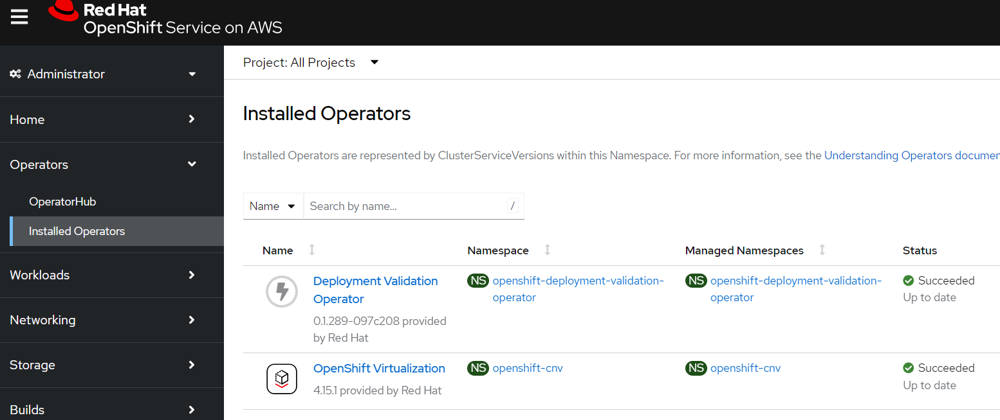
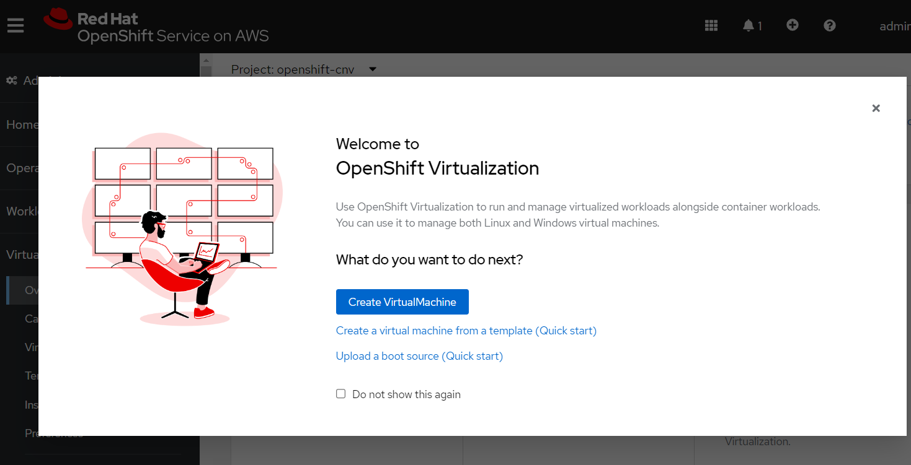

OpenShift Virtualization is a feature of OpenShift that allows you to run virtual machines alongside your containers.  This is useful for running legacy applications that can't be containerized, or for running applications that require special hardware or software that isn't available in a container.

In this tutorial, I'll show you how to deploy OpenShift Virtualization on Red Hat OpenShift on AWS (ROSA).  I'll show you how to create a ROSA cluster, deploy the OpenShift Virtualization operator, and create a virtual machine.

It's important to keep in mind that this tutorial is designed to show you the quickest way to get started with OpenShift Virtualization on ROSA.  It's not designed to be a production-ready deployment.  If you're planning to deploy OpenShift Virtualization in a production environment, you should follow the official documentation and best practices.

If you do don't want to deploy the resources yourself, you can watch the video below to see how it's done.



## ROSA Cluster

1. Clone down the terraform repository

    ```
    git clone --depth=1 https://github.com/rh-mobb/terraform-rosa.git
    cd terraform-rosa
    ```

1. Save some environment variables

    ```
    export TF_VAR_token="$(jq -r .refresh_token ~/.config/ocm/ocm.json)"
    export TF_VAR_cluster_name="$(whoami)-virt"
    export TF_VAR_admin_password='Passw0rd12345!'
    export TF_VAR_developer_password=''
    export TF_VAR_private=false
    export TF_VAR_ocp_version=4.15.11
    export TF_VAR_hosted_control_plane=true
    ```

3. Create a Plan and Apply it

    ```
    terraform init

    terraform plan -out tf.plan

    terraform apply tf.plan

    ```

If everything goes to plan, after about 20 minutes you should have a cluster available to use.

    ```
    Apply complete! Resources: 0 added, 0 changed, 0 destroyed.

    Outputs:

    cluster_api_url = "https://api.pczarkow-virt.nga3.p3.openshiftapps.com:443"
    oidc_config_id = "2b607a5ufsjc51g41ul07k5vj12v7ivb"
    oidc_endpoint_url = "2b607a5ufsjc51g41ul07k5vj12v7ivb"
    private_subnet_azs = tolist([
      "us-east-1a",
    ])
    private_subnet_ids = tolist([
      "subnet-09adee841dd979fdb",
    ])
    public_subnet_azs = tolist([
      "us-east-1a",
    ])
    public_subnet_ids = tolist([
      "subnet-0dca7ed3cddf65d87",
    ])
    vpc_id = "vpc-0df19c93b93721ada"
    ```

1. Log into OpenShift

    ```
    oc login $(terraform output -raw cluster_api_url) \
            --username admin --password $TF_VAR_admin_password

    ```

## Deploy the OpenShift Virtualization Operator

1. Create a bare metal machine pool
	> Note bare metal machines are not cheap, so be warned!

    ```
     rosa create machine-pool -c $TF_VAR_cluster_name \
       --replicas 1 --availability-zone us-east-1a \
       --instance-type c5d.metal --name virt
    ```

1. Deploy the OpenShift Virtualization Operator

    ```
    cat << EOF | oc apply -f -
    apiVersion: v1
    kind: Namespace
    metadata:
      name: openshift-cnv
    ---
    apiVersion: operators.coreos.com/v1
    kind: OperatorGroup
    metadata:
      name: kubevirt-hyperconverged-group
      namespace: openshift-cnv
    spec:
      targetNamespaces:
        - openshift-cnv
    ---
    apiVersion: operators.coreos.com/v1alpha1
    kind: Subscription
    metadata:
      name: hco-operatorhub
      namespace: openshift-cnv
    spec:
      source: redhat-operators
      sourceNamespace: openshift-marketplace
      name: kubevirt-hyperconverged
      startingCSV: kubevirt-hyperconverged-operator.v4.15.1
      channel: "stable"
    EOF
    ```

1. If you want to see the progress of the operator you can log into the OpenShift Console (hint run `oc whoami --show-console` to get the URL)

    

1. Create an OpenShift Virtualization operand

	> Note: this is all defaults, so will not support a lot of the more advanced features you might want such as live migration.

    ```
    cat << EOF | oc apply -f -
    apiVersion: hco.kubevirt.io/v1beta1
    kind: HyperConverged
    metadata:
      annotations:
        deployOVS: "false"
      finalizers:
      - kubevirt.io/hyperconverged
      generation: 2
      labels:
        app: kubevirt-hyperconverged
      name: kubevirt-hyperconverged
      namespace: openshift-cnv
    spec:
      applicationAwareConfig:
        allowApplicationAwareClusterResourceQuota: false
        vmiCalcConfigName: DedicatedVirtualResources
      certConfig:
        ca:
          duration: 48h0m0s
          renewBefore: 24h0m0s
        server:
          duration: 24h0m0s
          renewBefore: 12h0m0s
      evictionStrategy: LiveMigrate
      featureGates:
        alignCPUs: false
        autoResourceLimits: false
        deployKubeSecondaryDNS: false
        deployTektonTaskResources: false
        deployVmConsoleProxy: false
        disableMDevConfiguration: false
        enableApplicationAwareQuota: false
        enableCommonBootImageImport: true
        enableManagedTenantQuota: false
        nonRoot: true
        persistentReservation: false
        withHostPassthroughCPU: false
      infra: {}
      liveMigrationConfig:
        allowAutoConverge: false
        allowPostCopy: false
        completionTimeoutPerGiB: 800
        parallelMigrationsPerCluster: 5
        parallelOutboundMigrationsPerNode: 2
        progressTimeout: 150
      resourceRequirements:
        vmiCPUAllocationRatio: 10
      uninstallStrategy: BlockUninstallIfWorkloadsExist
      virtualMachineOptions:
        disableFreePageReporting: false
        disableSerialConsoleLog: true
      workloadUpdateStrategy:
        batchEvictionInterval: 1m0s
        batchEvictionSize: 10
        workloadUpdateMethods:
        - LiveMigrate
      workloads: {}
    EOF
    ```

1. New "Virtualization" Section in the OpenShift Console

    > Once the operator is installed you should see a new "Virtualization" section in the OpenShift Console (you may be prompted to refresh the page)

    

1. Close the annoying popup window and click the "Download virtctl" button to download the `virtctl` binary.

## Create a Virtual Machine

1. Create a project and a secret containing your public SSH key

    ```
    oc new-project my-vms
    oc create secret generic authorized-keys --from-file=ssh-publickey=$HOME/.ssh/id_rsa.pub
    ```

1. Create a VM

    ```
    cat << EOF | oc apply -f -
    apiVersion: kubevirt.io/v1
    kind: VirtualMachine
    metadata:
      name: example-vm
    spec:
      dataVolumeTemplates:
      - apiVersion: cdi.kubevirt.io/v1beta1
        kind: DataVolume
        metadata:
          name: example-vm-disk
        spec:
          sourceRef:
            kind: DataSource
            name: rhel9
            namespace: openshift-virtualization-os-images
          storage:
            resources:
              requests:
                storage: 30Gi
      running: false
      template:
        metadata:
          labels:
            kubevirt.io/domain: example-vm
        spec:
          domain:
            cpu:
              cores: 1
              sockets: 2
              threads: 1
            devices:
              disks:
              - disk:
                  bus: virtio
                name: rootdisk
              - disk:
                  bus: virtio
                name: cloudinitdisk
              interfaces:
              - masquerade: {}
                name: default
              rng: {}
            features:
              smm:
                enabled: true
            firmware:
              bootloader:
                efi: {}
            resources:
              requests:
                memory: 8Gi
          evictionStrategy: LiveMigrate
          networks:
          - name: default
            pod: {}
          volumes:
            - name: rootdisk
              dataVolume:
                name: example-vm-disk
            - cloudInitConfigDrive:
                userData: |-
                  #cloud-config
                  user: cloud-user
                  password: not-a-secure-password
                  chpasswd: { expire: False }
              name: cloudinitdisk
          accessCredentials:
            - sshPublicKey:
                propagationMethod:
                  configDrive: {}
                source:
                  secret:
                    secretName: authorized-keys
    EOF
    ```

1. Start the VM

    ```
    virtctl start example-vm
    ```

1. Watch for the VM to be ready

    ```bash
    watch oc get vm example-vm

    ```
    Every 2.0s: oc get vm
    NAME         AGE     STATUS         READY
    example-vm   3m16s   Running   False
    ```

1. SSH into the VM

    ```bash
    virtctl ssh cloud-user@example-vm -i ~/.ssh/id_rsa
    ```

    ```output
    Register this system with Red Hat Insights: insights-client --register
    Create an account or view all your systems at https://red.ht/insights-dashboard
    Last login: Fri May 17 16:35:39 2024 from 10.130.0.41
    [cloud-user@example-vm ~]$
    ```

1. Congratulations! You now have a virtual machine running on OpenShift Virtualization on ROSA!

## Cleanup

1. Delete the VM

    ```
    oc delete vm example-vm
    ```

1. Delete the ROSA Cluster

    ```
    terraform destroy
    ```
