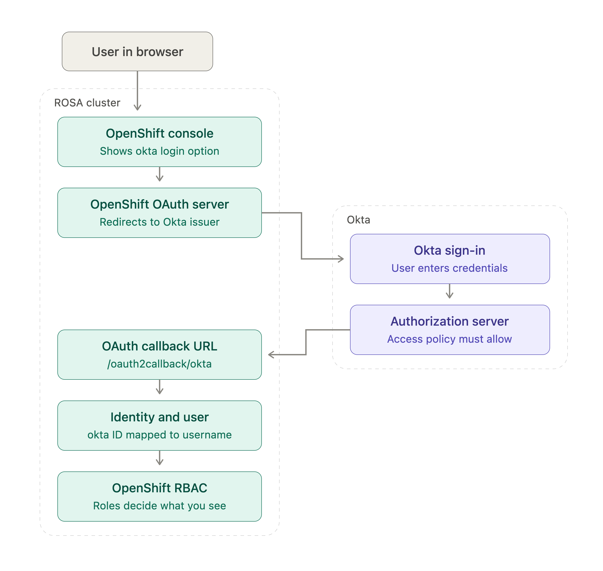
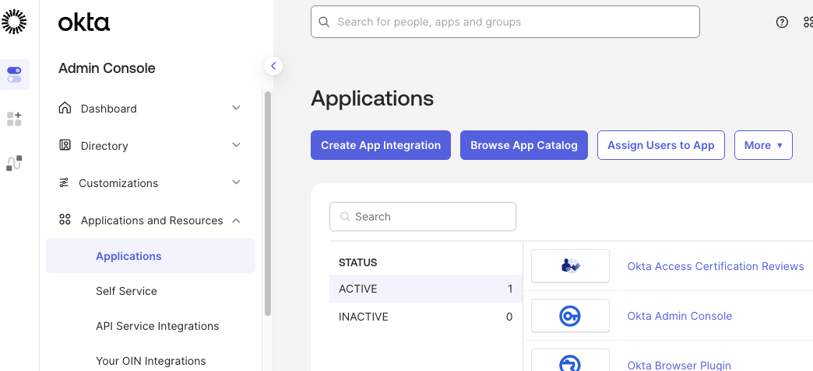
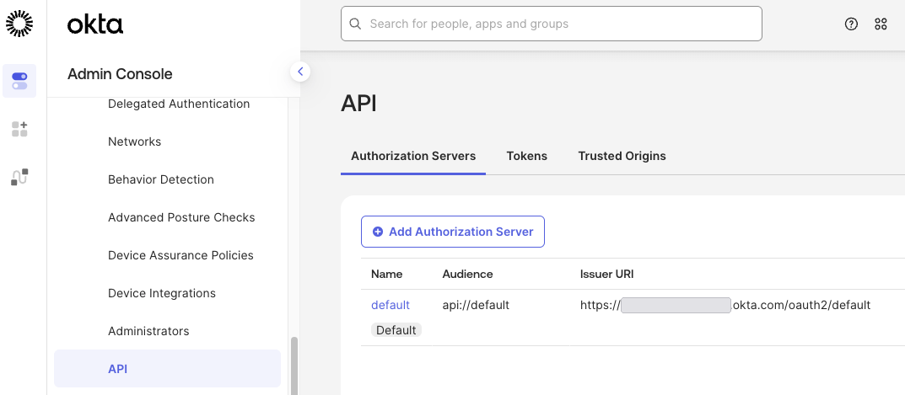
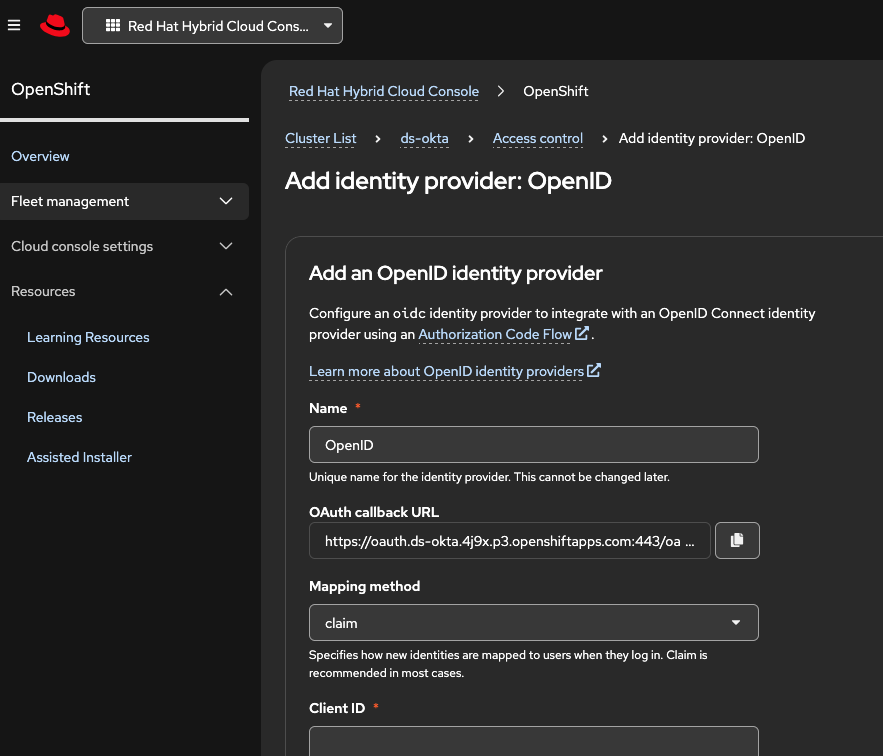
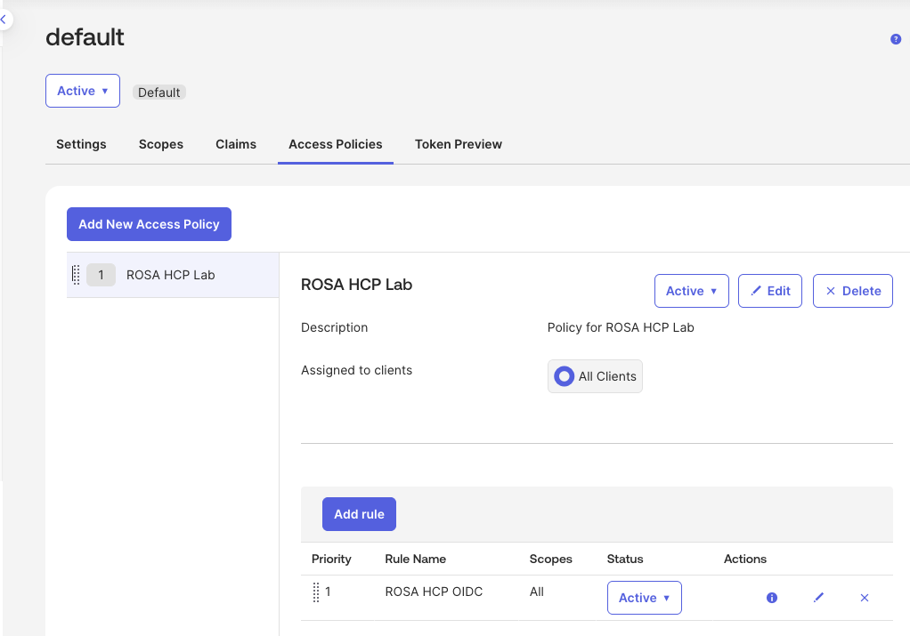
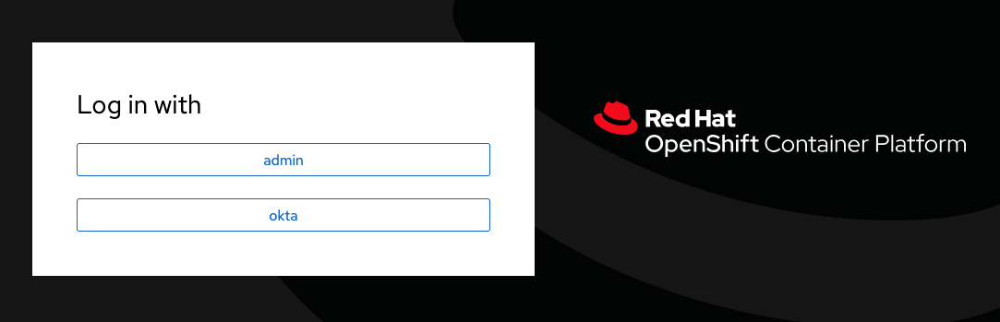

---

date: "2026-08-12"
title: "Integrating Okta with ROSA using OpenID Connect"
tags: ["IDP", "ROSA", "ROSA HCP"]
authors:
  - Diana Sari
  - Kevin Collins
validated_version: "4.22"
---

This guide demonstrates how to configure Okta as an OpenID Connect (OIDC) identity provider for Red Hat OpenShift Service on AWS (ROSA).

The configuration uses the built-in OpenShift OAuth server and an OpenID identity provider. After the integration is configured, users can authenticate to the OpenShift web console with their Okta credentials.

{}
This guide configures Okta as an OpenID identity provider using the built-in OpenShift OAuth server. It does not cover the optional ROSA HCP External Authentication Provider feature (`--external-auth-providers-enabled`).
{}

{}
The Red Hat and Okta console interfaces may change over time. Screenshots and navigation paths in this guide may differ slightly from the current UI.
{}

## Architecture

The authentication flow looks like this:



The Okta configuration itself is not specific to ROSA with Hosted Control Planes. The main cluster-specific value is the OpenShift OAuth callback URL.

## Prerequisites

Before beginning, ensure that you have:

* A running ROSA cluster.
* An Okta organization.
* Permission to create or modify an OIDC application in Okta.
* Permission to configure identity providers on the ROSA cluster.
* The [ROSA CLI](https://console.redhat.com/openshift/downloads), if using the CLI procedure.
* The [OpenShift CLI (`oc`)](https://console.redhat.com/openshift/downloads).
* `jq` for validating the OIDC discovery endpoint.

For testing, an [Okta Integrator Free Plan](https://developer.okta.com/signup/) can be used.

## 1. Create an OIDC application in Okta

Log in to the Okta Admin Console and navigate to:

**Applications -> Applications -> Create App Integration**

Select:

* **Sign-in method:** OIDC - OpenID Connect
* **Application type:** Web Application



Click **Next**.

Configure the application:

* **App integration name:** for example, `ROSA HCP`
* **Grant type:** Authorization Code
* **Controlled access:** Configure according to your organization's requirements

For a test environment, allowing all users in the Okta organization is sufficient.

{}
The OpenShift OAuth callback URI is cluster-specific. If you do not yet know the callback URI, you can create the Okta application first and add the correct URI after configuring the ROSA identity provider.
{}

Click **Save**.

## 2. Record the Okta client credentials

After the application is created, record the following values:

* Client ID
* Client secret

For CLI configuration, export the values as environment variables:

```bash
export OKTA_CLIENT_ID='<client-id>'
export OKTA_CLIENT_SECRET='<client-secret>'
```

## 3. Determine the Okta issuer URL

The issuer URL depends on the Okta authorization server being used.

For example, when using the `default` custom authorization server:

```bash
export OKTA_ISSUER='https://<your-okta-domain>/oauth2/default'
```

You can find the issuer in:

**Security -> API -> Authorization Servers**



Validate the OIDC discovery endpoint:

```bash
curl -s "${OKTA_ISSUER}/.well-known/openid-configuration" \
  | jq '{issuer, authorization_endpoint, token_endpoint, jwks_uri}'
```

Example output:

```json
{
  "issuer": "https://example.okta.com/oauth2/default",
  "authorization_endpoint": "https://example.okta.com/oauth2/default/v1/authorize",
  "token_endpoint": "https://example.okta.com/oauth2/default/v1/token",
  "jwks_uri": "https://example.okta.com/oauth2/default/v1/keys"
}
```

Verify that the returned `issuer` exactly matches the issuer URL that will be configured in ROSA.

## 4. Configure the ROSA identity provider

Set the cluster name:

```bash
export CLUSTER_NAME='<cluster-name>'
```

Create an OpenID identity provider named `okta`:

```bash
rosa create idp \
  --cluster "${CLUSTER_NAME}" \
  --type openid \
  --name okta \
  --client-id "${OKTA_CLIENT_ID}" \
  --client-secret "${OKTA_CLIENT_SECRET}" \
  --issuer-url "${OKTA_ISSUER}" \
  --email-claims email \
  --name-claims name \
  --username-claims preferred_username \
  --extra-scopes email,profile
```

Example output:

```text
I: Configuring IDP for cluster '<cluster-name>'
I: Identity Provider 'okta' has been created.
It may take several minutes for this access to become active.

I: Callback URI: https://oauth.<cluster-domain>:443/oauth2callback/okta
```

{}
Use the OAuth callback URI returned by ROSA exactly as displayed.

Do not construct the callback URL from the OpenShift console URL. The callback endpoint can differ from the normal `*.apps` route pattern, and Okta requires the redirect URI to match a registered URI.
{}

Alternatively, the identity provider can be configured using OpenShift Cluster Manager under:

**Cluster -> Access control -> Identity providers -> Add identity provider -> OpenID**

The OCM interface also displays the OAuth callback URL that must be configured in Okta.



## 5. Add the ROSA callback URL to Okta

Return to:

**Applications -> Applications -> `<ROSA application>` -> General**

Under **Sign-in redirect URIs**, add the callback URI displayed by ROSA or OCM.

For example:

```text
https://oauth.<cluster-domain>:443/oauth2callback/okta
```

Save the change.

{}
An existing Okta OIDC application used by another OpenShift cluster can technically contain multiple redirect URIs.

However, using a separate Okta application for each environment can provide cleaner separation for client secrets, authorization policies, redirect URIs, lifecycle management, and troubleshooting.
{}

## 6. Configure the Okta authorization server access policy

When using a custom authorization server, ensure that the Okta authorization server has an access policy permitting the ROSA application to use the Authorization Code flow.

Navigate to:

**Security -> API -> Authorization Servers -> `<authorization-server>` pencil icon -> Access Policies**

Create or select an access policy that applies to the ROSA OIDC application.

For a simple test configuration, create a rule with:

* **Grant type:** Authorization Code
* **User:** Any user assigned the app
* **Scopes:** Any scopes
* **Inline hook:** None

Click `Create rule`.



{}
New Okta Integrator Free Plan organizations provide a `default` custom authorization server, but the server does not include a basic access policy by default.

Without an applicable policy and rule, authentication can fail with:

```text
access_denied
Policy evaluation failed for this request
```

This is an Okta authorization-server policy failure rather than a ROSA authentication failure.
{}

For production environments, configure the authorization policy according to your organization's security requirements rather than using a broad test rule.

## 7. Verify the ROSA identity provider

Verify that the identity provider exists:

```bash
rosa list idps --cluster "${CLUSTER_NAME}"
```

Allow several minutes for the cluster authentication configuration to reconcile.

Open the OpenShift web console.

The login page should present an `okta` identity provider.



Select **okta** and authenticate using an assigned Okta user.

After authentication succeeds, the browser returns to the OpenShift OAuth callback and the user is logged in to the cluster.

## 8. Verify the OpenShift user and identity

Using an account with sufficient privileges, inspect the OpenShift users:

```bash
oc get users
```

Then inspect identities:

```bash
oc get identities
```

Example:

```text
NAME                  FULL NAME    IDENTITIES
user@example.com      Example User okta:00u123456789

NAME                   IDP NAME   IDP USER NAME   USER NAME
okta:00u123456789      okta       00u123456789   user@example.com
```

The OpenShift username is populated from the configured `preferred_username` claim.

## 9. Configure authorization

Authentication and authorization are separate.

A user who successfully authenticates through Okta does not automatically receive administrative permissions inside OpenShift.

For a simple lab test, an administrator can grant `cluster-admin` to an individual user:

```bash
oc adm policy add-cluster-role-to-user cluster-admin user@example.com
```

{}
Granting `cluster-admin` directly to an individual user is shown only as a simple validation example.

Production environments should follow the organization's RBAC model and generally assign appropriate roles to groups rather than granting every authenticated user cluster-wide administrative access.
{}

For example:

```yaml
apiVersion: rbac.authorization.k8s.io/v1
kind: ClusterRoleBinding
metadata:
  name: platform-admins
roleRef:
  apiGroup: rbac.authorization.k8s.io
  kind: ClusterRole
  name: cluster-admin
subjects:
- apiGroup: rbac.authorization.k8s.io
  kind: Group
  name: platform-admins
```

OpenShift Groups, RoleBindings, and ClusterRoleBindings can also be managed declaratively through mechanisms such as Red Hat Advanced Cluster Management (ACM) governance policies or GitOps.

{}
Receiving an Okta `groups` claim does not by itself create and maintain OpenShift `Group` objects.

If Okta is the source of truth for group membership, use an appropriate group synchronization mechanism and manage the OpenShift RoleBindings or ClusterRoleBindings separately.
{}

## Troubleshooting

### The `okta` login option does not appear

Verify that the identity provider exists:

```bash
rosa list idps --cluster "${CLUSTER_NAME}"
```

Allow several minutes for the authentication configuration to reconcile.

If you have cluster access, inspect the authentication ClusterOperator:

```bash
oc get co authentication
```

### Okta reports a redirect URI error

Verify that the Sign-in redirect URI configured in Okta exactly matches the callback URI provided by ROSA.

Pay attention to:

* Hostname
* Port
* Identity provider name
* `/oauth2callback/<idp-name>` path

### Okta returns `Policy evaluation failed for this request`

Example:

```text
access_denied
Policy evaluation failed for this request
```

Check:

**Security -> API -> Authorization Servers -> Access Policies**

Ensure that an access policy applies to the ROSA application and that its rules allow the Authorization Code grant and the requested scopes.

### OIDC discovery fails

Test the issuer:

```bash
curl -v \
  "${OKTA_ISSUER}/.well-known/openid-configuration"
```

Failures can indicate:

* DNS problems
* Firewall filtering
* Proxy configuration
* TLS inspection or certificate trust problems
* An incorrect issuer URL

### Okta login succeeds but the OpenShift console shows very little

Authentication has succeeded, but the user likely has insufficient OpenShift RBAC permissions.

Verify the user:

```bash
oc get user user@example.com
```

Then inspect the user's access:

```bash
oc auth can-i --list --as=user@example.com
```

Configure the appropriate RoleBinding or ClusterRoleBinding according to the intended access level.

### Private or restricted-egress ROSA clusters

For clusters with restrictive outbound networking, ensure that the environment can reach the Okta OIDC endpoints required by the configured authorization server.

At minimum, use the OIDC discovery document to identify the issuer's relevant endpoints:

```bash
curl -s \
  "${OKTA_ISSUER}/.well-known/openid-configuration" | jq .
```

If HTTPS traffic is subject to TLS inspection, ensure the cluster trusts the CA used by the inspection infrastructure where required.

## Shared VPC considerations

ROSA with Hosted Control Planes Shared VPC does not use a different OpenID authentication mechanism.

Shared VPC primarily changes ownership and management of AWS networking resources and IAM responsibilities between the VPC owner and cluster creator.

The Okta integration still consists of:

* Okta OIDC application
* OpenShift OpenID identity provider
* Cluster-specific OAuth callback URL

However, networking controls in the shared VPC must still permit the connectivity required for a successful authentication flow.

## Cleanup

To remove the identity provider:

```bash
rosa delete idp \
  --cluster "${CLUSTER_NAME}" \
  --idp okta
```

Confirm the identity provider is removed:

```bash
rosa list idps --cluster "${CLUSTER_NAME}"
```

You can then remove the corresponding Okta application or its ROSA redirect URI if it is no longer required.

## References

* [ROSA authentication and identity provider documentation](https://docs.redhat.com/en/documentation/red_hat_openshift_service_on_aws/4/html/authentication_and_authorization/)
* [Red Hat tutorial: Configuring an OpenID identity provider for ROSA](https://docs.redhat.com/en/documentation/red_hat_openshift_service_on_aws/4/html/tutorials/cloud-experts-entra-id-idp)
* [Okta: Create OpenID Connect app integrations](https://help.okta.com/en-us/content/topics/apps/apps_app_integration_wizard_oidc.htm)
* [Okta: Authorization servers](https://developer.okta.com/docs/concepts/auth-servers/)
* [Okta: Configure an access policy](https://developer.okta.com/docs/guides/configure-access-policy/)
