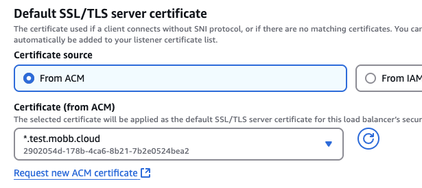

Starting with OpenShift 4.14, Red Hat OpenShift Service on AWS (ROSA) supports adding additional Ingress Controllers which can be used to configure a custom domain on a ROSA cluster. This guide shows how to leverage this feature to create a complete routing solution with both a private Ingress Controller (which creates an Network Load Balancer (NLB)) and a public Application Load Balancer (ALB) in front of it, providing a path from the internet to your applications.

In essence, the routing flow will look like this: Internet -> ALB -> NLB -> Application. 


<br />

## Why this Approach

The most straightforward way to use an ALB in front of your ROSA cluster is via the [AWS Load Balancer Operator (ALBO)](https://docs.redhat.com/en/documentation/red_hat_openshift_service_on_aws/4/html/tutorials/cloud-experts-aws-load-balancer-operator). However, using ALBO requires you to either create NodePort Services or use Kubernetes Ingress resources with appropriate annotations.

This guide presents an alternative architecture that leverages OpenShift Routes and the built-in routing capabilities of the OpenShift platform. By creating a secondary IngressController (which manages an NLB) and placing an ALB in front of it, you can:

- Use standard OpenShift Route objects instead of managing NodePort Services or Ingress resources
- Avoid manually managing port allocations for multiple applications
- Attach AWS services like [Web Application Firewall (WAF)](https://docs.redhat.com/en/documentation/red_hat_openshift_service_on_aws/4/html/tutorials/cloud-experts-using-alb-and-waf#deploy-aws-load-balancer-operator_cloud-experts-using-alb-and-waf) or Shield to protect your applications
- Maintain compatibility with existing OpenShift deployment patterns

This approach differs from [adding an Ingress Controller to a ROSA cluster](https://cloud.redhat.com/experts/rosa/ingress-controller/) because here it adds the additional ALB component, providing a solution to have a public-facing ALB while keeping the NLB private. 

> **Note**: This architecture has important TLS considerations to be aware of. AWS Application Load Balancers do not forward Server Name Indication (SNI) to their target groups as explicitly confirmed by AWS. Normally this would be problematic because OpenShift's IngressController relies primarily on SNI for routing HTTPS connections. However, this architecture works because the ALB terminates the original TLS connection and creates a new one to the NLB while preserving the HTTP Host header. When the IngressController receives a connection without SNI information, it falls back to using the Host header for routing. This makes the wildcard certificate approach essential for this architecture to function properly.

**Multi-cluster note**

If you plan to run this pattern across multiple ROSA clusters in the same AWS region, the setup will only work reliably if all of the following conditions are met:
- Every cluster has its own unique subdomain (or sub-subdomain), e.g. `apps-a.example.com`, `apps-b.example.com`, etc.
- Every cluster defines its own additional IngressController that serves that specific subdomain.
- Every cluster is covered by an ACM TLS certificate that matches the hostnames it will serve (either its own wildcard, e.g. `*.apps-a.example.com`, or a broader wildcard that cleanly covers all clusters).
- The NLB created for that IngressController is registered as a target in front of an ALB:
  - either one ALB per cluster, or
  - a shared ALB with separate target groups and host-based routing rules that send `apps-a.*` traffic to cluster A, `apps-b.*` traffic to cluster B, etc.


## Prerequisites

* A private (or Privatelink) [classic](https://cloud.redhat.com/experts/rosa/terraform/classic/) or [HCP](https://cloud.redhat.com/experts/rosa/terraform/hcp/) multi-az ROSA cluster v4.14 and above.
* The oc CLI      # logged in.
* A Domain Name in a public zone. These instructions assume Route 53, but can be adapted for any other DNS.


## Set up environment

Once you're logged into your cluster, set up the following environment variables.
> **Important**: The variables below can be customized to fit your needs for your ingress controller.

```bash
INGRESS_NAME=private-ingress # just a name example
DOMAIN=lab.domain.com # change this to your domain (for example, our MOBB registered domain is `mobb.cloud`, so here I replaced it with `test.mobb.cloud`) 
SCOPE="Internal"
```

## Create the Ingress Controller

```yaml
cat  <<EOF | oc apply -f -
apiVersion: operator.openshift.io/v1
kind: IngressController
metadata:
  annotations:
    ingress.operator.openshift.io/auto-delete-load-balancer: "true"
  finalizers:
  - ingresscontroller.operator.openshift.io/finalizer-ingresscontroller
  generation: 2
  name: $INGRESS_NAME
  namespace: openshift-ingress-operator
spec:
  clientTLS:
    clientCA:
      name: ""
    clientCertificatePolicy: ""
  domain: $DOMAIN
  endpointPublishingStrategy:
    loadBalancer:
      dnsManagementPolicy: Unmanaged
      providerParameters:
        aws:
          networkLoadBalancer: {}
          type: NLB
        type: AWS
      scope: $SCOPE
    type: LoadBalancerService
  httpCompression: {}
  httpEmptyRequestsPolicy: Respond
  httpErrorCodePages:
    name: ""
  replicas: 2
  tuningOptions:
    reloadInterval: 0s
  unsupportedConfigOverrides: null
EOF
```

Describe the Ingress Controller to confirm it's ready.

```bash
oc describe IngressController $INGRESS_NAME -n openshift-ingress-operator
```

You should see an output that mentions that the ingress controller is **Admitted**.


<br />


Also verify the router pods of the new ingress controller are running

```bash
oc get pods -n openshift-ingress | grep $INGRESS_NAME
```

Expected output is two pods in a **Running** state.


<br />

Verify the service of the new ingress controller is running.

```bash
oc get svc -n openshift-ingress router-${INGRESS_NAME}
```


<br />

Patch the service to add a healthcheck port:

```bash
oc -n openshift-ingress patch svc router-${INGRESS_NAME} -p '{"spec":{"ports":[{"port":1936,"targetPort":1936,"protocol":"TCP","name":"httphealth"}]}}'
```

Here the cluster IngressController haproxy pods expose a health check on `http://:1936/healthz/ready` that is the documented mechanism for health checks when adding a user-managed load balancer to a self-managed OpenShift. This service exposes this health check on port 1936 of the NLB per this [KCS](https://access.redhat.com/solutions/7080426).

Once you have a confirmation that the service is patched, let's grab your NLB name which will be useful for further steps.

```bash
NLB_NAME=$(oc -n openshift-ingress get svc router-${INGRESS_NAME} -o jsonpath='{.status.loadBalancer.ingress[0].hostname}' | cut -d'-' -f1)
echo $NLB_NAME
```


## Create the ALB

Before we create the ALB, let's grab the IP addresses related to your NLB. Go to your AWS Console and head to the dashboard. Be sure you're in the current region where your cluster resides. From your **Console Home**, search or select **EC2** and from there, on the navigation tab, select **Network Interfaces**. Copy and paste the NLB name from the previous output on the search bar, and then scroll to the right to until you see the list of the **Primary private IPv4 IP address** related to this NLB. Note that we will need these IP addresses to register targets in the next step so keep them handy for now.


<br />

Next, go to the **EC2** dashboard again and select **Load balancers**. Then click the **Create load balancer** button. Select ALB and click **Create**. Give it a proper name, e.g. `test-alb`, select **Internet-facing** as scheme, and **IPv4** as load balancer IP address type.

Under **Network mapping**, select the VPC where your cluster resides and select your AZs and the public subnets tied to them. And for **Security groups**, click **create a new security group** links which will lead you to a new tab. Give it a name, e.g. `test-sg`, provide description such as `to allow https`, and select the VPC where your cluster resides. Under **Inbound rules**, select `HTTPS` as type and `0.0.0.0/0` as source. Leave the **Outbound rules** as is, and click **Create security group**. Go back to the ALB creation tab, hit the refresh button, and add the new security group you just created.


<br />

Next, under **Listeners and routing**, select `HTTPS` as protocol, and click **Create target group** links that will lead you to a new tab. Choose `IP addresses` as target type and give it a name, e.g. `test-tg`, and leave the rest settings to default. Under **Health checks**, leave the protocol to `HTTPS`, and point the health check path to `/healthz/ready`. Click the **Advanced health check settings**, and under **Health check port**, select **Override** and type `1936` to the port number, and you can leave the rest of the advanced health check settings to default. 


<br />


Click **Next** at the end of the page and this will lead you to the **Register targets** group. Now, enter the IP addresses of your NLB that you've retrieved previously. Once you added them, click **Include as pending below**. And at the **Review targets** section, you should see the health checks are in **Pending** state. Click **Create target group** to proceed.


<br />


Next, go back to the ALB creation page, refresh the target group option, and select the target group you just created. 


<br />

Under **Secure listener settings**, on the **Default SSL/TLS server certificate** section, you can choose **Import certificate** if you already have existing certificates. Alternatively, using `From ACM` as source, you can click **Request new ACM certificate** to create a new one, and this will lead you to a new tab. On the ACM page, click **Request a certificate**, choose **Request a public certificate**, and click **Next**. Insert the domain name, e.g. `*.test.mobb.cloud`, and leave the rest to default, then click **Request**. 


<br />

To validate this certificate, click the **Create records in Route 53** button to proceed, click **Create records** on the next page.


<br />


Wait for a few minutes until the ACM certificate shows **Issued** status. Next, let's go back to the ALB creation tab, and under **Certificate (from ACM)** section, hit the refresh icon, and add the certificate you just created. 


<br />

Lastly, be sure everything looks good at the **Summary** section and then click **Create load balancer**. Wait for a few minutes until the ALB is fully provisioned. Grab the **DNS name** of the ALB for the next step.


## Create (or update) custom domain on Route 53 

Skip this creation step if you have already created the custom domain. To create one, go to your AWS Console. Select **Route 53** and choose a hosted zone, and from there, click **Create record** button. 

Here you will be creating a wildcard CNAME record (e.g. `*.test.mobb.cloud`) and point it to the **DNS name** of the ALB you just created, and click **Save**. 


<br />

If you have already the record previously, then simply update the value to the ALB.

FYI, now if you look at the target group you created earlier, you should see the NLB health checks are healthy.


<br />


## Test an application

Finally, let's test this setup by creating a public application. Log in to the cluster to proceed with next steps.

1. Create a new project

   ```bash
   oc new-project my-public-app
   ```

1. Create a new application

   ```bash
   oc new-app --docker-image=docker.io/openshift/hello-openshift
   ```

1. Create a route for the application

   ```bash
   oc create route edge --service=hello-openshift hello-openshift-tls \
     --hostname hello.$DOMAIN
   ```

1. Check that you can access the application:

   ```bash
   curl https://hello.$DOMAIN
   ```

You should see the output `Hello OpenShift!`. Alternatively, go to your browser and access it from there.


<br />
