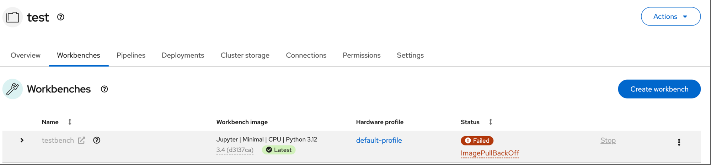
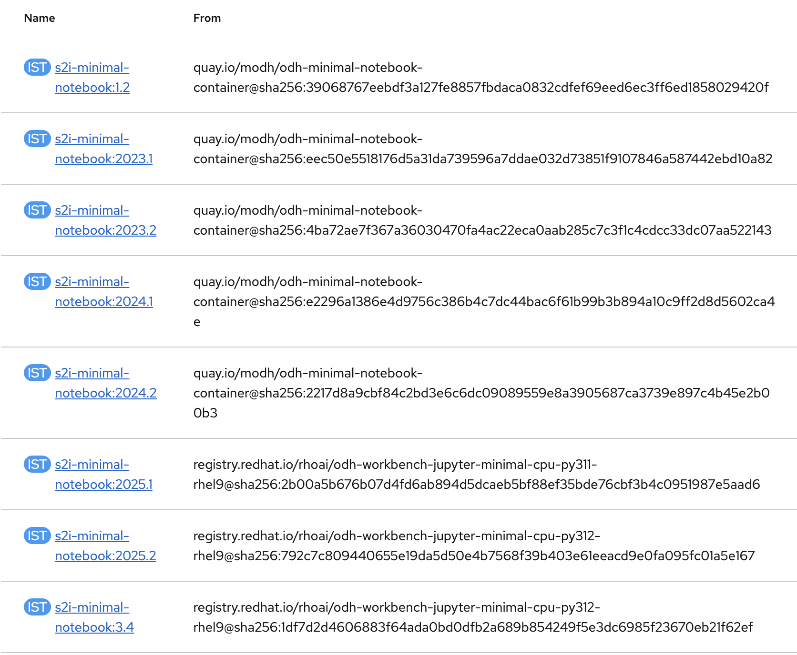
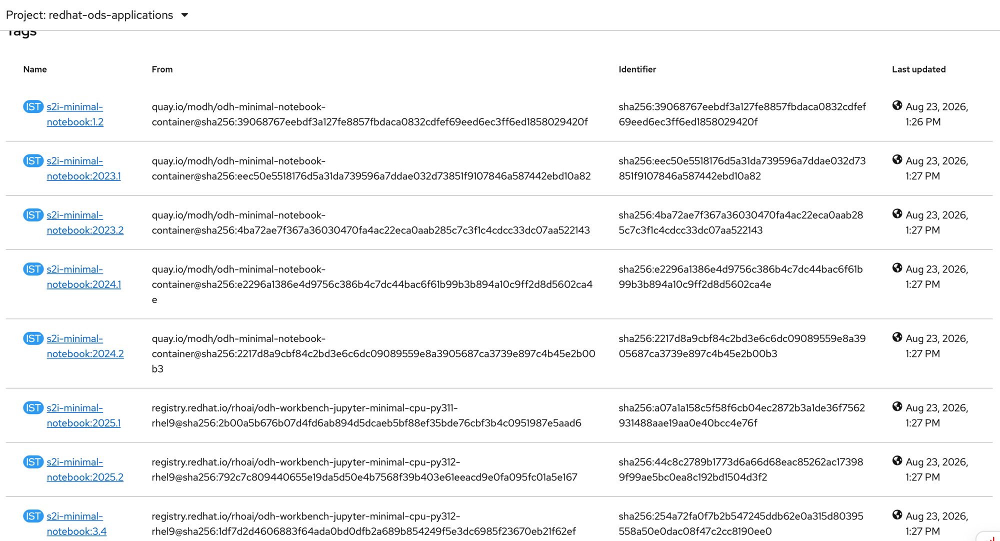
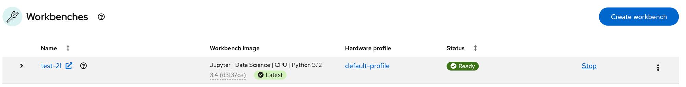

If you are running OpenShift AI on a ROSA HCP zero-egress cluster and your workbenches fail with `ImagePullBackOff`, this guide explains the root cause and provides two workaround solutions. A permanent fix is being developed by Red Hat engineering.

## Symptoms

On a ROSA HCP zero-egress cluster with OpenShift AI installed, workbenches created from the OpenShift AI console fail with `ImagePullBackOff`:



```
Back-off pulling image "image-registry.openshift-image-registry.svc:5000/redhat-ods-applications/s2i-minimal-notebook:3.4"
Error: ImagePullBackOff
Failed to pull image "...": unable to pull image or OCI artifact:
  reading manifest 3.4 in image-registry.openshift-image-registry.svc:5000/redhat-ods-applications/s2i-minimal-notebook: manifest unknown
```

OpenShift AI workbench images are backed by ImageStreams in the `redhat-ods-applications` namespace. When you select a workbench image in the OpenShift AI console (e.g., **Jupyter | Minimal | CPU | Python 3.12**), it maps to an ImageStream tag (`s2i-minimal-notebook:3.4`). You can see these ImageStreams in the OpenShift console under **Builds → ImageStreams** in the `redhat-ods-applications` namespace:



The ImageStream import controller imports these images from the source registry into the internal image registry. The console then creates workbench pods that reference the internal registry URL. If the import fails, the image does not exist in the internal registry and the pod fails.

The source images are stored in two registries:

| Registry | Versions | Example tags |
|---|---|---|
| `quay.io/modh` | Older versions | 1.2, 2023.1, 2023.2, 2024.1, 2024.2 |
| `registry.redhat.io` | Newer versions (2025+) | 2025.1, 2025.2, 3.4 |

The sidecar container (`kube-rbac-proxy`) pulls successfully from `registry.redhat.io` via IDMS, confirming that node-level image pulls work. Only the main workbench container fails because it references the internal registry, which depends on a successful ImageStream import.

## Root Cause

The fundamental issue is how ImageStream imports pull images. On a zero-egress cluster, all container images are served from an AWS ECR mirror via IDMS. Worker nodes (CRI-O) authenticate to ECR using credentials in `kube-system/global-pull-secret`. However, the ImageStream import controller uses a different pull secret:

| Component | Pull secret | Has ECR credentials? | Result |
|---|---|---|---|
| Worker node (CRI-O) | `kube-system/global-pull-secret` | Yes | Image pulls succeed |
| ImageStream import controller | `openshift-config/pull-secret` | No | **Import fails** |

The `openshift-config/pull-secret` is a managed resource — direct modifications are automatically reverted. The import controller is redirected to ECR via IDMS but cannot authenticate. This affects both `registry.redhat.io` and `quay.io/modh` images.

Additionally, the `quay.io/modh` images have no default IDMS configured. Without an IDMS redirect, the import controller tries to pull directly from `quay.io` — which fails on zero-egress clusters because there is no outbound internet access.

## Solutions

|  | Option 1: Namespace-Level Pull Secret | Option 2: Patch Workbench |
|---|---|---|
| **Approach** | Provide ECR credentials to the ImageStream import controller | Bypass ImageStream; use source image directly |
| **Scope** | Fixes all workbenches at once | Per-workbench manual fix |
| **Ongoing maintenance** | CronJob handles credential refresh automatically | Manual intervention for every new workbench |

## Option 1: Namespace-Level ECR Pull Secret (Recommended)

Copies ECR credentials into the `redhat-ods-applications` namespace and links them to the service accounts used by the ImageStream import controller. A CronJob keeps the credentials in sync since ECR tokens expire every 12 hours.

### Prerequisites

- Logged in to the cluster with `cluster-admin` privileges
- `oc`, `jq` installed
- IDMS for `quay.io/modh` configured (see below)

The cluster comes pre-configured with IDMS for `registry.redhat.io`, but older OpenShift AI image tags reference `quay.io/modh/...`, which is not covered. Add it:

```bash
# Find the ECR mirror URL from the existing IDMS
oc get imagedigestmirrorset cluster \
  -o jsonpath='{.spec.imageDigestMirrors[?(@.source=="registry.redhat.io")].mirrors[0]}'

# Add IDMS for quay.io/modh
rosa create image-mirror \
  --cluster=<cluster-name-or-id> \
  --source=quay.io/modh \
  --mirrors=<ECR_ACCOUNT_ID>.dkr.ecr.<REGION>.amazonaws.com/modh
```

### Step 1: Create ECR pull secret in the RHOAI namespace

```bash
RHOAI_NS="redhat-ods-applications"

ECR_DOCKERCONFIG=$(oc get secret additional-pull-secret -n kube-system \
  -o jsonpath='{.data.\.dockerconfigjson}')

cat <<EOF | oc apply -f -
apiVersion: v1
kind: Secret
metadata:
  name: ecr-pull-secret
  namespace: ${RHOAI_NS}
type: kubernetes.io/dockerconfigjson
data:
  .dockerconfigjson: ${ECR_DOCKERCONFIG}
EOF
```

### Step 2: Link the secret to service accounts

```bash
oc secrets link default ecr-pull-secret --for=pull -n ${RHOAI_NS}
oc secrets link builder ecr-pull-secret --for=pull -n ${RHOAI_NS}
```

### Step 3: Re-import failed ImageStream tags

```bash
oc get imagestream -n ${RHOAI_NS} -o json | jq -r '
  .items[] | .metadata.name as $is |
  .status.tags[]? | select(.conditions[]?.status == "False") |
  "\($is):\(.tag)"
' | while read entry; do
  echo "Importing ${entry} ..."
  oc import-image "${entry}" -n ${RHOAI_NS} --confirm > /dev/null 2>&1 || \
    echo "  WARNING: Failed to import ${entry}"
done
```

### Step 4: Set up automatic credential sync

ECR tokens expire every 12 hours. Create a CronJob running every 4 hours (offset 30 minutes after the Red Hat managed credential refresh):

```bash
SYNC_SA="ecr-secret-sync"
oc create sa ${SYNC_SA} -n ${RHOAI_NS}

cat <<EOF | oc apply -f -
apiVersion: rbac.authorization.k8s.io/v1
kind: Role
metadata:
  name: read-ecr-secret
  namespace: kube-system
rules:
- apiGroups: [""]
  resources: ["secrets"]
  resourceNames: ["additional-pull-secret"]
  verbs: ["get"]
---
apiVersion: rbac.authorization.k8s.io/v1
kind: RoleBinding
metadata:
  name: ecr-secret-sync-read
  namespace: kube-system
subjects:
- kind: ServiceAccount
  name: ${SYNC_SA}
  namespace: ${RHOAI_NS}
roleRef:
  kind: Role
  name: read-ecr-secret
  apiGroup: rbac.authorization.k8s.io
---
apiVersion: rbac.authorization.k8s.io/v1
kind: Role
metadata:
  name: update-ecr-secret
  namespace: ${RHOAI_NS}
rules:
- apiGroups: [""]
  resources: ["secrets"]
  resourceNames: ["ecr-pull-secret"]
  verbs: ["get", "patch"]
---
apiVersion: rbac.authorization.k8s.io/v1
kind: RoleBinding
metadata:
  name: ecr-secret-sync-update
  namespace: ${RHOAI_NS}
subjects:
- kind: ServiceAccount
  name: ${SYNC_SA}
  namespace: ${RHOAI_NS}
roleRef:
  kind: Role
  name: update-ecr-secret
  apiGroup: rbac.authorization.k8s.io
EOF
```

```bash
SYNC_IMAGE=$(oc get pods -n kube-system -l app=ecr-credential-refresh \
  -o jsonpath='{.items[0].spec.containers[0].image}' 2>/dev/null)

cat <<EOF | oc apply -f -
apiVersion: batch/v1
kind: CronJob
metadata:
  name: sync-ecr-pull-secret
  namespace: ${RHOAI_NS}
spec:
  schedule: "30 */4 * * *"
  concurrencyPolicy: Forbid
  jobTemplate:
    spec:
      activeDeadlineSeconds: 120
      template:
        spec:
          serviceAccountName: ${SYNC_SA}
          containers:
          - name: sync
            image: ${SYNC_IMAGE}
            command:
            - /bin/bash
            - -c
            - |
              ECR_DATA=\$(oc get secret additional-pull-secret -n kube-system \
                -o jsonpath='{.data.\.dockerconfigjson}')
              oc patch secret ecr-pull-secret -n ${RHOAI_NS} \
                --type merge -p "{\"data\":{\".dockerconfigjson\":\"\${ECR_DATA}\"}}"
              echo "ECR pull-secret synced at \$(date)"
          restartPolicy: OnFailure
EOF
```

The CronJob uses the same container image as the Red Hat managed `ecr-credential-refresh` CronJob in `kube-system`, which is already mirrored to ECR.

### Verification

```bash
# Check remaining failed ImageStream tags (should be 0)
oc get imagestream -n ${RHOAI_NS} -o json | jq '[
  .items[] | .metadata.name as $is |
  .status.tags[]? | select(.conditions[]?.status == "False") |
  "\($is):\(.tag)"
] | if length == 0 then "All ImageStream tags imported successfully" else . end'
```

Create a workbench from the OpenShift AI console. It should start without manual intervention.

## Option 2: Patch Each Workbench After Creation

Bypasses ImageStream entirely by patching the workbench notebook CR to use the original source image reference directly. CRI-O on the worker node handles the IDMS redirect to ECR and authenticates via the node's IAM role.

### Prerequisites

- Permissions to patch notebook CR in the target namespace
- IDMS for `quay.io/modh` configured (see Option 1 Prerequisites)

### Step 1: Create the workbench

Create a workbench from the OpenShift AI console (e.g., **Jupyter | Minimal | CPU | Python 3.12**). It will fail with `ImagePullBackOff`.

### Step 2: Identify the source image and patch

```bash
NOTEBOOK_NAME="<workbench-name>"
NAMESPACE="<project-namespace>"
RHOAI_NS="redhat-ods-applications"

IMAGE_SELECTION=$(oc get notebook ${NOTEBOOK_NAME} -n ${NAMESPACE} \
  -o jsonpath='{.metadata.annotations.notebooks\.opendatahub\.io/last-image-selection}')

IS_NAME="${IMAGE_SELECTION%%:*}"
IS_TAG="${IMAGE_SELECTION##*:}"

SOURCE_IMAGE=$(oc get imagestream ${IS_NAME} -n ${RHOAI_NS} \
  -o jsonpath="{.spec.tags[?(@.name==\"${IS_TAG}\")].from.name}")

oc patch notebook ${NOTEBOOK_NAME} -n ${NAMESPACE} --type json -p "[
  {\"op\":\"replace\",\"path\":\"/spec/template/spec/containers/0/image\",\"value\":\"${SOURCE_IMAGE}\"}
]"
```

### Step 3: Delete the pod to force recreation

StatefulSet pods do not auto-restart on spec changes:

```bash
oc delete pod ${NOTEBOOK_NAME}-0 -n ${NAMESPACE}
oc get pod ${NOTEBOOK_NAME}-0 -n ${NAMESPACE} -w
```

The workbench pod should reach `Running` status.

## Result: Before and After

**Before applying the fix**, ImageStream tags show **empty Identifier and Last updated columns** — the import failed and no image was stored in the internal registry.

**After applying the fix**, all tags — both `quay.io/modh` and `registry.redhat.io` — show populated Identifier and Last updated values:



Workbenches created from the OpenShift AI console start successfully:



## Troubleshooting

<details>
<summary>Verify prerequisites before running the fix</summary>

```bash
# Is the quay.io/modh IDMS configured?
oc get imagedigestmirrorset -o json | jq -r '
  .items[].spec.imageDigestMirrors[] | select(.source == "quay.io/modh") |
  "\(.source) -> \(.mirrors[0])"'

# Does additional-pull-secret exist and have ECR creds?
oc get secret additional-pull-secret -n kube-system \
  -o jsonpath='{.data.\.dockerconfigjson}' | base64 -d | jq -r '.auths | keys[]'

# Is the ECR token valid?
ECR_REGISTRY=$(oc get secret additional-pull-secret -n kube-system \
  -o jsonpath='{.data.\.dockerconfigjson}' | base64 -d | jq -r '.auths | keys[0]')
ECR_CREDS=$(oc get secret additional-pull-secret -n kube-system \
  -o jsonpath='{.data.\.dockerconfigjson}' | base64 -d | \
  jq -r ".auths[\"${ECR_REGISTRY}\"].auth")
curl -s -o /dev/null -w "%{http_code}" \
  -H "Authorization: Basic ${ECR_CREDS}" \
  "https://${ECR_REGISTRY}/v2/"
# 200 = token valid, 401 = expired/invalid
```

</details>

<details>
<summary>ImageStream import still fails after applying Option 1</summary>

```bash
oc import-image s2i-minimal-notebook:3.4 -n redhat-ods-applications --confirm 2>&1
```

| Error | Cause | Fix |
|---|---|---|
| `you may not have access to the container image` | ECR pull secret not linked to SA, or token expired | Re-run Steps 1 and 2 |
| `manifest unknown` | Image digest not mirrored to ECR | Escalate to Red Hat SRE |

</details>

<details>
<summary>CronJob fails (ECR token sync stops working)</summary>

```bash
oc get jobs -n redhat-ods-applications --sort-by='.metadata.creationTimestamp' | grep sync
oc get pods -n redhat-ods-applications -l job-name --sort-by='.metadata.creationTimestamp' | tail -5
```

| Issue | Cause | Fix |
|---|---|---|
| Pod in `ImagePullBackOff` | CronJob image not available on ECR | Update image from `oc get pods -n kube-system -l app=ecr-credential-refresh -o jsonpath='{.items[0].spec.containers[0].image}'` |
| Pod runs but sync fails | RBAC issue | Check: `oc auth can-i get secrets/additional-pull-secret -n kube-system --as=system:serviceaccount:redhat-ods-applications:ecr-secret-sync` |

</details>
