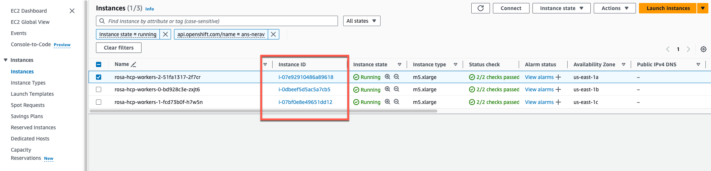
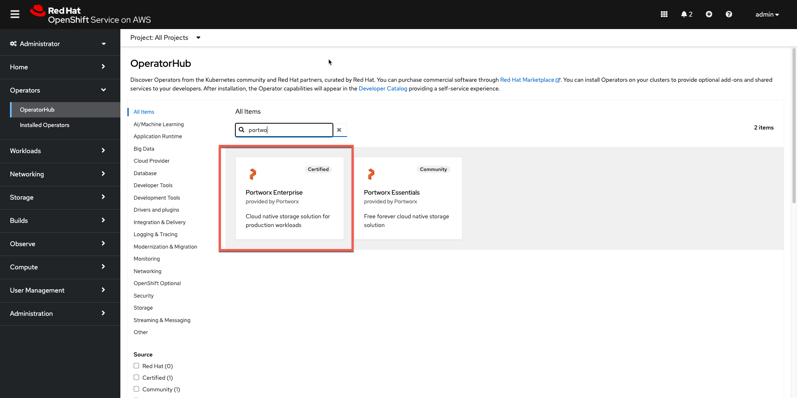
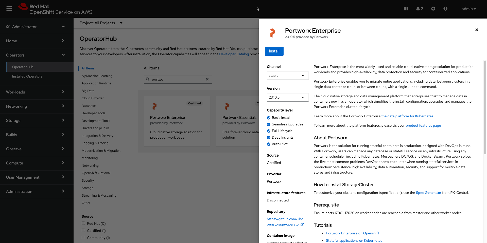
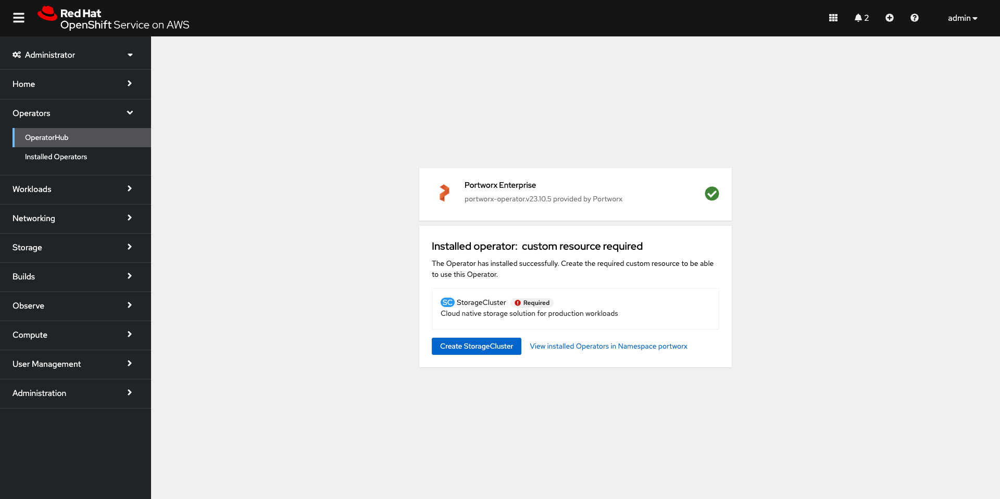
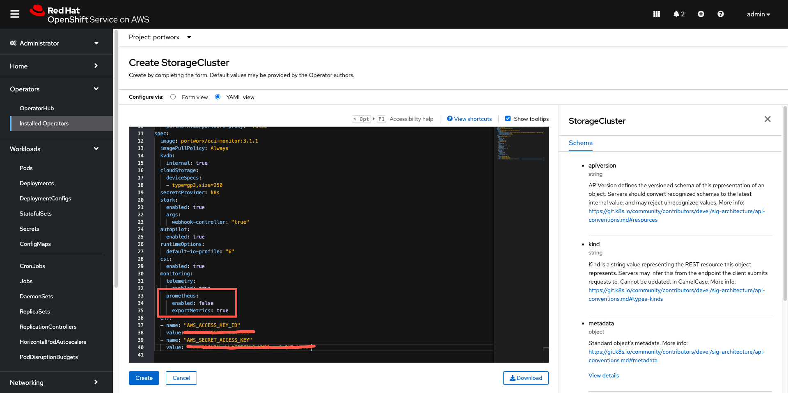
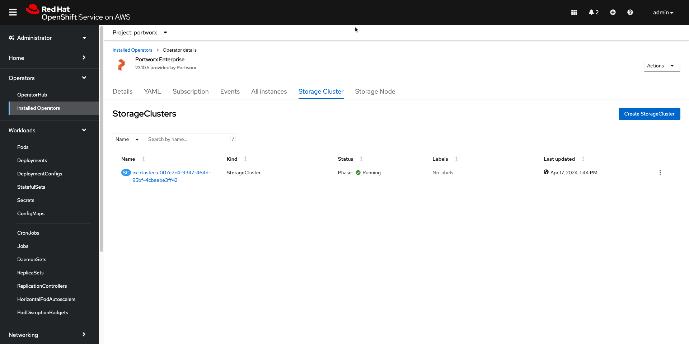

Portworx storage is a built-for-Kubernetes service that offers flexible and scalable persistent storage for applications in production. In this tutorial we will look at installing Portworx Enterprise on ROSA-HCP. 

## Prerequisites
You must have a Red Hat OpenShift Service on AWS (ROSA) with [hosted control plane cluster](https://docs.openshift.com/rosa/rosa_hcp/rosa-hcp-sts-creating-a-cluster-quickly.html#rosa-sts-overview-of-the-default-cluster-specifications_rosa-hcp-sts-creating-a-cluster-quickly) 
Your cluster must be running OpenShift 4 or higher
Your cluster must meet AWS prerequisites for ROSA-HCP
* [Create Portworx user and set policies](https://docs.portworx.com/portworx-enterprise/install-portworx/openshift/rosa/aws-redhat-openshift#create-a-portworx-user)
* [AWS CLI](https://docs.aws.amazon.com/cli/latest/userguide/install-cliv2.html)
* [Rosa CLI](https://github.com/openshift/rosa/releases/tag/v1.2.37) v1.2.37

## Generate Portworx spec

Navigate to [Portworx Central](https://central.portworx.com/landing/login) and log in, or create an account.

1. Click Get Started. Select Portworx Enterprise from the Product Catalog page.

2. On the Product Line page, choose any option depending on which license you intend to use, then click Continue to start the spec generator.

For Platform, choose AWS. Under Distribution Name, select Red Hat OpenShift Service on AWS (ROSA). Enter your cluster's Kubernetes version, then click Customize at the bottom of the window.

3. Click Next and navigate to the Customize window to specify your previously created AWS security credentials in the Environment Variables section as follows:

name: AWS_ACCESS_KEY_ID; value: <your-aws-access-key>
name: AWS_SECRET_ACCESS_KEY; value: <your-aws-secret-access-key>

4. Click Finish to generate the specs and download yaml file.

## Open ports for worker nodes
Perform the following to add the inbound rules so that the AWS EC2 instance uses your specified security groups to control the incoming traffic.

1. From the EC2 page of your AWS console, click Security Groups, under Network & Security, in the left pane.

2. On the Security Groups page, type your ROSA cluster name in the search bar and press enter. You will see a list of security groups associated with your cluster. Click the link under Security group ID of your cluster's worker security group:



3. From your security group page, click Actions in the upper-right corner, and choose Edit inbound rules from the dropdown menu.

4. Click Add Rule at the bottom of the screen to add each of the following rules:

Allow inbound Custom TCP traffic with Protocol: TCP on ports 17001 - 17022
Allow inbound Custom TCP traffic with Protocol: TCP on port 20048
Allow inbound Custom TCP traffic with Protocol: TCP on port 111
Allow inbound Custom UDP traffic with Protocol: UDP on port 17002
Allow inbound NFS traffic with Protocol: TCP on port 2049

Make sure to specify the security group ID of the same worker security group that is mentioned in step 2.

5. Click Save rule.

## Log in to OpenShift UI
Log in to the OpenShift console by following the quick access instructions on the Accessing your cluster quickly page in the Red Hat OpenShift Service on AWS documentation.

## Install Portworx Operator using the OpenShift UI
1. From your OpenShift console, select OperatorHub in the left pane.

2. On the OperatorHub page, search for Portworx and select the Portworx Enterprise or Portworx Essential card:



3. Install


4. The Portworx Operator begins to install and takes you to the Install Operator page. On this page, select the A specific namespace on the cluster option for Installation mode. Select the Create Project option from the Installed Namespace dropdown:


5. On the Create Project window, enter the name as `portworx` and click Create to create a namespace called portworx.

6. Click Install to install Portworx Operator in the `portworx` namespace.

## Apply Portworx spec using OpenShift UI
1. Once the Operator is installed successfully, create a StorageCluster object from the same page by clicking Create StorageCluster:



2. On the Create StorageCluster page, choose YAML view to configure a StorageCluster.

Copy and paste the above Portworx spec from above step into the text-editor, and click Create to deploy Portworx:



Verify that Portworx has deployed successfully by navigating to the Storage Cluster tab of the Installed Operators page. Once Portworx has been fully deployed, the status will show as Running:

)

## Verify your Portworx installation

Once you've installed Portworx, you can perform the following tasks to verify that Portworx has installed correctly.

### Verify if all pods are running
Enter the following oc get pods command to list and filter the results for Portworx pods:

```
oc get pods -n portworx -o wide | grep -e portworx -e px
```

Output should be something like this 

```
portworx-api-kql78                                      2/2     Running   6 (121m ago)    128m   10.0.0.217    ip-10-0-0-217.ec2.internal   <none>           <none>
portworx-api-wbhc4                                      2/2     Running   5 (124m ago)    128m   10.0.1.77     ip-10-0-1-77.ec2.internal    <none>           <none>
portworx-api-zj2bk                                      2/2     Running   6 (122m ago)    128m   10.0.1.41     ip-10-0-1-41.ec2.internal    <none>           <none>
portworx-kvdb-4wp88                                     1/1     Running   0               120m   10.0.1.77     ip-10-0-1-77.ec2.internal    <none>           <none>
portworx-kvdb-sw9bd                                     1/1     Running   0               119m   10.0.1.41     ip-10-0-1-41.ec2.internal    <none>           <none>
portworx-kvdb-tztsw                                     1/1     Running   0               119m   10.0.0.217    ip-10-0-0-217.ec2.internal   <none>           <none>
portworx-operator-7468f47477-t5s6h                      1/1     Running   0               146m   10.129.0.22   ip-10-0-0-217.ec2.internal   <none>           <none>
portworx-pvc-controller-7dff498f96-8m9g5                1/1     Running   0               129m   10.0.1.77     ip-10-0-1-77.ec2.internal    <none>           <none>
portworx-pvc-controller-7dff498f96-96hhg                1/1     Running   0               129m   10.0.0.217    ip-10-0-0-217.ec2.internal   <none>           <none>
portworx-pvc-controller-7dff498f96-m5ltt                1/1     Running   0               129m   10.0.1.41     ip-10-0-1-41.ec2.internal    <none>           <none>
px-cluster-c007e7c4-9347-464d-95bf-4cbaebe3ff42-849df   1/1     Running   0               129m   10.0.1.41     ip-10-0-1-41.ec2.internal    <none>           <none>
px-cluster-c007e7c4-9347-464d-95bf-4cbaebe3ff42-9h67h   1/1     Running   0               129m   10.0.1.77     ip-10-0-1-77.ec2.internal    <none>           <none>
px-cluster-c007e7c4-9347-464d-95bf-4cbaebe3ff42-9wtg9   1/1     Running   0               129m   10.0.0.217    ip-10-0-0-217.ec2.internal   <none>           <none>
px-csi-ext-7bdbbd4479-6g75q                             4/4     Running   14 (112m ago)   129m   10.130.0.23   ip-10-0-1-77.ec2.internal    <none>           <none>
px-csi-ext-7bdbbd4479-jx97t                             4/4     Running   18 (121m ago)   129m   10.129.0.26   ip-10-0-0-217.ec2.internal   <none>           <none>
px-csi-ext-7bdbbd4479-pg62k                             4/4     Running   18 (122m ago)   129m   10.128.0.45   ip-10-0-1-41.ec2.internal    <none>           <none>
px-plugin-774b78bf77-cp46m                              1/1     Running   0               129m   10.130.0.22   ip-10-0-1-77.ec2.internal    <none>           <none>
px-plugin-774b78bf77-xlhs4                              1/1     Running   0               129m   10.129.0.25   ip-10-0-0-217.ec2.internal   <none>           <none>
px-plugin-proxy-69987b8b6c-8jfgl                        1/1     Running   0               129m   10.130.0.21   ip-10-0-1-77.ec2.internal    <none>           <none>
px-telemetry-phonehome-9bdk4                            2/2     Running   0               120m   10.130.0.24   ip-10-0-1-77.ec2.internal    <none>           <none>
px-telemetry-phonehome-g8t2v                            2/2     Running   0               120m   10.128.0.47   ip-10-0-1-41.ec2.internal    <none>           <none>
px-telemetry-phonehome-rng7k                            2/2     Running   0               120m   10.129.0.27   ip-10-0-0-217.ec2.internal   <none>           <none>
px-telemetry-registration-66fb4b76f-m9hcv               2/2     Running   0               120m   10.0.0.217    ip-10-0-0-217.ec2.internal   <none>           <none>
```

Note the name of one of your px-cluster pods. You'll run pxctl commands from these pods in following steps.

```
oc exec px-cluster-c007e7c4-9347-464d-95bf-4cbaebe3ff42-849df -n portworx -- /opt/pwx/bin/pxctl status
```

Output should be something like this

```
Status: PX is operational
Telemetry: Disabled or Unhealthy
Metering: Disabled or Unhealthy
License: Trial (expires in 31 days)
Node ID: 316d53f0-e473-4f62-99a9-58bf4e9989f0
        IP: 10.0.1.41 
        Local Storage Pool: 1 pool
        POOL    IO_PRIORITY     RAID_LEVEL      USABLE  USED    STATUS  ZONE            REGION
        0       HIGH            raid0           250 GiB 10 GiB  Online  us-east-1b      us-east-1
        Local Storage Devices: 1 device
        Device  Path            Media Type              Size            Last-Scan
        0:1     /dev/nvme2n1    STORAGE_MEDIUM_NVME     250 GiB         17 Apr 24 17:53 UTC
        total                   -                       250 GiB
        Cache Devices:
         * No cache devices
        Kvdb Device:
        Device Path     Size
        /dev/nvme3n1    32 GiB
         * Internal kvdb on this node is using this dedicated kvdb device to store its data.
Cluster Summary
        Cluster ID: px-cluster-c007e7c4-9347-464d-95bf-4cbaebe3ff42
        Cluster UUID: 7ea3aeb4-74dc-43cb-acac-de9948abb8dd
        Scheduler: kubernetes
        Total Nodes: 3 node(s) with storage (3 online)
        IP              ID                                      SchedulerNodeName               Auth            StorageNode     Used    Capacity        Status  StorageStatus   Version Kernel                           OS
        10.0.0.217      e2248cd5-8bf0-42e2-8572-d3b3a20ead6c    ip-10-0-0-217.ec2.internal      Disabled        Yes             10 GiB  250 GiB         Online  Up              3.1.1.0-519c78f  5.14.0-284.45.1.el9_2.x86_64    Red Hat Enterprise Linux CoreOS 414.92.202312191502-0 (Plow)
        10.0.1.77       6994bc54-6b35-4c62-a906-c94c2c9e90f5    ip-10-0-1-77.ec2.internal       Disabled        Yes             10 GiB  250 GiB         Online  Up              3.1.1.0-519c78f  5.14.0-284.45.1.el9_2.x86_64    Red Hat Enterprise Linux CoreOS 414.92.202312191502-0 (Plow)
        10.0.1.41       316d53f0-e473-4f62-99a9-58bf4e9989f0    ip-10-0-1-41.ec2.internal       Disabled        Yes             10 GiB  250 GiB         Online  Up (This node)  3.1.1.0-519c78f  5.14.0-284.45.1.el9_2.x86_64    Red Hat Enterprise Linux CoreOS 414.92.202312191502-0 (Plow)
Global Storage Pool
        Total Used      :  30 GiB
        Total Capacity  :  750 GiB
```
The Portworx status will display PX is operational if your cluster is running as intended.        

## Verify pxctl cluster provision status

```
oc -n portworx get storagecluster
```

Find the storage cluster, the status should show as Online:
```
NAME                                              CLUSTER UUID                           STATUS    VERSION   AGE
px-cluster-c007e7c4-9347-464d-95bf-4cbaebe3ff42   7ea3aeb4-74dc-43cb-acac-de9948abb8dd   Running   3.1.1     139m
```

```
oc -n portworx get storagenodes
```

Find the storage nodes status should show Online
```
NAME                         ID                                     STATUS   VERSION           AGE
ip-10-0-0-217.ec2.internal   e2248cd5-8bf0-42e2-8572-d3b3a20ead6c   Online   3.1.1.0-519c78f   140m
ip-10-0-1-41.ec2.internal    316d53f0-e473-4f62-99a9-58bf4e9989f0   Online   3.1.1.0-519c78f   140m
ip-10-0-1-77.ec2.internal    6994bc54-6b35-4c62-a906-c94c2c9e90f5   Online   3.1.1.0-519c78f   140m
```

## Create your first PVC
For your apps to use persistent volumes powered by Portworx, you must use a StorageClass that references Portworx as the provisioner. Portworx includes a number of default StorageClasses, which you can reference with PersistentVolumeClaims (PVCs) you create. For a more general overview of how storage works within Kubernetes, refer to the Persistent Volumes section of the Kubernetes documentation.

Perform the following steps to create a PVC:

1. Create a PVC referencing the px-csi-db default StorageClass and save the file:
```bash
cat << EOF | oc apply -f -
kind: PersistentVolumeClaim
apiVersion: v1
metadata:
  name: px-example-pvc
spec:
  storageClassName: px-csi-db
  accessModes:
    - ReadWriteOnce
  resources:
    requests:
      storage: 1Gi
EOF      
```      

2. Verify your StorageClass and PVC
```
oc get storageclass px-csi-db  
```
Output
```
NAME        PROVISIONER        RECLAIMPOLICY   VOLUMEBINDINGMODE   ALLOWVOLUMEEXPANSION   AGE
px-csi-db   pxd.portworx.com   Delete          Immediate           true                   164m
```

3. To get PVC you should
```
oc get pvc px-example-pvc -n portworx
```

Output 
```
NAME             STATUS   VOLUME                                     CAPACITY   ACCESS MODES   STORAGECLASS   AGE
px-example-pvc   Bound    pvc-a3cb32df-8ebe-4806-91d3-2155cccc87cb   1Gi        RWO            px-csi-db      3m
```

