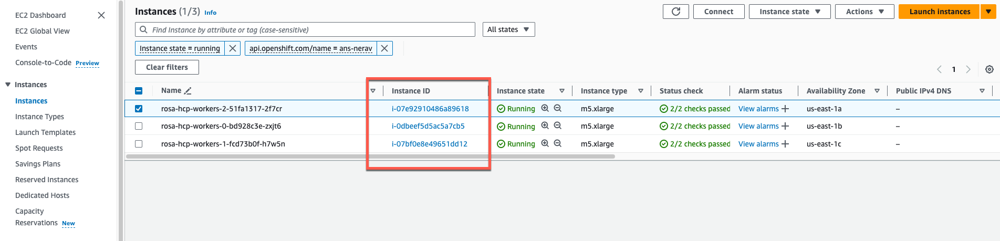
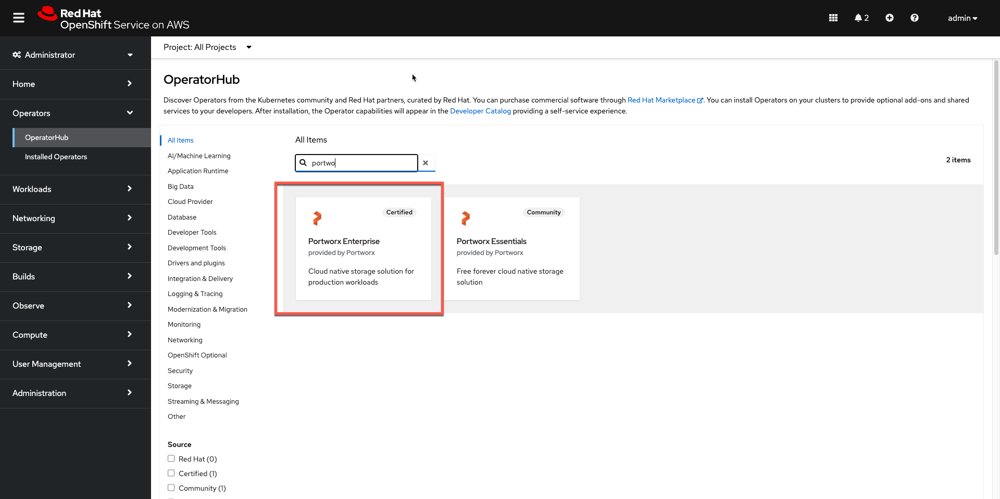
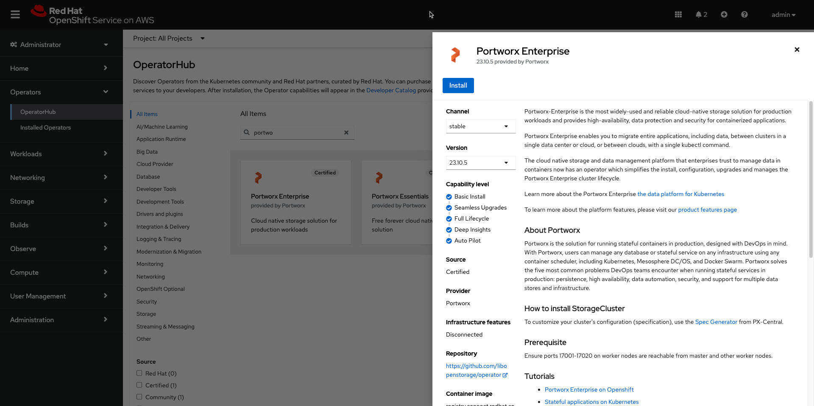
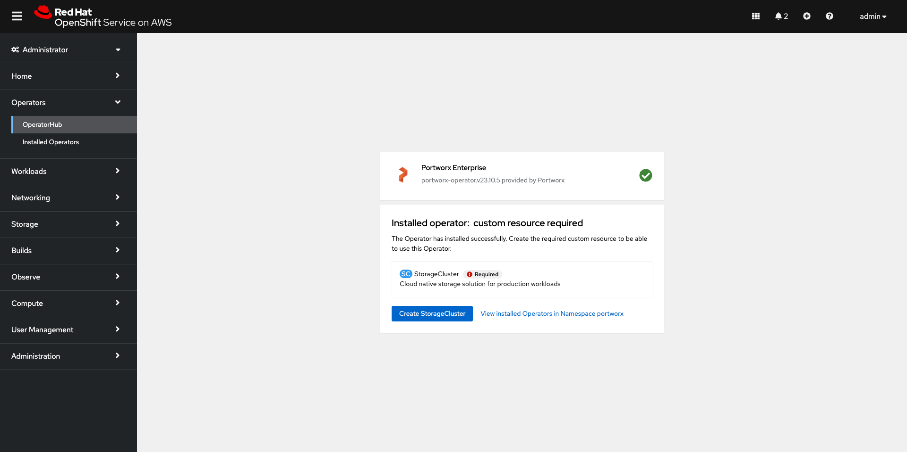
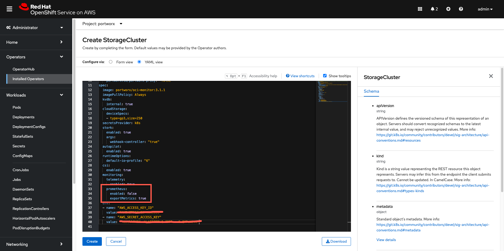
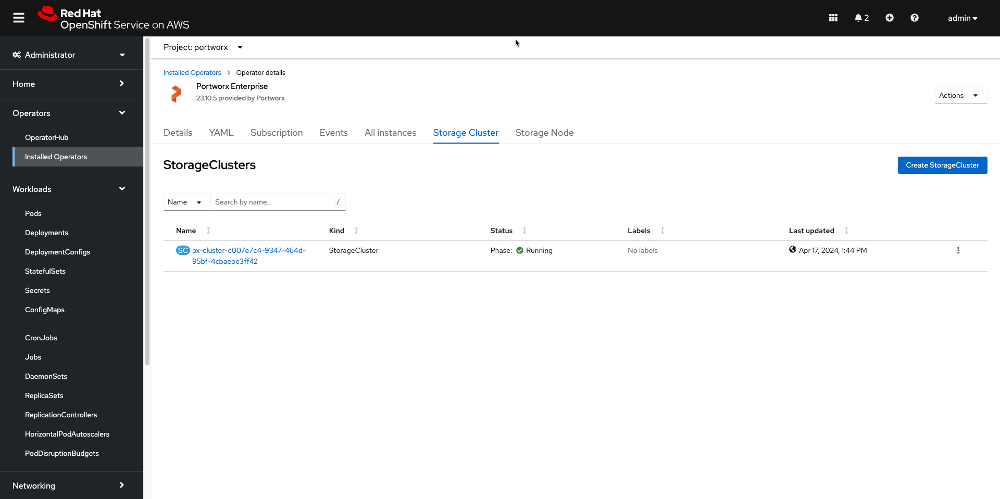

Portworx storage is a built-for-Kubernetes service that offers flexible and scalable persistent storage for applications in production. In this tutorial, we will look at installing Portworx Enterprise on ROSA-HCP. 

## Prerequisites

* [ROSA HCP](https://cloud.redhat.com/experts/rosa/quickstart/) cluster with minimum 3 worker nodes. 

* [Create Portworx user and set policies](https://docs.portworx.com/portworx-enterprise/install-portworx/openshift/rosa/aws-redhat-openshift#create-a-portworx-user)

## 1. Set environment variable

   ```bash
   export ROSA_CLUSTER_NAME=<cluster_name>
   export REGION=us-east-1 
   export AWS_ACCOUNT_ID=`aws sts get-caller-identity --query Account --output text`
   ```

## 2. Open ports for worker nodes

>Note: You can open the ports via web console or CLI. 

### Web Console 
Perform the following to add the inbound rules so that the AWS EC2 instance uses your specified security groups to control the incoming traffic.

1. From the EC2 page of your AWS console find EC2 instances for hcp cluster worker nodes, click Security Groups, under Network & Security, in the left pane.



2. On the Security Groups page, type your ROSA cluster name in the search bar and press enter. You will see a list of security groups associated with your cluster. Click the link under Security group ID of your cluster's worker security group:

3. From your security group page, click Actions in the upper-right corner, and choose Edit inbound rules from the dropdown menu.

4. Click Add Rule at the bottom of the screen to add each of the following rules:

    - Allow inbound Custom TCP traffic with Protocol: TCP on ports 17001 - 17022
    - Allow inbound Custom TCP traffic with Protocol: TCP on port 20048
    - Allow inbound Custom TCP traffic with Protocol: TCP on port 111
    - Allow inbound Custom UDP traffic with Protocol: UDP on port 17002
    - Allow inbound NFS traffic with Protocol: TCP on port 2049

Make sure to specify the security group ID of the same worker security group that is mentioned in step 2.

5. Click Save rule.

### AWS and ROSA CLI 

1. Get a Private Subnet ID from the cluster.

```
PRIVATE_SUBNET_ID=$(rosa describe cluster -c $ROSA_CLUSTER_NAME -o json | jq -r '.aws.subnet_ids[0]')
echo $PRIVATE_SUBNET_ID
```

2. Get the VPC ID from the subnet ID.

```
VPC_ID=$(aws ec2 describe-subnets --subnet-ids $PRIVATE_SUBNET_ID --region $REGION --query 'Subnets[0].VpcId' --output text)
echo $VPC_ID
```

3. Get the cluster ID

```
ID=$(rosa describe cluster -c $ROSA_CLUSTER_NAME -o json | jq -r '.id')
echo $ID
```

4. Get Security group id associated with VPC
```
SecurityGroupId=$(aws ec2 describe-security-groups --region ${REGION} --filters "Name=tag:Name,Values=${ID}-default-sg" | jq -r '.SecurityGroups[0].GroupId')
echo $SecurityGroupId
```

5. Add inbound rules to default Security group id for 
```
aws ec2 authorize-security-group-ingress \
    --group-id ${SecurityGroupId} \
    --region ${REGION} \
    --protocol tcp \
    --port 17001-17022 \
    --source-group ${SecurityGroupId}

aws ec2 authorize-security-group-ingress \
    --group-id ${SecurityGroupId} \
    --region ${REGION} \
    --protocol tcp \
    --port 111 \
    --source-group ${SecurityGroupId}

aws ec2 authorize-security-group-ingress \
    --group-id ${SecurityGroupId} \
    --region ${REGION} \
    --protocol tcp \
    --port 20048 \
    --source-group ${SecurityGroupId}

aws ec2 authorize-security-group-ingress \
    --group-id ${SecurityGroupId} \
    --region ${REGION} \
    --protocol udp \
    --port 17002 \
    --source-group ${SecurityGroupId}

aws ec2 authorize-security-group-ingress \
    --group-id ${SecurityGroupId} \
    --region ${REGION} \
    --protocol tcp \
    --port 2049 \
    --source-group ${SecurityGroupId}
```


## 3. Log in to OpenShift UI

Log in to the OpenShift console as mentioned in the ROSA [documentation](https://docs.redhat.com/en/documentation/red_hat_openshift_service_on_aws/4/html/install_clusters/rosa-hcp-quickstart-guide#rosa-getting-started-access-cluster-web-console_rosa-hcp-quickstart-guide).

1. Create `portworx` namespace

```
 oc new-project portworx 
```

**Output**

```
Now using project "portworx" on server "https://api.ans-nerav.lb33.p3.openshiftapps.com:443".

You can add applications to this project with the 'new-app' command. For example, try:

    oc new-app rails-postgresql-example

to build a new example application in Ruby. Or use kubectl to deploy a simple Kubernetes application:

    kubectl create deployment hello-node --image=registry.k8s.io/e2e-test-images/agnhost:2.43 -- /agnhost serve-hostname
```    


2. Get AWS credentials for AWS IAM user (replace <name> with user ) and copy AccessKeyId and SecretAccessKey

```
aws iam create-access-key --user-name <name>
```

3. Create secret in portworx namespace in ROSA-HCP cluster (get aws credentials from step2)
```
oc create secret generic my-aws-credentials --from-literal=AWS_ACCESS_KEY_ID=<your_access_key_id> --from-literal=AWS_SECRET_ACCESS_KEY=<your_secret_access_key> -n portworx
```

## 4. Install Portworx Operator using the OpenShift UI
1. From your OpenShift console, select OperatorHub in the left pane.

2. On the OperatorHub page, search for Portworx and select the Portworx Enterprise or Portworx Essential card:



3. Install



4. The Portworx Operator begins to install and takes you to the Install Operator page. On this page, select the A specific namespace on the cluster option for Installation mode. Select `portworx` namespace

5. Click Install to install Portworx Operator in the `portworx` namespace.

## 5. Apply Portworx spec using OpenShift UI
1. Once the Operator is installed successfully, create a StorageCluster object from the same page by clicking Create StorageCluster:



2. On the Create StorageCluster page, choose YAML view to configure a StorageCluster. Copy and paste the below Portworx spec into the text-editor, and click Create to deploy Portworx:

#### Note: One can generate Portworx spec from Portworx Central using the instructions [here](https://docs.portworx.com/portworx-enterprise/platform/install/aws/aws-redhat-openshift-with-console-plugin#generate-the-portworx-specification)

```
kind: StorageCluster
apiVersion: core.libopenstorage.org/v1
metadata:
  name: px-cluster-c007e7c4-9347-464d-95bf-4cbaebe3ff42
  namespace: portworx
  annotations:
    portworx.io/is-openshift: "true"
    portworx.io/portworx-proxy: "false"
spec:
  image: portworx/oci-monitor:3.3.0
  imagePullPolicy: Always
  kvdb:
    internal: true
  cloudStorage:
    deviceSpecs:
    - type=gp3,size=250
  secretsProvider: k8s
  stork:
    enabled: true
    args:
      webhook-controller: "true"
  autopilot:
    enabled: true
  runtimeOptions:
    default-io-profile: "6"
  csi:
    enabled: true
  monitoring:
    telemetry:
      enabled: true
    prometheus:
      enabled: false
      exportMetrics: true
  env:
  - name: "AWS_ACCESS_KEY_ID"
    valueFrom:
      secretKeyRef:
        name: my-aws-credentials
        key: AWS_ACCESS_KEY_ID
  - name: "AWS_SECRET_ACCESS_KEY"
    valueFrom:
      secretKeyRef:
        name: my-aws-credentials
        key: AWS_SECRET_ACCESS_KEY
```




3. Verify that Portworx has deployed successfully by navigating to the Storage Cluster tab of the Installed Operators page. Once Portworx has been fully deployed, the status will show as Running:



## 6. Verify your Portworx installation

Once you've installed Portworx, you can perform the following tasks to verify that Portworx has installed correctly.

### Verify if all pods are running
Enter the following oc get pods command to list and filter the results for Portworx pods:

```
oc get pods -n portworx -o wide | grep -e portworx -e px
```

**Output**

```
portworx-api-4q4c7                                      2/2     Running   7 (39m ago)   41m   10.0.1.173    ip-10-0-1-173.ec2.internal   <none>           <none>
portworx-api-bsvc8                                      2/2     Running   9 (38m ago)   41m   10.0.1.34     ip-10-0-1-34.ec2.internal    <none>           <none>
portworx-api-rz5cd                                      2/2     Running   7 (38m ago)   41m   10.0.1.156    ip-10-0-1-156.ec2.internal   <none>           <none>
portworx-kvdb-q5kxz                                     1/1     Running   0             38m   10.0.1.34     ip-10-0-1-34.ec2.internal    <none>           <none>
portworx-kvdb-qxl2l                                     1/1     Running   0             38m   10.0.1.156    ip-10-0-1-156.ec2.internal   <none>           <none>
portworx-kvdb-vkn55                                     1/1     Running   0             38m   10.0.1.173    ip-10-0-1-173.ec2.internal   <none>           <none>
portworx-operator-7b48b7b49d-xvgcs                      1/1     Running   0             48m   10.130.0.12   ip-10-0-1-173.ec2.internal   <none>           <none>
px-cluster-c007e7c4-9347-464d-95bf-4cbaebe3ff42-nzhgk   1/1     Running   0             42m   10.0.1.173    ip-10-0-1-173.ec2.internal   <none>           <none>
px-cluster-c007e7c4-9347-464d-95bf-4cbaebe3ff42-rg4fk   1/1     Running   0             42m   10.0.1.156    ip-10-0-1-156.ec2.internal   <none>           <none>
px-cluster-c007e7c4-9347-464d-95bf-4cbaebe3ff42-wl2ps   1/1     Running   0             42m   10.0.1.34     ip-10-0-1-34.ec2.internal    <none>           <none>
px-csi-ext-56f66555dc-2kdcw                             4/4     Running   9 (38m ago)   42m   10.130.0.17   ip-10-0-1-173.ec2.internal   <none>           <none>
px-csi-ext-56f66555dc-kdmfx                             4/4     Running   9 (39m ago)   42m   10.130.0.18   ip-10-0-1-173.ec2.internal   <none>           <none>
px-csi-ext-56f66555dc-sqjbw                             4/4     Running   9 (38m ago)   42m   10.129.0.41   ip-10-0-1-156.ec2.internal   <none>           <none>
px-telemetry-metrics-collector-5fd9f47c67-6j5gc         2/2     Running   0             38m   10.129.0.42   ip-10-0-1-156.ec2.internal   <none>           <none>
px-telemetry-phonehome-cxpbg                            2/2     Running   0             38m   10.130.0.19   ip-10-0-1-173.ec2.internal   <none>           <none>
px-telemetry-phonehome-f8kkh                            2/2     Running   0             38m   10.129.0.43   ip-10-0-1-156.ec2.internal   <none>           <none>
px-telemetry-phonehome-vnqfr                            2/2     Running   0             38m   10.128.0.49   ip-10-0-1-34.ec2.internal    <none>           <none>
px-telemetry-registration-5d46bfb9cf-lr8wf              2/2     Running   0             38m   10.0.1.34     ip-10-0-1-34.ec2.internal    <none>           <none>
```

Note the name of one of your px-cluster pods. You'll run pxctl commands from these pods in following steps.

```
oc exec px-cluster-c007e7c4-9347-464d-95bf-4cbaebe3ff42-nzhgk -n portworx -- /opt/pwx/bin/pxctl status
```

**Output**

```
Status: PX is operational
Telemetry: Healthy
Metering: Disabled or Unhealthy
License: Trial (expires in 31 days)
Node ID: ea3d243f-2a16-49d3-94d9-b8833ff46932
        IP: 10.0.1.173 
        Local Storage Pool: 1 pool
        POOL    IO_PRIORITY     RAID_LEVEL      USABLE  USED    STATUS  ZONE            REGION
        0       HIGH            raid0           250 GiB 10 GiB  Online  us-east-1a      us-east-1
        Local Storage Devices: 1 device
        Device  Path            Media Type              Size            Last-Scan
        0:1     /dev/nvme1n1    STORAGE_MEDIUM_NVME     250 GiB         03 Apr 26 17:03 UTC
        total                   -                       250 GiB
        Cache Devices:
         * No cache devices
        Kvdb Device:
        Device Path     Size
        /dev/nvme2n1    32 GiB
         * Internal kvdb on this node is using this dedicated kvdb device to store its data.
Cluster Summary
        Cluster ID: px-cluster-c007e7c4-9347-464d-95bf-4cbaebe3ff42
        Cluster UUID: dee22059-60ce-40f5-aa1c-23573ce173d1
        Scheduler: kubernetes
        Total Nodes: 3 node(s) with storage (3 online)
        IP              ID                                      SchedulerNodeName               Auth            StorageNode     Used    Capacity        Status  StorageStatus   Version         Kernel                          OS
        10.0.1.173      ea3d243f-2a16-49d3-94d9-b8833ff46932    ip-10-0-1-173.ec2.internal      Disabled        Yes             10 GiB  250 GiB         Online  Up (This node)  3.3.0.0-bac1d77 5.14.0-570.99.1.el9_6.x86_64    Red Hat Enterprise Linux CoreOS 9.6.20260314-0 (Plow)
        10.0.1.34       a36e232e-cdfa-4cba-8892-e37405a57819    ip-10-0-1-34.ec2.internal       Disabled        Yes             10 GiB  250 GiB         Online  Up              3.3.0.0-bac1d77 5.14.0-570.99.1.el9_6.x86_64    Red Hat Enterprise Linux CoreOS 9.6.20260314-0 (Plow)
        10.0.1.156      9295aa36-3de8-4ff5-9e07-429d17a5356b    ip-10-0-1-156.ec2.internal      Disabled        Yes             10 GiB  250 GiB         Online  Up              3.3.0.0-bac1d77 5.14.0-570.99.1.el9_6.x86_64    Red Hat Enterprise Linux CoreOS 9.6.20260314-0 (Plow)
Global Storage Pool
        Total Used      :  30 GiB
        Total Capacity  :  750 GiB
```
The Portworx status will display PX is operational if your cluster is running as intended.        

## 7. Verify pxctl cluster provision status
1.Find the storage cluster, the status should show as Online:
```
oc -n portworx get storagecluster
```
**Output**

```
NAME                                              CLUSTER UUID                           STATUS    VERSION   AGE
px-cluster-c007e7c4-9347-464d-95bf-4cbaebe3ff42   dee22059-60ce-40f5-aa1c-23573ce173d1   Running   3.3.0     44m
```
2. Find the storage nodes status should show Online
```
oc -n portworx get storagenodes
```
**Output**

```
NAME                         ID                                     STATUS   VERSION           AGE
ip-10-0-1-156.ec2.internal   9295aa36-3de8-4ff5-9e07-429d17a5356b   Online   3.3.0.0-bac1d77   44m
ip-10-0-1-173.ec2.internal   ea3d243f-2a16-49d3-94d9-b8833ff46932   Online   3.3.0.0-bac1d77   44m
ip-10-0-1-34.ec2.internal    a36e232e-cdfa-4cba-8892-e37405a57819   Online   3.3.0.0-bac1d77   44m
```

## 8. Create your first PVC
For your apps to use persistent volumes powered by Portworx, you must use a StorageClass that references Portworx as the provisioner. Portworx includes a number of default StorageClasses, which you can reference with PersistentVolumeClaims (PVCs) you create. For a more general overview of how storage works within Kubernetes, refer to the Persistent Volumes section of the Kubernetes documentation.

Perform the following steps to create a PVC:

1. Create a PVC referencing the px-csi-db default StorageClass and save the file:

```
cat << EOF | oc apply -f -
kind: PersistentVolumeClaim
apiVersion: v1
metadata:
  name: px-example-pvc
spec:
  storageClassName: px-csi-db
  accessModes:
    - ReadWriteOnce
  resources:
    requests:
      storage: 1Gi
EOF
```
**Output**
```
persistentvolumeclaim/px-example-pvc created
```

2. Verify your StorageClass and PVC
```
oc get storageclass px-csi-db  
```

**Output**
```
NAME        PROVISIONER        RECLAIMPOLICY   VOLUMEBINDINGMODE   ALLOWVOLUMEEXPANSION   AGE
px-csi-db   pxd.portworx.com   Delete          Immediate           true                   164m
```

3. To get PVC you should
```
oc get pvc px-example-pvc -n portworx
```

**Output**
```
NAME             STATUS   VOLUME                                     CAPACITY   ACCESS MODES   STORAGECLASS   AGE
px-example-pvc   Bound    pvc-a3cb32df-8ebe-4806-91d3-2155cccc87cb   1Gi        RWO            px-csi-db      3m
```

