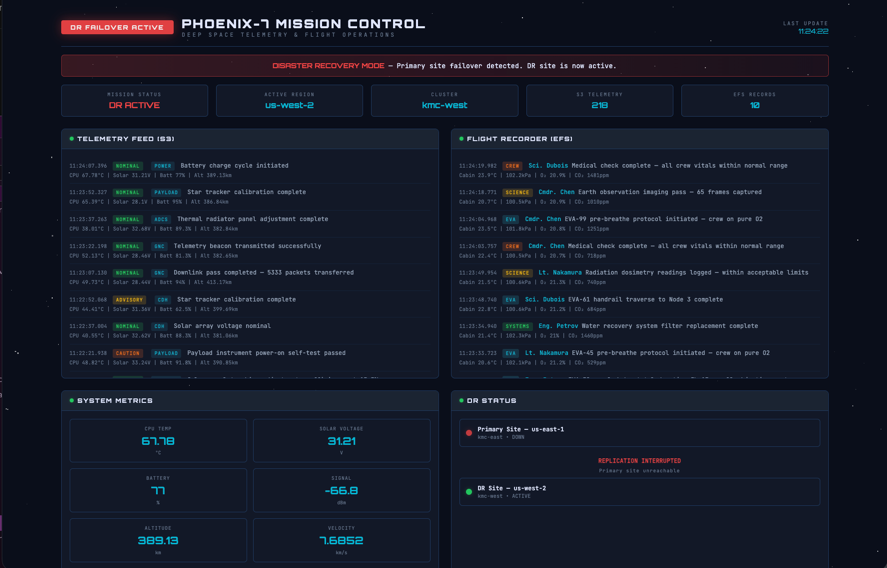
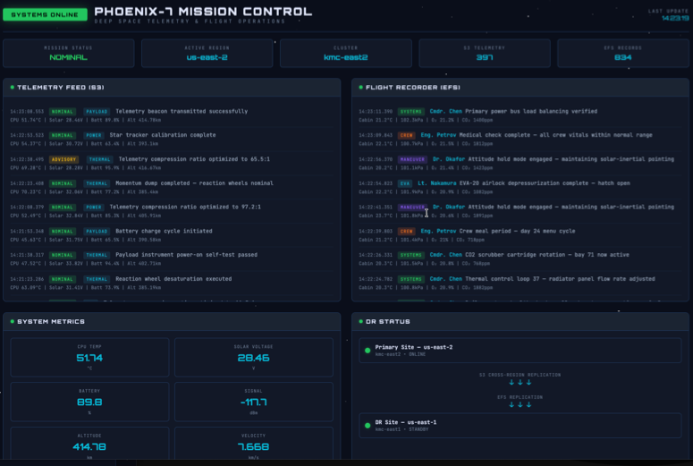

This guide demonstrates a complete disaster recovery (DR) solution for ROSA HCP using OADP (OpenShift API for Data Protection), S3 Cross-Region Replication, EFS replication, and Route 53 DNS failover. You will deploy a demo application, configure backup and restore infrastructure, and walk through two DR scenarios: hot-to-hot failover and cold DR failover.

## Architecture Overview

- **Primary cluster** in Region A (e.g. us-east-1), **DR cluster** in Region B (e.g. us-west-2)
- **S3 with Cross-Region Replication** for application data and OADP backups
- **EFS with Cross-Region Replication** for persistent volume data
- **Route 53 failover routing** with health checks for automatic DNS failover

## Prerequisites

- Two ROSA HCP clusters (one per region), referred to as `PRIMARY_CLUSTER` and `DR_CLUSTER`
- AWS CLI, `oc` CLI, `rosa` CLI, `helm` CLI
- A Route 53 hosted zone (optional, for custom domain failover)
- The AWS EFS CSI Driver Operator installed on both clusters. Follow [Enabling the AWS EFS CSI Driver Operator on ROSA](/experts/rosa/aws-efs/) to set up EFS CSI on each cluster.

## Environment Variables

Set these variables for your environment. You will need values from both clusters.

```bash
export PRIMARY_CLUSTER_NAME=my-primary
export DR_CLUSTER_NAME=my-dr
export AWS_ACCOUNT_ID=$(aws sts get-caller-identity --query Account --output text)
export PRIMARY_REGION=$(rosa describe cluster -c $PRIMARY_CLUSTER_NAME -o json \
  | jq -r '.region.id')
export DR_REGION=$(rosa describe cluster -c $DR_CLUSTER_NAME -o json \
  | jq -r '.region.id')
export AWS_PAGER=""

echo "AWS_ACCOUNT_ID:  $AWS_ACCOUNT_ID"
echo "PRIMARY_REGION:  $PRIMARY_REGION"
echo "DR_REGION:       $DR_REGION"
```

Get the OIDC endpoints for both clusters:

```bash
export OIDC_PRIMARY=$(rosa describe cluster -c $PRIMARY_CLUSTER_NAME -o json \
  | jq -r '.aws.sts.oidc_endpoint_url' | sed 's|https://||')
export OIDC_DR=$(rosa describe cluster -c $DR_CLUSTER_NAME -o json \
  | jq -r '.aws.sts.oidc_endpoint_url' | sed 's|https://||')

echo "OIDC_PRIMARY: $OIDC_PRIMARY"
echo "OIDC_DR:      $OIDC_DR"
```

Get the VPC and subnet info from the machine pools (the worker node subnets are in your account):

```bash
export SUBNET_PRIMARY=$(rosa list machinepools -c $PRIMARY_CLUSTER_NAME -o json \
  | jq -r '.[0].subnet')

export VPC_PRIMARY=$(aws ec2 describe-subnets --subnet-ids $SUBNET_PRIMARY \
  --region $PRIMARY_REGION \
  --query 'Subnets[0].VpcId' --output text)

export SUBNET_DR=$(rosa list machinepools -c $DR_CLUSTER_NAME -o json \
  | jq -r '.[0].subnet')

export VPC_DR=$(aws ec2 describe-subnets --subnet-ids $SUBNET_DR \
  --region $DR_REGION \
  --query 'Subnets[0].VpcId' --output text)

echo "SUBNET_PRIMARY: $SUBNET_PRIMARY"
echo "VPC_PRIMARY:    $VPC_PRIMARY"
echo "SUBNET_DR:      $SUBNET_DR"
echo "VPC_DR:         $VPC_DR"
```

Set the S3 bucket names:

```bash
export APP_BUCKET_PRIMARY=${PRIMARY_CLUSTER_NAME}-app-data
export APP_BUCKET_DR=${DR_CLUSTER_NAME}-app-data
export OADP_BUCKET_PRIMARY=${PRIMARY_CLUSTER_NAME}-oadp-backups
export OADP_BUCKET_DR=${DR_CLUSTER_NAME}-oadp-backups

echo "APP_BUCKET_PRIMARY:  $APP_BUCKET_PRIMARY"
echo "APP_BUCKET_DR:       $APP_BUCKET_DR"
echo "OADP_BUCKET_PRIMARY: $OADP_BUCKET_PRIMARY"
echo "OADP_BUCKET_DR:      $OADP_BUCKET_DR"
```

## Step 1: Create S3 Buckets with Cross-Region Replication

Create the application data and OADP backup buckets in both regions with versioning enabled:

```bash
for PAIR in "$APP_BUCKET_PRIMARY:$PRIMARY_REGION" \
            "$OADP_BUCKET_PRIMARY:$PRIMARY_REGION" \
            "$APP_BUCKET_DR:$DR_REGION" \
            "$OADP_BUCKET_DR:$DR_REGION"; do
  BUCKET=${PAIR%%:*}
  REGION=${PAIR##*:}
  # us-east-1 does not accept a LocationConstraint
  if [ "$REGION" = "us-east-1" ]; then
    aws s3api create-bucket --bucket $BUCKET --region $REGION
  else
    aws s3api create-bucket --bucket $BUCKET --region $REGION \
      --create-bucket-configuration LocationConstraint=$REGION
  fi
  aws s3api put-bucket-versioning \
    --bucket $BUCKET \
    --versioning-configuration Status=Enabled
done
```

Create an IAM role for S3 replication:

```bash
cat <<EOF > /tmp/s3-replication-trust.json
{
  "Version": "2012-10-17",
  "Statement": [{
    "Effect": "Allow",
    "Principal": {"Service": "s3.amazonaws.com"},
    "Action": "sts:AssumeRole"
  }]
}
EOF

aws iam create-role \
  --role-name ${PRIMARY_CLUSTER_NAME}-s3-replication \
  --assume-role-policy-document file:///tmp/s3-replication-trust.json

cat <<EOF > /tmp/s3-replication-policy.json
{
  "Version": "2012-10-17",
  "Statement": [
    {
      "Effect": "Allow",
      "Action": [
        "s3:GetReplicationConfiguration",
        "s3:ListBucket"
      ],
      "Resource": [
        "arn:aws:s3:::${APP_BUCKET_PRIMARY}",
        "arn:aws:s3:::${OADP_BUCKET_PRIMARY}"
      ]
    },
    {
      "Effect": "Allow",
      "Action": [
        "s3:GetObjectVersionForReplication",
        "s3:GetObjectVersionAcl",
        "s3:GetObjectVersionTagging"
      ],
      "Resource": [
        "arn:aws:s3:::${APP_BUCKET_PRIMARY}/*",
        "arn:aws:s3:::${OADP_BUCKET_PRIMARY}/*"
      ]
    },
    {
      "Effect": "Allow",
      "Action": [
        "s3:ReplicateObject",
        "s3:ReplicateDelete",
        "s3:ReplicateTags"
      ],
      "Resource": [
        "arn:aws:s3:::${APP_BUCKET_DR}/*",
        "arn:aws:s3:::${OADP_BUCKET_DR}/*"
      ]
    }
  ]
}
EOF

aws iam put-role-policy \
  --role-name ${PRIMARY_CLUSTER_NAME}-s3-replication \
  --policy-name s3-crr-policy \
  --policy-document file:///tmp/s3-replication-policy.json
```

Configure replication rules for both bucket pairs:

```bash
export REPLICATION_ROLE_ARN=$(aws iam get-role \
  --role-name ${PRIMARY_CLUSTER_NAME}-s3-replication \
  --query 'Role.Arn' --output text)

echo "REPLICATION_ROLE_ARN: $REPLICATION_ROLE_ARN"

cat <<EOF > /tmp/app-replication.json
{
  "Role": "${REPLICATION_ROLE_ARN}",
  "Rules": [{
    "ID": "app-data-crr",
    "Priority": 1,
    "Status": "Enabled",
    "Filter": {},
    "DeleteMarkerReplication": {"Status": "Enabled"},
    "Destination": {
      "Bucket": "arn:aws:s3:::${APP_BUCKET_DR}"
    }
  }]
}
EOF

aws s3api put-bucket-replication \
  --bucket $APP_BUCKET_PRIMARY \
  --replication-configuration file:///tmp/app-replication.json

cat <<EOF > /tmp/oadp-replication.json
{
  "Role": "${REPLICATION_ROLE_ARN}",
  "Rules": [{
    "ID": "oadp-backups-crr",
    "Priority": 1,
    "Status": "Enabled",
    "Filter": {},
    "DeleteMarkerReplication": {"Status": "Enabled"},
    "Destination": {
      "Bucket": "arn:aws:s3:::${OADP_BUCKET_DR}"
    }
  }]
}
EOF

aws s3api put-bucket-replication \
  --bucket $OADP_BUCKET_PRIMARY \
  --replication-configuration file:///tmp/oadp-replication.json
```

## Step 2: Create EFS with Cross-Region Replication

### Create the primary EFS file system

Create a security group for EFS in the primary region:

```bash
export EFS_SG_PRIMARY=$(aws ec2 create-security-group \
  --region $PRIMARY_REGION \
  --group-name ${PRIMARY_CLUSTER_NAME}-efs-dr-sg \
  --description "EFS access for DR demo" \
  --vpc-id $VPC_PRIMARY \
  --query 'GroupId' --output text)

echo "EFS_SG_PRIMARY: $EFS_SG_PRIMARY"
```

Create the EFS file system:

```bash
export PRIMARY_EFS=$(aws efs create-file-system \
  --region $PRIMARY_REGION \
  --encrypted \
  --tags Key=Name,Value=${PRIMARY_CLUSTER_NAME}-dr-efs \
  --query 'FileSystemId' --output text)

echo "PRIMARY_EFS: $PRIMARY_EFS"
```

Create mount targets in all machine pool subnets so pods in any AZ can access EFS:

```bash
for SUBNET in $(rosa list machinepools -c $PRIMARY_CLUSTER_NAME -o json | jq -r '.[].subnet'); do
  aws efs create-mount-target \
    --region $PRIMARY_REGION \
    --file-system-id $PRIMARY_EFS \
    --subnet-id $SUBNET \
    --security-groups $EFS_SG_PRIMARY
done
```

Configure cross-region replication to the DR region:

```bash
aws efs create-replication-configuration \
  --region $PRIMARY_REGION \
  --source-file-system-id $PRIMARY_EFS \
  --destinations "[{\"Region\": \"${DR_REGION}\"}]"
```

Get the replica EFS file system ID:

```bash
export DR_EFS=$(aws efs describe-replication-configurations \
  --region $PRIMARY_REGION \
  --file-system-id $PRIMARY_EFS \
  --query 'Replications[0].Destinations[0].FileSystemId' \
  --output text)

echo "DR_EFS: $DR_EFS"
```

### Configure security groups for the DR region

Create a security group for EFS in the DR region:

```bash
export EFS_SG_DR=$(aws ec2 create-security-group \
  --region $DR_REGION \
  --group-name ${DR_CLUSTER_NAME}-efs-dr-sg \
  --description "EFS access for DR demo" \
  --vpc-id $VPC_DR \
  --query 'GroupId' --output text)

echo "EFS_SG_DR: $EFS_SG_DR"
```

Add NFS ingress rules allowing traffic from the worker security groups on both clusters:

```bash
WORKER_SG_PRIMARY=$(aws ec2 describe-instances \
  --region $PRIMARY_REGION \
  --filters "Name=tag:Name,Values=*${PRIMARY_CLUSTER_NAME}*worker*" \
            "Name=instance-state-name,Values=running" \
  --query 'Reservations[0].Instances[0].SecurityGroups[*].GroupId' \
  --output text | head -1)

aws ec2 authorize-security-group-ingress \
  --region $PRIMARY_REGION \
  --group-id $EFS_SG_PRIMARY \
  --protocol tcp --port 2049 \
  --source-group $WORKER_SG_PRIMARY

WORKER_SG_DR=$(aws ec2 describe-instances \
  --region $DR_REGION \
  --filters "Name=tag:Name,Values=*${DR_CLUSTER_NAME}*worker*" \
            "Name=instance-state-name,Values=running" \
  --query 'Reservations[0].Instances[0].SecurityGroups[*].GroupId' \
  --output text | head -1)

aws ec2 authorize-security-group-ingress \
  --region $DR_REGION \
  --group-id $EFS_SG_DR \
  --protocol tcp --port 2049 \
  --source-group $WORKER_SG_DR

echo "WORKER_SG_PRIMARY: $WORKER_SG_PRIMARY"
echo "WORKER_SG_DR:      $WORKER_SG_DR"
```

### Install the EFS CSI Driver

Install the AWS EFS CSI Driver Operator on both clusters. You can automate this with the provided script or follow the [manual guide](/experts/rosa/aws-efs/).

#### Option A: Automated install (recommended)

Download and run the install script on each cluster. The script prompts for the cluster name and auto-detects the remaining values.

```bash
curl -sLO https://raw.githubusercontent.com/rh-mobb/documentation/main/content/rosa/rosa-oadp-dr/install-efs-csi.sh
chmod +x install-efs-csi.sh
./install-efs-csi.sh
```

Run the script once while logged into the primary cluster, then again while logged into the DR cluster.

#### Option B: Manual install

Follow [Enabling the AWS EFS CSI Driver Operator on ROSA](/experts/rosa/aws-efs/). Complete these sections from the guide on each cluster:

1. **Set environment variables**
1. **Create the IAM policy and role** - creates the IAM role for the CSI driver operator
1. **Install the AWS EFS CSI Driver Operator** - installs the operator via the web console
1. **Create the ClusterCSIDriver** - enables the CSI driver pods
1. **Find worker subnets, VPC, security groups, and IAM roles** - only the worker IAM role name is needed from this section
1. **Attach EFS permissions to the worker role** - attaches the EFS CSI policy to the worker role

Stop after **Attach EFS permissions to the worker role**. Do **not** continue to "Create an EFS security group" or beyond.


Skip the "Create an EFS file system" section. This DR guide handles EFS file system creation, security groups, mount targets, and StorageClass in the steps below.


## Step 3: Create IAM Roles

### Application S3 access roles

Create IAM roles for the demo application to access S3 from both clusters. These roles use IRSA (IAM Roles for Service Accounts) with the ROSA HCP OIDC provider.

Create the S3 access policy:

```bash
cat <<EOF > /tmp/app-s3-policy.json
{
  "Version": "2012-10-17",
  "Statement": [{
    "Effect": "Allow",
    "Action": [
      "s3:GetObject",
      "s3:PutObject",
      "s3:ListBucket",
      "s3:DeleteObject"
    ],
    "Resource": [
      "arn:aws:s3:::${APP_BUCKET_PRIMARY}",
      "arn:aws:s3:::${APP_BUCKET_PRIMARY}/*",
      "arn:aws:s3:::${APP_BUCKET_DR}",
      "arn:aws:s3:::${APP_BUCKET_DR}/*"
    ]
  }]
}
EOF

export APP_S3_POLICY_ARN=$(aws iam create-policy \
  --policy-name ${PRIMARY_CLUSTER_NAME}-dr-demo-s3 \
  --policy-document file:///tmp/app-s3-policy.json \
  --query 'Policy.Arn' --output text)

echo "APP_S3_POLICY_ARN: $APP_S3_POLICY_ARN"
```

Create the role for the primary cluster:

```bash
cat <<EOF > /tmp/app-s3-trust-primary.json
{
  "Version": "2012-10-17",
  "Statement": [{
    "Effect": "Allow",
    "Principal": {
      "Federated": "arn:aws:iam::${AWS_ACCOUNT_ID}:oidc-provider/${OIDC_PRIMARY}"
    },
    "Action": "sts:AssumeRoleWithWebIdentity",
    "Condition": {
      "StringEquals": {
        "${OIDC_PRIMARY}:sub": [
          "system:serviceaccount:dr-demo:s3-writer",
          "system:serviceaccount:dr-demo:dashboard",
          "system:serviceaccount:dr-demo:default"
        ]
      }
    }
  }]
}
EOF

aws iam create-role \
  --role-name ${PRIMARY_CLUSTER_NAME}-dr-demo-s3 \
  --assume-role-policy-document file:///tmp/app-s3-trust-primary.json

aws iam attach-role-policy \
  --role-name ${PRIMARY_CLUSTER_NAME}-dr-demo-s3 \
  --policy-arn $APP_S3_POLICY_ARN
```

Create the role for the DR cluster:

```bash
cat <<EOF > /tmp/app-s3-trust-dr.json
{
  "Version": "2012-10-17",
  "Statement": [{
    "Effect": "Allow",
    "Principal": {
      "Federated": "arn:aws:iam::${AWS_ACCOUNT_ID}:oidc-provider/${OIDC_DR}"
    },
    "Action": "sts:AssumeRoleWithWebIdentity",
    "Condition": {
      "StringEquals": {
        "${OIDC_DR}:sub": [
          "system:serviceaccount:dr-demo:s3-writer",
          "system:serviceaccount:dr-demo:dashboard",
          "system:serviceaccount:dr-demo:default"
        ]
      }
    }
  }]
}
EOF

aws iam create-role \
  --role-name ${DR_CLUSTER_NAME}-dr-demo-s3 \
  --assume-role-policy-document file:///tmp/app-s3-trust-dr.json

aws iam attach-role-policy \
  --role-name ${DR_CLUSTER_NAME}-dr-demo-s3 \
  --policy-arn $APP_S3_POLICY_ARN
```

### OADP/Velero roles

Create IAM roles for OADP on both clusters.

Create the OADP policy:

```bash
cat <<EOF > /tmp/oadp-policy.json
{
  "Version": "2012-10-17",
  "Statement": [
    {
      "Effect": "Allow",
      "Action": [
        "ec2:DescribeVolumes",
        "ec2:DescribeSnapshots",
        "ec2:CreateTags",
        "ec2:CreateVolume",
        "ec2:CreateSnapshot",
        "ec2:DeleteSnapshot"
      ],
      "Resource": "*"
    },
    {
      "Effect": "Allow",
      "Action": [
        "s3:GetObject",
        "s3:DeleteObject",
        "s3:PutObject",
        "s3:AbortMultipartUpload",
        "s3:ListMultipartUploadParts"
      ],
      "Resource": [
        "arn:aws:s3:::${OADP_BUCKET_PRIMARY}/*",
        "arn:aws:s3:::${OADP_BUCKET_DR}/*"
      ]
    },
    {
      "Effect": "Allow",
      "Action": [
        "s3:ListBucket",
        "s3:GetBucketLocation",
        "s3:ListBucketMultipartUploads"
      ],
      "Resource": [
        "arn:aws:s3:::${OADP_BUCKET_PRIMARY}",
        "arn:aws:s3:::${OADP_BUCKET_DR}"
      ]
    }
  ]
}
EOF

export OADP_POLICY_ARN=$(aws iam create-policy \
  --policy-name ${PRIMARY_CLUSTER_NAME}-oadp-velero \
  --policy-document file:///tmp/oadp-policy.json \
  --query 'Policy.Arn' --output text)

echo "OADP_POLICY_ARN: $OADP_POLICY_ARN"
```

Create the OADP role for the primary cluster:

```bash
cat <<EOF > /tmp/oadp-trust-primary.json
{
  "Version": "2012-10-17",
  "Statement": [{
    "Effect": "Allow",
    "Principal": {
      "Federated": "arn:aws:iam::${AWS_ACCOUNT_ID}:oidc-provider/${OIDC_PRIMARY}"
    },
    "Action": "sts:AssumeRoleWithWebIdentity",
    "Condition": {
      "StringEquals": {
        "${OIDC_PRIMARY}:sub": [
          "system:serviceaccount:openshift-adp:openshift-adp-controller-manager",
          "system:serviceaccount:openshift-adp:velero"
        ]
      }
    }
  }]
}
EOF

aws iam create-role \
  --role-name ${PRIMARY_CLUSTER_NAME}-oadp-velero \
  --assume-role-policy-document file:///tmp/oadp-trust-primary.json

aws iam attach-role-policy \
  --role-name ${PRIMARY_CLUSTER_NAME}-oadp-velero \
  --policy-arn $OADP_POLICY_ARN
```

Create the OADP role for the DR cluster:

```bash
cat <<EOF > /tmp/oadp-trust-dr.json
{
  "Version": "2012-10-17",
  "Statement": [{
    "Effect": "Allow",
    "Principal": {
      "Federated": "arn:aws:iam::${AWS_ACCOUNT_ID}:oidc-provider/${OIDC_DR}"
    },
    "Action": "sts:AssumeRoleWithWebIdentity",
    "Condition": {
      "StringEquals": {
        "${OIDC_DR}:sub": [
          "system:serviceaccount:openshift-adp:openshift-adp-controller-manager",
          "system:serviceaccount:openshift-adp:velero"
        ]
      }
    }
  }]
}
EOF

aws iam create-role \
  --role-name ${DR_CLUSTER_NAME}-oadp-velero \
  --assume-role-policy-document file:///tmp/oadp-trust-dr.json

aws iam attach-role-policy \
  --role-name ${DR_CLUSTER_NAME}-oadp-velero \
  --policy-arn $OADP_POLICY_ARN
```

## Step 4: Install OADP on Both Clusters

Repeat these steps on both the primary and DR clusters.

### Install the OADP Operator

Create the `openshift-adp` namespace and install the OADP Operator:

```bash
oc create namespace openshift-adp || true

cat <<'EOF' | oc apply -f -
apiVersion: operators.coreos.com/v1
kind: OperatorGroup
metadata:
  name: adp
  namespace: openshift-adp
spec:
  targetNamespaces:
    - openshift-adp
---
apiVersion: operators.coreos.com/v1alpha1
kind: Subscription
metadata:
  name: redhat-oadp-operator
  namespace: openshift-adp
spec:
  channel: stable
  installPlanApproval: Automatic
  name: redhat-oadp-operator
  source: redhat-operators
  sourceNamespace: openshift-marketplace
EOF
```

Wait for the Operator to install:

```bash
oc get csv -n openshift-adp -w
```

### Create credentials and DataProtectionApplication

Repeat this section on both clusters, using the appropriate values for each.

**On the primary cluster:**

```bash
cat <<EOF > /tmp/oadp-credentials
[default]
role_arn = arn:aws:iam::${AWS_ACCOUNT_ID}:role/${PRIMARY_CLUSTER_NAME}-oadp-velero
web_identity_token_file = /var/run/secrets/openshift/serviceaccount/token
EOF

oc create secret generic cloud-credentials \
  -n openshift-adp \
  --from-file=cloud=/tmp/oadp-credentials
```

```bash
cat <<EOF | oc apply -f -
apiVersion: oadp.openshift.io/v1alpha1
kind: DataProtectionApplication
metadata:
  name: dr-demo-dpa
  namespace: openshift-adp
spec:
  configuration:
    velero:
      defaultPlugins:
        - aws
        - openshift
        - csi
    nodeAgent:
      enable: false
      uploaderType: kopia
  backupLocations:
    - velero:
        provider: aws
        default: true
        objectStorage:
          bucket: ${OADP_BUCKET_PRIMARY}
          prefix: velero
        config:
          region: ${PRIMARY_REGION}
        credential:
          name: cloud-credentials
          key: cloud
EOF
```

**On the DR cluster:**

```bash
cat <<EOF > /tmp/oadp-credentials
[default]
role_arn = arn:aws:iam::${AWS_ACCOUNT_ID}:role/${DR_CLUSTER_NAME}-oadp-velero
web_identity_token_file = /var/run/secrets/openshift/serviceaccount/token
EOF

oc create secret generic cloud-credentials \
  -n openshift-adp \
  --from-file=cloud=/tmp/oadp-credentials
```

```bash
cat <<EOF | oc apply -f -
apiVersion: oadp.openshift.io/v1alpha1
kind: DataProtectionApplication
metadata:
  name: dr-demo-dpa
  namespace: openshift-adp
spec:
  configuration:
    velero:
      defaultPlugins:
        - aws
        - openshift
        - csi
    nodeAgent:
      enable: false
      uploaderType: kopia
  backupLocations:
    - velero:
        provider: aws
        default: true
        objectStorage:
          bucket: ${OADP_BUCKET_DR}
          prefix: velero
        config:
          region: ${DR_REGION}
        credential:
          name: cloud-credentials
          key: cloud
EOF
```

Verify the Backup Storage Location is available on each cluster:

```bash
oc get backupstoragelocation -n openshift-adp
```

The `PHASE` column should show `Available`.

## Step 5: Deploy the Demo Application

Deploy the [Phoenix Mission Control](https://github.com/rh-mobb/phoenix-mission-control) demo application on the primary cluster.

Clone the Helm chart:

```bash
git clone https://github.com/rh-mobb/phoenix-mission-control.git
cd phoenix-mission-control
```

Install the application on the primary cluster:

```bash
helm install phoenix-mission-control ./chart \
  --namespace dr-demo --create-namespace \
  --set region=$PRIMARY_REGION \
  --set clusterName=$PRIMARY_CLUSTER_NAME \
  --set s3.bucket=$APP_BUCKET_PRIMARY \
  --set s3.roleArn=arn:aws:iam::${AWS_ACCOUNT_ID}:role/${PRIMARY_CLUSTER_NAME}-dr-demo-s3 \
  --set efs.fileSystemId=$PRIMARY_EFS \
  --set primaryRegion=$PRIMARY_REGION \
  --set primaryCluster=$PRIMARY_CLUSTER_NAME \
  --set drRegion=$DR_REGION \
  --set drCluster=$DR_CLUSTER_NAME
```

Verify pods are running:

```bash
oc get pods -n dr-demo
```

Access the dashboard:

```bash
oc get route -n dr-demo
```

Open the route URL in your browser to verify the application is working.

## Step 6: Configure Route 53 DNS Failover (Optional)

This step sets up automatic DNS failover using Route 53 health checks and failover routing.

Get the router ELB hostnames from both clusters.

**On the primary cluster:**

```bash
export PRIMARY_ROUTER=$(oc get -n dr-demo route mission-control \
  -o jsonpath='{.status.ingress[0].routerCanonicalHostname}')

echo "PRIMARY_ROUTER: $PRIMARY_ROUTER"
```

**On the DR cluster** (the app is not deployed yet, so get the default router hostname from the ingress controller):

```bash
export DR_ROUTER=$(oc get -n openshift-ingress-operator ingresscontroller/default \
  -o jsonpath='{.status.domain}' | sed 's/^apps\./router-default.apps./')

echo "DR_ROUTER:      $DR_ROUTER"
```

Get the application route hostname on the primary cluster (this is the hostname the health check will probe, not the generic router hostname):

```bash
export PRIMARY_APP_ROUTE=$(oc get -n dr-demo route mission-control \
  -o jsonpath='{.spec.host}')

echo "PRIMARY_APP_ROUTE: $PRIMARY_APP_ROUTE"
```

Create a health check on the primary route:

```bash
export HEALTH_CHECK_ID=$(aws route53 create-health-check \
  --caller-reference "dr-demo-$(date +%s)" \
  --health-check-config \
    Type=HTTPS,FullyQualifiedDomainName=${PRIMARY_APP_ROUTE},Port=443,ResourcePath=/healthz,RequestInterval=10,FailureThreshold=3 \
  --query 'HealthCheck.Id' --output text)

echo "HEALTH_CHECK_ID: $HEALTH_CHECK_ID"
```

Create the PRIMARY failover CNAME record:

```bash
export HOSTED_ZONE_ID=<your-hosted-zone-id>
export DR_DOMAIN=mission-control.example.com

aws route53 change-resource-record-sets \
  --hosted-zone-id $HOSTED_ZONE_ID \
  --change-batch '{
    "Changes": [{
      "Action": "CREATE",
      "ResourceRecordSet": {
        "Name": "'$DR_DOMAIN'",
        "Type": "CNAME",
        "SetIdentifier": "primary",
        "Failover": "PRIMARY",
        "TTL": 60,
        "ResourceRecords": [{"Value": "'$PRIMARY_ROUTER'"}],
        "HealthCheckId": "'$HEALTH_CHECK_ID'"
      }
    }]
  }'
```

Create the SECONDARY failover CNAME record:

```bash
aws route53 change-resource-record-sets \
  --hosted-zone-id $HOSTED_ZONE_ID \
  --change-batch '{
    "Changes": [{
      "Action": "CREATE",
      "ResourceRecordSet": {
        "Name": "'$DR_DOMAIN'",
        "Type": "CNAME",
        "SetIdentifier": "secondary",
        "Failover": "SECONDARY",
        "TTL": 60,
        "ResourceRecords": [{"Value": "'$DR_ROUTER'"}]
      }
    }]
  }'
```

Create a TLS certificate for the custom domain using Let's Encrypt with the `certbot-dns-route53` plugin. This uses DNS validation, so you don't need to expose a web server.

Request the certificate. Certbot uses your AWS credentials to create a temporary TXT record in Route 53 for domain validation:

```bash
certbot certonly \
  --dns-route53 \
  -d $DR_DOMAIN \
  --non-interactive \
  --agree-tos \
  --email your-email@example.com \
  --config-dir /tmp/certbot/config \
  --work-dir /tmp/certbot/work \
  --logs-dir /tmp/certbot/logs
```

Set the certificate paths:

```bash
export CERT_DIR=/tmp/certbot/config/live/$DR_DOMAIN

echo "Certificate: $CERT_DIR/fullchain.pem"
echo "Private key: $CERT_DIR/privkey.pem"
```

Add the custom domain route on both clusters:

```bash
oc create route edge dr-demo-custom \
  --service=mission-control \
  --port=8080 \
  --hostname=$DR_DOMAIN \
  --cert=$CERT_DIR/fullchain.pem \
  --key=$CERT_DIR/privkey.pem \
  -n dr-demo
```

## DR Scenario 1: Hot-to-Hot Failover

Both clusters have running worker nodes. This is the fastest failover scenario.

### Failover (Primary to DR)

Create an OADP backup on the primary cluster:

```bash
export BACKUP_NAME=dr-backup-$(date +%Y%m%d-%H%M)

cat <<EOF | oc apply -f -
apiVersion: velero.io/v1
kind: Backup
metadata:
  name: ${BACKUP_NAME}
  namespace: openshift-adp
spec:
  includedNamespaces:
    - dr-demo
  storageLocation: dr-demo-dpa-1
  defaultVolumesToFsBackup: false
  snapshotVolumes: false
EOF
```

Wait for the backup to complete:

```bash
watch "oc get backup -n openshift-adp $BACKUP_NAME \
  -o jsonpath='{.status.phase}' && echo"
```

Wait until the output shows `Completed`.

Sync the backup to the DR bucket. Although S3 Cross-Region Replication is configured, it is asynchronous and may lag. The manual sync ensures the backup is immediately available for a time-critical restore:

```bash
aws s3 sync \
  s3://$OADP_BUCKET_PRIMARY/velero/backups/$BACKUP_NAME/ \
  s3://$OADP_BUCKET_DR/velero/backups/$BACKUP_NAME/ \
  --source-region $PRIMARY_REGION --region $DR_REGION
```

Delete EFS replication to promote the replica to read-write:


EFS cross-region replicas are read-only while replication is active. The DR cluster's pods cannot write to the replica file system until it is promoted to read-write. Deleting the replication configuration is the only way to promote it; AWS does not have a `promote` API, so you must break the replication link. Once you do that, the DR EFS becomes an independent read-write file system that the restored app can use. During failback, the guide re-establishes replication from primary to DR so it is ready for future failovers.


```bash
aws efs delete-replication-configuration \
  --source-file-system-id $PRIMARY_EFS \
  --region $PRIMARY_REGION
```

Create EFS mount targets on the replica file system in all DR machine pool subnets:

```bash
for SUBNET in $(rosa list machinepools -c $DR_CLUSTER_NAME -o json | jq -r '.[].subnet'); do
  aws efs create-mount-target \
    --region $DR_REGION \
    --file-system-id $DR_EFS \
    --subnet-id $SUBNET \
    --security-groups $EFS_SG_DR
done
```

Create the EFS StorageClass on the DR cluster pointing to the replica file system. The restore will recreate the PVCs, which need this StorageClass to dynamically provision new EFS access points:

```bash
cat <<EOF | oc apply -f -
apiVersion: storage.k8s.io/v1
kind: StorageClass
metadata:
  name: efs-sc
provisioner: efs.csi.aws.com
parameters:
  provisioningMode: efs-ap
  fileSystemId: "${DR_EFS}"
  directoryPerms: "700"
  basePath: /dr-demo
reclaimPolicy: Delete
volumeBindingMode: Immediate
EOF
```

Log in to the DR cluster and wait for Velero to sync the backup (this happens automatically within a minute):

```bash
oc get backup -n openshift-adp
```

Create the restore:

```bash
cat <<EOF | oc apply -f -
apiVersion: velero.io/v1
kind: Restore
metadata:
  name: dr-restore-$(date +%Y%m%d-%H%M)
  namespace: openshift-adp
spec:
  backupName: ${BACKUP_NAME}
  includedNamespaces:
    - dr-demo
  restorePVs: false
  existingResourcePolicy: update
EOF
```

Update the service account annotations and environment variables to use the DR cluster's IAM role and region. The restore brings over the primary cluster's values, which must be updated for the DR cluster's OIDC provider:

```bash
export DR_S3_ROLE_ARN=arn:aws:iam::${AWS_ACCOUNT_ID}:role/${DR_CLUSTER_NAME}-dr-demo-s3

oc annotate sa s3-writer -n dr-demo \
  eks.amazonaws.com/role-arn=$DR_S3_ROLE_ARN --overwrite
oc annotate sa dashboard -n dr-demo \
  eks.amazonaws.com/role-arn=$DR_S3_ROLE_ARN --overwrite

oc set env deployment/telemetry-transmitter -n dr-demo \
  S3_BUCKET=$APP_BUCKET_DR \
  AWS_REGION=$DR_REGION \
  CLUSTER_NAME=$DR_CLUSTER_NAME \
  AWS_ROLE_ARN=$DR_S3_ROLE_ARN

oc set env deployment/mission-control -n dr-demo \
  S3_BUCKET=$APP_BUCKET_DR \
  AWS_REGION=$DR_REGION \
  CLUSTER_NAME=$DR_CLUSTER_NAME \
  AWS_ROLE_ARN=$DR_S3_ROLE_ARN
```

To simulate a primary site failure, disable auto-repair on the primary cluster's machine pool and stop the worker instances:

```bash
for MP in $(rosa list machinepools -c $PRIMARY_CLUSTER_NAME -o json | jq -r '.[].id'); do
  rosa edit machinepool $MP --cluster $PRIMARY_CLUSTER_NAME --autorepair=false
done

WORKER_IDS=($(aws ec2 describe-instances \
  --region $PRIMARY_REGION \
  --filters "Name=tag:Name,Values=*${PRIMARY_CLUSTER_NAME}*worker*" \
            "Name=instance-state-name,Values=running" \
  --query 'Reservations[*].Instances[*].InstanceId' \
  --output text))

aws ec2 stop-instances \
  --instance-ids "${WORKER_IDS[@]}" \
  --region $PRIMARY_REGION
```

Once the primary workers are down, the Route 53 health check will fail and DNS will automatically route traffic to the DR cluster. Open the Mission Control dashboard at your custom domain URL to confirm the failover. The dashboard shows the primary site is down and the DR site is now active:



### Failback (Automatic)

In the hot-to-hot scenario, the primary cluster's application was never deleted - only the worker nodes were stopped. To fail back, restart the primary workers and re-enable auto-repair:

```bash
WORKER_IDS=($(aws ec2 describe-instances \
  --region $PRIMARY_REGION \
  --filters "Name=tag:Name,Values=*${PRIMARY_CLUSTER_NAME}*worker*" \
            "Name=instance-state-name,Values=stopped" \
  --query 'Reservations[*].Instances[*].InstanceId' \
  --output text))

aws ec2 start-instances \
  --instance-ids "${WORKER_IDS[@]}" \
  --region $PRIMARY_REGION
```

Once the workers are running, the application pods resume automatically. The Route 53 health check detects the primary is healthy again and DNS fails back - no OADP restore is needed.


Any data written to the DR EFS during the failover window is not automatically synced back to the primary. When the primary resumes, it uses its original EFS, which does not contain writes made during failover. Re-establishing replication (primary to DR) below will overwrite the DR EFS with the primary's data. In a production environment, you would need to copy or merge DR EFS data back to the primary before this step.


Re-establish EFS replication from primary to DR so it is in place for future failovers. First, disable the overwrite protection that AWS enables on the replica after replication is deleted:

```bash
aws efs update-file-system-protection \
  --file-system-id $DR_EFS \
  --region $DR_REGION \
  --replication-overwrite-protection DISABLED

aws efs create-replication-configuration \
  --region $PRIMARY_REGION \
  --source-file-system-id $PRIMARY_EFS \
  --destinations "[{\"Region\": \"${DR_REGION}\", \"FileSystemId\": \"${DR_EFS}\"}]"
```



## DR Scenario 2: Cold DR (Scaled-Down DR Cluster)

In this scenario the DR cluster's worker nodes are stopped to save costs. Starting the instances is required before the restore can proceed.


This scenario assumes Scenario 1 was completed first, which creates the EFS mount targets and `efs-sc` StorageClass on the DR cluster. If running Scenario 2 independently, create those resources before restoring (see the mount target and StorageClass steps in Scenario 1).


### Setup: Scale Down DR Cluster

Stop the DR cluster worker nodes to reduce costs during normal operation:

```bash
for MP in $(rosa list machinepools -c $DR_CLUSTER_NAME -o json | jq -r '.[].id'); do
  rosa edit machinepool $MP --cluster $DR_CLUSTER_NAME --autorepair=false
done

WORKER_IDS=($(aws ec2 describe-instances \
  --region $DR_REGION \
  --filters "Name=tag:Name,Values=*${DR_CLUSTER_NAME}*worker*" \
            "Name=instance-state-name,Values=running" \
  --query 'Reservations[*].Instances[*].InstanceId' \
  --output text))

aws ec2 stop-instances \
  --instance-ids "${WORKER_IDS[@]}" \
  --region $DR_REGION
```

### Failover to Cold DR

Create an OADP backup on the primary cluster (same as Scenario 1).

Sync the backup to the DR bucket:

```bash
aws s3 sync \
  s3://$OADP_BUCKET_PRIMARY/velero/backups/$BACKUP_NAME/ \
  s3://$OADP_BUCKET_DR/velero/backups/$BACKUP_NAME/ \
  --source-region $PRIMARY_REGION --region $DR_REGION
```

Delete EFS replication to promote the replica to read-write:

```bash
aws efs delete-replication-configuration \
  --source-file-system-id $PRIMARY_EFS \
  --region $PRIMARY_REGION
```

Start the DR worker instances:

```bash
WORKER_IDS=($(aws ec2 describe-instances \
  --region $DR_REGION \
  --filters "Name=tag:Name,Values=*${DR_CLUSTER_NAME}*worker*" \
            "Name=instance-state-name,Values=stopped" \
  --query 'Reservations[*].Instances[*].InstanceId' \
  --output text))

aws ec2 start-instances \
  --instance-ids "${WORKER_IDS[@]}" \
  --region $DR_REGION
```

On the DR cluster, wait for the nodes to become ready:

```bash
oc get nodes -w
```

Wait for Velero to be ready (it will automatically reschedule when the nodes are available):

```bash
oc wait deployment/velero -n openshift-adp --for=condition=Available --timeout=300s
```

Restore from the backup:

```bash
cat <<EOF | oc apply -f -
apiVersion: velero.io/v1
kind: Restore
metadata:
  name: dr-cold-restore-$(date +%Y%m%d-%H%M)
  namespace: openshift-adp
spec:
  backupName: ${BACKUP_NAME}
  includedNamespaces:
    - dr-demo
  restorePVs: false
  existingResourcePolicy: update
EOF
```

Update the service account annotations and environment variables for the DR region:

```bash
export DR_S3_ROLE_ARN=arn:aws:iam::${AWS_ACCOUNT_ID}:role/${DR_CLUSTER_NAME}-dr-demo-s3

oc annotate sa s3-writer -n dr-demo \
  eks.amazonaws.com/role-arn=$DR_S3_ROLE_ARN --overwrite
oc annotate sa dashboard -n dr-demo \
  eks.amazonaws.com/role-arn=$DR_S3_ROLE_ARN --overwrite

oc set env deployment/telemetry-transmitter -n dr-demo \
  S3_BUCKET=$APP_BUCKET_DR \
  AWS_REGION=$DR_REGION \
  CLUSTER_NAME=$DR_CLUSTER_NAME \
  AWS_ROLE_ARN=$DR_S3_ROLE_ARN

oc set env deployment/mission-control -n dr-demo \
  S3_BUCKET=$APP_BUCKET_DR \
  AWS_REGION=$DR_REGION \
  CLUSTER_NAME=$DR_CLUSTER_NAME \
  AWS_ROLE_ARN=$DR_S3_ROLE_ARN
```

DNS failover happens automatically via the Route 53 health check. If you did not configure Route 53, update DNS manually to point to the DR cluster.

## Cleanup

Remove all resources created by this guide.

### Delete the demo application on both clusters

```bash
helm uninstall phoenix-mission-control -n dr-demo 2>/dev/null || true
oc delete namespace dr-demo
```

### Delete the OADP Operator on both clusters

```bash
oc delete dpa dr-demo-dpa -n openshift-adp
oc delete secret cloud-credentials -n openshift-adp
oc delete subscription redhat-oadp-operator -n openshift-adp

OADP_CSV=$(oc get csv -n openshift-adp -o name | grep oadp || true)
if [ -n "$OADP_CSV" ]; then
  oc delete $OADP_CSV -n openshift-adp
fi
```

### Delete S3 buckets

```bash
for BUCKET in $APP_BUCKET_PRIMARY $APP_BUCKET_DR \
              $OADP_BUCKET_PRIMARY $OADP_BUCKET_DR; do
  aws s3 rb s3://$BUCKET --force
done
```

### Delete EFS file systems

Delete any remaining replication configuration, mount targets, access points, and the file systems:

```bash
for EFS_ID in $PRIMARY_EFS $DR_EFS; do
  REGION=$PRIMARY_REGION
  if [ "$EFS_ID" = "$DR_EFS" ]; then REGION=$DR_REGION; fi

  for AP in $(aws efs describe-access-points \
    --file-system-id $EFS_ID --region $REGION \
    --query 'AccessPoints[*].AccessPointId' --output text); do
    aws efs delete-access-point --access-point-id $AP --region $REGION
  done

  for MT in $(aws efs describe-mount-targets \
    --file-system-id $EFS_ID --region $REGION \
    --query 'MountTargets[*].MountTargetId' --output text); do
    aws efs delete-mount-target --mount-target-id $MT --region $REGION
  done

  aws efs delete-file-system --file-system-id $EFS_ID --region $REGION
done
```

### Delete security groups

```bash
aws ec2 delete-security-group --group-id $EFS_SG_PRIMARY --region $PRIMARY_REGION
aws ec2 delete-security-group --group-id $EFS_SG_DR --region $DR_REGION
```

### Delete IAM roles and policies

```bash
for ROLE in ${PRIMARY_CLUSTER_NAME}-dr-demo-s3 \
            ${DR_CLUSTER_NAME}-dr-demo-s3 \
            ${PRIMARY_CLUSTER_NAME}-oadp-velero \
            ${DR_CLUSTER_NAME}-oadp-velero \
            ${PRIMARY_CLUSTER_NAME}-s3-replication; do
  for POLICY_ARN in $(aws iam list-attached-role-policies \
    --role-name $ROLE \
    --query 'AttachedPolicies[*].PolicyArn' \
    --output text 2>/dev/null); do
    aws iam detach-role-policy --role-name $ROLE --policy-arn $POLICY_ARN
  done
  aws iam delete-role-policy --role-name $ROLE \
    --policy-name s3-crr-policy 2>/dev/null || true
  aws iam delete-role --role-name $ROLE 2>/dev/null || true
done

for POLICY_ARN in $APP_S3_POLICY_ARN $OADP_POLICY_ARN; do
  aws iam delete-policy --policy-arn $POLICY_ARN 2>/dev/null || true
done
```

### Delete Route 53 records and health checks (if created)

```bash
aws route53 change-resource-record-sets \
  --hosted-zone-id $HOSTED_ZONE_ID \
  --change-batch '{
    "Changes": [
      {
        "Action": "DELETE",
        "ResourceRecordSet": {
          "Name": "'$DR_DOMAIN'",
          "Type": "CNAME",
          "SetIdentifier": "primary",
          "Failover": "PRIMARY",
          "TTL": 60,
          "ResourceRecords": [{"Value": "'$PRIMARY_ROUTER'"}],
          "HealthCheckId": "'$HEALTH_CHECK_ID'"
        }
      },
      {
        "Action": "DELETE",
        "ResourceRecordSet": {
          "Name": "'$DR_DOMAIN'",
          "Type": "CNAME",
          "SetIdentifier": "secondary",
          "Failover": "SECONDARY",
          "TTL": 60,
          "ResourceRecords": [{"Value": "'$DR_ROUTER'"}]
        }
      }
    ]
  }'

aws route53 delete-health-check --health-check-id $HEALTH_CHECK_ID
```
