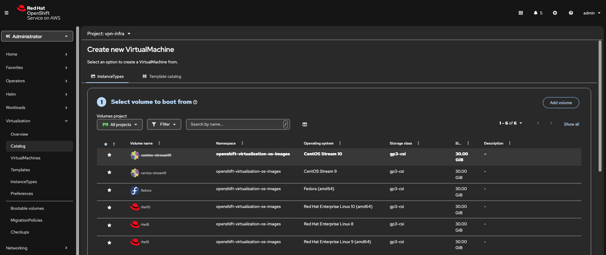
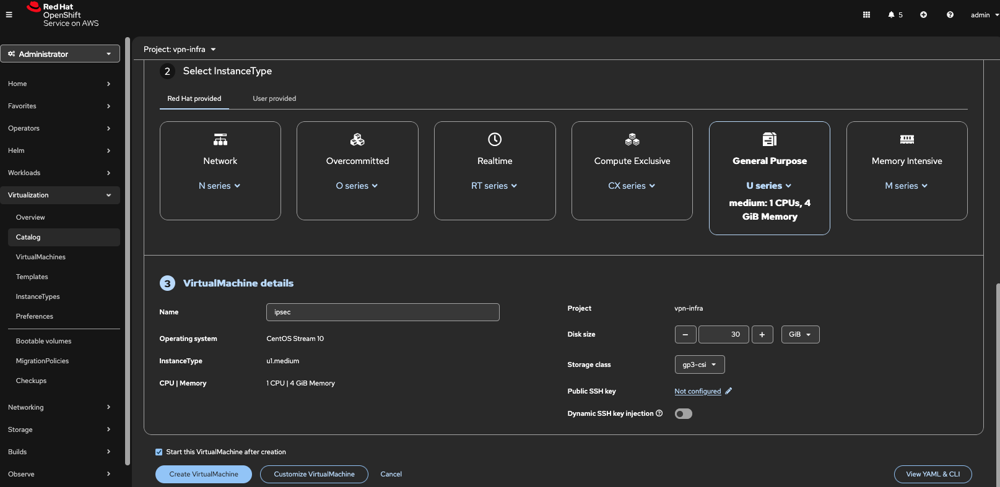
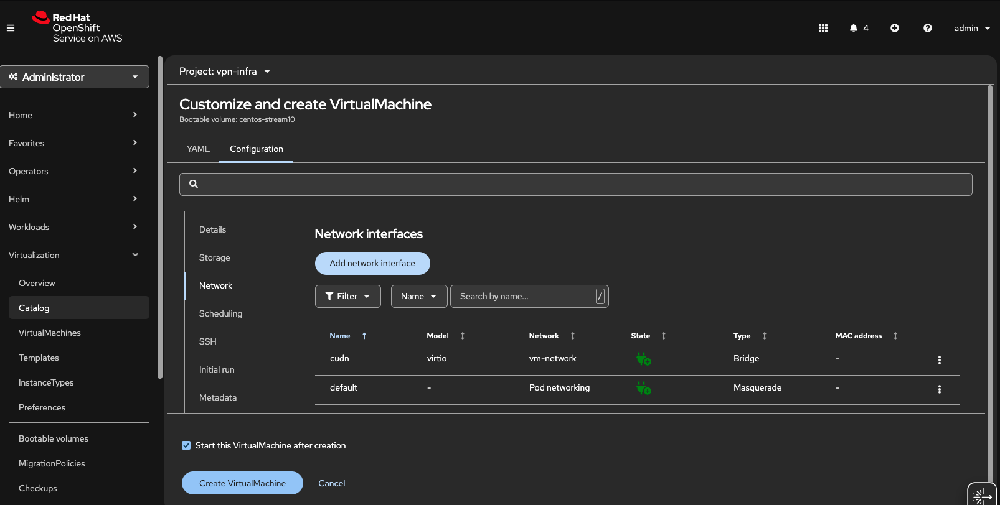

## Introduction

In this guide, we build a [Site-to-Site (S2S) VPN](https://docs.aws.amazon.com/vpn/latest/s2svpn/VPC_VPN.html) so an Amazon [VPC](https://docs.aws.amazon.com/vpc/latest/userguide/what-is-amazon-vpc.html) can reach VM IPs on a ROSA OpenShift Virtualization [User-Defined Network (UDN/CUDN)](https://www.redhat.com/en/blog/user-defined-networks-red-hat-openshift-virtualization)—with **no per-VM NAT or load balancers**. We deploy a small CentOS VM inside the cluster running [Libreswan](https://github.com/libreswan/libreswan) that establishes [IPsec/IKEv2 tunnel](https://aws.amazon.com/what-is/ipsec/) to an AWS [Transit Gateway (TGW)](https://docs.aws.amazon.com/whitepapers/latest/aws-vpc-connectivity-options/aws-transit-gateway.html).

We use [certificate-based authentication](https://docs.aws.amazon.com/vpn/latest/s2svpn/vpn-tunnel-authentication-options.html#certificate): the AWS [Customer Gateway (CGW)](https://docs.aws.amazon.com/vpn/latest/s2svpn/your-cgw.html) references a certificate issued by [ACM Private CA](https://docs.aws.amazon.com/privateca/latest/userguide/PcaWelcome.html), and the cluster VM uses the matching device certificate. Because identities are verified by certificates—not a fixed public IP—the VM can **initiate** the VPN **from behind NAT** (worker → NAT Gateway) and still form stable tunnels.

On AWS, the **TGW** terminates **two redundant tunnels** (two “outside” IPs). We associate the **VPC attachment(s)** and the **VPN attachment** with a TGW route table and enable **propagation** as needed. In the VPC, route tables send traffic for the CUDN prefix (e.g., `192.168.1.0/24`) **to the TGW**. On the cluster side, the CUDN has **IPAM disabled**; you can optionally add a **return route** on other CUDN workloads to use the IPsec VM as next hop when those workloads need to reach the VPC.

NAT specifics: when the VM egresses, it traverses the [NAT Gateway](https://docs.aws.amazon.com/vpc/latest/userguide/vpc-nat-gateway.html). If that NAT uses multiple EIPs, AWS may select different EIPs per connection; this is fine because the VPN authenticates via certificates, not source IP.


<br />


## Why this approach

* **Direct, routable access to VMs**: UDN/CUDN addresses are reachable from the VPC without per-VM LBs or port maps, so existing tools (SSH/RDP/agents) work unmodified.
* **Cert-based, NAT-friendly**: The cluster peer authenticates with a **device certificate**, so it can sit **behind NAT**; no brittle dependence on a static egress IP, and **no PSKs** to manage.I
* **AWS-native and minimally invasive**: Uses TGW, CGW (certificate), and standard route tables—no changes to managed ROSA networking, and no inbound exposure (no NLB/NodePorts) because the **VM initiates**.
* **Scales and hardens cleanly**: Add a second IPsec VM in another AZ for HA, advertise additional prefixes, or introduce dynamic routing later. As BGP-based UDN routing matures, you can evolve without re-architecting.

In short: this is a practical and maintainable way to reach ROSA-hosted VMs **without PSKs**, **without a static public IP**, and **without a fleet of load balancers**.


## 0. Prerequisites

* A classic or HCP ROSA cluster v4.14 and above.
* Bare metal instance machine pool (we are using `m5.metal`, feel free to change as needed), and OpenShift Virtualization operator installed. You can follow Step 2-5 from [this guide](https://cloud.redhat.com/experts/rosa/ocp-virt/basic-gui/) to do so.
* The oc CLI # logged in.


## 1. Create the project and secondary network (CUDN)

Create `vpn-infra` project and the ClusterUserDefinedNetwork (CUDN) object.

```bash
oc new-project vpn-infra || true
cat <<'EOF' | oc apply -f -
apiVersion: k8s.ovn.org/v1
kind: ClusterUserDefinedNetwork
metadata: { name: vm-network }
spec:
  namespaceSelector:
    matchExpressions:
    - key: kubernetes.io/metadata.name
      operator: In
      values: [vpn-infra]
  network:
    layer2: { role: Secondary, ipam: { mode: Disabled } }
    topology: Layer2
EOF
```


## 2. Create the ipsec VM (cert-based IPsec, NAT-initiated)

Go to Red Hat Hybrid Cloud Console. On the navigation bar, select **Virtualization → Catalog**, and from the top, change the **Project** to `vpn-infra`. Then under **Create new VirtualMachine → Instance types → Select volume to boot from**, choose **CentOS Stream 10** (or 9 is fine). 


<br />

Scroll down and name it `ipsec`, and select **Customize VirtualMachine**. 


<br />

Select **Network** on navigation bar. Under **Network interfaces**, click **Add network interface**. Name it `cudn`.


<br />

Then click **Save**. Click **Create VirtualMachine**.


<br />

Wait for a couple of minutes until the VM is running. 

Then click the **Open web console** and log into the VM using the credentials on top of the page. 

Alternatively, you can run this on your CLI terminal: `virtctl console -n vpn-infra ipsec`, and use the same credentials to log into the VM. 

Then as root (run `sudo -i`), let's first identify the non-primary NIC (adjust the selector if needed):

```bash
ip -4 addr show
# or:
NIC=$(nmcli -t -f DEVICE,STATE,TYPE device | awk -F: '$2=="connected" && $3=="ethernet"{print $1}' | tail -n1)
```

Run the following inside the VM to give the second NIC (`cudn`) an IP (note that we are using Centos 10 on this guide, so please adjust the NIC name accordingly if you are using different OS):

```bash
ip -4 a
nmcli con add type ethernet ifname enp2s0 con-name cudn \
  ipv4.addresses 192.168.1.10/24 ipv4.method manual autoconnect yes
nmcli con mod cudn 802-3-ethernet.mtu 1400
nmcli con up cudn
```

Install Libreswan and tools:

```bash
dnf -y install libreswan nss-tools NetworkManager iproute
# optional, if you’ll use the `pki` CLI:
# dnf -y install idm-pki-tools
```

Kernel networking (forwarding & rp_filter):

```bash
cat >/etc/sysctl.d/99-ipsec.conf <<'EOF'
net.ipv4.ip_forward=1
net.ipv4.conf.all.rp_filter=0
net.ipv4.conf.default.rp_filter=0
net.ipv4.conf.all.accept_redirects=0
net.ipv4.conf.default.accept_redirects=0
net.ipv4.conf.all.send_redirects=0
net.ipv4.conf.default.send_redirects=0
EOF
sysctl --system
```

**Firewalld note:** CentOS often has firewalld on. You don’t need inbound allows (the VM initiates), but outbound UDP/500, UDP/4500 must be allowed. 


## 3. Create and import Private CA (ACM PCA) 

Go to AWS Console and select **Certificate Manager**. Then on the left navigation tab, click **AWS Private CAs**, and then click **Create a private CA**.

On the **Create private certificate authority (CA)** page, keep **CA type options** as **Root**. You could leave the default options for simplicity sake. We would recommend, however, give it a name; so for example, here we give the **Common name (CN)** `ca test v0`. Acknowledge the pricing section, and click **Create CA**.

And then on the root CA page, go to the **Action** tab on upper right side, and select **Install CA certificate**. On the **Install root CA certificate** page, you can leave the default configurations as-is and click **Confirm and Install**. The CA should now be **Active**. 

Next, create a subordinate CA by repeating the same thing but on the **CA type options**, choose **Subordinate**, and give it a **Common name (CN)** such as `ca sub test v0`. Confirm pricing and create it.

And similarly, on the subordinate CA page, go to the **Action** tab on top right side, and select **Install CA certificate**. On the **Install subordinate CA certificate** page, under **Select parent CA**, choose the root CA you just created as the **Parent private CA**. And under **Specify the subordinate CA certificate parameters**, for the validity section, pick a date at least 13 months from now. You can leave the rest per default and click **Confirm and Install**. 

Once done, you will have these private CAs like this snippet below:


<br />

Next, go the **AWS Certificate Manager (ACM)** page, and click **Request a certificate** button. On the **Certificate type** page, select **Request a private certificate**, and click **Next**. 

Under **Certificate authority details**, pick the subordinate CA as **Certificate authority**. Then under **Domain names**, pick a **Fully qualified domain name** (FQDN) of your choice. Note that this does not have to be resolvable, we just use it as an identity string for IKE. For example here, we use something like `s2s.vpn.test.mobb.cloud`. You can leave the rest per default, acknowledge **Certificate renewal permissions** and click **Request**. 

Wait for until the status is changed to **Issued**. Then, click **Export** button on top right side. Under **Encryption details**, enter a passphrase of your choice. You will be prompted to input this passphrase in the next steps, so please keep it handy. Acknowledge the billing and click **Generate PEM encoding**. And on the next page, click **Download all**, and finally click **Done**.

Once downloaded you will be seeing 3 files on your local machine: 
- certificate.pem
- certificate_chain.pem
- private_key.pem

Note if the downloaded files are in .txt, rename them into .pem files (you can simply `mv certificate.txt certificate.pem` and so forth for the rest of the files). 

Next, create the PKCS#12 for Libreswan. Feel free to change the name of the cert, but be sure you're on the same directory where the downloaded certificate files are:

```bash
openssl pkcs12 -export \
  -inkey private_key.pem \
  -in certificate.pem \
  -certfile certificate_chain.pem \
  -name test-cert-cgw \
  -out left-cert.p12
```

This will prompt you with passphrase you created before. 

Next, we need **two** files on the VM:

* `left-cert.p12` — the PKCS#12 you just created (leaf + key + chain)
* `certificate_chain.pem` — the full CA chain (subordinate **then** root)

**Option A — using virtctl (easiest):**

```bash
# from your local machine
virtctl scp ./left-cert.p12  vpn-infra/ipsec:/root/left-cert.p12
virtctl scp ./certificate_chain.pem vpn-infra/ipsec:/root/certificate_chain.pem
```

**Option B — using openssl base64:**

```bash
# on local machine
openssl base64 -A -in left-cert.p12          > left-cert.p12.b64
openssl base64 -A -in certificate_chain.pem  > certificate_chain.pem.b64

# in the VM console (paste the contents when prompted)
cat > /root/left-cert.p12.b64 <<'EOF'
<paste left-cert.p12.b64 contents here>
EOF
cat > /root/certificate_chain.pem.b64 <<'EOF'
<paste certificate_chain.pem.b64 contents here>
EOF

# decode in the VM
base64 -d /root/left-cert.p12.b64         > /root/left-cert.p12
base64 -d /root/certificate_chain.pem.b64 > /root/certificate_chain.pem
rm -f /root/*.b64
```

Now run the import:

```bash
sudo -i
set -euxo pipefail

LEAF_P12="/root/left-cert.p12"            # already on the VM
CHAIN="/root/certificate_chain.pem"       # already on the VM
NICK='test-cert-cgw'                      # must match leftcert= in ipsec.conf
P12PASS='change-me'                        # temporary; any value works

# fresh NSS DB
systemctl stop ipsec || true
rm -f /etc/ipsec.d/{cert9.db,key4.db,pkcs11.txt} /etc/ipsec.d/*.db.lock
certutil -N -d sql:/etc/ipsec.d --empty-password
command -v restorecon >/dev/null && restorecon -Rv /etc/ipsec.d || true

# import CA chain with CA trust (split CHAIN into individual certs)
awk 'BEGIN{c=0} /BEGIN CERT/{c++} {print > ("/tmp/ca-" c ".pem")}' "$CHAIN"
for f in /tmp/ca-*.pem; do
  certutil -A -d sql:/etc/ipsec.d \
           -n "$(openssl x509 -noout -subject -in "$f" | sed "s#.*/CN=##")" \
           -t "C,," -a -i "$f"
done

# import device cert + key from PKCS#12 with the nickname the config expects
pk12util -i "$LEAF_P12" -d sql:/etc/ipsec.d -W "$P12PASS" -n "$NICK"

# sanity check
echo "=== NSS certificates ==="; certutil -L -d sql:/etc/ipsec.d
echo "=== NSS keys         ==="; certutil -K -d sql:/etc/ipsec.d

systemctl start ipsec
```

> Tip: ACM’s `certificate_chain.pem` already contains **subordinate + root** in that order. If yours doesn’t, `cat subCA.pem rootCA.pem > certificate_chain.pem` before copying.


## 4. Create a Customer Gateway (CGW) 

Go to AWS console, find **VPC**. Then on the left navigation tab, find **Customer gateways → Create customer gateway**. 

On the **Certificate ARN** section, choose your ACM-PCA–issued cert. You can give it a name like `cgw test v0`, leave the default options, and click **Create customer gateway**.

With certificate-auth, AWS doesn’t require a fixed public IP on the CGW; that’s why this pattern works behind NAT. 


## 5. Create (or use) a Transit Gateway (TGW)

On the left navigation tab, find **Transit Gateways → Create transit gateway**. Give it a name like `tgw test v0`, leave the default options, and click **Create transit gateway**. 

Next, let's attach the VPC(s) to the TGW. On the navigation tab, find **Transit Gateway attachments → Create transit gateway attachment**.

Give it a name like `tgw attach v0`, pick the transit gateway you just created as **Transit gateway ID**, and select **VPC** as the **Attachment type**. And on the **VPC attachment** section, select your VPC ID, and select the private subnet of each subnets you want reachable from the cluster. Once done, click **Create transit gateway attachment**.


<br />


## 6. Create the Site-to-Site VPN (Target = TGW)

Still on VPC console, find → **Site-to-Site VPN connections → Create VPN connection**. 

Give it a name like `vpn test v0`. Choose **Transit gateway** as **Target gateway type** and choose your TGW from the **Transit gateway** dropdown. Then choose **Existing** for **Customer gateway**, and select the certificate-based CGW from previous step from the **Customer gateway ID** options.


<br />

Choose **Static** for **Routing options**. For **Local IPv4 network CIDR**, put in the CUDN CIDR, e.g. `192.168.1.0/24`. And for **Remote IPv4 network CIDR**, put in the cluster's VPC CIDR, e.g. `10.10.0.0/16`.


<br />

Leave default options as-is and click **Create VPN connection**.

At the moment, the status of both tunnels are **Down** and that is completely fine. For now, take note on the tunnels' outside IPs as we will use them for the Libreswan config in the next step. 


<br />


## 7. Creating Libreswan config

Let's go back to the VM now, and as root (and be sure to replace the placeholder values, e.g. cert nickname, tunnels outside IPs):

```bash
sudo tee /etc/ipsec.conf >/dev/null <<'EOF'
config setup
    uniqueids=yes
    plutodebug=none
    nssdir=/etc/ipsec.d

conn %default
    keyexchange=ikev2                 # change to ikev2=insist if you're running Centos/RHEL 9
    authby=rsasig
    fragmentation=yes
    mobike=no
    narrowing=yes

    left=%defaultroute
    leftsubnet=192.168.1.0/24
    leftcert=test-cert-cgw            # change this to your cert nickname
    leftid=%fromcert
    leftsendcert=always

    rightsubnet=10.10.0.0/16
    rightid=%fromcert
    rightca=%same

    ikelifetime=28800s
    ike=aes256-sha2_256;modp2048,aes128-sha2_256;modp2048,aes256-sha1;modp2048,aes128-sha1;modp2048

    salifetime=3600s
    esp=aes256-sha2_256;modp2048,aes128-sha2_256;modp2048,aes256-sha1;modp2048,aes128-sha1;modp2048
    pfs=yes

    dpddelay=10
    retransmit-timeout=60
    auto=add

conn aws-tun-1
    right=44.228.33.1                    # change this to your tunnel 1 outside IP
    auto=start

conn aws-tun-2
    right=50.112.212.105                 # change this to your tunnel 2 outside IP
    auto=start
EOF

sudo systemctl restart ipsec
sudo ipsec auto --delete aws-tun-1 2>/dev/null || true
sudo ipsec auto --delete aws-tun-2 2>/dev/null || true
sudo ipsec auto --add aws-tun-1
sudo ipsec auto --add aws-tun-2
sudo ipsec auto --up aws-tun-1
sudo ipsec auto --up aws-tun-2
```

Next, run `ipsec status` and now you should see something like **Total IPsec connections: loaded 4, routed 1, active 1** which means that your tunnel is up. 

And so now if you go back to the VPN console you will see one of the tunnel is up as follows:


<br />


## 8. Associate VPC to TGW route tables

On VPC navigation tab, find **Transit gateway route tables**, and go to **Propagations** tab, and ensure that both VPC and VPN resources/attachments are **Enabled**.


<br />


Then click **Routes** tab, look under **Routes → Create static route**. For **CIDR**, put in CUDN CIDR `192.168.1.0/24` and under **Choose attachment**, pick the **VPN attachment** and click **Create static route**.


<br />


Wait for a minute and it should now look like this:


<br />


## 9. Modify VPC route tables

Next, we will add route to the CUDN targeting our CGW for each VPC that should reach the cluster overlay. On the navigation tab, find **Route tables**. Filter it based on your VPC ID.

Select one of the private subnets. Under **Routes** tab, go to **Edit routes**. Click **Add route**. For **Destination**, put in CUDN subnet (e.g., `192.168.1.0/24`), and as **Target** pick **Transit Gateway** and select the TGW you created, and click **Save changes**.

Repeat this with other private/public subnets you want to route CUDN to as needed.


## 10. Security groups and NACLs

On the navigation tab, find **Security groups**. Filter it based on your VPC ID.

Select one of the worker nodes' security groups. Under **Inbound rules**, go to **Edit inbound rules**. Click **Add rule**. For **Type**, pick **All ICMP - IPv4**, and as **Source**, put in the CUDN subnet (e.g., `192.168.1.0/24`), and click **Save rules**. 

Optionally, you can also add rule for TCP 22/80 from the CUDN for SSH/curl tests.

Be sure to also check **NACLs** on the VPC subnets to allow ICMP/TCP from `192.168.1.0/24` both ways.


## 11. Ping test

Now that everything is set, let's try to ping from VM to an EC2 instance in the VPC. Pick an EC2 instance, e.g. bastion host, or bare metal instance, etc. to do so. 

Note that if you launch a throwaway EC2 for testing, **private subnet** is safer (no public IP). Attach the **same TGW RTB**, and use **Session Manager** instead of a keypair if you want to skip inbound SSH. Security group needs **ICMP** (and optionally TCP/22) **from 192.168.1.0/24**.

Take a note on the private IPv4 address. Then on the VM console run:

```bash
ping -I <CUDN-IP> -c3 <EC2-private-IP>
```

And then from the EC2 instance:

```bash
ping -c3 <CUDN-IP>
```


## 12. Optional: Route-based (VTI) IPsec

**Why do this?**

* **Scale & simplicity:** with VTIs you route like normal Linux—no per-subnet policy rules. Adding more VPC CIDRs later is just adding routes.
* **Better availability:** you can ECMP two tunnels (one per TGW endpoint). That gives fast failover on the *tunnel* path. (Note: this is **not** AZ-resilient if you still have only one VM.)


### 12.1. Replace policy-based with route-based config

```bash
sudo tee /etc/ipsec.conf >/dev/null <<'EOF'
config setup
    uniqueids=yes
    plutodebug=none
    nssdir=/etc/ipsec.d

conn %default
    keyexchange=ikev2
    authby=rsasig
    fragmentation=yes
    mobike=no
    narrowing=yes

    left=%defaultroute
    leftsendcert=always
    leftcert=test-cert-cgw
    leftid=%fromcert
    rightid=%fromcert
    rightca=%same

    # route-based: allow any, routing decides what actually traverses the tunnel
    leftsubnet=0.0.0.0/0
    rightsubnet=0.0.0.0/0

    ikelifetime=28800s
    ike=aes256-sha2_256;modp2048,aes128-sha2_256;modp2048
    salifetime=3600s
    esp=aes256-sha2_256;modp2048,aes128-sha2_256;modp2048
    pfs=yes

    dpddelay=10
    retransmit-timeout=60

conn tgw-tun-1
    also=%default
    right=44.228.33.1
    mark=0x1/0xffffffff
    reqid=1

    vti-interface=ipsec10
    vti-routing=yes
    vti-shared=no
    leftvti=169.254.218.106/30          # change this to your <CGW inside IP>/30
    rightvti=169.254.218.105/30         # change this to your <AWS inside IP>/30

    auto=start

conn tgw-tun-2
    also=%default
    right=50.112.212.105
    mark=0x2/0xffffffff
    reqid=2

    vti-interface=ipsec1
    vti-routing=yes
    vti-shared=no
    leftvti=169.254.86.186/30
    rightvti=169.254.86.185/30

    auto=start
EOF
```

If you haven’t already, import your certs to the VM per Step 3 above.


### 12.2. System tunables for route-based IPsec

> Two key rules:
>
> 1. **VTIs:** `disable_policy=1`, `disable_xfrm=0` (encrypt on the VTI, but don’t do policy lookups).
> 2. **Physical NICs:** `disable_policy=1`, `disable_xfrm=1` (never apply XFRM on the underlay).

```bash
# apply & (re)start
systemctl restart ipsec

# VTIs: encryption happens here; no policy lookup
sysctl -w net.ipv4.conf.ipsec10.disable_policy=1
sysctl -w net.ipv4.conf.ipsec10.disable_xfrm=0
sysctl -w net.ipv4.conf.ipsec1.disable_policy=1
sysctl -w net.ipv4.conf.ipsec1.disable_xfrm=0

# underlay NICs: never transform/encap here
sysctl -w net.ipv4.conf.enp1s0.disable_policy=1
sysctl -w net.ipv4.conf.enp1s0.disable_xfrm=1
sysctl -w net.ipv4.conf.enp2s0.disable_policy=1
sysctl -w net.ipv4.conf.enp2s0.disable_xfrm=1

# forwarding + relaxed reverse-path checks (asymmetric return possible with ECMP)
sysctl -w net.ipv4.ip_forward=1
sysctl -w net.ipv4.conf.all.rp_filter=0
sysctl -w net.ipv4.conf.enp1s0.rp_filter=0
sysctl -w net.ipv4.conf.enp2s0.rp_filter=0
sysctl -w net.ipv4.conf.ipsec10.rp_filter=0
sysctl -w net.ipv4.conf.ipsec1.rp_filter=0

# make sure VTIs are up (they should come up automatically, but just in case)
ip link set ipsec10 up
ip link set ipsec1 up

# (optional, NAT-T + ESP overhead can require lower MTU, hence this tweak)
ip link set ipsec10 mtu 1436 || true
ip link set ipsec1  mtu 1436 || true
```

Optionally, you can also persist VTI sysctls to survive reboots:

```bash
cat >/etc/sysctl.d/99-ipsec-vti.conf <<'EOF'
net.ipv4.ip_forward=1
net.ipv4.conf.all.rp_filter=0
net.ipv4.conf.enp1s0.rp_filter=0
net.ipv4.conf.enp2s0.rp_filter=0
net.ipv4.conf.ipsec10.rp_filter=0
net.ipv4.conf.ipsec1.rp_filter=0
net.ipv4.conf.enp1s0.disable_policy=1
net.ipv4.conf.enp1s0.disable_xfrm=1
net.ipv4.conf.enp2s0.disable_policy=1
net.ipv4.conf.enp2s0.disable_xfrm=1
net.ipv4.conf.ipsec10.disable_policy=1
net.ipv4.conf.ipsec10.disable_xfrm=0
net.ipv4.conf.ipsec1.disable_policy=1
net.ipv4.conf.ipsec1.disable_xfrm=0
EOF
sysctl --system
```


### 12.3. Route VPC CIDRs over the VTIs (ECMP)

```bash
# replace 10.10.0.0/16 with your VPC CIDR(s)
ip route replace 10.10.0.0/16 \
  nexthop dev ipsec10 weight 1 \
  nexthop dev ipsec1  weight 1
```


### 12.4. Quick verification

```bash
# path should be via a VTI
ip route get <EC2-private-IP> from <CUDN-IP>

# ICMP test (use one of your EC2 private IPs)
ping -I <CUDN-IP> -c3 <EC2-private-IP>

# SAs should show increasing packets/bytes when you ping/ssh
ip -s xfrm state | sed -n '1,160p'

# optional: confirm tunnel IKE/Child SAs are up
ipsec status | grep -E "established|routing|vti-interface"
```

And if you go to VPN console:


<br />


#### Availability footnote

ECMP across **two tunnels on one VM** protects against a single TGW endpoint flap and gives smooth failover, but it’s not AZ-resilient. For true HA, run **two IPsec VMs** in different AZs (each with both tunnels) behind a health-checked on-prem router, or a pair of routers that can prefer the healthy VM.