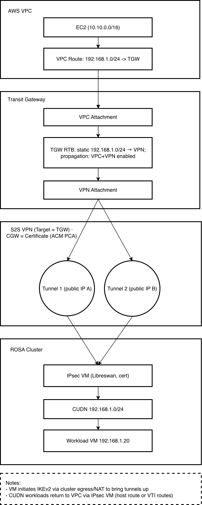

## Introduction

In this guide, we build a [Site-to-Site (S2S) VPN](https://docs.aws.amazon.com/vpn/latest/s2svpn/VPC_VPN.html) so an Amazon [VPC](https://docs.aws.amazon.com/vpc/latest/userguide/what-is-amazon-vpc.html) can reach VM IPs on a ROSA OpenShift Virtualization [User-Defined Network (UDN/CUDN)](https://www.redhat.com/en/blog/user-defined-networks-red-hat-openshift-virtualization)—with **no per-VM NAT or load balancers**. We deploy a small CentOS VM inside the cluster running [Libreswan](https://github.com/libreswan/libreswan) that establishes [IPsec/IKEv2 tunnel](https://aws.amazon.com/what-is/ipsec/) to an AWS [Transit Gateway (TGW)](https://docs.aws.amazon.com/whitepapers/latest/aws-vpc-connectivity-options/aws-transit-gateway.html).

We use [certificate-based authentication](https://docs.aws.amazon.com/vpn/latest/s2svpn/vpn-tunnel-authentication-options.html#certificate): the AWS [Customer Gateway (CGW)](https://docs.aws.amazon.com/vpn/latest/s2svpn/your-cgw.html) references a certificate issued by [ACM Private CA](https://docs.aws.amazon.com/privateca/latest/userguide/PcaWelcome.html), and the cluster VM uses the matching device certificate. Because identities are verified by certificates—not a fixed public IP—the VM can **initiate** the VPN **from behind NAT** (worker → NAT Gateway) and still form stable tunnels.

On AWS, the **TGW** terminates **two redundant tunnels** (two “outside” IPs). We associate the **VPC attachment(s)** and the **VPN attachment** with a TGW route table and enable **propagation** as needed. In the VPC, route tables send traffic for the CUDN prefix (e.g., `192.168.1.0/24`) **to the TGW**. On the cluster side, the CUDN has **IPAM disabled**; you can optionally add a **return route** on other CUDN workloads to use the IPsec VM as next hop when those workloads need to reach the VPC.

NAT specifics: when the VM egresses, it traverses the [NAT Gateway](https://docs.aws.amazon.com/vpc/latest/userguide/vpc-nat-gateway.html). If that NAT uses multiple EIPs, AWS may select different EIPs per connection; this is fine because the VPN authenticates via certificates, not source IP.


<br />

We ensure this approach is highly available by provisioning a second VM that can take over the IPSec connection from the first one in the event of failure. We use [Keepalived](https://www.redhat.com/en/blog/keepalived-basics) to handle leader election and to ensure that the active VM is also assigned a virtual IP address, which other VMs in the cluster use as a next-hop for routes to the VPC.


## Why this approach

* **Direct, routable access to VMs**: UDN/CUDN addresses are reachable from the VPC without per-VM LBs or port maps, so existing tools (SSH/RDP/agents) work unmodified.
* **Cert-based, NAT-friendly**: The cluster peer authenticates with a **device certificate**, so it can sit **behind NAT**; no brittle dependence on a static egress IP, and **no PSKs** to manage.
* **AWS-native and minimally invasive**: Uses TGW, CGW (certificate), and standard route tables—no changes to managed ROSA networking, and no inbound exposure (no NLB/NodePorts) because the **VM initiates**.
* **High availability**: In the event that the node or availability zone hosting the IPSec VM goes down, a second node can take over both the VPN tunnel and the next-hop IP address that other VMs in the cluster use. Experiments have found a failover recovery time of about 5 seconds. 
* **Scales and hardens cleanly**: Advertise additional prefixes, or introduce dynamic routing later. As BGP-based UDN routing matures, you can evolve without re-architecting.

In short: this is a practical and maintainable way to reach ROSA-hosted VMs **without PSKs**, **without a static public IP**, and **without a fleet of load balancers**.


## 0. Prerequisites

* A classic or HCP ROSA cluster v4.18 and above.
* Bare metal instance machine pool (we are using `m5.metal`, feel free to change as needed), and OpenShift Virtualization operator installed. You can follow Step 2-5 from [this guide](https://cloud.redhat.com/experts/rosa/ocp-virt/basic-gui/) to do so.
* The oc CLI # logged in.
* A CIDR block that will be used for the VM network inside the cluster and should not overlap with CIDRs used in your VPC or networks connected to your VPC. We use `192.168.1.0/24` in this guide.


## 1. Create Private CA and Certificates (ACM PCA) 

Go to AWS Console and select **Certificate Manager**. Then on the left navigation tab, click **AWS Private CAs**, and then click **Create a private CA**.

On the **Create private certificate authority (CA)** page, keep **CA type options** as **Root**. You could leave the default options for simplicity sake. We would recommend, however, give it a name; so for example, here we give the **Common name (CN)** `ca test v0`. Acknowledge the pricing section, and click **Create CA**.

And then on the root CA page, go to the **Action** tab on upper right side, and select **Install CA certificate**. On the **Install root CA certificate** page, you can leave the default configurations as-is and click **Confirm and Install**. The CA should now be **Active**.

Next, create a subordinate CA by repeating the same thing but on the **CA type options**, choose **Subordinate**, and give it a **Common name (CN)** such as `ca sub test v0`. Confirm pricing and create it.

And similarly, on the subordinate CA page, go to the **Action** tab on top right side, and select **Install CA certificate**. On the **Install subordinate CA certificate** page, under **Select parent CA**, choose the root CA you just created as the **Parent private CA**. And under **Specify the subordinate CA certificate parameters**, for the validity section, pick a date at least 13 months from now. You can leave the rest per default and click **Confirm and Install**.

Once done, you will have these private CAs like this snippet below:


<br />

Next, go the **AWS Certificate Manager (ACM)** page, and click **Request a certificate** button. On the **Certificate type** page, select **Request a private certificate**, and click **Next**.

Under **Certificate authority details**, pick the subordinate CA as **Certificate authority**. Then under **Domain names**, pick a **Fully qualified domain name** (FQDN) of your choice. Note that this does not have to be resolvable, we just use it as an identity string for IKE. For example here, we use something like `s2s.vpn.test.mobb.cloud`. You can leave the rest per default, acknowledge **Certificate renewal permissions** and click **Request**.

Wait for until the status is changed to **Issued**. Then, click **Export** button on top right side. Under **Encryption details**, enter a passphrase of your choice. You will be prompted to input this passphrase in the next steps, so please keep it handy. Acknowledge the billing and click **Generate PEM encoding**. And on the next page, click **Download all**, and finally click **Done**.

Once downloaded you will be seeing 3 files on your local machine:
- certificate.pem
- certificate_chain.pem
- private_key.pem

Note if the downloaded files are in .txt, rename them into .pem files (you can simply `mv certificate.txt certificate.pem` and so forth for the rest of the files).

Next, create the PKCS#12 for Libreswan. Feel free to change the name of the cert, but be sure you're on the same directory where the downloaded certificate files are:

```bash
openssl pkcs12 -export \
  -inkey private_key.pem \
  -in certificate.pem \
  -certfile certificate_chain.pem \
  -name test-cert-cgw \
  -out left-cert.p12
```

This will prompt you with passphrase you created before.

You now have the following files, which you should save for a future step.

* `left-cert.p12` — the PKCS#12 you just created (leaf + key + chain)
* `certificate_chain.pem` — the full CA chain (subordinate **then** root)


## 2. Create a Customer Gateway (CGW) 

Go to AWS console, find **VPC**. Then on the left navigation tab, find **Customer gateways → Create customer gateway**.

On the **Certificate ARN** section, choose your ACM-PCA–issued cert. You can give it a name like `cgw test v0`, leave the default options, and click **Create customer gateway**.

With certificate-auth, AWS doesn’t require a fixed public IP on the CGW; that’s why this pattern works behind NAT.


## 3. Create (or use) a Transit Gateway (TGW)

Note that this setup also works (and tested) with Virtual Gateway (VGW). So when to choose VGW or TGW:

- Use VGW when you only need VPN to one VPC, don’t require IPv6 over the VPN, and want the lowest ongoing cost (no TGW hourly/attachment fees; you will just pay standard Site-to-Site VPN hourly + data transfer).

- Use TGW when you need a hub-and-spoke to many VPCs/accounts, inter-VPC routing, or IPv6 VPN. Expect extra charges such as TGW hourly, per-attachment hourly, and per-GB data processing, on top of VPN. Also add a one-line cost link.

Continue with this step if you choose TGW.

On the left navigation tab, find **Transit Gateways → Create transit gateway**. Give it a name like `tgw test v0`, leave the default options, and click **Create transit gateway**.

Next, let's attach the VPC(s) to the TGW. On the navigation tab, find **Transit Gateway attachments → Create transit gateway attachment**

Give it a name like `tgw attach v0`, pick the transit gateway you just created as **Transit gateway ID**, and select **VPC** as the **Attachment type**. And on the **VPC attachment** section, select your VPC ID, and select the private subnet of each subnets you want reachable from the cluster. Once done, click **Create transit gateway attachment**.


<br />


## 4. Create the Site-to-Site VPN (Target = TGW)

Still on VPC console, find → **Site-to-Site VPN connections → Create VPN connection**.

Give it a name like `vpn test v0`. Choose **Transit gateway** as **Target gateway type** and choose your TGW from the **Transit gateway** dropdown. Then choose **Existing** for **Customer gateway**, and select the certificate-based CGW from previous step from the **Customer gateway ID** options.


<br />

Choose **Static** for **Routing options**. For **Local IPv4 network CIDR**, put in the CUDN CIDR, e.g. `192.168.1.0/24`. And for **Remote IPv4 network CIDR**, put in the cluster's VPC CIDR, e.g. `10.10.0.0/16`.


<br />

Leave default options as-is and click **Create VPN connection**.

At the moment, the status of both tunnels are **Down** and that is completely fine. For now, take note on the tunnels' outside IPs as we will use them for the Libreswan config in a future step.


<br />


## 5. Security groups and NACLs

On the navigation tab, find **Security groups**. Filter it based on your VPC ID.

Select one of the worker nodes' security groups. Under **Inbound rules**, go to **Edit inbound rules**. Click **Add rule**. For **Type**, pick **All ICMP - IPv4**, and as **Source**, put in the CUDN subnet (e.g., `192.168.1.0/24`), and click **Save rules**.

Optionally, you can also add rule for TCP 22/80 from the CUDN for SSH/curl tests.

Be sure to also check **NACLs** on the VPC subnets to allow ICMP/TCP from `192.168.1.0/24` both ways.


## 6. Create the project and secondary network (CUDN)

On your ROSA cluster, create `vpn-infra` project and the ClusterUserDefinedNetwork (CUDN) object.

```bash
oc new-project vpn-infra || true
cat <<'EOF' | oc apply -f -
apiVersion: k8s.ovn.org/v1
kind: ClusterUserDefinedNetwork
metadata: { name: vm-network }
spec:
  namespaceSelector:
    matchExpressions:
    - key: kubernetes.io/metadata.name
      operator: In
      values: [vpn-infra]
  network:
    layer2: { role: Secondary, ipam: { mode: Disabled } }
    topology: Layer2
EOF
```

Disabling IPAM also disables the network enforcing source/destination IP security. This is needed to allow each ipsec VM below to act as a gateway to pass traffic for other IP addresses. (Note that this helps with the VM's being able to pass a virtual IP address back and forth, but would be needed even without the VIP for gateway routing to work.)


## 7. Create a set of IPSec VMs

We will use a pair of VMs within your ROSA cluster to establish the other side of the IPSec tunnel and act as gateways between the CUDN and the tunnel. One VM at a time will have the active IPSec connection and have the gateway IP address. The other, scheduled on a worker node in a different Availability Zone, will be able to take over if the primary VM fails (for example, if the AZ has an outage.)

First, create a Secret that will be used to configure password and SSH auth for the VMs. Change the `changethis` to the password you want to use to log into the `centos` user on the VMs' consoles. Change the list of `ssh_authorized_keys` to a list of SSH public keys you wish to be able to log in as the `centos` user.

```bash
cat <<'EOF' | oc apply -f -
apiVersion: v1
kind: Secret
metadata:
  name: cloud-init-ipsec-gw
  namespace: vpn-infra
stringData:
  userData: |
    #cloud-config
    user: centos
    password: changethis
    chpasswd: { expire: False }
    ssh_pwauth: True
    ssh_authorized_keys:
      - ssh-ed25519 AAAAyourkey
EOF
```

Now, create the virtual machines themselves.

These examples use CentOS Stream 10 as the distribution, but will work with trivial changes on RHEL 9/10 or CentOS Stream 9 as well. You can change this using the spec.DataVolumeTemplates[0].spec.sourceRef object.

The VMs are configured with two network interfaces. The first connects to the pod network to allow for Services, `virtctl ssh`, and egress to whatever networks pods in your cluster can normally egress to (for example, the Internet). The second connects to the cudn so that these VMs can act as gateways for the other VMs on that cudn.

```bash
cat <<'EOF' | oc apply -f -
apiVersion: kubevirt.io/v1
kind: VirtualMachine
metadata:
  name: ipsec-a
  namespace: vpn-infra
spec:
  dataVolumeTemplates:
  - metadata:
      creationTimestamp: null
      name: ipsec-a-volume
    spec:
      sourceRef:
        kind: DataSource
        name: centos-stream10
        namespace: openshift-virtualization-os-images
      storage:
        resources:
          requests:
            storage: 30Gi
  instancetype:
    kind: virtualmachineclusterinstancetype
    name: u1.medium
  preference:
    kind: virtualmachineclusterpreference
    name: centos.stream10
  runStrategy: Always
  template:
    metadata:
      labels:
        app: ipsec-gw  # Label for anti-affinity
    spec:
      affinity:
        podAntiAffinity:
          requiredDuringSchedulingIgnoredDuringExecution:
          - labelSelector:
              matchExpressions:
              - key: app
                operator: In
                values:
                - ipsec-gw
            topologyKey: topology.kubernetes.io/zone
      domain:
        devices:
          interfaces:
          - name: default
            masquerade: {}
          - name: cudn
            bridge: {}
      networks:
      - name: default
        pod: {}
      - name: cudn
        multus:
          networkName: vm-network
      volumes:
      - dataVolume:
          name: ipsec-a-volume
        name: rootdisk
      - cloudInitNoCloud:
          secretRef:
            name: cloud-init-ipsec-gw
        name: cloud-init
---
apiVersion: kubevirt.io/v1
kind: VirtualMachine
metadata:
  name: ipsec-b
  namespace: vpn-infra
spec:
  dataVolumeTemplates:
  - metadata:
      creationTimestamp: null
      name: ipsec-b-volume
    spec:
      sourceRef:
        kind: DataSource
        name: centos-stream10
        namespace: openshift-virtualization-os-images
      storage:
        resources:
          requests:
            storage: 30Gi
  instancetype:
    kind: virtualmachineclusterinstancetype
    name: u1.medium
  preference:
    kind: virtualmachineclusterpreference
    name: centos.stream10
  runStrategy: Always
  template:
    metadata:
      labels:
        app: ipsec-gw # Label for anti-affinity
    spec:
      affinity:
        podAntiAffinity:
          requiredDuringSchedulingIgnoredDuringExecution:
          - labelSelector:
              matchExpressions:
              - key: app
                operator: In
                values:
                - ipsec-gw
            topologyKey: topology.kubernetes.io/zone
      domain:
        devices:
          interfaces:
          - name: default
            masquerade: {}
          - name: cudn
            bridge: {}
      networks:
      - name: default
        pod: {}
      - name: cudn
        multus:
          networkName: vm-network
      volumes:
      - dataVolume:
          name: ipsec-b-volume
        name: rootdisk
      - cloudInitNoCloud:
          secretRef:
            name: cloud-init-ipsec-gw
        name: cloud-init
EOF
```
Wait for a couple of minutes until the VMs are running.


## 8. Configure the ipsec VMs

Follow the instructions in this section for the `ipsec-a` VM, and then follow them again for the `ipsec-b` VM. We want both VMs to be nearly identical to allow for failover scenarios. The instructions will call out anything that needs to be different on the two VMs.

### 8.1 Log into the VM

Then click the **Open web console** and log into the VM using the credentials you specified when creating the VMs.

Alternatively, you can run this on your CLI terminal: `virtctl console -n vpn-infra ipsec-a` (or `ipsec-b`), and use the same credentials to log into the VM.

### 8.2 Install software

We will use libreswan as our IPSec client, and keepalived to manage failover between the two VMs.

```bash
sudo dnf -y install libreswan nss-tools NetworkManager iproute keepalived
```

Let's first identify the ifname of the non-primary NIC. Depending on OS, this may either be disabled, or enabled with no IP address assigned.

```bash
nic -t || ip addr show
```

### 8.3 Configure cudn network interface

We will next need to set up the network interface connected to the CUDN.

We will give the interface an IP address (`VM_CUDN_IP`). This address should be **different** on `ipsec-a` and `ipsec-b`. For this example, we will use `192.168.1.10` for `ipsec-a` and `192.168.1.11` for `ipsec-b`.

We will also configure a route to the VPC's CIDR via a separate virtual IP (`GATEWAY_VIRTUAL_IP`). Keepalived will automatically assign this virtual IP to whichever ipsec VM is currently the active one.

Run the following, replacing the variables as necessary.

```bash
INTERFACE_NAME=enp2s0 # Change this to the name of the interfae in the previous command
VM_CUDN_IP=192.168.1.XX # Should be **different* for ipsec-a and ipsec-b
CUDN_SUBNET_MASK=/24
GATEWAY_VIRTUAL_IP=192.168.1.1 # IP in the CUDN that all hosts will use as a gateway to route VPC traffic
VPC_CIDR=10.10.0.0/16 # CIDR to route from the CUDN to the VPC

sudo nmcli con add type ethernet ifname $INTERFACE_NAME con-name cudn \
  ipv4.addresses ${VM_CUDN_IP}${CUDN_SUBNET_MASK} ipv4.method manual autoconnect yes
sudo nmcli con mod cudn 802-3-ethernet.mtu 1400
sudo nmcli con mod cudn ipv4.routes "$VPC_CIDR $GATEWAY_VIRTUAL_IP"
sudo nmcli con up cudn
```

Kernel networking (forwarding & rp_filter):

```bash
cat >/etc/sysctl.d/99-ipsec.conf <<'EOF'
net.ipv4.ip_forward=1
net.ipv4.conf.all.rp_filter=0
net.ipv4.conf.default.rp_filter=0
net.ipv4.conf.all.accept_redirects=0
net.ipv4.conf.default.accept_redirects=0
net.ipv4.conf.all.send_redirects=0
net.ipv4.conf.default.send_redirects=0
EOF
sysctl --system
```

**Firewalld note:** CentOS often has firewalld on. You don’t need inbound allows (the VM initiates), but outbound UDP/500, UDP/4500 must be allowed.

### 8.4 Importing certificates into the VM

You will now use the certificate files you generated earlier. Both VMs will use the exact same certificates.

Change `ipsec-a` below to `ipsec-b` when configuring the second VM.

**Option A — using virtctl (easiest):**

```bash
# from your local machine
virtctl scp ./left-cert.p12  vpn-infra/ipsec-a:/root/left-cert.p12
virtctl scp ./certificate_chain.pem vpn-infra/ipsec-a:/root/certificate_chain.pem
```

**Option B — if you only have PEMs on the VM (build P12 on the VM):**

```bash
# copy PEMs instead, then build the PKCS#12 on the VM
virtctl scp ./private_key.pem vpn-infra/ipsec:/root/private_key.pem
virtctl scp ./certificate.pem  vpn-infra/ipsec:/root/certificate.pem
virtctl scp ./certificate_chain.pem vpn-infra/ipsec:/root/certificate_chain.pem

# on the VM:
sudo -i
set -euxo pipefail
openssl pkcs12 -export \
  -inkey /root/private_key.pem \
  -in /root/certificate.pem \
  -certfile /root/certificate_chain.pem \
  -name test-cert-cgw \
  -out /root/left-cert.p12 \
  -passout pass:changeit
```

Now run the import:

```bash
sudo -i
set -euxo pipefail

LEAF_P12="/root/left-cert.p12"            # already on the VM
CHAIN="/root/certificate_chain.pem"       # already on the VM
NICK='test-cert-cgw'                      # use this in ipsec.conf: leftcert
P12PASS='changeit'                        # the PKCS#12 password you used

# initialize (idempotent)
ipsec initnss || true

# import CA chain with CA trust (split CHAIN into individual certs)
awk 'BEGIN{c=0} /BEGIN CERT/{c++} {print > ("/tmp/ca-" c ".pem")}' "$CHAIN"
for f in /tmp/ca-*.pem; do
  certutil -A -d sql:/etc/ipsec.d \
           -n "$(openssl x509 -noout -subject -in "$f" | sed "s#.*/CN=##")" \
           -t "C,," -a -i "$f"
done

# import device cert + key from PKCS#12 with the nickname the config expects
pk12util -i "$LEAF_P12" -d sql:/etc/ipsec.d -W "$P12PASS" -n "$NICK"

# sanity check
echo "=== NSS certificates ==="; certutil -L -d sql:/etc/ipsec.d
echo "=== NSS keys         ==="; certutil -K -d sql:/etc/ipsec.d
```

> Tip: ACM’s `certificate_chain.pem` already contains **subordinate + root** in that order. If yours doesn’t, `cat subCA.pem rootCA.pem > certificate_chain.pem` before copying.

### 8.5 Creating Libreswan config

Let's go back to the VM now, and as root (and be sure to replace the placeholder values, e.g. cert nickname, tunnels outside IPs):

```bash
sudo tee /etc/ipsec.conf >/dev/null <<'EOF'
config setup
    uniqueids=yes
    plutodebug=none
    nssdir=/etc/ipsec.d

conn %default
    keyexchange=ikev2                 # change to ikev2=insist if you're running Centos/RHEL 9
    authby=rsasig
    fragmentation=yes
    mobike=no
    narrowing=yes

    left=%defaultroute
    leftsubnet=192.168.1.0/24         # change this to your CUDN CIDR
    leftcert=test-cert-cgw            # change this to your cert nickname
    leftid=%fromcert
    leftsendcert=always

    rightsubnet=10.10.0.0/16          # change this to your VPC CIDR
    rightid=%fromcert
    rightca=%same

    ikelifetime=28800s
    ike=aes256-sha2_256;modp2048,aes128-sha2_256;modp2048,aes256-sha1;modp2048,aes128-sha1;modp2048

    salifetime=3600s
    esp=aes256-sha2_256;modp2048,aes128-sha2_256;modp2048,aes256-sha1;modp2048,aes128-sha1;modp2048
    pfs=yes

    dpddelay=10
    retransmit-timeout=60
    auto=add

conn aws-tun-1
    right=44.228.33.1                    # change this to your tunnel 1 outside IP
    auto=start

conn aws-tun-2
    right=50.112.212.105                 # change this to your tunnel 2 outside IP
    auto=start
EOF

sudo systemctl start ipsec
sudo ipsec auto --delete aws-tun-1 2>/dev/null || true
sudo ipsec auto --delete aws-tun-2 2>/dev/null || true
sudo ipsec auto --add aws-tun-1
sudo ipsec auto --add aws-tun-2
sudo ipsec auto --up aws-tun-1
sudo ipsec auto --up aws-tun-2
```

Next, run `ipsec status` and now you should see something like **Total IPsec connections: loaded 4, routed 1, active 1** which means that your tunnel is up.

And so now if you go back to the VPN console you will see one of the tunnel is up as follows:


<br />

After you have confirmed the tunnel is up, stop `ipsec` so that you can test it on each VM, and so that keepalived can control when it runs.

```bash
sudo systemctl stop ipsec
```

If you've only gone through these instructions on `ipsec-a`, go through this section again on `ipsec-b`.


### 9. Configure failover

Keepaplived on both `ipsec` VMs will communicate using the Virtual Router Redundancy Protocol to elect a leader. The leader will run `ipsec` and will assign its CUDN interface the gateway virtual IP address. The secondary will ensure IPsec is not running.

If at any point the current leader stops being available, the secondary will start `ipsec`, which will initiate new IKE sessions with the AWS S2S VPN tunnels. It will also move the gateway virtual IP address to its own CUDN interface so that VMs in ROSA can continue sending traffic to that IP address.

On `ipsec-a`:

```
sudo tee /etc/keepalived/keepalived.conf >/dev/null <<'EOF'
global_defs {
  # Allow keepalived to run its notify scripts as root
  script_user root
  enable_script_security no
}

vrrp_instance VI_1 {
    state MASTER
    interface enp2s0      # Replace with your CUDN interface (e.g., enp2s0)
    virtual_router_id 51
    priority 101

    virtual_ipaddress {
        192.168.1.1/24    # Replace with the gateway virtual IP address, the SAME for both VMs
    }

    # Scripts to start/stop ipsec
    notify_master "/usr/bin/systemctl start ipsec"
    notify_backup "/usr/bin/systemctl stop ipsec"
    notify_fault "/usr/bin/systemctl stop ipsec"
    notify_stop "/usr/bin/systemctl stop ipsec"
}
EOF
```

On `ipsec-b`

```
sudo tee /etc/keepalived/keepalived.conf >/dev/null <<'EOF'
global_defs {
  # Allow keepalived to run its notify scripts as root
  script_user root
  enable_script_security no
}

vrrp_instance VI_1 {
    state BACKUP
    interface enp2s0      # Replace with your CUDN interface (e.g., enp2s0)
    virtual_router_id 51
    priority 100

    virtual_ipaddress {
        192.168.1.1/24    # Replace with the gateway virtual IP address, the SAME for both VMs
    }

    # Scripts to start/stop ipsec
    notify_master "/usr/bin/systemctl start ipsec"
    notify_backup "/usr/bin/systemctl stop ipsec"
    notify_fault "/usr/bin/systemctl stop ipsec"
    notify_stop "/usr/bin/systemctl stop ipsec"
}
EOF
```

Then, on **both** machines, run the following:

```bash
# Set SELinux to allow keepalived to run systemctl in its notify scripts
sudo chcon -t keepalived_unconfined_script_exec_t /usr/bin/systemctl
sudo systemctl enable --now keepalived
```

Note that we have not directly configured systemd to start `ipsec` at boot on either VM. This is deliberate. Instead, keepalived will run at startup on both VMs, and `ipsec` will only run on the leader.


## 10. Associate VPC to TGW route tables

Now that the VPN is up, let's configure routing within the VPC to send traffic destined for the CUDN CIDR to the VPN's Transit Gateway.

Back in the AWS console, on VPC navigation tab, find **Transit gateway route tables**, and go to **Propagations** tab, and ensure that both VPC and VPN resources/attachments are **Enabled**.


<br />


Then click **Routes** tab, look under **Routes → Create static route**. For **CIDR**, put in CUDN CIDR `192.168.1.0/24` and under **Choose attachment**, pick the **VPN attachment** and click **Create static route**.


<br />


Wait for a minute and it should now look like this:


<br />


## 11. Modify VPC route tables

Next, we will add route to the CUDN targeting our CGW for each VPC that should reach the cluster overlay. On the navigation tab, find **Route tables**. Filter it based on your VPC ID.

Select one of the private subnets. Under **Routes** tab, go to **Edit routes**. Click **Add route**. For **Destination**, put in CUDN subnet (e.g., `192.168.1.0/24`), and as **Target** pick **Transit Gateway** and select the TGW you created, and click **Save changes**.

Repeat this with other private/public subnets you want to route CUDN to as needed.


## 12 Configure networking on other VMs

Other OpenShift Virtualization VMs will each need some configuration to make networking work for them.

### 12.1 Add a secondary network interface for the CUDN

Like the ipsec VM, other VMs will also need a secondary network interface connected to the `vm-network` ClusterUserDefinedNetwork.

When creating a new VM, select **Customize VirtualMachine**, then select **Network** on navigation bar. For existing VMs, go to the VM's **Configuration** tab and then select **Network** from the side navigation. Under **Network interfaces**, click **Add network interface**. Name it `cudn`. Select the vm-network you created earlier.


<br />

Depending on the specifics of the VM, you may need to reboot the VM before it can see the new network interface, or it may be available immediately.

### 12.2 Set an address for the network interface

Since IPAM is turned off on the cudn, each VM has to be given an IP address manually.

Log into the VM using **Open web console**, `virtctl console`, or `virtctl ssh`, if configured.

Then as root (run `sudo -i`), let's first identify the ifname of the non-primary NIC. Depending on OS, this may either be disabled, or enabled with no IP address assigned.

```bash
nmcli -t || ip addr show
```

Run the following inside the VM to give the second NIC (`cudn`) an IP. Replace `enp2s0` with the name of the interface from the previous command. Replace the `192.168.1.20/24` with a unique address per VM within the CUDN CIDR (which in our examples has been `192.168.1.0/24`) and ensure the number after the slash matches the subnet mask of the CIDR.

```bash
ip -4 a
nmcli con add type ethernet ifname enp2s0 con-name cudn \
  ipv4.addresses 192.168.1.20/24 ipv4.method manual autoconnect yes
nmcli con up cudn
```

### 12.3 Set the gateway virtual IP as the next hop for VPC traffic

Each VM needs to know that it should send traffic destined for the VPC through the gateway virtual IP, which belongs to whichever `ipsec` VM is currently the leader.

As root, run the following. Replace 10.10.0.0/16 with your VPC's CIDR. Replace 192.168.1.1 with the gateway virtual IP address.

```bash
nmcli con mod cudn ipv4.routes "10.10.0.0/16 192.168.1.1"
nmcli con up cudn
```

## 13. Ping test

Now that everything is set, let's try to ping from VM to an EC2 instance in the VPC. Pick an EC2 instance, e.g. bastion host, or bare metal instance, etc. to do so.

Note that if you launch a throwaway EC2 for testing, **private subnet** is safer (no public IP). Attach the **same TGW RTB**, and use **Session Manager** instead of a keypair if you want to skip inbound SSH. Security group needs **ICMP** (and optionally TCP/22) **from 192.168.1.0/24**.

Take a note on the private IPv4 address. Then on the VM console run:

```bash
ping -I <CUDN-IP> -c3 <EC2-private-IP>
```

And then from the EC2 instance:

```bash
ping -c3 <CUDN-IP>
```


## 14. Optional: Route-based (VTI) IPsec

**Why do this?**

* **Scale & simplicity:** with VTIs you route like normal Linux—no per-subnet policy rules. Adding more VPC CIDRs later is just adding routes.
* **Better availability:** you can ECMP two tunnels (one per TGW endpoint). That gives fast failover on the *tunnel* path. (Note: this is **not** AZ-resilient if you still have only one VM.)


### 14.1. Replace policy-based with route-based config

First, we need to find the Inside IP Address for the Customer Gateway for each tunnel. We will use this in the `leftvti` parameter when configuring Libreswan.

In the AWS VPC console, find → **Site-to-Site VPN connections** and click on the Site-to-Site VPN you made earlier. Click the **Download Configuration** button. Choose **Vendor** `Generic`, set **IKE version** to `Ikev2`, and click **Download**.

The file has sections for each tunnel. Under **IPSec Tunnel #1** look for **#3 Tunnel Interface Configuration** and find the **Inside IP Addresses** line for **Customer Gateway**. Note the CIDR that appears there for tunnel 1. Repeat the process in the **IPSec Tunnel #2** section.

Here's a sample of the configuration file with ... where lines were elided for clarity:

```
Amazon Web Services
Virtual Private Cloud
...
IPSec Tunnel #1
================================================================================
...
#3: Tunnel Interface Configuration
...
Inside IP Addresses
  - Customer Gateway         		: 169.254.218.106/30
...
IPSec Tunnel #2
================================================================================
...
#3: Tunnel Interface Configuration
Inside IP Addresses
  - Customer Gateway         		: 169.254.86.186/30
...
```

```bash
sudo tee /etc/ipsec.conf >/dev/null <<'EOF'
config setup
    uniqueids=yes
    plutodebug=none
    nssdir=/etc/ipsec.d

conn %default
    keyexchange=ikev2                  # change to ikev2=insist if you're running Centos/RHEL 9
    authby=rsasig
    fragmentation=yes
    mobike=no
    narrowing=yes

    left=%defaultroute
    leftsendcert=always
    leftcert=test-cert-cgw             # change this to your cert nickname
    leftid=%fromcert
    rightid=%fromcert
    rightca=%same

    # route-based: allow any, routing decides what actually traverses the tunnel
    leftsubnet=0.0.0.0/0
    rightsubnet=0.0.0.0/0

    ikelifetime=28800s
    ike=aes128-sha1;modp2048
    salifetime=3600s
    esp=aes128-sha1
    pfs=yes

    dpddelay=10
    retransmit-timeout=60

conn tgw-tun-1
    right=44.228.33.1                   # change this to your tunnel 1 outside IP
    mark=0x1/0xffffffff
    reqid=1

    vti-interface=ipsec10
    vti-routing=yes
    vti-shared=no
    leftvti=169.254.218.106/30          # change this to your Customer Gateway Inside IP CDIR

    auto=start

conn tgw-tun-2
    right=50.112.212.105                # change this to your tunnel 2 outside IP
    mark=0x2/0xffffffff
    reqid=2

    vti-interface=ipsec1
    vti-routing=yes
    vti-shared=no
    leftvti=169.254.86.186/30           # change this to your Customer Gateway Inside IP CIDR

    auto=start
EOF
```

If you haven’t already, import your certs to the VM per Step 3 above.


### 14.2. System tunables for route-based IPsec

> Two key rules:
>
> 1. **VTIs:** `disable_policy=1`, `disable_xfrm=0` (encrypt on the VTI, but don’t do policy lookups).
> 2. **Physical NICs:** `disable_policy=1`, `disable_xfrm=1` (never apply XFRM on the underlay).

```bash
# apply & (re)start
systemctl restart ipsec

# VTIs: encryption happens here; no policy lookup
sysctl -w net.ipv4.conf.ipsec10.disable_policy=1
sysctl -w net.ipv4.conf.ipsec10.disable_xfrm=0
sysctl -w net.ipv4.conf.ipsec1.disable_policy=1
sysctl -w net.ipv4.conf.ipsec1.disable_xfrm=0

# underlay NICs: never transform/encap here
sysctl -w net.ipv4.conf.enp1s0.disable_policy=1
sysctl -w net.ipv4.conf.enp1s0.disable_xfrm=1
sysctl -w net.ipv4.conf.enp2s0.disable_policy=1
sysctl -w net.ipv4.conf.enp2s0.disable_xfrm=1

# forwarding + relaxed reverse-path checks (asymmetric return possible with ECMP)
sysctl -w net.ipv4.ip_forward=1
sysctl -w net.ipv4.conf.all.rp_filter=0
sysctl -w net.ipv4.conf.enp1s0.rp_filter=0
sysctl -w net.ipv4.conf.enp2s0.rp_filter=0
sysctl -w net.ipv4.conf.ipsec10.rp_filter=0
sysctl -w net.ipv4.conf.ipsec1.rp_filter=0

# make sure VTIs are up (they should come up automatically, but just in case)
ip link set ipsec10 up
ip link set ipsec1 up

# (optional, NAT-T + ESP overhead can require lower MTU, hence this tweak)
ip link set ipsec10 mtu 1436 || true
ip link set ipsec1  mtu 1436 || true
```

Optionally, you can also persist VTI sysctls to survive reboots:

```bash
cat >/etc/sysctl.d/99-ipsec-vti.conf <<'EOF'
net.ipv4.ip_forward=1
net.ipv4.conf.all.rp_filter=0
net.ipv4.conf.enp1s0.rp_filter=0
net.ipv4.conf.enp2s0.rp_filter=0
net.ipv4.conf.ipsec10.rp_filter=0
net.ipv4.conf.ipsec1.rp_filter=0
net.ipv4.conf.enp1s0.disable_policy=1
net.ipv4.conf.enp1s0.disable_xfrm=1
net.ipv4.conf.enp2s0.disable_policy=1
net.ipv4.conf.enp2s0.disable_xfrm=1
net.ipv4.conf.ipsec10.disable_policy=1
net.ipv4.conf.ipsec10.disable_xfrm=0
net.ipv4.conf.ipsec1.disable_policy=1
net.ipv4.conf.ipsec1.disable_xfrm=0
EOF
sysctl --system
```


### 14.3. Route VPC CIDRs over the VTIs (ECMP)

```bash
# replace 10.10.0.0/16 with your VPC CIDR(s)
nmcli con mod cudn -ipv4.routes "10.10.0.0/16 192.168.1.10"
nmcli con mod ipsec10 ipv4.routes "10.10.0.0/16" ipv4.metric 1
nmcli con mod ipsec1  ipv4.routes "10.10.0.0/16" ipv4.metric 1
nmcli con up cudn
nmcli con up ipsec10
nmcli con up ipsec1
```

### 14.4. Quick verification

```bash
# path should be via a VTI
ip route get <EC2-private-IP> from <CUDN-IP>

# ICMP test (use one of your EC2 private IPs)
ping -I <CUDN-IP> -c3 <EC2-private-IP>

# SAs should show increasing packets/bytes when you ping/ssh
ip -s xfrm state | sed -n '1,160p'

# optional: confirm tunnel IKE/Child SAs are up
ipsec status | grep -E "established|routing|vti-interface"
```

And if you go to VPN console:


<br />


#### Availability footnote

ECMP across **two tunnels on one VM** protects against a single TGW endpoint flap and gives smooth failover, but it’s not AZ-resilient. For true HA, run **two IPsec VMs** in different AZs (each with both tunnels) with keepalived as described above, but configure them with VTI.
