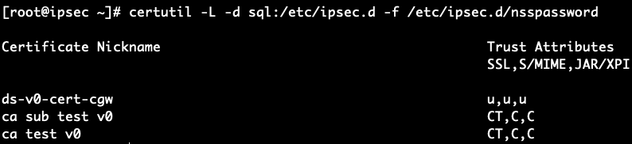

## Introduction

In this guide, we build a [Site-to-Site (S2S) VPN](https://docs.aws.amazon.com/vpn/latest/s2svpn/VPC_VPN.html) so an Amazon [VPC](https://docs.aws.amazon.com/vpc/latest/userguide/what-is-amazon-vpc.html) can reach VM IPs on a ROSA OpenShift Virtualization [User-Defined Network (UDN/CUDN)](https://www.redhat.com/en/blog/user-defined-networks-red-hat-openshift-virtualization)—with **no per-VM NAT or load balancers**. We deploy a small CentOS VM inside the cluster running [Libreswan](https://github.com/libreswan/libreswan) that establishes [IPsec/IKEv2 tunnel](https://aws.amazon.com/what-is/ipsec/) to an AWS [Transit Gateway (TGW)](https://docs.aws.amazon.com/whitepapers/latest/aws-vpc-connectivity-options/aws-transit-gateway.html).

We use [certificate-based authentication](https://docs.aws.amazon.com/vpn/latest/s2svpn/vpn-tunnel-authentication-options.html#certificate): the AWS [Customer Gateway (CGW)](https://docs.aws.amazon.com/vpn/latest/s2svpn/your-cgw.html) references a certificate issued by [ACM Private CA](https://docs.aws.amazon.com/privateca/latest/userguide/PcaWelcome.html), and the cluster VM uses the matching device certificate. Because identities are verified by certificates—not a fixed public IP—the VM can **initiate** the VPN **from behind NAT** (worker → NAT Gateway) and still form stable tunnels.

On AWS, the **TGW** terminates **two redundant tunnels** (two “outside” IPs). We associate the **VPC attachment(s)** and the **VPN attachment** with a TGW route table and enable **propagation** as needed. In the VPC, route tables send traffic for the CUDN prefix (e.g., `192.168.1.0/24`) **to the TGW**. On the cluster side, the CUDN has **IPAM disabled**; you can optionally add a **return route** on other CUDN workloads to use the IPsec VM as next hop when those workloads need to reach the VPC.

NAT specifics: when the VM egresses, it traverses the [NAT Gateway](https://docs.aws.amazon.com/vpc/latest/userguide/vpc-nat-gateway.html). If that NAT uses multiple EIPs, AWS may select different EIPs per connection; this is fine because the VPN authenticates via certificates, not source IP.


<br />


## Why this approach

* **Direct, routable access to VMs**: UDN/CUDN addresses are reachable from the VPC without per-VM LBs or port maps, so existing tools (SSH/RDP/agents) work unmodified.
* **Cert-based, NAT-friendly**: The cluster peer authenticates with a **device certificate**, so it can sit **behind NAT**; no brittle dependence on a static egress IP, and **no PSKs** to manage.I
* **AWS-native and minimally invasive**: Uses TGW, CGW (certificate), and standard route tables—no changes to managed ROSA networking, and no inbound exposure (no NLB/NodePorts) because the **VM initiates**.
* **Scales and hardens cleanly**: Add a second IPsec VM in another AZ for HA, advertise additional prefixes, or introduce dynamic routing later. As BGP-based UDN routing matures, you can evolve without re-architecting.

In short: this is a practical and maintainable way to reach ROSA-hosted VMs **without PSKs**, **without a static public IP**, and **without a fleet of load balancers**.


## 0. Prerequisites

* A classic or HCP ROSA cluster v4.14 and above.
* Bare metal instance machine pool (we are using `m5.metal`, feel free to change as needed), and OpenShift Virtualization operator installed. You can follow Step 2-5 from [this guide](https://cloud.redhat.com/experts/rosa/ocp-virt/basic-gui/) to do so.
* The oc CLI # logged in.


## 1. Create the project and secondary network (CUDN)

Create `vpn-infra` project and the ClusterUserDefinedNetwork (CUDN) object.

```bash
oc new-project vpn-infra || true
cat <<'EOF' | oc apply -f -
apiVersion: k8s.ovn.org/v1
kind: ClusterUserDefinedNetwork
metadata: { name: vm-network }
spec:
  namespaceSelector:
    matchExpressions:
    - key: kubernetes.io/metadata.name
      operator: In
      values: [vpn-infra]
  network:
    layer2: { role: Secondary, ipam: { mode: Disabled } }
    topology: Layer2
EOF
```


## 2. Create the ipsec VM (cert-based IPsec, NAT-initiated)

Go to Red Hat Hybrid Cloud Console. On the navigation bar, select **Virtualization → Catalog**, and from the top, change the **Project** to `vpn-infra`. Then under **Create new VirtualMachine → Instance types → Select volume to boot from**, choose **CentOS Stream 10** (or 9 is fine). 


<br />

Scroll down and name it `ipsec`, and select **Customize VirtualMachine**. 


<br />

Select **Network** on navigation bar. Under **Network interfaces**, click **Add network interface**. Name it `cudn`.


<br />

Then click **Save**. Click **Create VirtualMachine**.


<br />

Wait for a couple of minutes until the VM is running. 

Then click the **Open web console** and log into the VM using the credentials on top of the page. 

Alternatively, you can run this on your CLI terminal: `virtctl console -n vpn-infra ipsec`, and use the same credentials to log into the VM. 

Then as root (run `sudo -i`), run the following inside the VM to give the second NIC (`cudn`) an IP:

```bash
ip -4 a
nmcli con add type ethernet ifname enp2s0 con-name cudn \
  ipv4.addresses 192.168.1.10/24 ipv4.method manual autoconnect yes
nmcli con mod cudn 802-3-ethernet.mtu 1400
nmcli con up cudn
```

Install Libreswan and tools:

```bash
dnf -y install libreswan nss-tools NetworkManager iproute
```

Kernel networking (forwarding & rp_filter):

```bash
cat >/etc/sysctl.d/99-ipsec.conf <<'EOF'
net.ipv4.ip_forward=1
net.ipv4.conf.all.rp_filter=2
net.ipv4.conf.default.rp_filter=2
net.ipv4.conf.all.accept_redirects=0
net.ipv4.conf.default.accept_redirects=0
net.ipv4.conf.all.send_redirects=0
net.ipv4.conf.default.send_redirects=0
EOF
sysctl --system
```


## 3. Create Private CA (ACM PCA)

Go to AWS Console and select **Certificate Manager**. Then on the left navigation tab, click **AWS Private CAs**, and then click **Create a private CA**.

On the **Create private certificate authority (CA)** page, keep **CA type options** as **Root**. You could leave the default options for simplicity sake. We would recommend, however, give it a name; so for example, here we give the **Common name (CN)** `ca test v0`. Acknowledge the pricing section, and click **Create CA**.

And then on the root CA page, go to the **Action** tab on upper right side, and select **Install CA certificate**. On the **Install root CA certificate** page, you can leave the default configurations as-is and click **Confirm and Install**. The CA should now be **Active**. 

Next, create a subordinate CA by repeating the same thing but on the **CA type options**, choose **Subordinate**, and give it a **Common name (CN)** such as `ca sub test v0`. Confirm pricing and create it.

And similarly, on the subordinate CA page, go to the **Action** tab on top right side, and select **Install CA certificate**. On the **Install subordinate CA certificate** page, under **Select parent CA**, choose the root CA you just created as the **Parent private CA**. And under **Specify the subordinate CA certificate parameters**, for the validity section, pick a date at least 13 months from now. You can leave the rest per default and click **Confirm and Install**. 

Once done, you will have these private CAs like this snippet below:


<br />

Next, go the **AWS Certificate Manager (ACM)** page, and click **Request a certificate** button. On the **Certificate type** page, select **Request a private certificate**, and click **Next**. 

Under **Certificate authority details**, pick the subordinate CA as **Certificate authority**. Then under **Domain names**, pick a **Fully qualified domain name** (FQDN) of your choice. Note that this does not have to be resolvable, we just use it as an identity string for IKE. For example here, we use something like `s2s.vpn.test.mobb.cloud`. You can leave the rest per default, acknowledge **Certificate renewal permissions** and click **Request**. 

Wait for until the status is changed to **Issued**. Then, click **Export** button on top right side. Under **Encryption details**, enter a passphrase of your choice. You will be prompted to input this passphrase in the next steps, so please keep it handy. Acknowledge the billing and click **Generate PEM encoding**. And on the next page, click **Download all**, and finally click **Done**.

Once downloaded you will be seeing 3 files on your local machine: 
- certificate.pem
- certificate_chain.pem
- private_key.pem

Note if the downloaded files are in .txt, rename them into .pem files (you can simply `mv certificate.txt certificate.pem` and so forth for the rest of the files). 

Next, create the PKCS#12 for Libreswan. Feel free to change the name of the cert, but be sure you're on the same directory where the downloaded certificate files are:

```bash
openssl pkcs12 -export \
  -inkey private_key.pem \
  -in certificate.pem \
  -certfile certificate_chain.pem \
  -name test-cert-cgw \ 
  -out left-cert.p12
```

This will prompt you with passphrase you created before. And then copy both `left-cert.p12` and `certificate_chain.pem` into the VM. 

You can use `virtctl scp` command, or alternatively `base64` like the following:

```bash
openssl base64 -A -in left-cert.p12 -out left-cert.p12.b64
openssl base64 -A -in certificate_chain.pem -out certificate_chain.pem.b64
```
 
And then on the VM:

```bash
# left-cert.p12
cat > /root/left-cert.p12.b64 <<'EOF'
<paste the contents of left-cert.p12.b64 here>
EOF

# certificate_chain.pem
cat > /root/certificate_chain.pem.b64 <<'EOF'
<paste the contents of certificate_chain.pem.b64 here>
EOF
```

Then, decode it:

```bash
base64 -d /root/left-cert.p12.b64 > /root/left-cert.p12
base64 -d /root/certificate_chain.pem.b64 > /root/certificate_chain.pem
rm -f /root/*.b64
```

Next, initialize a fresh NSS DB. We'll use empty password for the sake of simplicity:

```bash
sudo -i
systemctl stop ipsec 2>/dev/null || true
rm -f /etc/ipsec.d/{cert9.db,key4.db,pkcs11.txt}

printf '\n' > /etc/ipsec.d/nsspassword
chmod 600 /etc/ipsec.d/nsspassword

certutil -N -d sql:/etc/ipsec.d -f /etc/ipsec.d/nsspassword
```

Next, import the PKCS#12 (your keypair). Use the **P12 export password** you set when creating `left-cert.p12`.

```bash
pk12util -i /root/left-cert.p12 -d sql:/etc/ipsec.d
# verify key + cert now exist
certutil -K -d sql:/etc/ipsec.d -f /etc/ipsec.d/nsspassword
certutil -L -d sql:/etc/ipsec.d -f /etc/ipsec.d/nsspassword
# expect to see your key nickname, e.g. "test-cert-cgw"
```

Trust the CA chain for both subordinate and root:

```bash
# use the exact nicknames shown by `certutil -L` in your output:
certutil -M -d sql:/etc/ipsec.d -f /etc/ipsec.d/nsspassword \
  -n "ca sub test v0" -t "CT,C,C"

certutil -M -d sql:/etc/ipsec.d -f /etc/ipsec.d/nsspassword \
  -n "ca test v0" -t "CT,C,C"

# re-check
certutil -L -d sql:/etc/ipsec.d -f /etc/ipsec.d/nsspassword
```

You should now see something like this (just an example):


<br />


## 4. Create a Customer Gateway (CGW) 

Go to AWS console, find **VPC**. Then on the left navigation tab, find **Customer gateways → Create customer gateway**. 

On the **Certificate ARN** section, choose your ACM-PCA–issued cert. You can give it a name like `cgw test v0`, leave the default options, and click **Create customer gateway**.

With certificate-auth, AWS doesn’t require a fixed public IP on the CGW; that’s why this pattern works behind NAT. 


## 5. Create (or use) a Transit Gateway (TGW)

On the left navigation tab, find **Transit Gateways → Create transit gateway**. Give it a name like `tgw test v0`, leave the default options, and click **Create transit gateway**. 

Next, let's attach the VPC(s) to the TGW. On the navigation tab, find **Transit Gateway attachments → Create transit gateway attachment**.

Give it a name like `tgw attach v0`, pick the transit gateway you just created as **Transit gateway ID**, and select **VPC** as the **Attachment type**. And on the **VPC attachment** section, select your VPC ID, and select the private subnet of each subnets you want reachable from the cluster. Once done, click **Create transit gateway attachment**.


<br />


## 6. Create the Site-to-Site VPN (Target = TGW)

Still on VPC console, find → **Site-to-Site VPN connections → Create VPN connection**. 

Give it a name like `vpn test v0`. Choose **Transit gateway** as **Target gateway type** and choose your TGW from the **Transit gateway** dropdown. Then choose **Existing** for **Customer gateway**, and select the certificate-based CGW from previous step from the **Customer gateway ID** options.


<br />

Choose **Static** for **Routing options**. For **Local IPv4 network CIDR**, put in the CUDN CIDR, e.g. `192.168.1.0/24`. And for **Remote IPv4 network CIDR**, put in the cluster's VPC CIDR, e.g. `10.10.0.0/16`.


<br />

Leave default options as-is and click **Create VPN connection**.

At the moment, the status of both tunnels are **Down** and that is completely fine. For now, take note on the tunnels' outside IPs as we will use them for the Libreswan config in the next step. 


<br />


## 7. Creating Libreswan config

Let's go back to the VM now, and as root (and be sure to replace the placeholder values, e.g. cert nickname, tunnels outside IPs):

```bash
sudo tee /etc/ipsec.conf >/dev/null <<'EOF'
config setup
    uniqueids=yes
    plutodebug=none
    nssdir=/etc/ipsec.d

conn %default
    keyexchange=ikev2
    authby=rsasig
    fragmentation=yes
    mobike=no
    narrowing=yes

    left=%defaultroute
    leftsubnet=192.168.1.0/24
    leftcert=test-cert-cgw            # change this to your cert nickname
    leftid=%fromcert
    leftsendcert=always

    rightsubnet=10.10.0.0/16
    rightid=%fromcert
    rightca=%same

    ikelifetime=28800s
    ike=aes256-sha2_256;modp2048,aes128-sha2_256;modp2048,aes256-sha1;modp2048,aes128-sha1;modp2048

    salifetime=3600s
    esp=aes256-sha2_256;modp2048,aes128-sha2_256;modp2048,aes256-sha1;modp2048,aes128-sha1;modp2048
    pfs=yes

    dpddelay=10
    retransmit-timeout=60
    auto=add

conn aws-tun-1
    right=44.228.33.1                    # change this to your tunnel 1 outside IP
    auto=start

conn aws-tun-2
    right=50.112.212.105                 # change this to your tunnel 2 outside IP
    auto=start
EOF

sudo systemctl restart ipsec
sudo ipsec auto --delete aws-tun-1 2>/dev/null || true
sudo ipsec auto --delete aws-tun-2 2>/dev/null || true
sudo ipsec auto --add aws-tun-1
sudo ipsec auto --add aws-tun-2
sudo ipsec auto --up aws-tun-1
sudo ipsec auto --up aws-tun-2
```

Next, run `ipsec status` and now you should see something like **Total IPsec connections: loaded 2, routed 1, active 1** which means that your tunnel is up. 

And so now if you go back to the VPN console you will see one of the tunnel is up as follows:


<br />


## 8. Associate VPC to TGW route tables

On VPC navigation tab, find **Transit gateway route tables**, and go to **Propagations** tab, and ensure that both VPC and VPN resources/attachments are **Enabled**.


<br />


Then click **Routes** tab, look under **Routes → Create static route**. For **CIDR**, put in CUDN CIDR `192.168.1.0/24` and under **Choose attachment**, pick the **VPN attachment** and click **Create static route**.


<br />


Wait for a minute and it should now look like this:


<br />


[HAVEN'T SORTED THE ONES BELOW, BUT BASICALLY ENSURE ALL SUBNETS ALLOW CUDN AND ADD SG INBOUND RULES]

## 11. Modify VPC route tables

In each VPC that should reach the cluster overlay (your CUDN), add a route:

* **Destination**: your CUDN subnet (e.g., `192.168.1.0/24`)
* **Target**: the **TGW attachment**
  (BGP can also advertise it if you prefer dynamic routing.) 

  [SCREENSHOT HERE]


## 12. Network policy & test access

* **Security groups**

  * **Test EC2 SG (in the VPC you attached):**

    * Inbound: ICMP from your **CUDN** (e.g., `192.168.1.0/24`)
    * (Optional) TCP 22/80 from `192.168.1.0/24` for SSH/curl tests

[SCREENSHOT HERE]

  
* **Optional “return route” for other CUDN workloads**

  * Only if **other** VMs/pods on the CUDN must reach the VPC **via the ipsec VM**:

    ```bash
    sudo ip route add <VPC_CIDR> via 192.168.1.10
    nmcli connection modify cudn +ipv4.routes "<VPC_CIDR> 192.168.1.10"
    nmcli connection up cudn
    ```


## 13. Download the VPN device config (for reference)

VPN connection → **Download configuration** → **Libreswan / Generic**.
You’ll copy the **tunnel outside IPs** into `right=` and confirm IKE params.

[SCREENSHOT HERE]


## 14. Egress sanity

Ensure cluster egress allows UDP **500/4500** to the **two tunnel outside IPs**.

[SCREENSHOT HERE]


## 15. Bring up tunnels & verify

* On the ipsec VM:

  ```bash
  sudo ipsec up aws-tun-1
  sudo ipsec status
  ```
* Quick tests:

  ```bash
  # from AWS EC2 (e.g., 10.10.0.10) to CUDN:
  ping -c3 192.168.1.10
  # from ipsec VM to EC2:
  ping -I 192.168.1.10 -c3 10.10.0.10
  ```
* Deep-dive:

  ```bash
  sudo ip xfrm policy
  sudo ip xfrm state
  sudo ipsec whack --trafficstatus
  sudo timeout 6 sh -c "tcpdump -ni any 'udp port 4500 or esp' & ping -c3 -W2 -I 192.168.1.10 10.10.0.10 >/dev/null"
  ```
* Failover:

  ```bash
  sudo ipsec down aws-tun-1
  sudo ipsec up aws-tun-2
  sudo ipsec status
  ```

[SCREENSHOT HERE]


## 16. Troubleshooting quick hits (optional)

These are some troubleshooting steps if needed.

```bash
# remove accidental static next-hop on the ipsec VM (traffic should match xfrm SAs)
sudo ip route del <VPC_CIDR> || true

# normalize perms/labels
sudo sed -i -e 's/\r$//' /etc/ipsec.conf /etc/ipsec.d/*.conf /etc/ipsec.d/*.secrets 2>/dev/null
sudo chmod 644 /etc/ipsec.d/*.conf 2>/dev/null || true
sudo chmod 600 /etc/ipsec.secrets /etc/ipsec.d/*.secrets 2>/dev/null || true
sudo restorecon -Rv /etc/ipsec.conf /etc/ipsec.secrets /etc/ipsec.d >/dev/null

# temporarily relax RPF during asymmetry debug
echo -e "net.ipv4.conf.all.rp_filter=0\nnet.ipv4.conf.default.rp_filter=0" | sudo tee /etc/sysctl.d/99-ipsec-debug.conf
sudo sysctl -p /etc/sysctl.d/99-ipsec-debug.conf
```
