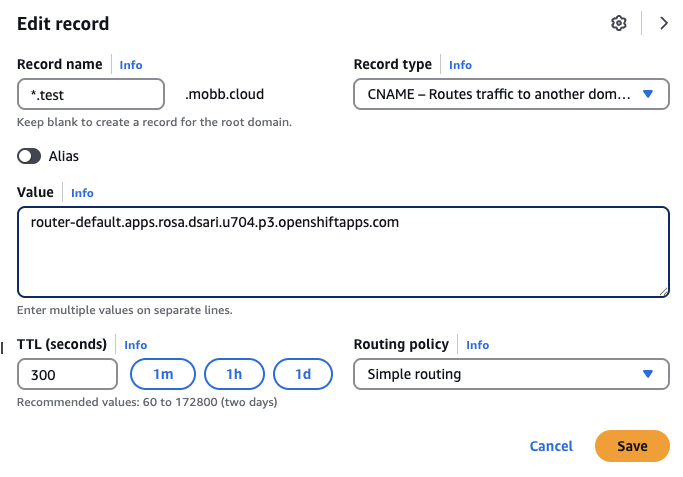

This is a simple guide to integrate [Red Hat OpenShift Service Mesh](https://www.redhat.com/en/technologies/cloud-computing/openshift/what-is-openshift-service-mesh) into your ROSA cluster. In this scenario, we will install Service Mesh using a custom domain (optional) and expose an app to test it. The first half of the guide will be integrating [Service Mesh 2.x](https://docs.redhat.com/en/documentation/openshift_container_platform/4.18/html/service_mesh/service-mesh-2-x) and second half will be integrating [Service Mesh 3.x](https://docs.redhat.com/en/documentation/openshift_container_platform/4.18/html/service_mesh/service-mesh-3-x). 


### Prerequisites

* A [classic](https://cloud.redhat.com/experts/rosa/terraform/classic/) or [HCP](https://cloud.redhat.com/experts/rosa/terraform/hcp/) ROSA cluster v4.14 and above.
* The oc CLI      # logged in.
* A Domain Name in a public zone. These instructions assume Route 53, but can be adapted for any other DNS.
* An app to expose (alternatively, we will be creating a simple **Hello OpenShift** app in this guide)


### Set up environment

Install the necessary operators, i.e. Elasticsearch (optional), Jaeger (distributed tracing platform), Kiali, and Service Mesh (2 or 3 depends on your use case) from OpenShift console.  

Then log into your cluster via CLI and set up the following environment variables.

```bash
APP_NAMESPACE=my-public-app # change this to your app namespace if you have one already
DOMAIN=test.mobb.cloud  # change this to your custom domain
```

## Service Mesh 2.x

### Step 1 - Create the Service Mesh Control Plane

Let's first create a new project where the control plane resides.

```bash
oc new-project istio-system
```

And then the control plane. Note that here we are using Service Mesh 2.6.

```bash
cat << EOF | oc apply -f -
apiVersion: maistra.io/v2
kind: ServiceMeshControlPlane
metadata:
  name: basic
  namespace: istio-system
spec:
  version: v2.6
  security:
    identity:
      type: ThirdParty
  tracing:
    type: Jaeger
    sampling: 10000
  addons:
    jaeger:
      name: jaeger
      install:
        storage:
          type: Memory
    kiali:
      enabled: true
      name: kiali
    grafana:
      enabled: true
EOF
```


### Step 2 - Create the Service Mesh Member Roll

Here we will create [Service Mesh Member Roll](https://docs.redhat.com/en/documentation/openshift_container_platform/4.18/html/service_mesh/service-mesh-2-x#ossm-member-roll-create_ossm-create-mesh) to define which namespaces are part of the mesh and will have Istio functionality applied to them.

```bash
cat << EOF | oc apply -f -
apiVersion: maistra.io/v1
kind: ServiceMeshMemberRoll
metadata:
  name: default
  namespace: istio-system
spec:
  members:
  - $APP_NAMESPACE
EOF
```

### Step 3 - Configure namespace for mesh injection

Next, we will inject mesh which is essentially a process of annotating a namespace to automatically inject the Istio sidecar proxy into all pods created in that namespace.

```bash
cat << EOF | oc apply -f -
apiVersion: v1
kind: Namespace
metadata:
  name: $APP_NAMESPACE
  annotations:
    maistra.io/inject: "true"
EOF
```

### Step 4 - Deploy Hello OpenShift app (optional)

Skip this step if you have already created an app.

```bash
oc new-project $APP_NAMESPACE
oc new-app --docker-image=docker.io/openshift/hello-openshift -n $APP_NAMESPACE
```

### Step 5 - Add sidecar injection to deployment

Sidecar injection is in essence the deployment of an Envoy proxy container alongside your application container to intercept and manage all network traffic.

```bash
cat << EOF | oc apply -f -
apiVersion: apps/v1
kind: Deployment
metadata:
  name: hello-openshift
  namespace: $APP_NAMESPACE
spec:
  template:
    metadata:
      annotations:
        sidecar.istio.io/inject: "true"
EOF
```

Then restart deployment to trigger sidecar injection:

```bash
oc rollout restart deployment/hello-openshift -n $APP_NAMESPACE
```

And verify pods have sidecars (should show 2/2 ready):

```bash 
oc get pods -n $APP_NAMESPACE
```

### Step 6 - Create Istio Gateway

Istio Gateway is a load balancer operating at the edge of the mesh that manages inbound and outbound HTTP/TCP connections.

```bash
cat << EOF | oc apply -f -
apiVersion: networking.istio.io/v1beta1
kind: Gateway
metadata:
  name: hello-gateway
  namespace: $APP_NAMESPACE
spec:
  selector:
    istio: ingressgateway
  servers:
  - port:
      number: 80
      name: http
      protocol: HTTP
    hosts:
    - "hello.$DOMAIN"
EOF
```

### Step 7 - Create Virtual Service

Virtual Service is a traffic routing rule that defines how requests sent to a service are routed within the mesh, enabling fine-grained traffic control.

```bash
cat << EOF | oc apply -f -
apiVersion: networking.istio.io/v1beta1
kind: VirtualService
metadata:
  name: hello-vs
  namespace: $APP_NAMESPACE
spec:
  hosts:
  - "hello.$DOMAIN"
  gateways:
  - hello-gateway
  http:
  - route:
    - destination:
        host: hello-openshift
        port:
          number: 8080
EOF
```

Note that if you are using multiple domains, then you might want to wildcard the hosts, i.e. `*.com`, to preserve the domain all the way to the application. 

### Step 8 - Create OpenShift Route to Istio Ingress Gateway

In the context of Service Mesh, OpenShift Route is a way to expose the Istio Ingress Gateway to external traffic using OpenShift's built-in routing layer.

```bash
cat << EOF | oc apply -f -
apiVersion: route.openshift.io/v1
kind: Route
metadata:
  name: hello-mesh
  namespace: istio-system
spec:
  host: hello.$DOMAIN
  to:
    kind: Service
    name: istio-ingressgateway
  port:
    targetPort: http2
  tls:
    termination: edge
    insecureEdgeTerminationPolicy: Redirect
EOF
```

### Step 9 - Configure custom domain (optional)

If you're using custom domain, then go to AWS Console and change the record to point to the route hostname.

Get your canonical route hostname:

```bash
oc get route hello-mesh -n istio-system -o jsonpath='{.status.ingress[0].routerCanonicalHostname}'
```

This should give you an output like `router-default.apps.rosa.your-cluster-name.xxxx.px.openshiftapps.com`. Use this as the value of your domain.


<br />


### Step 10 - Verify the setup and access the application

Check if ingress gateway is running:

```bash
oc get pods -n istio-system | grep ingressgateway
```

Access your application by testing the route:

```bash
curl -k https://hello.$DOMAIN
```

You should see the output `Hello OpenShift!`. 

> **Note**: If you are accessing your browser, you might get **Not Secure** warning due to certificate mismatch. Since this is a testing environment, you can safely ignore this. However, for production environment, you might want to use a custom certificate for your route, or use Let's Encrypt with OpenShift's cert-manager, for example. 


## Service Mesh 3.x

In this section, we will validate Red Hat OpenShift Service Mesh 3 using **sidecar mode** and the **Kubernetes Gateway API**.

Unlike Service Mesh 2.x, Service Mesh 3 uses the `sailoperator.io/v1` API and manages the control plane with an `Istio` resource. For sidecar-based workloads, you also need to create an `IstioCNI` resource before injected application pods will work correctly.

### Step 1 - Create the Service Mesh control plane namespace

Create the namespace where the Service Mesh control plane will run.

```bash
oc new-project istio-system
```

### Step 2 - Create the Service Mesh 3 control plane

Create a minimal `Istio` resource for the control plane.

```bash
cat << EOF | oc apply -f -
apiVersion: sailoperator.io/v1
kind: Istio
metadata:
  name: default
  namespace: istio-system
spec:
  namespace: istio-system
  updateStrategy:
    type: InPlace
EOF
```

Wait for the control plane to be ready:

```bash
oc wait --for=condition=Ready istios/default -n istio-system --timeout=5m
oc get istio -n istio-system
oc get pods -n istio-system
```

You should see the `Istio` resource become `Healthy` and the `istiod` pod running.

### Step 3 - Create the Istio CNI resource

For sidecar injection in Service Mesh 3, create an `IstioCNI` resource.

```bash
oc new-project istio-cni
```

```bash
cat << EOF | oc apply -f -
apiVersion: sailoperator.io/v1
kind: IstioCNI
metadata:
  name: default
  namespace: istio-cni
spec:
  namespace: istio-cni
EOF
```

Wait for the CNI pods to be ready:

```bash
oc wait --for=condition=Ready istiocnis/default -n istio-cni --timeout=5m
oc get istiocni -n istio-cni
oc get pods -n istio-cni
```

After this completes, verify the `Istio` resource is still `Healthy`:

```bash
oc get istio -n istio-system
```

### Step 4 - Create an application namespace and enable sidecar injection

Set the application namespace and enable sidecar injection using the namespace label.

```bash
export APP_NAMESPACE=my-public-app
```

Create the namespace:

```bash
oc new-project $APP_NAMESPACE
```

Enable sidecar injection:

```bash
oc label namespace $APP_NAMESPACE istio-injection=enabled --overwrite
```

Verify the label:

```bash
oc get ns $APP_NAMESPACE --show-labels
```

### Step 5 - Deploy Hello OpenShift app

Deploy a simple test application that listens on port `8080`.

```bash
cat << EOF | oc apply -n $APP_NAMESPACE -f -
apiVersion: apps/v1
kind: Deployment
metadata:
  name: hello-openshift
spec:
  replicas: 1
  selector:
    matchLabels:
      app: hello-openshift
  template:
    metadata:
      labels:
        app: hello-openshift
    spec:
      containers:
      - name: hello-openshift
        image: docker.io/openshift/hello-openshift
        ports:
        - containerPort: 8080
---
apiVersion: v1
kind: Service
metadata:
  name: hello-openshift
spec:
  selector:
    app: hello-openshift
  ports:
  - name: http
    port: 8080
    targetPort: 8080
EOF
```

Wait for the deployment:

```bash
oc rollout status deploy/hello-openshift -n $APP_NAMESPACE
oc get pods -n $APP_NAMESPACE
```

Confirm that the workload received the injected sidecar by describing the pod:

```bash
oc describe pod -n $APP_NAMESPACE $(oc get pod -n $APP_NAMESPACE -l app=hello-openshift -o jsonpath='{.items[0].metadata.name}')
```

You should see the injected `istio-proxy` container in the pod details.

### Step 6 - Create a Kubernetes Gateway API Gateway

In Service Mesh 3 sidecar mode, we can expose the application using the Kubernetes Gateway API.

```bash
cat << EOF | oc apply -n $APP_NAMESPACE -f -
apiVersion: gateway.networking.k8s.io/v1
kind: Gateway
metadata:
  name: hello-gateway
spec:
  gatewayClassName: istio
  listeners:
  - name: http
    protocol: HTTP
    port: 80
    hostname: hello.example.com
    allowedRoutes:
      namespaces:
        from: Same
EOF
```

### Step 7 - Create an HTTPRoute

Create an `HTTPRoute` that routes incoming traffic from the Gateway to the `hello-openshift` service.

```bash
cat << EOF | oc apply -n $APP_NAMESPACE -f -
apiVersion: gateway.networking.k8s.io/v1
kind: HTTPRoute
metadata:
  name: hello-route
spec:
  parentRefs:
  - name: hello-gateway
  hostnames:
  - hello.example.com
  rules:
  - matches:
    - path:
        type: PathPrefix
        value: /
    backendRefs:
    - name: hello-openshift
      port: 8080
EOF
```

Verify the gateway resources:

```bash
oc get gateway -n $APP_NAMESPACE
oc get httproute -n $APP_NAMESPACE
oc get svc -n $APP_NAMESPACE
oc get deploy -n $APP_NAMESPACE
oc get pods -n $APP_NAMESPACE
```

You should see a generated gateway deployment and `LoadBalancer` service, typically named something like `hello-gateway-istio`.

### Step 8 - Test external access

Get the external address from the generated gateway service:

```bash
oc get svc -n $APP_NAMESPACE
```

Set the external address:

```bash
export GW_ADDR=<external-load-balancer-hostname>
```

Test the application by sending the expected `Host` header:

```bash
curl -sv -H 'Host: hello.example.com' "http://${GW_ADDR}/"
```

You should see:

```text
Hello OpenShift!
```

### Step 9 - Configure a custom domain (optional)

If you want to use your own DNS name instead of a curl `Host` header, create a DNS record that points to the external hostname of the generated gateway service.

For example, point your chosen hostname to the ELB hostname shown by:

```bash
oc get svc -n $APP_NAMESPACE
```

Then update the `hostname` in the `Gateway` and `hostnames` in the `HTTPRoute` to match your chosen DNS name.

### Step 10 - Clean up (optional)

Delete the application namespace and Service Mesh resources when you are done testing:

```bash
oc delete ns $APP_NAMESPACE
oc delete istiocni default -n istio-cni
oc delete ns istio-cni
oc delete istio default -n istio-system
oc delete ns istio-system
```