One of the great things about OpenShift Virtualization is that it brings new capabilities to run virtual machines alongside your containers AND using DevOps processes to manage them.

This tutorial will show how to configure OpenShift GitOps ( based on ArgoCD ) to deploy and managed virtual machines.

## Pre-requisites

* A ROSA Cluster with OpenShift Virtualization (see [Deploying OpenShift Virtualization on ROSA](/experts/rosa/ocp-virt/basic/))
If you follow the guide above, you can skip the *Create a Virtual Machine* section as we will be using OpenShift GitOps to deploy the cluster.
* The `git` binary installed on your machine.  You can download it from the [git website](https://git-scm.com/downloads).


## Prepare the Environment

1. Retrieve the source code to deploy VMs with OpenShift GitOps

    ```bash
    git clone https://github.com/rh-mobb/rosa-virt-gitops

    cd rosa-virt-gitops
    ```


## Install the OpenShift GitOps Operator

   ```bash
    cat << EOF | oc apply -f -
    apiVersion: v1
    kind: Namespace
    metadata:
      name: openshift-gitops-operator
    ---
    apiVersion: operators.coreos.com/v1
    kind: OperatorGroup
    metadata:
      name: kubevirt-hyperconverged-group
      namespace: openshift-gitops-operator
    spec:
      targetNamespaces:
        - openshift-gitops-operator
    ---
    apiVersion: operators.coreos.com/v1alpha1
    kind: Subscription
    metadata:
      name: openshift-gitops-operator
      namespace: openshift-gitops-operator
    spec:
      source: redhat-operators
      installPlanApproval: Automatic
      sourceNamespace: openshift-marketplace
      name: openshift-gitops-operator
      channel: "stable"
    ---
    apiVersion: user.openshift.io/v1
    kind: Group
    metadata:
        name: cluster-admins
    users:
        - admin
    EOF
   ```

## Configure OpenShift GitOps

1. Create an OpenShift GitOps Application Set

    For demonstrations purposes, we will deploy two VMs, one for Dev and one for Production.  Usually, these VMs would be deployed to different clusters but the sake a simplicity, we will deploy these VMs to different namespaces.

    ```bash
    oc apply -n openshift-gitops -f applicationsets/vm/applicationset-vm.yaml
    ```

2. Verify the applications ( VMs ) were created in OpenShift GitOps.

    Retrieve and open the OpenShift GitOps URL.
    ```bash
    oc get route openshift-gitops-server -n openshift-gitops -o jsonpath='{.spec.host}{"\n"}'
    ```

    expected output
    ```text
    openshift-gitops-server-openshift-gitops.apps.rosa.kevcolli-hcp1.dp4i.p3.openshiftapps.com
    ```

    Open the url in a browser and notice there are two ArgoCD applications that were created.
    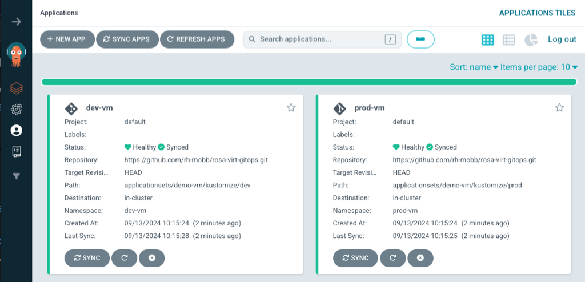

    Notice there is one application for dev and one for prod.

    Click into one of the applications, and see that everything is synced and all the resources that were created.
    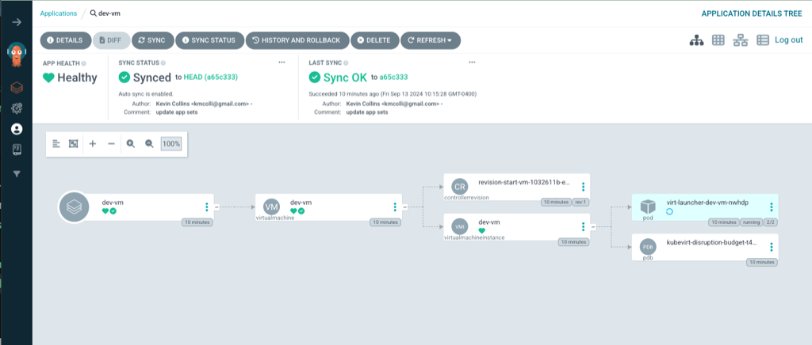

    Next, let's view the virtual machines that were created.

    In the OpenShift console, from the menu click on Virtualization and the Virtual Machines.   Make sure All Projects is selected.

    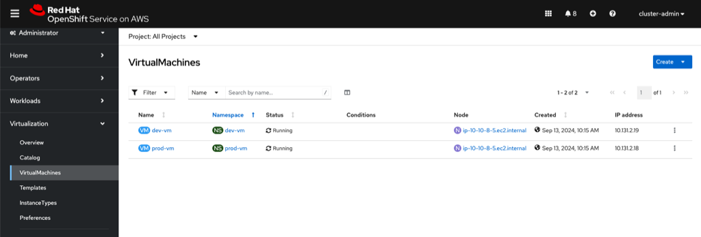

    Notice that there is a dev-vm which is in the dev-vm namespace and a prod-vm in the prod-vm namespace.

3. Manually change a VM

    One of the great benefits of OpenShift GitOps is that it will keep the state of the resources that you specified.  

    If you look at the VirtualMachine definition at 
    [VirtualMachine](https://raw.githubusercontent.com/rh-mobb/rosa-virt-gitops/main/applicationsets/vm/kustomize/base/virtualmachine.yaml), notice that the Virtual Machine is specified as it should be running.

    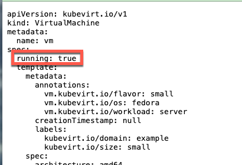

    When the ArogCD [ApplicationSet](https://raw.githubusercontent.com/rh-mobb/rosa-virt-gitops/main/applicationsets/vm/applicationset-vm.yaml) was applied, self healing was set to true.


    

    What this means is if we do something like stop the VM, Argo will restart it automatically.  Let's test it out.

    > Make sure to have the ArgoCD UI up and ready in a new tab, the change happens very fast.  

    From the list of VMs, click on Stop next to the Dev VM.  Once you click stop, switch over to the ArgoCD tab.
    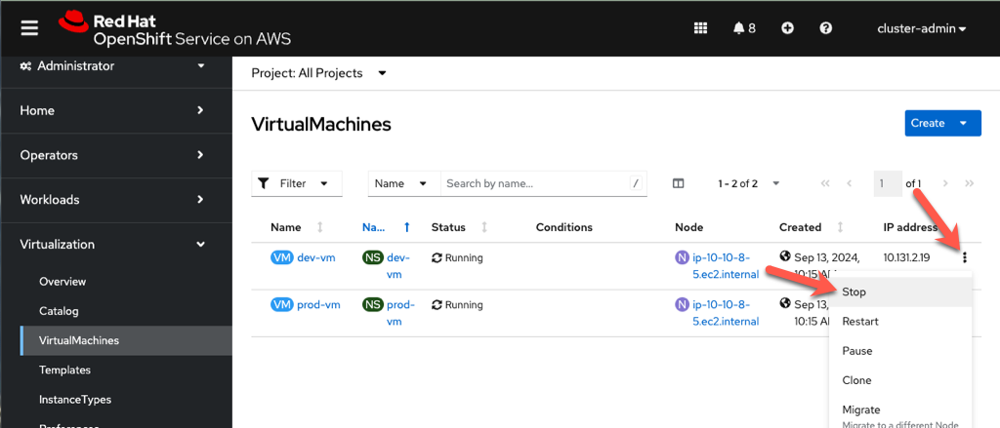

    Switching over the ArgoCD UI, noticed the App Healh shows "Progressing" and the dev-vm is being started.
    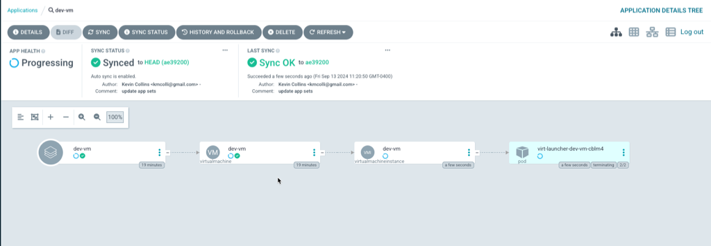

    After a few seconds, the Application shows health again and the vm is running.
    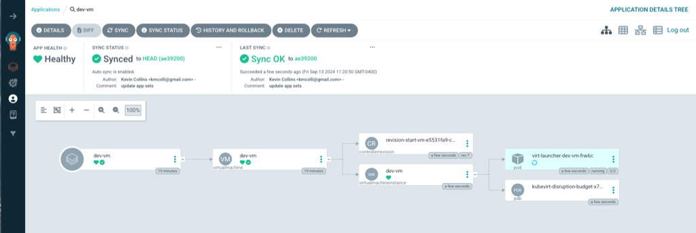

    Navigating back to the list of VMs in OpenShift, both VMs are running.
    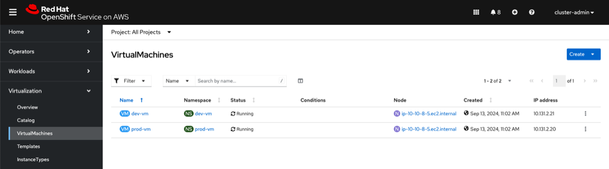

    That is one of the superpowers of OpenShift GitOps in that it keeps you applications in sync as there were specified in Git, elimiating application drift.

4. Make changes to the virtual machines through git.

Start by deleting the ArgoCD application set, VMs that we created using this tutorials github repo.

```bash
 oc delete ApplicationSet vms -n openshift-gitops
```

Next, fork the tutorial github [repo](https://github.com/rh-mobb/rosa-virt-gitops)
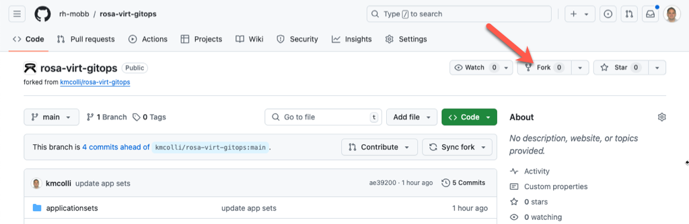

Export an environment variable with your GitHub username
```
 export GIT_USERNAME=<YOUR GITHUB USERNAME>
```

Clone the repo in YOUR github account locally:
```bash
 git clone https://github.com/$GIT_USERNAME/rosa-virt-gitops

 cd rosa-virt-gitops
```

Create an ApplicationSet and VMs using your github repo
```bash
  oc apply -n openshift-gitops -f applicationsets/vm/applicationset-vm.yaml
```

The result should look exactly like you saw previously with 2 ArgoCD apps and 2 VMs one for dev and one more prod.

Argo UI
    

List of VMs.


Now, let's make a change to VirtualMachine definition in having the Virtual Machine state being stopped and increasing the amount of memory requested.

Open the dev kustomization file located at
/applicationsets/vm/kustomize/dev/kustomization.yaml

Change the patch section with the following:
```yaml
- patch: |
      - op: replace
        path: /spec/running
        value: false
      - op: replace
        path: /spec/template/spec/domain/memory/guest
        value: 3Gi
      - op: replace
        path: /spec/template/spec/volumes/1/cloudInitNoCloud/userData
        value: |-
          #cloud-config
          user: fedora
          password: fedora123
          chpasswd: { expire: False }
```

Save the file, and push to git.

```bash
  git commit -am "stopping the VM and increasing memory"
  git push
```

Next, let's switch back over to ArgoCD and sync our changes.  From the dev-vm application in ArgoCD, slick on Sync.

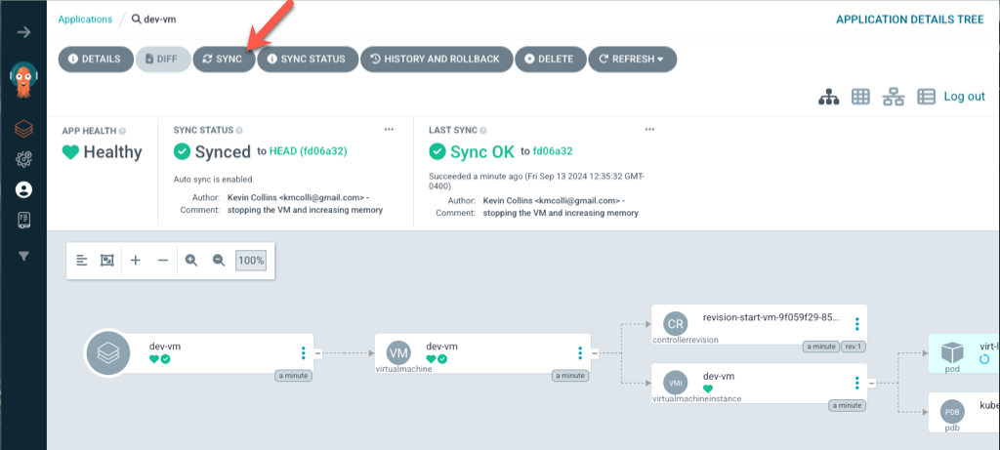

on the next popup screen, keep the default and click synchronize

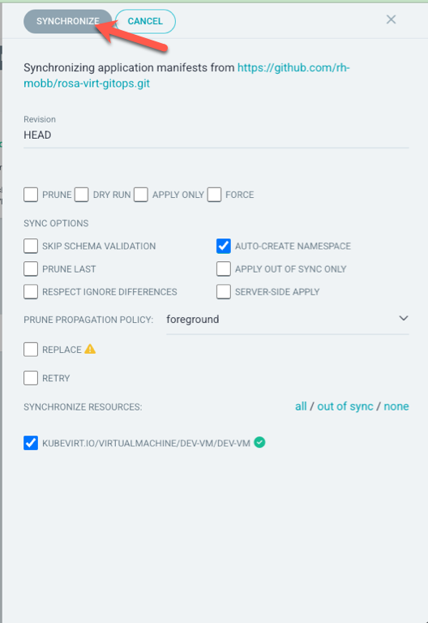

This will stop the dev vm and increase the memory to 3GB.  To verify, click into the dev-vm and see the results.

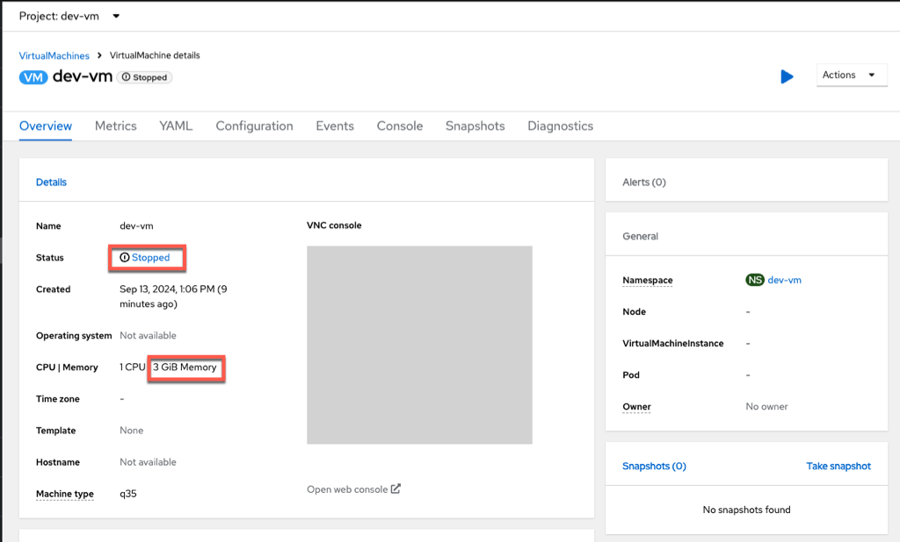


