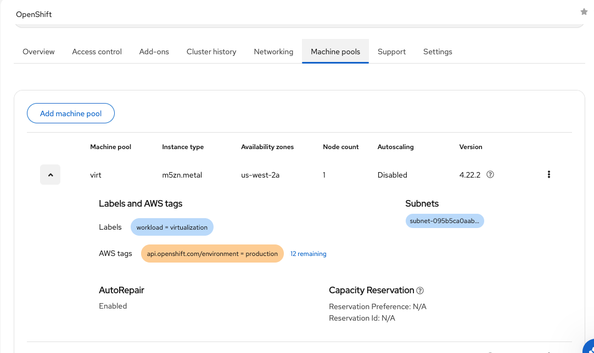
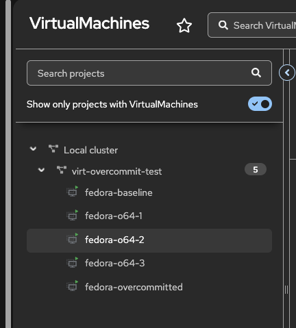

OpenShift Virtualization on Red Hat OpenShift Service on AWS (ROSA) supports predefined virtual machine instance types. Some of these instance types are designed for general-purpose workloads, while others are designed for overcommitted workloads.

This article walks through a hands-on testing of memory overcommit behavior on ROSA with OpenShift Virtualization. The goal is to show what changes from a Kubernetes scheduling perspective, what the guest operating system sees, and what happens when the guest consumes more memory than its Kubernetes request.

## Environment

This testing used the following environment:

| Component | Value |
|---|---|
| Platform | ROSA with hosted control planes |
| OpenShift version | 4.22.2 |
| Region | `us-west-2` |
| Default worker instance type | `m5.2xlarge` |
| Virtualization worker instance type | `m5zn.metal` |
| Virtualization worker count | 1 |
| VM storage class | `gp3-csi` |
| Test namespace | `virt-overcommit-test` |
| Guest OS | Fedora |
| OpenShift Virtualization version | 4.21.10 |

The `m5zn.metal` worker was used because OpenShift Virtualization requires bare-metal workers on ROSA. The regular `m5.2xlarge` workers were kept for the base cluster, while the virtual machines were scheduled only onto the `m5zn.metal` node.

## What we tested

This lab validates three things:

1. The difference between General Purpose `U` series and Overcommitted `O` series VM instance types.
2. Whether multiple overcommitted VMs can schedule when total guest memory exceeds node allocatable memory.
3. Whether the guest can consume more memory than the Kubernetes memory request.

The key finding is:

> Overcommitted `O` series instance types reduce the Kubernetes memory request used for scheduling, but the guest still sees the full assigned memory. This allows higher VM density, but the node must still have enough real memory for actual guest consumption.

## Prerequisites

You need:

- A ROSA HCP cluster.
- OpenShift Virtualization installed.
- A supported bare-metal worker machine pool.
- A default storage class.
- `oc`, `rosa`, `virtctl`, and `jq` installed locally.
- Cluster-admin access.

For this lab, a dedicated bare-metal machine pool was added:

```bash
rosa create machinepool \
  --cluster <cluster-name> \
  --name virt \
  --instance-type m5zn.metal \
  --replicas 1
```

The exact command might differ depending on whether the machine pool is created through Terraform, the ROSA CLI, or the OpenShift Cluster Manager console.

After the machine pool is created, verify the node:

```bash
oc get nodes -L node.kubernetes.io/instance-type,workload
```

Example output:

```text
NAME                                         STATUS   ROLES                  VERSION   INSTANCE-TYPE   WORKLOAD
ip-10-10-3-106.us-west-2.compute.internal    Ready    control-plane,worker   v1.35.5   m5zn.metal      virtualization
```

Label the bare-metal node so that test VMs can be scheduled explicitly onto it:

```bash
METAL_NODE=$(oc get nodes \
  -l node.kubernetes.io/instance-type=m5zn.metal \
  -o jsonpath='{.items[0].metadata.name}')

oc label node "$METAL_NODE" workload=virtualization
```

<br />



<br />

Check node allocatable capacity:

```bash
oc get node "$METAL_NODE" \
  -o jsonpath='CPU capacity: {.status.capacity.cpu}{"\n"}CPU allocatable: {.status.allocatable.cpu}{"\n"}Memory capacity: {.status.capacity.memory}{"\n"}Memory allocatable: {.status.allocatable.memory}{"\n"}KVM devices: {.status.allocatable.devices\.kubevirt\.io/kvm}{"\n"}'
```

Example output:

```text
CPU capacity: 48
CPU allocatable: 47500m
Memory capacity: 197680124Ki
Memory allocatable: 196529148Ki
KVM devices: 1k
```

This gives approximately 187.4 GiB of allocatable memory on the `m5zn.metal` node.

## Verify OpenShift Virtualization

Confirm that the OpenShift Virtualization components are deployed:

```bash
oc get hyperconverged -n openshift-cnv
oc get kubevirt -n openshift-cnv
oc get cdi -n openshift-cnv
oc get ssp -n openshift-cnv
```

Example output:

```text
NAME                      AGE
kubevirt-hyperconverged   3h33m

NAME                               AGE     PHASE
kubevirt-kubevirt-hyperconverged   3h34m   Deployed

NAME                          AGE     PHASE
cdi-kubevirt-hyperconverged   3h34m   Deployed

NAME                          PHASE
ssp-kubevirt-hyperconverged   Deployed
```

Verify the node is schedulable for virtualization:

```bash
oc get nodes -L kubevirt.io/schedulable
```

Verify KVM resources on the bare-metal node:

```bash
oc describe node "$METAL_NODE" |
  grep -A5 -E 'devices.kubevirt.io/kvm|Allocatable|Capacity'
```

Example output:

```text
Capacity:
  cpu:                            48
  devices.kubevirt.io/kvm:        1k
  devices.kubevirt.io/tun:        1k
  devices.kubevirt.io/vhost-net:  1k

Allocatable:
  cpu:                            47500m
  devices.kubevirt.io/kvm:        1k
  devices.kubevirt.io/tun:        1k
  devices.kubevirt.io/vhost-net:  1k
```

## Verify boot sources

Check that the Fedora boot source is available:

```bash
oc get datasource -n openshift-virtualization-os-images
```

Example output:

```text
NAME              AGE
centos-stream10   3h36m
centos-stream9    3h36m
fedora            3h36m
rhel10            3h36m
rhel8             3h36m
rhel9             3h36m
```

Confirm that the DataVolumes are imported successfully:

```bash
oc get datavolume -n openshift-virtualization-os-images
oc get pvc -n openshift-virtualization-os-images
```

Example output:

```text
NAME                 PHASE       PROGRESS
fedora-1217dcc8c58d  Succeeded   100.0%
```

## Create the test project

```bash
oc new-project virt-overcommit-test

oc label namespace virt-overcommit-test \
  purpose=virt-overcommit-testing
```

## Compare General Purpose and Overcommitted instance types

OpenShift Virtualization provides predefined `VirtualMachineClusterInstancetype` resources.

List the General Purpose instance types:

```bash
oc get virtualmachineclusterinstancetype \
  -l instancetype.kubevirt.io/class=general.purpose \
  -L instancetype.kubevirt.io/cpu,instancetype.kubevirt.io/memory
```

Example output:

```text
NAME          CPU   MEMORY
u1.medium     1     4Gi
u1.large      2     8Gi
u1.xlarge     4     16Gi
u1.2xlarge    8     32Gi
u1.4xlarge    16    64Gi
u1.8xlarge    32    128Gi
```

List the Overcommitted instance types:

```bash
oc get virtualmachineclusterinstancetype \
  -l instancetype.kubevirt.io/class=overcommitted \
  -L instancetype.kubevirt.io/cpu,instancetype.kubevirt.io/memory
```

Example output:

```text
NAME         CPU   MEMORY
o1.medium    1     4Gi
o1.large     2     8Gi
o1.xlarge    4     16Gi
o1.2xlarge   8     32Gi
o1.4xlarge   16    64Gi
o1.8xlarge   32    128Gi
```

Inspect `u1.medium` and `o1.medium`:

```bash
oc get virtualmachineclusterinstancetype \
  u1.medium o1.medium \
  -o yaml
```

The General Purpose `u1.medium` instance type defines:

```yaml
spec:
  cpu:
    guest: 1
  memory:
    guest: 4Gi
```

The Overcommitted `o1.medium` instance type defines:

```yaml
spec:
  cpu:
    guest: 1
  memory:
    guest: 4Gi
    overcommitPercent: 50
```

The `O` series is based on the `U` series, but with memory overcommit enabled.

## Create baseline VMs

Create two Fedora VMs from the OpenShift console:

| VM name                | Instance type | Guest CPU | Guest memory |
| ---------------------- | ------------- | --------: | -----------: |
| `fedora-baseline`      | `u1.medium`   |         1 |        4 GiB |
| `fedora-overcommitted` | `o1.medium`   |         1 |        4 GiB |

For both VMs, add the following node selector:

```text
workload=virtualization
```

Verify placement:

```bash
oc get pods -n virt-overcommit-test \
  -l kubevirt.io=virt-launcher \
  -o wide
```

Example output:

```text
NAME                                       READY   STATUS    NODE
virt-launcher-fedora-baseline-dvqr6        2/2     Running   ip-10-10-3-106.us-west-2.compute.internal
virt-launcher-fedora-overcommitted-2fbt7   2/2     Running   ip-10-10-3-106.us-west-2.compute.internal
```

## Compare VM pod requests

Check the resource requests for the `compute` container in each `virt-launcher` pod:

```bash
for pod in $(oc get pods -n virt-overcommit-test \
  -l kubevirt.io=virt-launcher \
  -o name); do

  echo "=== $pod ==="

  oc get "$pod" -n virt-overcommit-test \
    -o jsonpath='{range .spec.containers[?(@.name=="compute")]}CPU request: {.resources.requests.cpu}{"\n"}CPU limit: {.resources.limits.cpu}{"\n"}Memory request: {.resources.requests.memory}{"\n"}Memory limit: {.resources.limits.memory}{"\n"}{end}'
done
```

Example output:

```text
=== pod/virt-launcher-fedora-baseline-dvqr6 ===
CPU request: 100m
CPU limit:
Memory request: 4364Mi
Memory limit:

=== pod/virt-launcher-fedora-overcommitted-2fbt7 ===
CPU request: 100m
CPU limit:
Memory request: 2320Mi
Memory limit:
```

Both VMs expose 4 GiB of guest memory, but the Overcommitted VM requests significantly less memory from Kubernetes.

| VM                     | Guest memory | Pod memory request |
| ---------------------- | -----------: | -----------------: |
| `fedora-baseline`      |        4 GiB |            4364 Mi |
| `fedora-overcommitted` |        4 GiB |            2320 Mi |

The memory request is lower because the `o1.medium` instance type uses `overcommitPercent: 50`.

## Validate guest-visible resources

Connect to the VM:

```bash
virtctl console fedora-overcommitted -n virt-overcommit-test
```

Inside the VM:

```bash
nproc
free -h
lscpu
```

For the larger `o1.4xlarge` VMs created later in this lab, the guest saw:

```text
CPU(s): 16
Mem:    62Gi
```

This confirms that the guest sees the full assigned resources. The reduced memory request affects Kubernetes scheduling, not the memory visible inside the guest.

## Test scheduling with General Purpose VMs

Create three Fedora VMs with the `u1.4xlarge` instance type:

| VM name        | Instance type | Guest CPU | Guest memory |
| -------------- | ------------- | --------: | -----------: |
| `fedora-u64-1` | `u1.4xlarge`  |        16 |       64 GiB |
| `fedora-u64-2` | `u1.4xlarge`  |        16 |       64 GiB |
| `fedora-u64-3` | `u1.4xlarge`  |        16 |       64 GiB |

Add the node selector to each VM:

```text
workload=virtualization
```

Check the pods:

```bash
oc get pods -n virt-overcommit-test -o wide
```

Example output:

```text
NAME                              READY   STATUS    NODE
virt-launcher-fedora-u64-1        2/2     Running   ip-10-10-3-106.us-west-2.compute.internal
virt-launcher-fedora-u64-2        2/2     Running   ip-10-10-3-106.us-west-2.compute.internal
virt-launcher-fedora-u64-3        0/2     Pending   <none>
```

Describe the pending pod:

```bash
oc describe pod <pending-virt-launcher-pod> \
  -n virt-overcommit-test
```

Example scheduler event:

```text
0/4 nodes are available: 1 Insufficient memory, 3 node(s) didn't match Pod's node affinity/selector.
```

Check the memory request for each VM:

```bash
for pod in $(oc get pods -n virt-overcommit-test \
  -l kubevirt.io=virt-launcher \
  -o name); do
  echo "=== $pod ==="
  oc get "$pod" -n virt-overcommit-test \
    -o jsonpath='{range .spec.containers[?(@.name=="compute")]}CPU: {.resources.requests.cpu}{"\n"}Memory: {.resources.requests.memory}{"\n"}{end}'
done
```

Example output:

```text
=== pod/virt-launcher-fedora-u64-1 ===
CPU: 1600m
Memory: 65924Mi

=== pod/virt-launcher-fedora-u64-2 ===
CPU: 1600m
Memory: 65924Mi

=== pod/virt-launcher-fedora-u64-3 ===
CPU: 1600m
Memory: 65924Mi
```

Each `u1.4xlarge` VM requested approximately 64 GiB plus virtualization overhead. The third VM could not schedule because the node did not have enough unallocated requested memory.

Delete the `U` series test VMs before continuing:

```bash
oc delete vm \
  fedora-u64-1 \
  fedora-u64-2 \
  fedora-u64-3 \
  -n virt-overcommit-test
```

## Test scheduling with Overcommitted VMs

Create three Fedora VMs with the `o1.4xlarge` instance type:

| VM name        | Instance type | Guest CPU | Guest memory |
| -------------- | ------------- | --------: | -----------: |
| `fedora-o64-1` | `o1.4xlarge`  |        16 |       64 GiB |
| `fedora-o64-2` | `o1.4xlarge`  |        16 |       64 GiB |
| `fedora-o64-3` | `o1.4xlarge`  |        16 |       64 GiB |

Add the same node selector:

```text
workload=virtualization
```

<br />



<br />

Verify that all three VMs schedule:

```bash
oc get pods -n virt-overcommit-test \
  -l kubevirt.io=virt-launcher \
  -o wide
```

Example output:

```text
NAME                              READY   STATUS    NODE
virt-launcher-fedora-o64-1        2/2     Running   ip-10-10-3-106.us-west-2.compute.internal
virt-launcher-fedora-o64-2        2/2     Running   ip-10-10-3-106.us-west-2.compute.internal
virt-launcher-fedora-o64-3        2/2     Running   ip-10-10-3-106.us-west-2.compute.internal
```

Check their resource requests:

```bash
for pod in $(oc get pods -n virt-overcommit-test \
  -l kubevirt.io=virt-launcher \
  -o name); do

  vm=$(oc get "$pod" -n virt-overcommit-test \
    -o jsonpath='{.metadata.annotations.kubevirt\.io/domain}')

  memory=$(oc get "$pod" -n virt-overcommit-test \
    -o jsonpath='{.spec.containers[?(@.name=="compute")].resources.requests.memory}')

  cpu=$(oc get "$pod" -n virt-overcommit-test \
    -o jsonpath='{.spec.containers[?(@.name=="compute")].resources.requests.cpu}')

  echo "$vm: CPU request=$cpu Memory request=$memory"
done
```

Example output:

```text
fedora-o64-1: CPU request=1600m Memory request=34833694721
fedora-o64-2: CPU request=1600m Memory request=34833694721
fedora-o64-3: CPU request=1600m Memory request=34833694721
```

The memory request is shown in bytes. Convert it:

```text
34833694721 bytes ≈ 32.4 GiB
```

Each `o1.4xlarge` VM exposes 64 GiB to the guest but requests only about 32.4 GiB from Kubernetes.

| Instance type | Guest memory | Pod memory request | Result                      |
| ------------- | -----------: | -----------------: | --------------------------- |
| `u1.4xlarge`  |       64 GiB |           65924 Mi | Third VM could not schedule |
| `o1.4xlarge`  |       64 GiB |          ~32.4 GiB | All three scheduled         |

With three `o1.4xlarge` VMs, the total guest memory was:

```text
3 × 64 GiB = 192 GiB
```

This exceeded the node’s approximately 187.4 GiB of allocatable memory. The VMs still scheduled because their combined Kubernetes memory requests were much lower than their guest memory allocations.

## Runtime memory consumption test

Scheduling is only one part of the story. The next step is to validate runtime behavior.

Connect to `fedora-o64-1`:

```bash
virtctl console fedora-o64-1 -n virt-overcommit-test
```

Install `stress-ng`:

```bash
sudo dnf install -y stress-ng
```

Run a 24 GiB memory stress test:

```bash
stress-ng --vm 1 --vm-bytes 24G --vm-keep --timeout 5m --metrics-brief
```

Monitor from another terminal:

```bash
watch -n 5 "oc adm top node $METAL_NODE; echo; oc adm top pods -n virt-overcommit-test"
```

During the 24 GiB test, the `fedora-o64-1` launcher pod increased to about 27 GiB of actual memory usage:

```text
virt-launcher-fedora-o64-1   27102Mi
```

Next, run a 40 GiB memory stress test:

```bash
stress-ng --vm 1 --vm-bytes 40G --vm-keep --timeout 5m --metrics-brief
```

During the 40 GiB test, the pod reached approximately:

```text
virt-launcher-fedora-o64-1   43729Mi
```

Check node memory pressure:

```bash
oc get node "$METAL_NODE" \
  -o 'custom-columns=NAME:.metadata.name,MEMORY_PRESSURE:.status.conditions[?(@.type=="MemoryPressure")].status'
```

Example output:

```text
NAME                                        MEMORY_PRESSURE
ip-10-10-3-106.us-west-2.compute.internal   False
```

This proves that the VM can consume more memory at runtime than its Kubernetes memory request, because the pod has no memory limit.

## Two-VM runtime memory test

Install `stress-ng` on `fedora-o64-2` as well:

```bash
virtctl console fedora-o64-2 -n virt-overcommit-test
sudo dnf install -y stress-ng
```

Run the following command in both `fedora-o64-1` and `fedora-o64-2` at roughly the same time:

```bash
stress-ng --vm 1 --vm-bytes 40G --vm-keep --timeout 5m --metrics-brief
```

Monitor from another terminal:

```bash
watch -n 5 "oc adm top node $METAL_NODE; echo; oc adm top pods -n virt-overcommit-test"
```

Example output during the test:

```text
NAME                                        CPU(cores)   CPU(%)   MEMORY(bytes)   MEMORY(%)
ip-10-10-3-106.us-west-2.compute.internal   2331m        4%       94093Mi         49%

NAME                                       CPU(cores)   MEMORY(bytes)
virt-launcher-fedora-o64-1-ktpdb           1013m        43586Mi
virt-launcher-fedora-o64-2-gtc7d           1008m        43659Mi
virt-launcher-fedora-o64-3-fnjpg           12m          2344Mi
```

Memory pressure remained false:

```text
NAME                                        MEMORY_PRESSURE
ip-10-10-3-106.us-west-2.compute.internal   False
```

This shows that two overcommitted VMs, each requesting about 32.4 GiB, were able to consume about 43.6 GiB each at runtime without triggering node memory pressure in this environment.

## Results

| Test                                         | Result                                                                         |
| -------------------------------------------- | ------------------------------------------------------------------------------ |
| `u1.medium` vs `o1.medium`                   | Both expose 4 GiB guest memory, but `o1.medium` requests about half the memory |
| 3 × `u1.4xlarge`                             | Third VM could not schedule due to insufficient memory                         |
| 3 × `o1.4xlarge`                             | All three VMs scheduled successfully                                           |
| Single `o1.4xlarge` with 40 GiB stress       | VM consumed about 43.7 GiB despite requesting about 32.4 GiB                   |
| Two `o1.4xlarge` VMs with 40 GiB stress each | Both VMs consumed about 43.6 GiB; node memory pressure stayed false            |

## Important observations

The `O` series does not reduce the memory visible to the guest. It reduces the Kubernetes memory request used for scheduling.

For example:

```text
o1.4xlarge guest memory:       64 GiB
o1.4xlarge pod memory request: ~32.4 GiB
```

This allows more VMs to schedule on the same node, but it does not create more physical memory. If all overcommitted VMs consume their full guest memory at the same time, the node can still experience memory pressure or VM disruption.

CPU behavior is different. In these tests, both `U` series and `O` series VMs used shared CPU. For example, both `u1.4xlarge` and `o1.4xlarge` exposed 16 guest vCPUs and requested `1600m` CPU from Kubernetes.

## Live migration note

The VMs in this lab used `gp3-csi` RWO volumes. As a result, the VMIs reported warnings similar to:

```text
EvictionStrategy is set but vmi is not migratable; cannot migrate VMI:
PVC <vm-volume> is not shared, live migration requires that all PVCs must be shared
using ReadWriteMany access mode.
```

This warning was expected for this lab and did not affect the memory overcommit validation. Testing live migration would require shared storage such as RWX-capable storage.

## Cleanup

Delete the test VMs:

```bash
oc delete vm \
  fedora-baseline \
  fedora-overcommitted \
  fedora-o64-1 \
  fedora-o64-2 \
  fedora-o64-3 \
  -n virt-overcommit-test
```

Verify that resources are removed:

```bash
oc get virtualmachine,virtualmachineinstance,pod,persistentvolumeclaim \
  -n virt-overcommit-test
```

Delete any remaining DataVolumes or PVCs:

```bash
oc delete datavolume --all -n virt-overcommit-test
oc delete pvc --all -n virt-overcommit-test
```

Delete the test project:

```bash
oc delete project virt-overcommit-test
```

Delete the bare-metal machine pool:

```bash
rosa delete machinepool -c <cluster-name> <machinepool-name>
```

Example:

```bash
rosa delete machinepool -c ds-overcommit virt
```

Verify that the bare-metal node is removed:

```bash
oc get nodes -L node.kubernetes.io/instance-type,workload
```

During deletion, the node might briefly appear as `Ready,SchedulingDisabled`. Wait until it disappears from the node list.

## Conclusion

OpenShift Virtualization on ROSA supports predefined overcommitted VM instance types through the `O` series. These instance types reduce the Kubernetes memory request used for scheduling while keeping the full guest memory visible inside the VM.

In this lab, three `o1.4xlarge` VMs exposed a combined 192 GiB of guest memory on a node with about 187.4 GiB of allocatable memory. They scheduled successfully because each VM requested only about 32.4 GiB from Kubernetes. Runtime stress testing showed that the guests could consume more memory than their requests, and the node remained healthy while actual memory usage stayed within physical capacity.

Memory overcommit is useful for increasing VM density, but it should be used carefully. It works best when VM memory peaks are understood and not all guests are expected to consume their full assigned memory at the same time.