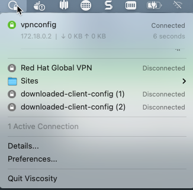

> **✨ Automated Terraform Module Available**
>
> This entire VPN setup process has been automated with Terraform! For a faster, simpler deployment, use the **[terraform-rosa-vpn](https://github.com/rh-mobb/terraform-rosa-vpn)** module which automates:
> - Certificate generation using easy-rsa
> - AWS Certificate Manager import
> - Client VPN endpoint creation and configuration
> - OpenVPN client configuration file generation
> - Full DNS mode configuration (no manual steps needed)
>
> Follow the instructions in the [terraform-rosa-vpn repository](https://github.com/rh-mobb/terraform-rosa-vpn) for a one-command deployment (`terraform apply`).
>
> The manual process below is still valid if you prefer step-by-step setup or need to customize the configuration.

---

When you configure a Red Hat OpenShift on AWS (ROSA) cluster with a private link configuration, you will need connectivity to this private network in order to access your cluster. This guide will show you how to configure an AWS Client VPN connection so you won't need to setup and configure Jump Boxes.

## Prerequisites

* A private ROSA cluster:
  * **ROSA HCP**: Follow this [guide](/experts/rosa/hcp-private-api-access/) to create a private ROSA HCP cluster
  * **ROSA Classic**: Follow this [guide](/experts/rosa/private-link/) to create a private ROSA Classic cluster
* AWS CLI configured with appropriate credentials
* `jq` command-line JSON processor
* `rosa` CLI tool
* OpenVPN-compatible VPN client software:
  * **macOS**: [Viscosity](https://www.sparklabs.com/viscosity/), [Tunnelblick](https://tunnelblick.net/), or [AWS VPN Client](https://aws.amazon.com/vpn/client-vpn-download/)
  * **Linux**: OpenVPN or [AWS VPN Client](https://aws.amazon.com/vpn/client-vpn-download/)
  * **Windows**: OpenVPN GUI or [AWS VPN Client](https://aws.amazon.com/vpn/client-vpn-download/)

## Set Envrionment Variables

Start by setting environment variables that we will use to setup the VPN connection

```bash
export ROSA_CLUSTER_NAME=<rosa cluster name>

export REGION=$(rosa describe cluster -c $ROSA_CLUSTER_NAME  -o json | jq -r .region.id)

export VPN_CLIENT_CIDR=172.16.0.0/16

export PRIVATE_SUBNET_IDS=$(rosa describe cluster -c $ROSA_CLUSTER_NAME -o json | jq -r '.aws.subnet_ids[]')
```

## Create certificates to use for your VPN Connection

There are many ways and methods to create certificates for VPN, the guide below is one of the ways that works well.  Note, that whatever method you use, make sure it supports "X509v3 Extended Key Usage".

1. Clone OpenVPN/easy-rsa

   ```bash
   git clone https://github.com/OpenVPN/easy-rsa.git
   ```

1. Change to the easyrsa directory

   ```bash
   cd easy-rsa/easyrsa3
   ```

1. Initialize the PKI

   ```bash
   ./easyrsa init-pki
   ```

1. Edit certificate parameters

   Copy pki/vars.example as pki/vars, uncomment and edit the copied template with your values

   ```bash
   vim pki/vars
   ```

   ```
   set_var EASYRSA_REQ_COUNTRY   "US"
   set_var EASYRSA_REQ_PROVINCE  "California"
   set_var EASYRSA_REQ_CITY      "San Francisco"
   set_var EASYRSA_REQ_ORG       "Copyleft Certificate Co"
   set_var EASYRSA_REQ_EMAIL     "me@example.net"
   set_var EASYRSA_REQ_OU        "My Organizational Unit"
   ```

   Uncomment (remove the #) the folowing field

   ```
   #set_var EASYRSA_KEY_SIZE        2048
   ```

1. Create the CA:

   ```bash
   ./easyrsa build-ca nopass
   ```

1. Generate the Server Certificate and Key

   The server certificate must include a Subject Alternative Name (SAN) for AWS Certificate Manager import to succeed.

   ```bash
   ./easyrsa --subject-alt-name="DNS:vpn.$ROSA_CLUSTER_NAME.local" build-server-full server nopass
   ```

1. Generate Diffie-Hellman (DH) parameters

   ```bash
   ./easyrsa gen-dh
   ```

1. Generate client credentials

   ```bash
   ./easyrsa build-client-full client nopass
   ```

## Import certficates into AWS Certificate Manager

1. Import the server certificate

   * Before running the below commands, make sure you are still in the pki directory under the easyrsa3 directory

    ```bash
   SERVER_CERT_ARN=$(aws acm import-certificate \
   --certificate fileb://issued/server.crt \
   --private-key fileb://private/server.key \
   --certificate-chain fileb://ca.crt \
   --region $REGION \
   --query CertificateArn \
   --output text)
    ```

1. Import the client certificate

     ```bash
     CLIENT_CERT_ARN=$(aws acm import-certificate \
     --certificate fileb://issued/client.crt \
     --private-key fileb://private/client.key \
     --certificate-chain fileb://ca.crt \
     --region $REGION \
     --query CertificateArn \
     --output text)
    ```

## Create a Client VPN Endpoint

1. Retrieve the VPN Client ID

   ```bash
    VPN_CLIENT_ID=$(aws ec2 create-client-vpn-endpoint \
    --client-cidr-block $VPN_CLIENT_CIDR \
    --server-certificate-arn $SERVER_CERT_ARN \
    --authentication-options Type=certificate-authentication,MutualAuthentication={ClientRootCertificateChainArn=$CLIENT_CERT_ARN} \
    --connection-log-options Enabled=false --split-tunnel --query ClientVpnEndpointId --output text)
   ```

1. Associate each private subnet with the client VPN endpoint
   
   ```bash
   while IFS= read -r subnet;
   do
      echo "Associcating subnet '$subnet'"
      aws ec2 associate-client-vpn-target-network --subnet-id $subnet --client-vpn-endpoint-id $VPN_CLIENT_ID
   done <<< "$PRIVATE_SUBNET_IDS"
   ```

1. Wait for the VPN endpoint to become available

   The VPN endpoint takes several minutes to become available after subnet association.

   ```bash
   echo "Waiting for VPN endpoint to become available..."
   while true; do
     STATUS=$(aws ec2 describe-client-vpn-endpoints \
       --client-vpn-endpoint-ids $VPN_CLIENT_ID \
       --query 'ClientVpnEndpoints[0].Status.Code' \
       --output text)
     echo "$(date +%H:%M:%S) - Status: $STATUS"
     if [ "$STATUS" = "available" ]; then
       echo "✓ VPN endpoint is ready"
       break
     fi
     sleep 15
   done
   ```

1. Add an ingress authorization rule to a Client VPN endpoint

   ```bash
   aws ec2 authorize-client-vpn-ingress \
    --client-vpn-endpoint-id $VPN_CLIENT_ID \
    --target-network-cidr 0.0.0.0/0 \
    --authorize-all-groups
   ```

## Configure Security Groups for Private ROSA HCP Clusters

If you are connecting to a **private ROSA HCP cluster**, you must configure the VPC endpoint security group to allow traffic from VPN clients. Public ROSA clusters or ROSA Classic clusters may not require this step.

1. Get the VPC endpoint ID for the cluster API

   ```bash
   export SUBNET_ID=$(rosa list machinepools -c $ROSA_CLUSTER_NAME -o json | jq -r '.[0].subnet')
   export VPC_ID=$(aws ec2 describe-subnets --subnet-ids $SUBNET_ID --query 'Subnets[0].VpcId' --output text)
   VPC_ENDPOINT_ID=$(aws ec2 describe-vpc-endpoints \
     --filters "Name=vpc-id,Values=$(aws ec2 describe-subnets --subnet-ids $SUBNET_ID --query 'Subnets[0].VpcId' --output text)" \
     --query 'VpcEndpoints[?ServiceName!=`null`] | [?contains(ServiceName, `vpce-svc`)] | [0].VpcEndpointId' \
     --output text)
   ```

1. Get the security group attached to the VPC endpoint

   ```bash
   VPCE_SG_ID=$(aws ec2 describe-vpc-endpoints \
     --vpc-endpoint-ids $VPC_ENDPOINT_ID \
     --query 'VpcEndpoints[0].Groups[0].GroupId' \
     --output text)
   ```

1. Add ingress rule to allow VPN client traffic to the API endpoint

   ```bash
   aws ec2 authorize-security-group-ingress \
     --group-id $VPCE_SG_ID \
     --protocol tcp \
     --port 443 \
     --cidr $VPN_CLIENT_CIDR
   ```

## Configure your OpenVPN Client

1. Download the VPN Client Configuration

   ```bash
   aws ec2 export-client-vpn-client-configuration --client-vpn-endpoint-id $VPN_CLIENT_ID --output text>client-config.ovpn
   ```

1. Run the following commands to add the certificates created in the first step to the VPN Configuration file.

   * note: make sure you are still in the easy rsa / pki directory.

   ```bash
   echo '<cert>' >> client-config.ovpn

   openssl x509 -in issued/client.crt >> client-config.ovpn
   
   echo '</cert>' >> client-config.ovpn
   
   echo '<key>' >> client-config.ovpn
   
   cat private/client.key >> client-config.ovpn
   
   echo '</key>' >> client-config.ovpn
   ```

1. Add DNS Configuration to VPN client config

   To resolve the ROSA cluster domain names, you need to configure DNS settings in your VPN client. The DNS server will be the x.x.x.2 address of your VPC CIDR. For example, if your VPC CIDR is 10.66.0.0/16 then your DNS server will be 10.66.0.2

   You can find the VPC CIDR with this command:

   ```bash
   VPC_CIDR=$(rosa describe cluster -c $ROSA_CLUSTER_NAME -o json | jq -r '.network.machine_cidr')
   DNS_SERVER=$(echo $VPC_CIDR | sed 's/\([0-9]*\)\.\([0-9]*\)\..*/\1.\2.0.2/')
   echo "DNS Server: $DNS_SERVER"
   ```

   You can find the ROSA base domain with this command:

   ```bash
   ROSA_DOMAIN=$(rosa describe cluster -c $ROSA_CLUSTER_NAME -o json | jq -r '.dns.base_domain')
   echo "ROSA Domain: $ROSA_DOMAIN"
   ```

   Add these DNS settings to your VPN configuration file:

   ```bash
   echo "dhcp-option DNS $DNS_SERVER" >> client-config.ovpn
   echo "dhcp-option DOMAIN $ROSA_DOMAIN" >> client-config.ovpn
   ```

1. Import the client-config.ovpn file into your VPN Software

   * Mac users - just double click the client-config.ovpn and it will be imported automatically into your VPN client.

1. Configure DNS Settings in VPN Client (macOS with Viscosity or Tunnelblick)

   After importing the configuration, you may need to manually configure DNS settings in your VPN client:

   **Option 1: Full DNS Mode (Recommended for simplicity)**
   
   This forces all DNS queries through the VPN DNS server while connected:

   * Edit the VPN connection
   * Go to the **Networking** tab
   * Set **DNS Mode** to **"Full"**
   * Set **DNS Servers** to the DNS server IP (e.g., `10.40.0.2`)
   * Remove any entries in **DNS Domains** (leave blank for Full mode)
   * Save and reconnect

   **Option 2: Split DNS Mode (Advanced)**

   This only routes specific domain queries through the VPN DNS:

   * Edit the VPN connection
   * Go to the **Networking** tab
   * Set **DNS Mode** to **"Split DNS"**
   * Set **DNS Servers** to the DNS server IP (e.g., `10.40.0.2`)
   * Set **DNS Domains** to your ROSA domain and `openshiftapps.com` (e.g., `qftf.p3.openshiftapps.com, openshiftapps.com`)
   * Save and reconnect

   > **Note**: If Split DNS mode does not work (DNS queries still go to your local DNS server), use Full DNS mode instead. macOS DNS resolver priority can sometimes prevent split DNS from working correctly.

   After connecting, verify DNS resolution:

   ```bash
   nslookup api.$ROSA_CLUSTER_NAME.$ROSA_DOMAIN
   ```

   You should see the DNS server as your VPC DNS (e.g., `10.40.0.2`) and the API endpoint should resolve to a private IP within your VPC CIDR.

1. Connect your VPN

   

## Verify VPN Connection

After connecting to the VPN, verify that you can access the cluster:

1. Check DNS resolution

   ```bash
   nslookup api.$ROSA_CLUSTER_NAME.$ROSA_DOMAIN
   ```

   You should see the DNS server as your VPC DNS (e.g., `10.40.0.2`) and the API endpoint should resolve to a private IP within your VPC CIDR.

1. Test connectivity to the API endpoint

   ```bash
   API_IP=$(nslookup api.$ROSA_CLUSTER_NAME.$ROSA_DOMAIN | grep -A1 "Name:" | tail -1 | awk '{print $2}')
   curl -k https://$API_IP/healthz
   ```
   
   You should see `ok` in the response.

1. Log into the cluster

   ```bash
   oc login $(rosa describe cluster -c $ROSA_CLUSTER_NAME -o json | jq -r .api.url)
   ```

   You will be prompted for your cluster credentials.

## Troubleshooting

### VPN connects but DNS doesn't resolve

**Symptoms**: VPN connection succeeds but `nslookup` or `oc login` fails with "no such host" errors.

**Solutions**:

* **macOS users**: Ensure DNS mode is set to "Full" in your VPN client settings (see DNS configuration section above)
* Flush DNS cache:
  ```bash
  sudo dscacheutil -flushcache && sudo killall -HUP mDNSResponder
  ```
* Verify VPN pushed DNS settings:
  ```bash
  scutil --dns | grep -A 3 "nameserver"
  ```
  You should see your VPC DNS server (e.g., `10.40.0.2`) listed.

### Can't reach cluster API after connecting

**Symptoms**: DNS resolves correctly but `curl` or `oc login` times out or fails to connect.

**Solutions**:

* Verify VPN endpoint security group allows traffic from VPN client CIDR:
  ```bash
  aws ec2 describe-security-groups \
    --group-ids $(aws ec2 describe-client-vpn-endpoints \
      --client-vpn-endpoint-ids $VPN_CLIENT_ID \
      --query 'ClientVpnEndpoints[0].SecurityGroupIds[0]' \
      --output text) \
    --query 'SecurityGroups[0].IpPermissions'
  ```

* For private ROSA HCP clusters, check VPC endpoint security group (see "Configure Security Groups for Private ROSA HCP Clusters" section)

* Test direct IP connectivity:
  ```bash
  API_IP=$(nslookup api.$ROSA_CLUSTER_NAME.$ROSA_DOMAIN | grep -A1 "Name:" | tail -1 | awk '{print $2}')
  curl -k -v https://$API_IP:443/healthz
  ```

### Certificate import fails

**Symptoms**: `aws acm import-certificate` fails with "Certificate does not have a domain" or certificate/key mismatch errors.

**Solutions**:

* Ensure server certificate has Subject Alternative Name:
  ```bash
  openssl x509 -in issued/server.crt -noout -text | grep "Subject Alternative Name" -A 1
  ```
  You should see `DNS:vpn.<cluster-name>.local` in the output.

* Verify certificate and key match:
  ```bash
  openssl x509 -in issued/server.crt -noout -modulus | openssl md5
  openssl rsa -in private/server.key -noout -modulus | openssl md5
  ```
  Both commands should output the same MD5 hash.

* Verify certificate chain is complete:
  ```bash
  openssl verify -CAfile ca.crt issued/server.crt
  openssl verify -CAfile ca.crt issued/client.crt
  ```
  Both should output `<cert>: OK`

### VPN client shows "TLS key negotiation failed"

**Symptoms**: VPN client fails to connect with TLS handshake errors.

**Solutions**:

* Verify the client configuration file has all three certificate sections (`<ca>`, `<cert>`, `<key>`)
* Ensure you imported the correct client certificate and key (not the server certificate)
* Check that certificate and key are in PEM format (text-based, not binary DER)

## Cleanup

To remove the VPN infrastructure when no longer needed:

1. Disassociate target networks from the VPN endpoint

   ```bash
   aws ec2 describe-client-vpn-target-networks \
     --client-vpn-endpoint-id "$VPN_CLIENT_ID" \
     --query 'ClientVpnTargetNetworks[*].AssociationId' \
     --output text | xargs -n 1 aws ec2 disassociate-client-vpn-target-network --client-vpn-endpoint-id "$VPN_CLIENT_ID" --association-id
   
   ```

1. Wait for disassociation to complete

   ```bash
   echo "Waiting for disassociation to complete..."
   while true; do
     COUNT=$(aws ec2 describe-client-vpn-target-networks \
       --client-vpn-endpoint-id $VPN_CLIENT_ID \
       --query 'length(ClientVpnTargetNetworks)' \
       --output text)
     if [ "$COUNT" = "0" ]; then
       echo "✓ All associations removed"
       break
     fi
     echo "$(date +%H:%M:%S) - Waiting... ($COUNT associations remaining)"
     sleep 10
   done
   ```

1. Delete the client VPN endpoint

   ```bash
   aws ec2 delete-client-vpn-endpoint --client-vpn-endpoint-id $VPN_CLIENT_ID
   ```

1. Delete certificates from AWS Certificate Manager

   ```bash
   aws acm delete-certificate --certificate-arn $SERVER_CERT_ARN --region $REGION
   aws acm delete-certificate --certificate-arn $CLIENT_CERT_ARN --region $REGION
   ```

1. (Optional) Remove the easy-rsa directory and certificates

   ```bash
   cd ..
   rm -rf easy-rsa
   ```
