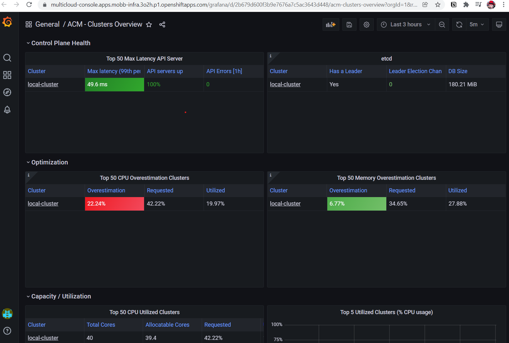

# Advanced Cluster Management Observability on ROSA

This document will take you through deploying ACM Observability on an STS enabled ROSA cluster. see [here](https://access.redhat.com/documentation/en-us/red_hat_advanced_cluster_management_for_kubernetes/2.4/html/observability/observing-environments-intro#enabling-observability) for the original documentation.

**Note:** This guide uses an unsupported (by ACM) method to utilize ROSA's STS authentication back into AWS S3 and is not advised for production use at this time.

## Prerequisites

* An existing ROSA cluster with STS mode
* An Advanced Cluster Management (ACM) deployment

## Set up environment

1. Set environment variables

```bash
    export CLUSTER_NAME=mobb-infra
    export S3_BUCKET=$CLUSTER_NAME-acm-observability
    export REGION=us-east-2
    export NAMESPACE=open-cluster-management-observability
    export SA=tbd
    export SCRATCH_DIR=/tmp/scratch
    export OIDC_PROVIDER=$(oc get authentication.config.openshift.io cluster -o json | jq -r .spec.serviceAccountIssuer| sed -e "s/^https:\/\///")
    export AWS_ACCOUNT_ID=$(aws sts get-caller-identity --query Account --output text)
    export AWS_PAGER=""
    rm -rf $SCRATCH_DIR
    mkdir -p $SCRATCH_DIR
```

## Prepare AWS Account

1. Create an S3 bucket

    ```bash
    aws s3 mb s3://$S3_BUCKET
    ```

1. Create a Policy for access to S3

    ```bash
cat <<EOF > $SCRATCH_DIR/s3-policy.json
{
    "Version": "2012-10-17",
    "Statement": [
        {
            "Sid": "Statement",
            "Effect": "Allow",
            "Action": [
                "s3:ListBucket",
                "s3:GetObject",
                "s3:DeleteObject",
                "s3:PutObject",
                "s3:PutObjectAcl",
                "s3:CreateBucket",
                "s3:DeleteBucket"
            ],
            "Resource": [
                "arn:aws:s3:::$S3_BUCKET/*",
                "arn:aws:s3:::$S3_BUCKET"
            ]
        }
    ]
}
EOF
    ```

1. Apply the Policy

    ```bash
    S3_POLICY=$(aws iam create-policy --policy-name $CLUSTER_NAME-acm-obs \
      --policy-document file://$SCRATCH_DIR/s3-policy.json \
      --query 'Policy.Arn' --output text)
    echo $S3_POLICY
    ```

1. Create a Trust Policy

    ```bash
cat <<EOF > $SCRATCH_DIR/TrustPolicy.json
{
  "Version": "2012-10-17",
  "Statement": [
    {
      "Effect": "Allow",
      "Principal": {
        "Federated": "arn:aws:iam::${AWS_ACCOUNT_ID}:oidc-provider/${OIDC_PROVIDER}"
      },
      "Action": "sts:AssumeRoleWithWebIdentity",
      "Condition": {
        "StringEquals": {
          "${OIDC_PROVIDER}:sub": [
            "system:serviceaccount:${NAMESPACE}:observability-thanos-query",
            "system:serviceaccount:${NAMESPACE}:observability-thanos-store-shard",
            "system:serviceaccount:${NAMESPACE}:observability-thanos-compact"
          ]
        }
      }
    }
  ]
}
EOF
    ```

1. Create Role for AWS Prometheus and CloudWatch

    ```bash
    S3_ROLE=$(aws iam create-role \
      --role-name "$CLUSTER_NAME-acm-obs-s3" \
      --assume-role-policy-document file://$SCRATCH_DIR/TrustPolicy.json \
      --query "Role.Arn" --output text)
    echo $S3_ROLE
    ```

1. Attach the Policies to the Role

    ```bash
    aws iam attach-role-policy \
      --role-name "$CLUSTER_NAME-acm-obs-s3" \
      --policy-arn $S3_POLICY
    ```

## ACM Hub

Log into the OpenShift cluster that is running your ACM Hub.  We'll set up Observability here

1. Create a namespace for the observability

    ```bash
    oc new-project $NAMESPACE
    ```

1. Generate a pull secret (this will check if the pull secret exists, if not, it will create it)

    ```bash
DOCKER_CONFIG_JSON=`oc extract secret/multiclusterhub-operator-pull-secret -n open-cluster-management --to=-` || \
    DOCKER_CONFIG_JSON=`oc extract secret/pull-secret -n openshift-config --to=-` && \
    oc create secret generic multiclusterhub-operator-pull-secret \
    -n open-cluster-management-observability \
    --from-literal=.dockerconfigjson="$DOCKER_CONFIG_JSON" \
    --type=kubernetes.io/dockerconfigjson
    ```

1. Create a Secret containing your S3 details

    ```bash
cat << EOF | kubectl apply -f -
apiVersion: v1
kind: Secret
metadata:
  name: thanos-object-storage
  namespace: open-cluster-management-observability
type: Opaque
stringData:
  thanos.yaml: |
    type: s3
    config:
      bucket: $S3_BUCKET
      endpoint: s3.$REGION.amazonaws.com
      signature_version2: false
EOF
    ```

1. Create a CR for `MulticlusterHub`

    ```bash
cat << EOF | kubectl apply -f -
apiVersion: observability.open-cluster-management.io/v1beta2
kind: MultiClusterObservability
metadata:
  name: observability
spec:
  observabilityAddonSpec: {}
  storageConfig:
    metricObjectStorage:
      name: thanos-object-storage
      key: thanos.yaml
EOF
    ```

1. Annotate the service accounts to use STS

    ```bash
oc annotate -n open-cluster-management-observability serviceaccount observability-thanos-query \
      eks.amazonaws.com/role-arn=$S3_ROLE
oc annotate -n open-cluster-management-observability serviceaccount observability-thanos-store-shard \
      eks.amazonaws.com/role-arn=$S3_ROLE
oc annotate -n open-cluster-management-observability serviceaccount observability-thanos-compact \
      eks.amazonaws.com/role-arn=$S3_ROLE
    ```

1. Restart thanos pods to use the new credentials

    ```bash
kubectl rollout restart deployment/observability-thanos-query
kubectl rollout restart statefulset/observability-thanos-compact
kubectl rollout restart statefulset/observability-thanos-store-shard-0
kubectl rollout restart statefulset/observability-thanos-store-shard-1
kubectl rollout restart statefulset/observability-thanos-store-shard-2
    ```

1. Check for any pods that aren't running

    ```bash
    kubectl get pods --field-selector status.phase!=Running
    ```

    Delete any pods that are not running in order to have them recreated with the correct credentials

    ```bash
    kubectl delete pods $(kubectl get pods --field-selector status.phase!=Running -o name | xargs)
    ```

1. Log into Advanced Cluster management and access the new Grafana dashboard


