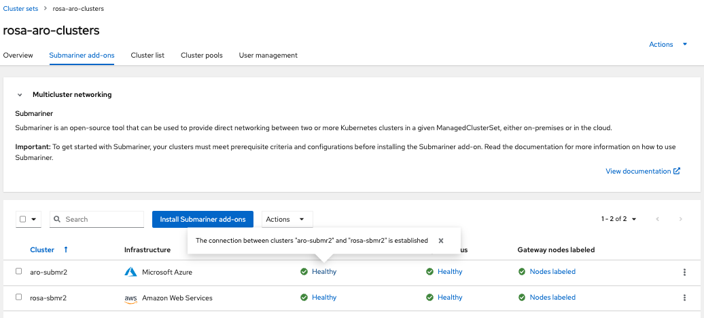

# Deploy ACM Submariner for connect overlay networks ARO - ROSA clusters

Author: [Roberto Carratalá](https://github.com/rcarrata)

Submariner is an open source tool that can be used with Red Hat Advanced Cluster Management for Kubernetes to provide direct networking between pods and compatible multicluster service discovery across two or more Kubernetes clusters in your environment, either on-premises or in the cloud.

This article describes how to deploy ACM Submariner for connecting overlay networks of ARO and ROSA clusters.

## Prerequisites

* OpenShift Cluster version 4 (ROSA/ARO or non-ROSA/ARO)
* az cli
* rosa cli
* aws cli (optional)

## Manage Multiple Logins

* In order to manage several clusters, we will add a new Kubeconfig file to manage the logins and change quickly from one context to another:

```
rm -rf /var/tmp/acm-lab-kubeconfig
touch /var/tmp/acm-lab-kubeconfig
export KUBECONFIG=/var/tmp/acm-lab-kubeconfig
```

## Deploy ACM Cluster HUB

We will use the first OpenShift cluster to deploy ACM Hub. 

* Login into the HUB OpenShift cluster and set the proper context:

```sh
oc login --username xxx --password xxx --server=https://api.cluster-xxx.xxx.xxx.xxx.com:6443

kubectl config rename-context $(oc config current-context) hub
kubectl config use hub
```

* Create the namespace for ACM

```sh
cat << EOF | kubectl apply -f -
apiVersion: v1
kind: Namespace
metadata:
  name: open-cluster-management
  labels:
    openshift.io/cluster-monitoring: "true"
EOF
```

* Create the OperatorGroup for ACM

```sh
cat << EOF | kubectl apply -f -
apiVersion: operators.coreos.com/v1
kind: OperatorGroup
metadata:
  name: open-cluster-management
  namespace: open-cluster-management
spec:
  targetNamespaces:
    - open-cluster-management
EOF
```

* Install Operator ACM 2.7

```sh
cat << EOF | kubectl apply -f -
apiVersion: operators.coreos.com/v1alpha1
kind: Subscription
metadata:
  name: advanced-cluster-management
  namespace: open-cluster-management
spec:
  channel: release-2.7
  installPlanApproval: Automatic
  name: advanced-cluster-management
  source: redhat-operators
  sourceNamespace: openshift-marketplace
EOF
```

NOTE: you can select from ACM 2.7 onwards for install ACM Submariner for ROSA/ARO. 

* Check that the Operator has installed successfully

```sh
oc get csv
NAME                                 DISPLAY                                      VERSION   REPLACES   PHASE
advanced-cluster-management.v2.7.0   Advanced Cluster Management for Kubernetes   2.7.0                Succeeded
```

NOTE: ACM Submariner for ROSA/ARO will only work from ACM 2.7 onwards! Ensure that you have a >= 2.7 ACM version.

* Install MultiClusterHub instance in the ACM namespace

```sh
cat << EOF | kubectl apply -f -
apiVersion: operator.open-cluster-management.io/v1
kind: MultiClusterHub
metadata:
  namespace: open-cluster-management
  name: multiclusterhub
spec: {}
EOF
```

NOTE: if it's not in Running state, wait a couple of minutes and check again.


## Deploy ROSA Cluster

* Define the prerequisites for install the ROSA cluster

```sh
 export VERSION=4.10.15 \
        ROSA_CLUSTER_NAME=rosa-sbmr1 \
        AWS_ACCOUNT_ID=`aws sts get-caller-identity --query Account --output text` \
        REGION=eu-west-1 \
        AWS_PAGER="" \
        CIDR="10.10.0.0/16"
```

NOTE: it's critical that the Machine CIDR of the ROSA and ARO clusters not overlap, for that reason we're setting different CIDRs than the out of the box ROSA / ARO cluster install.  

* Create the IAM Account Roles

  ```sh
  rosa create account-roles --mode auto --yes
  ```

* Generate a STS ROSA cluster

```sh
rosa create cluster -y --cluster-name ${ROSA_CLUSTER_NAME} \
--region ${REGION} --version ${VERSION} \
--machine-cidr $CIDR \
--sts
```

* Create the Operator and OIDC Roles

```sh
rosa create operator-roles --cluster ${ROSA_CLUSTER_NAME} --mode auto --yes
rosa create oidc-provider --cluster ${ROSA_CLUSTER_NAME} --mode auto --yes
```

* Check the status of the Rosa cluster (40 mins wait until is in ready status)

```sh
rosa describe cluster --cluster ${ROSA_CLUSTER_NAME} | grep State
State:                      ready
```

* Set the admin user for the ROSA cluster

```sh
rosa create admin --cluster=$ROSA_CLUSTER_NAME
```

* Login into the rosa cluster and set the proper context

```sh
oc login https://api.rosa-sbmr1.xxx.xxx.xxx.com:6443 --username cluster-admin --password xxx

kubectl config rename-context $(oc config current-context) $ROSA_CLUSTER_NAME
kubectl config use $ROSA_CLUSTER_NAME

kubectl get dns cluster -o jsonpath='{.spec.baseDomain}'
```

### Generate ROSA New nodes for submariner 

* Create new node/s that will be used to run Submariner gateway using the following command (check https://github.com/submariner-io/submariner/issues/1896 for more details)

```sh
rosa create machinepool --cluster $ROSA_CLUSTER_NAME --name=sm-gw-mp --replicas=1 --labels='submariner.io/gateway=true'
```

NOTE: setting replicas=2  means that we allocate two nodes for SM GW , to support GW Active/Passive HA (check [Gateway Failover](https://submariner.io/getting-started/architecture/gateway-engine/) section ), if GW HA is not needed you can set replicas=1.

* Check the machinepools requested, including the submariner machinepool requested

```sh
rosa list machinepools -c $ROSA_CLUSTER_NAME
ID        AUTOSCALING  REPLICAS  INSTANCE TYPE  LABELS                        TAINTS    AVAILABILITY ZONES    SPOT INSTANCES
Default   No           2         m5.xlarge                                              eu-west-1a            N/A
sm-gw-mp  No           2         m5.xlarge      submariner.io/gateway=true              eu-west-1a            No
```

* After a couple of minutes, check the new nodes generated

```sh
kubectl get nodes --show-labels | grep submariner
```

### Deploy ARO Cluster

* Define the prerequisites for install the ROSA cluster

```sh
AZR_RESOURCE_LOCATION=eastus
AZR_RESOURCE_GROUP=aro-rcarrata-rg
AZR_CLUSTER=aro-rcarrata
AZR_PULL_SECRET=~/Downloads/pull-secret.txt
```

* Create an Azure resource group

```sh
 az group create \
   --name $AZR_RESOURCE_GROUP \
   --location $AZR_RESOURCE_LOCATION
```

* Create virtual network

```sh
 az network vnet create \
   --address-prefixes 10.0.0.0/22 \
   --name "$AZR_CLUSTER-aro-vnet-$AZR_RESOURCE_LOCATION" \
   --resource-group $AZR_RESOURCE_GROUP
```

* Disable network policies on the control plane subnet

```sh
 az network vnet subnet create \
   --resource-group $AZR_RESOURCE_GROUP \
   --vnet-name "$AZR_CLUSTER-aro-vnet-$AZR_RESOURCE_LOCATION" \
   --name "$AZR_CLUSTER-aro-control-subnet-$AZR_RESOURCE_LOCATION" \
   --address-prefixes 10.0.0.0/23 \
   --service-endpoints Microsoft.ContainerRegistry
```

* Create the ARO cluster

```sh
 az aro create \
   --resource-group $AZR_RESOURCE_GROUP \
   --name $AZR_CLUSTER \
   --vnet "$AZR_CLUSTER-aro-vnet-$AZR_RESOURCE_LOCATION" \
   --master-subnet "$AZR_CLUSTER-aro-control-subnet-$AZR_RESOURCE_LOCATION" \
   --worker-subnet "$AZR_CLUSTER-aro-machine-subnet-$AZR_RESOURCE_LOCATION" \
   --pull-secret @$AZR_PULL_SECRET
```

* Get ARO OpenShift console URL

```sh
 az aro show \
   --name $AZR_CLUSTER \
   --resource-group $AZR_RESOURCE_GROUP \
   -o tsv --query consoleProfile
```

* Login into the ARO cluster and set context

```sh
 az aro list-credentials \
   --name $AZR_CLUSTER \
   --resource-group $AZR_RESOURCE_GROUP \
   -o tsv
```

* Login into the ARO cluster and set context

```sh
oc login --username kubeadmin --password xxx --server=https://api.xxx.xxx.xxx:6443

kubectl config rename-context $(oc config current-context) $AZR_CLUSTER
kubectl config use $AZR_CLUSTER

kubectl get dns cluster -o jsonpath='{.spec.baseDomain}'
```

NOTE: ARO doesn't need to generate extra nodes to have the ACM submariner components deployed. 

## Create ManagedClusterSets

* Create a ManagedClusterSet for ROSA and ARO clusters

```sh
kubectl config use hub
kubectl get dns cluster -o jsonpath='{.spec.baseDomain}'

cat << EOF | kubectl apply -f -
apiVersion: cluster.open-cluster-management.io/v1beta1
kind: ManagedClusterSet
metadata:
  name: rosa-aro-clusters
EOF
```

### Import ROSA cluster in ACM (CLI)

We will import the cluster using the auto-import secret and using the Klusterlet Addon Config.

* Retrieve ROSA TOKEN the ROSA API from the ROSA cluster

```sh
kubectl config use rosa-sub1
SUB1_API=$(oc whoami -t)
echo $SUB1_API
SUB1_TOKEN=$(oc whoami --show-server)
echo $SUB1_TOKEN
```

* Config the Hub as the current context

```sh
kubectl config use hub
kubectl get dns cluster -o jsonpath='{.spec.baseDomain}'
```

* Create (in ACM Hub cluster) ManagedCluster object defining the 

```sh
cat << EOF | kubectl apply -f -
apiVersion: cluster.open-cluster-management.io/v1
kind: ManagedCluster
metadata:
  name: $ROSA_CLUSTER_NAME
  labels:
    name: $ROSA_CLUSTER_NAME
    cloud: auto-detect
    vendor: auto-detect
    cluster.open-cluster-management.io/clusterset: rosa-aro-clusters
    env: $ROSA_CLUSTER_NAME
  annotations: {}
spec:
  hubAcceptsClient: true
EOF
```

* Create (in ACM Hub cluster) auto-import-secret.yaml secret defining the the token and server from ROSA cluster:

```sh
cat << EOF | kubectl apply -f -
apiVersion: v1
kind: Secret
metadata:
  name: auto-import-secret
  namespace: $ROSA_CLUSTER_NAME
stringData:
  autoImportRetry: "2"
  token: "${SUB1_TOKEN}"
  server: "${SUB1_API}"
type: Opaque
EOF
```

* Create and apply the klusterlet add-on configuration file for the ROSA cluster

```sh
cat << EOF | kubectl apply -f -
apiVersion: agent.open-cluster-management.io/v1
kind: KlusterletAddonConfig
metadata:
  name: $ROSA_CLUSTER_NAME
  namespace: $ROSA_CLUSTER_NAME
spec:
  clusterName: $ROSA_CLUSTER_NAME
  clusterNamespace: $ROSA_CLUSTER_NAME
  clusterLabels:
    name: $ROSA_CLUSTER_NAME
    cloud: auto-detect
    vendor: auto-detect
    cluster.open-cluster-management.io/clusterset: rosa-aro-clusters
    env: $ROSA_CLUSTER_NAME
  applicationManager:
    enabled: true
  policyController:
    enabled: true
  searchCollector:
    enabled: true
  certPolicyController:
    enabled: true
  iamPolicyController:
    enabled: true
EOF
```

* Check the imported cluster in ACM

```sh
kubectl get ManagedCluster
NAME            HUB ACCEPTED   MANAGED CLUSTER URLS                                           JOINED   AVAILABLE   AGE
local-cluster   true           https://api.cluster-xxxx.xxxx.xxxx.xxx.com:6443   True     True        5h9m
rosa-subm1      true           https://api.rosa-subm1.xxxx.p1.openshiftapps.com:6443          True     True        1m
```

### Import ARO cluster into ACM (CLI)

* Retrieve the ARO token and the ARO API url from the ARO cluster

```sh
kubectl config use $AZR_CLUSTER

SUB2_API=$(oc whoami --show-server)
echo $SUB2_API
SUB2_TOKEN=$(oc whoami -t)
echo $SUB2_TOKEN
```

* Config the Hub as the current context

```sh
kubectl config use hub
kubectl get mch -A
```

* Create (in the Hub) ManagedCluster object defining the ARO cluster:

```sh
cat << EOF | kubectl apply -f -
apiVersion: cluster.open-cluster-management.io/v1
kind: ManagedCluster
metadata:
  name: $AZR_CLUSTER
  labels:
    name: $AZR_CLUSTER
    cloud: auto-detect
    vendor: auto-detect
    cluster.open-cluster-management.io/clusterset: rosa-aro-clusters
    env: $AZR_CLUSTER
  annotations: {}
spec:
  hubAcceptsClient: true
EOF
```

* Create (in the Hub) auto-import-secret.yaml secret defining the the token and server from ARO cluster: 

```sh
cat << EOF | kubectl apply -f -
apiVersion: v1
kind: Secret
metadata:
  name: auto-import-secret
  namespace: $AZR_CLUSTER
stringData:
  autoImportRetry: "2"
  token: "${SUB2_TOKEN}"
  server: "${SUB2_API}"
type: Opaque
EOF
```

```sh
cat << EOF | kubectl apply -f -
apiVersion: agent.open-cluster-management.io/v1
kind: KlusterletAddonConfig
metadata:
  name: $AZR_CLUSTER
  namespace: $AZR_CLUSTER
spec:
  clusterName: $AZR_CLUSTER
  clusterNamespace: $AZR_CLUSTER
  clusterLabels:
    Name: $AZR_CLUSTER
    cloud: auto-detect
    vendor: auto-detect
    cluster.open-cluster-management.io/clusterset: rosa-aro-clusters
    env: $AZR_CLUSTER
  applicationManager:
    enabled: true
  policyController:
    enabled: true
  searchCollector:
    enabled: true
  certPolicyController:
    enabled: true
  iamPolicyController:
    enabled: true
EOF
```

### Review the clusters imported in ACM

* Check the managed clusters in ACM 

```sh
kubectl config use hub

kubectl get managedclusters
çNAME            HUB ACCEPTED   MANAGED CLUSTER URLS                                           JOINED   AVAILABLE   AGE
aro-submr2      true           https://api.xxxx.xxxx.xxxx:6443                             True     True        2m34s
local-cluster   true           https://api.cluster-xxxx.xxxx.xxxx.xxxx.com:6443   True     True        2d
rosa-sbmr1      true           https://api.rosa-xxxx.xxxx.p1.openshiftapps.com:6443          True     True        46h
```

## Deploy Submariner Addon in Managed ROSA and ARO clusters

NOTE: All of this commands are executed in the ACM Hub cluster, not in the ACM Managed Clusters (ROSA / ARO created).

* After the ManagedClusterSet is created, the submariner-addon creates a namespace called managed-cluster-set-name-broker and deploys the Submariner broker to it.

```sh
kubectl get ns | grep broker
default-broker                                     Active   2d
rosa-aro-clusters-broker                           Active   8m1s
```

* Create the Broker configuration on the hub cluster in the rosa-clusters-broker namespace:

```sh
cat << EOF | kubectl apply -f -
apiVersion: submariner.io/v1alpha1
kind: Broker
metadata:
     name: submariner-broker
     namespace: rosa-aro-clusters-broker
spec:
     globalnetEnabled: false
EOF
```

NOTE: Set the the value of globalnetEnabled to true if you want to enable Submariner Globalnet in the ManagedClusterSet.

* Check the Submariner Broker in the rosa-clusters-broker namespace:

```sh
$ kubectl get broker -n rosa-aro-clusters-broker
NAME                AGE
submariner-broker   5s
```

* Deploy the SubmarinerConfig for the ROSA cluster imported:

```sh
cat << EOF | kubectl apply -f -
apiVersion: submarineraddon.open-cluster-management.io/v1alpha1
kind: SubmarinerConfig
metadata:
  name: submariner
  namespace: $ROSA_CLUSTER_NAME
spec:
  IPSecNATTPort: 4500
  NATTEnable: true
  cableDriver: libreswan
  loadBalancerEnable: true
EOF
```

* Deploy the SubmarinerConfig for the ARO cluster imported:

```sh
cat << EOF | kubectl apply -f -
apiVersion: submarineraddon.open-cluster-management.io/v1alpha1
kind: SubmarinerConfig
metadata:
  name: submariner
  namespace: $AZR_CLUSTER
spec:
  IPSecNATTPort: 4500
  NATTEnable: true
  cableDriver: libreswan
  loadBalancerEnable: true
EOF
```

* Deploy Submariner on the ROSA cluster:

```sh
cat << EOF | kubectl apply -f -
apiVersion: addon.open-cluster-management.io/v1alpha1
kind: ManagedClusterAddOn
metadata:
     name: submariner
     namespace: $ROSA_CLUSTER_NAME
spec:
     installNamespace: submariner-operator
EOF
```

* Deploy Submariner on the ARO cluster:

```sh
cat << EOF | kubectl apply -f -
apiVersion: addon.open-cluster-management.io/v1alpha1
kind: ManagedClusterAddOn
metadata:
     name: submariner
     namespace: $AZR_CLUSTER
spec:
     installNamespace: submariner-operator
EOF
```

* Few minutes after we can check that the app Connection Status and the Agent Status are Healthy:


