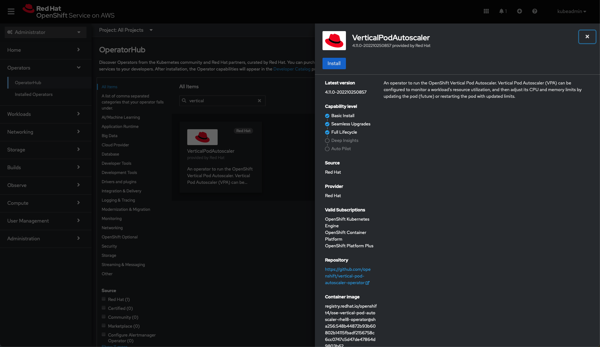
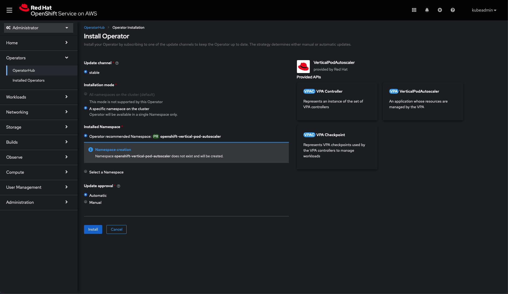

# Make Application Resilient 
In this document, we will deploy an application to ROSA/ARO cluster, Ensure the application is resilient to node failure and scale when under load.


## Prerequisites
* ROSA/ARO cluster
* oc cli
* siege

## Deploy an application
Let's deploy an application!  

We will be deploying a JavaScript based application called [frontend-js](https://github.com/sohaibazed/frontend-js.git). This application will run on OpenShift and will be deployed as a Deployment object. The Deployment object creates ReplicaSet and ReplicaSet creates and manages pods.

Deploy the application
```bash
oc new-project frontend-js
oc new-app https://github.com/sohaibazed/frontend-js.git --name frontend-js
oc expose svc frontend-js
oc set resources deployment/frontend-js \
   --limits=cpu=60m,memory=150Mi \
   --requests=cpu=50m,memory=100Mi
```

Wait a couple of minutes for the application to deploy and then run ```oc get route -n frontend-js``` command to get the URL to access the app.

you can run the following command to check the deployment object
```bash
oc get deployment
NAME          READY   UP-TO-DATE   AVAILABLE   AGE
frontend-js   0/1     0            0           59s
```

The following command will list the ReplicaSet object
```bash
oc get rs
NAME                     DESIRED   CURRENT   READY   AGE
frontend-js-7dd7d46854   1         1         1       58s
```

Right now the application is deployed inside one pod, and in case the worker running the pod crashes, the ReplicaSet object will register that the pod is down and recreate it on another node. You can scale the application to run on multiple pods using the following command

```bash
oc scale deployment frontend-js --replicas=3
deployment.apps/frontend-js scaled

oc get pod
NAME                           READY   STATUS      RESTARTS   AGE
frontend-js-1-build            0/1     Completed   0          5m7s
frontend-js-7cdc846c94-5mrk8   1/1     Running     0          3m45s
frontend-js-7cdc846c94-bj4wq   1/1     Running     0          3m45s
frontend-js-7cdc846c94-gjxv6   1/1     Running     0          4m39s
```

## Pod Disruption Budget
A Pod disruption Budget (PBD) allows you to limit the disruption to your application when its pods need to be rescheduled for upgrades or routine maintenance work on ARO nodes. In essence, it lets developers define the minimum tolerable operational requirements for a Deployment so that it remains stable even during a disruption. 

For example, frontend-js deployed as part of the last step contains two replicas distributed evenly across two nodes. We can tolerate losing one pods but not two, so we create a PDB that requires a minimum of two replicas.

A PodDisruptionBudget object’s configuration consists of the following key parts:

- A label selector, which is a label query over a set of pods.
- An availability level, which specifies the minimum number of pods that must be available simultaneously, either:
  - minAvailable is the number of pods must always be available, even during a disruption.
  - maxUnavailable is the number of pods can be unavailable during a disruption.


!!! note
    A maxUnavailable of 0% or 0 or a minAvailable of 100% or equal to the number of replicas is permitted but can block nodes from being drained.


Create PBD.yaml file with the following yaml.
```
apiVersion: policy/v1
kind: PodDisruptionBudget
metadata:
  name: frontend-js-pdb
spec:
  minAvailable: 2
  selector:
    matchLabels:
      deployment: frontend-js
```

Create PDB object
```
oc apply -f pdb.yaml
poddisruptionbudget.policy/frontend-js-pdb created
```

After creating PDB, OpenShift API will ensure two pods of ```frontend-js``` is running all the time while cluster is going through upgrade.

Check the status of PBD
```
oc get poddisruptionbudgets
NAME              MIN AVAILABLE   MAX UNAVAILABLE   ALLOWED DISRUPTIONS   AGE
frontend-js-pdb   2               N/A               1                     7m39s

```
## Horizontal Pod Autoscaler (HPA)

As a developer, you can use a horizontal pod autoscaler (HPA) to specify how OpenShift Container Platform should automatically increase or decrease the scale of a replication controller or deployment configuration, based on metrics collected from the pods that belong to that replication controller or deployment configuration. You can create an HPA for any any deployment, deployment config, replica set, replication controller, or stateful set.

In this exercise we will scale frontend application based on CPU utilization:

* Scale out when average CPU utilization is greater than 50% of CPU limit
* Maximum pods is 4
* Scale down to min replicas if utilization is lower than threshold for 60 sec

```
apiVersion: autoscaling/v2
kind: HorizontalPodAutoscaler
metadata:
  name: frontend-js-cpu
  namespace: frontend-js
spec:
  scaleTargetRef:
    apiVersion: apps/v1
    kind: Deployment
    name: frontend-js
  minReplicas: 2
  maxReplicas: 4
  metrics:
    - type: Resource
      resource:
        name: cpu
        target:
          averageUtilization: 50
          type: Utilization
  behavior:
    scaleDown:
      stabilizationWindowSeconds: 60
      policies:
      - type: Percent
        value: 100
        periodSeconds: 15

```

create CPU HPA for frontend-js app 
```
oc create -f hpa.yaml -n frontend-js
```

Check HPA status
```
watch oc get horizontalpodautoscaler/frontend-js-cpu -n frontend-js
NAME              REFERENCE                TARGETS   MINPODS   MAXPODS   REPLICAS   AGE
frontend-js-cpu   Deployment/frontend-js   0%/50%    2         4         2          33s
```

Generate load using siege. 
```
FRONTEND_URL=http://$(oc get route frontend-js -n frontend-js -o jsonpath='{.spec.host}')
siege -c 60 $FRONTEND_URL
```

wait for a minute and check the status of Horizontal Pod Autoscaler. Your app should scale up to more then two replicas by now. 

```
watch oc get horizontalpodautoscaler/frontend-js-cpu -n frontend-js
NAME              REFERENCE                TARGETS   MINPODS   MAXPODS   REPLICAS   AGE
frontend-js-cpu   Deployment/frontend-js   118%/50%   2         4         4          7m26s
```

Now kill the seige command using ```ctrl+c``` key combination or using the following command 

```bash
ps aux | grep siege
sohaibazed        1325  15.6  0.4 409647280  62576 s000  S+    9:38AM   0:01.66 siege -c 60 google.com

kill -9 1325
```
After you kill/stop the seige command, the traffic going to frontend-js service will cool down and after a 60sec cool down period you will see the replica count going down from 4 to 2

```bash 
watch oc get horizontalpodautoscaler/frontend-js-cpu -n frontend-js
NAME              REFERENCE                TARGETS   MINPODS   MAXPODS   REPLICAS   AGE
frontend-js-cpu   Deployment/frontend-js   0%/50%   2         4         2          7m26s
```

## Vertical Pod Autoscaler (VPA)
Determining the proper values for pod resources is challenging. This result is pod having over or under resource allocation. Vertical Pod Autoscaler can you solve this problem. The Vertical Pod Autoscaler Operator (VPA) is implemented as an API resource and a custom resource (CR). The CR determines the actions the Vertical Pod Autoscaler Operator should take with the pods associated with a specific workload object, such as a daemon set, replication controller, and so forth, in a project.

The VPA automatically computes historic and current CPU and memory usage for the containers in those pods and uses this data to determine optimized resource limits and requests to ensure that these pods are operating efficiently at all times. For example, the VPA reduces resources for pods that are requesting more resources than they are using and increases resources for pods that are not requesting enough.

The VPA automatically deletes any pods that are out of alignment with its recommendations one at a time, so that your applications can continue to serve requests with no downtime. The workload objects then re-deploy the pods with the original resource limits and requests. The VPA uses a mutating admission webhook to update the pods with optimized resource limits and requests before the pods are admitted to a node. If you do not want the VPA to delete pods, you can view the VPA resource limits and requests and manually update the pods as needed.

For example, if you have a pod that uses 50% of the CPU but only requests 10%, the VPA determines that the pod is consuming more CPU than requested and deletes the pod. The workload object, such as replica set, restarts the pods and the VPA updates the new pod with its recommended resources.

For developers, you can use the VPA to help ensure your pods stay up during periods of high demand by scheduling pods onto nodes that have appropriate resources for each pod.

Administrators can use the VPA to better utilize cluster resources, such as preventing pods from reserving more CPU resources than needed. The VPA monitors the resources that workloads are actually using and adjusts the resource requirements so capacity is available to other workloads. The VPA also maintains the ratios between limits and requests that are specified in initial container configuration.

With VPA, there are two different types of resource configurations that we can manage on each pod:
* Requests
* Limits

VPA can work in three different modes:
* Off: VPA just recommends its best estimate for resources in the status section of the VPA CRD
* Initial: VPA changes the container resources section to the follow its estimate, when new pods are created
* Auto: VPA adjusts the container resources spec of running pods, destroying them and recreating them (This process will honor Pod Disruption Budget, if set)

To enable VPA, goto Operator hub and install "VerticalPodAutoscaler" operator



Once the Operator is installed, go ahead and create an application that we will use to test VPA. We will be deploying a JavaScript based application called [frontend-js](https://github.com/sohaibazed/frontend-js.git). This application will run on OpenShift and will be deployed as a Deployment object. The Deployment object creates ReplicaSet and ReplicaSet creates and manages pods.

```bash
oc new-project vpa-demo
oc new-app https://github.com/sohaibazed/frontend-js.git --name frontend-js
oc expose svc frontend-js
oc set resources deployment/frontend-js \
   --limits=cpu=60m,memory=150Mi \
   --requests=cpu=50m,memory=100Mi
```

Now create VPA resource using the following manifest. Update mode is set to off in this example, which means VPA will make recommendations but make changes to resource allocation automatically.
```bash
apiVersion: autoscaling.k8s.io/v1
kind: VerticalPodAutoscaler
metadata:
  name: frontend-js-vpa
spec:
  targetRef:
    apiVersion: "apps/v1"
    kind:       Deployment
    name:       frontend-js
  updatePolicy:
    updateMode: "Off"
```
After a couple of seconds VPA will start making recommendations.

```bash
oc get vpa frontend-js-vpa -o yaml
apiVersion: autoscaling.k8s.io/v1
kind: VerticalPodAutoscaler
spec:
  targetRef:
    apiVersion: apps/v1
    kind: Deployment
    name: frontend-js
  updatePolicy:
    updateMode: "Off"
status:
  conditions:
  - lastTransitionTime: "2022-11-03T17:10:55Z"
    status: "True"
    type: RecommendationProvided
  recommendation:
    containerRecommendations:
    - containerName: frontend-js
      lowerBound:
        cpu: 25m
        memory: 262144k
      target:
        cpu: 25m
        memory: 262144k
      uncappedTarget:
        cpu: 25m
        memory: 262144k
      upperBound:
        cpu: 5291m
        memory: "11339574038"
```
You can use the seige command to generate traffic on the pod and see the recommendation changing over time

```bash
vpa_app_url=http://$(oc get route frontend-js -n vpa-demo -o jsonpath='{.spec.host}')
siege -c 60 $vpa_app_url
```

Open a new tab on your terminal and run the following command. Now you can see recommendation change in real time
```bash
oc get vpa
NAME              MODE   CPU   MEM       PROVIDED   AGE
frontend-js-vpa   Off    78m   262144k   True       11m
```