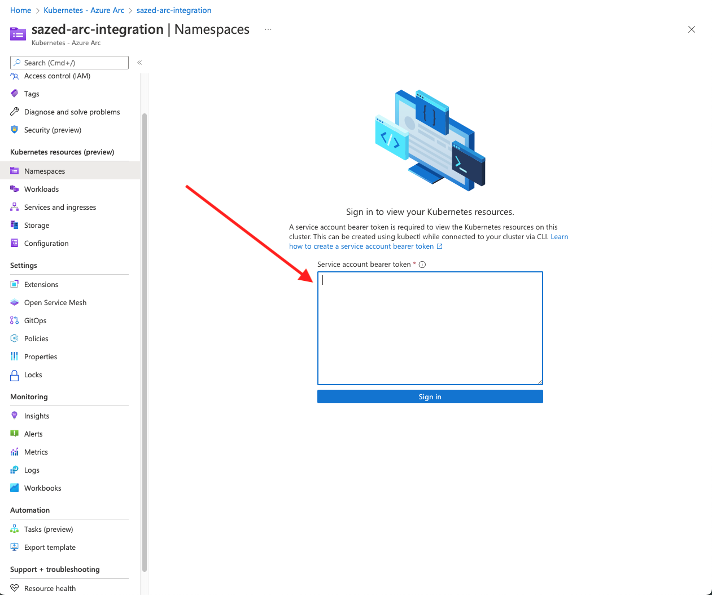
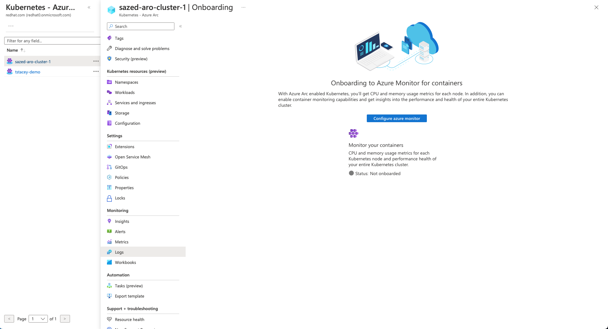
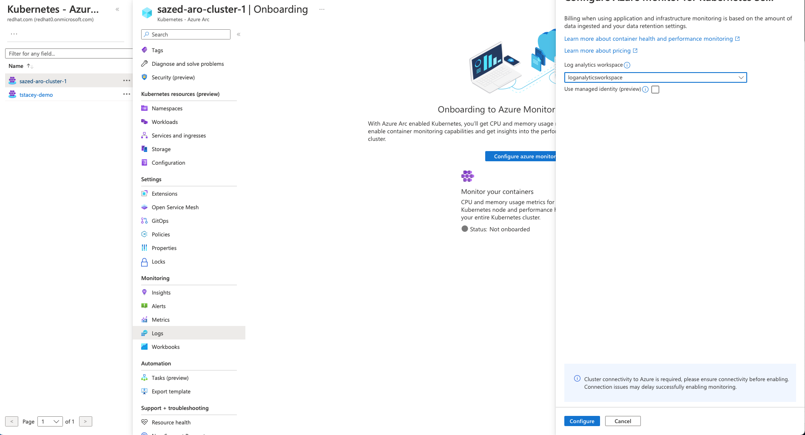
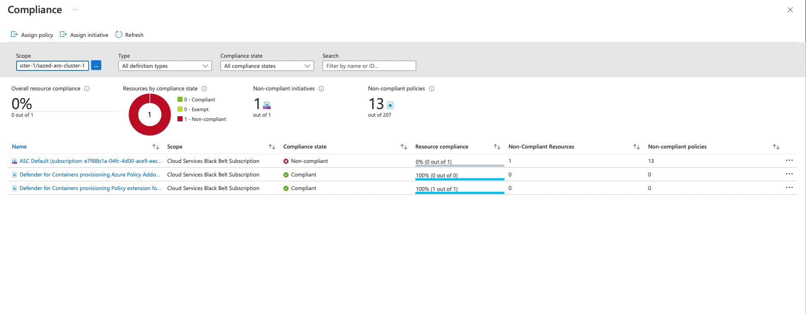

# Integrating Azure ARC with ARO
In this section of the workshop, we will integrate ARO cluster with Azure Arc-enabled Kubernetes. When you connect a Kubernetes/OpenShift cluster with Azure Arc, it will:

- Be represented in Azure Resource Manager with a unique ID
- Be place in an Azure subscription and resource group 
- Receive tags just like any otherAzure resource

Azure Arc-enabled Kubernetes supports the following scenarios for connected clusters:

- Connect Kubernetes running outside of Azure for inventory, grouping, and tagging.
- Deploy applications and apply configuration using GitOps-based configuration management.
- View and monitor your clusters using Azure Monitor for containers.
- Enforce threat protection using Microsoft Defender for Kubernetes.
- Apply policy definitions using Azure Policy for Kubernetes.
- Use Azure Active Directory for authentication and authorization checks on your cluster


## Prerequisites
* a public ARO cluster
* azure cli 
* oc cli
* An identity (user or service principal) which can be used to log in to Azure CLI and connect your cluster to Azure Arc.


## Enable Extensions and Plugins
Install the connectedk8s Azure Cli extension of version >= 1.2.0

```bash
az extension add --name "connectedk8s"
az extension add --name "k8s-configuration"
az extension add --name "k8s-extension"
```
Register providers for Azure Arc-enabled Kubernetes. Registration may take up to 5 minutes.

```bash 
az provider register --namespace Microsoft.Kubernetes
az provider register --namespace Microsoft.KubernetesConfiguration
az provider register --namespace Microsoft.ExtendedLocation
```

## Connect an existing ARO cluster
Make sure you are logged into your ARO cluster
```bash
kubeadmin_password=$(az aro list-credentials --name <<cluster name>> --resource-group <<resource group name>> --query kubeadminPassword --output tsv)   
apiServer=$(az aro show -g <<resource group name>> -n <<cluster name>> --query apiserverProfile.url -o tsv)

oc login $apiServer -u kubeadmin -p $kubeadmin_password
```

Run the following command:
```bash
az connectedk8s connect --resource-group $resourceGroupName --name $clusterName --distribution openshift --infrastructure auto
```

After running the commnad. grant the following permissions and restart kube-aad-proxy pod
```
oc project azure-arc
oc adm policy add-scc-to-user privileged system:serviceaccount:azure-arc:azure-arc-kube-aad-proxy-sa

oc get pod | grep
kube-aad-proxy-6d9b66b9cd-g27xr              0/2     ContainerCreating   0          26s

oc delete pod kube-aad-proxy-6d9b66b9cd-g27xr  
```

Wait for a few mins and you will see all the pods in ```azure-arc``` namespace running 
```
oc get pods
NAME                                         READY   STATUS    RESTARTS   AGE
cluster-metadata-operator-7dfd94949c-wtvjw   2/2     Running   0          4m47s
clusterconnect-agent-7d78db9859-wzthd        3/3     Running   0          4m47s
clusteridentityoperator-7b96bcb448-hzthh     2/2     Running   0          4m47s
config-agent-dbf66bbc7-r27qs                 2/2     Running   0          4m47s
controller-manager-67547546f-cmlb9           2/2     Running   0          4m47s
extension-manager-548c9d7d6b-jrrdn           2/2     Running   0          4m47s
flux-logs-agent-bb994c74f-m5gdc              1/1     Running   0          4m47s
kube-aad-proxy-6d9b66b9cd-g27xr              2/2     Running   0          3m16s
metrics-agent-7d794679c6-k4b7g               2/2     Running   0          4m47s
resource-sync-agent-bb79c44b8-5brjr          2/2     Running   0          4m47s
```

This commands take about 5 mins to complete. Upon the completion of the command you should see the following output and your cluster under Kubernetes - Azure Arc service in Azure Portal

```
{
  "agentPublicKeyCertificate": "MIICCgKCAgEArNXWSoWVg7q/W5t7vwY24Y8c+dRxy3we/EIRryXx1Orl8GEX94BsHJqvP0iW6ANZ0qoWE675+NR6V3nDMSkis5/aSYMQ8/yWMcUzieKwFfFmTSfCpkzwxy6PSbdRjMwK5H3DDOOXyRQcJV557F5FjHVYfC/0DkPYdhfepcVade+HgOwOOJH28hSNw58pWo/GNNmcwtzFPVdx/TM574CbNVz4OdrtsMy7FKKC63lYW+W3wkzFOqB+qPaITwqwzkruIoSi5HIatONoCPijdTLm3+RoK/CbTYqzHEEId8gFFJd+J4qfSeCYu6jeDNOpwt8DKDLFLvv04oHyxm+Nr34xPBm3+sjggvkLQ5UWpGZ9h7jWTEP2pWEcXF0KqAqAEFPBOOqDKEaYfLtJSJ/yExS1otydDCJEZ1sRPvsjdH5f0DKVXPHgiDa4SoLXomqkarF3g9i6CEK/XE9JTVa8WBJT6wXdXBa0xh8EnzZ9uyVuY1k/2L7d4BR5+sIjqtcDfRSVtxN+LNxgqpo20ltXM1hWkd8WacK7VY+t2lxbYf01zhXWOpaBGgeAMqxqqcHeQor2vzA9PENYYr5zo8eP1LcySmC4LIFiDfN1NxAiZ5SCnrorNFbmrgEDFnWvZzdu2w4r55fsV9qnozUjn6iRqByhyMoeLn5EZLLK5zsW8sA/CeUCAwEAAQ==",
  "agentVersion": null,
  "connectivityStatus": "Connecting",
  "distribution": "OpenShift",
  "id": "/subscriptions/e7f88b1a-04fc-4d00-ace9-eec077a5d6af/resourceGroups/sazed-aro-cluster/providers/Microsoft.Kubernetes/connectedClusters/sazed-aro-cluster",
  "identity": {
    "principalId": "xxxx-xxxx-xxxx-xxxx",
    "tenantId": "xxxx-xxxx-xxxx-xxxx",
    "type": "SystemAssigned"
  },
  "infrastructure": "azure",
  "kubernetesVersion": null,
  "lastConnectivityTime": null,
  "location": "eastus",
  "managedIdentityCertificateExpirationTime": null,
  "name": "sazed-aro-cluster",
  "offering": null,
  "provisioningState": "Succeeded",
  "resourceGroup": "sazed-aro-cluster",
  "systemData": {
    "createdAt": "2022-09-15T19:23:40.540376+00:00",
    "createdBy": "sazed@redhat.com",
    "createdByType": "User",
    "lastModifiedAt": "2022-09-15T19:23:40.540376+00:00",
    "lastModifiedBy": "sazed@redhat.com",
    "lastModifiedByType": "User"
  },
  "tags": {},
  "totalCoreCount": null,
  "totalNodeCount": null,
  "type": "microsoft.kubernetes/connectedclusters"
}
```

To check the status of clusters connected to Azure ARC, run the following command
```
 az connectedk8s list --resource-group <<resource group>> --output table
Name                 Location    ResourceGroup
-------------------  ----------  -------------------
<< cluster name >>>  eastus      << resource group >>
```

## Enable observability 
In order to see ARO resource inside Azure Arc, you need to create a service account and provide it to Azure Arc. 

```bash
oc project azure-arc
oc create serviceaccount azure-arc-observability
oc create clusterrolebinding azure-arc-observability-rb --clusterrole cluster-admin --serviceaccount azure-arc:azure-arc-observability
```

```bash
apiVersion: v1
kind: Secret
metadata:
  name: azure-arc-observability-secret
  namespace: azure-arc
  annotations:
    kubernetes.io/service-account.name: azure-arc-observability
type: kubernetes.io/service-account-token

```

```bash
oc apply -f aro-content/assets/azure-arc-secret.yaml
```

```bash
TOKEN=$(oc get secret azure-arc-observability-secret -o jsonpath='{$.data.token}' | base64 -d | sed 's/$/\\n/g')
echo $TOKEN
```

Copy the token, goto Azure portal and select your cluster under "Kubernetes - Azure Arc"
Select Namespaces from the left side menu and paste the token in "Service account bearer token" input field. 



Now you can see all of your ARO rearouses inside ARC UI. you can see the following resources inside Azure ARC portal:
- Namespaces
- Workloads
- Services and Ingress
- Storage
- Configurations


## Access Secrets from Azure Key Vault
The Azure Key Vault Provider for Secrets Store CSI Driver allows for the integration of Azure Key Vault as a secrets store with a Kubernetes cluster via a CSI volume. For Azure Arc-enabled Kubernetes clusters, you can install the Azure Key Vault Secrets Provider extension to fetch secrets.

### Install extension
```bash
az k8s-extension create --cluster-name <<cluster name>> --resource-group <<resource group>> --cluster-type connectedClusters --extension-type Microsoft.AzureKeyVaultSecretsProvider --name akvsecretsprovider

{
  "aksAssignedIdentity": null,
  "autoUpgradeMinorVersion": true,
  "configurationProtectedSettings": {},
  "configurationSettings": {},
  "customLocationSettings": null,
  "errorInfo": null,
  "extensionType": "microsoft.azurekeyvaultsecretsprovider",
  "id": "/subscriptions/e7f88b1a-04fc-4d00-ace9-eec077a5d6af/resourceGroups/sazed-aro-cluster/providers/Microsoft.Kubernetes/connectedClusters/sazed-aro-cluster-1/providers/Microsoft.KubernetesConfiguration/extensions/akvsecretsprovider",
  "identity": {
    "principalId": "xxxx-xxxx-xxxx-xxxx",
    "tenantId": null,
    "type": "SystemAssigned"
  },
  "installedVersion": null,
  "name": "akvsecretsprovider",
  "packageUri": null,
  "provisioningState": "Succeeded",
  "releaseTrain": "Stable",
  "resourceGroup": "sazed-aro-cluster",
  "scope": {
    "cluster": {
      "releaseNamespace": "kube-system"
    },
    "namespace": null
  },
  "statuses": [],
  "systemData": {
    "createdAt": "2022-09-15T20:45:47.152390+00:00",
    "createdBy": null,
    "createdByType": null,
    "lastModifiedAt": "2022-09-15T20:45:47.152390+00:00",
    "lastModifiedBy": null,
    "lastModifiedByType": null
  },
  "type": "Microsoft.KubernetesConfiguration/extensions",
  "version": "1.3.0"
}
```

Validate the extension installation

```bash
az k8s-extension show --cluster-type connectedClusters --cluster-name <<cluster name>> --resource-group <<resource group>> --name akvsecretsprovider

{
  "aksAssignedIdentity": null,
  "autoUpgradeMinorVersion": true,
  "configurationProtectedSettings": {},
  "configurationSettings": {},
  "customLocationSettings": null,
  "errorInfo": null,
  "extensionType": "microsoft.azurekeyvaultsecretsprovider",
  "id": "/subscriptions/e7f88b1a-04fc-4d00-ace9-eec077a5d6af/resourceGroups/sazed-aro-cluster-1/providers/Microsoft.Kubernetes/connectedClusters/sazed-aro-cluster-1/providers/Microsoft.KubernetesConfiguration/extensions/akvsecretsprovider",
  "identity": {
    "principalId": "xxxx-xxxx-xxxx-xxxx",
    "tenantId": null,
    "type": "SystemAssigned"
  },
  "installedVersion": null,
  "name": "akvsecretsprovider",
  "packageUri": null,
  "provisioningState": "Succeeded",
  "releaseTrain": "Stable",
  "resourceGroup": "sazed-aro-cluster",
  "scope": {
    "cluster": {
      "releaseNamespace": "kube-system"
    },
    "namespace": null
  },
  "statuses": [],
  "systemData": {
    "createdAt": "2022-09-15T20:45:47.152390+00:00",
    "createdBy": null,
    "createdByType": null,
    "lastModifiedAt": "2022-09-15T20:45:47.152390+00:00",
    "lastModifiedBy": null,
    "lastModifiedByType": null
  },
  "type": "Microsoft.KubernetesConfiguration/extensions",
  "version": "1.3.0"
}
```

### Create or Select an Azure Key Vault

```bash
az keyvault create -n <<cluster name>> -g <<resource group>> -l eastus
az keyvault secret set --vault-name <<cluster name>> -n DemoSecret --value MyExampleSecret
```

### Provide identity to access Azure Key Vault

Currently, the Secrets Store CSI Driver on Arc-enabled clusters can be accessed through a service principal. Follow the steps below to provide an identity that can access your Key Vault.

Use the provided Service Principal credentials provided with the lab and create a secret in ARO cluster

```bash
oc create secret generic secrets-store-creds --from-literal clientid="<client-id>" --from-literal clientsecret="<client-secret>"
oc label secret secrets-store-creds secrets-store.csi.k8s.io/used=true
```

Create a SecretProviderClass with the following YAML, filling in your values for key vault name, tenant ID, and objects to retrieve from your AKV instance

```bash
apiVersion: secrets-store.csi.x-k8s.io/v1
kind: SecretProviderClass
metadata:
  name: akvprovider-demo
spec:
  provider: azure
  parameters:
    usePodIdentity: "false"
    keyvaultName: <key-vault-name>
    objects:  |
      array:
        - |
          objectName: DemoSecret
          objectType: secret            
          objectVersion: ""              
    tenantId: <tenant-Id>                
```

```bash
oc apply -f aro-content/assets/azure-arc-secretproviderclass.yaml
```

Create a pod with the following YAML, filling in the name of your identity

```yaml
kind: Pod
apiVersion: v1
metadata:
  name: secret-store-pod
spec:
  containers:
    - name: busybox
      image: k8s.gcr.io/e2e-test-images/busybox:1.29
      command:
        - "/bin/sleep"
        - "10000"
      volumeMounts:
      - name: secrets-store-inline
        mountPath: "/mnt/secrets-store"
        readOnly: true
  volumes:
    - name: secrets-store-inline
      csi:
        driver: secrets-store.csi.k8s.io
        readOnly: true
        volumeAttributes:
          secretProviderClass: "akvprovider-demo"
        nodePublishSecretRef:                       
          name: secrets-store-creds
```

```bash
oc apply -f aro-content/assets/azure-arc-pod.yaml
```

### Validate the secrets
After the pod starts, the mounted content at the volume path specified in your deployment YAML is available.

```bash
## show secrets held in secrets-store
oc exec secret-store-pod -- ls /mnt/secrets-store/
DemoSecret
## print a test secret 'DemoSecret' held in secrets-store
oc exec secret-store-pod -- cat /mnt/secrets-store/DemoSecret
MyExampleSecret
```


## Enable log aggregation 
In order to collect logs from ARO cluster and store it in Azure ARC. configure azure monitor

Create Azure Log Analytics Workspace
```
az monitor log-analytics workspace create --resource-group <<same as above>> --workspace-name loganalyticsworkspace
```
Goto Azure ARC portal and click on ```logs``` 



Click on ```configure azure monitor``` button and select the workspace created in last step and click on configure.



Now you can go see logs and metrics for your cluster.

## Monitor ARO cluster against Goverance Policies
Azure Policy extends Gatekeeper v3, an admission controller webhook for Open Policy Agent (OPA), to apply at-scale enforcements and safeguards on your clusters in a centralized, consistent manner. Azure Policy makes it possible to manage and report on the compliance state of your Kubernetes clusters from one place. The add-on enacts the following functions:
- Checks with Azure Policy service for policy assignments to the cluster.
- Deploys policy definitions into the cluster as constraint template and constraint custom resources.
- Reports auditing and compliance details back to Azure Policy service.

Azure policy plugin is enabled when you connect your ARO cluster with Azure ARC. 


you can click on ```go to Azure Policies``` to look at the policies assigned to your cluster, check their status and attach more policies.



