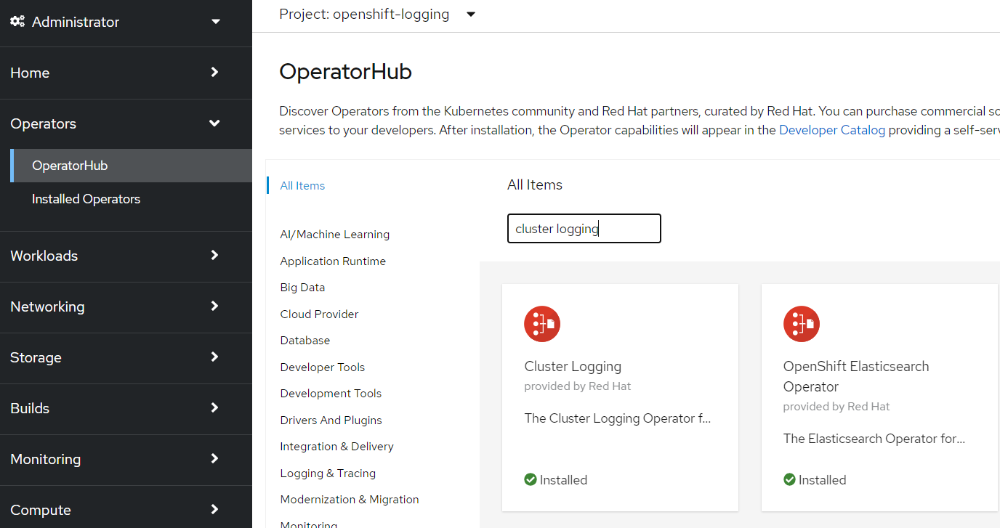
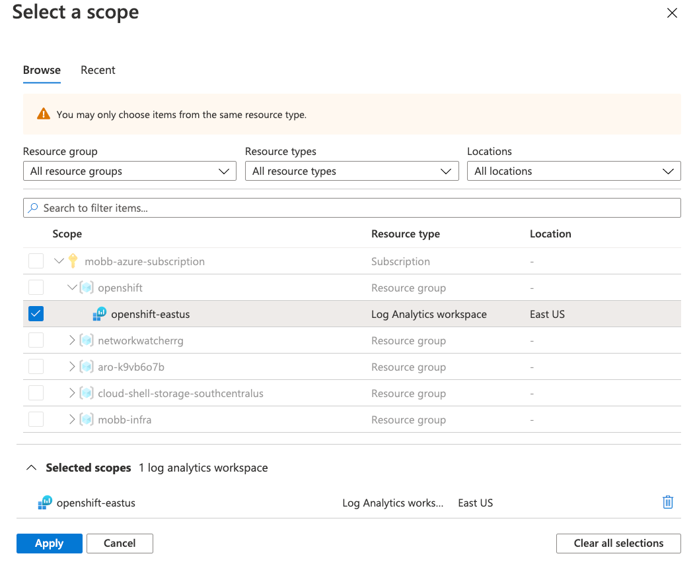

# Using Cluster Logging Forwarder in ARO with Azure Monitor

**Paul Czarkowski, Steve Mirman**

*08/19/2021*

In Azure Red Hat OpenShift (ARO) you can fairly easily set up cluster logging to an in-cluster Elasticsearch using the OpenShift Elasticsearch Operator
and the Cluster Logging Operator, but what if you want to use the Azure native Log Analytics service?

There's a number of ways to do this, for example installing agents onto the VMs (in this case, it would be a DaemonSet with hostvar mounts) but that isn't ideal in a managed system like ARO.

Fluentd is the log collection and forwarding tool used by OpenShift, however it does not have native support for Azure Log Analytics. However Fluent-bit which supports many of the same protocols as Fluentd does have [native support](https://docs.fluentbit.io/manual/pipeline/outputs/azure) for Azure Log Analytics.

Armed with this knowledge we can create a fluent-bit service on the cluster to accept logs from fluentd and forward them to Azure Log Analytics.

## Prepare your ARO cluster

1. [Deploy](/docs/quickstart-aro) an ARO cluster

1. Deploy the OpenShift Elasticsearch Operator and the Red Hat OpenShift Logging Operator from OpenShift's Operator Hub

    

1. Deploy a Cluster Logging resource

    > Note - we're setting Elastic and Kibana replicas to zero, as all we really need in this scenario is Fluentd.

    ```bash
cat << EOF | kubectl apply -f -
apiVersion: logging.openshift.io/v1
kind: ClusterLogging
metadata:
  name: instance
  namespace: openshift-logging
spec:
  collection:
    logs:
      fluentd: {}
      type: fluentd
  logStore:
    elasticsearch:
      nodeCount: 0
      redundancyPolicy: SingleRedundancy
      storage:
        size: 200G
        storageClassName: gp2
    retentionPolicy:
      application:
        maxAge: 7d
    type: elasticsearch
  managementState: Managed
  visualization:
    kibana:
      replicas: 0
    type: kibana
EOF
    ```

## Set up ARO Monitor workspace

1. Add the Azure CLI log extensions

    ```bash
    az extension add --name log-analytics
    ```

1. Set some environment variables to use (these should match your ARO cluster)

    ```bash
    export AZR_RESOURCE_LOCATION=eastus
    export AZR_RESOURCE_GROUP=openshift
    # this value must be unique
    export AZR_LOG_APP_NAME=$AZR_RESOURCE_GROUP-$AZR_RESOURCE_LOCATION
    ```

1. Create resource group

    > **If you want to reuse the same group as your cluster skip this step**

    ```bash
    az group create -n $AZR_RESOURCE_GROUP -l $AZR_RESOURCE_LOCATION
    ```

1. Create workspace

    ```bash
    az monitor log-analytics workspace create \
      -g $AZR_RESOURCE_GROUP -n $AZR_LOG_APP_NAME \
      -l $AZR_RESOURCE_LOCATION
    ```

## Configure OpenShift

> Note if you prefer not to copy and paste, manifests containing these resources can be found in our [github repository](https://github.com/rh-mobb/documentation/tree/main/docs/aro/clf-to-azure).

1. Create Namespace and RBAC

    ```bash
cat << EOF | kubectl apply -f -
apiVersion: v1
kind: Namespace
metadata:
  name: azure-log-forwarder
---
apiVersion: v1
kind: ServiceAccount
metadata:
  name: fluent-bit
  namespace: azure-log-forwarder
---
kind: ClusterRole
apiVersion: rbac.authorization.k8s.io/v1
metadata:
  name: fluent-bit-read
rules:
- apiGroups: [ "" ]
  resources:
  - namespaces
  - pods
  verbs:
  - get
  - watch
  - list
---
kind: ClusterRoleBinding
apiVersion: rbac.authorization.k8s.io/v1
metadata:
  name: fluent-bit-read
roleRef:
  apiGroup: rbac.authorization.k8s.io
  kind: ClusterRole
  name: fluent-bit-read
subjects:
- kind: ServiceAccount
  name: fluent-bit
  namespace: azure-log-forwarder
EOF
    ```

1. Create a secret for your Azure workspace

    ```bash
    WORKSPACE_ID=$(az monitor log-analytics workspace show \
      -g $AZR_RESOURCE_GROUP -n $AZR_LOG_APP_NAME \
      --query customerId -o tsv)
    SHARED_KEY=$(az monitor log-analytics workspace get-shared-keys \
      -g $AZR_RESOURCE_GROUP -n $AZR_LOG_APP_NAME \
      --query primarySharedKey -o tsv)

    kubectl delete secret fluentbit-secrets -n azure-log-forwarder
    kubectl create secret generic fluentbit-secrets -n azure-log-forwarder \
      --from-literal=WorkspaceId=$WORKSPACE_ID \
      --from-literal=SharedKey=$SHARED_KEY

    kubectl get secret fluentbit-secrets -n azure-log-forwarder -o jsonpath='{.data}'
    ```

1. Create fluent-bit config

    ```bash
cat << "EOF" | kubectl apply -f -
apiVersion: v1
kind: ConfigMap
metadata:
  name: fluent-bit-config
  namespace: azure-log-forwarder
  labels:
    k8s-app: fluent-bit
data:
  fluent-bit.conf: |
    [SERVICE]
        Flush         1
        Log_Level     info
        Daemon        off
        Parsers_File  parsers.conf
        HTTP_Server   On
        HTTP_Listen   0.0.0.0
        HTTP_Port     2020
    @INCLUDE input.conf
    @INCLUDE output.conf
  output.conf: |
    [OUTPUT]
        Name            azure
        Match           *.*
        Customer_ID     ${WorkspaceId}
        Shared_Key      ${SharedKey}
        Log_Type        openshift
  input.conf: |
    [INPUT]
        Name              forward
        Listen            0.0.0.0
        Port              24224
        Buffer_Chunk_Size 1M
        Buffer_Max_Size   10M
EOF
    ```

1. Create fluent-bit daemonset

    ```bash
cat << EOF | kubectl apply -f -
apiVersion: apps/v1
kind: DaemonSet
metadata:
  name: fluent-bit
  namespace: azure-log-forwarder
  labels:
    k8s-app: fluent-bit-logging
    version: v1
    kubernetes.io/cluster-service: "true"
spec:
  selector:
    matchLabels:
      k8s-app: fluent-bit-logging
  template:
    metadata:
      labels:
        k8s-app: fluent-bit-logging
        version: v1
        kubernetes.io/cluster-service: "true"
      annotations:
        prometheus.io/scrape: "true"
        prometheus.io/port: "2020"
        prometheus.io/path: /api/v1/metrics/prometheus
    spec:
      serviceAccountName: fluent-bit
      terminationGracePeriodSeconds: 10
      containers:
      - name: fluent-bit
        image: fluent/fluent-bit:1.6
        imagePullPolicy: Always
        ports:
          - containerPort: 2020
          - containerPort: 24224
        env:
        - name: WorkspaceId
          valueFrom:
            secretKeyRef:
              name: fluentbit-secrets
              key: WorkspaceId
        - name: SharedKey
          valueFrom:
            secretKeyRef:
              name: fluentbit-secrets
              key: SharedKey
        - name: LogName
          value: logapp
        volumeMounts:
          - name: fluent-bit-etc
            mountPath: /fluent-bit/etc/
      volumes:
      - name: fluent-bit-etc
        configMap:
            name: fluent-bit-config
EOF
    ```

1. Create a fluent-bit service

    ```bash
cat << EOF | kubectl apply -f -
apiVersion: v1
kind: Service
metadata:
  name: fluent-bit
  namespace: azure-log-forwarder
  labels:
    k8s-app: fluent-bit-logging
    version: v1
    kubernetes.io/cluster-service: "true"
spec:
  selector:
    k8s-app: fluent-bit-logging
  ports:
    - protocol: TCP
      port: 24224
      targetPort: 24224
EOF
    ```

1. Configure cluster logging forwarder

    ```bash
cat << EOF | kubectl apply -f -
apiVersion: logging.openshift.io/v1
kind: ClusterLogForwarder
metadata:
  name: instance
  namespace: openshift-logging
spec:
  outputs:
    - name: fluentbit
      type: fluentdForward
      url: 'tcp://fluent-bit.azure-log-forwarder:24224'
  pipelines:
    - name: forward-to-fluentbit
      inputRefs:
        - infrastructure
        - application
        - audit
      outputRefs:
        - fluentbit
EOF
    ```

## Check for logs in Azure

> Wait 5 to 15 minutes

1. Query our new Workspace

    ```bash
    az monitor log-analytics query -w $WORKSPACE_ID  \
      --analytics-query "openshift_CL | take 10" --output tsv
    ```

  or

  1. Log into [Azure Log Insights](https://portal.azure.com/#blade/Microsoft_Azure_Monitoring/AzureMonitoringBrowseBlade/logs)

  1. Select your workspace
      
  1. Run the Query

      ```
      openshift_CL
        | take 10
      ```
      
