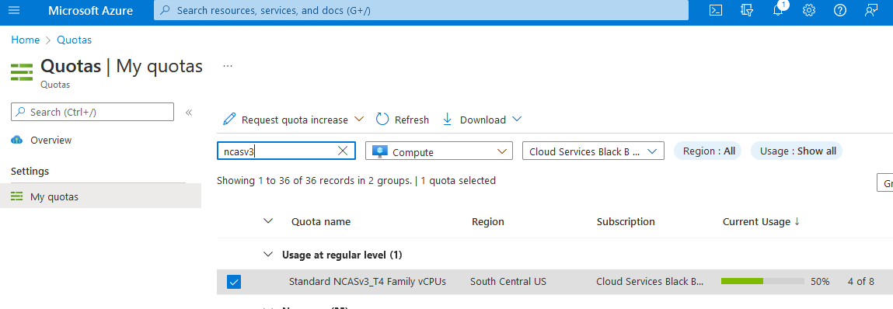
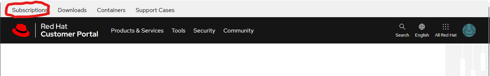
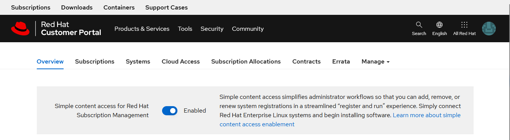

# ARO with Nvidia GPU Workloads

ARO guide to running Nvidia GPU workloads.

Author: [Byron Miller](https://twitter.com/byron_miller)

## Table of Contents

* Do not remove this line (it will not be displayed)
{:toc}

## Prerequisites

* oc cli
* jq, moreutils, and gettext package
* ARO 4.10

If you need to install an ARO cluster, please read our install guide.  In order to keep some of our docs "DRY" we're going to start from an existing ARO 4.10 or higher cluster.

## Log in to your ARO cluster

1. Login to OpenShift - we'll use the kubeadmin account here but you can login with your user account as long as you have cluster-admin.

   ```bash
   apiServer=$(az aro show -g $RESOURCEGROUP -n $CLUSTER --query apiserverProfile.url -o tsv)
   loginCred=$(az aro list-credentials --name $CLUSTER --resource-group $RESOURCEGROUP --query "kubeadminPassword" -o tsv)
   oc login $apiServer -u kubeadmin -p $loginCred
   ```

## GPU Quota

All GPU quotas in Azure are 0 by default. You will need to login to the azure portal and request GPU quota.

ARO supports the following GPU workers
* NC4as T4 v3
* NC8as T4 v3
* NC16as T4 v3
* NC464as T4 v3

>Please remember that when you request quota that Azure is per core.  To request a single NC4as T4 v3 node, you will need to request quota in groups of 4.

1. Login to azure 

   Login to [portal.azure.com](portal.azure.com), type "quotas" in search by, click on Compute and in the search box type "NCAsv3_T4". Select the region your cluster is in (select checkbox) and then click Request quota increase and ask for quota (I chose 8 so i can build two demo clusters).

2. Configure quota
   
   

## OCM and Software Collections Set up

We're going to connect our ARO cluster to cloud.redhat.com and enable the full pull-secret functionality so we can use Software Collections to authorize our worker nodes for libraries needed to compile the Nvidia operator dependencies.

### Enable SCA on Customer Portal Account

1. Login to [access.redhat.com](https://access.redhat.com) as your organizations administrator

1. Click login

   

1. Login with our Red Hat account.

1. Once logged in click on "Subscriptions"

   

1. Ensure Enable SCA is set to "Enabled"

   

### Re-create pull secret (Conditional)

   >If you have already re-created a full pull secret with cloud.redhat.com enabled you can skip this step

1. Log into [cloud.redhat.com](cloud.redhat.com)

1. Browse to https://cloud.redhat.com/openshift/install/azure/aro-provisioned

1. click the **Download pull secret** button and save it as pull-secret.txt

   >The following steps will need to be ran in the same working directory as your pull-secret.txt

1. Export existing pull secret 

   ```bash 
   oc get secret pull-secret -n openshift-config -o json | jq -r '.data.".dockerconfigjson"' | base64 --decode > export-pull.json
   ```

1. Merge downloaded pull secret with system pull secret to add cloud.redhat.com 

   ```bash
   jq -s '.[0] * .[1]' export-pull.json pull-secret.txt | tr -d "\n\r" > new-pull-secret.json
   ```

1. Upload new secret file

   ```bash
   oc set data secret/pull-secret -n openshift-config --from-file=.dockerconfigjson=new-pull-secret.json
   ```

> You may need to wait for about ~1hr for everything to sync up with cloud.redhat.com. 

1. Delete secrets

   ```bash
   rm pull-secret.txt export-pull.json new-pull-secret.json 
   ```

### Setup Simple Content Access  

[Simple Content Access](https://docs.openshift.com/container-platform/4.10/support/remote_health_monitoring/insights-operator-simple-access.html) is a way to automate the GPU worker node entitlements necessary to build the Nvidia operator libraries.

1. Switch to openshift-config project.

   ```bash
   oc project openshift-config
   ```

1. Create secret for Simple Content Access refresh interval.

   ```bash
   oc create secret generic my-secret --from-literal=scaInterval=1h
   ```

###  Optional: If you don't have any RHEL entitlements

If you don't have any RHEL entitlements on your account, please [register for free Developer entitlement](https://developers.redhat.com/register).

This free entitlement will allow you to compile the nvidia operator.

## Generate GPU Machine Set JSON

>I'm exporting a machienset config as json, you can manually do these edits or run the following commands to modify the json file via CLI.

1. View existing machinesets

   >For ease of set up, I'm going to grab the first machineset and use that as the one I will clone to create our GPU machineset.

   ```bash
   MACHINESET=$(oc get machineset -n openshift-machine-api -o=jsonpath='{.items[0]}' | jq -r '[.metadata.name] | @tsv')
   ```

1. Save a copy of example machineset

   ```bash
   oc get machineset -n openshift-machine-api $MACHINESET -o json > gpu_machineset.json
   ```

1. Change the .metadata.name field to a new unique name

   I'm going to echo out the $MACHINESET from command above and modify it for the name that I want to use here of "aro-lab-gpu-mwpgc-nvidia-worker-southcentralus1" that matches some of the other machinesets but gives it an nvidia name.

   ```bash
   echo $MACHINESET
   jq '.metadata.name = "aro-lab-gpu-mwpgc-nvidia-worker-southcentralus1"' gpu_machineset.json| sponge gpu_machineset.json
   ```

1. Ensure spec.replicas matches the desired replica count for the MachineSet

    ```bash
    jq '.spec.replicas = 1' gpu_machineset.json| sponge gpu_machineset.json
    ```
   
1. Change the .spec.selector.matchLabels.machine.openshift.io/cluster-api-machineset field to match the .metadata.name field
   
   ```bash
   jq '.spec.selector.matchLabels."machine.openshift.io/cluster-api-machineset" = "aro-lab-gpu-mwpgc-nvidia-worker-southcentralus1"' gpu_machineset.json| sponge gpu_machineset.json
   ```
  
1. Change the .spec.template.metadata.labels.machine.openshift.io/cluster-api-machineset to match the .metadata.name field

   ```bash
   jq '.spec.template.metadata.labels."machine.openshift.io/cluster-api-machineset" = "aro-lab-gpu-mwpgc-nvidia-worker-southcentralus1"' gpu_machineset.json| sponge gpu_machineset.json
   ```

1. Change the spec.template.spec.providerSpec.value.vmSize to match the desired GPU instance type from Azure.

   >The machine we're using is Standard_NC4as_T4_v3.

   ```bash
   jq '.spec.template.spec.providerSpec.value.vmSize = "Standard_NC4as_T4_v3"' gpu_machineset.json | sponge gpu_machineset.json
   ```

1.  Change the spec.template.spec.providerSpec.value.zone to match the desired zone from Azure

    ```bash
    jq '.spec.template.spec.providerSpec.value.zone = "1"' gpu_machineset.json | sponge gpu_machineset.json
    ```

1. Delete the .status section of the yaml file

   ```bash
   jq 'del(.status)' gpu_machineset.json | sponge gpu_machineset.json
   ```

1. Verify the other data in the yaml file.

   >ARO is not managed by OCM yet, so you must create a machine set to add GPU workers.

### Create GPU machine set

1. Create GPU Machine set

   ```bash
   oc create -f gpu_machineset.json
   ```

   >This command will take a few minutes to complete.

1. Verify GPU machine set

   Machines should be getting deployed. You can view the status of the machine set with the following commands

   ```bash
   oc get machineset -n openshift-machine-api
   oc get machine -n openshift-machine-api
   ```

   Once the machines are provisioned, which could take 5-15 minutes, machines will show as nodes in the node list.

   ```bash
   oc get nodes
   ```

   You should see a node with the "aro-lab-gpu-mwpgc-nvidia-worker-southcentralus1" name it we created earlier.

## Install Node Feature Discovery Operator

Official Documentation for Installing [Node Feature Discovery Operator](https://docs.openshift.com/container-platform/4.10/hardware_enablement/psap-node-feature-discovery-operator.html)

1. Set up Name Space

   ```yaml
   cat <<EOF | oc apply -f -
   apiVersion: v1
   kind: Namespace
   metadata:
     name: openshift-nfd
   EOF
   ```

1. Create OperatorGroup

   ```yaml
   cat <<EOF | oc apply -f -
   apiVersion: operators.coreos.com/v1
   kind: OperatorGroup
   metadata:
     generateName: openshift-nfd-
     name: openshift-nfd
     namespace: openshift-nfd
   spec:
     targetNamespaces:
     - openshift-nfd
   EOF
   ```

1. Create Subscription

   ```yaml
   cat <<EOF | oc apply -f -
   apiVersion: operators.coreos.com/v1alpha1
   kind: Subscription
   metadata:
     name: nfd
     namespace: openshift-nfd
   spec:
     channel: "stable"
     installPlanApproval: Automatic
     name: nfd
     source: redhat-operators
     sourceNamespace: openshift-marketplace
   EOF
   ```
1. Wait for Node Feature discovery to complete installation

   You can login to your openshift console and view operators or simply wait a few minutes. The next step will error until the operator has finished installing.

   ```bash
   oc get subs -n openshift-nfd
   ```

1. Create NFD Instance


   ```yaml
   cat <<EOF | oc apply -f -
   apiVersion: nfd.openshift.io/v1
   kind: NodeFeatureDiscovery
   metadata:
     name: nfd-instance
     namespace: openshift-nfd
   spec:
     instance: "" # instance is empty by default
     topologyupdater: false # False by default
     operand:
       image: registry.redhat.io/openshift4/ose-node-feature-discovery:v4.10
       imagePullPolicy: Always
     workerConfig:
       configData: |
         core:
         #  labelWhiteList:
         #  noPublish: false
           sleepInterval: 60s
         #  sources: [all]
         #  klog:
         #    addDirHeader: false
         #    alsologtostderr: false
         #    logBacktraceAt:
         #    logtostderr: true
         #    skipHeaders: false
         #    stderrthreshold: 2
         #    v: 0
         #    vmodule:
         ##   NOTE: the following options are not dynamically run-time configurable
         ##         and require a nfd-worker restart to take effect after being changed
         #    logDir:
         #    logFile:
         #    logFileMaxSize: 1800
         #    skipLogHeaders: false
         sources:
           cpu:
             cpuid:
         #     NOTE: whitelist has priority over blacklist
               attributeBlacklist:
                 - "BMI1"
                 - "BMI2"
                 - "CLMUL"
                 - "CMOV"
                 - "CX16"
                 - "ERMS"
                 - "F16C"
                 - "HTT"
                 - "LZCNT"
                 - "MMX"
                 - "MMXEXT"
                 - "NX"
                 - "POPCNT"
                 - "RDRAND"
                 - "RDSEED"
                 - "RDTSCP"
                 - "SGX"
                 - "SSE"
                 - "SSE2"
                 - "SSE3"
                 - "SSE4.1"
                 - "SSE4.2"
                 - "SSSE3"
               attributeWhitelist:
           kernel:
             kconfigFile: "/path/to/kconfig"
             configOpts:
               - "NO_HZ"
               - "X86"
               - "DMI"
           pci:
             deviceClassWhitelist:
               - "0200"
               - "03"
               - "12"
             deviceLabelFields:
               - "class"
     customConfig:
       configData: |
             - name: "more.kernel.features"
               matchOn:
               - loadedKMod: ["example_kmod3"]
   EOF
   ```


## Install Nvidia GPU Operator

1. Create Nvidia namespace

   ```yaml
   cat <<EOF | oc apply -f -
   apiVersion: v1
   kind: Namespace
   metadata:
     name: nvidia-gpu-operator
   EOF
   ```

1. Create Operator Group

   ```yaml
   cat <<EOF | oc apply -f -
   apiVersion: operators.coreos.com/v1
   kind: OperatorGroup
   metadata:
     name: nvidia-gpu-operator-group
     namespace: nvidia-gpu-operator
   spec:
    targetNamespaces:
    - nvidia-gpu-operator
   EOF
   ```

1. Get latest nvidia channel

   ```bash
   CHANNEL=$(oc get packagemanifest gpu-operator-certified -n openshift-marketplace -o jsonpath='{.status.defaultChannel}')
   ```

1. Get latest nvidia package

   ```bash
   PACKAGE=$(oc get packagemanifests/gpu-operator-certified -n openshift-marketplace -ojson | jq -r '.status.channels[] | select(.name == "'$CHANNEL'") | .currentCSV')
  
2. Create Subscription

   ```yaml
   envsubst  <<EOF | oc apply -f -
   apiVersion: operators.coreos.com/v1alpha1
   kind: Subscription
   metadata:
     name: gpu-operator-certified
     namespace: nvidia-gpu-operator
   spec:
     channel: "$CHANNEL"
     installPlanApproval: Manual
     name: gpu-operator-certified
     source: certified-operators
     sourceNamespace: openshift-marketplace
     startingCSV: "$PACKAGE"
   EOF
   ```

1. Verify install plan has been created.

   ```bash
   oc get installplan -n nvidia-gpu-operator
   ```

2. Approve install plan

   ```bash
   INSTALL_PLAN=$(oc get installplan -n nvidia-gpu-operator -oname)
   oc patch $INSTALL_PLAN -n nvidia-gpu-operator --type merge --patch '{"spec":{"approved":true }}'
   ```


3. Wait for Operator to finish installing

   >Don't proceed until you have verified that the operator has finished installing.

   

4. Generate Nvidia Config

   We're going to use the default config.  Please feel free to modify if you need to modify. You can also generate this from the console if you want to walk through the GUI approach.

   ```bash
   oc get csv -n nvidia-gpu-operator gpu-operator-certified.v1.10.1 -ojsonpath={.metadata.annotations.alm-examples} | jq .[0] > clusterpolicy.json

5. Apply cluster config

   ```bash
   oc apply -f clusterpolicy.json
   ```

## Validate GPU

1. Create Pod to run a GPU workload

   ```yaml
   cat <<EOF | oc apply -f -
   apiVersion: v1
   kind: Pod
   metadata:
     name: cuda-vector-add
   spec:
     restartPolicy: OnFailure
     containers:
       - name: cuda-vector-add
         image: "quay.io/giantswarm/nvidia-gpu-demo:latest"
         resources:
           limits:
             nvidia.com/gpu: 1
         nodeSelector:
           nvidia.com/gpu.present: true
   EOF
   ```


1. View logs

   ```bash
   oc logs cuda-vector-add
   ```

1. If successful, the pod can be deleted

   ```bash
   oc delete pod cuda-vector-add
   ```