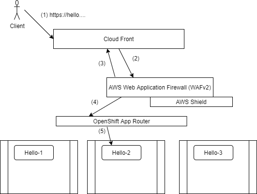

# Using CloudFront + WAF



## Prepartion

1. Create a cluster

    ```bash
    rosa create cluster --cluster-name poc-waf --multi-az \
      --region us-east-2 --version 4.7.9 --compute-nodes 3 \
      --machine-cidr 10.0.0.0/16 --service-cidr 172.30.0.0/16 \
      --pod-cidr 10.128.0.0/14 --host-prefix 23
    ```

1. When its ready create a admin user and follow the instructions to log in

    ```bash
    rosa create admin -c poc-waf
    ```


1. Set some environment variables

    ```bash
    EMAIL=username.taken@gmail.com
    DOMAIN=waf.mobb.ninja
    ```

## Certificate and DNS

1. Use certbot to create a wildcard cert

    ```bash
    certbot certonly --manual \
      --preferred-challenges=dns \
      --email $EMAIL \
      --server https://acme-v02.api.letsencrypt.org/directory \
      --agree-tos \
      --manual-public-ip-logging-ok \
      -d "*.$DOMAIN"
    ```

1. Follow Certbot's instructions to create a DNS TXT record.  certificate records will be saved on your system, in my case in `/etc/letsencrypt/live/waf.mobb.ninja/`. set that as an enviroment variable.

    ```bash
    CERTS=/etc/letsencrypt/live/waf.mobb.ninja
    ```

## Custom OpenShift Domain

1. Create a project and add the certs as a secret

    ```bash
    oc new-project my-custom-route
    oc create secret tls acme-tls --cert=$CERTS/fullchain1.pem --key=$CERTS/privkey1.pem
    ```

1. Create a Custom Domain resource

    ```bash
    cat << EOF | oc apply -f -
    apiVersion: managed.openshift.io/v1alpha1
    kind: CustomDomain
    metadata:
      name: acme
    spec:
      domain: $DOMAIN
      certificate:
        name: acme-tls
        namespace: my-custom-route
    EOF
    ```

1. Wait until your Custom Domain has an Endpoint

    ```bash
    watch  oc get customdomains
    ```

## AWS WAF + CloudFront

1. Create a WAF rule here https://console.aws.amazon.com/wafv2/homev2/web-acls/new?region=us-east-2 and use the Core and SQL Injection rules and set it as a CloudFront distribution resource type.

1. View your WAF

    ```bash
    aws wafv2 list-web-acls --scope REGIONAL --region us-east-2 | jq .
    ```

1. Add a certificate to ACM - https://us-east-2.console.aws.amazon.com/acm/home?region=us-east-1#/importwizard/, Paste in the cert, key, certchain from the files certbot game you.

    > Make sure you create it in the US-EAST-1 region (otherwise cloud front can't use it)

1. Log into the [AWS console and Create a Cloud Front distribution](https://console.aws.amazon.com/cloudfront/home?region=us-east-2#create-distribution:) (make sure its the same region as your cluster).

    * Origin Domain Name: <Endpoint from oc get manageddomains command>
    * Origin Protocol Policy: HTTPS only
    * Viewer Protocol Policy: Redirect HTTP to HTTPS
    * Allowed HTTP Methods: GET, HEAD, OPTIONS, PUT, POST, PATCH, DELETE
    * AWS WAF Web ACL: demo-waf-acl
    * Alternate Domain Names: *.<domain>
    * Custom SSL Certificate: <the one you just imported>
    * Origin Request Policy: create a new policy whitelist: Origin, user-agent, referer, host (**IMPORTANT**)

1. Hit **Create** then wait until the **Status** is *Ready*.


## DNS CNAME

1. Create a CNAME in your DNS provider for *.<$DOMAIN> that points at the endpoint from the above status page. It should look something like `d1vm7mfs9sc24l.cloudfront.net`.

## Deploy an Application

1. Create a new application

    ```bash
    oc new-app --docker-image=docker.io/openshift/hello-openshift
    ```

1. Create a route for the application

    ```bash
    oc create route edge --service=hello-openshift hello-openshift-tls \
        --hostname hello.waf.mobb.ninja
    ```

## Test the WAF

1. Make sure you can access your application with curl

    ```bash
    curl https://hello.waf.mobb.ninja
    ```

    You should get a simple hello response

    ```
    Hello OpenShift!
    ```

1. Try do a XSS injection

    ```bash
    curl -X POST https://hello.waf.mobb.ninja \
      -F "user='<script><alert>Hello></alert></script>'"
    ```

    you should see this

    ```html
    <!DOCTYPE HTML PUBLIC "-//W3C//DTD HTML 4.01 Transitional//EN" "http://www.w3.org/TR/html4/loose.dtd">
    <HTML><HEAD><META HTTP-EQUIV="Content-Type" CONTENT="text/html; charset=iso-8859-1">
    <TITLE>ERROR: The request could not be satisfied</TITLE>
    </HEAD><BODY>
    <H1>403 ERROR</H1>
    ```